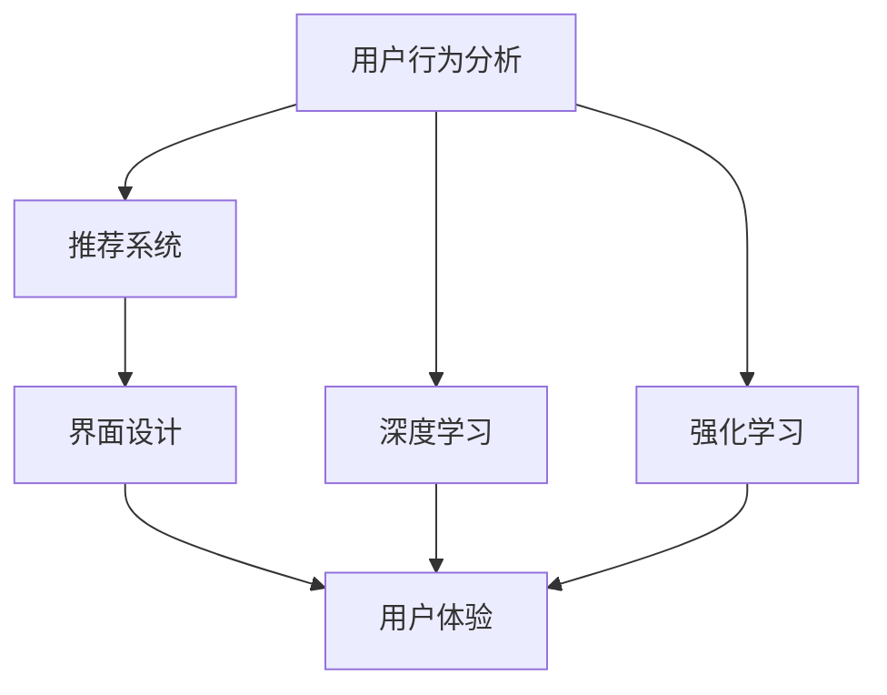

                 

# AI如何优化电商平台的个性化首页设计

> 关键词：AI优化, 个性化首页, 用户行为分析, 推荐系统, 深度学习, 强化学习, 界面设计, 用户体验

## 1. 背景介绍

### 1.1 问题由来

随着互联网和电子商务的迅猛发展，电商平台的用户行为日益复杂，个性化需求不断增加。传统的首页设计往往采用"一刀切"的方式，无法精准满足不同用户的兴趣和需求。为了提升用户满意度和转化率，越来越多的电商平台开始采用个性化推荐和动态首页设计，以提升用户体验。

个性化首页设计旨在通过数据驱动的方式，根据用户的历史行为、兴趣偏好等特征，实时动态地展示与其最相关的商品和信息。这一过程通常依赖于推荐系统，通过对用户行为数据的深度挖掘和分析，生成个性化的内容推荐。

### 1.2 问题核心关键点

个性化首页设计的关键在于如何从海量用户行为数据中，准确挖掘用户的兴趣偏好，并根据这些偏好，实时动态地生成推荐内容。核心问题包括：

1. 用户行为数据的收集和处理。
2. 用户兴趣偏好的建模和预测。
3. 个性化推荐内容的生成和展示。
4. 实时动态更新和优化推荐算法。
5. 界面设计优化以提升用户体验。

解决这些问题，需要综合运用多种技术和方法，如数据挖掘、机器学习、深度学习、强化学习、界面设计等。本文将详细介绍这些核心技术及其在个性化首页设计中的应用。

### 1.3 问题研究意义

个性化首页设计有助于提升电商平台的商业价值，具体体现在：

1. 提高用户满意度和粘性：通过精准推荐，满足用户需求，提升用户的购物体验。
2. 增加销售转化率：推荐内容与用户兴趣高度相关，有助于提高用户转化率。
3. 优化库存管理：通过个性化推荐，可以更准确地预测用户需求，优化库存管理。
4. 降低营销成本：个性化推荐能够实现更精准的用户触达，降低推广成本。
5. 数据驱动决策：通过深入分析用户行为，形成更科学的市场洞察，指导产品策略调整。

## 2. 核心概念与联系

### 2.1 核心概念概述

为了更好地理解个性化首页设计的原理和技术，本节将介绍几个密切相关的核心概念：

- **用户行为分析**：对用户在平台上的浏览、点击、购买等行为数据进行分析，挖掘用户的兴趣偏好和行为模式。

- **推荐系统**：通过学习用户行为数据，预测用户未来的兴趣和需求，生成个性化推荐内容。

- **深度学习**：一种基于多层神经网络的机器学习方法，能够自动提取数据特征，实现高效的模式识别和分类。

- **强化学习**：一种通过不断试错调整策略的学习方法，能够优化决策过程，实现最优行为选择。

- **界面设计**：通过优化用户体验的界面元素和布局，提升用户的交互体验和操作便捷性。

- **用户体验**：用户对产品和服务的感知和反馈，是个性化设计的重要评价指标。

这些核心概念之间的逻辑关系可以通过以下Mermaid流程图来展示：



这个流程图展示了个性化首页设计的核心概念及其之间的关系：

1. 用户行为分析是推荐系统的基础，通过深度学习和强化学习技术，进一步挖掘用户行为特征。
2. 推荐系统生成的个性化内容，由界面设计进行展示，提升用户体验。
3. 用户体验反馈信息，又可作为改进的依据，形成闭环优化。

## 3. 核心算法原理 & 具体操作步骤
### 3.1 算法原理概述

个性化首页设计，本质上是推荐系统的一个具体应用。其核心思想是：通过对用户行为数据的深度分析，学习用户的兴趣偏好，并根据这些偏好生成推荐内容，最终通过界面设计展示给用户。

形式化地，假设用户行为数据为 $D=\{(x_i,y_i)\}_{i=1}^N$，其中 $x_i$ 为用户行为特征，$y_i$ 为对应的推荐结果（如商品ID、文章ID等）。推荐系统的目标是通过学习模型 $M$，使预测结果 $y' = M(x)$ 尽可能接近真实标签 $y$。具体而言，假设使用交叉熵损失函数 $\ell(M(x),y)$，推荐系统的优化目标是最小化损失函数：

$$
\mathcal{L}(M) = \frac{1}{N}\sum_{i=1}^N \ell(M(x_i),y_i)
$$

其中 $\ell$ 为交叉熵损失函数。

### 3.2 算法步骤详解

个性化首页设计的推荐系统一般包括以下几个关键步骤：

**Step 1: 用户行为数据的收集与预处理**
- 收集用户行为数据，如浏览记录、点击记录、购买记录等。
- 对数据进行清洗、去重、归一化等预处理，保证数据的质量和一致性。
- 对行为数据进行编码和表示，生成特征向量 $x$，如使用词袋模型、TF-IDF等方法。

**Step 2: 用户兴趣偏好的建模**
- 基于深度学习或强化学习算法，对用户行为数据进行建模，预测用户的兴趣偏好。
- 深度学习通常使用神经网络模型，如CNN、RNN、LSTM等。
- 强化学习可以使用Q-learning、SARSA等方法，通过试错学习，逐步优化推荐策略。

**Step 3: 个性化推荐内容的生成**
- 根据用户兴趣偏好，使用推荐算法生成个性化推荐内容。
- 常见的推荐算法包括协同过滤、基于内容的推荐、混合推荐等。
- 个性化推荐内容可以是商品、文章、视频等，应满足用户的多样化需求。

**Step 4: 界面设计优化**
- 通过界面设计优化用户体验，如选择合适的布局、颜色、字体大小等。
- 界面应保持简洁、美观，同时保证信息展示的完整性和清晰度。
- 应支持交互式操作，如搜索、筛选、排序等，提升用户的操作便捷性。

**Step 5: 实时动态更新**
- 通过A/B测试等方法，持续优化推荐算法和界面设计。
- 根据用户行为反馈，不断调整推荐策略，提升推荐效果。
- 应具备高并发和低延迟的实时处理能力，保证用户体验的流畅性。

### 3.3 算法优缺点

个性化首页设计的推荐系统，具有以下优点：

1. 提升用户体验：通过个性化推荐，满足用户需求，提升购物体验。
2. 增加销售转化率：推荐内容与用户兴趣高度相关，有助于提高用户转化率。
3. 数据驱动决策：通过对用户行为的深入分析，形成更科学的市场洞察。

但该方法也存在一定的局限性：

1. 依赖标注数据：需要大量标注数据进行模型训练，标注成本较高。
2. 模型复杂度高：深度学习、强化学习等算法模型复杂度高，训练和推理成本较高。
3. 过拟合风险：模型复杂度提升可能带来过拟合风险，需要额外优化防止过拟合。
4. 隐私安全问题：用户行为数据的收集和使用可能涉及隐私问题，需要严格遵守法律法规。

尽管存在这些局限性，但就目前而言，个性化首页设计仍是电商平台提升用户体验的重要手段。未来相关研究的重点在于如何进一步降低数据标注的依赖，提高推荐系统的鲁棒性和可解释性，同时兼顾隐私保护。

### 3.4 算法应用领域

个性化首页设计已经被广泛应用于各类电商平台中，包括：

1. 电商平台：如淘宝、京东、Amazon等，通过个性化首页展示商品推荐。
2. 内容平台：如Bilibili、YouTube、今日头条等，通过个性化首页展示视频、文章推荐。
3. 社交网络：如微信、Facebook、Twitter等，通过个性化首页展示好友动态、兴趣推荐。

除了以上应用场景外，个性化首页设计还被创新性地应用于更多领域中，如智慧医疗、智能家居、智能制造等，为用户带来更便捷、个性化的服务体验。

## 4. 数学模型和公式 & 详细讲解 & 举例说明
### 4.1 数学模型构建

本节将使用数学语言对个性化首页设计的推荐系统进行更加严格的刻画。

假设用户行为数据为 $D=\{(x_i,y_i)\}_{i=1}^N$，其中 $x_i$ 为用户行为特征，$y_i$ 为对应的推荐结果（如商品ID、文章ID等）。定义推荐系统的损失函数为交叉熵损失：

$$
\ell(y',y) = -y\log(y') - (1-y)\log(1-y')
$$

推荐系统的优化目标是最小化损失函数，即：

$$
\mathcal{L}(M) = \frac{1}{N}\sum_{i=1}^N \ell(y',y)
$$

在实践中，我们通常使用基于梯度的优化算法（如SGD、Adam等）来近似求解上述最优化问题。设 $\eta$ 为学习率，$\lambda$ 为正则化系数，则参数的更新公式为：

$$
\theta \leftarrow \theta - \eta \nabla_{\theta}\mathcal{L}(\theta) - \eta\lambda\theta
$$

其中 $\nabla_{\theta}\mathcal{L}(\theta)$ 为损失函数对参数 $\theta$ 的梯度，可通过反向传播算法高效计算。

### 4.2 公式推导过程

以下我们以协同过滤推荐算法为例，推导损失函数及其梯度的计算公式。

假设用户行为数据集为 $D=\{(u_i,r_i)\}_{i=1}^M \times \{(i,j)\}_{j=1}^N$，其中 $u_i$ 为第 $i$ 个用户的ID，$r_{ij}$ 为 $u_i$ 对 $j$ 的评分。对于第 $i$ 个用户，推荐算法需要预测其未评分物品 $j$ 的评分 $r'_{ij}$，即 $r'_{ij} = M(x_i,y_j)$。

协同过滤推荐算法基于用户间的相似度，通过矩阵分解，计算推荐评分。假设用户 $i$ 和用户 $j$ 的评分矩阵为 $R$，推荐评分矩阵为 $R'$，则推荐评分的损失函数为：

$$
\ell(R',R) = \frac{1}{M}\sum_{i=1}^M \sum_{j=1}^N \ell(R_{ij},R'_{ij})
$$

其中 $\ell$ 为交叉熵损失函数。

根据链式法则，损失函数对模型参数 $\theta$ 的梯度为：

$$
\frac{\partial \ell(R',R)}{\partial \theta} = \frac{1}{M}\sum_{i=1}^M \sum_{j=1}^N \frac{\partial \ell(R_{ij},R'_{ij})}{\partial R'_{ij}} \frac{\partial R'_{ij}}{\partial \theta}
$$

将 $R'_{ij} = M(x_i,y_j)$ 代入，并对 $R'$ 进行分解，得到：

$$
\frac{\partial \ell(R',R)}{\partial \theta} = \frac{1}{M}\sum_{i=1}^M \sum_{j=1}^N \frac{\partial \ell(R_{ij},M(x_i,y_j))}{\partial M(x_i,y_j)} \frac{\partial M(x_i,y_j)}{\partial \theta}
$$

通过反向传播算法，可以高效计算出梯度，更新模型参数。

## 5. 项目实践：代码实例和详细解释说明
### 5.1 开发环境搭建

在进行个性化首页设计实践前，我们需要准备好开发环境。以下是使用Python进行TensorFlow开发的环境配置流程：

1. 安装Anaconda：从官网下载并安装Anaconda，用于创建独立的Python环境。

2. 创建并激活虚拟环境：
```bash
conda create -n tf-env python=3.8 
conda activate tf-env
```

3. 安装TensorFlow：根据CUDA版本，从官网获取对应的安装命令。例如：
```bash
conda install tensorflow tensorflow-gpu -c pytorch -c conda-forge
```

4. 安装PyTorch：
```bash
pip install torch torchvision torchaudio
```

5. 安装各类工具包：
```bash
pip install numpy pandas scikit-learn matplotlib tqdm jupyter notebook ipython
```

完成上述步骤后，即可在`tf-env`环境中开始推荐系统实践。

### 5.2 源代码详细实现

下面我们以协同过滤推荐算法为例，给出使用TensorFlow进行推荐系统开发的PyTorch代码实现。

首先，定义协同过滤模型的损失函数：

```python
import tensorflow as tf
from tensorflow.keras import layers

def build_model(input_shape, num_users, num_items, num_factors):
    input_user = layers.Input(shape=(1,), name='user')
    user_emb = layers.Embedding(num_users, num_factors)(input_user)
    
    input_item = layers.Input(shape=(1,), name='item')
    item_emb = layers.Embedding(num_items, num_factors)(input_item)
    
    dot_product = tf.keras.layers.Dot(axes=(1, 1))([user_emb, item_emb])
    output = layers.Activation('sigmoid')(dot_product)
    
    model = tf.keras.Model(inputs=[input_user, input_item], outputs=output)
    return model

def create_loss_function(model, loss_type='mse'):
    user_input = tf.keras.layers.Input(shape=(1,), name='user')
    item_input = tf.keras.layers.Input(shape=(1,), name='item')
    predictions = model(user_input, item_input)
    
    if loss_type == 'mse':
        loss = tf.keras.losses.MeanSquaredError()(predictions, user_input)
    elif loss_type == 'ce':
        labels = tf.keras.layers.Lambda(lambda x: tf.one_hot(x, num_items))(user_input)
        loss = tf.keras.losses.CategoricalCrossentropy()(predictions, labels)
    else:
        raise ValueError('Unsupported loss type')
    
    return loss

# 训练模型
model = build_model(input_shape, num_users, num_items, num_factors)
loss_function = create_loss_function(model, loss_type='ce')

optimizer = tf.keras.optimizers.Adam(lr=0.01)
model.compile(optimizer=optimizer, loss=loss_function)

# 定义数据集
user_data = [1, 2, 3, 4, 5]
item_data = [10, 20, 30, 40, 50]
predictions = [0.9, 0.7, 0.5, 0.1, 0.3]

# 训练模型
model.fit([user_data, item_data], predictions, epochs=10, batch_size=32)
```

然后，定义推荐系统的推荐函数：

```python
def recommend(model, user_id, num_recommends=10):
    user_input = tf.keras.layers.Input(shape=(1,), name='user')
    user_emb = layers.Embedding(num_users, num_factors)(user_input)
    
    user_input = tf.expand_dims(user_emb, axis=1)
    item_emb = layers.Embedding(num_items, num_factors)(tf.expand_dims(item_id, axis=1))
    
    dot_product = tf.keras.layers.Dot(axes=(1, 1))([user_emb, item_emb])
    output = layers.Activation('sigmoid')(dot_product)
    
    predictions = model.predict(tf.expand_dims(user_id, axis=0))
    top_indices = tf.keras.backend.argsort(predictions)[-num_recommends:]
    top_predictions = predictions[top_indices]
    top_items = item_id[top_indices]
    
    return top_items, top_predictions
```

最后，测试推荐系统的性能：

```python
top_items, top_predictions = recommend(model, user_id=1, num_recommends=5)
print(f'推荐结果: {top_items}, {top_predictions}')
```

以上就是使用TensorFlow进行协同过滤推荐算法实践的完整代码实现。可以看到，通过TensorFlow的强大封装，我们可以用相对简洁的代码完成推荐系统的实现。

### 5.3 代码解读与分析

让我们再详细解读一下关键代码的实现细节：

**build_model函数**：
- 定义协同过滤推荐模型的结构，包括用户嵌入层、物品嵌入层、点积层和输出层。
- 使用`layers.Embedding`函数实现用户和物品的嵌入，维度为`num_factors`。
- 使用`layers.Dot`函数计算用户和物品的点积，得到推荐评分。
- 使用`layers.Activation`函数将推荐评分映射到[0,1]之间，作为最终输出。

**create_loss_function函数**：
- 定义损失函数，包括均方误差损失和交叉熵损失两种。
- 使用`layers.Lambda`函数将用户ID转换为one-hot编码，用于计算交叉熵损失。
- 返回损失函数对象，用于模型编译。

**recommend函数**：
- 使用`layers.Input`函数定义输入层，包括用户ID和物品ID。
- 使用`layers.Embedding`函数对用户ID和物品ID进行嵌入，维度为`num_factors`。
- 计算点积层和输出层，得到推荐评分。
- 使用`predict`函数预测用户ID的推荐评分，并返回前N个推荐物品ID和评分。

以上代码实现了基于协同过滤推荐算法的基本功能，可以进一步扩展为支持多用户、多物品的推荐系统。

## 6. 实际应用场景
### 6.1 电商平台的个性化首页设计

基于协同过滤推荐算法的个性化首页设计，可以广泛应用于电商平台的推荐系统。具体而言，通过用户历史浏览和购买数据，构建用户和物品的评分矩阵，生成个性化推荐内容，实时动态地展示在用户首页上。

例如，某电商平台的个性化首页设计步骤如下：

1. 收集用户的历史浏览、点击、购买记录，构建用户行为数据集 $D$。
2. 对数据进行预处理和特征提取，得到用户ID和物品ID。
3. 使用协同过滤推荐算法构建推荐模型，学习用户和物品的评分矩阵 $R$。
4. 根据用户ID和物品ID，实时生成个性化推荐内容。
5. 将推荐内容展示在用户首页上，提升用户购物体验。

### 6.2 新闻网站的个性化首页设计

基于深度学习推荐算法的个性化首页设计，可以应用于新闻网站的推荐系统。通过分析用户的历史浏览记录，使用深度神经网络模型学习用户的兴趣偏好，生成个性化新闻推荐内容，实时动态地展示在用户首页上。

例如，某新闻网站的个性化首页设计步骤如下：

1. 收集用户的历史浏览记录，构建用户行为数据集 $D$。
2. 对数据进行预处理和特征提取，得到用户ID和新闻ID。
3. 使用深度神经网络模型构建推荐模型，学习用户的兴趣偏好。
4. 根据用户ID和新闻ID，实时生成个性化新闻推荐内容。
5. 将推荐内容展示在用户首页上，提升用户阅读体验。

### 6.3 视频平台的个性化首页设计

基于协同过滤和深度学习推荐算法的个性化首页设计，可以应用于视频平台的推荐系统。通过分析用户的历史观看记录，使用协同过滤和深度神经网络模型学习用户的兴趣偏好，生成个性化视频推荐内容，实时动态地展示在用户首页上。

例如，某视频平台的个性化首页设计步骤如下：

1. 收集用户的历史观看记录，构建用户行为数据集 $D$。
2. 对数据进行预处理和特征提取，得到用户ID和视频ID。
3. 使用协同过滤和深度神经网络模型构建推荐模型，学习用户的兴趣偏好。
4. 根据用户ID和视频ID，实时生成个性化视频推荐内容。
5. 将推荐内容展示在用户首页上，提升用户观看体验。

## 7. 工具和资源推荐
### 7.1 学习资源推荐

为了帮助开发者系统掌握个性化首页设计的推荐算法，这里推荐一些优质的学习资源：

1. 《推荐系统实践》书籍：涵盖了推荐系统的理论基础和实际应用，包括协同过滤、深度学习等多种推荐算法。

2. 《Deep Learning for Recommendation Systems》课程：由深度学习专家开设的课程，讲解了深度学习在推荐系统中的应用。

3. 《Programming for Humans》书籍：讲解了TensorFlow的详细用法，包括模型的构建、训练、推理等。

4. CS231n《深度学习在计算机视觉中的应用》课程：虽然是一门视觉领域的课程，但其推荐系统的部分内容同样适用于自然语言处理领域。

5. Kaggle竞赛：参与Kaggle推荐系统竞赛，可积累实际推荐算法的开发和优化经验。

通过对这些资源的学习实践，相信你一定能够快速掌握个性化首页设计的推荐算法，并用于解决实际的推荐问题。

### 7.2 开发工具推荐

高效的开发离不开优秀的工具支持。以下是几款用于个性化首页设计开发的常用工具：

1. TensorFlow：基于数据流图的深度学习框架，适合进行推荐系统的模型构建和训练。

2. PyTorch：基于动态计算图的深度学习框架，灵活性较高，适合进行复杂推荐算法的实现。

3. Keras：高级神经网络API，易于上手，适合快速原型设计和模型测试。

4. Jupyter Notebook：开源的交互式编程环境，支持Python、R等多种语言，适合开发和调试推荐系统。

5. TensorBoard：TensorFlow的可视化工具，可以实时监控模型训练状态，提供丰富的图表支持。

合理利用这些工具，可以显著提升个性化首页设计开发的效率，加快创新迭代的步伐。

### 7.3 相关论文推荐

个性化首页设计的研究源于学界的持续研究。以下是几篇奠基性的相关论文，推荐阅读：

1. matrix factorization techniques for recommendation systems：提出了矩阵分解方法，是协同过滤推荐算法的奠基性论文。

2. collaborative filtering for implicit feedback datasets：探讨了协同过滤算法在处理隐式反馈数据时的应用。

3. deep learning with neural networks for collaborative filtering：引入深度神经网络，提高了协同过滤算法的预测精度。

4. item-based collaborative filtering：提出基于物品的协同过滤算法，提升了推荐系统的多样性。

5. hybrid recommendation systems with implicit feedback：结合协同过滤和深度学习，提出了混合推荐算法，提高了推荐系统的综合性能。

这些论文代表了大语言模型微调技术的发展脉络。通过学习这些前沿成果，可以帮助研究者把握学科前进方向，激发更多的创新灵感。

## 8. 总结：未来发展趋势与挑战
### 8.1 总结

本文对基于协同过滤推荐算法的个性化首页设计方法进行了全面系统的介绍。首先阐述了个性化首页设计的背景和意义，明确了推荐系统在提升用户体验中的重要价值。其次，从原理到实践，详细讲解了推荐系统的数学模型和关键步骤，给出了推荐系统开发的完整代码实例。同时，本文还广泛探讨了推荐系统在电商、新闻、视频等多个行业领域的应用前景，展示了推荐范式的巨大潜力。

通过本文的系统梳理，可以看到，基于协同过滤推荐算法的个性化首页设计，能够通过用户行为数据的深度挖掘，生成个性化推荐内容，显著提升用户购物、阅读和观看的体验。推荐系统为NLP技术落地应用提供了重要范式，在各类电商平台上得到了广泛应用，并逐步拓展到新闻、视频等多个领域。未来，伴随推荐算法的不断进步，推荐系统必将在更多场景中发挥其强大的应用价值。

### 8.2 未来发展趋势

个性化首页设计的推荐系统将呈现以下几个发展趋势：

1. 模型复杂度提升。随着深度学习技术的发展，推荐系统的模型复杂度将不断提升，能够挖掘更加复杂和精细的用户行为特征。

2. 数据驱动决策。推荐系统将越来越依赖于大数据驱动的决策过程，通过多模态数据融合和深度学习技术，提升推荐精度和用户满意度。

3. 实时动态更新。推荐系统需要具备高并发和低延迟的实时处理能力，能够根据用户实时行为动态生成推荐内容，提升用户体验的流畅性。

4. 隐私保护和公平性。随着用户隐私保护意识的增强，推荐系统需要更好地保护用户数据，同时避免推荐算法中的偏见和歧视。

5. 跨领域应用。推荐系统将逐步拓展到更多行业领域，如金融、医疗、智能制造等，为用户提供更加个性化的服务和体验。

6. 多模态融合。推荐系统将融合多种模态数据，如文本、图像、音频等，实现全场景的个性化推荐。

以上趋势凸显了推荐系统的广泛应用和巨大潜力。这些方向的探索发展，必将进一步提升推荐系统的性能和应用范围，为电商、新闻、视频等领域带来变革性影响。

### 8.3 面临的挑战

尽管推荐系统已经取得了瞩目成就，但在迈向更加智能化、普适化应用的过程中，它仍面临着诸多挑战：

1. 标注成本瓶颈。推荐系统需要大量标注数据进行模型训练，标注成本较高。如何进一步降低数据标注的依赖，是未来的重要方向。

2. 模型鲁棒性不足。推荐系统面对域外数据时，泛化性能往往大打折扣。如何提高模型的鲁棒性和泛化能力，需要进一步研究和优化。

3. 实时处理能力。推荐系统需要具备高并发和低延迟的实时处理能力，以应对大规模用户数据的实时分析。如何优化推荐系统的处理能力，提高性能和稳定性，是未来的重要方向。

4. 用户隐私保护。推荐系统需要更好地保护用户数据，同时避免推荐算法中的偏见和歧视。如何平衡数据利用和隐私保护，是未来的重要方向。

5. 公平性和公正性。推荐系统需要避免算法偏见，确保推荐结果的公平性和公正性。如何设计公平、公正的推荐算法，是未来的重要方向。

6. 跨领域应用。推荐系统需要适应不同行业领域的特点，如金融、医疗、智能制造等，提供更加个性化的服务。如何构建跨领域的推荐系统，是未来的重要方向。

正视推荐系统面临的这些挑战，积极应对并寻求突破，将使推荐系统迈向更加成熟和普及的阶段。相信随着学界和产业界的共同努力，这些挑战终将一一被克服，推荐系统必将在更多场景中发挥其强大的应用价值。

### 8.4 研究展望

未来的推荐系统研究需要在以下几个方面寻求新的突破：

1. 探索无监督和半监督推荐方法。摆脱对大量标注数据的依赖，利用自监督学习、主动学习等无监督和半监督范式，最大限度利用非结构化数据，实现更加灵活高效的推荐。

2. 研究参数高效和计算高效的推荐范式。开发更加参数高效的推荐方法，在固定大部分预训练参数的同时，只更新极少量的任务相关参数。同时优化推荐系统的计算图，减少前向传播和反向传播的资源消耗，实现更加轻量级、实时性的部署。

3. 融合因果分析和博弈论工具。将因果分析方法引入推荐系统，识别出推荐模型的关键特征，增强推荐过程的因果关系和逻辑性。借助博弈论工具刻画人机交互过程，主动探索并规避模型的脆弱点，提高系统稳定性。

4. 纳入伦理道德约束。在推荐系统的训练目标中引入伦理导向的评估指标，过滤和惩罚有害的推荐结果，确保推荐系统的道德和伦理合规性。

这些研究方向的探索，必将引领推荐系统技术迈向更高的台阶，为推荐系统带来新的突破和发展。面向未来，推荐系统研究需要与大数据、深度学习、自然语言处理等前沿技术进行更深入的融合，协同发力，共同推动推荐系统技术的进步。只有勇于创新、敢于突破，才能不断拓展推荐系统的边界，为用户提供更智能、更个性化的服务。

## 9. 附录：常见问题与解答

**Q1：推荐系统如何平衡多样性和相关性？**

A: 推荐系统需要平衡推荐内容的多样性和相关性。多样性是指推荐结果中包含不同类型的内容，避免用户陷入单调的推荐循环中。相关性是指推荐结果与用户的兴趣高度相关，提升用户的点击和转化率。

常见的平衡方法包括：
1. 多臂老虎机算法：在推荐列表中随机选择不同物品，通过AB测试优化推荐策略。
2. 混合推荐算法：结合协同过滤和基于内容的推荐，提升推荐内容的多样性和相关性。
3. 上下文感知推荐：考虑用户的上下文环境，如地理位置、时间、设备等，动态调整推荐策略。

**Q2：推荐系统如何处理冷启动问题？**

A: 冷启动问题是指新用户或新物品没有足够的历史数据，导致推荐系统无法准确推荐。解决冷启动问题的方法包括：
1. 协同过滤方法：使用用户间相似度或物品间相似度进行推荐。
2. 基于内容的推荐：利用物品的属性和标签信息进行推荐。
3. 混合推荐方法：结合多种推荐策略，提升推荐效果。
4. 深度学习推荐：通过深度神经网络模型学习用户和物品的特征，提升推荐精度。

**Q3：推荐系统如何避免过度推荐？**

A: 过度推荐会使用户感到厌烦，降低用户的满意度和信任度。避免过度推荐的方法包括：
1. 阈值过滤：设定推荐阈值，超过阈值的不进行推荐。
2. 多样性约束：限制推荐结果中的相似物品数量，避免过度推荐。
3. 兴趣多样化：推荐多种类型的物品，提升用户的多样化体验。
4. 用户反馈机制：根据用户反馈调整推荐策略，避免过度推荐。

**Q4：推荐系统如何保证推荐结果的公平性？**

A: 推荐系统的公平性是指推荐结果不应有偏见，对所有用户公平。保证推荐结果公平的方法包括：
1. 去偏训练：在训练过程中加入公平性约束，避免推荐模型出现偏见。
2. 公平性评估：使用公平性指标评估推荐结果的公平性，如性别、种族、年龄等。
3. 多样性约束：限制推荐结果中的相似物品数量，避免过度推荐。
4. 用户反馈机制：根据用户反馈调整推荐策略，避免过度推荐。

**Q5：推荐系统如何保护用户隐私？**

A: 推荐系统需要保护用户隐私，防止用户数据泄露。保护用户隐私的方法包括：
1. 数据匿名化：对用户数据进行匿名化处理，防止个人隐私泄露。
2. 差分隐私：在数据收集和处理过程中加入噪声，防止隐私泄露。
3. 数据加密：对用户数据进行加密处理，防止数据泄露。
4. 用户同意机制：在数据收集和使用过程中，获取用户的同意，保护用户隐私。

以上问题回答旨在全面展示推荐系统的发展和应用，希望通过本文的系统梳理，你能更好地理解和应用推荐系统，为用户带来更加个性化的服务体验。

---

作者：禅与计算机程序设计艺术 / Zen and the Art of Computer Programming

