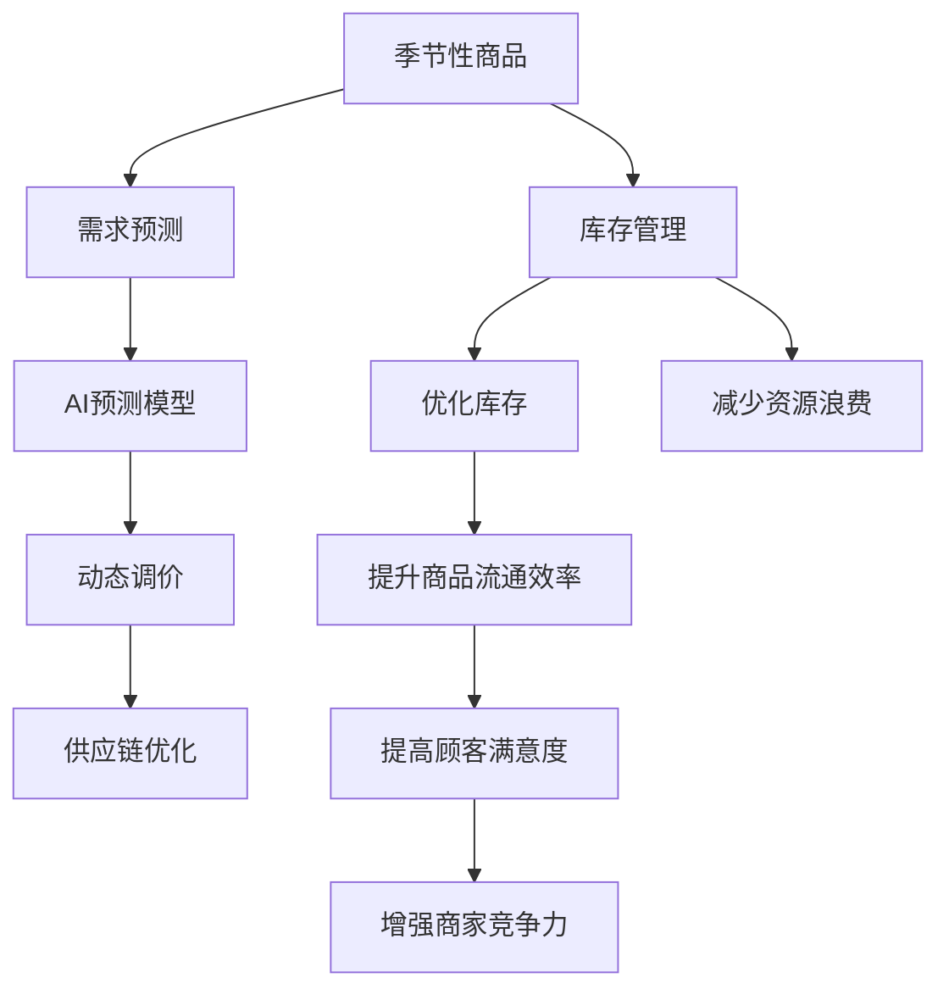

                 

# AI如何优化电商平台的季节性商品库存管理

随着电子商务的蓬勃发展，电商平台逐渐成为消费者购买商品的重要渠道。然而，电商平台的季节性商品管理仍然是一个巨大的挑战，由于其销量波动性大，库存管理不当不仅会导致资源浪费，还可能影响用户体验和商家利润。AI技术在预测、库存优化和供应链管理中的应用，正在逐步改变这一现状。本文将详细探讨AI如何优化电商平台的季节性商品库存管理，介绍相关核心概念和算法，并通过代码实例进行说明。

## 1. 背景介绍

### 1.1 问题由来

电商平台商品种类繁多，尤其是一些季节性商品如服装、家居用品、节庆装饰等，其销量通常与季节、节假日紧密相关。随着季节变化和市场趋势的调整，这些商品的销量会呈现明显的波动。库存管理不当将导致商品积压或缺货，严重影响销售和利润。

### 1.2 问题核心关键点

解决电商平台季节性商品库存管理的关键在于：

- 准确预测商品需求，减少库存偏差。
- 优化库存水平，减少资源浪费。
- 动态调整供应链，提升商品流通效率。
- 提升顾客满意度，增强商家竞争力。

### 1.3 问题研究意义

电商平台季节性商品库存管理涉及预测、优化和调整等多个环节，AI技术可以通过其强大的数据分析和模型训练能力，在预测销量、优化库存、提升供应链效率等方面发挥重要作用。研究如何通过AI优化电商平台库存管理，对于提高商品流通效率、降低运营成本、增强顾客体验和商家收益具有重要意义。

## 2. 核心概念与联系

### 2.1 核心概念概述

为更好地理解AI如何优化电商平台季节性商品库存管理，本节将介绍几个密切相关的核心概念：

- 季节性商品(In-season Goods)：指销量随季节、节假日、天气等因素呈现显著波动变化的商品。
- 库存管理(Inventory Management)：通过有效控制库存水平，避免过量采购和缺货，提升供应链效率。
- 需求预测(Demand Forecasting)：利用历史数据和统计模型预测未来商品需求。
- AI预测模型(AI Prediction Models)：通过机器学习和深度学习算法，构建预测商品需求和库存变化的模型。
- 动态调价(Dynamic Pricing)：根据市场需求和库存水平，动态调整商品价格。
- 供应链优化(Supply Chain Optimization)：通过优化商品采购、存储和配送流程，提高供应链效率。

这些概念之间的逻辑关系可以通过以下Mermaid流程图来展示：



这个流程图展示了几大核心概念及其之间的联系：

1. 季节性商品通过需求预测和AI预测模型进行销量和库存变化预测。
2. 库存管理通过优化库存和减少资源浪费，提升商品流通效率。
3. 动态调价和供应链优化进一步提升库存管理和顾客满意度。
4. 最终提升商家竞争力，增强平台的用户粘性。

## 3. 核心算法原理 & 具体操作步骤

### 3.1 算法原理概述

AI优化电商平台季节性商品库存管理，本质上是一个基于时间序列数据的预测和优化问题。其核心思想是通过历史销量数据和相关影响因素，建立预测模型，预测未来需求和库存水平，并通过优化算法动态调整库存和价格。

### 3.2 算法步骤详解

**Step 1: 数据收集与预处理**
- 收集历史销售数据、天气数据、节假日数据、市场趋势等，进行数据清洗和特征工程，构建预测所需的时间序列数据。
- 将数据划分为训练集、验证集和测试集，用于模型训练、调参和性能评估。

**Step 2: 选择预测模型**
- 根据数据特点，选择合适的预测模型，如ARIMA、LSTM、Gated Recurrent Unit (GRU)等时间序列模型。
- 对于非线性、高阶时间序列，使用深度学习模型进行预测，如RNN、CNN-LSTM等。

**Step 3: 模型训练与调参**
- 使用训练集数据训练模型，选择适当的优化算法和损失函数。
- 根据验证集性能调整模型参数，如学习率、网络结构、特征选择等。
- 使用正则化技术，如L2正则化、Dropout，防止过拟合。

**Step 4: 库存优化与调价**
- 根据预测结果，动态调整库存水平，避免过量采购和缺货。
- 利用动态调价模型，根据需求和库存水平，动态调整商品价格，提升销售利润。

**Step 5: 供应链优化**
- 优化商品采购和配送流程，减少运输成本和存储费用。
- 利用供应链管理软件，如SAP、Oracle等，实时监控供应链状态，提升整体效率。

**Step 6: 模型评估与迭代**
- 在测试集上评估模型性能，使用均方根误差(RMSE)、平均绝对误差(MAE)等指标衡量预测准确度。
- 根据评估结果，迭代优化模型，改进预测效果。

### 3.3 算法优缺点

AI优化电商平台季节性商品库存管理具有以下优点：
1. 准确预测需求，减少库存偏差，提高库存管理效率。
2. 动态调价和优化库存，降低运营成本，提升销售利润。
3. 优化供应链流程，提升整体效率，增强商家竞争力。
4. 提升顾客满意度，增强平台用户粘性。

同时，该方法也存在一定的局限性：
1. 数据质量要求高，需要高质量、完整的历史销售和市场数据。
2. 模型复杂度高，需要大量计算资源进行训练和优化。
3. 模型解释性不足，预测结果难以直观理解。
4. 难以应对突发事件，如疫情、自然灾害等。

尽管存在这些局限性，但就目前而言，基于AI的库存管理方法仍是最主流范式。未来相关研究的重点在于如何进一步降低数据需求，提高模型可解释性和鲁棒性，同时兼顾多目标优化等前沿问题。

### 3.4 算法应用领域

基于AI的电商平台季节性商品库存管理方法，已经广泛应用于各类电商平台的运营中，具体应用场景包括：

- 服装和时尚产品：预测季节性服装需求，优化库存，提升顾客满意度。
- 家电和家居用品：预测节日促销期间的销量，优化库存和调价策略，提升销售利润。
- 电子产品：预测技术更新和新品发布，优化库存和调价，提升市场竞争力。
- 旅游和酒店：预测旅游旺季和节假日需求，优化库存和调价，提升客户体验。

除了上述这些经典应用场景外，AI库存管理技术还将在更多领域得到应用，如供应链金融、智能仓储、个性化推荐等，为电商平台运营带来新的突破。

## 4. 数学模型和公式 & 详细讲解 & 举例说明

### 4.1 数学模型构建

本节将使用数学语言对基于AI的电商平台季节性商品库存管理方法进行更加严格的刻画。

假设历史销售数据为 $y_t=\{y_{t-1}, y_{t-2}, ..., y_{t-M}\}$，其中 $M$ 为历史窗口长度，$y_t$ 为第 $t$ 天的销售量。影响销售量的因素包括历史销售、市场趋势、节假日等，可以用一个向量 $\mathbf{X}_t$ 来表示。因此，预测模型可以表示为：

$$
\hat{y}_t = f(\mathbf{X}_t; \theta)
$$

其中 $\theta$ 为模型参数，$f(\cdot)$ 为预测函数。在实践中，通常使用时间序列模型或深度学习模型进行预测。

### 4.2 公式推导过程

以下我们以季节性商品需求预测为例，推导ARIMA模型的预测公式及其梯度计算。

假设需求服从ARIMA模型，即：

$$
y_t = \phi_1y_{t-1} + \phi_2y_{t-2} + ... + \phi_My_{t-M} + \epsilon_t
$$

其中 $\phi_i$ 为ARIMA模型系数，$\epsilon_t$ 为随机误差项。将上式改写为矩阵形式：

$$
\mathbf{y}_t = \Phi\mathbf{y}_{t-M} + \mathbf{\epsilon}_t
$$

其中 $\Phi$ 为系数矩阵，$\mathbf{y}_{t-M}$ 为历史需求向量，$\mathbf{\epsilon}_t$ 为随机误差向量。

对于时间序列数据 $\mathbf{y}_t$ 和 $\mathbf{X}_t$，预测模型可以表示为：

$$
\hat{y}_t = f(\mathbf{X}_t; \theta) = \hat{A}\mathbf{y}_{t-M} + \hat{B}\mathbf{X}_t + \hat{C}
$$

其中 $\hat{A}$、$\hat{B}$ 和 $\hat{C}$ 为模型参数。

预测模型的梯度计算公式为：

$$
\frac{\partial \mathcal{L}(\theta)}{\partial \theta} = -\frac{1}{N}\sum_{t=1}^N \frac{\partial \hat{y}_t}{\partial \theta} (y_t - \hat{y}_t)
$$

其中 $N$ 为样本数量，$\mathcal{L}(\theta)$ 为损失函数，$(\cdot - \cdot)$ 表示预测误差。

### 4.3 案例分析与讲解

以某电商平台销售数据分析为例，假设有以下历史数据：

| 日期    | 销量    | 天气    | 节假日    | 促销活动    |
| ------ | ------ | ------ | ------ | ------ |
| 2021-04-01 | 100    | 晴     | 无     | 无     |
| 2021-04-02 | 150    | 晴     | 无     | 无     |
| ...      | ...    | ...    | ...    | ...    |

假设我们使用ARIMA模型进行需求预测，模型的训练过程如下：

1. 数据预处理：将数据转换为时间序列，计算历史窗口长度 $M=3$，得到训练集 $\mathbf{X}_t$ 和 $\mathbf{y}_t$。
2. 模型训练：使用训练集数据，通过最小化损失函数，更新模型参数 $\theta$。
3. 模型评估：在验证集上评估模型性能，调整模型参数。
4. 库存管理：根据预测结果，动态调整库存水平。

例如，若模型预测 2021-04-03 的销量为 200，则可以提前采购，避免库存不足。

## 5. 项目实践：代码实例和详细解释说明

### 5.1 开发环境搭建

在进行库存管理实践前，我们需要准备好开发环境。以下是使用Python进行Pandas、Scikit-learn、TensorFlow等库的环境配置流程：

1. 安装Anaconda：从官网下载并安装Anaconda，用于创建独立的Python环境。

2. 创建并激活虚拟环境：
```bash
conda create -n inventory-env python=3.8 
conda activate inventory-env
```

3. 安装依赖库：
```bash
conda install pandas scikit-learn tensorflow
```

4. 安装TensorFlow Addons等扩展库：
```bash
pip install tensorflow-addons
```

完成上述步骤后，即可在`inventory-env`环境中开始库存管理实践。

### 5.2 源代码详细实现

下面我们以使用LSTM模型进行需求预测为例，给出使用TensorFlow进行库存管理的PyTorch代码实现。

首先，定义数据处理函数：

```python
import pandas as pd
import numpy as np
from sklearn.preprocessing import MinMaxScaler
from tensorflow.keras.models import Sequential
from tensorflow.keras.layers import LSTM, Dense

def load_data(file_path, window_size=30):
    df = pd.read_csv(file_path, index_col='date', parse_dates=True)
    df['feature'] = MinMaxScaler().fit_transform(df['销量'].values.reshape(-1, 1))
    df['weather'] = MinMaxScaler().fit_transform(df['天气'].values.reshape(-1, 1))
    df['holiday'] = MinMaxScaler().fit_transform(df['节假日'].values.reshape(-1, 1))
    df['promotion'] = MinMaxScaler().fit_transform(df['促销活动'].values.reshape(-1, 1))
    X = df['feature'].iloc[:, -window_size:].values
    y = df['feature'].iloc[:, -1].values
    return X, y
```

然后，定义模型和优化器：

```python
model = Sequential()
model.add(LSTM(64, input_shape=(window_size, 4), return_sequences=True))
model.add(LSTM(32))
model.add(Dense(1))

model.compile(optimizer='adam', loss='mean_squared_error')
```

接着，定义训练和评估函数：

```python
def train_epoch(model, X_train, y_train, X_valid, y_valid):
    history = model.fit(X_train, y_train, validation_data=(X_valid, y_valid), epochs=10, batch_size=32, verbose=0)
    return history.history

def evaluate(model, X_test, y_test):
    mse = model.evaluate(X_test, y_test)
    print(f'Test MSE: {mse:.4f}')
```

最后，启动训练流程并在测试集上评估：

```python
X_train, y_train = load_data('train.csv')
X_valid, y_valid = load_data('valid.csv')
X_test, y_test = load_data('test.csv')

history = train_epoch(model, X_train, y_train, X_valid, y_valid)
evaluate(model, X_test, y_test)
```

以上就是使用LSTM模型进行需求预测的完整代码实现。可以看到，TensorFlow库使得模型的构建和训练变得非常简洁高效。

### 5.3 代码解读与分析

让我们再详细解读一下关键代码的实现细节：

**load_data函数**：
- 数据预处理：将日期转换为时间序列，使用MinMaxScaler对数据进行归一化。
- 构造训练集和测试集：从数据中提取历史窗口数据作为输入特征，目标变量为当前的销量。

**模型定义**：
- 使用LSTM网络，先使用一个具有64个神经元的LSTM层，再使用一个具有32个神经元的LSTM层，最后使用一个具有1个神经元的Dense层。
- 编译模型，使用Adam优化器和均方误差损失函数。

**训练和评估函数**：
- 使用fit函数进行模型训练，返回训练过程中的损失和验证集损失。
- 使用evaluate函数评估模型在测试集上的性能，输出测试集的均方误差。

**训练流程**：
- 加载训练集和验证集数据。
- 在训练集上训练模型，并在验证集上进行性能评估。
- 在测试集上再次评估模型性能，输出最终的预测结果。

## 6. 实际应用场景

### 6.1 智能仓库管理

智能仓库管理系统通过AI优化库存水平，实现自动补货、库存预警等功能，提升仓库管理效率。通过实时监控库存和销售数据，系统可以预测未来需求，自动生成补货单，确保商品充足供应。此外，系统还可以根据历史数据和市场趋势，调整补货周期和库存水平，减少库存积压和缺货现象。

### 6.2 定制化推荐系统

电商平台通过AI优化库存管理，可以更精准地进行商品推荐。系统可以根据用户浏览历史和购买行为，预测用户可能感兴趣的商品，并根据库存情况进行动态推荐。同时，系统还可以通过优化库存和调价，提升推荐的个性化程度，提升用户购买转化率。

### 6.3 动态调价与促销策略

基于AI预测模型，电商平台可以实时监控商品库存和市场需求，动态调整商品价格。对于库存充足、需求低迷的商品，可以降低价格，促进销售。对于库存紧张、需求旺盛的商品，可以适度提升价格，增加利润。系统还可以根据节假日和促销活动，自动调整价格策略，提升促销效果。

### 6.4 未来应用展望

随着AI技术的不断进步，未来电商平台季节性商品库存管理将迎来更多创新和突破。例如：

- 引入增强学习，优化动态调价和库存管理策略。
- 结合物联网技术，实时监控商品状态，提升供应链透明度。
- 引入区块链技术，增强库存数据的安全性和不可篡改性。
- 引入多模态数据，结合天气、社交媒体等数据，提升预测准确度。

这些技术手段的引入，将进一步提升电商平台的库存管理效率和用户体验。

## 7. 工具和资源推荐

### 7.1 学习资源推荐

为了帮助开发者系统掌握AI优化库存管理的方法，这里推荐一些优质的学习资源：

1. 《Python数据科学手册》：详细介绍了Python数据处理和机器学习库的使用，涵盖数据清洗、特征工程、模型训练等内容。
2. 《深度学习》课程：由斯坦福大学开设，涵盖深度学习的基本概念和经典模型，适合初学者入门。
3. TensorFlow官方文档：提供了详尽的API文档和案例代码，适合快速上手TensorFlow。
4. 《TensorFlow实战》书籍：由Google官方团队编写，介绍了TensorFlow的使用方法和最佳实践。
5. Kaggle竞赛：参加Kaggle数据科学竞赛，通过实践积累经验，提升解决问题的能力。

通过对这些资源的学习实践，相信你一定能够快速掌握AI优化库存管理的精髓，并用于解决实际的电商库存问题。

### 7.2 开发工具推荐

高效的开发离不开优秀的工具支持。以下是几款用于AI库存管理开发的常用工具：

1. Python：通用编程语言，支持数据处理和机器学习。
2. Pandas：数据处理库，支持时间序列数据处理和特征工程。
3. Scikit-learn：机器学习库，提供丰富的机器学习算法和工具。
4. TensorFlow：深度学习框架，支持模型的构建和训练。
5. TensorFlow Addons：TensorFlow扩展库，提供更多深度学习模型和工具。

合理利用这些工具，可以显著提升AI库存管理的开发效率，加快创新迭代的步伐。

### 7.3 相关论文推荐

AI库存管理技术的快速发展得益于学界的持续研究。以下是几篇奠基性的相关论文，推荐阅读：

1. Granger Causality and Error Correcting Mechanisms (ECM) in ARIMA Models（Granger因果和误差修正模型在ARIMA中的应用）。
2. Long Short-Term Memory（LSTM：长短期记忆网络）。
3. Transformer in NLP（Transformer在自然语言处理中的应用）。
4. Reinforcement Learning for Supply Chain Management（强化学习在供应链管理中的应用）。

这些论文代表了AI库存管理技术的发展脉络。通过学习这些前沿成果，可以帮助研究者把握学科前进方向，激发更多的创新灵感。

## 8. 总结：未来发展趋势与挑战

### 8.1 总结

本文对AI优化电商平台季节性商品库存管理进行了全面系统的介绍。首先阐述了季节性商品库存管理的背景和意义，明确了AI技术在预测、库存优化和供应链管理中的应用价值。其次，从原理到实践，详细讲解了预测模型和优化算法的构建和应用。并通过代码实例进行说明。同时，本文还探讨了AI库存管理在电商、智能仓储、推荐系统等多个领域的应用前景，展示了其广阔的想象空间。

通过本文的系统梳理，可以看到，AI优化库存管理技术在提高供应链效率、降低运营成本、提升顾客体验等方面具有重要意义。未来，随着AI技术的不断进步，其应用领域将不断拓展，为电商平台运营带来更多创新和突破。

### 8.2 未来发展趋势

展望未来，AI库存管理技术将呈现以下几个发展趋势：

1. 预测模型更加精准。随着深度学习和大数据技术的不断进步，预测模型的准确度将进一步提升，可以更准确地预测未来需求和库存水平。
2. 动态调价更加灵活。结合增强学习算法，系统可以根据实时数据和用户行为，动态调整商品价格，提升促销效果。
3. 库存管理更加智能化。引入物联网、区块链等技术，实时监控库存状态，提升供应链透明度和安全性。
4. 多模态数据融合。结合天气、社交媒体等多源数据，提升库存管理的全面性和预测准确度。

以上趋势凸显了AI优化库存管理技术的广阔前景。这些方向的探索发展，必将进一步提升电商平台的运营效率和用户体验，推动智能物流和供应链管理的进步。

### 8.3 面临的挑战

尽管AI优化库存管理技术已经取得了显著成果，但在迈向更加智能化、普适化应用的过程中，仍面临诸多挑战：

1. 数据质量和完整性。高质量、完整的历史数据是预测模型的基础，但电商平台往往面临数据不完整、噪声较多的问题。如何改进数据采集和预处理方法，提升数据质量，是一个重要课题。
2. 模型复杂度。深度学习模型的复杂度较高，训练和优化过程需要大量的计算资源。如何简化模型结构，提高训练效率，是一个亟待解决的问题。
3. 模型解释性。AI预测模型往往被视为"黑盒"系统，难以直观理解其内部工作机制和决策逻辑。如何提高模型的可解释性，增强系统的透明度和可信度，还需要更多的研究。
4. 技术鲁棒性。AI模型在面对突发事件、市场变化时，可能出现预测偏差和鲁棒性不足。如何设计更加鲁棒的模型，增强系统应对风险的能力，是一个重要的研究方向。

尽管存在这些挑战，但随着技术的不断进步，相信这些挑战终将一一被克服，AI优化库存管理技术必将在电商、智能仓储、供应链管理等多个领域发挥更加重要的作用。

### 8.4 研究展望

未来，AI优化库存管理技术还需要在以下几个方面寻求新的突破：

1. 引入增强学习算法，优化库存和调价策略，提高系统自适应能力。
2. 结合区块链技术，增强库存数据的透明性和不可篡改性。
3. 引入多模态数据，结合天气、社交媒体等数据，提升预测准确度。
4. 开发轻量级模型，提升系统实时性和鲁棒性。
5. 增强模型可解释性，提升系统的透明度和可信度。

这些研究方向的探索，必将引领AI优化库存管理技术迈向更高的台阶，为电商平台运营带来更多创新和突破。只有勇于创新、敢于突破，才能不断拓展AI库存管理技术的边界，让智能技术更好地服务于现实世界。

## 9. 附录：常见问题与解答

**Q1：如何选择合适的预测模型？**

A: 选择合适的预测模型需要考虑多个因素，如数据特点、预测目标、计算资源等。一般来说，对于非线性、高阶时间序列数据，使用深度学习模型如LSTM、GRU等；对于线性时间序列数据，使用ARIMA、ETS等经典模型。在实际应用中，还需要结合数据质量、样本量等因素进行综合选择。

**Q2：模型参数如何优化？**

A: 模型参数优化通常采用梯度下降等优化算法，如Adam、SGD等。在训练过程中，需要调整学习率、批量大小、迭代轮数等超参数，防止过拟合和欠拟合。同时，使用正则化技术如L2正则、Dropout等，提升模型鲁棒性。在模型评估时，可以使用交叉验证等方法进行参数调优。

**Q3：预测模型如何部署？**

A: 预测模型的部署需要考虑模型的推理速度和资源占用。通常将模型保存为TensorFlow SavedModel格式，使用TensorFlow Serving进行推理部署。同时，可以使用TensorFlow Addons等工具，进行模型压缩、优化等操作，提升模型的实时性和可扩展性。

**Q4：库存管理中如何平衡库存水平？**

A: 平衡库存水平需要综合考虑需求预测、供应链效率和成本等因素。通常根据历史数据和市场趋势，设置合理的安全库存和最低库存水平，避免过量采购和缺货。同时，结合动态调价策略，通过调整价格提升库存周转率，减少库存积压和缺货现象。

**Q5：预测模型如何应对突发事件？**

A: 预测模型应对突发事件的关键在于数据采集和模型更新。通过及时更新数据和模型，可以提升模型对突发事件的预测能力。同时，结合增强学习算法，动态调整模型参数，提升系统应对风险的能力。在模型评估时，可以使用异常检测等方法，及时发现和修正预测偏差。

这些问题的解答，可以帮助开发者更好地理解AI优化库存管理的核心概念和算法，进一步提升模型的预测准确度和应用效果。

---

作者：禅与计算机程序设计艺术 / Zen and the Art of Computer Programming

