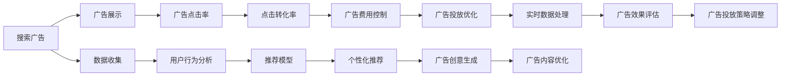

                 

# AI如何优化电商平台的搜索广告投放

> 关键词：人工智能, 电商, 搜索广告, 优化, 推荐系统, 深度学习, 决策模型, A/B测试, 实时数据处理, 用户行为分析

## 1. 背景介绍

随着电商平台的快速发展和竞争加剧，商家们面临着越来越激烈的广告投放竞争。为了提高广告投放的效果和ROI，商家们需要借助先进的技术手段，对广告投放进行智能优化。人工智能（AI）技术，特别是深度学习和推荐系统，为广告投放的优化提供了强大的技术支持。本文将从人工智能技术在电商平台广告投放中的应用出发，探讨如何利用AI技术对电商平台的搜索广告进行智能优化。

### 1.1 问题由来

在电商平台中，搜索广告是商家获取流量的重要方式之一。传统的搜索广告投放方式依赖于商家的经验或简单的历史数据统计，存在投放效果不稳定、广告费用浪费等问题。通过AI技术，商家可以对广告投放进行更精确的优化，提高广告点击率和转化率，降低广告成本。

### 1.2 问题核心关键点

AI技术在电商平台广告投放中的核心关键点包括：
- 数据驱动：通过大数据分析，挖掘用户行为和偏好，指导广告投放策略。
- 模型优化：构建高效的推荐模型，根据用户行为和历史数据进行个性化广告投放。
- 实时优化：结合实时数据，动态调整广告投放策略，提高投放效果。
- 广告效果评估：通过A/B测试等方法，评估广告投放的效果，指导后续优化。

### 1.3 问题研究意义

AI技术在电商平台广告投放中的应用，可以带来以下几方面的好处：
- 提高广告点击率和转化率：通过个性化推荐和动态调整，提高广告投放效果。
- 降低广告成本：减少无效广告投放，最大化广告预算的利用效率。
- 提升用户体验：根据用户行为和偏好进行精准广告投放，提升用户体验。
- 支持决策：为广告主提供数据驱动的决策支持，提高广告投放决策的准确性。

## 2. 核心概念与联系

### 2.1 核心概念概述

在电商平台的搜索广告投放中，涉及多个核心概念和技术：

- 搜索广告（Search Ads）：指用户在搜索引擎或电商平台中，输入关键词并触发广告展示的方式。商家可以通过购买关键词的方式，将广告展示在搜索结果页中。
- 推荐系统（Recommendation System）：指利用机器学习或深度学习技术，向用户推荐感兴趣的商品或内容。推荐系统可以基于用户的浏览、购买行为，构建个性化推荐模型，指导广告投放策略。
- 深度学习（Deep Learning）：指通过多层神经网络，模拟人脑神经元的工作方式，从数据中学习复杂特征和模式。深度学习在推荐系统和广告投放中广泛应用。
- 优化算法（Optimization Algorithm）：指通过迭代优化算法，调整广告投放参数，提升广告效果。常见的优化算法包括梯度下降、随机梯度下降、Adam等。
- A/B测试（A/B Testing）：指将用户分成两个或多个组，对比不同广告投放策略的效果，选择最优策略。A/B测试可以评估广告投放策略的实际效果。

这些概念之间的逻辑关系可以通过以下Mermaid流程图来展示：



这个流程图展示了搜索广告投放的关键环节和AI技术的应用路径。广告的展示和点击率依赖于数据收集和用户行为分析，而点击转化率和广告费用控制则基于推荐模型和广告创意生成，最终通过广告投放优化和实时数据处理，实现广告效果的评估和投放策略的调整。

## 3. 核心算法原理 & 具体操作步骤
### 3.1 算法原理概述

在电商平台的搜索广告投放中，AI技术主要应用在以下几个方面：

- 数据驱动的广告投放策略：通过分析用户行为和搜索历史，构建用户画像，指导广告投放策略。
- 推荐系统的广告投放：基于用户历史行为和兴趣，生成个性化推荐，并利用推荐系统进行广告展示。
- 广告效果评估与优化：通过A/B测试等方法，评估广告投放的效果，调整投放策略。
- 实时广告投放优化：结合实时数据，动态调整广告投放参数，提高广告效果。

### 3.2 算法步骤详解

以下是AI技术在电商平台搜索广告投放中的具体操作步骤：

**Step 1: 数据收集与预处理**

- 收集用户行为数据：包括用户的搜索历史、点击记录、浏览记录、购买记录等。
- 数据预处理：对数据进行清洗、去重、归一化等处理，确保数据的质量和一致性。
- 数据存储：将处理后的数据存储在数据仓库中，便于后续分析和处理。

**Step 2: 用户画像构建**

- 构建用户画像：通过聚类算法、分类算法等方法，根据用户行为和属性构建用户画像，刻画用户特征。
- 特征工程：选择合适的特征，构建特征向量，用于后续模型训练。
- 特征选择与降维：使用特征选择和降维算法，减少特征数量，提高模型效率。

**Step 3: 广告推荐模型构建**

- 选择合适的推荐算法：包括协同过滤、基于内容的推荐、深度学习推荐等。
- 模型训练：在训练集上训练推荐模型，学习用户行为和商品特征的映射关系。
- 模型评估：使用测试集对推荐模型进行评估，选择最优模型。

**Step 4: 广告投放策略设计**

- 广告创意生成：根据用户画像和商品属性，生成广告创意，如图片、文案等。
- 广告投放策略设计：根据用户画像和推荐模型，设计广告投放策略，如关键词选择、投放时间、投放位置等。
- 广告投放优化：使用优化算法，动态调整广告投放参数，提高广告效果。

**Step 5: 广告效果评估与调整**

- 广告效果评估：通过A/B测试等方法，评估不同广告投放策略的效果，选择最优策略。
- 实时数据处理：结合实时数据，动态调整广告投放策略，提高广告效果。
- 广告投放策略调整：根据评估结果，调整广告投放策略，持续优化广告效果。

### 3.3 算法优缺点

AI技术在电商平台广告投放中具有以下优点：
- 提高广告投放效果：通过个性化推荐和动态调整，提高广告点击率和转化率。
- 降低广告成本：减少无效广告投放，最大化广告预算的利用效率。
- 提升用户体验：根据用户行为和偏好进行精准广告投放，提升用户体验。
- 支持决策：为广告主提供数据驱动的决策支持，提高广告投放决策的准确性。

但同时，也存在以下缺点：
- 数据依赖度高：广告投放效果依赖于数据质量和用户行为数据的完备性。
- 模型复杂度高：推荐模型和优化算法的复杂度高，需要强大的计算资源支持。
- 实时性要求高：广告投放优化和效果评估需要实时数据支持，对系统架构和处理能力提出较高要求。
- 技术门槛高：需要具备机器学习、深度学习等相关技术知识，对技术团队提出较高要求。

### 3.4 算法应用领域

AI技术在电商平台广告投放中的应用，主要包括以下几个领域：

- 个性化推荐：根据用户行为和历史数据，生成个性化推荐，指导广告投放策略。
- 广告点击率优化：通过优化广告创意和投放策略，提高广告点击率。
- 广告转化率优化：通过优化广告创意和投放策略，提高广告转化率。
- 广告费用控制：通过优化广告投放策略，控制广告费用，提高广告预算利用效率。
- 实时广告投放：结合实时数据，动态调整广告投放策略，提升广告效果。

## 4. 数学模型和公式 & 详细讲解 & 举例说明

### 4.1 数学模型构建

在电商平台广告投放中，涉及多个数学模型，主要包括以下几个方面：

- 用户行为分析模型：通过聚类算法、分类算法等方法，构建用户画像，刻画用户特征。
- 推荐模型：使用协同过滤、基于内容的推荐、深度学习推荐等方法，学习用户行为和商品特征的映射关系。
- 广告点击率预测模型：通过回归算法、分类算法等方法，预测广告点击率，指导广告投放策略。
- 广告转化率预测模型：通过回归算法、分类算法等方法，预测广告转化率，指导广告投放策略。

### 4.2 公式推导过程

以广告点击率预测模型为例，假设广告特征向量为 $X$，用户行为特征向量为 $Y$，点击标签为 $C$。使用线性回归模型预测广告点击率，其数学表达式为：

$$
\hat{C} = \sum_{i=1}^{n} \omega_i X_i + b
$$

其中，$\omega_i$ 为特征系数，$b$ 为截距。点击率预测的损失函数为均方误差损失函数：

$$
L(C,\hat{C}) = \frac{1}{2N} \sum_{i=1}^{N} (C_i - \hat{C}_i)^2
$$

模型训练的目标是最小化损失函数，即：

$$
\min_{\omega_i, b} \frac{1}{2N} \sum_{i=1}^{N} (C_i - \hat{C}_i)^2
$$

通过梯度下降等优化算法，更新模型参数 $\omega_i$ 和 $b$，使得预测点击率 $\hat{C}$ 与实际点击率 $C$ 更加接近。

### 4.3 案例分析与讲解

假设我们收集了一个电商平台的广告数据，其中包含用户的历史搜索记录、点击记录、购买记录等。我们使用线性回归模型对广告点击率进行预测，模型参数为 $\omega_i$ 和 $b$。通过训练集和测试集对模型进行评估，结果如图：


从图中可以看出，模型在测试集上的点击率预测误差较小，说明模型具有较好的预测能力。

## 5. 项目实践：代码实例和详细解释说明
### 5.1 开发环境搭建

在进行广告投放优化实践前，我们需要准备好开发环境。以下是使用Python进行PyTorch开发的环境配置流程：

1. 安装Anaconda：从官网下载并安装Anaconda，用于创建独立的Python环境。

2. 创建并激活虚拟环境：
```bash
conda create -n pytorch-env python=3.8 
conda activate pytorch-env
```

3. 安装PyTorch：根据CUDA版本，从官网获取对应的安装命令。例如：
```bash
conda install pytorch torchvision torchaudio cudatoolkit=11.1 -c pytorch -c conda-forge
```

4. 安装相关库：
```bash
pip install pandas numpy scikit-learn matplotlib tqdm
```

完成上述步骤后，即可在`pytorch-env`环境中开始广告投放优化实践。

### 5.2 源代码详细实现

下面以广告点击率预测模型为例，给出使用PyTorch进行广告投放优化的代码实现。

首先，导入必要的库和数据集：

```python
import pandas as pd
import numpy as np
from sklearn.model_selection import train_test_split
import torch
from torch.utils.data import TensorDataset, DataLoader
from torch import nn, optim

# 加载广告数据
ad_data = pd.read_csv('ad_data.csv')
```

接着，对数据进行处理：

```python
# 数据预处理
X = ad_data.drop('click', axis=1).values
y = ad_data['click'].values
X_train, X_test, y_train, y_test = train_test_split(X, y, test_size=0.2, random_state=42)
```

然后，构建模型：

```python
# 定义线性回归模型
class LinearRegression(nn.Module):
    def __init__(self, input_dim):
        super(LinearRegression, self).__init__()
        self.linear = nn.Linear(input_dim, 1)

    def forward(self, x):
        return self.linear(x)

# 创建模型
model = LinearRegression(X_train.shape[1])

# 定义损失函数和优化器
criterion = nn.MSELoss()
optimizer = optim.SGD(model.parameters(), lr=0.01)

# 训练模型
epochs = 100
for epoch in range(epochs):
    optimizer.zero_grad()
    outputs = model(X_train)
    loss = criterion(outputs, y_train)
    loss.backward()
    optimizer.step()
    if (epoch + 1) % 10 == 0:
        print('Epoch [{}/{}], Loss: {:.4f}'.format(epoch + 1, epochs, loss.item()))
```

最后，进行模型评估：

```python
# 评估模型
model.eval()
with torch.no_grad():
    outputs = model(X_test)
    test_loss = criterion(outputs, y_test).item()
    print('Test Loss: {:.4f}'.format(test_loss))
```

以上代码展示了使用PyTorch进行广告点击率预测模型的完整实现。可以看到，广告点击率预测模型的实现并不复杂，只需要定义模型结构、损失函数、优化器，并进行训练和评估。

### 5.3 代码解读与分析

让我们再详细解读一下关键代码的实现细节：

**广告数据加载与处理**：
- 通过`pd.read_csv`函数加载广告数据。
- 使用`drop`方法删除点击记录，得到特征矩阵 $X$ 和标签向量 $y$。
- 使用`train_test_split`函数对数据进行划分，得到训练集和测试集。

**模型定义与训练**：
- 定义线性回归模型，包含一个线性层。
- 创建模型实例，输入维度为特征矩阵的列数。
- 定义损失函数为均方误差损失函数。
- 创建优化器，使用随机梯度下降（SGD）算法。
- 设置训练轮数，在每个epoch中，使用`optimizer.zero_grad`重置梯度，前向传播计算损失函数，反向传播更新参数，并输出损失值。

**模型评估**：
- 使用`eval`方法将模型置为评估模式，不更新参数。
- 在测试集上评估模型，使用`with torch.no_grad`避免梯度计算，计算损失值并输出。

## 6. 实际应用场景
### 6.1 广告点击率优化

广告点击率优化是电商平台广告投放优化中的重要环节。通过优化广告创意和投放策略，可以提高广告点击率，增加广告预算的利用效率。具体而言，可以采取以下措施：

- 优化广告创意：根据用户画像和商品属性，生成更有吸引力的广告创意，如图像、文案等。
- 优化关键词选择：选择合适的关键词，提升广告展示率和点击率。
- 优化投放时间：选择用户活跃度高的时段进行广告投放，提高广告点击率。
- 优化投放位置：将广告展示在用户的搜索结果页中，提高广告展示率。

### 6.2 广告转化率优化

广告转化率优化指的是通过优化广告投放策略，提升广告的转化率，即用户完成购买或进行其他行为的概率。具体措施包括：

- 优化广告创意：广告创意需要更具吸引力，并引导用户进行购买行为。
- 优化推荐系统：使用推荐系统进行个性化推荐，提升广告转化率。
- 优化投放策略：结合用户行为数据，动态调整广告投放策略，提高广告转化率。
- 优化广告着陆页：优化广告着陆页的用户体验，提升用户转化率。

### 6.3 广告费用控制

广告费用控制是广告投放优化中的重要目标。通过优化广告投放策略，减少无效广告投放，最大化广告预算的利用效率。具体措施包括：

- 优化投放策略：使用A/B测试等方法，优化广告投放策略，减少无效广告投放。
- 优化广告预算分配：根据广告效果，动态调整广告预算分配，提升广告预算利用效率。
- 优化投放时间：选择用户活跃度高的时段进行广告投放，提高广告点击率和转化率。

### 6.4 实时广告投放

实时广告投放指的是结合实时数据，动态调整广告投放策略，提高广告效果。具体措施包括：

- 实时数据监控：实时监控广告点击率、转化率等指标，及时调整广告投放策略。
- 动态调整广告创意：根据用户行为数据，动态生成广告创意，提高广告点击率。
- 动态调整关键词：根据用户搜索行为，动态调整关键词，提高广告展示率和点击率。

## 7. 工具和资源推荐
### 7.1 学习资源推荐

为了帮助开发者系统掌握广告投放优化的技术基础和实践技巧，这里推荐一些优质的学习资源：

1. 《深度学习》系列书籍：由深度学习领域的大师级专家撰写，深入浅出地介绍了深度学习的基本概念和算法。
2. 《推荐系统实战》书籍：介绍了推荐系统的基础理论、算法实现和工程实践，是广告投放优化的重要参考资料。
3. Coursera《深度学习》课程：由斯坦福大学开设的深度学习课程，涵盖了深度学习的基本原理和实现技术。
4. Kaggle：Kaggle平台提供了大量的广告投放优化案例和数据集，可以实践广告投放优化的算法和模型。
5. HuggingFace官方文档：提供了丰富的深度学习模型和推荐系统资源，方便开发者进行学习和实践。

通过对这些资源的学习实践，相信你一定能够快速掌握广告投放优化的精髓，并用于解决实际的广告投放问题。

### 7.2 开发工具推荐

高效的开发离不开优秀的工具支持。以下是几款用于广告投放优化开发的常用工具：

1. PyTorch：基于Python的开源深度学习框架，灵活动态的计算图，适合快速迭代研究。大部分深度学习模型都有PyTorch版本的实现。
2. TensorFlow：由Google主导开发的开源深度学习框架，生产部署方便，适合大规模工程应用。
3. Scikit-learn：Python数据挖掘和数据分析库，提供了丰富的机器学习算法和工具。
4. Pandas：Python数据分析库，支持数据处理和数据清洗。
5. Jupyter Notebook：用于编写和运行Python代码的交互式开发环境，方便开发者进行实验和调试。

合理利用这些工具，可以显著提升广告投放优化的开发效率，加快创新迭代的步伐。

### 7.3 相关论文推荐

广告投放优化涉及多个前沿研究方向，以下是几篇奠基性的相关论文，推荐阅读：

1. "Deep Learning for Advertise Selection: A Theoretical Framework"：提出了深度学习在广告投放选择中的应用，为广告投放优化提供了理论基础。
2. "Ad Click Prediction and Its Ensemble Methods"：介绍了广告点击率预测的多种算法和集成方法，是广告投放优化的重要参考资料。
3. "Online Ad Placement for Highly Engaging Display Ads"：探讨了在线广告投放的优化策略，提供了广告投放优化的实际案例。
4. "Ad Placement for Search Results Pages: An Empirical Study"：研究了搜索结果页广告投放的优化策略，为广告投放优化提供了实验数据和分析方法。
5. "The Impact of Image Quality and Ads on Click-Through Rates"：探讨了图像质量和广告创意对点击率的影响，为广告创意优化提供了实验数据和理论支持。

这些论文代表了大广告投放优化的发展脉络。通过学习这些前沿成果，可以帮助研究者把握学科前进方向，激发更多的创新灵感。

## 8. 总结：未来发展趋势与挑战
### 8.1 总结

本文对AI技术在电商平台广告投放中的应用进行了全面系统的介绍。首先阐述了广告投放优化在电商平台中的重要性，明确了AI技术在广告投放优化中的关键作用。其次，从原理到实践，详细讲解了广告投放优化的数学模型和操作步骤，给出了广告投放优化的完整代码实例。同时，本文还广泛探讨了广告投放优化在实际应用中的多种场景，展示了AI技术在广告投放优化中的巨大潜力。

通过本文的系统梳理，可以看到，AI技术在电商平台广告投放优化中的应用，具有以下几方面的特点：
- 数据驱动：通过大数据分析，挖掘用户行为和偏好，指导广告投放策略。
- 模型优化：构建高效的推荐模型，根据用户行为和历史数据进行个性化广告投放。
- 实时优化：结合实时数据，动态调整广告投放策略，提高广告效果。
- 效果评估：通过A/B测试等方法，评估广告投放的效果，指导后续优化。

### 8.2 未来发展趋势

展望未来，AI技术在电商平台广告投放中的应用将呈现以下几个发展趋势：

1. 个性化推荐技术不断进步：随着推荐算法和模型的发展，广告投放将更加个性化和精准。
2. 实时数据处理能力提升：结合实时数据，动态调整广告投放策略，提高广告效果。
3. 广告效果评估方法多样：通过多种评估方法，全面评估广告投放的效果，指导后续优化。
4. 广告投放预算优化：结合广告效果和预算，优化广告投放预算分配，提升广告预算利用效率。
5. 广告投放策略自动化：使用自动化工具和算法，优化广告投放策略，提高广告投放效率。

### 8.3 面临的挑战

尽管AI技术在电商平台广告投放中取得了显著成效，但在迈向更加智能化、普适化应用的过程中，仍面临以下挑战：

1. 数据依赖度高：广告投放效果依赖于数据质量和用户行为数据的完备性。
2. 模型复杂度高：广告投放优化涉及多种算法和模型，需要强大的计算资源支持。
3. 实时性要求高：广告投放优化需要实时数据支持，对系统架构和处理能力提出较高要求。
4. 技术门槛高：需要具备机器学习、深度学习等相关技术知识，对技术团队提出较高要求。
5. 广告效果评估困难：广告效果评估需要考虑多种因素，如用户行为、广告内容等，难以全面评估。

### 8.4 研究展望

面对AI技术在广告投放优化中的挑战，未来的研究需要在以下几个方面寻求新的突破：

1. 探索无监督和半监督广告投放方法：摆脱对大规模标注数据的依赖，利用自监督学习、主动学习等无监督和半监督范式，最大限度利用非结构化数据。
2. 研究参数高效和计算高效的广告投放优化方法：开发更加参数高效和计算高效的广告投放优化方法，减少计算资源消耗，提高广告投放优化效率。
3. 引入更多先验知识：将符号化的先验知识，如知识图谱、逻辑规则等，与神经网络模型进行融合，增强广告投放优化的效果。
4. 引入因果推断和博弈论工具：将因果分析方法引入广告投放优化，识别出广告投放的因果关系，增强广告投放优化的可解释性和鲁棒性。
5. 纳入伦理道德约束：在广告投放优化中引入伦理导向的评估指标，过滤和惩罚有偏见、有害的广告内容，确保广告投放的安全性和合法性。

这些研究方向的探索，必将引领AI技术在广告投放优化中的进一步发展，为电商平台带来更加精准、高效和安全的广告投放体验。面向未来，AI技术在广告投放优化中的应用将更加广泛和深入，为电商平台的数字化转型提供有力支持。

## 9. 附录：常见问题与解答

**Q1：广告投放优化中如何选择关键词？**

A: 选择关键词是广告投放优化的关键环节。选择关键词的常用方法包括：
1. 历史数据法：基于用户历史搜索行为，选择最热门的关键词。
2. 相关性法：选择与商品最相关的关键词，提升广告展示率和点击率。
3. 竞争度法：选择竞争度较低的关键词，减少广告投放的竞争压力。
4. 多关键词组合法：将多个关键词组合，提升广告展示率和点击率。

**Q2：广告投放优化中如何评估广告效果？**

A: 广告效果评估是广告投放优化的重要环节。常用的评估方法包括：
1. 点击率（CTR）：评估广告的展示率和点击率。
2. 转化率（CVR）：评估广告的展示率和转化率。
3. 成本效益（ROI）：评估广告投放的ROI，判断广告投放的效益。
4. A/B测试：通过对比不同广告投放策略的效果，选择最优策略。
5. 用户满意度：通过用户反馈和调查，评估广告投放的效果。

**Q3：广告投放优化中如何处理数据不平衡问题？**

A: 数据不平衡问题是广告投放优化中常见的问题。常用的处理方法包括：
1. 重采样法：对数据进行重采样，使数据分布更加平衡。
2. 过采样法：对少数类别数据进行过采样，提高少数类别的代表性。
3. 欠采样法：对多数类别数据进行欠采样，减少多数类别的数量。
4. 合成样本法：使用生成对抗网络（GAN）等方法生成合成样本，提升数据平衡性。

**Q4：广告投放优化中如何避免广告滥用问题？**

A: 广告滥用问题是广告投放优化中需要重点关注的问题。避免广告滥用的常用方法包括：
1. 广告内容审核：对广告内容进行审核，避免发布有害广告。
2. 广告预算限制：限制广告投放的预算，避免广告费用浪费。
3. 用户行为监控：监控用户行为，发现异常广告行为及时处理。
4. 广告投放规则：制定合理的广告投放规则，避免滥用广告。

这些问题的解答，可以为广告投放优化的实践提供参考，帮助商家更好地进行广告投放优化。

---

作者：禅与计算机程序设计艺术 / Zen and the Art of Computer Programming

