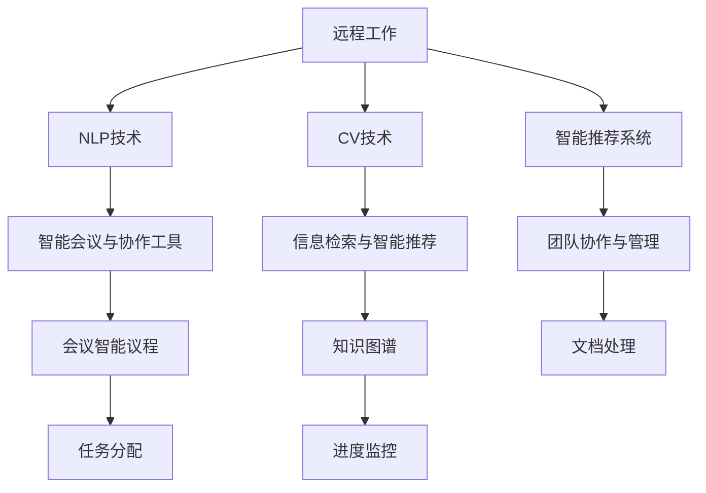

                 

## 1. 背景介绍

### 1.1 问题由来

近年来，全球化和技术进步推动了远程工作（Remote Work）的迅猛发展。疫情期间，远程工作成为许多组织应对危机、保障业务连续性的必要选择。据统计，全球有超过 30% 的员工在疫情期间转向远程工作，并预计这一趋势将在后疫情时代延续下去。

远程工作能够减少通勤时间，提升员工工作满意度，同时为企业节省办公成本。然而，其挑战也显而易见：远程工作难以复制传统办公室的即时沟通和协作方式，导致团队协作效率下降，项目进度难以监控。如何利用人工智能（AI）技术来提升远程工作的协作效率，成为当下研究的热点。

### 1.2 问题核心关键点

远程协作中，关键问题在于如何有效沟通、协同作业、提高信息获取效率、以及确保项目进度和质量。AI技术能够通过自然语言处理（NLP）、计算机视觉（CV）、智能推荐系统等手段，帮助远程工作者克服这些难题，实现高效协作。

AI在远程工作中的应用包括以下几个核心方向：

- **智能会议与协作工具**：通过语音识别、文本转写和智能议程生成技术，提升远程会议的效率和质量。
- **信息检索与智能推荐**：利用信息检索技术和个性化推荐算法，帮助员工快速找到所需信息，优化知识共享。
- **团队协作与管理**：运用自然语言理解和生成技术，自动完成文档处理、任务分配和进度监控等任务，提高团队协作效率。

## 2. 核心概念与联系

### 2.1 核心概念概述

为了更好地理解AI在远程工作中的应用，本节将介绍几个密切相关的核心概念：

- **远程工作（Remote Work）**：员工在非传统办公场所（如家、咖啡馆等）通过网络工具进行工作的方式。
- **人工智能（AI）**：通过算法和模型，使计算机具备人类智能行为的技术。
- **自然语言处理（NLP）**：使计算机能够理解和生成人类语言的技术。
- **计算机视觉（CV）**：使计算机能够处理和理解图像和视频的技术。
- **智能推荐系统**：根据用户行为和偏好，推荐个性化内容的技术。
- **知识图谱（KG）**：以图形化方式组织和关联知识库，辅助信息检索和决策的技术。

这些概念共同构成了AI在远程工作中的技术基础，通过将它们进行有机结合，可以实现更高效的协作与沟通。

### 2.2 核心概念原理和架构的 Mermaid 流程图



## 3. 核心算法原理 & 具体操作步骤

### 3.1 算法原理概述

AI在远程工作中的应用，本质上是利用AI技术模拟和增强人类智能行为，从而提升协作效率。核心算法包括：

- **NLP模型**：用于理解和生成自然语言，支持智能会议、协作工具等。
- **CV模型**：用于图像和视频处理，支持会议视觉交互、信息检索等。
- **推荐算法**：用于根据用户行为推荐信息，支持智能推荐系统、知识图谱等。
- **知识图谱**：用于构建和维护知识库，辅助信息检索和决策。

这些算法的应用，可以通过以下三个步骤进行：

1. **数据收集与预处理**：收集用户行为数据和会议、文档等文本数据，进行清洗和标注。
2. **模型训练与优化**：利用收集到的数据，训练和优化各种AI模型，如NLP、CV、推荐算法等。
3. **应用部署与迭代**：将训练好的模型部署到实际应用场景中，持续收集反馈，不断优化模型性能。

### 3.2 算法步骤详解

#### 3.2.1 数据收集与预处理

远程协作数据主要包括以下几种：

- **用户行为数据**：如邮件、聊天消息、会议记录等，用于分析和推荐。
- **文本数据**：如会议议程、文档、知识库等，用于自然语言处理和知识图谱构建。
- **图像和视频数据**：如会议视频、文档截图等，用于计算机视觉处理。

数据预处理主要包括：

- **清洗与去噪**：去除无关信息，提高数据质量。
- **标注与分词**：对文本数据进行标注和分词处理，便于后续处理。
- **标准化**：将不同来源的数据进行格式统一，便于模型训练。

#### 3.2.2 模型训练与优化

模型训练与优化主要包括以下几个步骤：

1. **特征提取**：提取文本、图像等数据的特征，用于后续处理。
2. **模型选择与训练**：根据任务需求选择合适的模型，如BERT、ResNet等，进行训练。
3. **超参数调整**：调整模型超参数，如学习率、批大小等，提高模型性能。
4. **模型融合与优化**：将多个模型进行融合，优化模型效果。

#### 3.2.3 应用部署与迭代

模型部署与迭代主要包括以下几个步骤：

1. **应用集成**：将训练好的模型集成到实际应用系统中，如协作平台、智能会议工具等。
2. **用户反馈收集**：收集用户对应用效果的反馈，进行模型优化。
3. **持续学习与迭代**：利用新数据持续训练模型，不断优化性能。

### 3.3 算法优缺点

**优点**：

- **提高协作效率**：通过自动化和智能化处理，大幅提升远程协作效率。
- **增强沟通效果**：利用自然语言处理技术，提升会议和协作的准确性和便捷性。
- **促进知识共享**：通过智能推荐系统和知识图谱，加速知识传递和共享。

**缺点**：

- **数据隐私问题**：远程协作数据涉及敏感信息，需严格保护用户隐私。
- **技术门槛较高**：需要一定的技术基础，对数据标注和模型训练要求较高。
- **模型适应性**：不同团队的工作方式和需求各异，模型需具有较好的适应性。

### 3.4 算法应用领域

AI在远程工作中的应用，主要涵盖以下几个领域：

- **智能会议工具**：通过语音识别、文本转写和智能议程生成技术，提升会议效率。
- **信息检索与智能推荐**：利用信息检索技术和推荐算法，帮助员工快速获取所需信息。
- **团队协作与管理**：通过自然语言理解和生成技术，支持文档处理、任务分配和进度监控等。
- **知识管理与图谱构建**：构建和维护知识图谱，辅助信息检索和决策。

## 4. 数学模型和公式 & 详细讲解 & 举例说明

### 4.1 数学模型构建

远程协作的AI应用，涉及到多种AI模型的构建和应用。以自然语言处理（NLP）为例，构建的数学模型通常包括：

- **文本表示模型**：将文本转换为向量表示，如Word2Vec、GloVe等。
- **语言模型**：用于文本生成和分类，如RNN、LSTM、Transformer等。
- **情感分析模型**：用于文本情感分析，如BERT、XLNet等。

### 4.2 公式推导过程

以Transformer模型为例，其核心公式包括：

- **自注意力机制**：
$$
\text{Attention}(Q, K, V) = \text{softmax}(\frac{QK^T}{\sqrt{d_k}})V
$$
- **前向传播**：
$$
\text{FFN}(x) = \text{GELU}(\text{Linear}(x)) + x
$$
- **模型输出**：
$$
\text{LayerNorm}(x + \text{FFN}(\text{Self-Attention}(x)))
$$

这些公式展示了Transformer模型如何进行自注意力和前向传播，最终输出经过处理的文本表示。

### 4.3 案例分析与讲解

**案例**：智能会议工具中的语音识别和文本转写

**问题**：如何提升远程会议的沟通效率？

**方法**：

1. **数据收集**：收集会议录音、聊天记录等数据。
2. **预处理**：清洗和标注数据，提取音频和文本特征。
3. **模型训练**：选择适当的语音识别和文本转写模型进行训练，如CTC-Attention、Transformer等。
4. **模型优化**：通过超参数调整和融合优化，提高模型性能。
5. **应用部署**：将训练好的模型集成到会议平台中，支持实时语音转写和会议纪要生成。

**结果**：通过AI技术辅助，会议沟通效率显著提升，减少了会议时间和误解。

## 5. 项目实践：代码实例和详细解释说明

### 5.1 开发环境搭建

为实现AI在远程协作中的应用，需要搭建相应的开发环境：

- **编程语言**：Python。
- **深度学习框架**：TensorFlow、PyTorch等。
- **NLP库**：NLTK、SpaCy等。
- **知识图谱工具**：GraphDB、Neo4j等。
- **智能会议工具**：Zoom、Microsoft Teams等。

### 5.2 源代码详细实现

以信息检索与智能推荐系统为例，源代码实现包括以下几个关键步骤：

1. **数据预处理**：
```python
import pandas as pd
from sklearn.model_selection import train_test_split

# 加载数据集
data = pd.read_csv('data.csv')

# 数据清洗
data = data.dropna()

# 特征提取
X = data[['feature1', 'feature2']]
y = data['label']

# 划分训练集和测试集
X_train, X_test, y_train, y_test = train_test_split(X, y, test_size=0.2)
```

2. **模型训练与优化**：
```python
from transformers import BertTokenizer, BertForSequenceClassification
from transformers import AdamW

# 初始化模型
tokenizer = BertTokenizer.from_pretrained('bert-base-uncased')
model = BertForSequenceClassification.from_pretrained('bert-base-uncased', num_labels=2)

# 训练模型
optimizer = AdamW(model.parameters(), lr=2e-5)
for epoch in range(5):
    model.train()
    for batch in train_dataset:
        inputs = tokenizer(batch['text'], max_length=128, padding='max_length', truncation=True, return_tensors='pt')
        inputs = {key: value.to(device) for key, value in inputs.items()}
        outputs = model(**inputs)
        loss = outputs.loss
        loss.backward()
        optimizer.step()
        optimizer.zero_grad()
    print(f'Epoch {epoch+1}, loss: {loss.item()}')
```

3. **应用部署与迭代**：
```python
# 应用集成
from transformers import BertTokenizer, BertForSequenceClassification
from transformers import AdamW

# 初始化模型
tokenizer = BertTokenizer.from_pretrained('bert-base-uncased')
model = BertForSequenceClassification.from_pretrained('bert-base-uncased', num_labels=2)

# 加载数据
data = pd.read_csv('data.csv')

# 数据清洗
data = data.dropna()

# 特征提取
X = data[['feature1', 'feature2']]
y = data['label']

# 划分训练集和测试集
X_train, X_test, y_train, y_test = train_test_split(X, y, test_size=0.2)

# 训练模型
optimizer = AdamW(model.parameters(), lr=2e-5)
for epoch in range(5):
    model.train()
    for batch in train_dataset:
        inputs = tokenizer(batch['text'], max_length=128, padding='max_length', truncation=True, return_tensors='pt')
        inputs = {key: value.to(device) for key, value in inputs.items()}
        outputs = model(**inputs)
        loss = outputs.loss
        loss.backward()
        optimizer.step()
        optimizer.zero_grad()
    print(f'Epoch {epoch+1}, loss: {loss.item()}')

# 模型评估
model.eval()
with torch.no_grad():
    y_pred = model.predict(X_test)

# 输出结果
print(f'Accuracy: {accuracy(y_test, y_pred)}')
```

### 5.3 代码解读与分析

**代码解读**：

- **数据预处理**：清洗数据，提取特征，划分训练集和测试集。
- **模型训练与优化**：选择合适的模型，训练和优化模型，控制学习率等超参数。
- **应用部署与迭代**：集成模型到实际应用中，持续收集反馈，不断优化模型性能。

**分析**：

- **数据质量**：数据预处理是模型性能的关键，需确保数据质量和特征提取的准确性。
- **模型选择**：选择适合的模型框架和模型结构，根据任务需求进行训练。
- **超参数调优**：调整超参数，如学习率、批大小等，提高模型效果。
- **模型应用**：将模型集成到实际应用中，测试和优化模型效果。

## 6. 实际应用场景

### 6.1 智能会议工具

智能会议工具能够提升远程会议的沟通效率和决策质量。例如，使用语音识别和文本转写技术，可以将会议内容实时转换为文字记录，便于后续分析和检索。通过智能议程生成和会议纪要自动生成，会议主持人可以更专注于讨论内容，而参与者可以更方便地理解和记录会议要点。

### 6.2 信息检索与智能推荐

信息检索与智能推荐系统能够帮助员工快速找到所需信息，提高工作效率。例如，在知识库中，通过自然语言理解和生成技术，员工可以自然地输入查询语句，系统自动推荐相关知识。在文档库中，通过智能推荐算法，员工可以更快地找到所需文档和资料。

### 6.3 团队协作与管理

团队协作与管理工具能够提高团队协作效率，确保项目进度和质量。例如，通过文档处理和任务分配技术，员工可以更高效地协作完成任务。通过进度监控和绩效分析，管理者可以实时了解项目进展，及时调整资源分配。

### 6.4 未来应用展望

未来，AI在远程工作中的应用将更加广泛和深入，具体方向包括：

- **语音交互与自然语言处理**：通过语音识别和自然语言处理技术，提升远程沟通的便捷性和准确性。
- **多模态信息融合**：结合视觉、听觉等多模态数据，提升信息处理能力和决策质量。
- **认知增强与情感计算**：通过认知增强技术和情感计算，提升远程协作的情感感知和理解能力。
- **个性化推荐与知识管理**：通过个性化推荐算法和知识图谱技术，提升知识共享和应用效率。

## 7. 工具和资源推荐

### 7.1 学习资源推荐

为了帮助开发者掌握AI在远程工作中的应用，以下是一些推荐的资源：

- **《深度学习》课程**：斯坦福大学开设的深度学习课程，涵盖机器学习、深度学习等基本概念和算法。
- **《自然语言处理》书籍**：介绍自然语言处理的基本概念、算法和应用，如《自然语言处理综论》。
- **《计算机视觉基础》书籍**：介绍计算机视觉的基本概念和算法，如《计算机视觉基础》。
- **在线学习平台**：如Coursera、edX等，提供各种AI和机器学习课程。

### 7.2 开发工具推荐

为实现AI在远程工作中的应用，需要以下工具：

- **编程语言**：Python。
- **深度学习框架**：TensorFlow、PyTorch等。
- **NLP库**：NLTK、SpaCy等。
- **知识图谱工具**：GraphDB、Neo4j等。
- **智能会议工具**：Zoom、Microsoft Teams等。

### 7.3 相关论文推荐

以下是一些关于AI在远程工作中的应用研究论文，推荐阅读：

- **《基于深度学习的远程会议语音识别与转写》**：介绍如何利用深度学习技术提升远程会议的语音识别和转写效果。
- **《智能推荐系统在远程协作中的应用》**：探讨如何利用智能推荐算法提升远程协作的知识共享效率。
- **《知识图谱在远程团队协作中的应用》**：介绍如何构建和维护知识图谱，辅助远程协作中的信息检索和决策。

## 8. 总结：未来发展趋势与挑战

### 8.1 研究成果总结

AI在远程工作中的应用，通过自然语言处理、计算机视觉、智能推荐等技术，大幅提升了远程协作的效率和质量。未来，随着AI技术的进一步发展，其应用场景将更加丰富，应用效果将更加显著。

### 8.2 未来发展趋势

未来，AI在远程工作中的应用将呈现以下趋势：

- **多模态融合**：结合视觉、听觉等多模态数据，提升信息处理能力和决策质量。
- **认知增强**：通过认知增强技术和情感计算，提升远程协作的情感感知和理解能力。
- **个性化推荐**：通过个性化推荐算法，提升知识共享和应用效率。
- **知识图谱应用**：通过知识图谱技术，提升信息检索和决策支持能力。

### 8.3 面临的挑战

尽管AI在远程工作中的应用前景广阔，但也面临一些挑战：

- **数据隐私问题**：远程协作数据涉及敏感信息，需严格保护用户隐私。
- **技术门槛较高**：需要一定的技术基础，对数据标注和模型训练要求较高。
- **模型适应性**：不同团队的工作方式和需求各异，模型需具有较好的适应性。

### 8.4 研究展望

未来，需要在以下方面进行深入研究：

- **隐私保护技术**：研究如何保护用户隐私，防止数据泄露和滥用。
- **模型适应性**：研究如何提高模型的适应性，使其能够更好地适配不同团队的需求。
- **知识管理技术**：研究如何构建和维护知识图谱，提升信息检索和决策支持能力。

## 9. 附录：常见问题与解答

**Q1：AI在远程工作中的应用如何提升协作效率？**

A: AI通过自然语言处理、计算机视觉和智能推荐等技术，提升了远程协作的沟通效率、信息获取效率和协作效果。例如，智能会议工具可以自动转写会议内容，提升沟通效率。信息检索与智能推荐系统可以帮助员工快速找到所需信息，提高工作效率。团队协作与管理工具可以自动化文档处理和任务分配，提高协作效率。

**Q2：AI在远程工作中的数据隐私问题如何解决？**

A: 数据隐私是远程协作中必须重视的问题。解决方案包括：
1. 数据匿名化：对数据进行去标识处理，保护用户隐私。
2. 数据加密：对敏感数据进行加密处理，防止数据泄露。
3. 访问控制：设置严格的访问控制机制，防止未经授权的访问。
4. 合规审计：定期进行数据审计，确保数据使用合规。

**Q3：AI在远程工作中的技术门槛较高，如何解决？**

A: 技术门槛是AI在远程工作中的主要挑战之一。解决方案包括：
1. 培训和教育：提供系统的培训和教育，帮助开发者和用户掌握AI技术。
2. 工具和框架：提供易于使用的工具和框架，降低技术门槛。
3. 社区支持：建立技术社区，提供技术支持和资源共享。

**Q4：AI在远程工作中的模型适应性如何提升？**

A: 模型适应性是AI在远程工作中的关键问题。解决方案包括：
1. 数据多样性：收集多样化的数据，提高模型的泛化能力。
2. 模型融合：将多个模型进行融合，提高模型的适应性。
3. 模型优化：不断优化模型，提高模型的效果。

**Q5：AI在远程工作中的应用前景如何？**

A: AI在远程工作中的应用前景广阔，能够大幅提升远程协作的效率和质量。未来，随着AI技术的进一步发展，其应用场景将更加丰富，应用效果将更加显著。例如，多模态融合、认知增强、个性化推荐和知识图谱应用等，将进一步提升AI在远程工作中的应用价值。

通过本文的系统梳理，可以看到，AI在远程工作中的应用前景广阔，能够有效提升远程协作的效率和质量。未来，随着AI技术的进一步发展，其应用场景将更加丰富，应用效果将更加显著。

