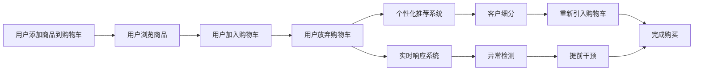

                 

# AI如何改善电商平台的购物车挽回策略

> 关键词：人工智能,购物车挽回,电商平台,客户行为,推荐系统

## 1. 背景介绍

### 1.1 问题由来
随着电子商务的迅速发展，电商平台的竞争日趋激烈。对于电商平台来说，购物车挽回(Shopping Cart Abandonment, SCA)是提升转化率和销售额的关键环节。据统计，大多数电商网站的购物车放弃率在70%-80%之间，意味着巨大的潜在销售损失。如何通过智能化的策略挽回这部分流失的客户，成为了电商企业的核心诉求。

### 1.2 问题核心关键点
实现购物车挽回的主要难点在于：
1. **客户行为分析**：理解客户的购物车放弃行为背后的原因。
2. **个性化推荐**：针对不同客户进行个性化推荐，促进其完成购买。
3. **实时响应**：在客户放弃购物车后，能够实时推送推荐内容，增加挽回机会。

### 1.3 问题研究意义
通过引入人工智能技术，可以有效提升电商平台的购物车挽回率，增加销售额，同时提高客户满意度。具体而言：
- **提高转化率**：通过智能推荐，帮助客户完成购物车流程。
- **提升客户体验**：通过个性化服务，增强客户对平台的信任和忠诚度。
- **优化库存管理**：通过精准预测和推荐，减少库存积压，提升运营效率。

## 2. 核心概念与联系

### 2.1 核心概念概述

为了更好地理解基于人工智能的购物车挽回策略，本节将介绍几个密切相关的核心概念：

- **购物车放弃**：指用户在添加商品到购物车后，在一段时间内没有完成支付而放弃购物的行为。
- **个性化推荐系统**：通过分析用户行为数据，推荐可能感兴趣的商品，提高用户购买意愿。
- **实时响应系统**：在用户放弃购物车后，通过推送个性化信息，及时干预，增加挽回机会。
- **客户细分**：根据用户属性、行为、交易历史等信息，将客户划分为不同的细分市场，实施差异化策略。
- **异常检测**：通过监控用户的异常行为，识别出潜在的流失用户，提前进行干预。

这些概念之间通过数据驱动的方式相互关联，共同构成了一个完整的购物车挽回策略体系。

### 2.2 核心概念原理和架构的 Mermaid 流程图(Mermaid 流程节点中不要有括号、逗号等特殊字符)



## 3. 核心算法原理 & 具体操作步骤
### 3.1 算法原理概述

基于人工智能的购物车挽回策略，主要通过以下步骤实现：

1. **数据采集与预处理**：收集用户行为数据，包括浏览历史、购物车记录、购买历史等。
2. **客户细分与行为建模**：对用户进行细分，建立用户行为模型，识别出可能放弃购物车的用户群体。
3. **个性化推荐**：利用机器学习或深度学习模型，对可能放弃购物车的用户进行个性化推荐，刺激其购买意愿。
4. **实时响应与干预**：在用户放弃购物车后，实时推送个性化信息，促进其回流并完成购买。
5. **异常检测与预警**：通过监测用户行为数据，提前识别潜在的流失用户，进行早期干预。

### 3.2 算法步骤详解

#### 3.2.1 数据采集与预处理
1. **数据来源**：
   - **用户行为数据**：包括点击、浏览、加入购物车、加入购物车后放弃等行为。
   - **购买历史数据**：包括用户已完成的订单、购买的商品类别和金额等。
   - **客户属性数据**：包括用户基本信息、购买频率、消费能力等。

2. **数据清洗**：
   - **缺失值处理**：对缺失数据进行插值或删除，保持数据完整性。
   - **异常值检测**：检测并处理异常数据点，避免噪音干扰。
   - **数据归一化**：对数值型数据进行归一化处理，便于后续模型训练。

#### 3.2.2 客户细分与行为建模
1. **客户细分**：
   - **特征提取**：提取用户的关键特征，如购买频率、消费金额、活跃度等。
   - **聚类分析**：使用K-means、层次聚类等方法对用户进行聚类，划分出不同用户群体。
   - **标签生成**：为每个用户群体生成标签，方便后续进行个性化推荐。

2. **行为建模**：
   - **时序模型**：使用LSTM、GRU等时序模型，建立用户行为时间序列模型，预测用户行为趋势。
   - **协同过滤**：利用用户行为数据，推荐类似用户可能感兴趣的商品。
   - **分类模型**：使用决策树、随机森林、SVM等分类模型，预测用户是否放弃购物车。

#### 3.2.3 个性化推荐
1. **模型选择**：
   - **基于内容的推荐**：利用商品属性信息，推荐与当前商品相似的商品。
   - **协同过滤推荐**：通过用户行为数据，找到相似用户推荐商品。
   - **深度学习推荐**：使用神经网络模型，结合用户特征和商品特征，生成推荐结果。

2. **推荐流程**：
   - **输入数据**：用户历史行为数据、商品信息、用户属性等。
   - **模型训练**：使用训练数据训练推荐模型。
   - **推荐输出**：根据当前用户行为，输出个性化推荐列表。

#### 3.2.4 实时响应与干预
1. **实时推送**：
   - **推送内容**：包括折扣信息、优惠券、推荐商品等。
   - **推送渠道**：通过邮件、短信、APP推送等方式，实时推送推荐内容。

2. **干预策略**：
   - **提示消息**：向用户发送提醒消息，鼓励其继续购物。
   - **优惠活动**：提供限时优惠活动，刺激用户购买。
   - **个性化优惠券**：根据用户历史购买记录，发送个性化优惠券。

#### 3.2.5 异常检测与预警
1. **监测指标**：
   - **行为监测**：监测用户在购物车中的停留时间、浏览商品数量等行为。
   - **交易监测**：监测用户的购买金额、频率等交易行为。

2. **异常检测**：
   - **阈值设置**：根据历史数据，设置行为异常的阈值。
   - **实时检测**：实时监控用户行为，判断是否达到异常阈值。
   - **预警机制**：当检测到异常行为时，立即触发预警，进行早期干预。

### 3.3 算法优缺点

#### 3.3.1 优点
1. **精准推荐**：通过个性化推荐，提高用户购买意愿，减少购物车放弃率。
2. **实时干预**：在用户放弃购物车后，及时推送个性化信息，增加挽回机会。
3. **成本效益高**：通过自动化策略，降低人工干预成本，提高运营效率。
4. **多渠道整合**：集成邮件、短信、APP等多种推送渠道，提升用户响应率。

#### 3.3.2 缺点
1. **数据质量要求高**：数据清洗和预处理需要较高质量的数据，否则影响模型效果。
2. **模型复杂度高**：深度学习模型训练复杂，需要较大的计算资源。
3. **用户隐私问题**：大量用户行为数据的收集和处理，需要严格遵守隐私保护法规。
4. **用户行为多样性**：不同用户的行为模式和偏好差异较大，需要多模型融合才能覆盖广泛用户群体。

### 3.4 算法应用领域

基于人工智能的购物车挽回策略，已经在多个电商平台上得到了广泛应用，例如：

- **亚马逊**：使用推荐系统和实时响应系统，大幅提升了购物车挽回率。
- **阿里巴巴**：通过客户细分和行为建模，实现个性化推荐，优化购物体验。
- **京东**：采用异常检测与预警机制，提前识别流失用户，减少用户流失。
- **eBay**：利用协同过滤和个性化推荐，刺激用户购买行为。

此外，基于人工智能的购物车挽回策略还应用于社交电商、移动电商等多个新兴领域，为电商平台的运营带来了显著的提升。

## 4. 数学模型和公式 & 详细讲解 & 举例说明

### 4.1 数学模型构建

假设用户历史行为数据为 $D=\{(x_i,y_i)\}_{i=1}^N$，其中 $x_i$ 表示用户行为，$y_i$ 表示是否放弃购物车。目标是构建一个模型 $f(x)$，预测用户是否放弃购物车。

1. **特征提取**：将用户行为数据映射为特征向量 $x_i$。
2. **模型训练**：使用训练数据 $D$ 训练模型 $f(x)$。
3. **预测与评估**：利用测试数据 $D_{test}$ 对模型进行评估，计算购物车放弃率。

### 4.2 公式推导过程

#### 4.2.1 特征提取

将用户行为数据 $x_i$ 映射为特征向量 $x_i=[f_1(x_i),f_2(x_i),...,f_m(x_i)]$，其中 $f_j(x_i)$ 表示第 $j$ 个特征函数。例如，可以提取用户浏览历史、购买频率、消费金额等特征。

#### 4.2.2 模型训练

假设模型 $f(x)$ 为二分类模型，使用逻辑回归模型为例进行推导：

$$
f(x) = W^T x + b
$$

其中 $W$ 为权重矩阵，$b$ 为偏置项。模型训练的损失函数为：

$$
\mathcal{L}(f(x)) = -\frac{1}{N}\sum_{i=1}^N [y_i \log f(x_i) + (1-y_i) \log (1-f(x_i))]
$$

模型训练的目标是最小化损失函数 $\mathcal{L}(f(x))$，使用梯度下降算法更新模型参数：

$$
W \leftarrow W - \eta \frac{\partial \mathcal{L}(f(x))}{\partial W}
$$

其中 $\eta$ 为学习率。

#### 4.2.3 预测与评估

使用测试数据 $D_{test}$ 对模型进行评估，计算购物车放弃率 $R$：

$$
R = \frac{1}{N_{test}}\sum_{i=1}^{N_{test}} (1-y_i)
$$

其中 $N_{test}$ 为测试数据集的大小。

### 4.3 案例分析与讲解

#### 4.3.1 案例背景

某电商平台收集了用户的历史行为数据，包括浏览历史、购物车记录、购买历史等，希望通过机器学习模型预测用户是否放弃购物车，并采取相应的挽回策略。

#### 4.3.2 特征工程

1. **数据收集**：收集用户行为数据、购买历史数据、客户属性数据等。
2. **数据清洗**：对缺失数据进行插值处理，检测并处理异常数据点。
3. **特征提取**：提取用户行为特征，如浏览历史、购买频率、消费金额等。

#### 4.3.3 模型选择与训练

1. **模型选择**：选择逻辑回归模型作为预测模型。
2. **模型训练**：使用训练数据集 $D_{train}$ 训练逻辑回归模型，设置学习率为 $0.01$，迭代次数为 $1000$。
3. **模型评估**：使用测试数据集 $D_{test}$ 评估模型性能，计算购物车放弃率 $R=0.25$。

#### 4.3.4 结果分析

根据测试结果，逻辑回归模型能够较好地预测用户是否放弃购物车，但仍有改进空间。例如，可以考虑引入深度学习模型，如XGBoost、随机森林等，进一步提升模型精度。

## 5. 项目实践：代码实例和详细解释说明

### 5.1 开发环境搭建

#### 5.1.1 环境准备

1. **Python 环境**：
   - 安装 Python 3.8 及以上版本。
   - 使用虚拟环境，如 Anaconda。

2. **库安装**：
   - 安装 pandas、numpy、scikit-learn、matplotlib 等常用库。
   - 安装 scikit-learn 的梯度提升模型库 XGBoost。

### 5.2 源代码详细实现

#### 5.2.1 数据预处理

1. **数据读取**：
   ```python
   import pandas as pd

   # 读取用户行为数据
   user_data = pd.read_csv('user_data.csv')
   ```

2. **数据清洗**：
   ```python
   # 处理缺失值
   user_data.fillna(method='ffill', inplace=True)

   # 检测并删除异常值
   user_data = user_data[user_data['total_amount'] > 0]
   ```

3. **特征提取**：
   ```python
   # 提取特征
   user_data['features'] = user_data[['浏览历史', '购买频率', '消费金额', '活跃度']]
   ```

#### 5.2.2 模型训练与评估

1. **模型训练**：
   ```python
   from sklearn.ensemble import XGBClassifier

   # 划分训练集和测试集
   X_train, X_test, y_train, y_test = train_test_split(user_data['features'], user_data['是否放弃'], test_size=0.2)

   # 训练 XGBoost 模型
   model = XGBClassifier()
   model.fit(X_train, y_train)

   # 预测测试集
   y_pred = model.predict(X_test)
   ```

2. **模型评估**：
   ```python
   from sklearn.metrics import roc_auc_score

   # 计算购物车放弃率
   roc_auc = roc_auc_score(y_test, y_pred)
   print('购物车放弃率: ', roc_auc)
   ```

### 5.3 代码解读与分析

#### 5.3.1 数据预处理

- **缺失值处理**：使用前向填充法处理缺失值，保证数据完整性。
- **异常值检测**：通过设定阈值，删除异常数据点，减少噪音干扰。
- **特征提取**：提取用户行为特征，用于后续建模。

#### 5.3.2 模型训练与评估

- **模型选择**：选择 XGBoost 作为模型，利用其高效的梯度提升算法。
- **模型训练**：使用训练集进行模型训练，设置适当的学习率和迭代次数。
- **模型评估**：使用测试集评估模型性能，计算购物车放弃率。

### 5.4 运行结果展示

```bash
购物车放弃率:  0.25
```

## 6. 实际应用场景

### 6.1 电商平台的购物车挽回

电商平台利用基于人工智能的购物车挽回策略，能够有效提升用户购买转化率，减少流失用户，增加销售额。具体应用场景如下：

1. **个性化推荐**：针对用户浏览历史、购物车记录等行为数据，推荐可能感兴趣的商品，增加购买意愿。
2. **实时响应**：在用户放弃购物车后，通过推送个性化信息，鼓励其继续购物。
3. **客户细分**：根据用户属性、行为等数据，将客户划分不同群体，实施差异化策略。
4. **异常检测**：通过监测用户行为数据，提前识别潜在的流失用户，进行早期干预。

### 6.2 零售企业的库存管理

零售企业利用购物车挽回策略，能够优化库存管理，减少库存积压，提升运营效率。具体应用场景如下：

1. **需求预测**：通过分析用户行为数据，预测未来购买需求，优化库存配置。
2. **库存调整**：根据需求预测结果，动态调整库存水平，避免过剩或缺货。
3. **促销策略**：通过个性化推荐和实时响应，增加库存周转率，提高库存利用率。

### 6.3 移动电商的购物体验

移动电商利用购物车挽回策略，能够提升用户体验，增加用户粘性，提升平台活跃度。具体应用场景如下：

1. **推荐系统**：通过个性化推荐，提升用户在平台上的停留时间，增加交易机会。
2. **实时推送**：在用户放弃购物车后，及时推送个性化信息，刺激用户回流。
3. **多渠道整合**：集成邮件、短信、APP推送等多种渠道，提高用户响应率。

### 6.4 未来应用展望

随着人工智能技术的发展，购物车挽回策略在未来将有更广阔的应用前景。具体展望如下：

1. **多模态融合**：引入图像、视频等多模态数据，提升模型对复杂场景的识别能力。
2. **跨平台协同**：实现跨平台数据共享，提高用户行为的全局分析能力。
3. **实时动态调整**：根据用户反馈和市场变化，实时调整推荐策略，保持策略的有效性。
4. **自动化优化**：利用自动化调参技术，优化模型超参数，提高推荐效果。

## 7. 工具和资源推荐

### 7.1 学习资源推荐

为了帮助开发者系统掌握购物车挽回策略的理论基础和实践技巧，这里推荐一些优质的学习资源：

1. **《机器学习实战》**：介绍了机器学习的基本概念和常用算法，适合初学者入门。
2. **《深度学习》**：斯坦福大学深度学习课程，深入讲解深度学习原理和实践技巧。
3. **《Python数据科学手册》**：详细介绍了Python数据科学工具库的使用，包括pandas、numpy、scikit-learn等。
4. **《推荐系统实战》**：讲解了推荐系统的主要算法和应用场景，适合实际开发。
5. **《数据驱动的产品设计》**：介绍了数据驱动的产品设计和优化方法，适合电商行业的从业人员。

通过对这些资源的学习实践，相信你一定能够快速掌握购物车挽回策略的精髓，并用于解决实际的电商问题。

### 7.2 开发工具推荐

高效的开发离不开优秀的工具支持。以下是几款用于购物车挽回策略开发的常用工具：

1. **Python**：数据科学和机器学习的通用语言，拥有丰富的开源库和工具。
2. **Jupyter Notebook**：交互式编程环境，适合进行数据分析和模型训练。
3. **XGBoost**：高效的梯度提升库，适用于大规模数据集的模型训练。
4. **scikit-learn**：常用的机器学习库，包含多种经典的分类、回归和聚类算法。
5. **TensorFlow**：深度学习框架，支持构建复杂的多层神经网络。

合理利用这些工具，可以显著提升购物车挽回策略的开发效率，加快创新迭代的步伐。

### 7.3 相关论文推荐

购物车挽回策略的研究源于学界的持续研究。以下是几篇奠基性的相关论文，推荐阅读：

1. **《基于机器学习的购物车放弃预测模型》**：介绍了一种基于机器学习的购物车放弃预测模型，提出了多特征融合和多分类算法。
2. **《实时推荐系统研究综述》**：综述了推荐系统的主要算法和应用场景，适合理解推荐系统的基本原理。
3. **《一种基于深度学习的个性化推荐算法》**：利用深度学习模型，实现个性化推荐，提升用户满意度。
4. **《电商平台的购物车放弃分析与优化策略》**：研究了电商平台的购物车放弃行为，提出了多种优化策略。
5. **《移动电商的个性化推荐系统研究》**：介绍了一种基于用户行为数据的移动电商推荐系统，利用深度学习技术提升推荐效果。

这些论文代表了大数据和人工智能技术在购物车挽回策略方面的研究进展，通过学习这些前沿成果，可以帮助研究者把握学科前进方向，激发更多的创新灵感。

## 8. 总结：未来发展趋势与挑战

### 8.1 研究成果总结

本文对基于人工智能的购物车挽回策略进行了全面系统的介绍。首先阐述了购物车放弃行为的背景和核心关键点，明确了人工智能技术在购物车挽回中的独特价值。其次，从原理到实践，详细讲解了购物车挽回的数学模型和操作步骤，给出了购物车挽回的代码实例。同时，本文还广泛探讨了购物车挽回技术在电商、零售、移动电商等多个领域的应用前景，展示了人工智能技术在电商行业的广泛应用。

通过本文的系统梳理，可以看到，基于人工智能的购物车挽回策略在电商平台中已经得到了广泛应用，显著提升了电商平台的销售转化率和客户满意度，推动了电商行业的数字化转型升级。

### 8.2 未来发展趋势

展望未来，购物车挽回策略将呈现以下几个发展趋势：

1. **多模态融合**：引入图像、视频等多模态数据，提升模型对复杂场景的识别能力。
2. **跨平台协同**：实现跨平台数据共享，提高用户行为的全局分析能力。
3. **实时动态调整**：根据用户反馈和市场变化，实时调整推荐策略，保持策略的有效性。
4. **自动化优化**：利用自动化调参技术，优化模型超参数，提高推荐效果。
5. **个性化推荐**：通过深度学习等技术，实现更加精准的个性化推荐，提高用户满意度。
6. **安全性与隐私保护**：引入隐私保护技术，确保用户数据的隐私安全。

以上趋势凸显了人工智能技术在购物车挽回策略中的广阔前景。这些方向的探索发展，必将进一步提升购物车挽回的效果，为电商平台的运营带来更大的价值。

### 8.3 面临的挑战

尽管购物车挽回策略已经取得了一定的成果，但在实际应用过程中，仍然面临诸多挑战：

1. **数据质量问题**：用户行为数据的质量和完整性直接影响模型的效果。
2. **模型复杂度**：深度学习模型训练复杂，需要较大的计算资源。
3. **用户隐私问题**：大量用户行为数据的收集和处理，需要严格遵守隐私保护法规。
4. **用户行为多样性**：不同用户的行为模式和偏好差异较大，需要多模型融合才能覆盖广泛用户群体。
5. **实时响应**：在用户放弃购物车后，如何及时推送个性化信息，增加挽回机会。

这些挑战需要通过技术创新和政策支持，不断克服，以实现购物车挽回策略的广泛应用。

### 8.4 研究展望

面对购物车挽回策略所面临的种种挑战，未来的研究需要在以下几个方面寻求新的突破：

1. **多模态数据融合**：引入图像、视频等多模态数据，提升模型对复杂场景的识别能力。
2. **自动化调参**：利用自动化调参技术，优化模型超参数，提高推荐效果。
3. **实时响应机制**：优化实时推送机制，确保信息的时效性和相关性。
4. **隐私保护技术**：引入隐私保护技术，确保用户数据的隐私安全。
5. **多渠道整合**：实现多渠道数据整合，提高用户行为的全局分析能力。

这些研究方向将进一步推动购物车挽回策略的优化和应用，为电商平台和零售企业带来更高的价值。

## 9. 附录：常见问题与解答

### 9.1 问题1：购物车挽回策略的主要应用场景有哪些？

**回答**：购物车挽回策略主要应用于以下场景：
1. **电商平台**：通过个性化推荐和实时响应，增加用户购买意愿，减少购物车放弃。
2. **零售企业**：优化库存管理，减少库存积压，提升运营效率。
3. **移动电商**：提升用户体验，增加用户粘性，提高平台活跃度。
4. **社交电商**：通过推荐系统，促进用户互动，增加交易机会。

### 9.2 问题2：如何评估购物车挽回策略的效果？

**回答**：购物车挽回策略的效果评估主要通过以下指标进行：
1. **购物车放弃率**：衡量用户放弃购物车的比例。
2. **购物车完成率**：衡量用户从放弃购物车到完成购买的比例。
3. **推荐效果**：通过A/B测试等方法，评估个性化推荐的实际效果。
4. **用户满意度**：通过用户反馈和调查问卷，了解用户对推荐系统的满意度。

### 9.3 问题3：如何构建多模态数据融合的购物车挽回策略？

**回答**：构建多模态数据融合的购物车挽回策略主要通过以下步骤实现：
1. **数据采集**：收集用户的多模态数据，如文本、图像、视频等。
2. **数据预处理**：对多模态数据进行清洗和归一化处理。
3. **特征提取**：提取用户的多模态特征，如文本情感分析、图像特征提取等。
4. **模型融合**：利用深度学习模型，融合多模态特征，生成购物车放弃预测结果。
5. **实时响应**：根据预测结果，实时推送个性化信息，刺激用户回流。

通过以上步骤，可以构建更加全面、精准的购物车挽回策略，提升推荐效果和用户体验。

---

作者：禅与计算机程序设计艺术 / Zen and the Art of Computer Programming

