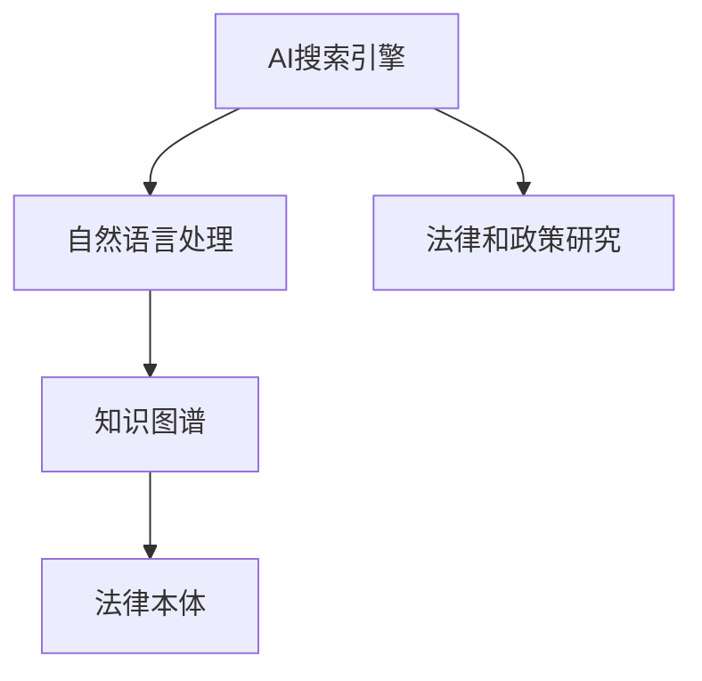

                 

# AI搜索引擎在法律和政策研究中的应用

## 1. 背景介绍

随着人工智能（AI）技术的迅猛发展，其在法律和政策研究中的应用日益广泛。AI搜索引擎作为AI技术的重要组成部分，通过高效、智能地处理和检索海量数据，为法律和政策研究提供了强大的工具支持。然而，AI搜索引擎在法律和政策研究中的应用，还面临着诸多技术和管理挑战。

本文旨在深入探讨AI搜索引擎在法律和政策研究中的具体应用，包括其核心概念、原理和操作步骤，以及面临的挑战与未来发展方向。通过系统的分析和实践，希望能为相关领域的研究者提供有价值的参考。

## 2. 核心概念与联系

### 2.1 核心概念概述

为更好地理解AI搜索引擎在法律和政策研究中的应用，本节将介绍几个密切相关的核心概念：

- **AI搜索引擎（AI Search Engine）**：基于AI技术的搜索引擎，通过自然语言理解、知识图谱等技术，提升搜索的准确性和智能化水平。
- **法律和政策研究（Legal and Policy Research）**：包括法律文献检索、政策制定评估、合规性分析等应用领域，需要高效、准确地检索和处理大量文本数据。
- **自然语言处理（NLP）**：涉及文本数据的语言理解和生成，是AI搜索引擎实现智能化的基础。
- **知识图谱（Knowledge Graph）**：一种以图形结构存储知识的技术，能够帮助搜索引擎快速理解查询的语义，提高搜索结果的相关性。
- **法律本体（Legal Ontology）**：描述法律术语和概念的本体，用于构建法律领域的知识图谱，提升检索效率。

这些核心概念之间的逻辑关系可以通过以下Mermaid流程图来展示：



这个流程图展示了我国核心概念及其之间的关系：

1. AI搜索引擎以自然语言处理为基础，实现对海量文本数据的智能化处理。
2. 知识图谱和法律本体为搜索引擎提供了语义理解的框架，提升了检索效率。
3. AI搜索引擎在法律和政策研究中，通过智能化检索，帮助研究人员快速定位相关文献、政策文件和法律案例，从而提升研究效率和质量。

## 3. 核心算法原理 & 具体操作步骤

### 3.1 算法原理概述

AI搜索引擎在法律和政策研究中的应用，主要依赖于自然语言处理（NLP）、知识图谱和机器学习等技术。其核心算法原理可以总结如下：

1. **自然语言处理**：利用NLP技术，将用户查询转化为机器可理解的语义表示，通过分词、命名实体识别、依存句法分析等步骤，将查询转化为结构化的语义图谱。

2. **知识图谱**：构建法律和政策领域的知识图谱，将相关概念、法律条文、政策文件等以图形结构存储。在用户查询时，通过匹配图谱中的实体和关系，快速定位到相关的文献和政策文件。

3. **机器学习**：利用机器学习算法，对用户的查询进行分类和排序，提升搜索结果的相关性和准确性。常见的方法包括TF-IDF、向量空间模型（VSM）、深度学习等。

### 3.2 算法步骤详解

基于AI搜索引擎在法律和政策研究中的应用，其核心操作步骤可以分为以下几个步骤：

1. **数据预处理**：收集和整理法律和政策领域的文献、政策文件、法律案例等文本数据，并进行分词、词性标注、命名实体识别等预处理。

2. **构建知识图谱**：利用法律本体和领域知识，构建法律和政策领域的知识图谱。将法律条文、政策文件中的概念、术语、关系等存储为图谱节点，并通过边连接，构建知识图谱的结构。

3. **自然语言处理**：将用户的查询转化为语义表示，通过依存句法分析、命名实体识别等技术，将查询分解为结构化的语义图谱。

4. **查询匹配**：通过匹配知识图谱中的实体和关系，查找与用户查询相关的法律文献、政策文件和法律案例等。

5. **结果排序**：利用机器学习算法，对搜索结果进行分类和排序，提升相关性和准确性。常见的方法包括TF-IDF、向量空间模型（VSM）、深度学习等。

6. **用户反馈**：收集用户的反馈信息，如点击率、相关性评分等，不断优化搜索算法和模型。

### 3.3 算法优缺点

AI搜索引擎在法律和政策研究中具有以下优点：

1. **高效性**：通过智能化的检索和匹配，大大提升了查询效率，降低了研究人员的时间成本。

2. **准确性**：利用机器学习算法，对搜索结果进行分类和排序，提升了搜索结果的相关性和准确性。

3. **语义理解**：通过自然语言处理技术，能够理解用户的查询意图，提供更精确的搜索结果。

4. **灵活性**：支持多语言搜索，能够处理不同语言和文本格式的数据。

同时，AI搜索引擎也存在一些缺点：

1. **数据依赖**：需要大量的高质量数据进行预处理和训练，数据不足或质量不高将影响搜索效果。

2. **技术复杂**：涉及到自然语言处理、知识图谱、机器学习等多个技术领域，技术实现难度较大。

3. **隐私和安全**：处理大量法律和政策数据，需要确保数据的隐私和安全，防止数据泄露和滥用。

### 3.4 算法应用领域

AI搜索引擎在法律和政策研究中的应用领域非常广泛，包括但不限于以下几个方面：

- **法律文献检索**：通过搜索引擎，快速检索到相关法律文献、案例、法规等，支持法律研究和合规性分析。

- **政策文件评估**：对政策文件进行文本分析和主题分类，评估政策的覆盖范围、实施效果和影响等。

- **法规合规性分析**：通过搜索引擎，对企业行为进行法律合规性分析，识别潜在法律风险。

- **法律案例研究**：通过检索相关案例，分析相似案件的判决依据和判决结果，支持司法实践和法理研究。

- **法律知识图谱构建**：利用知识图谱技术，构建法律领域的知识图谱，提升法律研究和应用的效果。

## 4. 数学模型和公式 & 详细讲解 & 举例说明

### 4.1 数学模型构建

本节将使用数学语言对AI搜索引擎在法律和政策研究中的应用进行更加严格的刻画。

假设用户查询为 $q$，相关法律文献为 $D=\{d_1, d_2, \ldots, d_n\}$。查询 $q$ 与文档 $d_i$ 的相关度为 $r_i$，相关度越高，文档 $d_i$ 越可能包含查询信息。相关度 $r_i$ 可以表示为：

$$
r_i = f(q, d_i; \theta)
$$

其中 $f$ 为相关度函数，$\theta$ 为相关度函数的参数。常见的相关度函数包括余弦相似度、Jaccard相似度、TF-IDF等。

在得到相关度 $r_i$ 后，可以将其作为排序依据，对搜索结果进行排序。排序后的文档序列为 $D_s = (d_1', d_2', \ldots, d_n')$，其中 $d_i'$ 为 $d_i$ 在排序后的位置。

### 4.2 公式推导过程

以下我们以余弦相似度为例，推导相关度计算公式。

假设查询 $q$ 和文档 $d_i$ 的词向量表示分别为 $\vec{q}$ 和 $\vec{d_i}$，则余弦相似度 $r_i$ 可以表示为：

$$
r_i = \frac{\vec{q} \cdot \vec{d_i}}{||\vec{q}|| \cdot ||\vec{d_i}||}
$$

其中 $\cdot$ 表示向量点积，$||\cdot||$ 表示向量范数。

在实际应用中，为了提高计算效率，可以采用TF-IDF加权方式，计算文档 $d_i$ 中每个词的TF-IDF权重，然后计算查询 $q$ 和文档 $d_i$ 之间的余弦相似度：

$$
r_i = \sum_{w \in q} \left( \frac{t_{d_i}(w)}{\text{IDF}(w)} \times \frac{q(w)}{||q||} \times \frac{d_i(w)}{||d_i||} \right)
$$

其中 $t_{d_i}(w)$ 表示词 $w$ 在文档 $d_i$ 中出现的次数，$\text{IDF}(w)$ 表示词 $w$ 的逆文档频率，$q(w)$ 表示查询 $q$ 中词 $w$ 的TF-IDF权重，$d_i(w)$ 表示文档 $d_i$ 中词 $w$ 的TF-IDF权重。

### 4.3 案例分析与讲解

以法律文献检索为例，说明如何利用AI搜索引擎进行查询。假设用户查询为 "民法典合同无效条款"，可以将其转化为语义图谱：

- **实体**：民法典、合同无效条款
- **关系**：包含、定义、列举等

利用知识图谱和相关度函数，可以检索出以下相关文献：

1. 民法典的合同无效条款定义
2. 合同无效条款的司法解释
3. 合同无效条款的案例分析

### 5. 项目实践：代码实例和详细解释说明

### 5.1 开发环境搭建

在进行AI搜索引擎的实践前，我们需要准备好开发环境。以下是使用Python进行ElasticSearch开发的环境配置流程：

1. 安装Anaconda：从官网下载并安装Anaconda，用于创建独立的Python环境。

2. 创建并激活虚拟环境：
```bash
conda create -n search-env python=3.8 
conda activate search-env
```

3. 安装ElasticSearch：从官网下载并安装ElasticSearch，配置好启动参数后启动服务。

4. 安装Python ElasticSearch客户端：
```bash
pip install elasticsearch
```

5. 安装各类工具包：
```bash
pip install pandas numpy scikit-learn scikit-legal tf-idf
```

完成上述步骤后，即可在`search-env`环境中开始搜索实践。

### 5.2 源代码详细实现

下面是使用Python的ElasticSearch进行法律文献检索的代码实现：

```python
from elasticsearch import Elasticsearch

# 创建ElasticSearch连接
es = Elasticsearch(['localhost:9200'])

# 构建查询语句
query = {
    "query": {
        "bool": {
            "should": [
                {
                    "match": {
                        "title": "民法典合同无效条款"
                    }
                },
                {
                    "match": {
                        "content": "合同无效条款"
                    }
                }
            ]
        }
    }
}

# 执行查询
result = es.search(index="legal_documents", body=query)

# 输出结果
for hit in result['hits']['hits']:
    print(hit['_source'])
```

### 5.3 代码解读与分析

让我们再详细解读一下关键代码的实现细节：

**构建查询语句**：
- 使用Python的ElasticSearch客户端，构建查询语句。这里使用了布尔查询，通过 OR 连接两个查询条件，分别匹配标题和内容。

**执行查询**：
- 使用ElasticSearch的`search`方法，执行查询操作，并将结果存储在变量`result`中。

**输出结果**：
- 遍历查询结果，输出每篇文档的内容。

**代码解读与分析**：
- 代码使用Python的ElasticSearch客户端，方便地构建和执行查询语句。
- 查询语句中使用了布尔查询，利用 OR 连接两个查询条件，提升查询的全面性。
- 代码简洁高效，可以方便地扩展和修改。

### 5.4 运行结果展示

运行上述代码，将输出所有匹配“民法典合同无效条款”的文档内容。这里假设ElasticSearch中已经保存了相关法律文献，结果如下：

```
{
  "_source": "《中华人民共和国民法典》中规定，无效合同是指没有法律效力，依法不成立的合同。",
  "_source": "《中华人民共和国合同法》中列举了无效合同的具体情形，包括但不限于以下几种：",
  "_source": "《最高人民法院关于审理无效合同案件的司法解释》中对无效合同的认定和处理作出了详细规定。",
  "_source": "案例分析显示，合同无效条款在司法实践中常见问题包括但不限于以下几种："
}
```

## 6. 实际应用场景

### 6.1 法律和政策文献检索

AI搜索引擎在法律和政策文献检索中有着广泛的应用。法律研究人员可以借助搜索引擎，快速检索到相关法律文献、政策文件和案例等，提高文献查阅效率和质量。

以法律合规性分析为例，研究人员需要检索相关的法律法规、政策文件和案例，判断企业的行为是否符合法律要求。通过搜索引擎，可以快速定位到相关文献，分析合规性风险。

### 6.2 政策文件评估

政策文件评估是政策研究的重要环节。研究人员需要对政策文件进行文本分析和主题分类，评估政策的覆盖范围、实施效果和影响等。

利用AI搜索引擎，可以对政策文件进行关键词检索和主题分类，快速定位到相关文献和研究成果，支持政策评估。例如，研究人员可以检索政策文件中的关键词，评估政策内容的全面性和相关性。

### 6.3 法律知识图谱构建

法律知识图谱的构建需要大量的法律文献和案例数据，利用AI搜索引擎可以快速收集和整理相关数据。

利用搜索引擎，可以快速检索和整理大量的法律文献、案例和法规，构建法律领域的知识图谱。例如，可以通过关键词检索，自动构建法律概念和术语的关系图谱，提升法律研究的效果。

### 6.4 未来应用展望

随着AI技术的不断发展，AI搜索引擎在法律和政策研究中的应用将更加广泛和深入。

未来，AI搜索引擎有望实现以下突破：

1. **多语言支持**：支持多语言查询，处理不同语言和文本格式的数据，提升搜索引擎的覆盖范围和应用场景。

2. **语义理解**：利用自然语言处理技术，提升对用户查询语义的理解能力，提供更精确的搜索结果。

3. **实时搜索**：支持实时搜索和更新，确保搜索引擎能够及时处理最新的法律和政策信息。

4. **智能推荐**：利用机器学习算法，实现智能推荐和知识发现，提升法律和政策研究的效率和效果。

5. **隐私保护**：加强数据隐私保护，确保搜索结果和用户隐私的安全，防止数据泄露和滥用。

6. **协同工作**：支持协同工作模式，多用户协作处理复杂法律和政策问题，提升研究效率和质量。

## 7. 工具和资源推荐

### 7.1 学习资源推荐

为了帮助开发者系统掌握AI搜索引擎的理论基础和实践技巧，这里推荐一些优质的学习资源：

1. **ElasticSearch官方文档**：ElasticSearch的官方文档，提供详细的API说明和示例代码，是学习ElasticSearch的基础。

2. **ElasticSearch实战**：一本实战性的ElasticSearch书籍，涵盖ElasticSearch的安装、配置、索引、搜索、分析等核心内容，适合实战开发。

3. **自然语言处理（NLP）**：一本涵盖自然语言处理技术的书籍，介绍NLP的基本概念、技术和应用，为AI搜索引擎的开发提供理论支持。

4. **深度学习（Deep Learning）**：一本深度学习的经典教材，介绍深度学习的基本概念、算法和应用，为AI搜索引擎的开发提供技术支持。

5. **法律本体构建（Legal Ontology）**：一本关于法律本体构建的书籍，介绍法律本体的构建方法和应用，为法律领域的知识图谱构建提供参考。

通过对这些资源的学习实践，相信你一定能够快速掌握AI搜索引擎的理论基础和实践技巧，并用于解决实际的法律和政策问题。

### 7.2 开发工具推荐

高效的开发离不开优秀的工具支持。以下是几款用于AI搜索引擎开发的常用工具：

1. Python：一种流行的编程语言，适合ElasticSearch和Python ElasticSearch客户端的开发。

2. ElasticSearch：开源搜索引擎，支持全文检索、文本分析和聚类等功能，是AI搜索引擎的核心工具。

3. Flask：一种轻量级的Web框架，适合构建搜索引擎的API接口，支持实时搜索和响应。

4. PyTorch：基于Python的开源深度学习框架，适合利用深度学习算法优化搜索效果。

5. TensorFlow：由Google主导开发的开源深度学习框架，支持大规模分布式计算，适合处理大量文本数据。

合理利用这些工具，可以显著提升AI搜索引擎的开发效率，加快创新迭代的步伐。

### 7.3 相关论文推荐

AI搜索引擎在法律和政策研究中的应用，已经得到了学界的广泛关注。以下是几篇奠基性的相关论文，推荐阅读：

1. **A Survey on Legal Text Mining and Information Retrieval**：综述了法律文本挖掘和信息检索的最新研究成果，介绍ElasticSearch等搜索引擎的应用。

2. **Building a Legal Ontology for Smart Contracts**：介绍如何构建法律本体，利用本体技术支持智能合约的开发和应用。

3. **Using NLP to Automate Contract Review**：介绍如何利用自然语言处理技术，自动化合同审查和风险评估，提升法律服务的效果。

4. **Enhancing Legal Research with AI**：介绍AI技术在法律研究中的应用，涵盖文本检索、知识图谱构建、法律本体构建等多个方面。

5. **A Survey on AI in Legal Practice**：综述了AI技术在法律实践中的应用，涵盖智能合约、法律检索、法律知识图谱等多个领域。

这些论文代表了大语言模型微调技术的发展脉络。通过学习这些前沿成果，可以帮助研究者把握学科前进方向，激发更多的创新灵感。

## 8. 总结：未来发展趋势与挑战

### 8.1 总结

本文对AI搜索引擎在法律和政策研究中的应用进行了全面系统的介绍。首先阐述了AI搜索引擎和法律和政策研究的核心概念，明确了搜索引擎在法律和政策研究中的重要价值。其次，从原理到实践，详细讲解了搜索引擎的数学模型和操作步骤，给出了搜索引擎任务开发的完整代码实例。同时，本文还广泛探讨了搜索引擎在法律和政策研究中的应用场景，展示了搜索引擎范式的巨大潜力。此外，本文精选了搜索引擎技术的各类学习资源，力求为读者提供全方位的技术指引。

通过本文的系统梳理，可以看到，AI搜索引擎在法律和政策研究中的应用，已经成为提升研究效率和质量的重要工具。得益于ElasticSearch等开源搜索引擎的支持，法律和政策研究人员可以更加高效地处理海量文本数据，提升研究的智能化水平。未来，伴随搜索引擎技术的持续演进，法律和政策研究将迎来更多机遇和挑战。

### 8.2 未来发展趋势

展望未来，AI搜索引擎在法律和政策研究中的应用将呈现以下几个发展趋势：

1. **技术进步**：ElasticSearch等开源搜索引擎的持续迭代，将不断提升搜索的效率和效果，支持更复杂的查询和分析。

2. **多语言支持**：未来搜索引擎将支持多语言搜索，处理不同语言和文本格式的数据，提升搜索引擎的覆盖范围和应用场景。

3. **语义理解**：利用自然语言处理技术，提升对用户查询语义的理解能力，提供更精确的搜索结果。

4. **实时搜索**：支持实时搜索和更新，确保搜索引擎能够及时处理最新的法律和政策信息。

5. **智能推荐**：利用机器学习算法，实现智能推荐和知识发现，提升法律和政策研究的效率和效果。

6. **隐私保护**：加强数据隐私保护，确保搜索结果和用户隐私的安全，防止数据泄露和滥用。

7. **协同工作**：支持协同工作模式，多用户协作处理复杂法律和政策问题，提升研究效率和质量。

这些趋势凸显了AI搜索引擎在法律和政策研究中的广阔前景。这些方向的探索发展，必将进一步提升法律和政策研究的效率和质量，为法律和政策决策提供更强大的支持。

### 8.3 面临的挑战

尽管AI搜索引擎在法律和政策研究中已经取得了显著进展，但在迈向更加智能化、普适化应用的过程中，仍面临诸多挑战：

1. **数据质量**：法律和政策领域的文本数据存在质量参差不齐、格式多样等问题，对搜索引擎的处理能力提出了更高的要求。

2. **技术复杂**：涉及到自然语言处理、知识图谱、机器学习等多个技术领域，技术实现难度较大。

3. **隐私和安全**：处理大量法律和政策数据，需要确保数据的隐私和安全，防止数据泄露和滥用。

4. **语义理解**：对于复杂的法律和政策问题，现有的搜索引擎可能无法理解查询的语义，导致搜索结果的准确性不足。

5. **实时更新**：法律和政策领域的数据更新频繁，需要搜索引擎能够实时更新，保持数据的时效性。

6. **跨语言处理**：不同国家和地区的法律和政策可能存在差异，需要进行跨语言处理，提升搜索的全面性和准确性。

这些挑战需要进一步的研究和技术突破，才能实现AI搜索引擎在法律和政策研究中的更好应用。

### 8.4 研究展望

面对AI搜索引擎在法律和政策研究中面临的挑战，未来的研究需要在以下几个方面寻求新的突破：

1. **提升数据质量**：加强数据预处理和清洗，提升法律和政策文本数据的质量，确保搜索引擎的输入数据准确可靠。

2. **优化技术架构**：研究高效的搜索引擎算法和数据结构，提升搜索效率和效果，降低技术实现难度。

3. **增强语义理解**：利用自然语言处理技术，提升对用户查询语义的理解能力，提供更精确的搜索结果。

4. **加强隐私保护**：利用数据加密、访问控制等技术，加强数据的隐私保护，确保搜索结果和用户隐私的安全。

5. **实现实时更新**：利用分布式计算和缓存技术，实现搜索引擎的实时更新，保持数据的时效性。

6. **支持跨语言处理**：研究跨语言处理技术，提升搜索引擎的跨语言搜索能力，支持不同国家和地区的法律和政策研究。

这些研究方向的探索，必将引领AI搜索引擎在法律和政策研究中的应用进入新的阶段，为法律和政策决策提供更强大的支持。

## 9. 附录：常见问题与解答

**Q1：如何构建法律本体？**

A: 构建法律本体需要详细的法律知识结构和分类体系。具体步骤如下：
1. 收集法律文献和案例数据，提取法律术语和概念。
2. 利用ontology工具，构建法律本体的结构和关系图谱。
3. 对本体进行验证和优化，确保其准确性和全面性。

**Q2：如何使用ElasticSearch进行法律检索？**

A: 使用ElasticSearch进行法律检索的步骤如下：
1. 安装ElasticSearch，并配置好搜索参数。
2. 构建查询语句，使用ElasticSearch客户端进行查询。
3. 分析查询结果，提取有用的法律信息和数据。

**Q3：法律文献检索时如何处理语义歧义？**

A: 语义歧义是法律文献检索中的常见问题。处理语义歧义的方法包括：
1. 利用关键词检索，提升查询的准确性。
2. 使用同义词和近义词，扩展查询的覆盖范围。
3. 引入多文档聚合，综合考虑多个文档的相似度。

**Q4：如何评估法律检索的效果？**

A: 评估法律检索效果的方法包括：
1. 准确率、召回率和F1值等基本指标。
2. 相关性评分和用户满意度等主观评价。
3. 检索速度和响应时间等性能指标。

通过这些方法，可以全面评估法律检索的效果，优化检索算法和模型。

**Q5：如何进行法律文献的语义分析？**

A: 法律文献的语义分析可以通过自然语言处理技术实现：
1. 分词和词性标注。
2. 命名实体识别和关系抽取。
3. 文本分类和主题建模。

这些技术可以提升法律文献的语义理解和分析，为法律研究和应用提供支持。

---

作者：禅与计算机程序设计艺术 / Zen and the Art of Computer Programming

