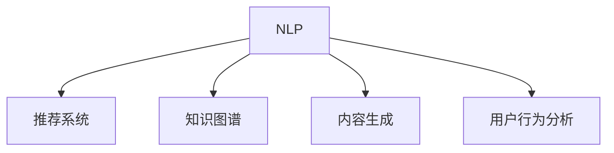

                 

# AI搜索引擎如何促进创新思维

> 关键词：AI搜索引擎, 创新思维, 信息检索, 自然语言处理(NLP), 推荐系统, 智能问答, 知识图谱, 内容生成, 用户行为分析

## 1. 背景介绍

在当今信息爆炸的时代，人们每天产生海量的信息，包括文本、图片、视频等。如何从海量信息中快速检索到有价值的内容，成为了一个亟待解决的问题。传统的搜索引擎主要依靠关键词匹配算法，而AI技术的引入，尤其是自然语言处理(NLP)、推荐系统和知识图谱等技术的融合，让搜索引擎逐渐演变成更智能、更全面的AI搜索引擎，为创新思维的激发提供了新的可能性。

### 1.1 问题由来

在信息时代，互联网成为我们获取知识、信息、娱乐的主要来源。传统的搜索引擎已经无法满足人们日益增长的信息需求，特别是在面对复杂查询、跨领域信息融合、个性化推荐等问题时，传统算法显得力不从心。AI搜索引擎的出现，通过深度学习、自然语言处理、推荐系统等技术手段，能够更准确、更全面、更智能地满足用户的信息需求。

### 1.2 问题核心关键点

AI搜索引擎的核心在于其能够理解用户的查询意图，从大量的文本数据中提取出有用的信息，并提供个性化的搜索结果。其核心技术包括：

- 自然语言处理(NLP)：理解、处理和生成自然语言，从而更精准地匹配用户查询。
- 推荐系统：根据用户行为和偏好，推荐可能感兴趣的内容。
- 知识图谱：构建实体之间的关系图谱，帮助搜索引擎理解复杂的语义网络。
- 内容生成：自动生成高质量的文本内容，提升用户体验。

这些核心技术紧密相连，共同构成了一个能够有效帮助用户发现新知识、激发创新思维的AI搜索引擎。

## 2. 核心概念与联系

### 2.1 核心概念概述

为了更好地理解AI搜索引擎的核心技术，本节将介绍几个关键概念：

- 自然语言处理(NLP)：研究如何让计算机理解、处理和生成自然语言的技术，包括分词、词性标注、句法分析、语义理解等。
- 推荐系统：根据用户行为和偏好，推荐可能感兴趣的内容。
- 知识图谱：构建实体之间的关系图谱，帮助搜索引擎理解复杂的语义网络。
- 内容生成：自动生成高质量的文本内容，提升用户体验。
- 用户行为分析：分析用户的行为数据，了解用户需求和兴趣，从而提供更个性化的服务。

这些核心概念之间的逻辑关系可以通过以下Mermaid流程图来展示：



这个流程图展示了大语言模型的核心概念及其之间的关系：

1. NLP处理用户查询，提取关键信息。
2. 推荐系统根据用户行为和兴趣，提供个性化推荐。
3. 知识图谱帮助理解和构建语义网络。
4. 内容生成技术辅助用户获取更多信息。
5. 用户行为分析收集数据，不断优化服务。

这些核心概念共同构成了AI搜索引擎的工作原理和优化方向。

## 3. 核心算法原理 & 具体操作步骤
### 3.1 算法原理概述

AI搜索引擎的算法原理主要涉及以下几个方面：

1. **信息检索**：搜索引擎通过自然语言处理(NLP)技术，理解用户的查询意图，并从大量的文本数据中提取出有用的信息，返回与查询意图匹配的结果。
2. **推荐系统**：根据用户的行为和兴趣，推荐可能感兴趣的内容，提升用户体验。
3. **知识图谱**：构建实体之间的关系图谱，帮助搜索引擎理解复杂的语义网络。
4. **内容生成**：利用深度学习等技术，自动生成高质量的文本内容，辅助用户获取更多信息。

### 3.2 算法步骤详解

基于AI搜索引擎的核心技术，其操作步骤主要包括：

1. **信息检索**：
   - 用户输入查询。
   - 使用NLP技术进行文本预处理，包括分词、词性标注、句法分析等。
   - 提取查询中的关键信息，生成查询向量。
   - 检索文本库中与查询向量相似度高的文档，返回检索结果。

2. **推荐系统**：
   - 收集用户的历史行为数据，如浏览记录、点击记录、搜索历史等。
   - 使用协同过滤、内容过滤等算法，根据用户行为和兴趣，推荐可能感兴趣的内容。
   - 更新推荐模型，适应用户行为的变化。

3. **知识图谱**：
   - 收集和处理领域内的数据，构建实体之间的关系图谱。
   - 使用图神经网络等技术，对知识图谱进行嵌入表示。
   - 利用知识图谱信息，辅助搜索引擎理解复杂的语义网络。

4. **内容生成**：
   - 收集大量的文本数据，使用深度学习技术，如生成对抗网络(GAN)、变分自编码器(VAE)等，自动生成高质量的文本内容。
   - 对生成的文本进行质量评估和优化，确保内容的相关性和可读性。

### 3.3 算法优缺点

AI搜索引擎的优点在于：

- 能够理解自然语言查询，提供更精准的信息检索。
- 能够根据用户行为和兴趣，提供个性化推荐，提升用户体验。
- 利用知识图谱技术，理解复杂的语义网络，提供更深入的信息。
- 自动生成高质量的文本内容，帮助用户获取更多信息。

其缺点主要包括：

- 对数据量和数据质量有较高要求，需要大量的标注数据和高质量的语料库。
- 需要复杂的算法和模型，对计算资源和算力要求较高。
- 对隐私和数据安全问题需要高度关注，确保用户数据的安全。

尽管存在这些局限性，但AI搜索引擎在提供更智能、更全面的信息检索和推荐服务方面，已经展现了巨大的潜力和价值。

### 3.4 算法应用领域

AI搜索引擎的应用领域非常广泛，涵盖了多个行业和场景：

- 电子商务：根据用户的浏览和购买历史，推荐可能感兴趣的商品。
- 新闻媒体：提供个性化的新闻推荐，帮助用户发现感兴趣的报道和文章。
- 教育：根据学生的学习行为和兴趣，推荐适合的学习资源和资料。
- 医疗：提供个性化的医疗信息，帮助患者找到相关的医疗知识和信息。
- 金融：根据用户的投资行为和兴趣，推荐适合的理财产品和资讯。
- 旅游：根据用户的旅行历史和兴趣，推荐旅游目的地和相关旅游信息。

此外，AI搜索引擎还在智能客服、智慧城市、智能家居等多个领域中得到应用，提升了各行各业的服务质量和效率。

## 4. 数学模型和公式 & 详细讲解 & 举例说明

### 4.1 数学模型构建

AI搜索引擎的数学模型主要涉及以下几个方面：

- 文本表示模型：将文本转化为向量表示，方便进行相似度计算。
- 推荐算法模型：利用协同过滤、内容过滤等算法，根据用户行为和兴趣，推荐可能感兴趣的内容。
- 知识图谱嵌入模型：将知识图谱中的实体和关系，转化为向量表示，便于信息检索和推理。

### 4.2 公式推导过程

以下我们以信息检索为例，推导向量空间模型(Vector Space Model)的计算公式。

假设查询向量为 $q$，文本向量为 $d$，则向量空间模型中，查询与文本的相似度计算公式为：

$$
\text{similarity}(q, d) = \frac{q^T \cdot d}{\|q\| \cdot \|d\|}
$$

其中 $q^T$ 表示查询向量的转置，$\|q\|$ 和 $\|d\|$ 分别表示查询向量和文本向量的模长。

在实际应用中，使用余弦相似度计算查询向量与文本向量的相似度，计算公式为：

$$
\text{cosine similarity}(q, d) = \frac{q \cdot d}{\|q\| \cdot \|d\|}
$$

以上公式展示了向量空间模型的基本计算过程，通过将文本和查询向量映射到高维向量空间，计算它们之间的余弦相似度，从而找到与查询意图最匹配的文本。

### 4.3 案例分析与讲解

以Google搜索为例，分析其信息检索和推荐系统的实现过程：

1. **信息检索**：
   - 用户输入查询，如“如何在Python中处理数据”。
   - Google的NLP系统将查询转换为向量表示，生成查询向量 $q$。
   - 检索Google的文本库，找到与查询向量相似度高的文本向量 $d_1, d_2, \ldots, d_n$。
   - 返回与查询意图最匹配的文本，如Google搜索结果页面。

2. **推荐系统**：
   - Google收集用户的搜索历史、点击记录等行为数据，构建用户行为向量 $u$。
   - 使用协同过滤算法，根据用户行为和兴趣，推荐可能感兴趣的内容。
   - 更新推荐模型，根据用户的最新行为数据进行动态调整。

Google的推荐系统通过协同过滤算法，根据用户的历史行为和兴趣，推荐可能感兴趣的内容，提升用户体验。例如，如果用户经常搜索Python编程相关的内容，Google会推荐更多关于Python的教程、框架、工具等资源。

## 5. 项目实践：代码实例和详细解释说明
### 5.1 开发环境搭建

在进行AI搜索引擎的开发实践前，我们需要准备好开发环境。以下是使用Python进行TensorFlow开发的开发环境配置流程：

1. 安装Anaconda：从官网下载并安装Anaconda，用于创建独立的Python环境。

2. 创建并激活虚拟环境：
```bash
conda create -n tensorflow-env python=3.8 
conda activate tensorflow-env
```

3. 安装TensorFlow：根据CUDA版本，从官网获取对应的安装命令。例如：
```bash
conda install tensorflow -c pytorch -c conda-forge
```

4. 安装各类工具包：
```bash
pip install numpy pandas scikit-learn matplotlib tqdm jupyter notebook ipython
```

完成上述步骤后，即可在`tensorflow-env`环境中开始开发实践。

### 5.2 源代码详细实现

下面我们以基于TensorFlow的推荐系统为例，给出实现代码。

```python
import tensorflow as tf
from tensorflow.keras.layers import Input, Embedding, Dot, Dense
from tensorflow.keras.models import Model

# 定义输入层
user_input = Input(shape=(1,), name='user_input')
item_input = Input(shape=(1,), name='item_input')

# 定义嵌入层
user_embedding = Embedding(input_dim=n_users, output_dim=embedding_dim, name='user_embedding')(user_input)
item_embedding = Embedding(input_dim=n_items, output_dim=embedding_dim, name='item_embedding')(item_input)

# 定义点积层
dot = Dot(axes=1)([user_embedding, item_embedding])

# 定义输出层
output = Dense(1, activation='sigmoid', name='output')(dot)

# 定义模型
model = Model(inputs=[user_input, item_input], outputs=output)

# 编译模型
model.compile(optimizer='adam', loss='binary_crossentropy', metrics=['accuracy'])

# 训练模型
model.fit([user_input_train, item_input_train], item_label_train, epochs=num_epochs, batch_size=batch_size)
```

以上是使用TensorFlow实现推荐系统的基本代码。可以看到，通过定义输入层、嵌入层、点积层和输出层，可以构建一个基于协同过滤的推荐模型。训练时，将用户和物品的嵌入向量进行点积计算，然后通过一个sigmoid激活函数输出预测结果，最后通过二分类交叉熵损失函数进行训练。

### 5.3 代码解读与分析

让我们再详细解读一下关键代码的实现细节：

**用户输入和物品输入**：
- 使用`Input`层定义用户和物品的输入，分别表示用户的ID和物品的ID。

**嵌入层**：
- 使用`Embedding`层将用户的ID和物品的ID转化为向量表示。例如，`Embedding`层的参数`input_dim`表示嵌入向量的维度，`output_dim`表示输出的向量维度。

**点积层**：
- 使用`Dot`层计算用户向量和物品向量的点积，得到用户和物品的相似度。

**输出层**：
- 使用`Dense`层将点积结果进行线性变换，输出预测结果。

**模型编译与训练**：
- 使用`compile`方法定义模型的优化器和损失函数，编译模型。
- 使用`fit`方法训练模型，传入训练数据和标签，定义训练轮数和批次大小。

以上代码展示了基于TensorFlow的推荐系统实现过程，通过构建嵌入层和点积层，计算用户和物品的相似度，进而实现推荐功能。

## 6. 实际应用场景
### 6.1 智能客服系统

基于AI搜索引擎的智能客服系统，可以通过用户输入的自然语言查询，快速理解用户意图，并给出相应的回答。这种系统不仅能够提供24小时不间断的服务，还能根据用户的历史查询记录，推荐可能感兴趣的问题或回答。例如，当用户询问“如何设置Python环境”时，智能客服系统可以根据用户的历史查询记录，推荐相关的问题或回答，提升用户满意度。

### 6.2 金融舆情监测

金融领域需要实时监测市场舆论动向，以便及时应对负面信息传播，规避金融风险。基于AI搜索引擎的金融舆情监测系统，可以自动收集和分析网络上的金融新闻、评论等文本数据，判断舆论的情感倾向和变化趋势，及时预警可能的风险。例如，当市场出现利空消息时，系统可以自动识别并预警，帮助金融机构快速应对。

### 6.3 个性化推荐系统

当前的推荐系统往往只依赖用户的历史行为数据进行物品推荐，无法深入理解用户的真实兴趣偏好。基于AI搜索引擎的个性化推荐系统，可以更好地挖掘用户行为背后的语义信息，从而提供更精准、多样的推荐内容。例如，当用户浏览了某本技术书籍后，系统可以根据书籍的标题、摘要等信息，推荐相关书籍或文章，提升用户阅读体验。

### 6.4 未来应用展望

随着AI搜索引擎技术的不断发展，其应用场景将进一步扩展，为各个行业带来新的变革。

在智慧医疗领域，基于AI搜索引擎的智能诊疗系统，可以通过用户输入的症状描述，推荐最适合的诊疗方案，提升医疗服务的智能化水平。

在智能教育领域，基于AI搜索引擎的个性化学习推荐系统，可以根据学生的学习行为和兴趣，推荐适合的学习资源和资料，因材施教，促进教育公平，提高教学质量。

在智慧城市治理中，基于AI搜索引擎的城市事件监测系统，可以实时监测和分析城市事件，提高城市管理的自动化和智能化水平，构建更安全、高效的未来城市。

此外，在企业生产、社会治理、文娱传媒等众多领域，基于AI搜索引擎的人工智能应用也将不断涌现，为经济社会发展注入新的动力。

## 7. 工具和资源推荐
### 7.1 学习资源推荐

为了帮助开发者系统掌握AI搜索引擎的理论基础和实践技巧，这里推荐一些优质的学习资源：

1. TensorFlow官方文档：提供了丰富的API参考和示例，适合入门学习。
2. PyTorch官方文档：提供了详细的教程和案例，适合深入学习。
3. Coursera的深度学习课程：斯坦福大学开设的深度学习课程，涵盖了深度学习的基础知识和经典模型。
4. Udacity的NLP与机器学习课程：介绍了NLP的基础知识和深度学习模型，适合进阶学习。
5. GitHub上的AI搜索引擎开源项目：如TensorFlow-Serving，提供了完整的AI搜索引擎部署和优化示例。

通过对这些资源的学习实践，相信你一定能够快速掌握AI搜索引擎的核心技术，并用于解决实际的NLP问题。
###  7.2 开发工具推荐

高效的开发离不开优秀的工具支持。以下是几款用于AI搜索引擎开发的常用工具：

1. TensorFlow：基于Python的开源深度学习框架，灵活动态的计算图，适合快速迭代研究。
2. PyTorch：基于Python的开源深度学习框架，灵活的动态计算图，适合复杂模型训练。
3. Elasticsearch：开源搜索引擎，支持分布式部署和高性能的文本检索。
4. Apache Solr：开源搜索引擎，提供丰富的查询语言和插件支持。
5. Apache Flink：开源流处理框架，支持实时数据流处理，适合实时推荐系统。

合理利用这些工具，可以显著提升AI搜索引擎的开发效率，加快创新迭代的步伐。

### 7.3 相关论文推荐

AI搜索引擎的研究源于学界的持续研究。以下是几篇奠基性的相关论文，推荐阅读：

1. "Distributed Representations of Words and Phrases and their Compositionality"：提出Word2Vec模型，用于将单词映射到高维向量空间。
2. "Neural Machine Translation by Jointly Learning to Align and Translate"：提出神经机器翻译模型，通过编码-解码框架实现语言翻译。
3. "A Neural Attention Model for Abstractive Sentence Generation"：提出基于注意力机制的摘要生成模型，用于自动生成高质量的摘要。
4. "The Neural Designer"：介绍基于深度学习的自动设计系统，用于自动生成电路、芯片等硬件设计。
5. "Ask Me Anything: Dynamic Keyword Extraction and Completion for Conversational Recommendation Engines"：提出基于自然语言处理的推荐系统，用于动态提取和推荐关键词。

这些论文代表了大语言模型搜索引擎的发展脉络。通过学习这些前沿成果，可以帮助研究者把握学科前进方向，激发更多的创新灵感。

## 8. 总结：未来发展趋势与挑战
### 8.1 总结

本文对基于AI搜索引擎的信息检索和推荐技术进行了全面系统的介绍。首先阐述了AI搜索引擎的研发背景和意义，明确了其在提升信息检索效率、提供个性化推荐方面的独特价值。其次，从原理到实践，详细讲解了信息检索和推荐系统的数学模型和关键步骤，给出了AI搜索引擎的代码实现。同时，本文还广泛探讨了AI搜索引擎在智能客服、金融舆情、个性化推荐等多个领域的应用前景，展示了其巨大的潜力和价值。此外，本文精选了AI搜索引擎的各类学习资源，力求为读者提供全方位的技术指引。

通过本文的系统梳理，可以看到，基于AI搜索引擎的信息检索和推荐技术正在成为推动NLP应用发展的关键力量，极大地提升了信息检索和推荐系统的智能性和个性化程度，为用户的创新思维提供了更多的激发途径。

### 8.2 未来发展趋势

展望未来，AI搜索引擎的技术发展将呈现以下几个趋势：

1. 跨领域信息检索：通过跨领域知识图谱和语义融合技术，实现不同领域间的信息检索和推荐。
2. 实时性推荐：通过流处理框架，实现实时数据流的处理和推荐，提升推荐系统的响应速度。
3. 个性化推荐：利用用户行为数据和语义信息，提供更精准、多样化的个性化推荐。
4. 多模态融合：将文本、图像、视频等多模态信息进行融合，提升信息检索和推荐的全面性和准确性。
5. 隐私保护：保护用户隐私，确保数据安全和用户数据的匿名化处理。
6. 伦理和道德：在推荐系统设计中引入伦理导向的评估指标，避免偏见和歧视。

这些趋势凸显了AI搜索引擎技术的广阔前景，将在多个领域中发挥重要作用，为构建人机协同的智能系统铺平道路。

### 8.3 面临的挑战

尽管AI搜索引擎技术已经取得了瞩目成就，但在迈向更加智能化、普适化应用的过程中，仍面临诸多挑战：

1. 数据质量和数据量：需要大量的高质量标注数据和语料库，才能训练出高性能的模型。
2. 计算资源和算力：AI搜索引擎需要处理海量的文本数据和复杂的算法模型，对计算资源和算力有较高要求。
3. 隐私和数据安全：需要保证用户数据的安全，避免隐私泄露和数据滥用。
4. 模型复杂性和可解释性：AI搜索引擎模型复杂度高，难以解释其内部决策过程，需要进一步提升模型的可解释性。
5. 跨领域适用性：在多个领域应用时，需要解决领域适应性问题，提升模型泛化能力。

这些挑战需要研究者不断优化算法、改进模型、提升数据质量，才能使AI搜索引擎技术真正落地应用，为各行各业带来创新和发展。

### 8.4 研究展望

面对AI搜索引擎所面临的挑战，未来的研究需要在以下几个方面寻求新的突破：

1. 探索更多无监督和半监督学习范式：摆脱对大规模标注数据的依赖，利用自监督学习、主动学习等技术，最大化利用非结构化数据。
2. 开发更高效的模型结构和算法：提高模型的计算效率和推理速度，优化模型结构，降低内存消耗。
3. 引入更多先验知识和知识图谱：将符号化的先验知识与神经网络模型进行融合，提升模型的泛化能力和跨领域适应性。
4. 提高模型的可解释性和可解释性：引入因果推断和博弈论思想，提高模型的可解释性和可解释性。
5. 加强隐私保护和数据安全：引入差分隐私、联邦学习等技术，确保用户数据的安全和隐私保护。

这些研究方向的探索，将引领AI搜索引擎技术迈向更高的台阶，为构建安全、可靠、可解释、可控的智能系统铺平道路。总之，AI搜索引擎技术的不断发展和优化，必将在构建安全、可靠、可解释、可控的智能系统方面发挥重要作用，推动自然语言处理和人工智能技术的进步。

## 9. 附录：常见问题与解答
### Q1: 如何选择合适的学习率？

A: 学习率的选择是一个关键问题，需要平衡模型的收敛速度和稳定性。一般建议从较小的学习率开始，逐步增加，直到模型开始过拟合，再逐步减小。可以参考学习率调度策略，如余弦学习率、步长学习率等。

### Q2: 如何缓解AI搜索引擎的过拟合问题？

A: 过拟合是AI搜索引擎面临的常见问题，可以通过以下方法缓解：
1. 数据增强：通过文本生成、近义替换等方式扩充训练集。
2. 正则化：使用L2正则、Dropout等技术，防止模型过拟合。
3. 对抗训练：引入对抗样本，提高模型的鲁棒性。
4. 参数高效微调：只调整少量模型参数，避免过拟合。

### Q3: 如何在AI搜索引擎中引入更多先验知识？

A: 在AI搜索引擎中引入先验知识，可以通过以下方法：
1. 结合知识图谱：利用知识图谱中的实体和关系，辅助模型理解语义网络。
2. 结合规则和模板：使用规则和模板，指导模型推理和生成。
3. 结合外部资源：利用外部资源如数据库、API等，辅助模型决策。

### Q4: 如何提高AI搜索引擎的可解释性？

A: 提高AI搜索引擎的可解释性，可以通过以下方法：
1. 引入因果推断：分析模型决策的关键特征，提高决策的可解释性。
2. 引入博弈论：描述人机交互过程，主动探索和规避模型的脆弱点。
3. 引入符号化知识：结合符号化的先验知识，提升模型的可解释性和逻辑性。

### Q5: 如何保证AI搜索引擎的隐私和数据安全？

A: 保证AI搜索引擎的隐私和数据安全，可以通过以下方法：
1. 数据脱敏：对用户数据进行匿名化处理，保护用户隐私。
2. 差分隐私：使用差分隐私技术，确保用户数据的安全。
3. 联邦学习：在分布式环境中进行模型训练，避免数据集中存储。
4. 访问控制：对模型和服务进行访问控制，确保数据安全。

### Q6: 如何提升AI搜索引擎的实时性？

A: 提升AI搜索引擎的实时性，可以通过以下方法：
1. 使用流处理框架：如Apache Flink，处理实时数据流。
2. 优化模型结构：使用轻量级模型，减少计算量。
3. 优化算法：使用高效的算法，提升模型推理速度。

### Q7: 如何提高AI搜索引擎的跨领域适应性？

A: 提高AI搜索引擎的跨领域适应性，可以通过以下方法：
1. 引入领域适应技术：如迁移学习、领域自适应等。
2. 引入跨领域知识图谱：利用跨领域知识图谱，提升模型泛化能力。
3. 引入多语言模型：利用多语言模型，提升模型在不同语言环境中的适应性。

---

作者：禅与计算机程序设计艺术 / Zen and the Art of Computer Programming

