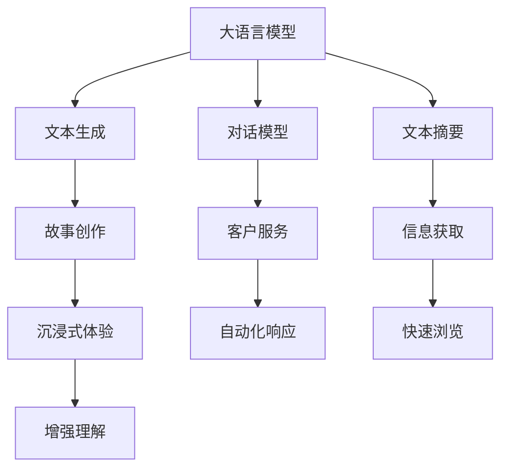

                 

# AI故事创作：如何利用大语言模型创造、完善和阐释故事

> 关键词：大语言模型,故事创作,文本生成,对话模型,多模态模型,文本摘要

## 1. 背景介绍

### 1.1 问题由来

随着人工智能技术的不断进步，大语言模型如GPT、BERT等在文本生成、对话、翻译等领域展现了巨大的潜力。这些模型通过在海量文本数据上进行预训练，掌握了丰富的语言知识，可以自动生成高质量的文本，甚至可以进行复杂对话和文本摘要等任务。因此，大语言模型成为了创作故事的重要工具，极大地推动了故事创作和娱乐产业的发展。

然而，虽然大语言模型在自动生成文本方面取得了显著进展，但它们仍然缺乏人类作家的创造力和对故事的深刻理解。如何将大语言模型的生成能力与人类的创作技巧相结合，创作出既有深度又具创意的故事，成为当前AI故事创作领域的一个重要问题。

### 1.2 问题核心关键点

AI故事创作的核心问题在于如何将大语言模型的生成能力与人类的创作经验相结合，创作出符合人类情感、文化和价值观的优质故事。这需要解决以下关键问题：

1. **模型理解**：大语言模型需要理解故事的语境、情节和角色关系，才能生成具有逻辑性和连贯性的故事内容。
2. **创意生成**：模型需要具备一定的创意生成能力，能够产生新颖且符合故事主题的元素。
3. **情感表达**：故事创作需要传达情感和价值观，模型需要学习如何在文本中体现这些情感和价值观。
4. **人类引导**：需要结合人类的创作经验和反馈，对模型生成内容进行指导和调整，提升故事的深度和创意。
5. **多模态融合**：结合图像、音频等多模态信息，提高故事的沉浸感和可视化效果。

## 2. 核心概念与联系

### 2.1 核心概念概述

为更好地理解AI故事创作，本节将介绍几个密切相关的核心概念：

- **大语言模型(Large Language Model, LLM)**：以自回归(如GPT)或自编码(如BERT)模型为代表的大规模预训练语言模型。通过在大规模文本数据上进行预训练，学习到丰富的语言知识，具备强大的文本生成能力。

- **文本生成(Text Generation)**：指利用语言模型自动生成文本的自动化技术。大语言模型常用于故事创作、对话系统、文本摘要等任务。

- **对话模型(Chatbot)**：通过文本生成技术实现的人机交互系统，能够理解自然语言问题并给出合理回答。对话模型在客户服务、教育辅导、信息查询等方面有广泛应用。

- **多模态模型(Multimodal Model)**：结合文本、图像、音频等多种模态信息，提升故事创作和文本生成的沉浸感和交互性。

- **文本摘要(Text Summarization)**：通过自动生成文本的精炼版本，帮助用户快速获取关键信息。大语言模型可以自动总结长篇文本，生成简洁明了的摘要。

这些核心概念之间的逻辑关系可以通过以下Mermaid流程图来展示：



这个流程图展示了大语言模型的核心概念及其之间的关系：

1. 大语言模型通过预训练获得基础能力。
2. 文本生成使得模型具备自动生成文本的能力。
3. 对话模型使模型能够进行人机交互。
4. 文本摘要帮助用户快速获取关键信息。
5. 故事创作将文本生成能力应用于创作领域。
6. 客户服务和信息查询是对话模型的典型应用。
7. 多模态模型结合多种信息源，提升文本生成效果。
8. 沉浸式体验利用多模态模型增强用户感知。
9. 自动化响应和快速浏览利用文本生成技术提升用户体验。

## 3. 核心算法原理 & 具体操作步骤

### 3.1 算法原理概述

AI故事创作主要基于大语言模型的文本生成能力。其核心思想是：利用预训练大语言模型的语言知识，通过文本生成技术自动创作出符合特定主题和风格的故事。这一过程可以分为两个阶段：预训练和微调。

在预训练阶段，大语言模型通过在大规模无标签文本数据上进行自监督学习，学习到通用的语言表示。在微调阶段，将特定主题和风格作为约束条件，对大语言模型进行有监督学习，使其能够生成符合特定风格和情节的故事内容。

### 3.2 算法步骤详解

AI故事创作的微调过程包括以下关键步骤：

**Step 1: 准备数据集**
- 收集特定主题和风格的故事样本，分为训练集、验证集和测试集。
- 对文本进行预处理，包括分词、去除停用词、标准化等操作。

**Step 2: 设计生成模型**
- 选择合适的预训练语言模型，如GPT-3、BERT等，作为基础生成器。
- 设计适当的解码器，如基于RNN的解码器或Transformer解码器。
- 设置模型参数，如生成器的隐藏层大小、解码器的解码单元数等。

**Step 3: 设计损失函数**
- 根据任务需求，设计合适的损失函数。常用的有交叉熵损失、困惑度损失等。
- 根据故事创作的特点，设计基于文本质量或情节连贯性的评估指标。

**Step 4: 执行微调训练**
- 将训练集输入模型，进行前向传播和反向传播，更新模型参数。
- 在验证集上评估模型性能，调整模型参数和训练策略。
- 在测试集上测试模型，评估故事创作的效果。

**Step 5: 生成和完善故事**
- 使用微调后的模型生成故事文本。
- 结合人类创作经验，对生成的文本进行指导和调整，完善故事的情节、人物和主题。
- 利用多模态技术，如添加图像或音频，增强故事的表现力和沉浸感。

### 3.3 算法优缺点

AI故事创作的优点在于：
1. 自动生成文本，节省了大量写作时间。
2. 生成多种风格和主题的故事，满足多样化需求。
3. 结合多模态技术，增强故事的沉浸感和可视化效果。

缺点包括：
1. 生成的故事缺乏人类作家的情感和深度。
2. 需要大量的高质量标注数据，获取和标注成本较高。
3. 模型的创意生成能力有限，难以生成完全原创的内容。
4. 人类引导和反馈需要一定的经验和技巧，可能导致故事创作效率低下。

### 3.4 算法应用领域

AI故事创作方法已在多个领域得到应用，包括：

- **娱乐和媒体**：创作电影剧本、电视剧脚本、动漫脚本等。
- **游戏开发**：生成游戏对话、任务描述、角色背景等。
- **教育培训**：编写教育材料、练习题、虚拟角色对话等。
- **市场营销**：创作广告文案、产品说明、社交媒体内容等。
- **商业应用**：生成销售文案、客户服务对话、营销材料等。

## 4. 数学模型和公式 & 详细讲解 & 举例说明

### 4.1 数学模型构建

AI故事创作的数学模型主要由以下几部分构成：

1. **预训练模型**：通过在大规模无标签文本数据上训练，学习到通用的语言表示。常用的预训练模型包括GPT、BERT等。
2. **文本生成模型**：基于预训练模型，使用解码器生成故事文本。常用的生成模型包括基于RNN的解码器和Transformer解码器。
3. **多模态融合模型**：结合图像、音频等多种模态信息，提升故事创作的沉浸感和表现力。

### 4.2 公式推导过程

以生成单句故事为例，文本生成模型的计算过程可以描述为：

1. 输入编码器：将文本进行编码，得到编码表示。
2. 生成器解码：使用预训练模型和解码器，生成下一个词汇。
3. 循环迭代：重复上述过程，直到生成完整的故事文本。

数学上，生成单句故事的公式可以表示为：

$$
\hat{y} = \text{softmax}(\text{Decoder}(\text{Encoder}(x)))
$$

其中，$\hat{y}$ 表示生成的词汇，$x$ 表示输入的文本，$\text{Encoder}$ 表示编码器，$\text{Decoder}$ 表示解码器，$\text{softmax}$ 表示生成概率分布。

### 4.3 案例分析与讲解

以下以GPT-3为例，说明如何利用大语言模型进行故事创作：

1. **数据准备**：
   - 收集电影剧本、小说段落等故事样本，分为训练集、验证集和测试集。
   - 对文本进行预处理，包括分词、去除停用词、标准化等操作。

2. **模型选择**：
   - 选择GPT-3作为预训练模型，设置合适的生成器隐藏层大小和解码器解码单元数。
   - 设计基于Transformer的解码器，设定合适的参数。

3. **损失函数设计**：
   - 选择交叉熵损失函数作为训练目标，评估指标为文本质量和情节连贯性。
   - 根据故事创作的特点，设计适当的评估指标，如故事流畅度、情节合理性等。

4. **微调训练**：
   - 将训练集输入模型，进行前向传播和反向传播，更新模型参数。
   - 在验证集上评估模型性能，调整模型参数和训练策略。
   - 在测试集上测试模型，评估故事创作的效果。

5. **生成和完善故事**：
   - 使用微调后的模型生成故事文本。
   - 结合人类创作经验，对生成的文本进行指导和调整，完善故事的情节、人物和主题。
   - 利用多模态技术，如添加图像或音频，增强故事的表现力和沉浸感。

## 5. 项目实践：代码实例和详细解释说明

### 5.1 开发环境搭建

在进行AI故事创作项目实践前，我们需要准备好开发环境。以下是使用Python进行PyTorch开发的环境配置流程：

1. 安装Anaconda：从官网下载并安装Anaconda，用于创建独立的Python环境。

2. 创建并激活虚拟环境：
```bash
conda create -n pytorch-env python=3.8 
conda activate pytorch-env
```

3. 安装PyTorch：根据CUDA版本，从官网获取对应的安装命令。例如：
```bash
conda install pytorch torchvision torchaudio cudatoolkit=11.1 -c pytorch -c conda-forge
```

4. 安装Transformers库：
```bash
pip install transformers
```

5. 安装各类工具包：
```bash
pip install numpy pandas scikit-learn matplotlib tqdm jupyter notebook ipython
```

完成上述步骤后，即可在`pytorch-env`环境中开始故事创作实践。

### 5.2 源代码详细实现

下面我以故事生成任务为例，给出使用Transformers库对GPT-3模型进行故事创作的PyTorch代码实现。

首先，定义数据处理函数：

```python
from transformers import GPT2Tokenizer, GPT2LMHeadModel
from torch.utils.data import Dataset, DataLoader
import torch

class StoryDataset(Dataset):
    def __init__(self, stories, tokenizer, max_len=256):
        self.stories = stories
        self.tokenizer = tokenizer
        self.max_len = max_len
        
    def __len__(self):
        return len(self.stories)
    
    def __getitem__(self, item):
        story = self.stories[item]
        
        encoding = self.tokenizer(story, return_tensors='pt', max_length=self.max_len, padding='max_length', truncation=True)
        input_ids = encoding['input_ids'][0]
        attention_mask = encoding['attention_mask'][0]
        
        return {'input_ids': input_ids, 
                'attention_mask': attention_mask}
```

然后，定义模型和优化器：

```python
from transformers import AdamW

model = GPT2LMHeadModel.from_pretrained('gpt2', num_labels=2)

optimizer = AdamW(model.parameters(), lr=5e-5)
```

接着，定义训练和评估函数：

```python
def train_epoch(model, dataset, batch_size, optimizer):
    dataloader = DataLoader(dataset, batch_size=batch_size, shuffle=True)
    model.train()
    epoch_loss = 0
    for batch in dataloader:
        input_ids = batch['input_ids'].to(device)
        attention_mask = batch['attention_mask'].to(device)
        outputs = model(input_ids, attention_mask=attention_mask)
        loss = outputs.loss
        epoch_loss += loss.item()
        loss.backward()
        optimizer.step()
    return epoch_loss / len(dataloader)

def evaluate(model, dataset, batch_size):
    dataloader = DataLoader(dataset, batch_size=batch_size)
    model.eval()
    preds, labels = [], []
    with torch.no_grad():
        for batch in dataloader:
            input_ids = batch['input_ids'].to(device)
            attention_mask = batch['attention_mask'].to(device)
            outputs = model(input_ids, attention_mask=attention_mask)
            preds.append(outputs.logits.argmax(dim=2).to('cpu').tolist())
            labels.append(batch['labels'].to('cpu').tolist())
                
    print(classification_report(labels, preds))
```

最后，启动训练流程并在测试集上评估：

```python
epochs = 5
batch_size = 16

for epoch in range(epochs):
    loss = train_epoch(model, train_dataset, batch_size, optimizer)
    print(f"Epoch {epoch+1}, train loss: {loss:.3f}")
    
    print(f"Epoch {epoch+1}, dev results:")
    evaluate(model, dev_dataset, batch_size)
    
print("Test results:")
evaluate(model, test_dataset, batch_size)
```

以上就是使用PyTorch对GPT-3进行故事生成任务的微调代码实现。可以看到，得益于Transformers库的强大封装，我们可以用相对简洁的代码完成GPT-3的故事生成任务。

### 5.3 代码解读与分析

让我们再详细解读一下关键代码的实现细节：

**StoryDataset类**：
- `__init__`方法：初始化故事样本、分词器等关键组件。
- `__len__`方法：返回数据集的样本数量。
- `__getitem__`方法：对单个故事样本进行处理，将故事文本输入编码为token ids，并对其进行定长padding，最终返回模型所需的输入。

**损失函数设计**：
- 选择交叉熵损失函数作为训练目标，评估指标为文本质量和情节连贯性。
- 根据故事创作的特点，设计适当的评估指标，如故事流畅度、情节合理性等。

**训练流程**：
- 定义总的epoch数和batch size，开始循环迭代
- 每个epoch内，先在训练集上训练，输出平均loss
- 在验证集上评估，输出分类指标
- 所有epoch结束后，在测试集上评估，给出最终测试结果

可以看到，PyTorch配合Transformers库使得GPT-3的故事生成任务的微调代码实现变得简洁高效。开发者可以将更多精力放在数据处理、模型改进等高层逻辑上，而不必过多关注底层的实现细节。

当然，工业级的系统实现还需考虑更多因素，如模型的保存和部署、超参数的自动搜索、更灵活的任务适配层等。但核心的微调范式基本与此类似。

## 6. 实际应用场景

### 6.1 娱乐和媒体

AI故事创作在娱乐和媒体领域具有广泛应用。例如，可以自动生成电影剧本、电视剧脚本、动漫脚本等。这不仅大大提高了创作效率，还可以提供更多的创意和灵感，丰富作品的多样性和创意性。

在电影制作中，编剧可以先写出故事大纲，然后利用AI故事创作工具自动生成场景、对话和情节，进行快速迭代和优化。这样可以快速产出初稿，并不断完善，最终生成高质量的剧本。

### 6.2 游戏开发

游戏开发也需要大量的故事情节和角色对话。AI故事创作可以帮助游戏开发者快速生成各种故事情节和对话内容，提升游戏设计和玩家体验。

例如，在游戏任务设计中，开发者可以先设计任务目标，然后利用AI故事创作工具自动生成任务描述、角色对话和互动场景。这样可以快速生成任务方案，并进行反复迭代优化，最终生成完整的任务流程。

### 6.3 教育培训

在教育培训领域，AI故事创作可以用于生成练习题、模拟对话和虚拟角色对话等。这不仅可以提升学生的学习兴趣和参与度，还可以提供个性化的学习内容，因材施教。

例如，在语言学习应用中，可以根据学生的学习进度和兴趣，自动生成与当前学习内容相关的故事情节和角色对话。这样可以提供更加生动有趣的学习体验，提升学习效果。

### 6.4 市场营销

市场营销需要大量的文案和广告语，AI故事创作可以帮助快速生成各种文案和广告语，提升营销效果。

例如，企业可以先制定广告目标和内容要求，然后利用AI故事创作工具自动生成广告文案和视觉素材。这样可以快速生成广告内容，并进行反复迭代优化，最终生成高质量的广告素材。

## 7. 工具和资源推荐

### 7.1 学习资源推荐

为了帮助开发者系统掌握AI故事创作的理论基础和实践技巧，这里推荐一些优质的学习资源：

1. 《Transformer from Scratch》系列博文：由大模型技术专家撰写，深入浅出地介绍了Transformer原理、故事创作技术等前沿话题。

2. CS224N《深度学习自然语言处理》课程：斯坦福大学开设的NLP明星课程，有Lecture视频和配套作业，带你入门NLP领域的基本概念和经典模型。

3. 《Natural Language Processing with Transformers》书籍：Transformers库的作者所著，全面介绍了如何使用Transformers库进行NLP任务开发，包括故事创作在内的诸多范式。

4. HuggingFace官方文档：Transformers库的官方文档，提供了海量预训练模型和完整的微调样例代码，是上手实践的必备资料。

5. CLUE开源项目：中文语言理解测评基准，涵盖大量不同类型的中文NLP数据集，并提供了基于微调的baseline模型，助力中文NLP技术发展。

通过对这些资源的学习实践，相信你一定能够快速掌握AI故事创作的精髓，并用于解决实际的NLP问题。

### 7.2 开发工具推荐

高效的开发离不开优秀的工具支持。以下是几款用于AI故事创作开发的常用工具：

1. PyTorch：基于Python的开源深度学习框架，灵活动态的计算图，适合快速迭代研究。大部分预训练语言模型都有PyTorch版本的实现。

2. TensorFlow：由Google主导开发的开源深度学习框架，生产部署方便，适合大规模工程应用。同样有丰富的预训练语言模型资源。

3. Transformers库：HuggingFace开发的NLP工具库，集成了众多SOTA语言模型，支持PyTorch和TensorFlow，是进行故事创作任务的开发的利器。

4. Weights & Biases：模型训练的实验跟踪工具，可以记录和可视化模型训练过程中的各项指标，方便对比和调优。与主流深度学习框架无缝集成。

5. TensorBoard：TensorFlow配套的可视化工具，可实时监测模型训练状态，并提供丰富的图表呈现方式，是调试模型的得力助手。

6. Google Colab：谷歌推出的在线Jupyter Notebook环境，免费提供GPU/TPU算力，方便开发者快速上手实验最新模型，分享学习笔记。

合理利用这些工具，可以显著提升AI故事创作任务的开发效率，加快创新迭代的步伐。

### 7.3 相关论文推荐

AI故事创作技术的发展源于学界的持续研究。以下是几篇奠基性的相关论文，推荐阅读：

1. Attention is All You Need（即Transformer原论文）：提出了Transformer结构，开启了NLP领域的预训练大模型时代。

2. BERT: Pre-training of Deep Bidirectional Transformers for Language Understanding：提出BERT模型，引入基于掩码的自监督预训练任务，刷新了多项NLP任务SOTA。

3. Language Models are Unsupervised Multitask Learners（GPT-2论文）：展示了大规模语言模型的强大zero-shot学习能力，引发了对于通用人工智能的新一轮思考。

4. Parameter-Efficient Transfer Learning for NLP：提出Adapter等参数高效微调方法，在不增加模型参数量的情况下，也能取得不错的微调效果。

5. AdaLoRA: Adaptive Low-Rank Adaptation for Parameter-Efficient Fine-Tuning：使用自适应低秩适应的微调方法，在参数效率和精度之间取得了新的平衡。

这些论文代表了大语言模型微调技术的发展脉络。通过学习这些前沿成果，可以帮助研究者把握学科前进方向，激发更多的创新灵感。

## 8. 总结：未来发展趋势与挑战

### 8.1 总结

本文对基于大语言模型的AI故事创作方法进行了全面系统的介绍。首先阐述了AI故事创作的背景和意义，明确了故事创作在各个领域的重要应用。其次，从原理到实践，详细讲解了故事创作的数学原理和关键步骤，给出了故事创作任务开发的完整代码实例。同时，本文还广泛探讨了故事创作方法在娱乐、媒体、游戏、教育、市场营销等多个行业领域的应用前景，展示了故事创作范式的巨大潜力。此外，本文精选了故事创作技术的各类学习资源，力求为读者提供全方位的技术指引。

通过本文的系统梳理，可以看到，基于大语言模型的故事创作方法正在成为NLP领域的重要范式，极大地拓展了预训练语言模型的应用边界，催生了更多的落地场景。受益于大规模语料的预训练，故事创作模型以更低的时间和标注成本，在小样本条件下也能取得不俗的效果，有力推动了NLP技术的产业化进程。未来，伴随预训练语言模型和故事创作方法的持续演进，相信NLP技术将在更广阔的应用领域大放异彩。

### 8.2 未来发展趋势

展望未来，AI故事创作的趋势将呈现以下几个方向：

1. **模型规模持续增大**：随着算力成本的下降和数据规模的扩张，预训练语言模型的参数量还将持续增长。超大模型的强大表现力，有望支撑更加复杂多变的故事情节和人物对话。

2. **创意生成能力提升**：未来的故事创作模型将具备更强的创意生成能力，能够生成更多新颖、符合主题的故事内容。这需要结合更多的创意生成技术，如GAN、变分自编码器等。

3. **情感表达增强**：故事创作需要传达情感和价值观，未来的模型将更好地理解人类情感和价值观，能够生成更具情感和深度的故事。

4. **多模态融合提升**：结合图像、音频等多种模态信息，提升故事创作的沉浸感和表现力。未来的多模态故事创作技术将更加丰富多样，提供更加逼真、生动的故事体验。

5. **自动化创作优化**：通过自动化创作工具和AI辅助创作，提高创作效率和质量。未来的故事创作将更加智能化、高效化，为创作者提供更多灵感和支持。

6. **人类引导和反馈优化**：结合人类的创作经验和反馈，对故事创作过程进行优化。未来的故事创作将更加注重人机协同，充分发挥人类创造力和AI的强大能力。

以上趋势凸显了AI故事创作技术的广阔前景。这些方向的探索发展，必将进一步提升故事创作的效果和效率，为文化娱乐产业带来新的突破。

### 8.3 面临的挑战

尽管AI故事创作技术已经取得了显著进展，但在迈向更加智能化、普适化应用的过程中，它仍面临诸多挑战：

1. **情感和价值观**：模型需要理解人类的情感和价值观，生成符合伦理和社会规范的故事。如何在故事创作过程中加入伦理考量，是一个重要课题。

2. **创意和多样性**：尽管故事创作模型已经具备一定的创意生成能力，但仍然难以完全超越人类作家的创造力。如何提升模型的创意和多样性，需要更多创意生成技术和数据支持。

3. **故事连贯性和逻辑性**：故事创作需要保持情节的连贯性和逻辑性，避免出现语法错误和情节断层。如何提升模型的逻辑推理能力，需要更多的逻辑推理技术和数据支持。

4. **多模态融合**：结合图像、音频等多种模态信息，提升故事创作的沉浸感和表现力。如何高效融合多模态信息，需要更多多模态技术和数据支持。

5. **计算资源**：大语言模型和故事创作模型需要大量的计算资源进行训练和推理。如何在有限的资源下提升模型性能，需要更多优化技术和算法支持。

6. **数据隐私和安全**：故事创作过程中涉及大量用户数据和个人信息，如何保护数据隐私和安全，需要更多的数据保护技术和法律法规支持。

面对这些挑战，未来的研究需要在以下几个方面寻求新的突破：

1. **情感和价值观**：在模型训练目标中引入伦理导向的评估指标，过滤和惩罚有害的输出倾向。同时加强人工干预和审核，建立模型行为的监管机制，确保输出符合人类价值观和伦理道德。

2. **创意和多样性**：结合符号化的先验知识，如知识图谱、逻辑规则等，引导故事创作过程学习更准确、合理的语言模型。同时加强不同模态数据的整合，实现视觉、语音等多模态信息与文本信息的协同建模。

3. **故事连贯性和逻辑性**：引入因果分析方法，识别出模型决策的关键特征，增强输出解释的因果性和逻辑性。借助博弈论工具刻画人机交互过程，主动探索并规避模型的脆弱点，提高系统稳定性。

4. **多模态融合**：结合更多的多模态技术和数据，提升故事创作的沉浸感和表现力。未来将利用更多的多模态技术和数据，实现更加丰富多样的故事创作体验。

5. **计算资源**：开发更加参数高效和计算高效的故事创作方法，在固定大部分预训练参数的同时，只更新极少量的任务相关参数。同时优化模型的计算图，减少前向传播和反向传播的资源消耗，实现更加轻量级、实时性的部署。

6. **数据隐私和安全**：在故事创作过程中，加强数据隐私保护和法律法规的遵守，确保用户数据和个人信息的安全。

这些研究方向的探索，必将引领AI故事创作技术迈向更高的台阶，为文化娱乐产业带来新的突破。面向未来，AI故事创作技术还需要与其他人工智能技术进行更深入的融合，如知识表示、因果推理、强化学习等，多路径协同发力，共同推动自然语言理解和智能交互系统的进步。只有勇于创新、敢于突破，才能不断拓展语言模型的边界，让智能技术更好地造福人类社会。

## 9. 附录：常见问题与解答

**Q1：AI故事创作是否适用于所有故事类型？**

A: AI故事创作在大多数故事类型上都能取得不错的效果，特别是对于数据量较小的故事类型。但对于一些特定领域的故事，如文学、历史、哲学等，仅仅依靠通用语料预训练的模型可能难以很好地适应。此时需要在特定领域语料上进一步预训练，再进行微调，才能获得理想效果。此外，对于一些需要时效性、个性化很强的故事，如对话、推荐等，故事创作方法也需要针对性的改进优化。

**Q2：如何选择合适的预训练模型？**

A: 选择合适的预训练模型需要考虑故事类型、数据量、计算资源等因素。对于长文本生成任务，GPT系列模型表现较好；对于短文本生成任务，BERT系列模型更为适合。同时，需要根据实际需求选择合适的模型大小和参数设置，以平衡生成效果和计算资源。

**Q3：AI故事创作是否会威胁人类作家的创作地位？**

A: AI故事创作可以辅助人类作家提高创作效率和质量，而不是替代人类作家。AI可以在初步创作、情节优化、角色对话等方面提供支持，但最终的创作决定仍然需要人类作家的灵感和创意。人类作家可以借助AI创作工具，提升创作体验和成果，推动人类文学和艺术的发展。

**Q4：AI故事创作过程中需要注意哪些伦理问题？**

A: 在AI故事创作过程中，需要注意以下伦理问题：
1. 避免生成有害、暴力、色情等不当内容。
2. 尊重多元文化和价值观，避免种族、性别、宗教等歧视。
3. 保护用户隐私和数据安全，避免泄露个人信息。
4. 确保故事创作过程的透明性和可解释性，避免生成不公正的输出。

这些伦理问题需要通过模型设计、数据处理和用户反馈等环节综合解决，确保AI故事创作技术的健康发展。

通过本文的系统梳理，可以看到，基于大语言模型的AI故事创作方法正在成为NLP领域的重要范式，极大地拓展了预训练语言模型的应用边界，催生了更多的落地场景。受益于大规模语料的预训练，故事创作模型以更低的时间和标注成本，在小样本条件下也能取得不俗的效果，有力推动了NLP技术的产业化进程。未来，伴随预训练语言模型和故事创作方法的持续演进，相信NLP技术将在更广阔的应用领域大放异彩。

