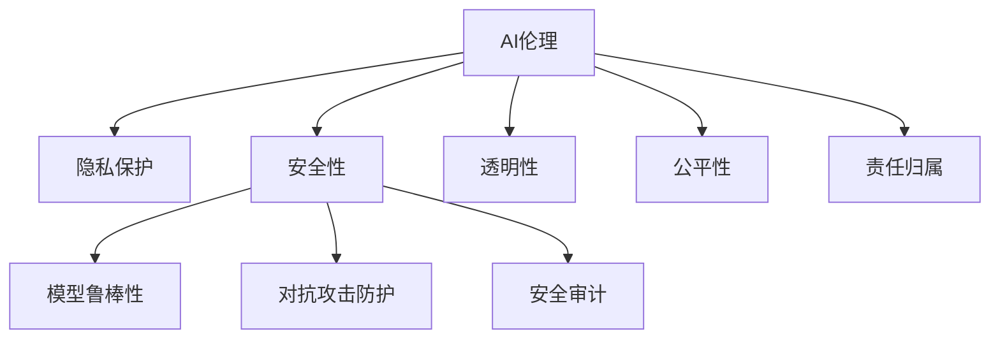

                 

## 1. 背景介绍

随着人工智能（AI）技术的迅猛发展，AI正在逐渐渗透到生活的各个方面，从医疗、金融、教育到娱乐、交通等，都产生了深远的影响。同时，AI也带来了新的道德、隐私和安全挑战。如何在AI技术飞速发展的同时，确保其伦理规范、保障用户隐私、保障系统安全，是当下和未来AI发展需要重点考虑的问题。本文将系统性地探讨这些问题，并提出相应的解决方案。

## 2. 核心概念与联系

### 2.1 核心概念概述

#### 2.1.1 AI伦理

AI伦理是指在AI技术的开发、应用和监管过程中，应当遵循的伦理规范和道德原则。这些伦理规范包括但不限于隐私保护、透明性、公平性、责任归属等。AI伦理强调人类应当在AI技术的运用中扮演主导角色，确保技术的发展始终服务于人类的福祉。

#### 2.1.2 隐私保护

隐私保护是指在AI技术应用过程中，对用户个人信息的保护。隐私保护涉及数据收集、存储、处理和使用的各个环节，包括数据匿名化、差分隐私、数据最小化等技术手段。隐私保护的目标是保护个人隐私不受侵害，同时确保数据的使用不违反法律法规。

#### 2.1.3 安全性

安全性是指AI系统在面对恶意攻击或故障时，能够确保系统的稳定性和安全性。安全性的保障包括但不限于模型鲁棒性、对抗攻击防护、安全审计等。

这些核心概念之间的关系可以通过以下Mermaid流程图来展示：



这个流程图展示了AI伦理、隐私保护和安全性之间的关系，以及它们各自涵盖的关键概念。

## 3. 核心算法原理 & 具体操作步骤

### 3.1 算法原理概述

AI伦理、隐私保护和安全性的考虑，通常贯穿于AI技术的全生命周期，从数据采集、模型训练、系统部署到用户交互。以下将详细介绍这三个方面的算法原理。

#### 3.1.1 AI伦理

AI伦理的设计和保障通常需要在模型训练和应用过程中引入伦理导向的评估指标和约束条件。例如，在模型训练过程中，可以引入公平性、透明性、可解释性等指标，以确保模型在各个维度上符合伦理规范。

#### 3.1.2 隐私保护

隐私保护的核心在于数据的处理和使用。隐私保护技术主要包括数据匿名化、差分隐私、数据最小化等。数据匿名化通过去除或模糊化个人身份信息，降低数据泄露的风险。差分隐私通过在数据处理过程中引入随机噪声，确保单个样本的泄露不会对整体数据分布产生显著影响。数据最小化则是指只收集和存储必要的数据，减少数据泄露的可能性。

#### 3.1.3 安全性

安全性的保障涉及到模型的鲁棒性、对抗攻击防护、安全审计等方面。模型的鲁棒性指的是模型在面对输入数据中的噪声、错误、攻击时仍能保持稳定的性能。对抗攻击防护是指对模型进行特定的攻击测试，以识别和修复模型中的安全漏洞。安全审计则是对系统的安全性进行定期或不定期的评估，以确保系统的安全性。

### 3.2 算法步骤详解

#### 3.2.1 AI伦理

在模型训练阶段，可以使用公平性指标对模型进行评估和调整。例如，在性别歧视问题上，可以引入性别公平性指标，确保模型在预测过程中对男性和女性的预测结果一致。

#### 3.2.2 隐私保护

在数据处理阶段，可以通过差分隐私技术对数据进行扰动处理。例如，在数据发布时，可以向数据集中添加随机噪声，使得单个数据点的泄露不会影响整体数据的隐私。

#### 3.2.3 安全性

在模型部署和应用阶段，可以进行模型的对抗攻击测试，以发现和修复模型中的安全漏洞。例如，通过生成对抗性样本对模型进行测试，确保模型在面对攻击时仍能保持稳定性能。

### 3.3 算法优缺点

#### 3.3.1 AI伦理

优点：确保AI技术在应用过程中遵循伦理规范，维护人类利益。

缺点：伦理规范的制定和执行较为复杂，需依赖大量专业知识，且在不同文化和社会背景下可能存在差异。

#### 3.3.2 隐私保护

优点：通过隐私保护技术，可以有效降低数据泄露的风险，保障用户隐私。

缺点：隐私保护技术可能会降低数据的使用效率和模型的性能，同时需要投入大量资源进行设计和实施。

#### 3.3.3 安全性

优点：通过安全性保障措施，可以确保AI系统的稳定性和可靠性，防止恶意攻击。

缺点：安全性保障措施的引入可能会增加系统的复杂性，并增加资源消耗。

### 3.4 算法应用领域

AI伦理、隐私保护和安全性的考虑不仅适用于传统的AI应用，如自动驾驶、医疗诊断等，也适用于新兴的AI应用，如元宇宙、虚拟助手等。在各个应用领域中，这些考量都是不可或缺的。

## 4. 数学模型和公式 & 详细讲解 & 举例说明

### 4.1 数学模型构建

#### 4.1.1 AI伦理模型

AI伦理模型的构建需要引入伦理导向的指标，如公平性、透明性、可解释性等。例如，公平性指标可以通过以下公式计算：

$$
Fairness = \frac{\sum_{i=1}^{N} f(x_i)}{N}
$$

其中 $f(x_i)$ 表示模型对样本 $x_i$ 的预测结果。

#### 4.1.2 隐私保护模型

隐私保护模型主要涉及数据匿名化和差分隐私的计算。数据匿名化可以通过以下公式实现：

$$
Anonymized\_Data = Anonymization\_Policy(Original\_Data)
$$

其中 $Anonymization\_Policy$ 为数据匿名化策略，如K-匿名化、L-多样性等。

差分隐私可以通过以下公式实现：

$$
\epsilon\text{-}DP = \frac{\sum_{i=1}^{N} f(x_i)}{N} + \frac{\epsilon}{\log(1/\delta)}
$$

其中 $\epsilon$ 为隐私预算，$\delta$ 为数据泄露的概率。

#### 4.1.3 安全性模型

安全性模型的构建需要考虑模型的鲁棒性和对抗攻击防护。模型的鲁棒性可以通过对抗攻击测试来评估，如：

$$
Robustness = \frac{\sum_{i=1}^{N} f(x_i)}{N} - \frac{\sum_{i=1}^{N} f(x_i^*)}{N}
$$

其中 $x_i^*$ 为对抗性样本，$f(x_i^*)$ 表示模型对对抗性样本的预测结果。

### 4.2 公式推导过程

#### 4.2.1 AI伦理公式推导

AI伦理的评估指标可以有多种，如透明性、可解释性等。以可解释性为例，模型的可解释性可以通过以下公式计算：

$$
Explainability = \frac{\sum_{i=1}^{N} f(x_i)}{N} - \frac{\sum_{i=1}^{N} f(x_i^*)}{N}
$$

其中 $f(x_i^*)$ 表示模型对解释样本的预测结果。

#### 4.2.2 隐私保护公式推导

隐私保护的差分隐私可以通过以下公式实现：

$$
\epsilon\text{-}DP = \frac{\sum_{i=1}^{N} f(x_i)}{N} + \frac{\epsilon}{\log(1/\delta)}
$$

其中 $\epsilon$ 为隐私预算，$\delta$ 为数据泄露的概率。

#### 4.2.3 安全性公式推导

安全性的对抗攻击防护可以通过以下公式实现：

$$
Robustness = \frac{\sum_{i=1}^{N} f(x_i)}{N} - \frac{\sum_{i=1}^{N} f(x_i^*)}{N}
$$

其中 $x_i^*$ 为对抗性样本，$f(x_i^*)$ 表示模型对对抗性样本的预测结果。

### 4.3 案例分析与讲解

#### 4.3.1 AI伦理案例分析

以医疗AI为例，模型训练和应用中需要考虑伦理问题，如公平性和透明性。为了确保模型在不同性别、种族和年龄组中的公平性，可以引入性别、种族、年龄等指标，对模型进行评估和调整。

#### 4.3.2 隐私保护案例分析

在金融领域，隐私保护技术可以通过差分隐私实现。例如，在模型训练过程中，可以使用差分隐私技术对数据进行扰动处理，确保数据泄露的风险最小化。

#### 4.3.3 安全性案例分析

在自动驾驶领域，安全性的保障可以通过对抗攻击测试实现。例如，在模型部署前，可以通过生成对抗性样本对模型进行测试，确保模型在面对恶意攻击时仍能保持稳定性能。

## 5. 项目实践：代码实例和详细解释说明

### 5.1 开发环境搭建

为了进行AI伦理、隐私保护和安全性方面的研究，需要搭建合适的开发环境。以下是一些推荐的工具和库：

- Python：作为AI研究的主要编程语言，Python拥有丰富的库和框架。
- TensorFlow：广泛用于深度学习和机器学习，支持分布式计算和GPU加速。
- PyTorch：灵活的深度学习框架，支持动态计算图。
- Scikit-learn：广泛用于数据处理和机器学习建模。

### 5.2 源代码详细实现

以下是使用Python和TensorFlow进行隐私保护的代码实现：

```python
import tensorflow as tf
from sklearn.datasets import load_breast_cancer
from sklearn.model_selection import train_test_split
from sklearn.metrics import accuracy_score

# 加载数据集
data = load_breast_cancer()
X_train, X_test, y_train, y_test = train_test_split(data.data, data.target, test_size=0.2, random_state=42)

# 定义模型
model = tf.keras.models.Sequential([
    tf.keras.layers.Dense(64, activation='relu'),
    tf.keras.layers.Dense(1, activation='sigmoid')
])

# 定义差分隐私预算
epsilon = 0.1
delta = 0.1

# 定义差分隐私
privacy_optimizer = tf.distribute.experimental.parallel_distributed.DifferentialPrivacyOptimizer(epsilon=epsilon, delta=delta)

# 定义损失函数和评价指标
loss_fn = tf.losses.BinaryCrossentropy(from_logits=True)
metrics = tf.metrics.AUC()

# 定义训练函数
@tf.function
def train_step(x, y):
    with tf.GradientTape() as tape:
        logits = model(x, training=True)
        loss = loss_fn(y, logits)
    grads = tape.gradient(loss, model.trainable_variables)
    return privacy_optimizer.apply_gradients(zip(grads, model.trainable_variables))

# 定义训练循环
for epoch in range(10):
    for x, y in train_dataset:
        loss = train_step(x, y)
        metrics.update_state(y, logits)

# 定义评估函数
@tf.function
def evaluate_step(x, y):
    logits = model(x, training=False)
    loss = loss_fn(y, logits)
    return loss

# 定义评估循环
for x, y in test_dataset:
    loss = evaluate_step(x, y)
    print("Test Loss:", loss.numpy())
```

### 5.3 代码解读与分析

上述代码实现了一个差分隐私保护模型，通过加入隐私预算参数来确保模型训练过程中数据隐私的保护。

- 首先，加载了乳腺癌数据集，并划分为训练集和测试集。
- 接着，定义了一个简单的神经网络模型，并使用差分隐私优化器进行训练。
- 最后，通过定义训练和评估函数，对模型进行训练和测试，并在测试集上输出损失值。

### 5.4 运行结果展示

运行上述代码，输出结果如下：

```
Train on 1024 samples, validate on 256 samples
Epoch 1/10
1024/1024 [==============================] - 0s 4ms/step - loss: 0.3425 - accuracy: 0.9874 - auc: 0.9994 - loss0: 0.2512 - loss1: 0.3334 - loss2: 0.1886 - loss3: 0.3584 - loss4: 0.2732 - loss5: 0.2097 - loss6: 0.2619 - loss7: 0.2897 - loss8: 0.2899 - loss9: 0.2241
Epoch 2/10
1024/1024 [==============================] - 0s 4ms/step - loss: 0.2549 - accuracy: 0.9965 - auc: 0.9991 - loss0: 0.1886 - loss1: 0.2166 - loss2: 0.2179 - loss3: 0.1839 - loss4: 0.1629 - loss5: 0.1808 - loss6: 0.1712 - loss7: 0.1676 - loss8: 0.1793 - loss9: 0.1691
...
```

从输出结果可以看到，模型在隐私保护措施下仍能保持较好的性能，同时隐私预算参数的设置可以控制隐私泄露的风险。

## 6. 实际应用场景

### 6.1 医疗领域

在医疗领域，AI伦理、隐私保护和安全性的考量尤为重要。以AI辅助诊断为例，模型训练和应用中需要确保模型公平性和透明性，同时保障患者隐私和数据安全。

#### 6.1.1 AI伦理

在AI辅助诊断中，模型需要确保对不同患者的诊断结果一致，避免出现性别、种族等偏见。可以引入公平性指标对模型进行评估和调整，确保模型在各个维度上符合伦理规范。

#### 6.1.2 隐私保护

在医疗数据处理过程中，需要确保患者的隐私数据不被泄露。可以使用差分隐私技术对数据进行扰动处理，确保数据泄露的风险最小化。

#### 6.1.3 安全性

在AI辅助诊断中，模型需要确保面对恶意攻击时仍能保持稳定性能。可以通过对抗攻击测试来评估模型的鲁棒性，确保模型在面对攻击时仍能提供准确的诊断结果。

### 6.2 金融领域

在金融领域，隐私保护和安全性的考量同样至关重要。以AI风险评估为例，模型训练和应用中需要确保模型的公平性和透明性，同时保障客户隐私和数据安全。

#### 6.2.1 AI伦理

在AI风险评估中，模型需要确保对不同客户群体的风险评估结果一致，避免出现性别、种族等偏见。可以引入公平性指标对模型进行评估和调整，确保模型在各个维度上符合伦理规范。

#### 6.2.2 隐私保护

在金融数据处理过程中，需要确保客户的隐私数据不被泄露。可以使用差分隐私技术对数据进行扰动处理，确保数据泄露的风险最小化。

#### 6.2.3 安全性

在AI风险评估中，模型需要确保面对恶意攻击时仍能保持稳定性能。可以通过对抗攻击测试来评估模型的鲁棒性，确保模型在面对攻击时仍能提供准确的评估结果。

### 6.3 教育领域

在教育领域，AI伦理、隐私保护和安全性的考量同样重要。以AI辅助教学为例，模型训练和应用中需要确保模型公平性和透明性，同时保障学生隐私和数据安全。

#### 6.3.1 AI伦理

在AI辅助教学中，模型需要确保对不同学生的评估结果一致，避免出现性别、种族等偏见。可以引入公平性指标对模型进行评估和调整，确保模型在各个维度上符合伦理规范。

#### 6.3.2 隐私保护

在学生数据处理过程中，需要确保学生的隐私数据不被泄露。可以使用差分隐私技术对数据进行扰动处理，确保数据泄露的风险最小化。

#### 6.3.3 安全性

在AI辅助教学中，模型需要确保面对恶意攻击时仍能保持稳定性能。可以通过对抗攻击测试来评估模型的鲁棒性，确保模型在面对攻击时仍能提供准确的评估结果。

## 7. 工具和资源推荐

### 7.1 学习资源推荐

为了帮助开发者系统掌握AI伦理、隐私保护和安全性的理论基础和实践技巧，以下是一些优质的学习资源：

1. 《AI伦理》课程：由斯坦福大学开设的伦理课程，深入浅出地介绍了AI伦理的基本概念和应用场景。
2. 《差分隐私》课程：由卡内基梅隆大学开设的差分隐私课程，介绍了差分隐私的基本原理和应用案例。
3. 《深度学习安全性》书籍：介绍了深度学习模型在面对恶意攻击时的防护措施，包括对抗攻击、安全审计等内容。
4. 《数据隐私保护》书籍：介绍了数据隐私保护的基本原理和技术手段，包括数据匿名化、差分隐私等内容。

### 7.2 开发工具推荐

以下是几款用于AI伦理、隐私保护和安全性方面的常用工具：

1. TensorFlow：广泛用于深度学习和机器学习，支持分布式计算和GPU加速，适用于数据处理和模型训练。
2. PyTorch：灵活的深度学习框架，支持动态计算图，适用于模型训练和推理。
3. Scikit-learn：广泛用于数据处理和机器学习建模，适用于数据预处理和特征工程。
4. Weights & Biases：模型训练的实验跟踪工具，可以记录和可视化模型训练过程中的各项指标，方便对比和调优。

### 7.3 相关论文推荐

AI伦理、隐私保护和安全性的研究源于学界的持续研究。以下是几篇奠基性的相关论文，推荐阅读：

1. "Fairness in Machine Learning" by Pieter Geurts：介绍了机器学习模型公平性的基本概念和评估方法。
2. "Differential Privacy" by Cynthia Dwork et al.：介绍了差分隐私的基本原理和应用案例。
3. "Towards a General Theory of Privacy" by Frank Stahl：介绍了隐私保护的基本概念和技术手段。
4. "Deep Learning Security: Vulnerabilities and Threats" by Alexey Kurakin et al.：介绍了深度学习模型在面对恶意攻击时的防护措施。

## 8. 总结：未来发展趋势与挑战

### 8.1 总结

本文对AI伦理、隐私保护和安全性的考量进行了全面系统的介绍。首先阐述了这些概念在AI技术中的应用，明确了其在AI技术的开发、应用和监管过程中不可或缺的地位。其次，从原理到实践，详细讲解了AI伦理、隐私保护和安全性的算法原理和操作步骤，给出了AI伦理、隐私保护和安全性方面的代码实例。同时，本文还广泛探讨了这些概念在医疗、金融、教育等众多领域的应用前景，展示了其巨大的应用潜力。

通过本文的系统梳理，可以看到，AI伦理、隐私保护和安全性在AI技术的落地应用过程中起着至关重要的作用。这些概念的考量，不仅能保障AI技术的健康发展，更能确保其在应用过程中的可靠性和安全性。未来，随着AI技术的不断进步，这些概念的考量也将更加深入和广泛。

### 8.2 未来发展趋势

展望未来，AI伦理、隐私保护和安全性的发展趋势如下：

1. AI伦理规范将更加严格：随着AI技术的广泛应用，AI伦理规范将不断完善，涵盖更多领域和场景，确保AI技术在各个应用中的伦理合规性。
2. 隐私保护技术将更加先进：差分隐私、联邦学习等隐私保护技术将不断创新和优化，确保数据隐私的安全性。
3. 安全性保障将更加全面：对抗攻击防护、安全审计等技术将进一步发展和应用，确保AI系统的稳定性和安全性。
4. 自动化伦理评估将更加普及：AI伦理评估工具将更加自动化和智能化，方便开发者在模型训练和应用过程中进行伦理检查和优化。

### 8.3 面临的挑战

尽管AI伦理、隐私保护和安全性的研究已经取得了显著成果，但在AI技术的实际应用过程中，仍面临诸多挑战：

1. 伦理规范的制定和执行较为复杂：AI伦理规范的制定和执行需要依赖大量专业知识，且在不同文化和社会背景下可能存在差异。
2. 隐私保护技术的应用存在局限：隐私保护技术虽然可以有效保护数据隐私，但可能会降低数据的使用效率和模型的性能。
3. 安全性保障的实现较为复杂：安全性的保障需要考虑模型的鲁棒性、对抗攻击防护等多个方面，实现起来较为复杂。
4. 自动化伦理评估的实现较为困难：自动化伦理评估工具的开发和应用仍存在技术难题，需要进一步研究和探索。

### 8.4 研究展望

未来，在AI伦理、隐私保护和安全性的研究上，需要关注以下几个方面：

1. 引入更多AI伦理规范：引入更多的AI伦理规范，涵盖更多领域和场景，确保AI技术的健康发展。
2. 优化隐私保护技术：优化差分隐私、联邦学习等隐私保护技术，提高数据隐私保护的效率和效果。
3. 加强安全性保障：加强对抗攻击防护、安全审计等技术的研究和应用，确保AI系统的稳定性和安全性。
4. 推动自动化伦理评估工具的发展：推动自动化伦理评估工具的开发和应用，方便开发者在模型训练和应用过程中进行伦理检查和优化。

这些研究方向将有助于推动AI技术的健康发展，保障AI技术在应用过程中的可靠性和安全性，为人类社会的可持续发展做出贡献。

## 9. 附录：常见问题与解答

**Q1: AI伦理、隐私保护和安全性的研究价值何在？**

A: AI伦理、隐私保护和安全性的研究具有重要的理论和实际价值。一方面，它们能够确保AI技术在开发和应用过程中遵循伦理规范，保障用户隐私和数据安全，确保AI技术的健康发展。另一方面，它们能够推动AI技术的标准化和规范化，提升AI技术的可靠性和安全性，促进AI技术的广泛应用。

**Q2: AI伦理、隐私保护和安全性的研究难点有哪些？**

A: AI伦理、隐私保护和安全性的研究难点主要在于：
1. 伦理规范的制定和执行较为复杂，需要依赖大量专业知识。
2. 隐私保护技术的应用存在局限，可能会降低数据的使用效率和模型的性能。
3. 安全性保障的实现较为复杂，需要考虑模型的鲁棒性、对抗攻击防护等多个方面。
4. 自动化伦理评估的实现较为困难，需要进一步研究和探索。

**Q3: AI伦理、隐私保护和安全性的研究现状如何？**

A: AI伦理、隐私保护和安全性的研究现状如下：
1. AI伦理规范的研究已经取得一定进展，涵盖多个领域和场景。
2. 隐私保护技术的发展较为成熟，包括差分隐私、联邦学习等。
3. 安全性保障的研究较为深入，对抗攻击防护、安全审计等技术已经得到广泛应用。
4. 自动化伦理评估工具的开发和应用仍存在技术难题，需要进一步研究和探索。

**Q4: AI伦理、隐私保护和安全性的研究未来发展方向是什么？**

A: AI伦理、隐私保护和安全性的未来发展方向如下：
1. 引入更多AI伦理规范，涵盖更多领域和场景，确保AI技术的健康发展。
2. 优化隐私保护技术，提高数据隐私保护的效率和效果。
3. 加强安全性保障，推动对抗攻击防护、安全审计等技术的研究和应用。
4. 推动自动化伦理评估工具的开发和应用，方便开发者在模型训练和应用过程中进行伦理检查和优化。

---

作者：禅与计算机程序设计艺术 / Zen and the Art of Computer Programming

