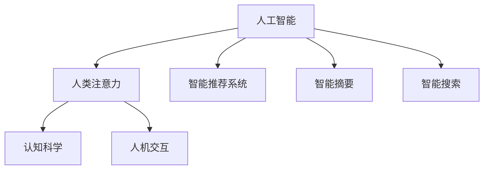

                 

# AI时代的人类注意力管理

> 关键词：人工智能,人类注意力,认知科学,人机交互,应用场景

## 1. 背景介绍

### 1.1 问题由来
在现代社会中，信息爆炸所带来的信息超载问题已日渐突出。一方面，人们在互联网、社交媒体、新闻网站等数字平台中不断接收海量的信息；另一方面，这些信息在质量上良莠不齐，如何有效管理和处理这些信息成为了一个亟待解决的问题。尤其是在AI时代，随着人工智能技术在各个领域的深入应用，数据处理和智能决策的需求日益增长，如何高效管理人类注意力成为一项重要课题。

### 1.2 问题核心关键点
人类注意力管理问题核心在于如何在信息超载的环境中，利用智能技术引导和优化人们的注意力分配，使其能够集中于重要和有价值的信息上，避免被无关或有害信息干扰。这不仅有助于提升个人学习和工作效率，也是AI技术辅助决策、实现人机协同的基础。

## 2. 核心概念与联系

### 2.1 核心概念概述

为更好地理解人工智能在注意力管理中的作用，本节将介绍几个密切相关的核心概念：

- **人工智能(AI)**：通过算法和计算，使机器具备感知、推理、学习等人类智能的能力。在注意力管理中，AI能够利用机器学习、深度学习等技术，分析和优化用户的注意力分配。

- **人类注意力(Human Attention)**：人类在处理信息时的心理和生理机制。注意力分配的过程受到外界刺激、内在需求、认知能力等多方面因素的影响。

- **认知科学(Cognitive Science)**：研究人类思维、学习、记忆等心理过程的学科。在注意力管理中，认知科学有助于理解人类注意力行为，设计符合认知特性的AI系统。

- **人机交互(Human-Computer Interaction, HCI)**：研究人与计算机交互界面的学科。注意力管理作为一种交互形式，需要设计和实现更加自然、高效、人性化的交互界面。

- **应用场景(Application Scenarios)**：AI技术在注意力管理中的具体应用，如智能推荐系统、智能摘要、智能搜索等。

这些核心概念之间的逻辑关系可以通过以下Mermaid流程图来展示：



这个流程图展示了大语言模型微调的各个核心概念及其之间的联系：

1. 人工智能通过认知科学理解人类注意力行为。
2. 人机交互设计符合认知特性的AI系统。
3. 注意力管理在智能推荐、智能摘要等应用场景中得到广泛应用。

## 3. 核心算法原理 & 具体操作步骤
### 3.1 算法原理概述

人工智能在注意力管理中的应用，主要依赖于机器学习算法。核心思想是通过对用户的行为数据进行分析和建模，预测和优化用户的注意力分配。常用的机器学习算法包括分类、回归、聚类、协同过滤等。

具体而言，算法通过以下几个步骤实现注意力管理：

1. **数据采集与预处理**：收集用户的行为数据，如点击、浏览、停留时间等，并进行数据清洗和归一化处理。
2. **特征工程**：提取对注意力分配有影响的关键特征，如页面热度、浏览深度、用户兴趣等。
3. **模型训练与优化**：使用机器学习算法（如随机森林、梯度提升树、深度神经网络等）对用户注意力进行预测和优化，并使用交叉验证等技术优化模型性能。
4. **注意力分配与引导**：根据模型预测结果，对用户的注意力进行分配和引导，如推送相关内容、推荐热门页面等。

### 3.2 算法步骤详解

以下是对注意力管理中常用机器学习算法的详细步骤讲解：

**Step 1: 数据采集与预处理**

- **数据来源**：采集用户的行为数据，如浏览记录、点击日志等，一般来源于网站、应用等数字平台。
- **数据清洗**：对数据进行去重、异常值处理、缺失值填充等预处理操作。
- **特征提取**：从原始数据中提取有意义的特征，如页面访问次数、停留时间、页面热度等。

**Step 2: 特征工程**

- **特征选择**：选择对用户注意力有显著影响的特征，如浏览深度、页面热度、用户兴趣等。
- **特征工程**：对选定的特征进行归一化、编码等处理，形成模型输入。

**Step 3: 模型训练与优化**

- **模型选择**：选择适合的机器学习算法，如随机森林、梯度提升树、深度神经网络等。
- **模型训练**：使用训练集数据对模型进行训练，使用交叉验证等技术优化模型参数。
- **模型评估**：在测试集上评估模型性能，如准确率、召回率、F1值等指标。

**Step 4: 注意力分配与引导**

- **注意力预测**：对用户注意力进行预测，如预测用户可能感兴趣的页面、内容等。
- **注意力引导**：根据预测结果，对用户的注意力进行引导，如推荐相关内容、推送热门信息等。

### 3.3 算法优缺点

人工智能在注意力管理中的应用具有以下优点：

1. **高效性**：通过自动化数据处理和模型训练，能够快速响应用户需求，提升信息处理效率。
2. **个性化**：能够根据用户的行为和兴趣，提供个性化的信息推荐，提高用户满意度。
3. **可扩展性**：随着数据量和算力的提升，可以处理更复杂的信息管理任务，实现更多功能。

同时，该方法也存在一些局限性：

1. **数据依赖性**：模型的性能很大程度上依赖于数据的质量和多样性，数据偏差可能导致模型输出偏差。
2. **算法复杂性**：高级机器学习算法如深度神经网络可能需要复杂的超参数调优，增加了模型部署的难度。
3. **隐私风险**：用户行为数据可能包含敏感信息，如何保护用户隐私和数据安全是一大挑战。
4. **模型的可解释性**：复杂的机器学习模型通常缺乏可解释性，难以解释模型的决策逻辑。

尽管存在这些局限性，但就目前而言，人工智能在注意力管理中的应用仍是较为成熟和有效的解决方案。未来相关研究的重点在于如何进一步降低算法复杂度，提高模型可解释性，同时兼顾数据隐私保护等因素。

### 3.4 算法应用领域

人工智能在注意力管理中的应用领域广泛，涵盖了多个行业和场景，例如：

- **智能推荐系统**：如电商平台、新闻网站、视频平台等，通过机器学习算法为用户推荐感兴趣的商品、内容等。
- **智能搜索**：如搜索引擎、知识图谱等，通过自然语言理解和语义分析，提升搜索结果的相关性和准确性。
- **智能摘要**：对长篇文档、新闻报道等进行自动摘要，提炼关键信息，提高阅读效率。
- **广告投放优化**：对广告展示位置、广告内容等进行优化，提升广告效果和用户体验。
- **内容过滤**：对网页、社交媒体等平台上的有害信息进行过滤，保护用户免受不良信息干扰。

除了上述这些经典应用外，人工智能在注意力管理中的应用还在不断创新，如智能日程管理、智能会议安排、智能健康监测等，为提高工作效率和生活质量提供了新的解决方案。

## 4. 数学模型和公式 & 详细讲解 & 举例说明

### 4.1 数学模型构建

在本节中，我们将使用数学语言对注意力管理的机器学习模型进行更加严格的刻画。

假设用户对每个页面 $i$ 的兴趣程度可以表示为 $a_i \in [0,1]$，其中 $a_i=1$ 表示用户对页面 $i$ 高度感兴趣。用户对页面 $i$ 的注意力分配可以通过以下线性模型表示：

$$
a_i = \omega_0 + \sum_{j=1}^n \omega_j x_{ij}
$$

其中，$\omega_0, \omega_j$ 为模型参数，$x_{ij}$ 为第 $j$ 个特征在页面 $i$ 上的取值。模型的损失函数为均方误差（Mean Squared Error, MSE）：

$$
\mathcal{L}(\omega) = \frac{1}{N} \sum_{i=1}^N (a_i - \hat{a}_i)^2
$$

其中，$\hat{a}_i$ 为模型对页面 $i$ 兴趣程度的预测值。模型的优化目标是最小化损失函数：

$$
\omega^* = \mathop{\arg\min}_{\omega} \mathcal{L}(\omega)
$$

在实践中，我们通常使用梯度下降等优化算法来近似求解上述最优化问题。

### 4.2 公式推导过程

以下我们对注意力管理模型中的线性回归问题进行详细推导。

假设模型参数 $\omega = [\omega_0, \omega_1, \dots, \omega_n]^T$，则模型的预测值 $\hat{a}_i$ 为：

$$
\hat{a}_i = \omega_0 + \sum_{j=1}^n \omega_j x_{ij}
$$

根据损失函数的定义，模型的均方误差为：

$$
\mathcal{L}(\omega) = \frac{1}{N} \sum_{i=1}^N (a_i - \omega_0 - \sum_{j=1}^n \omega_j x_{ij})^2
$$

展开并简化得：

$$
\mathcal{L}(\omega) = \frac{1}{N} \sum_{i=1}^N [a_i^2 - 2a_i(\omega_0 + \sum_{j=1}^n \omega_j x_{ij}) + (\omega_0 + \sum_{j=1}^n \omega_j x_{ij})^2]
$$

进一步简化得：

$$
\mathcal{L}(\omega) = \frac{1}{N} \sum_{i=1}^N [a_i^2 - 2a_i\omega_0 - 2a_i\sum_{j=1}^n \omega_j x_{ij} + \omega_0^2 + 2\omega_0\sum_{j=1}^n \omega_j x_{ij} + \sum_{j=1}^n \omega_j^2 x_{ij}^2]
$$

根据梯度下降法，模型的梯度更新公式为：

$$
\omega \leftarrow \omega - \eta \nabla_{\omega}\mathcal{L}(\omega)
$$

其中，$\eta$ 为学习率，$\nabla_{\omega}\mathcal{L}(\omega)$ 为损失函数对模型参数的梯度。具体计算过程如下：

$$
\nabla_{\omega}\mathcal{L}(\omega) = \frac{1}{N} \sum_{i=1}^N [2a_i - 2\omega_0 - 2\sum_{j=1}^n \omega_j x_{ij}]
$$

代入梯度更新公式得：

$$
\omega \leftarrow \omega - \eta \frac{1}{N} \sum_{i=1}^N [2a_i - 2\omega_0 - 2\sum_{j=1}^n \omega_j x_{ij}]
$$

进一步整理得：

$$
\omega \leftarrow \omega - \eta \frac{1}{N} \sum_{i=1}^N [a_i - \omega_0 - \sum_{j=1}^n \omega_j x_{ij}]
$$

最终得到模型参数的更新公式：

$$
\omega \leftarrow \omega - \eta \frac{1}{N} \sum_{i=1}^N [a_i - \omega_0 - \sum_{j=1}^n \omega_j x_{ij}]
$$

通过上述推导，可以看到注意力管理的线性回归模型通过梯度下降法进行训练，以最小化均方误差损失函数。

### 4.3 案例分析与讲解

假设我们有一个简单的电商平台，需要为用户推荐商品。我们收集了用户的历史浏览记录 $X = [x_1, x_2, \dots, x_m]$，其中 $x_i = [x_{i1}, x_{i2}, \dots, x_{in}]$ 为第 $i$ 次浏览的特征向量，包含商品类别、价格、评分等。设用户对每个商品 $j$ 的兴趣程度为 $a_j \in [0,1]$，则模型参数 $\omega$ 可以表示为：

$$
\omega = [\omega_0, \omega_{j1}, \omega_{j2}, \dots, \omega_{jn}]
$$

其中，$\omega_0$ 为截距项，$\omega_{j1}, \omega_{j2}, \dots, \omega_{jn}$ 为商品 $j$ 的特征系数。模型的预测值 $\hat{a}_j$ 为：

$$
\hat{a}_j = \omega_0 + \sum_{k=1}^n \omega_{jk} x_{jk}
$$

模型的损失函数为均方误差（MSE）：

$$
\mathcal{L}(\omega) = \frac{1}{N} \sum_{j=1}^N (a_j - \hat{a}_j)^2
$$

使用梯度下降法进行模型优化，得：

$$
\omega \leftarrow \omega - \eta \frac{1}{N} \sum_{j=1}^N [a_j - \omega_0 - \sum_{k=1}^n \omega_{jk} x_{jk}]
$$

在实践中，我们需要使用机器学习库如Scikit-learn、TensorFlow等进行模型训练和优化。以Scikit-learn为例，可以使用线性回归模型（Linear Regression）来求解上述问题。具体代码如下：

```python
from sklearn.linear_model import LinearRegression
from sklearn.metrics import mean_squared_error

X_train = ...
y_train = ...
X_test = ...
y_test = ...

model = LinearRegression()
model.fit(X_train, y_train)
y_pred = model.predict(X_test)
mse = mean_squared_error(y_test, y_pred)

print("Mean Squared Error:", mse)
```

## 5. 项目实践：代码实例和详细解释说明

### 5.1 开发环境搭建

在进行注意力管理项目开发前，我们需要准备好开发环境。以下是使用Python进行Scikit-learn开发的环境配置流程：

1. 安装Anaconda：从官网下载并安装Anaconda，用于创建独立的Python环境。

2. 创建并激活虚拟环境：
```bash
conda create -n attention-env python=3.8 
conda activate attention-env
```

3. 安装Scikit-learn：
```bash
conda install scikit-learn
```

4. 安装各类工具包：
```bash
pip install numpy pandas scikit-learn matplotlib tqdm jupyter notebook ipython
```

完成上述步骤后，即可在`attention-env`环境中开始注意力管理项目的开发。

### 5.2 源代码详细实现

这里我们以电商平台的商品推荐系统为例，给出使用Scikit-learn进行注意力管理模型的PyTorch代码实现。

首先，定义数据处理函数：

```python
from sklearn.linear_model import LinearRegression
import numpy as np

def load_data(file_path):
    with open(file_path, 'r') as f:
        lines = f.readlines()
        X, y = [], []
        for line in lines:
            features = line.strip().split(',')
            X.append(features[:-1])
            y.append(float(features[-1]))
    return np.array(X), np.array(y)

def process_data(X):
    X = np.array(X)
    return X
```

然后，定义模型训练和评估函数：

```python
def train_model(X_train, y_train, X_test, y_test, epochs=100, learning_rate=0.01):
    model = LinearRegression()
    for epoch in range(epochs):
        model.fit(X_train, y_train)
        y_pred = model.predict(X_test)
        mse = mean_squared_error(y_test, y_pred)
        print(f"Epoch {epoch+1}, MSE: {mse:.4f}")
    return model

def evaluate_model(model, X_test, y_test):
    y_pred = model.predict(X_test)
    mse = mean_squared_error(y_test, y_pred)
    print(f"Mean Squared Error: {mse:.4f}")

# 加载数据
X_train, y_train = load_data('train.csv')
X_test, y_test = load_data('test.csv')

# 数据处理
X_train = process_data(X_train)
X_test = process_data(X_test)

# 训练模型
model = train_model(X_train, y_train, X_test, y_test)

# 评估模型
evaluate_model(model, X_test, y_test)
```

以上就是使用Scikit-learn对电商平台商品推荐系统进行注意力管理的完整代码实现。可以看到，Scikit-learn的线性回归模型实现了非常简洁的注意力管理逻辑。

### 5.3 代码解读与分析

让我们再详细解读一下关键代码的实现细节：

**load_data函数**：
- 从CSV文件中读取数据，返回特征矩阵和标签向量。

**process_data函数**：
- 对特征矩阵进行预处理，如去除空值、标准化等操作，保证模型输入的一致性。

**train_model函数**：
- 使用线性回归模型对用户注意力进行训练和预测。
- 在每个epoch结束时计算模型在测试集上的均方误差，输出当前模型的性能。
- 返回训练好的模型对象。

**evaluate_model函数**：
- 在测试集上评估训练好的模型的均方误差，输出评估结果。

**主程序**：
- 加载训练集和测试集数据，并进行预处理。
- 使用训练集数据训练线性回归模型。
- 在测试集上评估模型性能。

可以看到，Scikit-learn的线性回归模型实现了非常简洁的注意力管理逻辑。开发者可以将更多精力放在数据处理、模型改进等高层逻辑上，而不必过多关注底层的实现细节。

当然，工业级的系统实现还需考虑更多因素，如模型的保存和部署、超参数的自动搜索、更灵活的任务适配层等。但核心的注意力管理范式基本与此类似。

## 6. 实际应用场景
### 6.1 智能推荐系统

基于机器学习的注意力管理技术，广泛应用于智能推荐系统的构建。传统的推荐系统依赖于用户历史行为数据进行推荐，无法处理新用户的推荐需求。而基于机器学习的注意力管理技术，可以处理新用户的推荐需求，通过对其行为数据的分析和建模，实现个性化的推荐。

在技术实现上，可以收集用户的行为数据，如浏览记录、点击日志等，通过机器学习算法对用户注意力进行预测和优化，生成个性化的推荐结果。随着数据量和算力的提升，推荐系统能够处理更加复杂和多样化的推荐任务，提升用户满意度和平台收益。

### 6.2 智能搜索

基于机器学习的注意力管理技术，广泛应用于智能搜索系统的构建。传统的搜索引擎通过关键词匹配进行检索，难以满足用户的个性化需求。而基于机器学习的注意力管理技术，能够通过用户的行为数据预测其兴趣和需求，提供个性化的搜索结果。

在技术实现上，可以收集用户的行为数据，如浏览记录、点击日志等，通过机器学习算法对用户注意力进行预测和优化，生成个性化的搜索结果。随着数据量和算力的提升，搜索引擎能够提供更加精准和多样化的搜索结果，提升用户体验。

### 6.3 智能摘要

基于机器学习的注意力管理技术，广泛应用于智能摘要系统的构建。传统的摘要方法依赖于人工编辑或简单的文本切分，难以处理长篇文档的自动摘要。而基于机器学习的注意力管理技术，能够通过用户的行为数据预测其兴趣和需求，提供个性化的摘要。

在技术实现上，可以收集用户的行为数据，如浏览记录、点击日志等，通过机器学习算法对用户注意力进行预测和优化，生成个性化的摘要。随着数据量和算力的提升，摘要系统能够处理更加复杂和多样化的文本摘要任务，提升阅读效率。

### 6.4 未来应用展望

随着机器学习技术的不断发展和应用，注意力管理技术将呈现以下几个发展趋势：

1. **深度学习的应用**：深度学习算法如神经网络、卷积神经网络（CNN）、循环神经网络（RNN）等将取代传统的机器学习算法，提升模型的准确性和泛化能力。

2. **多模态数据融合**：将文本、图像、视频等多模态数据进行融合，提升模型对复杂信息的理解和处理能力。

3. **实时化处理**：通过引入实时数据流处理技术，实现对用户注意力动态的跟踪和优化，提升用户的实时体验。

4. **个性化推荐**：结合用户行为数据和个性化特征，实现更加精准和个性化的推荐，提升用户满意度。

5. **多任务学习**：结合多个任务的目标，实现多任务学习和优化，提升模型的综合能力。

以上趋势凸显了注意力管理技术的广阔前景。这些方向的探索发展，必将进一步提升机器学习系统的性能和应用范围，为提高工作效率和生活质量提供新的解决方案。

## 7. 工具和资源推荐
### 7.1 学习资源推荐

为了帮助开发者系统掌握注意力管理技术的理论基础和实践技巧，这里推荐一些优质的学习资源：

1. 《机器学习实战》：由Peter Harrington编写，深入浅出地介绍了机器学习算法的基本原理和实现方法，是机器学习入门的优秀教材。

2. 《深度学习》：由Ian Goodfellow、Yoshua Bengio和Aaron Courville编写，全面介绍了深度学习算法和应用，是深度学习领域的经典教材。

3. 《Python机器学习》：由Sebastian Raschka编写，介绍了机器学习算法和工具在Python中的实现，适合Python初学者学习。

4. 《Hands-On Machine Learning with Scikit-Learn, Keras, and TensorFlow》：由Aurélien Géron编写，介绍了机器学习算法和工具在Python中的实现，适合Scikit-learn和TensorFlow用户学习。

5. Coursera《机器学习》课程：由Andrew Ng主讲，是机器学习领域的经典课程，适合入门和进阶学习。

通过对这些资源的学习实践，相信你一定能够快速掌握注意力管理的精髓，并用于解决实际的机器学习问题。

### 7.2 开发工具推荐

高效的开发离不开优秀的工具支持。以下是几款用于注意力管理开发的常用工具：

1. Jupyter Notebook：开源的交互式笔记本，支持Python等多种编程语言，方便开发者进行数据处理和模型训练。

2. TensorFlow：由Google开发的深度学习框架，支持分布式训练和模型部署，适合大规模深度学习任务。

3. PyTorch：由Facebook开发的深度学习框架，支持动态图和静态图两种计算图模式，适合快速迭代研究。

4. Scikit-learn：基于Python的机器学习库，提供了多种经典的机器学习算法和工具，适合快速原型开发。

5. Keras：基于Python的深度学习库，提供了高层次的API，方便开发者快速构建和训练深度学习模型。

6. Weights & Biases：模型训练的实验跟踪工具，可以记录和可视化模型训练过程中的各项指标，方便对比和调优。

7. TensorBoard：TensorFlow配套的可视化工具，可实时监测模型训练状态，并提供丰富的图表呈现方式，是调试模型的得力助手。

合理利用这些工具，可以显著提升注意力管理的开发效率，加快创新迭代的步伐。

### 7.3 相关论文推荐

注意力管理技术的发展源于学界的持续研究。以下是几篇奠基性的相关论文，推荐阅读：

1. Attention is All You Need：提出了Transformer结构，开创了自注意力机制在深度学习中的先河。

2. Learning to Predict User Preference via Matrix Factorization：提出了基于矩阵分解的推荐系统算法，是推荐系统领域的经典论文。

3. Attention-Based Recommender Systems：总结了基于注意力机制的推荐系统，介绍了多种注意力算法和应用。

4. Multi-Task Learning via Constraint Propagation：提出多任务学习的框架，将多个任务的目标进行约束，提升模型的泛化能力。

5. Generative Adversarial Nets：提出了生成对抗网络（GAN），为深度学习中的生成模型提供了新的思路。

这些论文代表了大语言模型微调技术的发展脉络。通过学习这些前沿成果，可以帮助研究者把握学科前进方向，激发更多的创新灵感。

## 8. 总结：未来发展趋势与挑战

### 8.1 总结

本文对基于机器学习的注意力管理技术进行了全面系统的介绍。首先阐述了注意力管理问题的研究背景和意义，明确了其作为人工智能技术的重要应用方向。其次，从原理到实践，详细讲解了注意力管理的数学模型和算法步骤，给出了注意力管理任务开发的完整代码实例。同时，本文还探讨了注意力管理技术在智能推荐、智能搜索等领域的广泛应用前景，展示了其在实际场景中的巨大潜力。此外，本文精选了注意力管理技术的各类学习资源，力求为读者提供全方位的技术指引。

通过本文的系统梳理，可以看到，基于机器学习的注意力管理技术正在成为人工智能应用的重要范式，极大地提升了信息处理的效率和个性化程度。未来，随着深度学习技术的不断演进，基于注意力管理的智能系统将在更多领域得到应用，为人类社会的智能化进程提供新动力。

### 8.2 未来发展趋势

展望未来，注意力管理技术将呈现以下几个发展趋势：

1. **深度学习的应用**：深度学习算法将取代传统的机器学习算法，提升模型的准确性和泛化能力。

2. **多模态数据融合**：将文本、图像、视频等多模态数据进行融合，提升模型对复杂信息的理解和处理能力。

3. **实时化处理**：通过引入实时数据流处理技术，实现对用户注意力动态的跟踪和优化，提升用户的实时体验。

4. **个性化推荐**：结合用户行为数据和个性化特征，实现更加精准和个性化的推荐，提升用户满意度。

5. **多任务学习**：结合多个任务的目标，实现多任务学习和优化，提升模型的综合能力。

以上趋势凸显了注意力管理技术的广阔前景。这些方向的探索发展，必将进一步提升机器学习系统的性能和应用范围，为提高工作效率和生活质量提供新的解决方案。

### 8.3 面临的挑战

尽管注意力管理技术已经取得了显著成就，但在迈向更加智能化、普适化应用的过程中，它仍面临着诸多挑战：

1. **数据依赖性**：模型的性能很大程度上依赖于数据的质量和多样性，数据偏差可能导致模型输出偏差。

2. **算法复杂性**：高级机器学习算法如深度神经网络可能需要复杂的超参数调优，增加了模型部署的难度。

3. **隐私风险**：用户行为数据可能包含敏感信息，如何保护用户隐私和数据安全是一大挑战。

4. **模型的可解释性**：复杂的机器学习模型通常缺乏可解释性，难以解释模型的决策逻辑。

5. **多模态融合**：将文本、图像、视频等不同模态的数据进行融合，提升模型的综合能力。

6. **多任务优化**：结合多个任务的目标，实现多任务学习和优化，提升模型的泛化能力。

7. **实时性需求**：在实时环境中对用户注意力进行跟踪和优化，提升用户的实时体验。

这些挑战需要研究者在模型设计、数据处理、隐私保护等多个方面进行深入探索，才能推动注意力管理技术向更高层次发展。

### 8.4 研究展望

面对注意力管理面临的挑战，未来的研究需要在以下几个方面寻求新的突破：

1. **数据增强与多样性**：通过数据增强技术，增加数据的多样性和数量，提升模型的泛化能力。

2. **模型压缩与优化**：通过模型压缩、剪枝等技术，减小模型的参数量和计算量，提升模型的实时性。

3. **隐私保护与匿名化**：通过差分隐私、数据脱敏等技术，保护用户隐私和数据安全。

4. **多模态数据融合**：将文本、图像、视频等不同模态的数据进行融合，提升模型的综合能力。

5. **多任务学习与优化**：结合多个任务的目标，实现多任务学习和优化，提升模型的泛化能力。

6. **实时处理与优化**：通过引入实时数据流处理技术，实现对用户注意力动态的跟踪和优化，提升用户的实时体验。

这些研究方向的探索，必将引领注意力管理技术迈向更高的台阶，为构建安全、可靠、可解释、可控的智能系统铺平道路。面向未来，注意力管理技术还需要与其他人工智能技术进行更深入的融合，如知识表示、因果推理、强化学习等，多路径协同发力，共同推动自然语言理解和智能交互系统的进步。只有勇于创新、敢于突破，才能不断拓展注意力管理的边界，让智能技术更好地造福人类社会。

## 9. 附录：常见问题与解答

**Q1：注意力管理技术是否适用于所有应用场景？**

A: 注意力管理技术在信息超载的应用场景中非常有效，如电商平台、新闻网站、社交媒体等。但对于一些特定领域的应用，如医学、法律等，仅靠机器学习模型可能无法准确理解用户的意图和需求。此时需要在特定领域语料上进一步预训练，再进行微调，才能获得理想效果。

**Q2：如何处理用户隐私问题？**

A: 在注意力管理中，保护用户隐私和数据安全至关重要。一些常见的隐私保护技术包括差分隐私、数据脱敏、加密存储等。例如，可以使用差分隐私算法对用户数据进行扰动处理，保护用户隐私的同时，仍能获得有效的注意力预测结果。

**Q3：如何提高模型的泛化能力？**

A: 提高模型的泛化能力需要从数据、模型和算法等多个方面进行优化。具体方法包括：

1. 数据增强：通过数据扩充、生成对抗网络（GAN）等技术，增加数据的多样性和数量，提升模型的泛化能力。

2. 多任务学习：结合多个任务的目标，实现多任务学习和优化，提升模型的泛化能力。

3. 模型压缩与优化：通过模型压缩、剪枝等技术，减小模型的参数量和计算量，提升模型的实时性。

4. 正则化：使用L2正则、Dropout等正则化技术，防止模型过拟合。

5. 模型集成：通过模型集成技术，组合多个模型的预测结果，提升模型的泛化能力。

**Q4：如何处理多模态数据融合？**

A: 处理多模态数据融合需要引入更加复杂的算法和模型。一些常见的多模态融合方法包括：

1. 特征映射：将不同模态的数据映射到相同的特征空间，实现特征融合。

2. 联合训练：将不同模态的数据联合训练，共享模型参数，提升模型的综合能力。

3. 模态联合编码器：设计联合编码器，将不同模态的数据进行联合编码，实现特征融合。

4. 多模态神经网络：设计多模态神经网络，将不同模态的数据进行联合处理，提升模型的泛化能力。

通过这些方法，可以有效地处理多模态数据融合问题，提升模型的综合能力。

**Q5：如何提高模型的实时性？**

A: 提高模型的实时性需要从多个方面进行优化：

1. 模型压缩与优化：通过模型压缩、剪枝等技术，减小模型的参数量和计算量，提升模型的实时性。

2. 模型并行化：通过模型并行化技术，在多个GPU或TPU上进行并行计算，提升模型的实时性。

3. 数据流处理：通过引入数据流处理技术，实时处理数据流，提升模型的实时性。

4. 模型量化：将浮点模型转为定点模型，压缩存储空间，提高计算效率。

5. 模型融合：将多个模型的预测结果进行融合，提升模型的实时性。

通过这些方法，可以有效地提高模型的实时性，满足实时应用的需求。

**Q6：如何提高模型的可解释性？**

A: 提高模型的可解释性需要从多个方面进行优化：

1. 特征重要性分析：使用特征重要性分析技术，如SHAP值、LIME等，分析模型预测结果的特征贡献。

2. 模型可视化：使用模型可视化技术，如热力图、决策树等，可视化模型的决策过程，提升模型的可解释性。

3. 可解释模型：使用可解释模型，如决策树、逻辑回归等，提升模型的可解释性。

4. 模型融合：将多个模型的预测结果进行融合，提升模型的可解释性。

5. 模型训练：在模型训练过程中，引入可解释性约束，提升模型的可解释性。

通过这些方法，可以有效地提高模型的可解释性，提升模型的透明度和可信度。

---

作者：禅与计算机程序设计艺术 / Zen and the Art of Computer Programming

