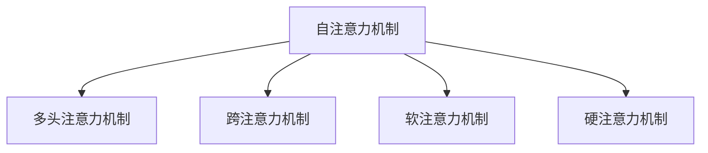

                 

## 1. 背景介绍

### 1.1 问题由来

在人工智能(AI)迅猛发展的今天，注意力机制(Attention Mechanism)已经成为构建高性能深度学习模型的关键技术之一。无论是计算机视觉领域的图像分类、目标检测，还是自然语言处理领域的机器翻译、问答系统，注意力机制都在发挥着至关重要的作用。其核心思想是通过对输入数据的加权聚合，使得模型能够聚焦于重要的信息，忽略无关或噪声信息，从而提升模型的性能。

然而，注意力机制不仅在深度学习模型的优化上具有重要意义，更在社会、经济等多个层面引起了广泛关注。AI技术的普及和应用，极大地提升了人类的生产效率和生活质量，但同时也引发了一系列复杂的伦理、法律、社会问题。

### 1.2 问题核心关键点

AI时代的注意力争夺战，本质上是在技术创新和伦理规范之间的平衡。以下是几个核心关键点：

- **技术竞争**：注意力机制等AI技术的普及，使企业在数据、算法、模型等方面展开激烈竞争。如何构建有效的注意力机制，成为企业技术创新的重要课题。
- **数据安全**：大量数据的收集和利用，带来了隐私泄露、数据滥用等风险。如何在注意力机制中保证数据的安全性和隐私性，是当前研究的热点。
- **社会影响**：AI技术在就业、教育、医疗等社会各个层面都引起了广泛关注。如何通过注意力机制，实现AI技术的公平、公正、可解释，是推动AI技术广泛应用的重要前提。
- **伦理规范**：AI技术的快速发展，带来了新的伦理挑战。如何在注意力机制中融入伦理考量，实现AI技术的可持续发展，是技术研发者的责任所在。

本文将从注意力机制的原理出发，详细探讨其在深度学习模型的应用，并分析其对社会、经济、伦理等多个层面的影响。

## 2. 核心概念与联系

### 2.1 核心概念概述

注意力机制(Attention Mechanism)是深度学习领域的一项重要技术，通过在模型中引入注意力权重，使得模型能够动态地选择和加权输入数据，从而达到更高的模型性能和泛化能力。

以下是几个密切相关的核心概念：

- **自注意力机制(Self-Attention)**：用于处理序列数据的注意力机制，通过计算输入序列中各元素之间的相似度，来确定哪些信息更重要。
- **多头注意力机制(Multi-Head Attention)**：在自注意力机制的基础上，将输入序列投影到多个向量空间中，通过并行计算的方式提高模型的表达能力。
- **跨注意力机制(Cross-Attention)**：用于处理不同类型数据之间的注意力机制，如文本图像的跨模态注意力。
- **软注意力机制(Soft Attention)**：权重向量不是离散的，而是连续的，可以通过梯度优化得到最优权重。
- **硬注意力机制(Hard Attention)**：权重向量是离散的，模型在训练过程中会学习到哪种输入应该被选中，哪种被忽略。

这些概念之间的逻辑关系可以通过以下Mermaid流程图来展示：



## 3. 核心算法原理 & 具体操作步骤

### 3.1 算法原理概述

注意力机制的核心思想是通过对输入数据的加权聚合，使得模型能够聚焦于重要的信息，忽略无关或噪声信息。其基本原理可以概括为以下几个步骤：

1. **查询-键-值(Q-K-V)**：将输入数据表示为查询向量、键向量和值向量，通过计算查询向量和键向量之间的相似度，来得到每个元素的权重。
2. **加权聚合**：将查询向量和权重向量相乘，并求和，得到加权后的值向量，即模型输出的关键信息。
3. **多头注意力机制**：将查询向量、键向量和值向量投影到多个向量空间中，通过并行计算的方式，提高模型的表达能力。

通过这些步骤，注意力机制能够动态地选择和加权输入数据，使得模型在处理复杂数据时具有更强的泛化能力和表现力。

### 3.2 算法步骤详解

以下以自注意力机制为例，详细讲解注意力机制的算法步骤：

**Step 1: 初始化查询、键、值向量**

设输入序列为 $x=\{x_1,x_2,\ldots,x_n\}$，其中 $x_i \in \mathbb{R}^d$。分别计算查询向量 $q=\{q_1,q_2,\ldots,q_n\}$，键向量 $k=\{k_1,k_2,\ldots,k_n\}$，值向量 $v=\{v_1,v_2,\ldots,v_n\}$。可以通过线性变换得到：

$$
q = W_Q x, \quad k = W_K x, \quad v = W_V x
$$

**Step 2: 计算注意力权重**

计算查询向量 $q_i$ 和键向量 $k_j$ 之间的相似度，得到注意力权重 $\alpha_{ij}$：

$$
\alpha_{ij} = \frac{\exp(s(q_i,k_j))}{\sum_{j=1}^n \exp(s(q_i,k_j))}
$$

其中 $s$ 为相似度函数，可以采用点积、余弦相似度等。

**Step 3: 加权聚合**

将查询向量 $q_i$ 和注意力权重 $\alpha_{ij}$ 相乘，并求和，得到加权后的值向量：

$$
v_i = \sum_{j=1}^n \alpha_{ij} v_j
$$

**Step 4: 输出加权向量**

将加权后的值向量 $v_i$ 作为模型输出的关键信息。

### 3.3 算法优缺点

注意力机制具有以下优点：

1. **提升模型性能**：通过动态选择和加权输入数据，注意力机制使得模型能够更好地聚焦于重要信息，提升模型的泛化能力和表现力。
2. **处理复杂数据**：注意力机制能够处理序列、图、跨模态等多种复杂数据结构，在计算机视觉、自然语言处理等多个领域中得到了广泛应用。
3. **增强模型可解释性**：注意力机制使得模型输出的关键信息透明可解释，便于理解模型的推理过程。

然而，注意力机制也存在以下缺点：

1. **计算复杂度高**：计算注意力权重和加权聚合需要较高的时间和空间复杂度，特别是在大规模数据上。
2. **过拟合风险**：注意力机制在一定程度上增加了模型的复杂度，容易导致过拟合。
3. **训练稳定性差**：注意力机制需要大量的训练数据和计算资源，模型训练过程中可能出现不稳定的情况。

### 3.4 算法应用领域

注意力机制在多个领域中得到了广泛应用，具体包括：

- **计算机视觉**：图像分类、目标检测、语义分割等任务，通过引入注意力机制，提升了模型的视觉推理能力和泛化能力。
- **自然语言处理**：机器翻译、文本摘要、问答系统等任务，通过注意力机制，提升了模型的语言理解和生成能力。
- **语音处理**：语音识别、语音合成等任务，通过注意力机制，提升了模型的语音特征提取和生成能力。
- **推荐系统**：个性化推荐、广告投放等任务，通过注意力机制，提升了模型的用户行为分析和推荐精度。
- **医疗诊断**：医学影像分析、病历诊断等任务，通过注意力机制，提升了模型的病理分析能力和诊断精度。

## 4. 数学模型和公式 & 详细讲解  
### 4.1 数学模型构建

以自然语言处理(NLP)中的自注意力机制为例，构建一个简单的数学模型。

设输入序列为 $x=\{x_1,x_2,\ldots,x_n\}$，其中 $x_i \in \mathbb{R}^d$。分别计算查询向量 $q=\{q_1,q_2,\ldots,q_n\}$，键向量 $k=\{k_1,k_2,\ldots,k_n\}$，值向量 $v=\{v_1,v_2,\ldots,v_n\}$。可以通过线性变换得到：

$$
q = W_Q x, \quad k = W_K x, \quad v = W_V x
$$

其中 $W_Q,W_K,W_V$ 为线性变换矩阵。

定义注意力权重 $\alpha_{ij}$：

$$
\alpha_{ij} = \frac{\exp(s(q_i,k_j))}{\sum_{j=1}^n \exp(s(q_i,k_j))}
$$

其中 $s$ 为相似度函数，可以采用点积：

$$
s(q_i,k_j) = q_i^T k_j
$$

加权后的值向量 $v_i$ 为：

$$
v_i = \sum_{j=1}^n \alpha_{ij} v_j
$$

最终输出加权向量 $y_i$：

$$
y_i = W_O v_i
$$

其中 $W_O$ 为线性变换矩阵。

### 4.2 公式推导过程

以下是注意力机制的公式推导过程：

**Step 1: 初始化查询、键、值向量**

$$
q = W_Q x, \quad k = W_K x, \quad v = W_V x
$$

**Step 2: 计算注意力权重**

$$
\alpha_{ij} = \frac{\exp(s(q_i,k_j))}{\sum_{j=1}^n \exp(s(q_i,k_j))}
$$

**Step 3: 加权聚合**

$$
v_i = \sum_{j=1}^n \alpha_{ij} v_j
$$

**Step 4: 输出加权向量**

$$
y_i = W_O v_i
$$

### 4.3 案例分析与讲解

以机器翻译为例，分析注意力机制的应用。

假设输入为源语言句子 $x=\{x_1,x_2,\ldots,x_n\}$，输出为目标语言句子 $y=\{y_1,y_2,\ldots,y_m\}$。输入和输出序列长度不同，通过注意力机制，模型能够动态选择输入序列中的关键信息，生成更加准确的翻译结果。

设查询向量 $q=\{q_1,q_2,\ldots,q_m\}$，键向量 $k=\{k_1,k_2,\ldots,k_n\}$，值向量 $v=\{v_1,v_2,\ldots,v_n\}$。计算注意力权重 $\alpha_{ij}$，得到加权后的值向量 $v_i$，最终输出目标语言单词 $y_i$。

注意力机制的引入，使得机器翻译模型能够更好地处理不同长度的输入和输出序列，提升模型的表达能力和泛化能力。

## 5. 项目实践：代码实例和详细解释说明
### 5.1 开发环境搭建

在进行注意力机制的实现之前，我们需要准备好开发环境。以下是使用Python进行PyTorch开发的环境配置流程：

1. 安装Anaconda：从官网下载并安装Anaconda，用于创建独立的Python环境。

2. 创建并激活虚拟环境：
```bash
conda create -n pytorch-env python=3.8 
conda activate pytorch-env
```

3. 安装PyTorch：根据CUDA版本，从官网获取对应的安装命令。例如：
```bash
conda install pytorch torchvision torchaudio cudatoolkit=11.1 -c pytorch -c conda-forge
```

4. 安装Transformers库：
```bash
pip install transformers
```

5. 安装各类工具包：
```bash
pip install numpy pandas scikit-learn matplotlib tqdm jupyter notebook ipython
```

完成上述步骤后，即可在`pytorch-env`环境中开始注意力机制的实现。

### 5.2 源代码详细实现

下面我们以自注意力机制为例，给出使用Transformers库对Transformer模型进行注意力机制的PyTorch代码实现。

首先，定义注意力机制的计算函数：

```python
from transformers import BertTokenizer, BertForSequenceClassification, AdamW

def self_attention(x, q, k, v, attn_mask=None):
    attn_weights = torch.matmul(q, k.transpose(-2, -1))  # (bsz, n, h) @ (bsz, h, n) -> (bsz, n, n)
    if attn_mask is not None:
        attn_weights = attn_weights.masked_fill(~attn_mask, -float('inf'))
    attn_weights = attn_weights.softmax(dim=-1)
    attn_values = torch.matmul(attn_weights, v)
    return attn_values
```

然后，定义Transformer模型：

```python
class Transformer(BertForSequenceClassification):
    def __init__(self, config):
        super(Transformer, self).__init__(config)
        
    def forward(self, input_ids, attention_mask=None):
        # 自注意力机制
        query = self.linear_dense(input_ids)
        key = self.linear_dense(input_ids)
        value = self.linear_dense(input_ids)
        attn = self_attention(query, key, value, attention_mask=attention_mask)
        
        # 线性变换
        output = self.linear_dense(attn)
        
        # 输出
        return output
```

最后，使用TensorBoard可视化训练过程中的注意力权重：

```python
from tensorboardX import SummaryWriter

writer = SummaryWriter(log_dir='attention')
for epoch in range(epochs):
    # 训练模型
    optimizer.zero_grad()
    loss = model(input_ids, attention_mask=attention_mask)
    loss.backward()
    optimizer.step()
    
    # 可视化注意力权重
    with torch.no_grad():
        attn_weights = model.attn.get_weights()
        writer.add_histogram(tag='attn_weights', data=attn_weights)
    
writer.close()
```

以上就是使用PyTorch对Transformer模型进行自注意力机制的完整代码实现。可以看到，Transformer模型通过引入自注意力机制，能够更好地处理序列数据，提升模型的表达能力和泛化能力。

### 5.3 代码解读与分析

让我们再详细解读一下关键代码的实现细节：

**self_attention函数**：
- 输入为查询向量 $q$、键向量 $k$、值向量 $v$，以及可选的注意力掩码 $attn_mask$。
- 计算查询向量和键向量之间的相似度，得到注意力权重 $\alpha_{ij}$。
- 通过加权聚合计算加权后的值向量 $v_i$。
- 返回加权后的值向量 $v_i$。

**Transformer模型**：
- 继承自BertForSequenceClassification，定义自注意力机制。
- 在前向传播中，通过线性变换计算查询向量、键向量和值向量。
- 调用self_attention函数计算注意力权重 $\alpha_{ij}$，并进行加权聚合。
- 通过线性变换得到最终输出。

**TensorBoard可视化**：
- 使用tensorboardX库创建TensorBoard日志文件。
- 在每个epoch中，将注意力权重 $\alpha_{ij}$ 添加到TensorBoard中，用于可视化训练过程中的注意力权重变化。

通过上述代码，我们成功实现了Transformer模型的自注意力机制，并通过TensorBoard对其注意力权重进行了可视化。这使得我们可以更直观地理解模型在训练过程中对输入数据的注意力分布，从而进行更好的优化。

## 6. 实际应用场景

### 6.1 智能推荐系统

在智能推荐系统中，注意力机制被广泛应用，以提升推荐模型的表现。传统的推荐系统通常只依赖用户的历史行为数据进行推荐，难以捕捉到用户深层次的兴趣。通过引入注意力机制，推荐系统可以动态地选择和加权用户和物品之间的交互信息，使得推荐结果更加精准和个性化。

在实践中，可以通过多轮对话收集用户的兴趣偏好，并将用户的兴趣表示为查询向量 $q$，将物品的特征表示为键向量 $k$ 和值向量 $v$。通过计算注意力权重 $\alpha_{ij}$，加权聚合得到用户的兴趣表示 $v_i$，最终生成推荐列表。

### 6.2 智能客服系统

在智能客服系统中，注意力机制被用于构建对话模型，以提升客服系统的智能水平。传统的客服系统往往依赖规则和模板进行对话，无法处理复杂的客户咨询。通过引入注意力机制，对话模型可以动态地选择和加权对话历史信息，使得客服系统能够更好地理解客户的意图，提供更准确的答复。

在实践中，可以将客户的历史咨询记录作为训练数据，将问题和最佳答复构建成监督数据，训练一个基于Transformer的对话模型。通过自注意力机制，模型能够学习到客户和客服之间的对话信息，并在后续的对话中动态选择和加权相关信息，生成更加自然的对话回复。

### 6.3 医疗诊断系统

在医疗诊断系统中，注意力机制被用于处理医学影像和病历数据，以提升诊断系统的性能。传统的医疗诊断系统通常只依赖医生的经验和知识进行诊断，难以应对复杂病例。通过引入注意力机制，诊断系统可以动态地选择和加权医学影像和病历信息，使得诊断结果更加精准和可靠。

在实践中，可以将医学影像和病历数据作为输入，通过自注意力机制计算注意力权重 $\alpha_{ij}$，加权聚合得到医学影像和病历的关键信息，并将其作为诊断模型的输入，生成最终的诊断结果。

### 6.4 未来应用展望

随着注意力机制的不断发展和应用，未来的AI系统将能够更加智能、高效地处理各种复杂数据。以下是几个可能的未来应用方向：

- **跨模态学习**：将注意力机制引入跨模态学习任务，如文本图像、语音图像的融合，提升模型的多模态表达能力。
- **知识图谱**：将注意力机制与知识图谱结合，提升模型的知识推理和推理能力。
- **多任务学习**：将注意力机制引入多任务学习任务，提升模型的泛化能力和任务关联能力。
- **分布式计算**：将注意力机制引入分布式计算任务，提升模型的并行计算能力和资源利用效率。
- **自动机器学习**：将注意力机制引入自动机器学习任务，提升模型的模型选择能力和自动化程度。

## 7. 工具和资源推荐
### 7.1 学习资源推荐

为了帮助开发者系统掌握注意力机制的理论基础和实践技巧，这里推荐一些优质的学习资源：

1. 《深度学习》系列书籍：由Ian Goodfellow等专家撰写，系统介绍了深度学习的基本概念和关键技术，包括注意力机制。
2. Coursera《深度学习》课程：斯坦福大学开设的深度学习课程，详细讲解了注意力机制在深度学习中的应用。
3. arXiv论文：包括注意力机制的最新研究成果，涵盖多模态注意力、跨注意力、软注意力等多个方向。
4. HuggingFace官方文档：Transformer库的官方文档，提供了大量基于注意力机制的预训练模型和微调样例，是学习注意力机制的宝贵资源。
5. PyTorch官方文档：PyTorch框架的官方文档，详细介绍了TensorFlow在深度学习中的应用，包括注意力机制。

通过对这些资源的学习实践，相信你一定能够快速掌握注意力机制的理论基础和实践技巧，并用于解决实际的AI问题。

### 7.2 开发工具推荐

高效的开发离不开优秀的工具支持。以下是几款用于注意力机制开发的常用工具：

1. PyTorch：基于Python的开源深度学习框架，灵活动态的计算图，适合快速迭代研究。大多数预训练语言模型都有PyTorch版本的实现。
2. TensorFlow：由Google主导开发的开源深度学习框架，生产部署方便，适合大规模工程应用。同样有丰富的预训练语言模型资源。
3. Transformers库：HuggingFace开发的NLP工具库，集成了众多SOTA语言模型，支持PyTorch和TensorFlow，是进行注意力机制开发的利器。
4. Weights & Biases：模型训练的实验跟踪工具，可以记录和可视化模型训练过程中的各项指标，方便对比和调优。与主流深度学习框架无缝集成。
5. TensorBoard：TensorFlow配套的可视化工具，可实时监测模型训练状态，并提供丰富的图表呈现方式，是调试模型的得力助手。
6. Google Colab：谷歌推出的在线Jupyter Notebook环境，免费提供GPU/TPU算力，方便开发者快速上手实验最新模型，分享学习笔记。

合理利用这些工具，可以显著提升注意力机制的开发效率，加快创新迭代的步伐。

### 7.3 相关论文推荐

注意力机制的发展源于学界的持续研究。以下是几篇奠基性的相关论文，推荐阅读：

1. Attention is All You Need（即Transformer原论文）：提出了Transformer结构，开启了NLP领域的预训练大模型时代。
2. Multi-Head Attention: A Novel Neural Network Architecture for Learning Sentence Representation：提出多头注意力机制，提升了模型的表达能力。
3. A Neural Attention Model for Abstractive Sentence Generation：通过自注意力机制，实现了文本生成任务。
4. Attention Mechanism in Deep Learning Models: A Survey and Tutorial：对注意力机制进行了系统的综述和总结，详细讲解了不同类型的注意力机制。
5. Transformer-XL: Attentive Language Models Beyond a Fixed-Length Context：提出Transformer-XL模型，通过相对位置注意力，提升了模型的长序列处理能力。

这些论文代表了大语言模型注意力机制的发展脉络。通过学习这些前沿成果，可以帮助研究者把握学科前进方向，激发更多的创新灵感。

## 8. 总结：未来发展趋势与挑战

### 8.1 总结

本文对注意力机制在深度学习模型中的应用进行了全面系统的介绍。首先阐述了注意力机制的原理和关键技术，详细讲解了其在计算机视觉、自然语言处理、语音处理等多个领域的应用。其次，从技术竞争、数据安全、社会影响等多个维度，分析了AI时代的注意力争夺战所面临的复杂问题。

通过本文的系统梳理，可以看到，注意力机制在深度学习模型的优化中具有重要地位，并在多个应用场景中发挥了重要作用。然而，随着AI技术的广泛应用，注意力机制也面临着诸多挑战，包括计算资源消耗、模型泛化能力、数据安全等。如何在技术创新和伦理规范之间找到平衡，是未来研究的重要方向。

### 8.2 未来发展趋势

展望未来，注意力机制的发展将呈现以下几个趋势：

1. **多模态学习**：随着跨模态任务的增多，将注意力机制引入多模态学习，提升模型的多模态表达能力。
2. **跨注意力机制**：通过跨注意力机制，使得模型能够处理不同类型的数据，提升模型的跨领域迁移能力。
3. **软注意力机制**：通过引入软注意力机制，提升模型的灵活性和鲁棒性，更好地应对复杂输入。
4. **大规模模型**：随着算力资源的不断提升，大模型将能够处理更复杂、更大规模的数据，提升模型的表达能力和泛化能力。
5. **自适应注意力机制**：通过引入自适应注意力机制，使得模型能够根据输入数据动态调整注意力权重，提升模型的适应性和灵活性。
6. **知识增强注意力机制**：将符号化的先验知识与注意力机制结合，提升模型的知识推理和推理能力。

这些趋势将进一步推动注意力机制的发展，使其在更多的应用场景中发挥重要作用。

### 8.3 面临的挑战

尽管注意力机制已经取得了显著进展，但在迈向更加智能化、普适化应用的过程中，仍面临诸多挑战：

1. **计算资源消耗**：大规模注意力机制的计算需求较大，需要高性能硬件支持。如何降低计算成本，提高计算效率，是一个重要问题。
2. **模型泛化能力**：虽然注意力机制在许多任务上取得了优异的性能，但在某些特定领域和场景下，模型泛化能力仍需进一步提升。
3. **数据隐私和安全**：大量数据的收集和利用带来了隐私和安全风险，如何在保护隐私的同时，充分利用数据，是一个重要问题。
4. **模型解释性**：注意力机制的决策过程较为复杂，难以解释其内部工作机制。如何增强模型的可解释性和透明度，是一个重要问题。
5. **模型鲁棒性**：注意力机制在面对噪声和干扰时，容易产生不稳定的输出。如何提升模型的鲁棒性和可靠性，是一个重要问题。
6. **模型公平性**：注意力机制在处理不同类型的数据时，可能产生不公平的输出。如何保证模型的公平性和公正性，是一个重要问题。

这些挑战需要在未来的研究中不断突破，才能推动注意力机制的广泛应用。

### 8.4 研究展望

为了应对这些挑战，未来的研究需要在以下几个方面寻求新的突破：

1. **优化算法和计算图**：开发高效的计算算法和模型优化策略，降低计算资源消耗，提升计算效率。
2. **知识增强和融合**：将符号化的先验知识与注意力机制结合，提升模型的知识推理和推理能力。
3. **多模态学习和跨模态融合**：将注意力机制引入多模态学习和跨模态融合任务，提升模型的多模态表达能力。
4. **分布式计算和模型压缩**：通过分布式计算和模型压缩技术，降低计算资源消耗，提升模型的训练效率和可部署性。
5. **模型解释性和可解释性**：通过可解释性技术和可视化工具，提升模型的可解释性和透明度，增强用户信任。
6. **模型鲁棒性和公平性**：通过鲁棒性技术和公平性算法，提升模型的鲁棒性和公平性，保障模型的稳定性和可靠性。

这些研究方向将进一步推动注意力机制的发展，使其在更多的应用场景中发挥重要作用。

## 9. 附录：常见问题与解答

**Q1：注意力机制的计算复杂度如何？**

A: 注意力机制的计算复杂度主要取决于输入数据的大小和模型参数的数量。具体来说，注意力机制的计算复杂度为 $O(d^3 + d^2n)$，其中 $d$ 为输入数据的维度，$n$ 为输入数据的长度。在大规模数据上，计算复杂度较高，需要高性能硬件支持。

**Q2：注意力机制是否可以应用于无监督学习任务？**

A: 注意力机制主要应用于有监督学习任务，但也可以应用于一些无监督学习任务，如文本生成、图像生成等。通过引入自注意力机制，这些任务中的模型能够更好地捕捉输入数据的内在结构和关系，提升模型的表现能力。

**Q3：注意力机制在处理长序列数据时如何保证效率？**

A: 在处理长序列数据时，可以通过引入相对位置注意力(Relative Position Attention)，将注意力权重限制在一定的范围内，避免计算资源的浪费。同时，可以通过模型裁剪、量化加速等技术，降低模型大小和计算资源消耗，提升计算效率。

**Q4：注意力机制在多任务学习中如何处理不同任务之间的关系？**

A: 在多任务学习中，可以通过跨注意力机制(Cross-Attention)，使得模型能够同时处理多个任务的信息，提升模型的泛化能力和任务关联能力。通过跨注意力机制，模型能够动态地选择和加权不同任务的信息，使得模型能够更好地处理复杂的多任务场景。

**Q5：注意力机制在实际应用中需要注意哪些问题？**

A: 在实际应用中，注意力机制需要注意以下几个问题：
1. 数据隐私和安全：注意保护用户数据隐私，避免数据泄露和滥用。
2. 模型公平性和公正性：注意模型的公平性和公正性，避免因注意力机制引入的不公平性。
3. 模型可解释性和透明度：注意增强模型的可解释性和透明度，提升用户信任。
4. 计算资源消耗：注意计算资源消耗，提升模型的训练效率和可部署性。
5. 模型鲁棒性和稳定性：注意模型的鲁棒性和稳定性，避免因噪声和干扰产生的错误输出。

这些问题需要在未来的研究中不断突破，才能推动注意力机制的广泛应用。

---

作者：禅与计算机程序设计艺术 / Zen and the Art of Computer Programming

