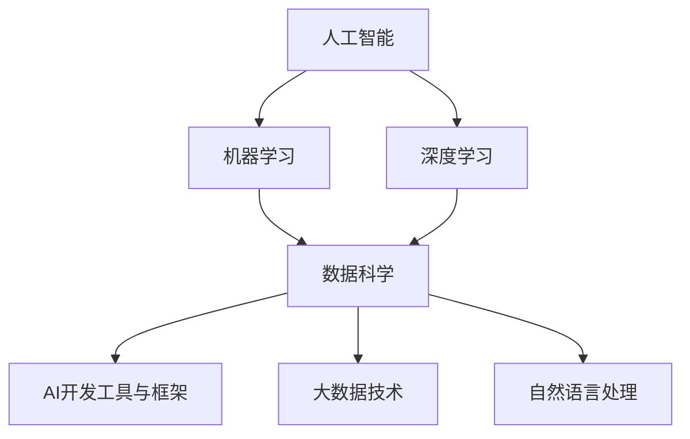

                 

# AI时代的程序员技能投资指南

> 关键词：人工智能,机器学习,深度学习,数据科学,软件开发,技能提升

## 1. 背景介绍

### 1.1 问题由来

在过去的十年中，人工智能(AI)和机器学习(ML)技术取得了突飞猛进的发展，成为科技和产业界关注的焦点。这不仅改变了传统行业的运营方式，也为程序员们提供了新的就业机会和发展空间。面对AI和ML带来的变革，程序员需要重新审视自身的技能组合，并根据市场需求进行相应的投资和提升。

### 1.2 问题核心关键点

当前AI和ML技术的快速演进，对程序员提出了以下核心要求：

1. **编程语言**：掌握Python、R等流行的数据科学语言，以及C++、Java等通用编程语言。
2. **算法与模型**：理解并应用深度学习、强化学习、自然语言处理等核心算法。
3. **数据处理**：能够处理大数据、清洗、分析和可视化数据。
4. **工具与框架**：熟练使用TensorFlow、PyTorch、Scikit-Learn等主流AI和ML框架。
5. **机器学习工程**：具备从模型训练到生产部署的全栈工程能力。

本文将全面系统地介绍AI时代程序员所需的核心技能，并详细解析这些技能如何投资与提升，为职业发展提供明确路径。

## 2. 核心概念与联系

### 2.1 核心概念概述

为更好地理解AI时代程序员技能投资指南，本节将介绍几个密切相关的核心概念：

- **人工智能(AI)**：通过计算机系统模拟人类智能的各个方面，包括学习、推理、自我修正、感知、理解、交流和移动。
- **机器学习(ML)**：使用数据和算法，使计算机系统能够从经验中学习并改进性能，无需显式编程。
- **深度学习(Deep Learning)**：一种特殊的机器学习方法，通过多层神经网络处理复杂的数据，以实现更高级别的抽象和模式识别。
- **数据科学**：结合统计学、计算机科学和数据分析，通过数据分析和建模解决实际问题。
- **AI开发工具与框架**：如TensorFlow、PyTorch、Keras、Scikit-Learn等，提供模型开发、训练和部署的工具。
- **大数据技术**：包括Hadoop、Spark、Flink等，用于处理和分析大规模数据集。
- **自然语言处理(NLP)**：使计算机能够理解和生成人类语言的技术。

这些核心概念之间的逻辑关系可以通过以下Mermaid流程图来展示：



这个流程图展示了一个完整的人工智能技术栈，各个部分之间相互依赖，共同构成AI技术的整体框架。

## 3. 核心算法原理 & 具体操作步骤
### 3.1 算法原理概述

在AI时代，程序员需要掌握的核心算法和模型包括但不限于：

- **监督学习**：通过标注数据训练模型，使其能够预测新数据。
- **无监督学习**：从未标注的数据中学习模式，如聚类、降维等。
- **强化学习**：通过与环境互动，让模型学习最优策略，如AlphaGo。
- **卷积神经网络(CNN)**：主要用于图像处理和计算机视觉任务。
- **循环神经网络(RNN)**：用于序列数据的处理，如文本、语音和时序数据。
- **长短期记忆网络(LSTM)**：一种特殊的RNN，可以处理长序列数据。
- **生成对抗网络(GAN)**：通过两个神经网络的对抗训练，生成高质量的新数据。
- **自编码器(AE)**：用于数据压缩和降维，可用于图像和文本数据。

这些算法和模型不仅在学术界和工业界得到广泛应用，也在各种实际场景中取得了显著成效。

### 3.2 算法步骤详解

AI和ML项目的开发流程通常包括以下几个关键步骤：

**Step 1: 数据预处理**
- 收集、清洗、格式化数据。
- 划分训练集、验证集和测试集。

**Step 2: 模型选择与设计**
- 根据任务特点选择合适的模型架构。
- 设计数据输入、隐藏层和输出层的结构。

**Step 3: 模型训练**
- 使用训练集数据进行模型训练。
- 调整模型参数，最小化损失函数。

**Step 4: 模型评估**
- 在验证集上评估模型性能。
- 调整模型参数，避免过拟合。

**Step 5: 模型部署**
- 将模型集成到实际应用中。
- 定期更新模型，保持性能。

### 3.3 算法优缺点

AI和ML算法的优缺点如下：

**优点**：
- 自动化决策：无需手动编写规则，模型能够自动提取数据中的模式。
- 可扩展性：模型可以处理大规模数据集，适用于各种复杂的实际问题。
- 通用性：同一种算法可以应用于不同的任务和领域。

**缺点**：
- 数据依赖性：模型的性能高度依赖于数据的质量和数量。
- 计算资源需求高：训练大型模型需要大量的计算资源和存储。
- 可解释性差：黑盒模型难以解释其内部决策过程。
- 模型偏差：模型可能包含数据中的偏见和错误。

### 3.4 算法应用领域

AI和ML算法在以下领域得到了广泛应用：

- **金融**：风险管理、欺诈检测、股票预测。
- **医疗**：疾病诊断、基因组学、药物发现。
- **制造业**：预测维护、质量控制、生产优化。
- **零售**：客户分析、库存管理、个性化推荐。
- **交通**：自动驾驶、交通流量分析、路径优化。
- **能源**：智能电网、可再生能源预测、能效分析。
- **安全**：网络入侵检测、生物识别、威胁分析。

## 4. 数学模型和公式 & 详细讲解 & 举例说明

### 4.1 数学模型构建

在AI和ML项目中，常见的数学模型包括线性回归、逻辑回归、支持向量机(SVM)、决策树、随机森林、神经网络等。

**线性回归**：
$$
y = \theta_0 + \theta_1x_1 + \theta_2x_2 + ... + \theta_nx_n
$$

**逻辑回归**：
$$
P(y|x;\theta) = \frac{1}{1 + e^{-\theta^Tx}}
$$

**支持向量机**：
$$
L(y, f(x;w,b)) = \frac{1}{2}||w||^2 + C\sum_{i=1}^nL(y_i,f(x_i;w,b))
$$

**决策树**：
$$
T(x) = \begin{cases}
N_j & \text{if} \, x_j <= \hat{x}_j \\
N_k & \text{if} \, x_j > \hat{x}_j
\end{cases}
$$

**神经网络**：
$$
h_1 = g(w_1^Th_0 + b_1) \\
h_2 = g(w_2^Th_1 + b_2) \\
... \\
y = g(w_n^Th_{n-1} + b_n)
$$

### 4.2 公式推导过程

以线性回归为例，其基本原理是通过最小二乘法求解最优参数 $\theta$，使得模型预测值与真实值之差最小。

设训练集为 $(x_i, y_i)$，其中 $x_i \in \mathbb{R}^n$，$y_i \in \mathbb{R}$，目标是最小化损失函数：

$$
J(\theta) = \frac{1}{2m}\sum_{i=1}^m(y_i - \theta^Tx_i)^2
$$

通过求解上述最小化问题，可以得到：

$$
\theta = (\frac{1}{2m}X^TX)^{-1}X^Ty
$$

其中 $X^TX$ 为矩阵 $X$ 的转置乘积。

### 4.3 案例分析与讲解

假设我们有一组数据集，用于预测房价。我们将使用线性回归模型进行训练和预测：

**数据集准备**：
- 收集历史房价数据，包含面积、房间数、地段等特征。
- 清洗数据，处理缺失值和异常值。

**模型选择**：
- 选择线性回归模型作为预测房价的模型。
- 设计输入层、隐藏层和输出层的结构。

**模型训练**：
- 使用训练集数据进行模型训练。
- 调整模型参数，最小化损失函数。

**模型评估**：
- 在验证集上评估模型性能。
- 调整模型参数，避免过拟合。

**模型部署**：
- 将模型集成到实际应用中。
- 定期更新模型，保持性能。

## 5. 项目实践：代码实例和详细解释说明
### 5.1 开发环境搭建

在进行AI和ML项目开发前，我们需要准备好开发环境。以下是使用Python进行PyTorch开发的环境配置流程：

1. 安装Anaconda：从官网下载并安装Anaconda，用于创建独立的Python环境。

2. 创建并激活虚拟环境：
```bash
conda create -n pytorch-env python=3.8 
conda activate pytorch-env
```

3. 安装PyTorch：根据CUDA版本，从官网获取对应的安装命令。例如：
```bash
conda install pytorch torchvision torchaudio cudatoolkit=11.1 -c pytorch -c conda-forge
```

4. 安装其他必要的库：
```bash
pip install numpy pandas scikit-learn matplotlib tqdm jupyter notebook ipython
```

完成上述步骤后，即可在`pytorch-env`环境中开始AI和ML项目的开发。

### 5.2 源代码详细实现

以下是一个简单的线性回归模型实现示例，使用PyTorch框架：

```python
import torch
import torch.nn as nn
import torch.optim as optim

# 定义线性回归模型
class LinearRegression(nn.Module):
    def __init__(self, input_dim):
        super(LinearRegression, self).__init__()
        self.linear = nn.Linear(input_dim, 1)

    def forward(self, x):
        y_pred = self.linear(x)
        return y_pred

# 准备数据
X = torch.tensor([[1.0, 2.0], [2.0, 3.0], [3.0, 4.0], [4.0, 5.0]], dtype=torch.float32)
y = torch.tensor([[3.0], [5.0], [7.0], [9.0]], dtype=torch.float32)

# 定义模型和优化器
model = LinearRegression(2)
optimizer = optim.SGD(model.parameters(), lr=0.01)
criterion = nn.MSELoss()

# 训练模型
for epoch in range(1000):
    optimizer.zero_grad()
    y_pred = model(X)
    loss = criterion(y_pred, y)
    loss.backward()
    optimizer.step()
    if epoch % 100 == 0:
        print('Epoch {}, Loss: {:.4f}'.format(epoch, loss.item()))

# 评估模型
y_pred = model(X)
print('Predicted Values:', y_pred.numpy())
```

这段代码定义了一个线性回归模型，使用SGD优化器进行训练，并计算均方误差损失。通过不断迭代训练，模型能够逐步逼近真实数据分布。

### 5.3 代码解读与分析

让我们再详细解读一下关键代码的实现细节：

**LinearRegression类**：
- `__init__`方法：初始化模型的线性层。
- `forward`方法：定义前向传播过程，计算输出。

**数据准备**：
- 使用`torch.tensor`创建输入和输出数据，指定数据类型和形状。
- 设计一个简单的输入输出示例数据集。

**模型定义**：
- 实例化`LinearRegression`类，创建线性回归模型。
- 定义优化器、损失函数。

**模型训练**：
- 循环训练模型，前向传播计算预测值，反向传播更新参数。
- 每100个epoch打印一次训练过程中的损失。

**模型评估**：
- 使用训练好的模型预测输入数据，输出预测值。

可以看到，使用PyTorch进行线性回归模型的开发，不仅代码简洁高效，还能方便地进行模型训练和评估。

## 6. 实际应用场景
### 6.1 智能推荐系统

基于AI和ML的推荐系统可以应用于电商、新闻、社交媒体等多个场景。通过分析用户行为数据，推荐系统能够预测用户可能感兴趣的商品、内容或活动，显著提升用户体验。

**实际应用**：
- 电商平台：推荐用户可能喜欢的商品。
- 新闻平台：推荐用户感兴趣的新闻内容。
- 社交媒体：推荐用户可能感兴趣的朋友或内容。

**技术实现**：
- 收集用户行为数据，如浏览记录、购买记录等。
- 使用协同过滤、内容推荐、基于深度学习的模型进行推荐。
- 实时更新推荐算法，优化用户体验。

### 6.2 智能语音助手

智能语音助手是AI技术的另一大应用方向，通过自然语言处理和语音识别技术，实现人与机器的交互。

**实际应用**：
- 语音助手：如Siri、Google Assistant、Amazon Alexa。
- 语音转文字：如实时字幕、语音搜索。
- 语音识别：如电话客服、语音输入。

**技术实现**：
- 收集语音数据，进行标注。
- 使用RNN、CNN、Transformer等模型进行语音处理。
- 集成到智能设备或应用中，实现人机交互。

### 6.3 图像识别与分析

图像识别和分析技术在医疗、安防、自动驾驶等领域有广泛应用。通过深度学习模型，可以自动识别和分类图像中的对象、场景和行为。

**实际应用**：
- 医疗影像分析：如癌症检测、X光诊断。
- 安防监控：如人脸识别、行为分析。
- 自动驾驶：如环境感知、物体识别。

**技术实现**：
- 收集图像数据，进行标注。
- 使用CNN、RNN等模型进行图像处理。
- 集成到应用中，实现自动分析和识别。

### 6.4 未来应用展望

随着AI和ML技术的不断进步，未来的应用前景将更加广阔：

- **自动化与智能化**：AI和ML技术将进一步渗透到各行各业，实现自动化、智能化生产。
- **跨领域融合**：AI和ML技术与物联网、区块链、生物技术等领域的融合，将带来新的创新应用。
- **伦理与安全性**：随着AI和ML技术的普及，其伦理和安全性问题也将受到越来越多的关注。

## 7. 工具和资源推荐
### 7.1 学习资源推荐

为了帮助程序员系统掌握AI和ML技术的理论基础和实践技巧，这里推荐一些优质的学习资源：

1. **Coursera**：提供来自世界顶尖大学的AI和ML课程，如斯坦福大学的《深度学习专项课程》。
2. **Udacity**：提供实战导向的AI和ML项目，如《深度学习纳米学位》。
3. **Kaggle**：数据科学竞赛平台，通过实际项目练习AI和ML技能。
4. **GitHub**：代码托管平台，收集和分享高质量的AI和ML项目和代码。
5. **Google AI Hub**：提供开源的AI和ML模型和工具，方便开发者使用和调试。

通过对这些资源的学习实践，相信你一定能够快速掌握AI和ML技术的精髓，并用于解决实际的工程问题。

### 7.2 开发工具推荐

高效的开发离不开优秀的工具支持。以下是几款用于AI和ML项目开发的常用工具：

1. **Jupyter Notebook**：交互式编程环境，方便调试和协作。
2. **Google Colab**：基于Google云平台的Jupyter Notebook，提供免费GPU资源。
3. **TensorFlow**：开源深度学习框架，支持分布式计算和GPU加速。
4. **PyTorch**：灵活的深度学习框架，易于调试和部署。
5. **Keras**：高层API，方便快速搭建深度学习模型。
6. **Scikit-Learn**：Python数据科学库，提供多种机器学习算法。

合理利用这些工具，可以显著提升AI和ML项目的开发效率，加快创新迭代的步伐。

### 7.3 相关论文推荐

AI和ML技术的发展源于学界的持续研究。以下是几篇奠基性的相关论文，推荐阅读：

1. **深度学习**：Goodfellow等人的《深度学习》书籍，全面介绍了深度学习的基本原理和应用。
2. **支持向量机**：Vapnik的《统计学习理论》，介绍支持向量机的基本原理和算法。
3. **决策树**：Quinlan的《决策树与相关算法》，介绍决策树的基本原理和应用。
4. **神经网络**：Hinton等人的《神经网络与深度学习》，介绍神经网络的基本原理和算法。
5. **生成对抗网络**：Goodfellow等人的《生成对抗网络》，介绍GAN的基本原理和应用。

这些论文代表了大数据和机器学习的研究进展，通过学习这些前沿成果，可以帮助研究者把握学科前进方向，激发更多的创新灵感。

## 8. 总结：未来发展趋势与挑战
### 8.1 总结

本文对AI和ML时代程序员所需的核心技能进行了全面系统的介绍。首先阐述了AI和ML技术的广泛应用及其对程序员技能的新要求。其次，从原理到实践，详细讲解了AI和ML的数学模型和算法，并给出了完整的项目开发流程。同时，本文还广泛探讨了AI和ML技术在多个领域的应用前景，展示了AI和ML技术的发展潜力。最后，精选了学习资源、开发工具和相关论文，力求为读者提供全方位的技术指引。

通过本文的系统梳理，可以看到，AI和ML技术已经渗透到各个行业，改变了传统的工作方式和业务模式。面对AI和ML带来的变革，程序员需要不断学习和提升，保持技术的敏锐性和创新能力，方能在未来的职场中占据优势。

### 8.2 未来发展趋势

展望未来，AI和ML技术将呈现以下几个发展趋势：

1. **自监督学习**：利用未标注数据进行学习，减少对标注数据的依赖。
2. **联邦学习**：在分布式环境下，保护数据隐私的同时进行模型训练。
3. **边缘计算**：将计算任务分布到设备端，提高计算效率和响应速度。
4. **模型压缩与优化**：通过剪枝、量化等技术，提高模型的压缩率和推理速度。
5. **跨模态学习**：融合不同模态的数据，提升模型的多感官感知能力。
6. **零样本学习**：无需训练，模型能够对新任务进行预测和推理。
7. **元学习**：快速适应新任务，提升模型的泛化能力和迁移能力。

这些趋势将进一步推动AI和ML技术的普及和应用，为各行各业带来更多的创新和变革。

### 8.3 面临的挑战

尽管AI和ML技术已经取得了显著进展，但在迈向更加智能化、普适化应用的过程中，仍面临以下挑战：

1. **数据隐私与安全**：如何保护用户数据隐私，防止数据泄露和滥用。
2. **算法透明性与可解释性**：如何使模型决策过程透明，提升模型的可解释性和可信任度。
3. **计算资源消耗**：如何优化模型性能，减少计算资源消耗，降低成本。
4. **伦理与偏见**：如何确保模型公平，避免算法偏见和歧视。
5. **跨学科融合**：如何与其他学科领域进行融合，提升模型的综合能力。
6. **模型可维护性与可更新性**：如何设计可维护和可更新的模型，提升模型的生命周期管理能力。

这些挑战需要研究者、开发者和监管机构共同努力，才能实现AI和ML技术的可持续发展。

### 8.4 研究展望

面向未来，AI和ML技术的研究需要从多个维度进行探索：

1. **自动化机器学习**：研究自动化、高效化的模型训练和优化方法，减少人工干预。
2. **混合智能**：将人工智能与人类智能相结合，提升系统的智能化水平。
3. **人机协同**：研究人机交互界面和协同机制，提升系统的用户体验。
4. **隐私保护与伦理**：研究隐私保护和伦理约束的技术和方法，确保AI和ML技术的可信任性和公平性。
5. **跨学科应用**：将AI和ML技术应用于更多领域，如生物医学、环境科学、社会科学等。
6. **安全性与可靠性**：研究模型的安全性、鲁棒性和可靠性，提升系统的安全性和稳定性。

这些研究方向将推动AI和ML技术的不断进步，为社会带来更多的福祉和创新。

## 9. 附录：常见问题与解答

**Q1: 如何选择合适的AI和ML框架？**

A: 选择合适的AI和ML框架，需要考虑以下几个方面：

1. 功能与性能：根据任务需求，选择功能丰富、性能优异的框架，如TensorFlow、PyTorch、Keras等。
2. 学习曲线：考虑框架的学习难度，选择适合自己的框架。
3. 社区支持：选择有活跃社区和技术支持的框架，便于解决问题和获取帮助。
4. 资源需求：考虑框架的计算资源需求，选择合适的硬件环境。

**Q2: 如何提高AI和ML模型的可解释性？**

A: 提高模型的可解释性，可以采用以下方法：

1. 使用可解释性模型，如决策树、线性回归等。
2. 使用模型可视化工具，如TensorBoard、SHAP等，分析模型的决策过程。
3. 使用模型解释技术，如LIME、Grad-CAM等，生成可视化结果。
4. 增加模型的透明度，记录模型的训练过程和参数变化。

**Q3: 如何处理大规模数据集？**

A: 处理大规模数据集，可以采用以下方法：

1. 使用分布式计算框架，如Apache Spark、Hadoop等，进行数据并行处理。
2. 使用数据压缩和编码技术，减少数据存储和传输成本。
3. 使用数据采样和分块技术，提高数据处理效率。
4. 使用高效的数据存储技术，如Hadoop分布式文件系统(HDFS)、Amazon S3等。

**Q4: 如何提升AI和ML模型的训练效率？**

A: 提升模型的训练效率，可以采用以下方法：

1. 使用GPU和TPU等高性能硬件设备，提高计算速度。
2. 使用模型压缩和量化技术，减小模型大小和内存占用。
3. 使用混合精度训练，提高计算效率。
4. 使用模型并行技术，实现模型的分布式训练。

**Q5: 如何设计可维护和可更新的AI和ML系统？**

A: 设计可维护和可更新的AI和ML系统，需要考虑以下几个方面：

1. 模块化设计：将系统拆分为多个模块，便于维护和更新。
2. 接口设计：设计清晰的API接口，便于系统集成和交互。
3. 版本控制：使用版本控制系统，管理模型的版本和更新。
4. 文档与注释：编写详细的文档和注释，方便开发者理解和维护。

通过这些方法和技巧，可以设计出高效、稳定、易于维护和更新的AI和ML系统，适应不断变化的技术和需求。

---

作者：禅与计算机程序设计艺术 / Zen and the Art of Computer Programming

