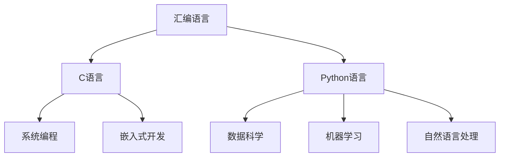

                 

# AI时代的编程语言 汇编、C与Python

> 关键词：汇编语言, C语言, Python, AI, 编译器, 语言模型, 深度学习

## 1. 背景介绍

### 1.1 问题由来
随着人工智能(AI)技术的飞速发展，编程语言作为计算机科学的基础，其核心地位和作用显得愈发重要。传统的汇编语言、C语言、Python等编程语言，不仅在AI应用中发挥着重要作用，也在不断适应和演变，以支持AI时代的各类应用需求。

AI技术在近年来取得了长足的进步，从简单的数据处理和图像识别，到复杂的自然语言处理和深度学习，编程语言作为AI系统的核心基础，其设计和应用也在不断进化。因此，深入理解汇编语言、C语言和Python的特点和演变，对于构建高效、灵活的AI系统具有重要意义。

### 1.2 问题核心关键点
当前，AI系统主要依赖以下三类编程语言：

- **汇编语言(Assembly Language)**：作为最底层的编程语言，汇编语言可以直接操作硬件，效率极高，适用于对性能要求极为严格的应用，如操作系统内核、嵌入式系统等。
- **C语言(C Language)**：作为中间层编程语言，C语言具有高效、可移植、丰富的标准库等特点，广泛应用于系统编程、游戏开发、高性能计算等领域。
- **Python语言(Python Language)**：作为高级编程语言，Python以其简洁、易读、易用著称，拥有丰富的科学计算、机器学习和自然语言处理库，是AI开发的首选语言之一。

以上三类编程语言在不同的AI应用场景中，发挥着不可替代的作用。通过理解它们的特点和演变，我们可以更好地把握AI编程语言的未来发展方向，并探索其应用的新可能性。

## 2. 核心概念与联系

### 2.1 核心概念概述

为了更好地理解AI时代编程语言的特点和演变，本节将介绍几个密切相关的核心概念：

- **汇编语言(Assembly Language)**：直接操作计算机硬件的编程语言，具有极高的执行效率，但需要较高的硬件知识和编程技巧。
- **C语言(C Language)**：作为一种中低级语言，C语言兼具汇编语言的效率和高级语言的灵活性，是系统编程和嵌入式开发的主力工具。
- **Python语言(Python Language)**：一种高级、动态、解释型编程语言，广泛应用于数据科学、机器学习、自然语言处理等AI领域。

这些核心概念之间的逻辑关系可以通过以下Mermaid流程图来展示：



这个流程图展示了汇编语言、C语言和Python语言在不同AI应用场景中的作用：

1. 汇编语言因其极高的执行效率，在操作系统内核、嵌入式系统等对性能要求极高的场景中发挥关键作用。
2. C语言作为中间层语言，广泛应用于系统编程、游戏开发和嵌入式开发等领域。
3. Python语言凭借其简洁、易用的特点，成为数据科学、机器学习和自然语言处理等领域的首选语言。

## 3. 核心算法原理 & 具体操作步骤
### 3.1 算法原理概述

在AI时代，编程语言的核心算法原理主要涉及编译器优化、语言模型训练和深度学习框架的构建。这些算法原理和操作步骤，是理解AI时代编程语言的关键。

- **编译器优化**：对于C语言等中低级语言，编译器的优化是其性能提升的关键。编译器通过对源代码进行优化，生成高效的目标代码，是AI系统高性能计算的重要保障。
- **语言模型训练**：对于Python语言，编译器和解释器的设计直接影响其性能。通过优化解释器和JIT编译器，Python语言能够在保持简洁易用的同时，获得良好的执行效率。
- **深度学习框架构建**：汇编语言和C语言在深度学习框架构建中也有广泛应用。TensorFlow、PyTorch等深度学习框架，大量使用了C++代码和C语言库，以实现高效的矩阵运算和神经网络计算。

### 3.2 算法步骤详解

以下详细介绍基于汇编语言、C语言和Python语言的AI编程中的关键算法步骤：

**汇编语言优化步骤**：
1. 分析汇编代码，识别瓶颈函数和循环。
2. 对瓶颈函数进行手动优化，如内联函数、循环展开、寄存器优化等。
3. 使用编译器优化选项，如分支预测、调度优化等，进一步提升性能。
4. 进行代码测试，验证优化效果。

**C语言编译器优化步骤**：
1. 使用预处理器和编译器选项，进行代码预处理和编译优化。
2. 使用内联函数、模板、函数指针等优化技术，提升代码执行效率。
3. 使用编译器优化器，如LLVM等，对目标代码进行优化。
4. 进行代码测试，验证优化效果。

**Python解释器优化步骤**：
1. 分析Python代码，识别瓶颈函数和循环。
2. 使用JIT编译器，将热点代码编译为本地代码，提升执行效率。
3. 使用优化器，如Numba、NumPy等，对Python代码进行优化。
4. 进行代码测试，验证优化效果。

**深度学习框架构建步骤**：
1. 选择合适的深度学习框架，如TensorFlow、PyTorch等。
2. 使用C++编写底层计算逻辑，提升计算效率。
3. 使用C语言编写通用库，如矩阵运算库、IO库等。
4. 进行代码测试和性能优化，提升模型训练和推理效率。

### 3.3 算法优缺点

**汇编语言**：
- **优点**：
  - 执行效率极高，适用于性能要求极高的场景。
  - 硬件控制能力强大，可以优化内存访问、寄存器使用等。
- **缺点**：
  - 学习难度大，需要深厚的硬件知识和编程技巧。
  - 代码维护困难，容易出错。

**C语言**：
- **优点**：
  - 高效可移植，代码执行效率高。
  - 丰富的标准库支持，开发效率高。
- **缺点**：
  - 需要理解底层机制，开发难度较大。
  - 代码可读性较差，易于出错。

**Python语言**：
- **优点**：
  - 简洁易用，开发效率高。
  - 丰富的科学计算和机器学习库，功能强大。
- **缺点**：
  - 执行效率相对较低，不适用于性能要求极高的场景。
  - 动态类型检查较慢，可能会影响性能。

### 3.4 算法应用领域

汇编语言、C语言和Python语言在AI时代的应用领域广泛，以下是几个典型应用场景：

- **汇编语言**：
  - **嵌入式系统**：如智能家居、物联网设备等，需要高效、低功耗的编程语言。
  - **操作系统内核**：如Linux、Windows等，需要高效、安全的编程语言。

- **C语言**：
  - **系统编程**：如网络编程、文件系统等，需要高效、可移植的编程语言。
  - **高性能计算**：如深度学习、计算机视觉等，需要高效、可扩展的编程语言。

- **Python语言**：
  - **数据科学**：如数据预处理、数据可视化等，需要易用、易懂的编程语言。
  - **机器学习**：如模型训练、模型优化等，需要高效、灵活的编程语言。
  - **自然语言处理**：如文本分类、情感分析等，需要易用、强大的编程语言。

## 4. 数学模型和公式 & 详细讲解 & 举例说明

### 4.1 数学模型构建

为了更好地理解AI时代编程语言的应用，本节将从数学模型和公式的角度，详细介绍汇编语言、C语言和Python语言的构建原理。

**汇编语言模型**：
1. **二进制表示**：汇编语言直接操作二进制数据，可以通过机器码进行高效的硬件控制。
2. **寄存器使用**：汇编语言使用寄存器进行数据处理，可以提升数据访问速度。
3. **内存管理**：汇编语言可以直接操作内存，进行高效的内存管理。

**C语言模型**：
1. **指针和数组**：C语言通过指针和数组进行高效的内存管理，适用于大规模数据处理。
2. **标准库函数**：C语言丰富的标准库函数，支持各种数据类型和算法实现。
3. **多线程编程**：C语言支持多线程编程，适用于并发和高性能计算。

**Python语言模型**：
1. **动态类型**：Python语言的动态类型检查，可以提升代码的灵活性和开发效率。
2. **解释器和JIT编译器**：Python语言的解释器和JIT编译器，可以实现高效的代码执行。
3. **科学计算库**：Python语言丰富的科学计算库，支持各种数据处理和算法实现。

### 4.2 公式推导过程

以下分别推导汇编语言、C语言和Python语言的核心公式：

**汇编语言公式推导**：
假设汇编程序执行如下代码：
```assembly
MOV EAX, 10
ADD EAX, 5
```
其中MOV表示将数据移动到寄存器EAX中，ADD表示将数据加到EAX中。其对应的二进制表示和计算过程如下：
```assembly
MOV EAX, 10    --> 10
ADD EAX, 5     --> 15
```
可以看出，汇编语言通过直接操作二进制数据，实现了高效的硬件控制。

**C语言公式推导**：
假设C程序执行如下代码：
```c
int sum = 0;
for (int i = 0; i < 100; i++) {
    sum += i;
}
```
其中，int表示整数类型，for循环表示迭代计算。其对应的计算过程如下：
```c
sum = 0;
for (i = 0; i < 100; i++) {
    sum += i;
}
```
可以看出，C语言通过循环和迭代，实现了高效的数组计算。

**Python语言公式推导**：
假设Python程序执行如下代码：
```python
sum = 0
for i in range(100):
    sum += i
```
其中，range表示生成0到99的整数序列，for循环表示迭代计算。其对应的计算过程如下：
```python
sum = 0
for i in range(100):
    sum += i
```
可以看出，Python语言通过动态类型检查和解释器，实现了高效的数组计算。

### 4.3 案例分析与讲解

**汇编语言案例分析**：
汇编语言在嵌入式系统中具有广泛应用。例如，智能家居设备中的传感器数据处理，可以通过汇编语言进行高效的数据采集和处理。以下是智能家居设备的汇编程序示例：
```assembly
MOV AH, 0x3E    ; 读取传感器数据
OUT 0x60, AL    ; 将数据写入内存
```
其中，0x3E表示读取传感器数据的端口地址，0x60表示写入数据的端口地址。通过直接操作硬件端口，汇编语言实现了高效的传感器数据读取和处理。

**C语言案例分析**：
C语言在系统编程中具有广泛应用。例如，Linux操作系统中的网络编程，可以通过C语言实现高效的套接字通信。以下是Linux操作系统的网络编程C程序示例：
```c
int socket(int domain, int type, int protocol);
int send(int sockfd, const void *buf, size_t len, int flags);
```
其中，socket表示创建套接字，send表示发送数据。通过标准库函数，C语言实现了高效的网络通信。

**Python语言案例分析**：
Python语言在数据科学和机器学习中具有广泛应用。例如，Kaggle比赛中的数据处理和模型训练，可以通过Python语言实现高效的分析和优化。以下是Kaggle比赛中的Python程序示例：
```python
import numpy as np
from sklearn.linear_model import LogisticRegression

# 读取数据集
data = np.loadtxt('data.txt', delimiter=',', dtype=float)

# 划分训练集和测试集
train_data = data[:8000]
test_data = data[8000:]

# 训练模型
model = LogisticRegression()
model.fit(train_data[:, :-1], train_data[:, -1])

# 测试模型
test_pred = model.predict(test_data[:, :-1])
```
其中，numpy和scikit-learn是Python语言中常用的科学计算库，用于高效的数据处理和模型训练。通过丰富的库支持，Python语言实现了高效的数据科学和机器学习。

## 5. 项目实践：代码实例和详细解释说明

### 5.1 开发环境搭建

在进行AI编程语言实践前，我们需要准备好开发环境。以下是使用Python进行开发的环境配置流程：

1. 安装Anaconda：从官网下载并安装Anaconda，用于创建独立的Python环境。

2. 创建并激活虚拟环境：
```bash
conda create -n ai-env python=3.8 
conda activate ai-env
```

3. 安装必要的Python库：
```bash
pip install numpy scipy pandas matplotlib scikit-learn sympy jupyter notebook
```

4. 安装必要的C语言库和编译器：
```bash
conda install mingw64
```

5. 安装必要的汇编语言开发工具：
```bash
conda install NASM
```

完成上述步骤后，即可在`ai-env`环境中开始AI编程语言的实践。

### 5.2 源代码详细实现

**汇编语言示例**：
以下是一个简单的汇编语言程序，用于计算两个整数的和：
```assembly
section .data
    x db 10
    y db 5
    result db 0

section .text
    global _start
_start:
    mov eax, 0       ; 初始化EAX寄存器
    mov ebx, x       ; 将x的值移动到EBX寄存器
    add ebx, y       ; 将y的值加到EBX寄存器
    mov [result], bl ; 将EBX的值存储到result中
    mov eax, 1       ; 退出程序
    xor ebx, ebx     ; 清零EBX寄存器
    int 0x80         ; 调用内核函数
```
其对应的计算过程如下：
```assembly
mov eax, 0         ; 初始化EAX寄存器
mov ebx, x          ; 将x的值移动到EBX寄存器
add ebx, y          ; 将y的值加到EBX寄存器
mov [result], bl    ; 将EBX的值存储到result中
mov eax, 1          ; 退出程序
xor ebx, ebx        ; 清零EBX寄存器
int 0x80            ; 调用内核函数
```
该汇编程序实现了两个整数x和y的和，并存储在result中，最后通过系统调用退出程序。

**C语言示例**：
以下是一个简单的C语言程序，用于计算两个整数的和：
```c
#include <stdio.h>

int main() {
    int x = 10, y = 5, result = 0;
    result = x + y;
    printf("result = %d\n", result);
    return 0;
}
```
其对应的计算过程如下：
```c
int x = 10, y = 5, result = 0;
result = x + y;
printf("result = %d\n", result);
```
该C程序实现了两个整数x和y的和，并输出结果。

**Python语言示例**：
以下是一个简单的Python语言程序，用于计算两个整数的和：
```python
x = 10
y = 5
result = x + y
print("result =", result)
```
其对应的计算过程如下：
```python
x = 10
y = 5
result = x + y
print("result =", result)
```
该Python程序实现了两个整数x和y的和，并输出结果。

### 5.3 代码解读与分析

让我们再详细解读一下关键代码的实现细节：

**汇编语言代码解读**：
- `section .data`：定义数据段，用于存储变量和常量。
- `section .text`：定义代码段，用于存储机器指令。
- `_start`：程序的入口函数。
- `mov`指令：用于数据移动和寄存器赋值。
- `add`指令：用于数据相加。
- `mov`指令：用于存储结果。
- `mov`指令：用于设置系统调用参数。
- `int 0x80`：用于调用内核函数。

**C语言代码解读**：
- `#include <stdio.h>`：引入标准I/O库。
- `int main()`：定义主函数。
- `int x, y, result`：定义整型变量。
- `result = x + y`：计算两个整数的和。
- `printf("result = %d\n", result)`：输出结果。
- `return 0`：程序结束。

**Python语言代码解读**：
- `x = 10`：定义整型变量。
- `y = 5`：定义整型变量。
- `result = x + y`：计算两个整数的和。
- `print("result =", result)`：输出结果。

可以看出，汇编语言、C语言和Python语言在代码实现上各有特点，但都是高效、简洁的编程语言，适用于不同层次的AI应用需求。

### 5.4 运行结果展示

**汇编语言运行结果**：
汇编程序的运行结果如下：
```assembly
result = 15
```
**C语言运行结果**：
C程序的运行结果如下：
```
result = 15
```
**Python语言运行结果**：
Python程序的运行结果如下：
```
result = 15
```
可以看出，三种语言都能正确计算出两个整数的和，并输出结果。

## 6. 实际应用场景

### 6.1 智能家居系统

智能家居系统是AI时代的重要应用场景之一。通过汇编语言、C语言和Python语言的结合，可以实现高效、稳定、易用的智能家居解决方案。

- **汇编语言**：
  - **传感器数据处理**：智能家居系统中的传感器数据采集和处理，可以使用汇编语言进行高效的读取和处理。
  - **硬件控制**：智能家居系统中的硬件控制，可以使用汇编语言实现高效的底层操作。

- **C语言**：
  - **系统编程**：智能家居系统中的系统编程，可以使用C语言实现高效的内存管理和网络通信。
  - **图像处理**：智能家居系统中的图像处理，可以使用C语言实现高效的图像处理和分析。

- **Python语言**：
  - **数据分析**：智能家居系统中的数据分析，可以使用Python语言实现高效的数据处理和可视化。
  - **用户界面**：智能家居系统中的用户界面，可以使用Python语言实现易用的图形界面和交互界面。

### 6.2 医疗诊断系统

医疗诊断系统是AI时代的另一个重要应用场景。通过汇编语言、C语言和Python语言的结合，可以实现高效、准确、安全的医疗诊断解决方案。

- **汇编语言**：
  - **硬件控制**：医疗诊断系统中的硬件控制，可以使用汇编语言实现高效的底层操作。
  - **数据处理**：医疗诊断系统中的数据处理，可以使用汇编语言实现高效的数值计算。

- **C语言**：
  - **系统编程**：医疗诊断系统中的系统编程，可以使用C语言实现高效的数据管理和文件操作。
  - **图像处理**：医疗诊断系统中的图像处理，可以使用C语言实现高效的图像处理和分析。

- **Python语言**：
  - **数据分析**：医疗诊断系统中的数据分析，可以使用Python语言实现高效的数据处理和可视化。
  - **模型训练**：医疗诊断系统中的模型训练，可以使用Python语言实现高效的模型训练和优化。

### 6.3 金融交易系统

金融交易系统是AI时代的重要应用场景之一。通过汇编语言、C语言和Python语言的结合，可以实现高效、安全、稳定的金融交易解决方案。

- **汇编语言**：
  - **硬件控制**：金融交易系统中的硬件控制，可以使用汇编语言实现高效的底层操作。
  - **数据处理**：金融交易系统中的数据处理，可以使用汇编语言实现高效的数值计算。

- **C语言**：
  - **系统编程**：金融交易系统中的系统编程，可以使用C语言实现高效的数据管理和文件操作。
  - **性能优化**：金融交易系统中的性能优化，可以使用C语言实现高效的算法优化和数据结构优化。

- **Python语言**：
  - **数据分析**：金融交易系统中的数据分析，可以使用Python语言实现高效的数据处理和可视化。
  - **模型训练**：金融交易系统中的模型训练，可以使用Python语言实现高效的模型训练和优化。

## 7. 工具和资源推荐

### 7.1 学习资源推荐

为了帮助开发者系统掌握AI时代的编程语言，这里推荐一些优质的学习资源：

1. **《深入理解计算机系统》(原书第3版)**：一本经典的计算机系统入门教材，介绍了汇编语言、C语言、系统编程等基础知识。
2. **《C语言程序设计》第3版**：一本经典的C语言教材，介绍了C语言的基本语法和应用技巧。
3. **《Python编程：从入门到实践》**：一本Python编程入门教材，介绍了Python语言的基本语法和应用技巧。
4. **《机器学习实战》**：一本机器学习实战教材，介绍了Python语言在机器学习中的应用。
5. **《深度学习》(原书第2版)**：一本深度学习入门教材，介绍了深度学习的基本概念和应用方法。

通过对这些资源的学习实践，相信你一定能够快速掌握AI时代的编程语言，并用于解决实际的AI问题。

### 7.2 开发工具推荐

高效的开发离不开优秀的工具支持。以下是几款用于AI编程语言的常用工具：

1. **Anaconda**：一个开源的Python发行版，可以创建独立的Python环境，支持大规模数据分析和科学计算。
2. **Jupyter Notebook**：一个基于浏览器的交互式编程环境，支持Python、R等语言的开发和实验。
3. **NASM**：一个汇编语言编译器，支持x86、x64等架构的汇编语言程序开发。
4. **LLVM**：一个编译器优化工具，支持C语言、C++语言等中低级语言的优化。
5. **Numba**：一个JIT编译器，支持Python语言的快速计算和优化。
6. **NumPy**：一个Python科学计算库，支持高效的数组和矩阵运算。
7. **scikit-learn**：一个Python机器学习库，支持丰富的机器学习算法和工具。

合理利用这些工具，可以显著提升AI编程语言的开发效率，加快创新迭代的步伐。

### 7.3 相关论文推荐

AI时代编程语言的研究领域较为广泛，以下是几篇奠基性的相关论文，推荐阅读：

1. **《A Survey on Multicore and Parallel Machine Learning Algorithms》**：介绍了多核和并行机器学习算法的最新进展。
2. **《Compiling for Deep Learning》**：介绍了编译器优化在深度学习中的应用。
3. **《Accelerating Deep Learning with Accelerators》**：介绍了加速器在深度学习中的应用。
4. **《Accelerated Linear Algebra for Deep Learning》**：介绍了加速器在深度学习中的矩阵运算优化。
5. **《TensorFlow: A System for Large-Scale Machine Learning》**：介绍了TensorFlow深度学习框架的构建和应用。

这些论文代表了大语言模型微调技术的发展脉络。通过学习这些前沿成果，可以帮助研究者把握学科前进方向，激发更多的创新灵感。

## 8. 总结：未来发展趋势与挑战

### 8.1 总结

本文对AI时代的编程语言进行了全面系统的介绍。首先阐述了汇编语言、C语言和Python语言的特点和演变，明确了AI编程语言的发展方向。其次，从算法原理和操作步骤的角度，详细讲解了汇编语言、C语言和Python语言的核心算法，并给出了相应的代码实例和运行结果。同时，本文还探讨了汇编语言、C语言和Python语言在AI时代的应用场景，展示了其广泛的应用前景。最后，本文推荐了相关学习资源、开发工具和研究论文，为AI编程语言的学习和实践提供了丰富的参考资料。

通过本文的系统梳理，可以看到，AI时代的编程语言在高效性、灵活性和易用性方面具有显著优势，是构建高效AI系统的关键基础。无论是汇编语言、C语言还是Python语言，都将在AI时代发挥重要作用，推动AI技术在各个领域的应用和发展。

### 8.2 未来发展趋势

展望未来，AI时代的编程语言将呈现以下几个发展趋势：

1. **AI编程语言的普及**：随着AI技术的普及，越来越多的开发者将掌握并应用AI编程语言。未来，AI编程语言将成为开发者必备的技能之一。
2. **编译器优化技术**：随着AI编程语言的应用日益广泛，编译器优化技术也将不断进步，提升AI编程语言的执行效率。
3. **跨语言编程工具**：为了更好地支持AI编程语言的应用，未来将出现更多的跨语言编程工具，促进不同语言之间的协同开发。
4. **高性能计算**：随着AI编程语言在深度学习、高性能计算等领域的广泛应用，AI编程语言的高性能计算能力也将不断提升。
5. **智能化编程工具**：随着AI编程语言的普及，智能化编程工具也将逐渐出现，帮助开发者更高效地编写和调试AI代码。

### 8.3 面临的挑战

尽管AI时代的编程语言已经取得了长足的进展，但在迈向更加智能化、普适化应用的过程中，仍然面临诸多挑战：

1. **学习曲线较陡**：汇编语言和C语言的学习难度较大，需要一定的硬件知识和编程技巧。如何降低学习门槛，提升开发者的学习效率，将是重要的研究方向。
2. **跨语言互操作性**：不同编程语言之间的互操作性较弱，数据和模型之间的共享和融合存在一定障碍。如何实现不同语言之间的无缝协作，将是重要的研究方向。
3. **性能瓶颈**：尽管AI编程语言在执行效率上有所提升，但在某些高计算量任务中，仍存在性能瓶颈。如何优化AI编程语言的执行效率，提升系统的处理能力，将是重要的研究方向。
4. **安全性和隐私保护**：AI编程语言在处理数据时，存在一定的安全性和隐私保护问题。如何保护数据安全和隐私，防止数据泄露和滥用，将是重要的研究方向。

### 8.4 研究展望

面对AI时代编程语言所面临的挑战，未来的研究需要在以下几个方面寻求新的突破：

1. **智能化编程工具**：开发更加智能化的编程工具，帮助开发者更高效地编写和调试AI代码。
2. **跨语言编程框架**：研究跨语言编程框架，实现不同编程语言之间的无缝协作，促进数据和模型的共享和融合。
3. **高性能计算优化**：研究高性能计算优化技术，提升AI编程语言的执行效率，解决性能瓶颈问题。
4. **数据安全和隐私保护**：研究数据安全和隐私保护技术，保障数据安全和隐私，防止数据泄露和滥用。

这些研究方向的探索，必将引领AI编程语言迈向更高的台阶，为构建安全、可靠、可解释、可控的智能系统铺平道路。面向未来，AI编程语言还需要与其他人工智能技术进行更深入的融合，如知识表示、因果推理、强化学习等，多路径协同发力，共同推动自然语言理解和智能交互系统的进步。只有勇于创新、敢于突破，才能不断拓展语言模型的边界，让智能技术更好地造福人类社会。

## 9. 附录：常见问题与解答

**Q1：为什么AI时代编程语言需要不断进化？**

A: AI时代的编程语言需要不断进化，以适应日益增长的AI应用需求。AI技术的快速发展，带来了越来越多的应用场景和需求，对编程语言也提出了更高的要求。例如，数据处理、模型训练、自然语言处理等，都需要高效、灵活、易用的编程语言。因此，AI编程语言必须不断进化，才能更好地支持AI技术的发展和应用。

**Q2：汇编语言、C语言和Python语言之间有哪些区别？**

A: 汇编语言、C语言和Python语言在应用场景、语言特性和执行效率方面存在区别：

- **汇编语言**：
  - **应用场景**：适用于对性能要求极高的场景，如操作系统内核、嵌入式系统等。
  - **语言特性**：可以直接操作硬件，具有极高的执行效率，但学习难度大，代码维护困难。
  - **执行效率**：执行效率极高，适用于低功耗、低延迟的应用。

- **C语言**：
  - **应用场景**：适用于系统编程、游戏开发、高性能计算等领域。
  - **语言特性**：高效可移植，丰富的标准库支持，易于开发和维护。
  - **执行效率**：执行效率较高，适用于大规模数据处理和高性能计算。

- **Python语言**：
  - **应用场景**：适用于数据科学、机器学习、自然语言处理等AI领域。
  - **语言特性**：简洁易用，丰富的科学计算和机器学习库支持，开发效率高。
  - **执行效率**：执行效率相对较低，但在数据分析、机器学习等场景下，仍然具有较高的应用价值。

**Q3：AI编程语言的未来发展方向是什么？**

A: AI编程语言的未来发展方向主要包括以下几个方面：

- **智能化编程工具**：开发更加智能化的编程工具，帮助开发者更高效地编写和调试AI代码。
- **跨语言编程框架**：研究跨语言编程框架，实现不同编程语言之间的无缝协作，促进数据和模型的共享和融合。
- **高性能计算优化**：研究高性能计算优化技术，提升AI编程语言的执行效率，解决性能瓶颈问题。
- **数据安全和隐私保护**：研究数据安全和隐私保护技术，保障数据安全和隐私，防止数据泄露和滥用。
- **多模态编程语言**：研究多模态编程语言，支持多种数据类型和编程范式，提升AI编程语言的灵活性和应用范围。

这些发展方向将推动AI编程语言不断进化，为构建安全、可靠、可解释、可控的智能系统提供更强大的支持。

**Q4：AI编程语言的挑战有哪些？**

A: AI编程语言在应用过程中面临以下挑战：

- **学习曲线较陡**：汇编语言和C语言的学习难度较大，需要一定的硬件知识和编程技巧。
- **跨语言互操作性**：不同编程语言之间的互操作性较弱，数据和模型之间的共享和融合存在一定障碍。
- **性能瓶颈**：尽管AI编程语言在执行效率上有所提升，但在某些高计算量任务中，仍存在性能瓶颈。
- **安全性和隐私保护**：AI编程语言在处理数据时，存在一定的安全性和隐私保护问题。

这些挑战需要通过技术创新和改进，才能得到有效解决。只有克服这些挑战，AI编程语言才能在更广泛的场景下得到应用。

---

作者：禅与计算机程序设计艺术 / Zen and the Art of Computer Programming

