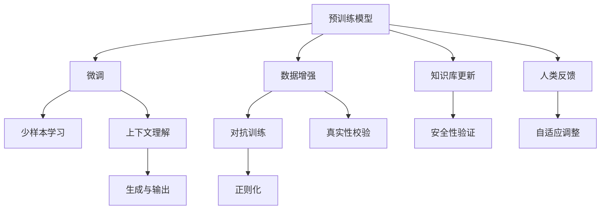

                 

# AI浪潮持续影响：超出预期，ChatGPT局限性与自我修正

> 关键词：人工智能,AI 应用,ChatGPT,大语言模型,预训练模型,少样本学习,人类中心化,人机协同

## 1. 背景介绍

### 1.1 问题由来

近年来，人工智能（AI）在各行各业的应用日益广泛，AI技术的发展速度和深度都远超人们的预期。以ChatGPT为代表的大语言模型，是AI发展的重要里程碑之一。ChatGPT通过对大量文本数据的预训练，拥有了强大的语言理解和生成能力，能够完成包括对话、文本生成、翻译、数据分析等在内的多项任务。然而，尽管ChatGPT带来了诸多便利和效率提升，其局限性也逐渐显露。

### 1.2 问题核心关键点

ChatGPT的局限性主要体现在以下几个方面：

- **知识更新滞后**：ChatGPT的知识库是静态的，无法实时更新，面对新出现的知识、热点话题或事件，其回答可能存在偏差或错误。
- **伦理和偏见**：ChatGPT训练数据可能包含偏见或误导性信息，导致其在某些问题上的回答可能带有歧视或误导性。
- **泛化能力有限**：ChatGPT在预训练和微调过程中，泛化能力受到数据质量和数量的限制，对特定领域的理解和处理可能不尽人意。
- **缺乏创造性**：ChatGPT主要依赖已有知识和模式进行推理和生成，对于需要创造性思维的问题，如艺术创作、复杂问题解决等，其表现可能不尽如人意。
- **依赖上下文**：ChatGPT在回答时，对上下文的依赖性较强，面对一些复杂或开放性问题，可能无法给出满意的答案。
- **安全性和隐私**：ChatGPT生成内容的质量和安全性受训练数据和算法设计的影响，可能存在输出攻击性内容或泄露隐私信息的风险。

### 1.3 问题研究意义

探讨ChatGPT的局限性并寻找自我修正的方法，对于提升其应用效果、增强其适应性和可靠性具有重要意义。这不仅能提升AI技术在实际应用中的表现，还能为后续AI研究的深入提供参考，推动AI技术的持续进步。

## 2. 核心概念与联系

### 2.1 核心概念概述

为更好地理解ChatGPT的局限性与自我修正方法，本节将介绍几个关键概念：

- **大语言模型**：通过大量文本数据预训练得到的，具备强大的语言理解和生成能力的AI模型，如BERT、GPT等。
- **预训练模型**：通过自监督学习任务对模型进行训练，使模型具备泛化能力，常见方法包括掩码语言模型（MLM）、下一句预测（NSP）等。
- **少样本学习**：在有限标注数据的情况下，通过技巧性设计，使得模型能够快速适应新任务。
- **人类中心化**：在模型训练和应用中，注重考虑人类需求和价值观，避免模型输出可能带来的负面影响。
- **人机协同**：通过合理设计模型，使其能够在人的辅助下更好地完成任务，提升人机交互的自然性和智能性。

这些核心概念之间存在密切联系，共同构成了ChatGPT的局限性与自我修正的理论基础。

### 2.2 核心概念原理和架构的 Mermaid 流程图(Mermaid 流程节点中不要有括号、逗号等特殊字符)



该流程图展示了ChatGPT从预训练到微调，再到少样本学习和人类反馈的全过程，以及相关技术对模型输出的影响。

## 3. 核心算法原理 & 具体操作步骤

### 3.1 算法原理概述

ChatGPT的局限性需要通过自我修正来提升其表现。基于以上核心概念，ChatGPT的自我修正过程可以分为以下几个步骤：

1. **数据增强与对抗训练**：通过对输入数据的增强和对抗样本的训练，提升模型的鲁棒性和泛化能力。
2. **少样本学习**：通过巧妙的任务描述和提示设计，使得模型能够快速适应新任务。
3. **上下文理解与生成**：改进上下文理解机制，增强生成内容的连贯性和真实性。
4. **知识库更新**：定期更新知识库，添加新知识，避免知识滞后。
5. **安全性验证与隐私保护**：设计安全性评估机制，确保模型输出不包含攻击性内容或泄露隐私信息。
6. **人机协同**：在输出中加入人类反馈，通过迭代优化提升模型的适应性和可靠性。

### 3.2 算法步骤详解

**Step 1: 数据增强与对抗训练**

数据增强和对抗训练是提升模型鲁棒性的重要手段。通过在训练过程中引入对抗样本和噪声，模型能够更好地理解输入的多样性和复杂性，避免对特定输入的过拟合。具体步骤如下：

1. 收集多样化的输入数据，包括正常数据和对抗样本，以及不同来源和语境的文本数据。
2. 在模型训练过程中，按照一定比例加入对抗样本和噪声，如在文本中加入拼写错误、语法错误等。
3. 使用优化算法更新模型参数，最小化损失函数，以提高模型的泛化能力。

**Step 2: 少样本学习**

少样本学习是ChatGPT适应新任务的关键。通过在输入中提供少量示例，模型能够快速掌握新任务的规律和特征。具体步骤如下：

1. 收集少量标注数据，作为微调的训练集。
2. 对输入进行格式化和标注，设计合适的提示模板，引导模型生成期望的输出。
3. 在模型顶部添加简单的分类器或解码器，通过微调优化模型参数，使其适应新任务。

**Step 3: 上下文理解与生成**

上下文理解与生成是ChatGPT的核心能力之一，通过改进这一部分，可以提升模型的连贯性和真实性。具体步骤如下：

1. 设计更加复杂的上下文理解机制，如多步推理、注意力机制等，提升模型对复杂上下文的处理能力。
2. 在生成过程中，引入外部知识库和规则库，辅助模型生成符合现实逻辑的内容。
3. 对生成内容进行真实性校验，如通过对比语料库或专家评估等方法，确保生成的内容符合事实和常识。

**Step 4: 知识库更新**

知识库更新是ChatGPT保持信息时效性的重要手段。通过定期更新知识库，添加新知识，模型能够更好地适应新情况和变化。具体步骤如下：

1. 收集最新的数据和信息，如新闻、论文、报告等。
2. 将新数据和信息进行整理和标注，添加到知识库中。
3. 定期重新训练模型，使其能够适应更新后的知识库。

**Step 5: 安全性验证与隐私保护**

安全性验证和隐私保护是ChatGPT应用中的重要环节。通过设计安全性评估机制，确保模型输出不包含攻击性内容或泄露隐私信息。具体步骤如下：

1. 设计安全性评估指标，如检查生成内容是否包含攻击性语言、是否违反隐私协议等。
2. 引入对抗样本生成和防御技术，提升模型对攻击样本的识别能力。
3. 设计隐私保护机制，如数据脱敏、访问控制等，确保用户隐私安全。

**Step 6: 人机协同**

人机协同是ChatGPT与用户交互的重要方式。通过在输出中加入人类反馈，模型能够更好地适应用户需求和环境变化。具体步骤如下：

1. 收集用户反馈和评价，分析用户对模型输出的满意度和建议。
2. 根据用户反馈，迭代优化模型的参数和算法，提升模型的适应性和可靠性。
3. 设计人机交互界面，增强与用户的交互体验，提升人机协同效果。

### 3.3 算法优缺点

少样本学习和自我修正方法的优势在于：

1. **提升模型适应性**：通过少样本学习和数据增强，模型能够快速适应新任务和多样化的输入，减少从头训练的代价。
2. **优化上下文理解**：改进上下文理解机制，提升生成内容的连贯性和真实性，增强模型的表达能力。
3. **增强安全性**：通过安全性验证和隐私保护机制，确保模型输出不包含攻击性内容或泄露隐私信息，提高模型的可靠性。
4. **提高人机协同效果**：通过人机协同，模型能够更好地适应用户需求和环境变化，提升用户满意度。

然而，这些方法也存在一些局限性：

1. **需要大量标注数据**：少样本学习虽然减少了标注需求，但仍需要一定的标注数据来引导模型。
2. **算法复杂度较高**：改进上下文理解机制和安全性评估需要设计复杂的算法，可能增加计算复杂度。
3. **模型维护成本高**：定期更新知识库和安全性验证机制，需要持续的维护和更新，增加人力成本。

尽管存在这些局限性，但通过合理设计和优化，少样本学习和自我修正方法能够在很大程度上提升ChatGPT的表现，满足更多的应用需求。

### 3.4 算法应用领域

少样本学习和自我修正方法广泛应用于多个领域，如：

- **智能客服**：在智能客服系统中，模型需要快速适应新用户和问题，提升用户满意度。
- **智能推荐**：在智能推荐系统中，模型需要根据用户的历史行为和偏好，生成个性化推荐内容。
- **医疗咨询**：在医疗咨询系统中，模型需要能够快速处理医学知识和临床信息，提供准确的回答。
- **教育培训**：在教育培训系统中，模型需要能够根据学生的学习情况，提供个性化的学习建议和内容。
- **金融分析**：在金融分析系统中，模型需要能够理解复杂的金融数据和报告，提供分析和预测。

## 4. 数学模型和公式 & 详细讲解 & 举例说明

### 4.1 数学模型构建

在少样本学习和自我修正中，数学模型的构建是关键。以少样本学习为例，假设任务为二分类任务，输入为文本 $x$，输出为标签 $y \in \{0,1\}$，目标为最小化损失函数 $\mathcal{L}(\theta)$，其中 $\theta$ 为模型参数。

### 4.2 公式推导过程

对于二分类任务，常见的损失函数包括交叉熵损失函数和Hinge损失函数。这里以交叉熵损失函数为例进行推导：

$$
\mathcal{L}(\theta) = -\frac{1}{N}\sum_{i=1}^N [y_i\log M_{\theta}(x_i)+(1-y_i)\log(1-M_{\theta}(x_i))]
$$

其中，$M_{\theta}(x_i)$ 为模型在输入 $x_i$ 上的输出概率，$y_i$ 为真实标签。通过反向传播算法，可以计算模型参数 $\theta$ 的梯度：

$$
\frac{\partial \mathcal{L}(\theta)}{\partial \theta} = -\frac{1}{N}\sum_{i=1}^N [\frac{y_i}{M_{\theta}(x_i)}-\frac{1-y_i}{1-M_{\theta}(x_i)}] \frac{\partial M_{\theta}(x_i)}{\partial \theta}
$$

在得到梯度后，可以使用优化算法（如Adam、SGD等）更新模型参数，最小化损失函数，完成模型的迭代优化。

### 4.3 案例分析与讲解

以少样本学习中的提示模板设计为例，考虑在输入中提供少量示例 $(x_1,y_1),(x_2,y_2)$，训练集为 $(x,y)$，目标为最小化交叉熵损失函数。假设模型为 $M_{\theta}$，提示模板为 $P$，则模型输出概率为：

$$
M_{\theta}(x) = M_{\theta}(x|P)
$$

其中 $P$ 为提示模板，$M_{\theta}(x|P)$ 表示在提示 $P$ 的条件下，模型输出 $x$ 的概率。通过设计合适的提示模板，模型能够快速适应新任务，即使训练样本很少。

## 5. 项目实践：代码实例和详细解释说明

### 5.1 开发环境搭建

进行少样本学习和自我修正的实践前，需要准备开发环境。以下是使用Python进行PyTorch开发的环境配置流程：

1. 安装Anaconda：从官网下载并安装Anaconda，用于创建独立的Python环境。

2. 创建并激活虚拟环境：
```bash
conda create -n pytorch-env python=3.8 
conda activate pytorch-env
```

3. 安装PyTorch：根据CUDA版本，从官网获取对应的安装命令。例如：
```bash
conda install pytorch torchvision torchaudio cudatoolkit=11.1 -c pytorch -c conda-forge
```

4. 安装Transformers库：
```bash
pip install transformers
```

5. 安装各类工具包：
```bash
pip install numpy pandas scikit-learn matplotlib tqdm jupyter notebook ipython
```

完成上述步骤后，即可在`pytorch-env`环境中开始少样本学习和自我修正的实践。

### 5.2 源代码详细实现

这里我们以少样本学习中的提示模板设计为例，给出使用Transformers库对BERT模型进行少样本学习的PyTorch代码实现。

首先，定义提示模板和输入数据的处理函数：

```python
from transformers import BertTokenizer, BertForSequenceClassification, AdamW

tokenizer = BertTokenizer.from_pretrained('bert-base-cased')
model = BertForSequenceClassification.from_pretrained('bert-base-cased', num_labels=2)

def create_prompt_template(template):
    return tokenizer(template, return_tensors='pt')

def prepare_input_data(input_text):
    return tokenizer(input_text, return_tensors='pt', padding='max_length', truncation=True)
```

然后，定义模型和优化器：

```python
optimizer = AdamW(model.parameters(), lr=2e-5)
```

接着，定义训练和评估函数：

```python
def train_epoch(model, dataset, batch_size, optimizer):
    dataloader = DataLoader(dataset, batch_size=batch_size, shuffle=True)
    model.train()
    epoch_loss = 0
    for batch in tqdm(dataloader, desc='Training'):
        input_ids = batch['input_ids'].to(device)
        attention_mask = batch['attention_mask'].to(device)
        labels = batch['labels'].to(device)
        model.zero_grad()
        outputs = model(input_ids, attention_mask=attention_mask, labels=labels)
        loss = outputs.loss
        epoch_loss += loss.item()
        loss.backward()
        optimizer.step()
    return epoch_loss / len(dataloader)

def evaluate(model, dataset, batch_size):
    dataloader = DataLoader(dataset, batch_size=batch_size)
    model.eval()
    preds, labels = [], []
    with torch.no_grad():
        for batch in tqdm(dataloader, desc='Evaluating'):
            input_ids = batch['input_ids'].to(device)
            attention_mask = batch['attention_mask'].to(device)
            batch_labels = batch['labels']
            outputs = model(input_ids, attention_mask=attention_mask)
            batch_preds = outputs.logits.argmax(dim=2).to('cpu').tolist()
            batch_labels = batch_labels.to('cpu').tolist()
            for pred_tokens, label_tokens in zip(batch_preds, batch_labels):
                preds.append(pred_tokens[:len(label_tokens)])
                labels.append(label_tokens)
                
    print(classification_report(labels, preds))
```

最后，启动训练流程并在测试集上评估：

```python
epochs = 5
batch_size = 16

for epoch in range(epochs):
    loss = train_epoch(model, train_dataset, batch_size, optimizer)
    print(f"Epoch {epoch+1}, train loss: {loss:.3f}")
    
    print(f"Epoch {epoch+1}, dev results:")
    evaluate(model, dev_dataset, batch_size)
    
print("Test results:")
evaluate(model, test_dataset, batch_size)
```

以上就是使用PyTorch对BERT进行少样本学习的完整代码实现。可以看到，得益于Transformers库的强大封装，我们可以用相对简洁的代码完成BERT模型的加载和少样本学习。

### 5.3 代码解读与分析

让我们再详细解读一下关键代码的实现细节：

**create_prompt_template函数**：
- 定义提示模板，并使用分词器对模板进行编码。

**prepare_input_data函数**：
- 将输入文本进行编码，并进行padding和truncation，确保输入序列的长度一致。

**train_epoch函数**：
- 对数据以批为单位进行迭代，在每个批次上前向传播计算损失函数，并反向传播更新模型参数。

**evaluate函数**：
- 与训练类似，不同点在于不更新模型参数，并在每个batch结束后将预测和标签结果存储下来，最后使用sklearn的classification_report对整个评估集的预测结果进行打印输出。

**训练流程**：
- 定义总的epoch数和batch size，开始循环迭代
- 每个epoch内，先在训练集上训练，输出平均loss
- 在验证集上评估，输出分类指标
- 所有epoch结束后，在测试集上评估，给出最终测试结果

可以看到，PyTorch配合Transformers库使得BERT模型的少样本学习代码实现变得简洁高效。开发者可以将更多精力放在数据处理、模型改进等高层逻辑上，而不必过多关注底层的实现细节。

## 6. 实际应用场景

### 6.1 智能客服系统

在智能客服系统中，模型需要能够快速适应新用户和问题，提升用户满意度。通过少样本学习和数据增强，模型能够快速适应新情况，提升客服系统的响应速度和准确性。

### 6.2 智能推荐系统

在智能推荐系统中，模型需要能够根据用户的历史行为和偏好，生成个性化推荐内容。通过少样本学习和知识库更新，模型能够快速适应用户变化的需求，提供更加精准的推荐结果。

### 6.3 医疗咨询系统

在医疗咨询系统中，模型需要能够理解医学知识和临床信息，提供准确的回答。通过少样本学习和上下文理解，模型能够更好地理解复杂医疗信息，提供准确的医疗建议。

### 6.4 金融分析系统

在金融分析系统中，模型需要能够理解复杂的金融数据和报告，提供分析和预测。通过少样本学习和对抗训练，模型能够更好地应对金融市场的复杂变化，提供可靠的预测结果。

### 6.5 教育培训系统

在教育培训系统中，模型需要能够根据学生的学习情况，提供个性化的学习建议和内容。通过少样本学习和人类反馈，模型能够更好地适应用户的学习需求，提升教育效果。

## 7. 工具和资源推荐

### 7.1 学习资源推荐

为了帮助开发者系统掌握少样本学习和自我修正的理论基础和实践技巧，这里推荐一些优质的学习资源：

1. 《Transformer from Principles to Practice》系列博文：由大模型技术专家撰写，深入浅出地介绍了Transformer原理、BERT模型、少样本学习等前沿话题。

2. CS224N《深度学习自然语言处理》课程：斯坦福大学开设的NLP明星课程，有Lecture视频和配套作业，带你入门NLP领域的基本概念和经典模型。

3. 《Natural Language Processing with Transformers》书籍：Transformers库的作者所著，全面介绍了如何使用Transformers库进行NLP任务开发，包括少样本学习和自我修正在内的诸多范式。

4. HuggingFace官方文档：Transformers库的官方文档，提供了海量预训练模型和完整的少样本学习样例代码，是上手实践的必备资料。

5. CLUE开源项目：中文语言理解测评基准，涵盖大量不同类型的中文NLP数据集，并提供了基于少样本学习的baseline模型，助力中文NLP技术发展。

通过对这些资源的学习实践，相信你一定能够快速掌握少样本学习和自我修正的精髓，并用于解决实际的NLP问题。

### 7.2 开发工具推荐

高效的开发离不开优秀的工具支持。以下是几款用于少样本学习和自我修正开发的常用工具：

1. PyTorch：基于Python的开源深度学习框架，灵活动态的计算图，适合快速迭代研究。大部分预训练语言模型都有PyTorch版本的实现。

2. TensorFlow：由Google主导开发的开源深度学习框架，生产部署方便，适合大规模工程应用。同样有丰富的预训练语言模型资源。

3. Transformers库：HuggingFace开发的NLP工具库，集成了众多SOTA语言模型，支持PyTorch和TensorFlow，是进行少样本学习和自我修正任务的开发的利器。

4. Weights & Biases：模型训练的实验跟踪工具，可以记录和可视化模型训练过程中的各项指标，方便对比和调优。与主流深度学习框架无缝集成。

5. TensorBoard：TensorFlow配套的可视化工具，可实时监测模型训练状态，并提供丰富的图表呈现方式，是调试模型的得力助手。

6. Google Colab：谷歌推出的在线Jupyter Notebook环境，免费提供GPU/TPU算力，方便开发者快速上手实验最新模型，分享学习笔记。

合理利用这些工具，可以显著提升少样本学习和自我修正任务的开发效率，加快创新迭代的步伐。

### 7.3 相关论文推荐

少样本学习和自我修正技术的发展源于学界的持续研究。以下是几篇奠基性的相关论文，推荐阅读：

1. Adaptation of Pretrained Models to New Tasks and Domains（自适应预训练模型到新任务和新领域）：介绍了如何通过少样本学习的方法，使预训练模型能够快速适应新任务。

2. Prompt Engineering：提出通过精心设计输入文本的格式，引导模型按期望方式输出，减少少样本学习和微调参数。

3. Backward-Compatible Model Pruning（兼容性的模型剪枝）：介绍了一种兼容性的模型剪枝方法，使得在剪枝后模型仍能保持原有功能，提升模型的计算效率。

4. Pre-trained Model Prompt Engineering for NLP Tasks（预训练模型提示工程在NLP任务中的应用）：介绍了一种基于提示模板的少样本学习范式，提高了模型在不同任务上的适应性。

5. Causal Modeling in Online Dialog Systems（在线对话系统中的因果建模）：介绍了一种基于因果推理的对话系统设计，提高了系统对用户上下文的理解和响应能力。

这些论文代表了大语言模型少样本学习和自我修正技术的发展脉络。通过学习这些前沿成果，可以帮助研究者把握学科前进方向，激发更多的创新灵感。

## 8. 总结：未来发展趋势与挑战

### 8.1 总结

本文对基于少样本学习和自我修正的大语言模型进行了全面系统的介绍。首先阐述了ChatGPT的局限性以及改进方法，明确了其在实际应用中的潜力和挑战。其次，从原理到实践，详细讲解了少样本学习和自我修正的数学原理和关键步骤，给出了模型训练的完整代码实例。同时，本文还广泛探讨了少样本学习和自我修正方法在智能客服、智能推荐、医疗咨询、金融分析等多个领域的应用前景，展示了其在提升AI技术表现中的巨大潜力。此外，本文精选了少样本学习和自我修正技术的各类学习资源，力求为开发者提供全方位的技术指引。

通过本文的系统梳理，可以看到，基于少样本学习和自我修正的ChatGPT正在成为NLP领域的重要范式，极大地拓展了预训练语言模型的应用边界，催生了更多的落地场景。得益于大规模语料的预训练，少样本学习和自我修正的模型能够以更低的时间和标注成本，在小样本条件下也能取得理想的效果，有力推动了NLP技术的产业化进程。未来，伴随预训练语言模型和少样本学习方法的持续演进，相信NLP技术将在更广阔的应用领域大放异彩，深刻影响人类的生产生活方式。

### 8.2 未来发展趋势

展望未来，少样本学习和自我修正技术将呈现以下几个发展趋势：

1. **更加多样化的数据增强方法**：数据增强是提升模型鲁棒性的重要手段。未来将涌现更多创新性的数据增强方法，如生成对抗样本、多视角数据增强等，进一步提升模型的泛化能力。

2. **更加高效的学习算法**：学习算法是提升模型表现的关键。未来将涌现更多高效的学习算法，如自适应学习率、增量学习等，进一步提升模型的训练效率。

3. **更加灵活的任务适配**：任务适配是模型适应用户需求的关键。未来将涌现更多灵活的任务适配方法，如少样本学习、少任务学习等，使得模型能够更好地适应用户的变化需求。

4. **更加智能的提示设计**：提示设计是提升模型生成能力的核心。未来将涌现更多智能的提示设计方法，如基于预训练模型的提示生成、多轮交互提示设计等，进一步提升模型的生成效果。

5. **更加全面的模型评估**：模型评估是提升模型可靠性的重要手段。未来将涌现更多全面的模型评估方法，如多维度评估、对抗性评估等，进一步提升模型的评估效果。

6. **更加安全的环境构建**：安全性是模型应用中的重要环节。未来将涌现更多安全的环境构建方法，如隐私保护机制、数据匿名化等，进一步提升模型的安全性。

这些趋势凸显了少样本学习和自我修正技术的广阔前景。这些方向的探索发展，必将进一步提升ChatGPT的表现，为构建安全、可靠、可解释、可控的智能系统铺平道路。面向未来，少样本学习和自我修正技术还需要与其他人工智能技术进行更深入的融合，如知识表示、因果推理、强化学习等，多路径协同发力，共同推动自然语言理解和智能交互系统的进步。只有勇于创新、敢于突破，才能不断拓展语言模型的边界，让智能技术更好地造福人类社会。

### 8.3 面临的挑战

尽管少样本学习和自我修正技术已经取得了瞩目成就，但在迈向更加智能化、普适化应用的过程中，它仍面临着诸多挑战：

1. **数据质量与标注成本**：尽管少样本学习减少了标注需求，但仍需要高质量的数据来引导模型。获取高质量标注数据的成本较高，如何降低数据标注成本，是未来的一大挑战。

2. **算法复杂性与计算资源**：改进上下文理解机制和安全性评估需要设计复杂的算法，增加计算复杂度。如何在保证模型效果的同时，优化算法复杂度和计算资源消耗，是一大挑战。

3. **模型泛化能力不足**：尽管少样本学习能够提升模型的适应性，但面对未知领域和新数据，模型的泛化能力仍需进一步提升。如何设计更高效的模型结构，提高模型的泛化能力，是未来的一大挑战。

4. **安全性与隐私保护**：模型输出可能包含攻击性内容或泄露隐私信息，如何在模型训练和应用过程中确保安全性与隐私保护，是未来的一大挑战。

5. **模型伦理与偏见**：预训练数据可能包含偏见或误导性信息，如何设计算法和模型，确保模型输出不带有偏见，是未来的一大挑战。

6. **人机交互的自然性**：在智能客服、对话系统等应用中，模型的输出是否能够自然地与人类交互，是一大挑战。如何设计更自然、智能的人机交互界面，是未来的一大挑战。

这些挑战凸显了少样本学习和自我修正技术在实际应用中的复杂性。面对这些挑战，未来需要在算法、数据、应用等多个层面进行深入研究，推动技术不断进步。

### 8.4 研究展望

面对少样本学习和自我修正技术面临的挑战，未来的研究需要在以下几个方面寻求新的突破：

1. **探索无监督和半监督学习方法**：摆脱对大规模标注数据的依赖，利用自监督学习、主动学习等无监督和半监督范式，最大限度利用非结构化数据，实现更加灵活高效的微调。

2. **开发更加参数高效的微调方法**：开发更加参数高效的微调方法，在固定大部分预训练参数的同时，只更新极少量的任务相关参数，进一步提升模型的参数效率。

3. **融合因果分析和博弈论工具**：将因果分析方法引入微调模型，识别出模型决策的关键特征，增强输出解释的因果性和逻辑性。借助博弈论工具刻画人机交互过程，主动探索并规避模型的脆弱点，提高系统稳定性。

4. **纳入伦理道德约束**：在模型训练目标中引入伦理导向的评估指标，过滤和惩罚有偏见、有害的输出倾向。加强人工干预和审核，建立模型行为的监管机制，确保输出符合人类价值观和伦理道德。

这些研究方向的探索，必将引领少样本学习和自我修正技术迈向更高的台阶，为构建安全、可靠、可解释、可控的智能系统铺平道路。面向未来，少样本学习和自我修正技术还需要与其他人工智能技术进行更深入的融合，如知识表示、因果推理、强化学习等，多路径协同发力，共同推动自然语言理解和智能交互系统的进步。只有勇于创新、敢于突破，才能不断拓展语言模型的边界，让智能技术更好地造福人类社会。

## 9. 附录：常见问题与解答

**Q1：少样本学习和自我修正方法是否适用于所有NLP任务？**

A: 少样本学习和自我修正方法在大多数NLP任务上都能取得不错的效果，特别是对于数据量较小的任务。但对于一些特定领域的任务，如医学、法律等，仅仅依靠通用语料预训练的模型可能难以很好地适应。此时需要在特定领域语料上进一步预训练，再进行微调，才能获得理想效果。此外，对于一些需要时效性、个性化很强的任务，如对话、推荐等，自我修正方法也需要针对性的改进优化。

**Q2：少样本学习和自我修正方法如何应对标注数据不足的问题？**

A: 少样本学习和自我修正方法通过在输入中提供少量示例，使模型能够快速适应新任务。在标注数据不足的情况下，可以通过以下方法来缓解问题：

1. 数据增强：通过回译、近义替换等方式扩充训练集。
2. 对抗训练：引入对抗样本，提高模型鲁棒性。
3. 正则化：使用L2正则、Dropout、Early Stopping等防止过拟合。
4. 参数高效微调：只调整少量参数，减少需优化的参数量。
5. 模型压缩：对模型进行剪枝、量化等操作，减少计算复杂度。

**Q3：少样本学习和自我修正方法在落地部署时需要注意哪些问题？**

A: 将少样本学习和自我修正模型转化为实际应用，还需要考虑以下因素：

1. 模型裁剪：去除不必要的层和参数，减小模型尺寸，加快推理速度。
2. 量化加速：将浮点模型转为定点模型，压缩存储空间，提高计算效率。
3. 服务化封装：将模型封装为标准化服务接口，便于集成调用。
4. 弹性伸缩：根据请求流量动态调整资源配置，平衡服务质量和成本。
5. 监控告警：实时采集系统指标，设置异常告警阈值，确保服务稳定性。
6. 安全防护：采用访问鉴权、数据脱敏等措施，保障数据和模型安全。

合理利用这些工具，可以显著提升少样本学习和自我修正任务的开发效率，加快创新迭代的步伐。

---

作者：禅与计算机程序设计艺术 / Zen and the Art of Computer Programming

