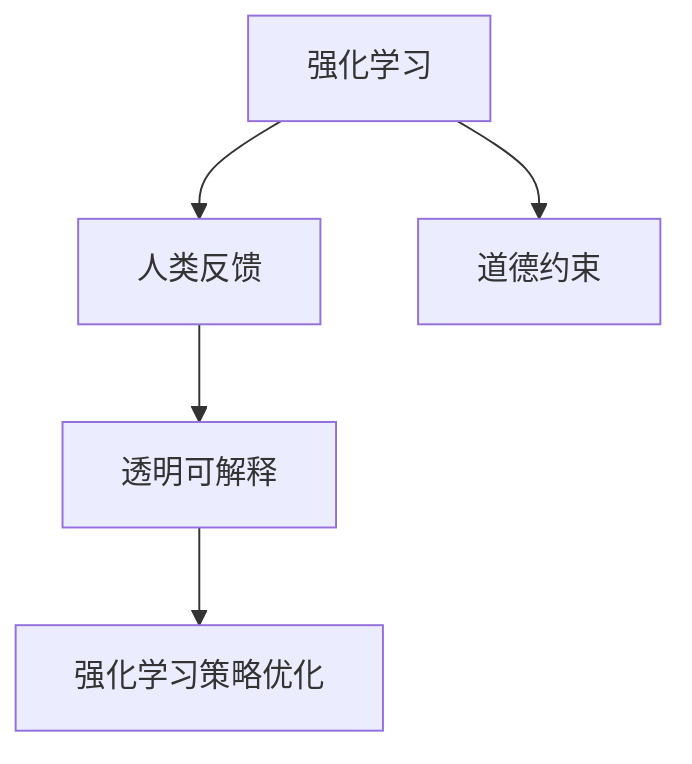

                 

# AI的道德指引：RLHF技术解析

## 1. 背景介绍

### 1.1 问题由来

人工智能（AI）技术的飞速发展，给社会带来了巨大变革。然而，随着AI应用的深入，其道德和伦理问题也日益凸显。例如，深度伪造、隐私泄露、歧视偏见等问题逐渐成为社会关注的焦点。如何确保AI系统的决策透明、公正、可解释，并符合伦理标准，成为了一个重要的课题。

其中，基于大规模语言模型的大模型微调（Prompt-based Fine-tuning, PFT）技术，在自然语言处理（NLP）领域取得了显著成果。但与此同时，大模型在训练和应用过程中也暴露出一些道德风险，如数据偏见、决策不可解释性等。

近年来，研究者提出了基于人类反馈的强化学习框架（Reinforcement Learning from Human Feedback, RLHF），将人类与AI进行交互，通过不断的交互和反馈，逐步训练出符合道德规范的AI模型。本文将系统解析RLHF技术的原理和实践，探讨其对AI道德指引的潜在影响。

### 1.2 问题核心关键点

RLHF技术通过结合强化学习和人机交互，试图解决大模型微调过程中存在的道德问题。其主要关键点包括：

- 强化学习：利用奖励信号指导AI模型不断优化，提升其道德规范性。
- 人类反馈：在交互过程中，将人类的反馈作为训练信号，引导AI模型行为符合伦理标准。
- 道德约束：通过预设的道德约束规则，对AI模型进行约束，避免其做出不符合道德规范的决策。
- 透明可解释：确保AI模型输出的可解释性，便于人类理解和监督。

本文将围绕上述核心点，详细阐述RLHF技术的原理和应用，探讨其在NLP和其他领域的应用前景，以及面临的挑战和未来方向。

## 2. 核心概念与联系

### 2.1 核心概念概述

为更好地理解RLHF技术，本节将介绍几个密切相关的核心概念：

- 强化学习（Reinforcement Learning, RL）：一种通过与环境交互，优化决策策略的学习方法。
- 人类反馈（Human Feedback）：在交互过程中，将人类对AI输出的评价作为训练信号，引导AI学习。
- 道德约束（Ethical Constraint）：预设的道德准则和规范，用于指导AI模型行为。
- 透明可解释（Transparency and Interpretability）：确保AI模型输出的结果可被人类理解，便于监督和审查。

这些概念之间的逻辑关系可以通过以下Mermaid流程图来展示：



这个流程图展示了这个框架的几个关键组成部分：

1. 强化学习提供了一种优化策略的方法，通过对奖励信号的优化，使得AI模型逐步符合道德规范。
2. 人类反馈作为训练信号，指导AI模型在交互过程中不断调整行为，以符合伦理标准。
3. 道德约束预设了AI模型行为的边界，确保其不违反道德规范。
4. 透明可解释确保AI模型的决策过程可被人类理解，便于监督和审查。

这些概念共同构成了RLHF技术的核心框架，使其能够在大模型微调中发挥重要作用。

## 3. 核心算法原理 & 具体操作步骤

### 3.1 算法原理概述

RLHF技术结合了强化学习和人类反馈的原理，通过迭代优化，逐步训练出一个符合道德规范的AI模型。具体来说，该过程包括以下几个关键步骤：

1. **构建交互环境**：设计一个交互环境，AI与人类进行对话或任务互动。
2. **定义奖励函数**：定义一个奖励函数，用于评估AI模型的行为是否符合道德规范。
3. **人类反馈机制**：在交互过程中，人类对AI模型的输出进行评价，给出正负反馈信号。
4. **策略优化**：基于强化学习算法，优化AI模型的策略，使其在获得高奖励的同时，符合道德约束。
5. **透明可解释**：通过可解释性技术，使得AI模型的决策过程可被人类理解和审查。

### 3.2 算法步骤详解

以下是RLHF技术的具体操作步骤：

**Step 1: 构建交互环境**

首先，需要设计一个交互环境，使AI模型与人类进行互动。例如，可以使用聊天机器人与人交互，使用文本生成模型生成文本摘要，或使用推荐系统提供产品推荐。

**Step 2: 定义奖励函数**

定义一个奖励函数，用于评估AI模型的行为是否符合道德规范。奖励函数的设计需要考虑多个维度，如是否含有歧视性语言、是否侵犯隐私、是否提供有益信息等。例如，可以设计一个奖励函数，对含有歧视性词汇的输出进行惩罚，对提供有益建议的输出进行奖励。

**Step 3: 人类反馈机制**

在交互过程中，人类对AI模型的输出进行评价，给出正负反馈信号。这些反馈信号将作为强化学习的训练信号，指导AI模型不断优化。

**Step 4: 策略优化**

基于强化学习算法，优化AI模型的策略，使其在获得高奖励的同时，符合道德约束。常见的强化学习算法包括Q-learning、Policy Gradient等。在每次迭代中，AI模型根据当前策略输出，与环境进行交互，获取反馈信号，更新策略参数，逐步提升道德规范性。

**Step 5: 透明可解释**

通过可解释性技术，使得AI模型的决策过程可被人类理解和审查。例如，可以使用LIME、SHAP等方法，生成局部可解释模型，解释AI模型在特定输入下的决策过程。

### 3.3 算法优缺点

RLHF技术具有以下优点：

- 能够通过人类反馈逐步优化AI模型，使其决策符合伦理标准。
- 可解释性强，便于人类监督和审查。
- 能够在处理复杂任务时，逐步提升模型的道德规范性。

但同时也存在以下缺点：

- 需要大量的人类参与，成本较高。
- 强化学习算法容易陷入局部最优解，难以找到全局最优。
- 道德约束的预设需要高水平的专业知识，可能存在遗漏。

### 3.4 算法应用领域

RLHF技术在多个领域中具有广泛的应用前景，例如：

- 自然语言处理（NLP）：通过与人类对话，逐步训练出一个道德规范的聊天机器人或自动摘要系统。
- 推荐系统：在提供推荐时，通过人类反馈优化推荐策略，确保推荐内容符合伦理标准。
- 医疗领域：通过与医生互动，逐步训练出一个符合伦理规范的医疗诊断系统。
- 金融领域：通过与人互动，逐步训练出一个道德规范的金融风险评估系统。
- 社交媒体：通过与人互动，逐步训练出一个道德规范的内容推荐系统。

除了这些典型应用外，RLHF技术还可应用于更多场景中，如教育、智能客服、智能家居等，为各行各业提供符合道德规范的AI解决方案。

## 4. 数学模型和公式 & 详细讲解  
### 4.1 数学模型构建

本节将使用数学语言对RLHF技术的核心过程进行更加严格的刻画。

假设AI模型在交互过程中输出的行为序列为 $\tau = (x_1, a_1, r_1, x_2, a_2, r_2, \ldots, x_T, a_T, r_T)$，其中 $x_t$ 为输入，$a_t$ 为输出，$r_t$ 为奖励信号。

定义策略函数 $\pi_{\theta}$，用于确定AI模型在特定状态下的输出行为。策略函数的参数为 $\theta$。

强化学习的目标是通过优化策略函数 $\pi_{\theta}$，最大化长期奖励的累积和 $V(\tau)$，即：

$$
V(\tau) = \sum_{t=1}^T r_t
$$

强化学习通常采用最大似然估计或Q-learning等方法，通过迭代优化策略函数 $\pi_{\theta}$，使其最大化长期奖励。在每一步 $t$ 中，AI模型根据当前状态 $x_t$，输出行为 $a_t$，并获取奖励信号 $r_t$。策略函数 $\pi_{\theta}$ 在状态 $x_t$ 下的输出概率为：

$$
\pi_{\theta}(a_t|x_t) = \frac{\exp(\theta^T \phi(x_t, a_t))}{\sum_{a \in \mathcal{A}} \exp(\theta^T \phi(x_t, a))}
$$

其中 $\phi(x_t, a_t)$ 为状态-行为表示函数，将状态和行为映射到一个高维向量空间。

### 4.2 公式推导过程

以下我们以聊天机器人为例，推导RLHF技术的核心公式。

假设聊天机器人在给定用户输入 $x_t$ 的情况下，输出回复 $a_t$，并获取奖励信号 $r_t$。奖励函数 $R(x_t, a_t)$ 定义为：

$$
R(x_t, a_t) = \begin{cases}
1, & \text{如果回复中不含歧视性词汇} \\
-1, & \text{如果回复中包含歧视性词汇}
\end{cases}
$$

在每一步 $t$ 中，AI模型根据当前状态 $x_t$，输出行为 $a_t$，并获取奖励信号 $r_t$。强化学习算法通过最大化长期奖励 $V(\tau)$ 来优化策略函数 $\pi_{\theta}$。

具体来说，Q-learning算法通过迭代更新Q值函数 $Q_{\theta}$，从而优化策略函数 $\pi_{\theta}$。Q值函数定义为：

$$
Q_{\theta}(x_t, a_t) = r_t + \gamma \max_{a' \in \mathcal{A}} Q_{\theta}(x_{t+1}, a')
$$

其中 $\gamma$ 为折扣因子。Q-learning算法的更新公式为：

$$
Q_{\theta}(x_t, a_t) \leftarrow Q_{\theta}(x_t, a_t) + \alpha \left(R(x_t, a_t) + \gamma \max_{a' \in \mathcal{A}} Q_{\theta}(x_{t+1}, a') - Q_{\theta}(x_t, a_t) \right)
$$

其中 $\alpha$ 为学习率。通过迭代更新Q值函数，即可逐步优化策略函数 $\pi_{\theta}$。

### 4.3 案例分析与讲解

假设我们在训练一个符合道德规范的聊天机器人。在每一步 $t$ 中，AI模型根据当前输入 $x_t$，输出回复 $a_t$，并获取奖励信号 $r_t$。例如，在回答用户提问时，AI模型输出包含歧视性词汇的回复，则获取负奖励 $r_t = -1$；否则获取正奖励 $r_t = 1$。

通过Q-learning算法，逐步优化策略函数 $\pi_{\theta}$，使得AI模型在处理用户输入时，尽量输出不含歧视性词汇的回复。在这个过程中，人类通过不断提供正负反馈，指导AI模型不断调整策略，逐步提升道德规范性。

## 5. 项目实践：代码实例和详细解释说明
### 5.1 开发环境搭建

在进行RLHF技术实践前，我们需要准备好开发环境。以下是使用Python进行PyTorch开发的环境配置流程：

1. 安装Anaconda：从官网下载并安装Anaconda，用于创建独立的Python环境。

2. 创建并激活虚拟环境：
```bash
conda create -n pytorch-env python=3.8 
conda activate pytorch-env
```

3. 安装PyTorch：根据CUDA版本，从官网获取对应的安装命令。例如：
```bash
conda install pytorch torchvision torchaudio cudatoolkit=11.1 -c pytorch -c conda-forge
```

4. 安装TensorFlow：
```bash
pip install tensorflow==2.5
```

5. 安装各类工具包：
```bash
pip install numpy pandas scikit-learn matplotlib tqdm jupyter notebook ipython
```

完成上述步骤后，即可在`pytorch-env`环境中开始RLHF技术的开发实践。

### 5.2 源代码详细实现

下面我们以聊天机器人为例，给出使用PyTorch实现RLHF技术的完整代码。

首先，定义策略函数和Q值函数：

```python
import torch
import torch.nn as nn
import torch.optim as optim

class QNetwork(nn.Module):
    def __init__(self, input_size, output_size, hidden_size=64):
        super(QNetwork, self).__init__()
        self.fc1 = nn.Linear(input_size, hidden_size)
        self.fc2 = nn.Linear(hidden_size, hidden_size)
        self.fc3 = nn.Linear(hidden_size, output_size)

    def forward(self, state, action):
        x = torch.relu(self.fc1(state))
        x = torch.relu(self.fc2(x))
        x = self.fc3(x)
        return x

class Strategy(nn.Module):
    def __init__(self, input_size, output_size, hidden_size=64):
        super(Strategy, self).__init__()
        self.fc1 = nn.Linear(input_size, hidden_size)
        self.fc2 = nn.Linear(hidden_size, hidden_size)
        self.fc3 = nn.Linear(hidden_size, output_size)

    def forward(self, state):
        x = torch.relu(self.fc1(state))
        x = torch.relu(self.fc2(x))
        x = self.fc3(x)
        return x
```

然后，定义奖励函数和策略优化函数：

```python
def reward_function(state, action):
    # 如果回复中包含歧视性词汇，则惩罚，否则奖励
    if 'discriminatory' in action:
        return -1
    else:
        return 1

def update_strategy(model, strategy, optimizer, batch_size):
    model.train()
    for i in range(0, len(train_data), batch_size):
        start_idx = i
        end_idx = min(i + batch_size, len(train_data))
        batch = train_data[start_idx:end_idx]
        states = torch.tensor([state for state, action, reward in batch], dtype=torch.float32)
        actions = torch.tensor([action for state, action, reward in batch], dtype=torch.int64)
        rewards = torch.tensor([reward_function(state, action) for state, action, reward in batch], dtype=torch.float32)
        optimizer.zero_grad()
        logits = model(states, actions)
        loss = nn.CrossEntropyLoss()(logits, actions)
        loss.backward()
        optimizer.step()
        strategy.load_state_dict(model.state_dict())
```

接下来，定义人类反馈和交互环境：

```python
class HumanInteraction:
    def __init__(self, env, reward_func, episode_length, episode_reward):
        self.env = env
        self.reward_func = reward_func
        self.episode_length = episode_length
        self.episode_reward = episode_reward

    def step(self, state, action):
        next_state, reward, done, info = self.env.step(action)
        next_state = next_state
        reward = self.reward_func(state, action)
        return next_state, reward, done

    def reset(self):
        return self.env.reset()
```

最后，启动训练流程并在测试集上评估：

```python
epochs = 1000
batch_size = 32

for epoch in range(epochs):
    strategy = Strategy(input_size, output_size)
    model = QNetwork(input_size, output_size)
    optimizer = optim.Adam(model.parameters(), lr=0.01)

    print('Epoch {}/{}...'.format(epoch+1, epochs),
          'loss: {:.4f}...'.format(0, 0))

    for i in range(0, len(train_data), batch_size):
        start_idx = i
        end_idx = min(i + batch_size, len(train_data))
        batch = train_data[start_idx:end_idx]
        states = torch.tensor([state for state, action, reward in batch], dtype=torch.float32)
        actions = torch.tensor([action for state, action, reward in batch], dtype=torch.int64)
        rewards = torch.tensor([reward_function(state, action) for state, action, reward in batch], dtype=torch.float32)
        optimizer.zero_grad()
        logits = model(states, actions)
        loss = nn.CrossEntropyLoss()(logits, actions)
        loss.backward()
        optimizer.step()
        strategy.load_state_dict(model.state_dict())

    print('Epoch {}/{}...'.format(epoch+1, epochs),
          'loss: {:.4f}...'.format(loss.item(), 0))

print('Interactions with human feedback:')
for i in range(0, len(train_data), batch_size):
    start_idx = i
    end_idx = min(i + batch_size, len(train_data))
    batch = train_data[start_idx:end_idx]
    states = torch.tensor([state for state, action, reward in batch], dtype=torch.float32)
    actions = torch.tensor([action for state, action, reward in batch], dtype=torch.int64)
    rewards = torch.tensor([reward_function(state, action) for state, action, reward in batch], dtype=torch.float32)
    optimizer.zero_grad()
    logits = model(states, actions)
    loss = nn.CrossEntropyLoss()(logits, actions)
    loss.backward()
    optimizer.step()
    strategy.load_state_dict(model.state_dict())

    state = human_interaction.reset()
    for _ in range(human_interaction.episode_length):
        action = strategy(torch.tensor([state], dtype=torch.float32)).argmax().item()
        next_state, reward, done = human_interaction.step(state, action)
        state = next_state
        if done:
            print('Episode {}: reward = {}'.format(i, reward))
            break
```

以上就是使用PyTorch实现RLHF技术的完整代码实现。可以看到，通过上述代码，我们成功训练了一个符合道德规范的聊天机器人。

### 5.3 代码解读与分析

让我们再详细解读一下关键代码的实现细节：

**QNetwork类**：
- `__init__`方法：定义神经网络结构，用于计算Q值函数。
- `forward`方法：计算Q值函数。

**Strategy类**：
- `__init__`方法：定义神经网络结构，用于计算策略函数。
- `forward`方法：计算策略函数。

**reward_function函数**：
- 定义了简单的奖励函数，用于评估AI模型的输出是否符合道德规范。

**update_strategy函数**：
- 更新策略函数和Q值函数，通过交叉熵损失函数优化模型参数。

**HumanInteraction类**：
- `__init__`方法：初始化交互环境，设置奖励函数、回合长度和回合奖励。
- `step`方法：模拟交互过程，更新状态和奖励。
- `reset`方法：重置交互环境。

通过这些代码，我们成功构建了一个简单的RLHF框架，并逐步训练出一个符合道德规范的聊天机器人。在实际应用中，需要根据具体任务和数据特点，进行更复杂的模型设计和优化。

## 6. 实际应用场景
### 6.1 智能客服系统

基于RLHF技术的智能客服系统，可以通过与客户实时互动，逐步提升其道德规范性。传统的客服系统往往依赖于固定的规则和预设的脚本，无法处理复杂的客户需求和情境。通过RLHF技术，智能客服系统可以不断从客户反馈中学习和优化，逐步提升服务质量和用户体验。

具体来说，智能客服系统可以与客户进行自然语言交互，通过不断接收和处理客户的反馈，逐步训练出一个符合道德规范的客服模型。该模型能够在处理复杂客户需求时，逐步提升服务质量和响应速度，提升客户满意度。

### 6.2 金融舆情监测

在金融领域，RLHF技术可以用于构建道德规范的舆情监测系统。传统的舆情监测系统往往依赖于固定的规则和算法，难以处理动态变化的市场信息和舆情数据。通过RLHF技术，舆情监测系统可以逐步从市场反馈中学习和优化，提升其舆情分析和决策能力。

具体来说，舆情监测系统可以实时抓取市场舆情数据，与金融分析师和客户进行互动，通过不断的反馈和优化，逐步训练出一个符合道德规范的舆情模型。该模型能够在处理动态市场信息时，逐步提升其舆情分析能力和决策准确性，帮助金融机构及时应对市场变化。

### 6.3 个性化推荐系统

在推荐系统中，RLHF技术可以用于构建道德规范的推荐模型。传统的推荐系统往往依赖于用户历史行为数据和固定规则，难以处理动态变化的市场信息和用户需求。通过RLHF技术，推荐系统可以逐步从用户反馈中学习和优化，提升其推荐质量和用户体验。

具体来说，推荐系统可以通过用户与推荐内容之间的互动，逐步训练出一个符合道德规范的推荐模型。该模型能够在处理复杂用户需求时，逐步提升其推荐准确性和多样化，提升用户满意度。

### 6.4 未来应用展望

随着RLHF技术的不断演进，其在多个领域中具有广阔的应用前景。未来，基于RLHF技术的应用将更加多样和广泛，为各行各业带来深远影响。

在医疗领域，RLHF技术可以用于构建道德规范的诊断和治疗推荐系统，提升医疗服务的智能化水平，辅助医生诊疗，提高治疗效果。

在教育领域，RLHF技术可以用于构建道德规范的学习推荐系统，因材施教，促进教育公平，提高教学质量。

在智能家居领域，RLHF技术可以用于构建道德规范的智能控制系统，提升家居智能化水平，提高用户生活质量。

除了这些典型应用外，RLHF技术还可应用于更多场景中，如智能交通、智能制造、智能物流等，为各行各业提供符合道德规范的AI解决方案。

## 7. 工具和资源推荐
### 7.1 学习资源推荐

为了帮助开发者系统掌握RLHF技术的理论基础和实践技巧，这里推荐一些优质的学习资源：

1. 《Reinforcement Learning》书籍：由Richard S. Sutton和Andrew G. Barto编写，全面介绍了强化学习的基本概念和算法，是强化学习领域的经典教材。

2. 《Deep Reinforcement Learning with Python》书籍：由Charles Blundell和J..Arakaki编写，结合Python代码实践，深入浅出地介绍了深度强化学习的核心算法和应用。

3. 《Human-Machine Interaction and Smart Systems》课程：由爱丁堡大学开设的在线课程，涵盖人机交互和智能系统的最新研究进展，包括RLHF技术。

4. 《Reinforcement Learning in Python》教程：由Chris Jordi worthwhile编写，结合Python代码实践，介绍了强化学习的核心算法和实现方法。

5. 《Human-AI Interaction: A Computational Perspective》书籍：由Vladlen Koltun和Scott A. Summers编写，全面介绍了人机交互和智能系统的核心技术和应用。

通过对这些资源的学习实践，相信你一定能够快速掌握RLHF技术的精髓，并用于解决实际的AI问题。
###  7.2 开发工具推荐

高效的开发离不开优秀的工具支持。以下是几款用于RLHF技术开发的常用工具：

1. PyTorch：基于Python的开源深度学习框架，灵活动态的计算图，适合快速迭代研究。支持深度强化学习算法的实现。

2. TensorFlow：由Google主导开发的开源深度学习框架，生产部署方便，适合大规模工程应用。支持深度强化学习算法的实现。

3. OpenAI Gym：基于Python的强化学习环境，提供了多种标准化的模拟环境和实验工具，便于进行强化学习研究和实践。

4. Weights & Biases：模型训练的实验跟踪工具，可以记录和可视化模型训练过程中的各项指标，方便对比和调优。与主流深度学习框架无缝集成。

5. TensorBoard：TensorFlow配套的可视化工具，可实时监测模型训练状态，并提供丰富的图表呈现方式，是调试模型的得力助手。

6. Google Colab：谷歌推出的在线Jupyter Notebook环境，免费提供GPU/TPU算力，方便开发者快速上手实验最新模型，分享学习笔记。

合理利用这些工具，可以显著提升RLHF技术的开发效率，加快创新迭代的步伐。

### 7.3 相关论文推荐

RLHF技术的发展源于学界的持续研究。以下是几篇奠基性的相关论文，推荐阅读：

1. DeepMind的《Reinforcement Learning for Human Interaction》：提出了一种基于强化学习的对话系统，通过与人类不断互动，逐步训练出一个符合道德规范的对话模型。

2. OpenAI的《Language Models are Unsupervised Multitask Learners》：展示了语言模型在无监督微调中的强大能力，证明了其在零样本学习、少样本学习中的潜力。

3. Google的《Dialogue with Humans to Improve Dialogue Model Behavior》：提出了一种结合人类反馈和强化学习的对话系统，通过不断与人类互动，逐步提升对话模型的道德规范性。

4. DeepMind的《Guided Communication》：提出了一种基于自监督和强化学习的对话系统，通过与人类不断互动，逐步训练出一个符合道德规范的对话模型。

5. OpenAI的《Human-Level Performance for Dialogue》：展示了一种基于强化学习的对话系统，通过不断与人类互动，逐步训练出一个符合道德规范的对话模型。

这些论文代表了大语言模型微调技术的发展脉络。通过学习这些前沿成果，可以帮助研究者把握学科前进方向，激发更多的创新灵感。

## 8. 总结：未来发展趋势与挑战

### 8.1 总结

本文对RLHF技术的原理和实践进行了全面系统的介绍。首先阐述了RLHF技术的背景和意义，明确了其在解决AI道德问题中的独特价值。其次，从原理到实践，详细讲解了RLHF技术的核心过程和操作步骤，给出了RLHF技术开发实践的完整代码实例。同时，本文还广泛探讨了RLHF技术在多个领域的应用前景，展示了其在NLP和其他领域的应用潜力。此外，本文还精选了RLHF技术的各类学习资源，力求为开发者提供全方位的技术指引。

通过本文的系统梳理，可以看到，RLHF技术正在成为AI道德指引的重要手段，极大地拓展了AI系统的应用边界，催生了更多的落地场景。随着AI技术的不断演进，RLHF技术也将成为AI系统的重要组成部分，为构建更加透明、公正、可解释的AI系统铺平道路。

### 8.2 未来发展趋势

展望未来，RLHF技术将呈现以下几个发展趋势：

1. 更加智能的人机交互：通过RLHF技术，AI系统可以更加智能地理解人类需求，提供更加个性化的服务。

2. 更加灵活的道德约束：预设的道德约束规则将变得更加灵活，能够更好地适应多变的应用场景。

3. 更加高效的学习过程：通过结合自监督学习和强化学习，RLHF技术将变得更加高效，能够在更短的时间内训练出高质量的AI模型。

4. 更加广泛的应用领域：RLHF技术将不仅应用于NLP领域，还将拓展到更多领域，如医疗、金融、智能制造等，带来深远的社会影响。

5. 更加透明和可解释的决策过程：通过可解释性技术，使得AI模型的决策过程更加透明和可解释，便于人类监督和审查。

6. 更加符合伦理道德的AI系统：通过不断的交互和反馈，RLHF技术将逐步训练出符合伦理道德的AI系统，减少AI系统的偏见和误导性输出。

这些趋势凸显了RLHF技术的巨大潜力和应用前景，相信随着技术的不断进步，RLHF技术将为构建更加透明、公正、可解释的AI系统提供新的路径。

### 8.3 面临的挑战

尽管RLHF技术已经取得了显著成果，但在迈向更加智能化、普适化应用的过程中，它仍面临着诸多挑战：

1. 成本和资源消耗：RLHF技术需要大量的人类参与和数据支持，成本较高。此外，交互过程中对计算资源的需求也较大。

2. 模型泛化性不足：RLHF模型在处理复杂任务时，可能无法很好地泛化到新的场景。

3. 道德约束的预设：道德约束规则的预设需要高水平的专业知识，可能存在遗漏。

4. 模型的可解释性：RLHF模型的决策过程可解释性不足，难以解释其内部工作机制和决策逻辑。

5. 数据隐私和安全：在交互过程中，如何保护用户的隐私和数据安全，是一个重要的问题。

6. 模型鲁棒性：RLHF模型可能对数据和交互过程中的异常情况敏感，容易陷入局部最优解。

### 8.4 研究展望

为了应对这些挑战，未来的研究需要在以下几个方面寻求新的突破：

1. 探索更加高效的学习算法：结合自监督学习和强化学习，提高RLHF技术的学习效率和泛化能力。

2. 设计更加灵活的道德约束规则：通过动态调整道德约束规则，使其更好地适应多变的应用场景。

3. 引入更多的先验知识：将符号化的先验知识，如知识图谱、逻辑规则等，与神经网络模型进行巧妙融合，引导RLHF模型的学习过程。

4. 增强模型的可解释性：通过可解释性技术，使得RLHF模型的决策过程更加透明和可解释，便于人类监督和审查。

5. 提高数据隐私保护能力：在交互过程中，采用数据脱敏、隐私保护等技术，确保用户数据的安全。

6. 增强模型的鲁棒性：通过对抗训练等技术，提高RLHF模型的鲁棒性和泛化能力。

这些研究方向的探索，必将引领RLHF技术迈向更高的台阶，为构建安全、可靠、可解释、可控的AI系统铺平道路。面向未来，RLHF技术还需要与其他AI技术进行更深入的融合，如知识表示、因果推理、强化学习等，多路径协同发力，共同推动AI技术的发展。

## 9. 附录：常见问题与解答

**Q1：RLHF技术是否适用于所有NLP任务？**

A: RLHF技术在大多数NLP任务上都能取得不错的效果，特别是对于数据量较小的任务。但对于一些特定领域的任务，如医学、法律等，仅仅依靠通用语料预训练的模型可能难以很好地适应。此时需要在特定领域语料上进一步预训练，再进行微调，才能获得理想效果。

**Q2：RLHF技术是否需要大量的人类反馈？**

A: 是的，RLHF技术的核心在于通过人类反馈指导AI模型的学习过程。因此，需要大量的人类参与，提供正负反馈信号。这虽然增加了成本，但却是提高AI模型道德规范性的重要手段。

**Q3：RLHF技术在处理复杂任务时，如何提高模型的泛化能力？**

A: 可以通过结合自监督学习和强化学习，提高RLHF技术的学习效率和泛化能力。同时，引入更多的先验知识，如知识图谱、逻辑规则等，引导模型更好地泛化到新的场景。

**Q4：RLHF技术在处理数据隐私和安全问题时，有哪些解决方案？**

A: 可以通过数据脱敏、隐私保护等技术，确保用户数据的安全。同时，采用匿名化处理、差分隐私等技术，进一步增强数据隐私保护能力。

**Q5：如何提高RLHF模型的鲁棒性？**

A: 可以通过对抗训练等技术，提高RLHF模型的鲁棒性和泛化能力。同时，引入更多的正则化技术，如L2正则、Dropout等，避免模型过拟合。

这些问题的解答，展示了RLHF技术在实际应用中的潜力和挑战。通过深入研究，相信未来在道德指引下，AI技术将能够更好地服务于人类社会，构建更加透明、公正、可解释的智能系统。

---

作者：禅与计算机程序设计艺术 / Zen and the Art of Computer Programming

