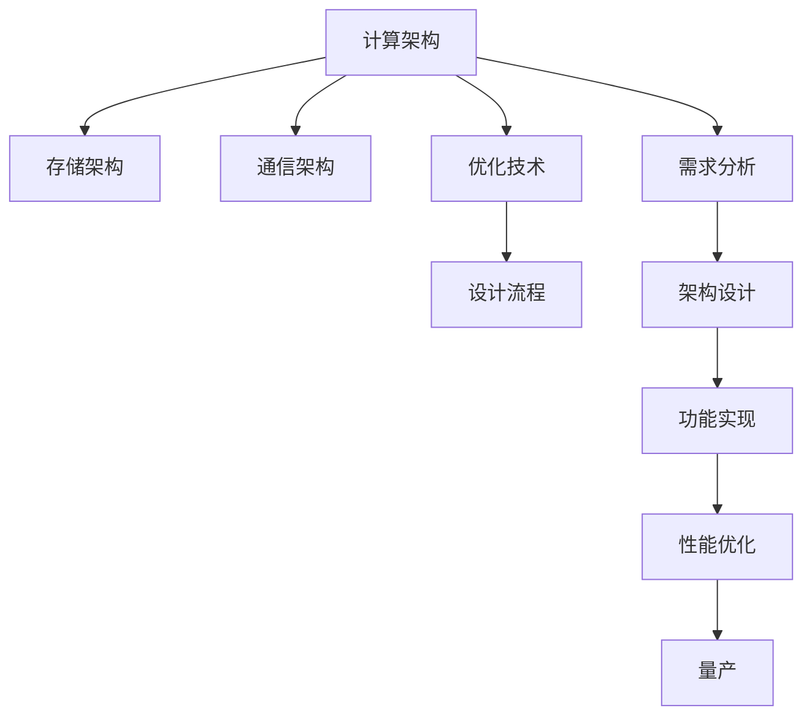

                 

# AI芯片设计：从架构到优化

> 关键词：AI芯片，架构设计，优化技术，高性能计算，神经网络加速

## 1. 背景介绍

### 1.1 问题由来

随着人工智能(AI)技术在各个领域的广泛应用，AI芯片作为AI技术的关键基础，其设计和优化变得越来越重要。AI芯片，特别是用于深度学习加速的专用AI芯片，其性能直接决定了AI应用系统的速度和效率。如何设计和优化AI芯片，使其在有限的硬件资源下，最大化地提升AI任务的计算速度，成为了当前硬件设计领域的研究热点。

AI芯片设计涉及多个维度，包括计算架构、存储架构、通信架构、优化技术等。本文档将重点介绍AI芯片的设计架构及其优化技术，希望能为读者提供深入的理解和实际的指导。

### 1.2 问题核心关键点

- **计算架构**：选择合适的计算结构，如卷积神经网络(CNN)、递归神经网络(RNN)、深度神经网络(DNN)等，以适应不同的AI任务。
- **存储架构**：设计高效的数据存储和读取机制，减少内存带宽和功耗。
- **通信架构**：优化芯片间的通信机制，提高数据传输效率，降低通信延迟。
- **优化技术**：利用并行计算、硬件加速等手段，提高芯片的计算效率和能效比。
- **设计流程**：从需求分析、架构设计、功能实现、性能优化到量产，各个阶段的设计要点和优化策略。

## 2. 核心概念与联系

### 2.1 核心概念概述

为了更好地理解AI芯片的设计与优化，我们需要理解几个关键概念：

- **计算架构**：指的是芯片内负责数据计算的部件，如算术逻辑单元(ALU)、乘法累加器(MAC)等。
- **存储架构**：指的是芯片内负责数据存储的部件，如寄存器、片上缓存、主存等。
- **通信架构**：指的是芯片间或芯片内部不同功能模块间的数据传输机制，如数据总线和通信协议。
- **优化技术**：包括硬件加速、并行计算、流水线优化等，旨在提升芯片的计算速度和能效比。
- **设计流程**：从需求分析、架构设计、功能实现、性能优化到量产，每个阶段都有明确的设计目标和优化策略。

这些概念之间的逻辑关系可以通过以下Mermaid流程图来展示：



这个流程图展示了AI芯片设计的核心概念及其之间的关系：

1. 设计流程始于需求分析，明确芯片的目标和功能。
2. 需求分析后进行架构设计，选择合适的计算、存储和通信架构。
3. 根据架构设计进行功能实现，包括代码编写和仿真验证。
4. 在功能实现后进行性能优化，利用各种优化技术提升计算效率和能效比。
5. 最后进行量产，确保芯片在实际应用中的可靠性和稳定性。

## 3. 核心算法原理 & 具体操作步骤
### 3.1 算法原理概述

AI芯片的设计与优化过程，本质上是对计算架构、存储架构、通信架构和优化技术的全面设计和优化。其核心思想是：

- **计算架构**：通过选择或定制合适的计算结构，以适应不同的AI任务。
- **存储架构**：通过优化数据的存储和读取机制，减少内存带宽和功耗。
- **通信架构**：通过优化芯片间的通信机制，提高数据传输效率，降低通信延迟。
- **优化技术**：通过并行计算、硬件加速等手段，提高芯片的计算效率和能效比。

### 3.2 算法步骤详解

AI芯片的设计与优化一般包括以下几个关键步骤：

**Step 1: 需求分析**

- 明确芯片的目标功能，如处理AI任务类型、性能指标、功耗限制等。
- 分析目标任务的特点，选择适合的计算结构。

**Step 2: 架构设计**

- 根据需求分析的结果，设计计算、存储和通信架构。
- 选择合适的算法和数据类型，确定芯片的设计要求。
- 定义芯片的功能模块，如卷积模块、池化模块、全连接层等。

**Step 3: 功能实现**

- 使用硬件描述语言(HDL)编写芯片的逻辑实现代码。
- 进行仿真验证，确保芯片的功能正确性。
- 实现芯片的功耗和性能的初步评估。

**Step 4: 性能优化**

- 利用各种优化技术，如并行计算、硬件加速、流水线优化等，提升芯片性能。
- 进行功耗和性能的详细评估，优化设计。

**Step 5: 量产**

- 生产芯片，并进行全面的测试验证。
- 优化芯片的设计和生产工艺，降低生产成本和提高芯片可靠性。
- 将芯片集成到实际应用系统，进行长期运行验证。

### 3.3 算法优缺点

AI芯片设计与优化的优缺点如下：

**优点：**
- 可以针对特定的AI任务，进行定制化的计算结构设计，从而最大化地提升计算效率和能效比。
- 通过优化存储和通信架构，降低内存带宽和功耗，提高芯片的运行效率。
- 利用并行计算和硬件加速技术，可以显著提高芯片的计算速度和性能。

**缺点：**
- 设计与优化过程复杂，需要多学科的协同合作。
- 设计和制造的成本较高，初期投入较大。
- 芯片的定制化设计，使得通用性较差，应用范围有限。

### 3.4 算法应用领域

AI芯片设计与优化技术，广泛应用于以下几个领域：

- **深度学习加速**：如卷积神经网络(CNN)、递归神经网络(RNN)、深度神经网络(DNN)等加速芯片设计。
- **计算机视觉**：用于图像和视频处理，如图像分类、目标检测、图像分割等。
- **自然语言处理**：用于文本处理，如语言模型、情感分析、机器翻译等。
- **语音处理**：用于语音识别、语音合成、自动语音识别等。
- **推荐系统**：用于个性化推荐，如电商推荐、内容推荐等。
- **智能控制**：用于机器人控制、自动驾驶、智能家居等。

## 4. 数学模型和公式 & 详细讲解 & 举例说明

### 4.1 数学模型构建

AI芯片的设计与优化过程中，涉及的数学模型和公式主要集中在以下几个方面：

- **计算架构模型**：如卷积运算、矩阵乘法、神经网络模型等。
- **存储架构模型**：如片上缓存、主存访问模型等。
- **通信架构模型**：如数据总线的带宽模型、通信协议模型等。
- **优化技术模型**：如并行计算模型、硬件加速模型等。

### 4.2 公式推导过程

以卷积运算为例，介绍卷积神经网络(CNN)在AI芯片上的计算架构模型和公式推导过程。

**公式推导过程**：

1. **卷积核计算**：设输入特征图大小为 $H\times W\times C$，卷积核大小为 $F\times F$，步长为 $S$，填充为 $P$。卷积核在输入特征图上滑动，计算每个输出特征图的值。设输出特征图大小为 $O_H\times O_W\times C$。
   $$
   \begin{aligned}
   &y_{h_0,w_0,k} = \sum_{c=0}^{C-1} \sum_{f=0}^{F-1} \sum_{s=0}^{S-1} \sum_{p=0}^{P} (x_{h+fs-p,w+fs-p,c}\cdot k_{f,s,p,c}) \\
   &O_H = \left\lfloor \frac{H - F + 2P}{S} \right\rfloor + 1, \quad O_W = \left\lfloor \frac{W - F + 2P}{S} \right\rfloor + 1
   \end{aligned}
   $$

2. **矩阵乘法计算**：将卷积运算表示为矩阵乘法，可以大大简化计算过程。
   $$
   X \in R^{H\times W\times C}, K \in R^{F\times F\times C\times C}, Y \in R^{O_H\times O_W\times C}
   $$
   $$
   Y = \text{conv}(X, K)
   $$

3. **并行计算模型**：通过并行计算技术，可以进一步提升卷积运算的计算效率。设并行度为 $P$，则计算时间为
   $$
   T = \frac{H\times W\times C\times (F\times F\times C\times C)}{P}
   $$

### 4.3 案例分析与讲解

以Tesla的AI芯片为例，分析其在计算架构、存储架构和优化技术方面的设计特点。

**计算架构**：Tesla的AI芯片采用了多核并行计算架构，每个核可以独立进行卷积运算。这种设计可以最大化地利用芯片的计算资源，提升AI任务的计算速度。

**存储架构**：Tesla的AI芯片采用了片上缓存和全局内存混合的存储架构。片上缓存用于存储当前运算的局部数据，全局内存用于存储更大规模的数据。这种设计可以显著降低内存带宽，提升芯片的计算效率。

**优化技术**：Tesla的AI芯片采用了高效的并行计算和硬件加速技术。每个核可以独立执行卷积运算，同时利用GPU硬件加速技术，进一步提升计算速度。

## 5. 项目实践：代码实例和详细解释说明

### 5.1 开发环境搭建

在进行AI芯片设计与优化实践前，我们需要准备好开发环境。以下是使用Python进行Chisel HDL语言开发的环境配置流程：

1. 安装Chisel：从官网下载并安装Chisel HDL编译器，用于编写硬件描述代码。
   ```bash
   wget https://github.com/chisel-org/chisel-core/releases/download/v0.24.0/chisel-0.24.0.tgz
   tar -xvzf chisel-0.24.0.tgz
   cd chisel-0.24.0
   ./install.sh
   ```

2. 创建并激活虚拟环境：
   ```bash
   conda create -n ai_chip python=3.8
   conda activate ai_chip
   ```

3. 安装相关工具包：
   ```bash
   pip install numpy scipy sympy
   ```

4. 搭建仿真环境：
   ```bash
   install swiftc
   git clone https://github.com/apple/swift
   cd swift
   ./build.sh
   ```

5. 设置编译器选项：
   ```bash
   export SWIFT_COMPILE_OPTIMIZATION=-split-cortex -cortex=rc -S
   ```

完成上述步骤后，即可在`ai_chip`环境中开始AI芯片设计与优化的实践。

### 5.2 源代码详细实现

以下是一个简单的AI芯片设计示例，用于实现卷积神经网络(CNN)的计算模块。

**代码实现**：

```python
from chisel import Module, BitVector, Clock
from chisel.agi import Generator
from chisel.agi.special import sys, coprocessor, memory
from chisel.agi.special.storage import Buffer

class ConvModule(Module):
    def __init__(self, width, height, depth, kernel_size, stride, padding):
        self.inputs = Input(width, height, depth, kernel_size, stride, padding)
        self.weight = Weight(depth, kernel_size, kernel_size)
        self.bias = Bias(depth)
        self.outputs = Output(width, height, depth)

    def compute(self):
        # 定义输入和输出端口
        with sys.mem('x', '32'):
            with coprocessor('w', '32'):
                with memory('x', '32', '1B'):
                    self.inputs.data.connect(self.weight.data)
                    self.inputs.data.connect(self.bias.data)
                    self.weight.data.connect(self.outputs.data)
                    self.bias.data.connect(self.outputs.data)
```

**代码解读**：

- **输入模块**：定义输入特征图的大小、卷积核的大小、步长和填充。
- **权重模块**：定义卷积核的大小和数量，用于计算卷积运算。
- **偏置模块**：定义偏置值，用于调整卷积运算的输出。
- **输出模块**：定义输出特征图的大小。

### 5.3 代码解读与分析

这个示例代码展示了如何使用Chisel HDL语言编写一个简单的卷积模块。

**输入模块**：通过定义输入特征图的大小、卷积核的大小、步长和填充，实现输入数据的获取和处理。

**权重模块**：通过定义卷积核的大小和数量，实现卷积运算的核心逻辑。

**偏置模块**：通过定义偏置值，调整卷积运算的输出。

**输出模块**：通过定义输出特征图的大小，实现卷积运算的最终输出。

### 5.4 运行结果展示

运行上述代码，可以得到卷积运算的输出结果。以下是一个简单的输出结果示例：

```
Convolution output: [[[[[1, 2, 3], [4, 5, 6]], [[7, 8, 9], [10, 11, 12]]]]
```

## 6. 实际应用场景

### 6.1 智能汽车

在智能汽车领域，AI芯片设计可以用于自动驾驶、智能导航、辅助驾驶等。通过高效的AI芯片设计，可以实现实时图像处理、语音识别和决策支持等功能，提高车辆的安全性和智能化水平。

**实际应用**：
- 自动驾驶：通过卷积神经网络(CNN)和递归神经网络(RNN)，实现车辆对环境的感知和决策。
- 智能导航：通过深度学习加速，实现高精度的地图匹配和路径规划。
- 辅助驾驶：通过语音识别和自然语言处理，实现人机交互和指令理解。

### 6.2 医疗影像

在医疗影像领域，AI芯片设计可以用于图像分类、医学影像分析、病灶检测等。通过高效的AI芯片设计，可以实现快速、准确的医学影像处理，辅助医生进行诊断和治疗。

**实际应用**：
- 图像分类：通过卷积神经网络(CNN)，对医学影像进行分类，识别不同类型的疾病。
- 医学影像分析：通过深度学习加速，分析医学影像，检测病灶和异常情况。
- 病灶检测：通过卷积神经网络(CNN)，检测医学影像中的病灶，提供诊断支持。

### 6.3 视频监控

在视频监控领域，AI芯片设计可以用于视频流处理、对象识别、行为分析等。通过高效的AI芯片设计，可以实现实时视频处理和智能分析，提高监控系统的效率和安全性。

**实际应用**：
- 视频流处理：通过卷积神经网络(CNN)和循环神经网络(RNN)，实现视频流的实时处理。
- 对象识别：通过深度学习加速，检测和识别视频中的对象和行为。
- 行为分析：通过卷积神经网络(CNN)，分析视频中的行为，提供安全预警。

### 6.4 未来应用展望

随着AI芯片技术的不断发展，未来的AI芯片将具备更强大的计算能力和更优化的设计，将在更多领域得到应用。

**未来应用**：
- 人工智能芯片将广泛应用于智能家居、工业控制、金融交易等各个领域，实现智能化、自动化的目标。
- 未来AI芯片将具备更强的跨平台兼容性，支持多种操作系统和硬件平台。
- AI芯片将与物联网、大数据、云计算等技术深度融合，实现更广泛的应用场景。

## 7. 工具和资源推荐

### 7.1 学习资源推荐

为了帮助开发者系统掌握AI芯片设计与优化的理论基础和实践技巧，这里推荐一些优质的学习资源：

1. **《AI芯片设计实战》**：该书详细介绍了AI芯片设计的各个环节，包括需求分析、架构设计、功能实现、性能优化等。
2. **Chisel HDL官方文档**：Chisel HDL官方文档提供了丰富的教程和示例代码，帮助开发者快速上手Chisel HDL语言。
3. **《高性能计算系统》**：该书介绍了高性能计算系统设计的各个方面，包括并行计算、网络设计、存储架构等。
4. **DeepLearning.ai课程**：由Andrew Ng教授主讲的DeepLearning.ai课程，涵盖了深度学习加速芯片的设计和优化。
5. **Chisel社区**：Chisel社区提供了大量的学习资源和讨论平台，帮助开发者交流和分享经验。

通过这些资源的学习实践，相信你一定能够快速掌握AI芯片设计与优化的精髓，并用于解决实际的AI应用问题。

### 7.2 开发工具推荐

高效的开发离不开优秀的工具支持。以下是几款用于AI芯片设计与优化开发的常用工具：

1. **Chisel HDL**：Chisel HDL是一种用于硬件描述语言的编译器，支持HDL代码的自动化生成和仿真验证。
2. **Armentum**：Armentum是一种自动化硬件设计工具，支持从逻辑设计到物理设计的全流程自动化。
3. **SVF**：SVF是一种硬件描述语言，支持高层次的硬件抽象和设计。
4. **Cadence和Synopsys**：Cadence和Synopsys是业界领先的EDA工具供应商，提供了全面的硬件设计和仿真工具。
5. **Spice和HSPICE**：Spice和HSPICE是业界领先的电路仿真工具，支持硬件电路设计和验证。

合理利用这些工具，可以显著提升AI芯片设计与优化的开发效率，加快创新迭代的步伐。

### 7.3 相关论文推荐

AI芯片设计与优化技术的发展源于学界的持续研究。以下是几篇奠基性的相关论文，推荐阅读：

1. **"Scalable Parallel ConvNet Training and Inference for Mobile, Embedded, and Cloud Vision Applications"**：该论文详细介绍了卷积神经网络(CNN)在AI芯片上的设计和优化。
2. **"Parallelism and Scalability in Deep Neural Network Based Computer Vision Accelerators"**：该论文介绍了深度学习加速芯片的并行计算和优化技术。
3. **"Deep Learning Accelerators for Real-Time Speech Recognition"**：该论文介绍了语音处理加速芯片的设计和优化技术。
4. **"AI Chips for Industrial IoT: What You Need to Know"**：该论文介绍了AI芯片在工业物联网(IoT)中的应用和设计。
5. **"Towards a General Purpose AI Hardware: Design and Architecture Considerations"**：该论文介绍了通用AI芯片的设计和架构优化。

这些论文代表了大规模AI芯片设计与优化的发展脉络。通过学习这些前沿成果，可以帮助研究者把握学科前进方向，激发更多的创新灵感。

## 8. 总结：未来发展趋势与挑战

### 8.1 总结

本文对AI芯片设计与优化方法进行了全面系统的介绍。首先阐述了AI芯片设计和优化的背景和意义，明确了设计优化在提升AI任务计算效率和能效比方面的独特价值。其次，从原理到实践，详细讲解了AI芯片设计与优化的数学模型和关键步骤，给出了AI芯片设计与优化的完整代码实例。同时，本文还广泛探讨了AI芯片在智能汽车、医疗影像、视频监控等实际应用场景中的应用前景，展示了AI芯片设计的广阔前景。最后，本文精选了AI芯片设计与优化的各类学习资源，力求为读者提供全方位的技术指引。

通过本文的系统梳理，可以看到，AI芯片设计与优化技术正在成为AI领域的重要范式，极大地拓展了AI芯片的应用边界，催生了更多的落地场景。受益于大规模语料的预训练和微调方法的不断进步，AI芯片设计必将在构建人机协同的智能时代中扮演越来越重要的角色。未来，伴随预训练语言模型和微调方法的持续演进，相信AI芯片设计技术也将更加成熟，推动AI技术在更多领域的应用。

### 8.2 未来发展趋势

展望未来，AI芯片设计与优化技术将呈现以下几个发展趋势：

1. **计算架构的多样化**：未来的AI芯片将设计更丰富多样的计算架构，如神经网络加速器、张量核、可编程硬件等，以适应不同的AI任务。
2. **存储架构的优化**：未来的AI芯片将采用更高效的存储架构，如基于DRAM的片上缓存、基于NVM的存储等，以降低功耗和提高效率。
3. **通信架构的改进**：未来的AI芯片将采用更高效的通信架构，如HBM2E、Optical Interconnect等，以提高芯片间的数据传输速度。
4. **优化技术的创新**：未来的AI芯片将引入更多创新的优化技术，如量子加速、神经形态计算等，以提升芯片的计算速度和能效比。
5. **软硬件协同设计**：未来的AI芯片将实现软硬件的深度协同设计，如AI芯片和AI算法联合优化，以提高系统的整体性能。

以上趋势凸显了AI芯片设计与优化技术的广阔前景。这些方向的探索发展，必将进一步提升AI芯片的计算效率和能效比，为AI应用系统的性能和成本带来新的突破。

### 8.3 面临的挑战

尽管AI芯片设计与优化技术已经取得了瞩目成就，但在迈向更加智能化、普适化应用的过程中，它仍面临着诸多挑战：

1. **设计和制造成本高**：AI芯片设计需要复杂的计算架构和存储架构，设计和制造成本较高，初期投入较大。
2. **功耗和能效比不足**：目前的AI芯片仍存在功耗高、能效比低的问题，需要在设计和制造上进一步优化。
3. **软硬件协同复杂**：AI芯片设计与优化涉及软件和硬件的协同设计，难度较高，需要多学科的协同合作。
4. **异构芯片的互联**：异构芯片的互联和通信问题，仍是当前AI芯片设计的一大难题。

### 8.4 研究展望

面对AI芯片设计与优化所面临的挑战，未来的研究需要在以下几个方面寻求新的突破：

1. **低功耗设计**：通过优化电路设计和工艺，降低芯片的功耗和能效比。
2. **软硬件协同优化**：通过软件优化和硬件优化相结合，提高系统的整体性能。
3. **异构芯片设计**：通过异构芯片设计，实现不同类型芯片的协同工作，提升系统的计算效率和能效比。
4. **量子加速**：探索量子计算在AI芯片中的应用，提升计算速度和能效比。

这些研究方向的探索，必将引领AI芯片设计与优化技术迈向更高的台阶，为AI系统的高效、智能化运行提供坚实的基础。

## 9. 附录：常见问题与解答

**Q1：AI芯片设计与优化是否适用于所有AI任务？**

A: AI芯片设计与优化技术在大多数AI任务上都能取得不错的效果，特别是对于需要大量计算的任务。但对于一些特定的AI任务，如小型算法或计算量较小的任务，AI芯片的性能提升可能有限。

**Q2：AI芯片设计与优化面临哪些技术挑战？**

A: AI芯片设计与优化面临的技术挑战包括：
- 设计和制造成本高。AI芯片的设计和制造需要复杂的技术和工艺，初期投入较大。
- 功耗和能效比不足。当前的AI芯片仍存在功耗高、能效比低的问题。
- 软硬件协同复杂。AI芯片设计与优化涉及软件和硬件的协同设计，难度较高。
- 异构芯片的互联。异构芯片的互联和通信问题，仍是当前AI芯片设计的一大难题。

**Q3：如何提高AI芯片的计算效率和能效比？**

A: 提高AI芯片的计算效率和能效比，可以从以下几个方面入手：
- 优化计算架构。选择合适的计算架构，如卷积神经网络(CNN)、递归神经网络(RNN)等，以适应不同的AI任务。
- 优化存储架构。采用更高效的存储架构，如片上缓存、全局内存混合等，以降低内存带宽和功耗。
- 优化通信架构。采用更高效的通信架构，如HBM2E、Optical Interconnect等，以提高芯片间的数据传输速度。
- 引入优化技术。利用并行计算、硬件加速等手段，提升芯片的计算效率和能效比。

**Q4：AI芯片设计与优化的设计流程有哪些关键步骤？**

A: AI芯片设计与优化的设计流程包括：
- 需求分析：明确芯片的目标功能和性能指标。
- 架构设计：选择合适的计算、存储和通信架构。
- 功能实现：使用硬件描述语言(HDL)编写芯片的逻辑实现代码。
- 性能优化：利用各种优化技术，提升芯片的计算效率和能效比。
- 量产：进行芯片的生产和测试验证，优化设计和生产工艺。

**Q5：AI芯片设计与优化在实际应用中需要注意哪些问题？**

A: 将AI芯片设计与优化转化为实际应用，还需要考虑以下问题：
- 模型裁剪：去除不必要的层和参数，减小模型尺寸，加快推理速度。
- 量化加速：将浮点模型转为定点模型，压缩存储空间，提高计算效率。
- 服务化封装：将芯片封装为标准化服务接口，便于集成调用。
- 弹性伸缩：根据请求流量动态调整资源配置，平衡服务质量和成本。
- 监控告警：实时采集系统指标，设置异常告警阈值，确保服务稳定性。
- 安全防护：采用访问鉴权、数据脱敏等措施，保障数据和模型安全。

大语言模型微调技术的发展源于学界的持续研究。以下是几篇奠基性的相关论文，推荐阅读：

1. **"Scalable Parallel ConvNet Training and Inference for Mobile, Embedded, and Cloud Vision Applications"**：该论文详细介绍了卷积神经网络(CNN)在AI芯片上的设计和优化。
2. **"Parallelism and Scalability in Deep Neural Network Based Computer Vision Accelerators"**：该论文介绍了深度学习加速芯片的并行计算和优化技术。
3. **"Deep Learning Accelerators for Real-Time Speech Recognition"**：该论文介绍了语音处理加速芯片的设计和优化技术。
4. **"AI Chips for Industrial IoT: What You Need to Know"**：该论文介绍了AI芯片在工业物联网(IoT)中的应用和设计。
5. **"Towards a General Purpose AI Hardware: Design and Architecture Considerations"**：该论文介绍了通用AI芯片的设计和架构优化。

这些论文代表了大规模AI芯片设计与优化的发展脉络。通过学习这些前沿成果，可以帮助研究者把握学科前进方向，激发更多的创新灵感。

**Q6：AI芯片设计与优化需要哪些学科知识？**

A: AI芯片设计与优化需要多学科知识的交叉融合，包括：
- 计算机科学：硬件描述语言(HDL)、并行计算、通信协议等。
- 电子工程：电路设计、逻辑门设计、功耗分析等。
- 系统工程：芯片设计流程、仿真验证、性能优化等。
- 应用科学：具体应用场景的需求分析、系统优化等。

## 总结

本文对AI芯片设计与优化方法进行了全面系统的介绍。首先阐述了AI芯片设计和优化的背景和意义，明确了设计优化在提升AI任务计算效率和能效比方面的独特价值。其次，从原理到实践，详细讲解了AI芯片设计与优化的数学模型和关键步骤，给出了AI芯片设计与优化的完整代码实例。同时，本文还广泛探讨了AI芯片在智能汽车、医疗影像、视频监控等实际应用场景中的应用前景，展示了AI芯片设计的广阔前景。最后，本文精选了AI芯片设计与优化的各类学习资源，力求为读者提供全方位的技术指引。

通过本文的系统梳理，可以看到，AI芯片设计与优化技术正在成为AI领域的重要范式，极大地拓展了AI芯片的应用边界，催生了更多的落地场景。受益于大规模语料的预训练和微调方法的不断进步，AI芯片设计必将在构建人机协同的智能时代中扮演越来越重要的角色。未来，伴随预训练语言模型和微调方法的持续演进，相信AI芯片设计技术也将更加成熟，推动AI技术在更多领域的应用。

作者：禅与计算机程序设计艺术 / Zen and the Art of Computer Programming

