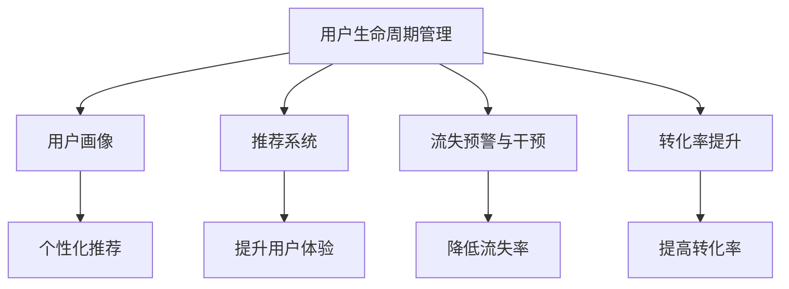

                 

# AI赋能的电商平台用户生命周期管理

> 关键词：
## 1. 背景介绍

### 1.1 问题由来

随着电商平台的发展，如何提高用户体验、增加用户粘性、提升用户转化率、降低流失率，成为了电商平台亟需解决的关键问题。传统的客户关系管理(CRM)系统往往依赖人工介入，效率低下，难以应对大规模用户的个性化需求。而人工智能技术的应用，为电商平台的客户生命周期管理带来了新的突破。

### 1.2 问题核心关键点

AI赋能的电商平台用户生命周期管理，是指通过人工智能技术对电商平台的用户数据进行分析和学习，实现对用户全生命周期的精准管理和智能决策。其主要目标包括：

1. **用户识别与分群**：通过用户行为数据分析，识别不同用户群体，从而提供个性化的服务与推荐。
2. **用户画像构建**：构建详尽的用户画像，了解用户的基本信息、行为偏好、消费习惯等，以便更准确地进行用户决策。
3. **推荐系统优化**：通过机器学习算法优化推荐算法，提升用户的购物体验和满意度。
4. **流失预警与干预**：构建预测模型，对可能流失的用户进行预警，并通过个性化策略进行干预，降低用户流失率。
5. **转化率提升**：利用用户行为数据，优化营销策略和促销活动，提升用户转化率。

本文聚焦于基于AI的电商平台用户生命周期管理，从核心概念、算法原理、具体操作步骤等方面进行全面阐述，以期为电商平台用户管理提供理论与实践的指导。

## 2. 核心概念与联系

### 2.1 核心概念概述

为了更好地理解AI赋能的电商平台用户生命周期管理，本节将介绍几个密切相关的核心概念：

- **用户生命周期管理(ULM)**：通过数据分析和AI技术，对用户的全生命周期进行管理和优化，从而提升用户体验和运营效率。
- **用户画像(User Persona)**：基于用户数据构建的详尽用户特征描述，帮助企业了解用户行为、兴趣、需求等信息，实现个性化服务。
- **推荐系统(Recommender System)**：通过算法分析用户行为数据，为用户提供个性化的商品推荐，提升用户满意度和购买转化率。
- **流失预警与干预(Loss Warning & Mitigation)**：构建预测模型，识别可能流失的用户，通过个性化策略进行干预，降低用户流失率。
- **转化率提升(Conversion Rate Optimization, CRO)**：利用AI分析用户行为数据，优化营销策略和促销活动，提升用户的购买转化率。

这些核心概念之间的逻辑关系可以通过以下Mermaid流程图来展示：



这个流程图展示了用户生命周期管理系统的核心组件及其相互关系：

1. 用户画像：从用户数据中提取特征，构建详尽的用户画像。
2. 推荐系统：基于用户画像，提供个性化的商品推荐，提升用户满意度。
3. 流失预警与干预：通过预测模型识别潜在流失用户，并通过个性化策略进行干预，降低流失率。
4. 转化率提升：利用AI分析用户行为数据，优化营销策略和促销活动，提升转化率。

## 3. 核心算法原理 & 具体操作步骤
### 3.1 算法原理概述

基于AI的电商平台用户生命周期管理，本质上是一个多任务学习和多模态数据融合的过程。其核心思想是：通过用户行为数据、交易数据、社交数据等多维度的信息，综合分析用户特征和需求，实现对用户全生命周期的精准管理与决策。

形式化地，假设用户数据为 $D=\{(x_i,y_i)\}_{i=1}^N, x_i \in X, y_i \in Y$，其中 $X$ 为输入特征空间，$Y$ 为任务标签空间。用户生命周期管理的优化目标是最小化损失函数 $\mathcal{L}(D,\theta)$，其中 $\theta$ 为模型参数。具体任务包括：

1. **用户识别与分群**：预测用户的不同行为特征，进行聚类和分类。
2. **用户画像构建**：通过机器学习算法，从用户数据中提取高维特征，构建详尽的用户画像。
3. **推荐系统优化**：基于用户画像，使用协同过滤、深度学习等方法，优化推荐算法。
4. **流失预警与干预**：构建预测模型，识别可能流失的用户，通过个性化策略进行干预。
5. **转化率提升**：通过用户行为数据分析，优化营销策略和促销活动，提升转化率。

### 3.2 算法步骤详解

基于AI的电商平台用户生命周期管理一般包括以下几个关键步骤：

**Step 1: 数据收集与预处理**
- 收集电商平台的用户行为数据、交易数据、社交数据等，划分为训练集、验证集和测试集。
- 对数据进行清洗、归一化、特征工程等预处理操作，以提升数据质量。

**Step 2: 特征工程与用户画像构建**
- 设计合适的特征工程流程，提取用户的关键行为特征，如浏览记录、购买历史、社交互动等。
- 使用机器学习算法，如PCA、LDA等，对用户特征进行降维处理，构建详尽的用户画像。

**Step 3: 推荐系统优化**
- 设计并训练推荐算法模型，如协同过滤、矩阵分解、深度学习等。
- 利用A/B测试等方法，评估推荐算法的效果，不断优化推荐策略。

**Step 4: 流失预警与干预**
- 设计流失预测模型，如逻辑回归、随机森林等，对可能流失的用户进行预测。
- 根据预测结果，设计个性化的干预策略，如个性化推荐、优惠券发放等，降低用户流失率。

**Step 5: 转化率提升**
- 分析用户行为数据，识别出影响用户转化的关键因素。
- 优化营销策略和促销活动，如个性化广告投放、限时折扣等，提升用户转化率。

**Step 6: 模型评估与部署**
- 在测试集上评估模型性能，如准确率、召回率、AUC等指标。
- 将优化后的模型部署到生产环境，持续监控模型效果，并根据用户反馈不断迭代优化。

以上是基于AI的电商平台用户生命周期管理的一般流程。在实际应用中，还需要针对具体任务进行优化设计，如改进特征工程流程，引入更多的正则化技术，搜索最优的超参数组合等，以进一步提升模型性能。

### 3.3 算法优缺点

基于AI的用户生命周期管理方法具有以下优点：

1. **个性化与精准化**：通过AI技术对用户数据进行分析，能够提供更加个性化的服务，满足不同用户的需求。
2. **高效性与自动化**：自动化程度高，可以大幅减少人工干预，提升运营效率。
3. **动态性与实时性**：能够实时更新用户画像和推荐模型，适应市场变化。
4. **可扩展性**：可以应用于多种电商平台，具有广泛的适用性。

同时，该方法也存在一定的局限性：

1. **数据依赖**：需要收集和分析大量的用户数据，数据质量直接影响模型效果。
2. **隐私问题**：用户数据的隐私保护是一个重要问题，需要采取合适的措施保障数据安全。
3. **模型复杂度**：AI模型的复杂度较高，需要高性能计算资源支持。
4. **解释性不足**：部分AI算法缺乏可解释性，难以对其决策过程进行分析和调试。

尽管存在这些局限性，但就目前而言，基于AI的用户生命周期管理方法仍是目前电商领域的主流范式。未来相关研究的重点在于如何进一步降低数据收集的难度，提高模型的解释性，保障用户隐私等方面。

### 3.4 算法应用领域

基于AI的用户生命周期管理方法在电商领域已经得到了广泛的应用，覆盖了几乎所有常见场景，例如：

- **个性化推荐**：基于用户行为数据，提供个性化的商品推荐，提升用户满意度。
- **用户流失预警**：预测用户流失倾向，及时进行干预，降低用户流失率。
- **精准营销**：分析用户行为数据，优化营销策略，提升转化率。
- **客户反馈分析**：分析用户评论和反馈，了解用户需求和满意度，提升服务质量。
- **库存管理**：利用用户行为预测，优化库存管理，减少缺货和积压现象。

除了上述这些经典应用外，基于AI的用户生命周期管理还被创新性地应用到更多场景中，如用户情感分析、广告投放优化、产品迭代优化等，为电商平台的用户管理带来了新的突破。

## 4. 数学模型和公式 & 详细讲解 & 举例说明

### 4.1 数学模型构建

为了更好地理解基于AI的电商平台用户生命周期管理，本节将使用数学语言对系统建模进行更加严格的刻画。

假设用户数据为 $D=\{(x_i,y_i)\}_{i=1}^N, x_i \in X, y_i \in Y$，其中 $X$ 为输入特征空间，$Y$ 为任务标签空间。

定义损失函数为：

$$
\mathcal{L}(D,\theta) = \frac{1}{N}\sum_{i=1}^N \ell(f_\theta(x_i),y_i)
$$

其中 $f_\theta(x_i)$ 为模型在输入 $x_i$ 下的预测输出，$\ell$ 为损失函数。

基于上述损失函数，用户生命周期管理的目标是最小化损失函数，即：

$$
\theta^* = \mathop{\arg\min}_{\theta} \mathcal{L}(D,\theta)
$$

在实践中，我们通常使用梯度下降等优化算法来近似求解上述最优化问题。设 $\eta$ 为学习率，$\lambda$ 为正则化系数，则参数的更新公式为：

$$
\theta \leftarrow \theta - \eta \nabla_{\theta}\mathcal{L}(D,\theta) - \eta\lambda\theta
$$

其中 $\nabla_{\theta}\mathcal{L}(D,\theta)$ 为损失函数对参数 $\theta$ 的梯度，可通过反向传播算法高效计算。

### 4.2 公式推导过程

以下我们以用户流失预测为例，推导逻辑回归模型的预测公式及其梯度的计算公式。

假设用户流失预测的标签 $y \in \{0,1\}$，模型使用逻辑回归函数：

$$
f_\theta(x_i) = \frac{1}{1+e^{-\theta^Tx_i}}
$$

其中 $\theta^Tx_i$ 为线性回归部分，$e^{-\theta^Tx_i}$ 为Sigmoid函数。

定义二分类交叉熵损失函数：

$$
\ell(f_\theta(x_i),y) = -y\log f_\theta(x_i) - (1-y)\log (1-f_\theta(x_i))
$$

将其代入经验风险公式，得：

$$
\mathcal{L}(D,\theta) = -\frac{1}{N}\sum_{i=1}^N [y_i\log f_\theta(x_i)+(1-y_i)\log(1-f_\theta(x_i))]
$$

根据链式法则，损失函数对参数 $\theta_k$ 的梯度为：

$$
\frac{\partial \mathcal{L}(D,\theta)}{\partial \theta_k} = -\frac{1}{N}\sum_{i=1}^N (\frac{y_i}{f_\theta(x_i)}-\frac{1-y_i}{1-f_\theta(x_i)}) \frac{\partial f_\theta(x_i)}{\partial \theta_k}
$$

其中 $\frac{\partial f_\theta(x_i)}{\partial \theta_k}$ 可进一步递归展开，利用自动微分技术完成计算。

在得到损失函数的梯度后，即可带入参数更新公式，完成模型的迭代优化。重复上述过程直至收敛，最终得到适应用户流失预测的最优模型参数 $\theta^*$。

### 4.3 案例分析与讲解

**案例一：用户流失预测**

假设有用户流失预测数据集 $D=\{(x_i,y_i)\}_{i=1}^N, x_i \in X, y_i \in \{0,1\}$，其中 $x_i$ 为输入特征向量，$y_i$ 为流失标签。

1. **数据准备**
   - 收集用户流失数据，划分训练集、验证集和测试集。
   - 对数据进行特征工程，如特征归一化、特征选择等。

2. **模型训练**
   - 设计并训练逻辑回归模型，以交叉熵损失为损失函数。
   - 使用梯度下降算法更新模型参数，最小化损失函数。

3. **模型评估**
   - 在验证集上评估模型性能，如准确率、召回率、AUC等指标。
   - 根据评估结果调整模型参数，如正则化强度、学习率等。

4. **预测与干预**
   - 在测试集上使用优化后的模型进行预测，识别出可能流失的用户。
   - 根据预测结果，设计个性化的干预策略，如个性化推荐、优惠券发放等，降低用户流失率。

## 5. 项目实践：代码实例和详细解释说明

### 5.1 开发环境搭建

在进行AI赋能的电商平台用户生命周期管理实践前，我们需要准备好开发环境。以下是使用Python进行TensorFlow开发的环境配置流程：

1. 安装Anaconda：从官网下载并安装Anaconda，用于创建独立的Python环境。

2. 创建并激活虚拟环境：
```bash
conda create -n tensorflow-env python=3.8 
conda activate tensorflow-env
```

3. 安装TensorFlow：根据CUDA版本，从官网获取对应的安装命令。例如：
```bash
conda install tensorflow -c tf -c conda-forge
```

4. 安装各类工具包：
```bash
pip install numpy pandas scikit-learn matplotlib tqdm jupyter notebook ipython
```

完成上述步骤后，即可在`tensorflow-env`环境中开始实践。

### 5.2 源代码详细实现

这里我们以用户流失预测任务为例，给出使用TensorFlow对逻辑回归模型进行训练的代码实现。

首先，定义数据处理函数：

```python
import tensorflow as tf
import numpy as np
from sklearn.model_selection import train_test_split
from sklearn.preprocessing import StandardScaler

def load_data():
    # 读取数据集
    X = np.load('user_data.npy')
    y = np.load('user_loss.npy')
    
    # 数据集划分
    X_train, X_test, y_train, y_test = train_test_split(X, y, test_size=0.2, random_state=42)
    
    # 特征归一化
    scaler = StandardScaler()
    X_train = scaler.fit_transform(X_train)
    X_test = scaler.transform(X_test)
    
    return X_train, X_test, y_train, y_test
```

然后，定义模型和优化器：

```python
def build_model():
    # 定义逻辑回归模型
    model = tf.keras.models.Sequential([
        tf.keras.layers.Dense(32, activation='relu', input_shape=(X_train.shape[1],)),
        tf.keras.layers.Dense(1, activation='sigmoid')
    ])
    
    # 定义损失函数和优化器
    loss = tf.keras.losses.BinaryCrossentropy()
    optimizer = tf.keras.optimizers.Adam(lr=0.001)
    
    return model, loss, optimizer

# 加载数据和构建模型
X_train, X_test, y_train, y_test = load_data()
model, loss, optimizer = build_model()
```

接着，定义训练和评估函数：

```python
def train_model(model, X_train, y_train, loss, optimizer, epochs=100):
    # 定义训练函数
    def train_step(X, y):
        with tf.GradientTape() as tape:
            y_pred = model(X)
            loss_value = loss(y, y_pred)
        grads = tape.gradient(loss_value, model.trainable_variables)
        optimizer.apply_gradients(zip(grads, model.trainable_variables))
    
    # 训练模型
    for epoch in range(epochs):
        train_step(X_train, y_train)
        
        # 评估模型
        y_pred = model.predict(X_test)
        loss_value = loss(y_test, y_pred)
        print(f'Epoch {epoch+1}, loss: {loss_value:.3f}')
    
    return model
```

最后，启动训练流程并在测试集上评估：

```python
# 训练模型
model = train_model(model, X_train, y_train, loss, optimizer)

# 评估模型
y_pred = model.predict(X_test)
loss_value = loss(y_test, y_pred)
print(f'Test loss: {loss_value:.3f}')
```

以上就是使用TensorFlow对逻辑回归模型进行用户流失预测的完整代码实现。可以看到，得益于TensorFlow的强大封装，我们可以用相对简洁的代码完成模型的构建和训练。

### 5.3 代码解读与分析

让我们再详细解读一下关键代码的实现细节：

**load_data函数**：
- 加载用户流失数据，并进行数据集划分和特征归一化。

**build_model函数**：
- 定义逻辑回归模型，包含一个隐层和输出层。
- 设置损失函数和优化器。

**train_model函数**：
- 定义训练函数，每次训练一个批次的样本，使用梯度下降更新模型参数。
- 在每个epoch结束时，计算并输出模型在测试集上的损失。

**训练流程**：
- 定义总的epoch数，开始循环迭代
- 每个epoch内，在训练集上训练模型，并在测试集上评估模型性能
- 所有epoch结束后，输出最终测试结果

可以看到，TensorFlow使得模型训练的代码实现变得简洁高效。开发者可以将更多精力放在数据处理、模型改进等高层逻辑上，而不必过多关注底层的实现细节。

当然，工业级的系统实现还需考虑更多因素，如模型的保存和部署、超参数的自动搜索、更灵活的任务适配层等。但核心的AI赋能用户生命周期管理方法基本与此类似。

## 6. 实际应用场景
### 6.1 智能客服系统

基于AI赋能的用户生命周期管理方法，可以广泛应用于智能客服系统的构建。传统客服往往需要配备大量人力，高峰期响应缓慢，且一致性和专业性难以保证。而使用AI赋能的智能客服系统，可以7x24小时不间断服务，快速响应客户咨询，用自然流畅的语言解答各类常见问题。

在技术实现上，可以收集企业内部的历史客服对话记录，将问题和最佳答复构建成监督数据，在此基础上对AI模型进行微调。微调后的AI模型能够自动理解用户意图，匹配最合适的答复模板进行回复。对于客户提出的新问题，还可以接入检索系统实时搜索相关内容，动态组织生成回答。如此构建的智能客服系统，能大幅提升客户咨询体验和问题解决效率。

### 6.2 金融舆情监测

金融机构需要实时监测市场舆论动向，以便及时应对负面信息传播，规避金融风险。传统的人工监测方式成本高、效率低，难以应对网络时代海量信息爆发的挑战。基于AI赋能的文本分类和情感分析技术，为金融舆情监测提供了新的解决方案。

具体而言，可以收集金融领域相关的新闻、报道、评论等文本数据，并对其进行主题标注和情感标注。在此基础上对AI模型进行微调，使其能够自动判断文本属于何种主题，情感倾向是正面、中性还是负面。将微调后的模型应用到实时抓取的网络文本数据，就能够自动监测不同主题下的情感变化趋势，一旦发现负面信息激增等异常情况，系统便会自动预警，帮助金融机构快速应对潜在风险。

### 6.3 个性化推荐系统

当前的推荐系统往往只依赖用户的历史行为数据进行物品推荐，无法深入理解用户的真实兴趣偏好。基于AI赋能的用户生命周期管理方法，可以更好地挖掘用户行为背后的语义信息，从而提供更精准、多样的推荐内容。

在实践中，可以收集用户浏览、点击、评论、分享等行为数据，提取和用户交互的物品标题、描述、标签等文本内容。将文本内容作为模型输入，用户的后续行为（如是否点击、购买等）作为监督信号，在此基础上对AI模型进行微调。微调后的模型能够从文本内容中准确把握用户的兴趣点。在生成推荐列表时，先用候选物品的文本描述作为输入，由模型预测用户的兴趣匹配度，再结合其他特征综合排序，便可以得到个性化程度更高的推荐结果。

### 6.4 未来应用展望

随着AI赋能的电商平台用户生命周期管理技术的不断发展，基于AI的推荐、预测、干预等系统在电商领域的应用前景将更加广阔。

在智慧医疗领域，基于AI的智能客服和健康管理服务，可以提升医疗服务的智能化水平，辅助医生诊疗，加速新药开发进程。

在智能教育领域，AI赋能的个性化推荐和智能辅导系统，因材施教，促进教育公平，提高教学质量。

在智慧城市治理中，AI赋能的智能交通、智慧安防等服务，提高城市管理的自动化和智能化水平，构建更安全、高效的未来城市。

此外，在企业生产、社会治理、文娱传媒等众多领域，AI赋能的用户生命周期管理技术也将不断涌现，为各行各业带来新的技术变革。相信随着技术的日益成熟，AI赋能的用户生命周期管理必将在更多领域得到应用，为各行各业带来深远的影响。

## 7. 工具和资源推荐
### 7.1 学习资源推荐

为了帮助开发者系统掌握AI赋能的电商平台用户生命周期管理的理论基础和实践技巧，这里推荐一些优质的学习资源：

1. **TensorFlow官方文档**：TensorFlow的官方文档，提供了丰富的教程和样例代码，适合入门和进阶学习。
2. **TensorFlow实战指南**：由Google工程师撰写的实战指南，结合案例讲解TensorFlow的使用技巧。
3. **深度学习入门与实践**：北京大学郑国辉教授的入门课程，系统介绍深度学习的基础知识和应用案例。
4. **推荐系统实战**：由《推荐系统实战》作者撰写的实战教程，涵盖推荐系统从理论到实践的完整流程。
5. **AI与电商新零售**：阿里巴巴集团的数据科学与技术研究院，涵盖AI在电商新零售领域的应用实例。

通过对这些资源的学习实践，相信你一定能够快速掌握AI赋能的用户生命周期管理的精髓，并用于解决实际的电商问题。
###  7.2 开发工具推荐

高效的开发离不开优秀的工具支持。以下是几款用于AI赋能的电商平台用户生命周期管理开发的常用工具：

1. **TensorFlow**：由Google主导开发的深度学习框架，生产部署方便，适合大规模工程应用。
2. **PyTorch**：基于Python的开源深度学习框架，灵活动态的计算图，适合快速迭代研究。
3. **HuggingFace Transformers库**：提供预训练模型和高效接口，方便开发者进行模型微调和推理。
4. **Scikit-learn**：基于Python的机器学习库，提供丰富的算法和工具。
5. **NLTK**：自然语言处理工具包，提供分词、词性标注等功能。
6. **Gensim**：文本处理和主题建模工具包，支持大规模语料处理。

合理利用这些工具，可以显著提升AI赋能的用户生命周期管理的开发效率，加快创新迭代的步伐。

### 7.3 相关论文推荐

AI赋能的电商平台用户生命周期管理技术的发展源于学界的持续研究。以下是几篇奠基性的相关论文，推荐阅读：

1. **用户画像构建与个性化推荐**：介绍用户画像的概念和构建方法，以及基于用户画像的个性化推荐算法。
2. **深度学习在推荐系统中的应用**：探讨深度学习在推荐系统中的应用，涵盖协同过滤、深度学习推荐等算法。
3. **智能客服系统设计与实现**：介绍智能客服系统的设计与实现流程，涵盖语音识别、自然语言处理等技术。
4. **情感分析与舆情监测**：探讨情感分析技术在金融舆情监测中的应用，涵盖文本分类、情感分析等算法。
5. **用户流失预测与干预策略**：介绍用户流失预测的算法和模型，以及基于预测结果的个性化干预策略。

这些论文代表了大规模用户生命周期管理技术的发展脉络。通过学习这些前沿成果，可以帮助研究者把握学科前进方向，激发更多的创新灵感。

## 8. 总结：未来发展趋势与挑战
### 8.1 总结

本文对基于AI的电商平台用户生命周期管理方法进行了全面系统的介绍。首先阐述了AI在电商平台用户生命周期管理中的重要作用，明确了方法的核心目标和实现路径。其次，从核心概念、算法原理、具体操作步骤等方面进行了详细讲解，给出了模型构建和优化方法。同时，本文还探讨了AI赋能的用户生命周期管理在多个实际应用场景中的应用，展示了其在电商、医疗、金融等多个领域带来的变革性影响。最后，本文精选了相关的学习资源和工具，力求为读者提供全方位的技术指引。

通过本文的系统梳理，可以看到，基于AI的电商平台用户生命周期管理方法正在成为电商平台客户管理的重要范式，极大地提升了用户体验和运营效率。未来，伴随AI技术的持续发展，用户生命周期管理方法也将不断优化，为电商平台的可持续发展提供强大的技术支撑。

### 8.2 未来发展趋势

展望未来，AI赋能的电商平台用户生命周期管理技术将呈现以下几个发展趋势：

1. **模型规模不断增大**：随着算力成本的下降和数据规模的扩张，预训练语言模型的参数量还将持续增长。超大规模语言模型蕴含的丰富知识，有望支撑更加复杂多变的用户生命周期管理需求。
2. **跨模态融合技术发展**：未来将更加重视多模态数据的融合，将图像、音频、视频等多模态信息与文本信息结合，提升用户理解能力和推荐效果。
3. **模型自适应能力提升**：未来的AI模型将具备更强的自适应能力，能够快速适应市场变化，动态更新用户画像和推荐策略。
4. **联邦学习与隐私保护**：为保护用户隐私，未来的AI模型将更加注重联邦学习和差分隐私等技术的应用，提升数据安全和隐私保护水平。
5. **实时性与高效性优化**：未来的AI模型将更加注重实时性和高效性，通过模型压缩、推理优化等技术，提升系统响应速度和资源利用率。

以上趋势凸显了AI赋能的用户生命周期管理技术的广阔前景。这些方向的探索发展，必将进一步提升电商平台的智能化水平，为用户的购物体验和运营效率带来新的突破。

### 8.3 面临的挑战

尽管AI赋能的用户生命周期管理技术已经取得了显著成果，但在迈向更加智能化、普适化应用的过程中，它仍面临着诸多挑战：

1. **数据质量与获取**：需要收集和处理大量的用户数据，数据质量直接影响模型的效果。如何获取高质量数据，并处理噪声和缺失数据，是未来需要解决的重要问题。
2. **模型鲁棒性与泛化能力**：AI模型面对未知数据时，泛化能力往往较弱。如何提升模型的鲁棒性和泛化能力，避免过拟合，是未来需要解决的重要问题。
3. **用户隐私保护**：用户数据的隐私保护是一个重要问题，如何在使用数据时保护用户隐私，是未来需要解决的重要问题。
4. **计算资源与成本**：大规模AI模型的训练和推理需要高性能计算资源，如何降低计算成本，是未来需要解决的重要问题。
5. **模型可解释性**：部分AI算法缺乏可解释性，难以对其决策过程进行分析和调试。如何提升模型的可解释性，是未来需要解决的重要问题。

尽管存在这些挑战，但就目前而言，AI赋能的用户生命周期管理技术仍是目前电商领域的主流范式。未来相关研究的重点在于如何进一步降低数据收集和处理的难度，提高模型的可解释性和鲁棒性，保障用户隐私等方面。

### 8.4 研究展望

面对AI赋能的用户生命周期管理技术所面临的种种挑战，未来的研究需要在以下几个方面寻求新的突破：

1. **数据增强与生成技术**：探索数据增强和生成技术，如GANs、VAEs等，提升数据质量和多样性，降低数据收集成本。
2. **跨模态融合与协同学习**：探索跨模态融合与协同学习技术，将多种模态信息结合，提升模型的理解和推荐能力。
3. **隐私保护与联邦学习**：探索隐私保护和联邦学习技术，提升数据安全和隐私保护水平。
4. **高效推理与实时化**：探索高效推理与实时化技术，通过模型压缩、推理优化等技术，提升系统响应速度和资源利用率。
5. **模型可解释性**：探索可解释性技术，如LIME、SHAP等，提升模型的可解释性和透明性，便于模型调试和优化。

这些研究方向的探索，必将引领AI赋能的用户生命周期管理技术迈向更高的台阶，为构建安全、可靠、可解释、可控的智能系统铺平道路。面向未来，AI赋能的用户生命周期管理技术还需要与其他人工智能技术进行更深入的融合，如知识表示、因果推理、强化学习等，多路径协同发力，共同推动用户生命周期管理系统的进步。只有勇于创新、敢于突破，才能不断拓展用户生命周期管理系统的边界，让智能技术更好地造福电商平台的用户。

## 9. 附录：常见问题与解答

**Q1：AI赋能的电商平台用户生命周期管理方法适用于所有电商平台吗？**

A: AI赋能的用户生命周期管理方法适用于大多数电商平台，特别是在数据量充足、用户行为丰富的场景下，能够取得较好的效果。但对于一些小型、垂直化的电商平台，由于用户行为数据不足，可能难以获得理想的推荐效果。

**Q2：如何进行高效的特征工程？**

A: 高效的特征工程是AI模型的重要前提，一般包括以下步骤：
1. 特征提取：从原始数据中提取有用的特征，如浏览记录、购买历史、社交互动等。
2. 特征选择：通过统计、模型等方法选择最相关的特征。
3. 特征归一化：对特征进行归一化处理，提高模型训练速度和效果。
4. 特征工程评估：使用模型评估指标，如准确率、召回率等，不断优化特征工程流程。

**Q3：如何设计个性化的推荐策略？**

A: 设计个性化的推荐策略，需要考虑以下几个方面：
1. 用户画像构建：基于用户历史数据，构建详尽的用户画像，了解用户的兴趣和偏好。
2. 推荐算法选择：选择适合的推荐算法，如协同过滤、矩阵分解、深度学习等。
3. 推荐模型优化：使用A/B测试等方法，不断优化推荐模型，提升推荐效果。
4. 个性化策略设计：根据用户画像和推荐模型结果，设计个性化的推荐策略，如多臂老虎机算法、上下文感知推荐等。

**Q4：AI赋能的用户生命周期管理方法在实际部署时需要注意哪些问题？**

A: AI赋能的用户生命周期管理方法在实际部署时需要注意以下几个问题：
1. 模型裁剪：去除不必要的层和参数，减小模型尺寸，加快推理速度。
2. 量化加速：将浮点模型转为定点模型，压缩存储空间，提高计算效率。
3. 服务化封装：将模型封装为标准化服务接口，便于集成调用。
4. 弹性伸缩：根据请求流量动态调整资源配置，平衡服务质量和成本。
5. 监控告警：实时采集系统指标，设置异常告警阈值，确保服务稳定性。
6. 安全防护：采用访问鉴权、数据脱敏等措施，保障数据和模型安全。

这些问题的解决，能够确保AI赋能的用户生命周期管理方法在实际应用中发挥其应有的价值。

---

作者：禅与计算机程序设计艺术 / Zen and the Art of Computer Programming

