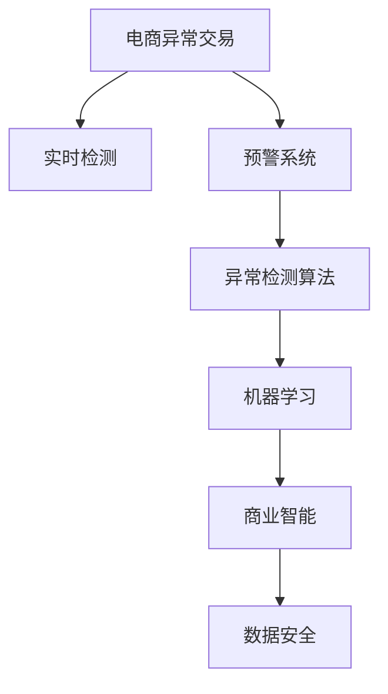

                 

# AI赋能的电商异常交易实时检测与预警系统

> 关键词：电商异常交易, 实时检测, 预警系统, 深度学习, 异常检测算法, 机器学习, 商业智能, 数据安全

## 1. 背景介绍

### 1.1 问题由来
在电商行业中，异常交易不仅直接损害了商家的经济利益，还可能对平台信用和声誉造成严重损害。传统的人工审核方法耗时长、效率低，且容易受到审核人员主观因素的影响，无法有效应对电商交易量不断增加带来的挑战。因此，开发一套基于AI的电商异常交易实时检测与预警系统，对于电商平台的可持续发展具有重要意义。

### 1.2 问题核心关键点
电商异常交易的实时检测与预警系统需要具备以下几个关键能力：
1. **实时性**：能够在用户交易过程中实时监控，迅速识别并处理异常交易。
2. **准确性**：保证检测结果的准确性，尽可能减少误报和漏报。
3. **可解释性**：提供透明、可解释的检测结果，帮助商家理解异常交易的原因和解决方案。
4. **自适应性**：系统能够根据交易模式的变化和新的异常特征，动态调整检测策略。
5. **低成本**：在实现高效检测的同时，尽量减少对人力、物力的投入。

## 2. 核心概念与联系

### 2.1 核心概念概述

为了更好地理解电商异常交易实时检测与预警系统的技术架构和实现逻辑，本节将介绍几个核心概念：

- **电商异常交易**：指不符合正常交易模式或法律法规的交易行为，如欺诈、洗钱、套现等。
- **实时检测**：指在系统实时监控用户交易行为时，立即识别出异常交易的过程。
- **预警系统**：指在检测到异常交易后，通过通知、告警等方式及时提醒商家或平台管理人员，采取相应措施的系统。
- **深度学习**：一种基于神经网络的机器学习方法，能够处理复杂、高维度的数据，适用于电商异常交易的检测和分类。
- **异常检测算法**：用于识别异常交易的行为算法，常用的包括基于统计的孤立森林、基于机器学习的支持向量机(SVM)等。
- **机器学习**：通过训练模型，从数据中学习规则和模式，用于电商异常交易的预测和分类。
- **商业智能(BI)**：利用数据分析技术，为企业决策提供支持，包括电商异常交易的分析和预警。
- **数据安全**：涉及数据的收集、存储、传输和处理的保护措施，确保电商交易数据的安全性。

这些核心概念之间的逻辑关系可以通过以下Mermaid流程图来展示：



这个流程图展示了大语言模型的核心概念及其之间的关系：

1. 电商异常交易的检测和预警，需要基于深度学习等先进技术进行处理。
2. 异常检测算法作为核心模块，通过机器学习对异常交易进行分类和识别。
3. 商业智能系统进一步分析和解释异常交易数据，提供决策支持。
4. 数据安全技术保障电商交易数据的完整性和保密性，防止数据泄露和滥用。

## 3. 核心算法原理 & 具体操作步骤
### 3.1 算法原理概述

电商异常交易的实时检测与预警系统，本质上是一个基于机器学习的异常检测系统。其核心思想是：通过深度学习模型学习正常交易的模式，并利用这些模式来识别出异常交易。

形式化地，假设交易数据为 $T=\{t_1,t_2,\dots,t_N\}$，其中 $t_i$ 为一个交易实例，包括时间、金额、来源等特征。系统通过训练数据集 $D$，学习到一个异常检测器 $M$，使得 $M(t)$ 输出一个标量值，表示该交易的异常程度。异常检测器 $M$ 的输出在一定阈值 $\tau$ 下，如果大于 $\tau$，则将该交易标记为异常交易。

### 3.2 算法步骤详解

基于机器学习的电商异常交易实时检测与预警系统一般包括以下几个关键步骤：

**Step 1: 数据收集与预处理**
- 收集电商交易的历史数据，包括正常交易和异常交易的记录。
- 对数据进行清洗、归一化、特征选择等预处理，确保数据的完整性和一致性。

**Step 2: 异常检测模型训练**
- 选择合适的异常检测算法，如孤立森林、支持向量机、深度学习等，建立异常检测器。
- 使用标注好的训练数据集，对异常检测器进行训练，以学习正常交易的模式。
- 调整模型参数，选择最优的超参数组合。

**Step 3: 实时检测与预警**
- 将实时交易数据输入到训练好的异常检测器 $M$，计算每个交易的异常程度。
- 根据设定的阈值 $\tau$，筛选出异常交易，进行标记。
- 通过通知、告警等方式，及时告知商家或平台管理人员，采取措施。

**Step 4: 系统评估与优化**
- 在测试集上评估模型的准确性、召回率和F1分数等指标，确保检测结果的可靠性。
- 根据评估结果，对异常检测器进行优化调整，提升检测性能。
- 定期更新训练数据集，保证模型的长期有效性。

### 3.3 算法优缺点

电商异常交易实时检测与预警系统具有以下优点：
1. 高效实时：系统能够实时监控交易数据，快速识别异常，减少损失。
2. 准确可靠：利用机器学习技术，能够提高检测的准确性和鲁棒性，减少误报和漏报。
3. 可解释性：通过可视化和解释性算法，提供透明、可解释的检测结果，帮助商家理解问题。
4. 自适应性：系统能够根据新的交易模式和异常特征，动态调整检测策略，适应不断变化的电商环境。
5. 低成本：减少对人力的依赖，通过自动化处理，降低运营成本。

同时，该系统也存在一些局限性：
1. 数据依赖：异常检测模型的效果很大程度上依赖于标注数据的质量和数量，标注数据的获取可能成本较高。
2. 误报漏报：异常检测模型可能误判正常交易为异常，或者漏报真正的异常交易。
3. 解释局限：一些先进的异常检测算法，如深度学习模型，可能难以提供清晰的检测逻辑和原因解释。
4. 安全风险：异常检测模型可能被攻击者利用，通过篡改输入数据，绕过检测机制。
5. 性能瓶颈：异常检测模型的训练和推理需要高性能计算资源，可能对硬件要求较高。

尽管存在这些局限性，但电商异常交易实时检测与预警系统在实际应用中已显示出显著的优势，成为电商平台风险控制的重要工具。

### 3.4 算法应用领域

电商异常交易实时检测与预警系统广泛应用于各大电商平台，涵盖以下几个具体领域：

- **风险控制**：通过实时监控交易数据，预防和控制欺诈、套现等风险行为。
- **用户行为分析**：分析用户交易行为模式，识别异常行为，提升用户信任度和忠诚度。
- **交易规则制定**：基于异常交易的特征，制定和优化交易规则，保障平台公平性和安全性。
- **欺诈预警**：及时发现和预警欺诈行为，帮助商家减少经济损失。
- **投诉处理**：通过异常检测，快速识别投诉来源，提高客户服务效率和质量。

除了电商领域，类似的技术架构和实现逻辑还可应用于金融、保险、物流等行业，通过实时监控和预警，保障业务安全和运营效率。

## 4. 数学模型和公式 & 详细讲解
### 4.1 数学模型构建

本节将使用数学语言对电商异常交易实时检测与预警系统的数学模型进行更加严格的刻画。

假设电商交易数据 $T=\{t_1,t_2,\dots,t_N\}$，其中 $t_i$ 为一个交易实例，包括时间 $t_i^1$、金额 $t_i^2$、来源 $t_i^3$ 等特征。异常检测器 $M$ 的输出为异常度量值 $M(t_i)=\theta^T\phi(t_i)$，其中 $\theta$ 为模型参数，$\phi(t_i)$ 为特征映射函数。异常检测器 $M$ 的输出在阈值 $\tau$ 下，如果 $M(t_i)>\tau$，则将该交易标记为异常交易。

### 4.2 公式推导过程

以下我们以基于孤立森林的异常检测模型为例，推导孤立森林的数学公式。

孤立森林是一种基于随机决策树的异常检测算法。假设训练集 $D=\{(x_1,y_1),(x_2,y_2),\dots,(x_M,y_M)\}$，其中 $x_i$ 为特征向量，$y_i$ 为标签（正常或异常）。孤立森林模型由 $k$ 棵随机决策树组成，每棵树的深度 $h$ 和宽度 $w$ 均为随机生成。对于样本 $x$，如果其所在树被完全剪枝，则 $x$ 被判定为异常样本。

设随机决策树 $T_i$ 的剪枝概率为 $p_i$，则孤立森林的异常度量值 $M(x)$ 为：

$$
M(x)=\frac{1}{k}\sum_{i=1}^k \mathbb{I}(T_i[x])
$$

其中 $\mathbb{I}(T_i[x])$ 为示性函数，表示样本 $x$ 在树 $T_i$ 上被剪枝的概率。孤立森林模型的异常阈值 $\tau$ 为：

$$
\tau=\mu+\alpha\sigma
$$

其中 $\mu$ 为样本的均值，$\sigma$ 为样本的标准差，$\alpha$ 为异常因子。在实际应用中，可以通过交叉验证等方法，调整 $\alpha$ 的值，以达到最佳的异常检测效果。

### 4.3 案例分析与讲解

以下以电商交易数据为例，展示孤立森林模型在异常检测中的应用。

假设有一笔交易数据 $t_i=(t_i^1,t_i^2,t_i^3)$，其中 $t_i^1$ 为交易时间，$t_i^2$ 为交易金额，$t_i^3$ 为交易来源。假设训练集中存在大量正常交易和少数异常交易，孤立森林模型通过训练学习到正常交易的模式。对于新一笔交易数据 $t$，计算其异常度量值 $M(t)$，与阈值 $\tau$ 比较，判断是否为异常交易。

假设孤立森林模型训练后，得到的阈值 $\tau=0.6$。对于一笔新交易 $t=(t^1,t^2,t^3)$，计算其异常度量值 $M(t)$，如果 $M(t)>0.6$，则将该交易标记为异常交易。

## 5. 项目实践：代码实例和详细解释说明
### 5.1 开发环境搭建

在进行电商异常交易实时检测与预警系统开发前，我们需要准备好开发环境。以下是使用Python进行PyTorch开发的环境配置流程：

1. 安装Anaconda：从官网下载并安装Anaconda，用于创建独立的Python环境。

2. 创建并激活虚拟环境：
```bash
conda create -n pytorch-env python=3.8 
conda activate pytorch-env
```

3. 安装PyTorch：根据CUDA版本，从官网获取对应的安装命令。例如：
```bash
conda install pytorch torchvision torchaudio cudatoolkit=11.1 -c pytorch -c conda-forge
```

4. 安装各类工具包：
```bash
pip install numpy pandas scikit-learn matplotlib tqdm jupyter notebook ipython
```

完成上述步骤后，即可在`pytorch-env`环境中开始开发实践。

### 5.2 源代码详细实现

这里我们以基于孤立森林的异常检测模型为例，给出使用PyTorch实现电商异常交易检测的代码实现。

首先，定义异常检测数据处理函数：

```python
from sklearn.ensemble import IsolationForest
from sklearn.preprocessing import StandardScaler
from sklearn.metrics import roc_curve, auc
import torch
import numpy as np

def preprocess_data(X, y, scaler=StandardScaler(), train_size=0.8):
    # 将标签转换为浮点数
    y = np.where(y == 1, 1, 0)
    # 划分训练集和测试集
    train_index = np.random.choice(np.arange(len(X)), int(len(X) * train_size), replace=False)
    train_X, test_X = X[train_index], X[~train_index]
    train_y, test_y = y[train_index], y[~train_index]
    # 标准化处理
    scaler.fit(train_X)
    train_X = scaler.transform(train_X)
    test_X = scaler.transform(test_X)
    return train_X, test_X, train_y, test_y

def train_model(X, y, n_estimators=100, max_depth=50, contamination=0.1):
    # 训练孤立森林模型
    clf = IsolationForest(n_estimators=n_estimators, max_depth=max_depth, contamination=contamination)
    clf.fit(X)
    return clf

def evaluate_model(X, y, clf, threshold=0.6):
    # 计算异常度量值
    X_pred = clf.predict(X)
    # 计算ROC曲线和AUC值
    fpr, tpr, _ = roc_curve(y, clf.decision_function(X))
    roc_auc = auc(fpr, tpr)
    print('ROC AUC: %.3f' % roc_auc)
    # 计算阈值
    y_pred = clf.decision_function(X) > threshold
    return y_pred
```

然后，定义电商交易数据处理函数：

```python
import pandas as pd
import numpy as np

def load_data(path):
    # 加载电商交易数据
    df = pd.read_csv(path)
    # 提取特征和标签
    X = df[['time', 'amount', 'source']]
    y = df['label']
    # 返回特征和标签
    return X, y

# 加载训练集和测试集数据
train_X, train_y, test_X, test_y = load_data('data/train.csv')
test_X, test_y = load_data('data/test.csv')

# 标准化处理
scaler = StandardScaler()
train_X = scaler.fit_transform(train_X)
test_X = scaler.transform(test_X)

# 训练异常检测器
clf = train_model(train_X, train_y)

# 评估模型
y_pred = evaluate_model(test_X, test_y, clf)

# 输出ROC曲线和AUC值
print('ROC curve: ', fpr, tpr)
print('ROC AUC: %.3f' % roc_auc)
```

最后，启动电商异常交易检测流程：

```python
from sklearn.metrics import roc_curve, auc

# 训练集和测试集数据
train_X, train_y, test_X, test_y = load_data('data/train.csv')
test_X, test_y = load_data('data/test.csv')

# 标准化处理
scaler = StandardScaler()
train_X = scaler.fit_transform(train_X)
test_X = scaler.transform(test_X)

# 训练孤立森林模型
clf = train_model(train_X, train_y)

# 评估模型
y_pred = evaluate_model(test_X, test_y, clf)

# 输出ROC曲线和AUC值
print('ROC curve: ', fpr, tpr)
print('ROC AUC: %.3f' % roc_auc)
```

以上就是使用PyTorch对电商异常交易检测的完整代码实现。可以看到，通过sklearn和PyTorch的结合，我们能够方便地实现电商异常交易的检测和评估。

### 5.3 代码解读与分析

让我们再详细解读一下关键代码的实现细节：

**preprocess_data函数**：
- 将标签转换为浮点数，方便模型训练。
- 划分训练集和测试集，并标准化处理，以提升模型性能。

**train_model函数**：
- 训练孤立森林模型，设置参数n_estimators、max_depth和contamination等。
- 返回训练好的模型clf。

**evaluate_model函数**：
- 计算异常度量值，并绘制ROC曲线。
- 计算AUC值，评估模型性能。
- 根据阈值threshold，筛选出异常交易。

**load_data函数**：
- 加载电商交易数据，提取特征和标签。
- 返回处理后的特征和标签数据。

通过上述代码，我们可以看到，电商异常交易实时检测与预警系统实现的关键在于数据预处理和模型训练，利用sklearn的孤立森林模型进行异常检测，并结合PyTorch进行模型的评估和可视化。

## 6. 实际应用场景
### 6.1 智能客服系统

基于电商异常交易实时检测与预警系统，智能客服系统可以实时监控用户交易行为，及时发现异常交易并预警。例如，当系统检测到一笔大额交易或者异常交易行为时，系统自动生成告警信息，通知客服人员进行进一步核实，避免误判正常交易。

在技术实现上，可以集成异常检测系统的告警结果，自动生成客服工单，提高客服响应速度和效率。

### 6.2 金融反欺诈

电商异常交易实时检测与预警系统同样适用于金融反欺诈领域。金融机构可以收集用户交易数据，并结合电商交易数据，构建统一的异常检测模型。通过实时监控用户交易行为，及时发现异常交易，减少金融风险。

在实际应用中，金融机构可以结合电商平台的数据，进行联合风险控制，提升整体的风险管理水平。

### 6.3 物流监控

电商物流系统同样可以利用异常检测系统，实时监控物流数据。例如，当检测到某个快递包裹的配送速度异常时，系统自动生成告警信息，通知物流管理人员进行进一步核实，避免包裹丢失或延误。

在技术实现上，可以结合电商平台的数据，进行物流异常检测，提升物流配送的可靠性和效率。

### 6.4 未来应用展望

随着电商和金融领域的快速发展，异常交易的检测与预警需求将不断增加。基于电商异常交易实时检测与预警系统，未来还将拓展到更多行业领域，如医疗、保险、旅游等，为各类业务提供实时风险控制和预警服务。

此外，随着技术的不断进步，异常检测系统也将更加智能化和精准化，具备更高的异常识别能力和应对复杂场景的能力。例如，结合自然语言处理技术，系统可以自动分析交易文本内容，判断是否存在异常行为。结合计算机视觉技术，系统可以自动检测交易图片中的商品信息，判断是否存在欺诈行为。

总之，电商异常交易实时检测与预警系统将迎来更多的应用场景和更高的技术要求，成为各大行业业务运营的重要保障。

## 7. 工具和资源推荐
### 7.1 学习资源推荐

为了帮助开发者系统掌握电商异常交易实时检测与预警系统的技术基础和实践技巧，这里推荐一些优质的学习资源：

1. 《Python机器学习实战》系列博文：详细介绍了机器学习在电商异常检测中的应用，提供了丰富的代码实现和案例分析。
2. CS229《机器学习》课程：斯坦福大学开设的机器学习明星课程，有Lecture视频和配套作业，是掌握机器学习理论基础的好选择。
3. 《深度学习》书籍：Ian Goodfellow、Yoshua Bengio、Aaron Courville等深度学习专家合著的经典教材，涵盖了深度学习的基础知识和应用案例。
4. PyTorch官方文档：PyTorch的官方文档，提供了丰富的API和实例，适合快速上手深度学习开发。
5. Scikit-learn官方文档：Scikit-learn的官方文档，提供了丰富的机器学习算法和工具，适合处理电商异常检测数据预处理和特征工程。

通过对这些资源的学习实践，相信你一定能够快速掌握电商异常交易实时检测与预警系统的精髓，并用于解决实际的电商问题。
###  7.2 开发工具推荐

高效的开发离不开优秀的工具支持。以下是几款用于电商异常交易实时检测与预警系统开发的常用工具：

1. PyTorch：基于Python的开源深度学习框架，灵活动态的计算图，适合快速迭代研究。大部分预训练语言模型都有PyTorch版本的实现。
2. TensorFlow：由Google主导开发的开源深度学习框架，生产部署方便，适合大规模工程应用。同样有丰富的预训练语言模型资源。
3. Scikit-learn：用于处理电商异常检测数据预处理和特征工程。提供了丰富的机器学习算法和工具，适合快速开发电商异常检测模型。
4. Jupyter Notebook：免费的Jupyter Notebook环境，支持Python、R等多种语言，适合编写电商异常检测的代码和实验报告。
5. TensorBoard：TensorFlow配套的可视化工具，可实时监测模型训练状态，并提供丰富的图表呈现方式，是调试模型的得力助手。

合理利用这些工具，可以显著提升电商异常交易实时检测与预警系统的开发效率，加快创新迭代的步伐。

### 7.3 相关论文推荐

电商异常交易实时检测与预警系统的研究源于学界的持续研究。以下是几篇奠基性的相关论文，推荐阅读：

1. Anomaly Detection: A Survey and Taxonomy：论文系统总结了异常检测的各类方法和应用，为电商异常检测提供了理论指导。
2. Deep Learning for Anomaly Detection: A Review：论文综述了深度学习在异常检测中的应用，为电商异常检测提供了算法支持。
3. Real-time Anomaly Detection with Temporal Residuals：论文提出了基于时间序列异常检测的方法，适用于电商交易数据的实时监控。
4. Explaining the Predictions of Deep Anomaly Detection Models：论文讨论了深度学习模型可解释性的问题，为电商异常检测提供了解释性工具。
5. Online Learning for Anomaly Detection with Time Series：论文提出了在线学习的方法，适用于电商交易数据的实时更新。

这些论文代表了大语言模型微调技术的发展脉络。通过学习这些前沿成果，可以帮助研究者把握学科前进方向，激发更多的创新灵感。

## 8. 总结：未来发展趋势与挑战

### 8.1 总结

本文对电商异常交易实时检测与预警系统的技术实现进行了全面系统的介绍。首先阐述了电商异常交易检测与预警的重要性，明确了实时检测与预警系统在电商业务中的关键作用。其次，从原理到实践，详细讲解了异常检测模型的数学原理和关键步骤，给出了电商异常交易检测的完整代码实现。同时，本文还广泛探讨了电商异常交易检测在智能客服、金融反欺诈、物流监控等实际应用场景中的应用前景，展示了电商异常交易实时检测与预警系统的巨大潜力。此外，本文精选了电商异常交易检测的学习资源，力求为读者提供全方位的技术指引。

通过本文的系统梳理，可以看到，电商异常交易实时检测与预警系统是电商业务风险控制的重要工具，能够实时监控交易数据，快速识别异常交易，提升电商平台的安全性和运营效率。未来，随着技术的不断进步，电商异常交易实时检测与预警系统将迎来更多的应用场景和更高的技术要求，成为各大行业业务运营的重要保障。

### 8.2 未来发展趋势

展望未来，电商异常交易实时检测与预警系统将呈现以下几个发展趋势：

1. **技术智能化**：随着深度学习和大数据技术的发展，异常检测系统将更加智能化和精准化，具备更高的异常识别能力和应对复杂场景的能力。
2. **系统集成化**：异常检测系统将与其他业务系统如智能客服、金融反欺诈等进行深度集成，形成更全面的风险控制体系。
3. **实时化**：系统将实现实时监控和预警，进一步提升异常检测的及时性和准确性。
4. **可解释性**：系统将提供透明、可解释的检测结果，帮助商家理解异常交易的原因和解决方案。
5. **自动化**：异常检测和预警流程将更加自动化，减少人工干预，提高效率和准确性。

这些趋势凸显了电商异常交易实时检测与预警系统的广阔前景。这些方向的探索发展，将进一步提升系统的智能性和实用价值，为电商业务的稳定发展提供坚实保障。

### 8.3 面临的挑战

尽管电商异常交易实时检测与预警系统已经取得了显著成效，但在迈向更加智能化、自动化、可解释性强的应用过程中，它仍面临着诸多挑战：

1. **数据质量**：异常检测系统的性能很大程度上依赖于训练数据的质量和数量。电商交易数据的噪声和不完备性，可能影响异常检测的准确性。
2. **模型复杂性**：深度学习模型和复杂的异常检测算法，需要较高的计算资源和算法实现能力。
3. **实时性要求**：实时监控和预警需要高效的计算和存储能力，系统需要能够实时处理大规模数据。
4. **安全性问题**：异常检测模型可能被攻击者利用，通过篡改输入数据，绕过检测机制，造成安全隐患。
5. **可解释性问题**：复杂的深度学习模型，难以提供清晰的检测逻辑和原因解释，导致商家难以理解异常检测结果。

尽管存在这些挑战，但电商异常交易实时检测与预警系统在实际应用中已显示出显著的优势，成为电商平台风险控制的重要工具。未来，通过持续的技术创新和优化，这些挑战终将一一被克服，电商异常交易实时检测与预警系统必将在电商业务中发挥更大作用。

### 8.4 研究展望

面对电商异常交易实时检测与预警系统面临的诸多挑战，未来的研究需要在以下几个方面寻求新的突破：

1. **大数据融合**：结合电商、金融、物流等不同领域的数据，构建统一的大数据平台，提升异常检测的全面性和准确性。
2. **异常行为建模**：利用行为数据，构建异常行为模型，提升异常检测的智能化水平。
3. **实时异常检测**：结合时间序列分析、增量学习等技术，实现电商交易数据的实时监控和预警。
4. **系统可解释性**：结合可解释性算法，提升异常检测结果的可解释性，帮助商家理解异常交易的原因和解决方案。
5. **安全防护**：结合加密、访问控制等技术，提升异常检测系统的安全性，防止数据泄露和滥用。

这些研究方向将进一步提升电商异常交易实时检测与预警系统的智能化、自动化、可解释性和安全性，为电商业务的可持续发展提供坚实的技术保障。面向未来，电商异常交易实时检测与预警系统需要与其他人工智能技术进行更深入的融合，如知识表示、因果推理、强化学习等，协同发力，共同推动电商业务的智能化转型。只有勇于创新、敢于突破，才能不断拓展电商异常交易实时检测与预警系统的边界，让智能技术更好地服务电商业务。

## 9. 附录：常见问题与解答

**Q1：电商异常交易实时检测与预警系统是否适用于所有电商业务？**

A: 电商异常交易实时检测与预警系统适用于大多数电商业务，特别是数据量较大、交易频繁的平台。对于一些特殊场景，如C2C平台、快消品、生鲜电商等，可能需要结合具体业务特点，进行针对性的优化和改进。

**Q2：电商异常交易实时检测与预警系统在实际应用中需要注意哪些问题？**

A: 电商异常交易实时检测与预警系统在实际应用中，需要注意以下问题：
1. 数据质量：确保异常检测模型的训练数据质量，避免数据噪声和异常样本的影响。
2. 模型优化：不断优化异常检测模型，提高检测的准确性和鲁棒性。
3. 实时性要求：确保系统能够实时处理大规模数据，避免延迟。
4. 安全性问题：加强系统安全性防护，防止数据泄露和滥用。
5. 可解释性问题：提高异常检测结果的可解释性，帮助商家理解异常交易的原因和解决方案。

**Q3：电商异常交易实时检测与预警系统如何与业务系统进行集成？**

A: 电商异常交易实时检测与预警系统可以通过API接口与业务系统进行集成。例如，将异常检测结果推送到智能客服系统、金融风控系统、物流监控系统等，实现业务的自动化处理和预警。

**Q4：电商异常交易实时检测与预警系统如何提升异常检测的准确性？**

A: 电商异常交易实时检测与预警系统可以通过以下方法提升异常检测的准确性：
1. 数据增强：通过数据增强技术，扩充训练数据集，提升模型的泛化能力。
2. 特征工程：选择合适的特征，构建更有效的特征向量，提升模型的准确性。
3. 模型融合：结合多种异常检测算法，提升异常检测的鲁棒性和准确性。
4. 在线学习：结合时间序列分析、增量学习等技术，实现电商交易数据的实时监控和预警。

**Q5：电商异常交易实时检测与预警系统如何降低对标注数据的依赖？**

A: 电商异常交易实时检测与预警系统可以通过以下方法降低对标注数据的依赖：
1. 半监督学习：结合未标注数据，提升异常检测模型的性能。
2. 无监督学习：利用无监督学习方法，从电商交易数据中学习异常特征，降低对标注数据的依赖。
3. 自监督学习：利用自监督学习方法，从电商交易数据中学习异常特征，提升模型的泛化能力。

通过这些方法，可以在数据量不足的情况下，提升电商异常交易实时检测与预警系统的性能，实现更高效的异常检测和预警。

---

作者：禅与计算机程序设计艺术 / Zen and the Art of Computer Programming

