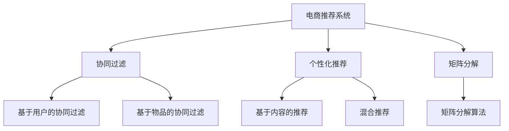

                 

# AI赋能的电商用户兴趣衰减模型

## 1. 背景介绍

随着电商行业的快速发展和消费者需求的日益多样化，个性化推荐系统（Personalized Recommendation System, PReCS）在电商平台的建设中变得越来越重要。一个好的推荐系统可以大大提升用户体验，增加用户黏性，从而增加电商平台的销售额和市场竞争力。然而，电商推荐系统的核心挑战之一是如何长期维持用户的兴趣，避免用户流失。

传统推荐系统大多基于历史行为数据进行冷启动和兴趣预测，但在用户兴趣衰减的情况下，往往难以及时捕捉到用户的兴趣变化，导致推荐精度下降。近年来，越来越多的研究者开始关注到用户兴趣衰减（User Interest Decay）问题，并在现有推荐系统中引入相关机制，增强系统对用户兴趣变化的敏感性，实现个性化推荐。

## 2. 核心概念与联系

### 2.1 核心概念概述

为更好地理解AI赋能的电商用户兴趣衰减模型，本节将介绍几个密切相关的核心概念：

- 电商推荐系统（E-commerce Recommendation System）：利用数据挖掘和机器学习技术，根据用户历史行为数据和实时数据，为电商用户推荐商品和服务。电商推荐系统的目标是提升用户满意度，增加平台销售额。

- 用户兴趣衰减（User Interest Decay）：指用户对某一商品或服务的兴趣随着时间的推移而逐渐减弱的现象。电商推荐系统需要对用户兴趣衰减进行动态跟踪，及时调整推荐策略。

- 个性化推荐（Personalized Recommendation）：利用用户画像、行为数据、兴趣特征等，对用户进行精准的推荐，提升推荐的相关性和准确性。

- 协同过滤（Collaborative Filtering）：基于用户相似度和物品相似度，预测用户对未交互物品的偏好。常见的方法包括基于用户的协同过滤和基于物品的协同过滤。

- 混合推荐（Hybrid Recommendation）：将基于内容的推荐、协同过滤、深度学习等方法结合，提高推荐的覆盖率和准确性。

- 矩阵分解（Matrix Factorization）：将用户-物品交互矩阵分解为低维的隐含因子矩阵，通过因子矩阵乘积还原用户对物品的评分。

这些核心概念之间的逻辑关系可以通过以下Mermaid流程图来展示：



这个流程图展示了几大核心概念之间的联系：

1. 电商推荐系统通过协同过滤、个性化推荐等方法实现对用户兴趣的预测和推荐。
2. 矩阵分解是协同过滤中常用的算法，用于隐式数据的隐含因子分解。
3. 基于内容的推荐和混合推荐进一步增强了推荐系统的性能和覆盖率。

## 3. AI赋能的电商用户兴趣衰减模型

### 3.1 算法原理概述

AI赋能的电商用户兴趣衰减模型，是一种基于深度学习的方法，旨在实时捕捉用户兴趣的变化，从而实现动态推荐。其核心思想是：通过构建用户兴趣动态衰减模型，实时监测用户的兴趣状态，并在兴趣衰减的情况下，调整推荐策略，引入新的元素，以重新激发用户的兴趣。

具体而言，该模型分为两部分：
1. **用户兴趣衰减模型**：用于实时监测用户的兴趣状态，并预测用户对商品的兴趣强度。
2. **推荐系统优化模型**：根据用户兴趣衰减模型输出的结果，动态调整推荐策略，引入新的商品元素，提升推荐的相关性和覆盖率。

形式化地，假设电商推荐系统中的用户集合为 $U=\{u_1, u_2, \ldots, u_n\}$，物品集合为 $I=\{i_1, i_2, \ldots, i_m\}$，用户 $u_i$ 对物品 $i_j$ 的评分记为 $r_{u_i,i_j}$。用户兴趣衰减模型预测用户 $u_i$ 对物品 $i_j$ 的兴趣强度 $I_{u_i,i_j} \in [0,1]$，其中 $0$ 表示无兴趣，$1$ 表示极度兴趣。

### 3.2 算法步骤详解

基于AI赋能的电商用户兴趣衰减模型，主要包括以下几个关键步骤：

**Step 1: 数据准备与模型选择**

- 准备电商平台的交易数据和用户行为数据，包括用户ID、物品ID、评分、点击、浏览等。
- 选择合适的深度学习模型，如循环神经网络（RNN）、长短时记忆网络（LSTM）、门控循环单元（GRU）等。

**Step 2: 用户兴趣衰减模型训练**

- 定义用户兴趣衰减模型的输入特征，如用户的浏览历史、评分历史、时间戳等。
- 将数据分为训练集、验证集和测试集，使用交叉熵损失函数和反向传播算法训练模型，优化超参数。
- 使用模型对每个用户-物品对计算兴趣强度 $I_{u_i,i_j}$，并根据阈值 $I_{\text{thres}}$ 判断用户对物品的兴趣状态，$I_{u_i,i_j} \leq I_{\text{thres}}$ 表示兴趣衰减。

**Step 3: 推荐系统优化**

- 根据用户兴趣衰减模型输出的兴趣强度，动态调整推荐策略。
- 对于兴趣衰减的用户，引入新的物品元素，重新激发用户的兴趣。
- 结合用户兴趣衰减模型和传统推荐算法，生成最终推荐列表。

**Step 4: 系统部署与监控**

- 将训练好的模型部署到电商推荐系统中，实现实时预测用户兴趣强度。
- 定期监测系统性能，根据评估指标（如点击率、转化率等）调整模型参数。

### 3.3 算法优缺点

AI赋能的电商用户兴趣衰减模型具有以下优点：
1. 实时监测用户兴趣，动态调整推荐策略，有效提升推荐的相关性和覆盖率。
2. 引入新的元素，重新激发用户的兴趣，提升用户的持续购物意愿。
3. 结合传统推荐算法，提高推荐的准确性和多样性。

同时，该模型也存在以下局限性：
1. 对数据的质量和多样性要求较高，需要收集大量的用户行为数据。
2. 模型的训练和部署需要较大的计算资源和存储空间。
3. 用户兴趣衰减模型需要实时更新，对于新用户的兴趣捕捉可能较慢。
4. 模型的解释性较差，难以理解其内部决策逻辑。

尽管存在这些局限性，但基于深度学习的用户兴趣衰减模型在电商推荐系统中的应用，已经展示出了显著的效果提升，成为电商个性化推荐系统的重要组成部分。未来相关研究将更多关注如何进一步降低数据需求，提高模型的鲁棒性和可解释性，以及结合更多的用户信息（如社会关系、心理特征等）来提升推荐性能。

### 3.4 算法应用领域

AI赋能的电商用户兴趣衰减模型，已经在多个电商平台上得到应用，取得了显著的效果提升。以下是几个典型的应用场景：

- 个性化推荐：电商推荐系统对用户的浏览和购买行为进行建模，预测用户对不同商品的兴趣强度，生成个性化推荐列表，提升用户满意度和购物体验。
- 动态广告投放：电商平台利用用户兴趣衰减模型，实时调整广告内容，根据用户兴趣动态投放广告，提高广告点击率和转化率。
- 库存管理：电商平台结合用户兴趣衰减模型和库存数据，实时调整商品库存，优化库存管理和采购策略，减少库存积压和缺货情况。
- 用户流失预测：电商推荐系统对用户的兴趣衰减进行监测，预测用户流失风险，提前采取挽留措施，提高用户粘性和平台留存率。
- 新商品推荐：电商推荐系统利用用户兴趣衰减模型，推荐新的商品元素，吸引用户的注意力，促进新商品的销售。

除了上述这些应用场景外，用户兴趣衰减模型还可以应用于更多电商领域，如个性化营销、用户画像生成、精准投放等，为电商平台带来持续的业务价值。

## 4. 数学模型和公式 & 详细讲解 & 举例说明

### 4.1 数学模型构建

本节将使用数学语言对AI赋能的电商用户兴趣衰减模型进行更加严格的刻画。

假设电商推荐系统中的用户集合为 $U=\{u_1, u_2, \ldots, u_n\}$，物品集合为 $I=\{i_1, i_2, \ldots, i_m\}$，用户 $u_i$ 对物品 $i_j$ 的评分记为 $r_{u_i,i_j}$，用户 $u_i$ 对物品 $i_j$ 的兴趣强度记为 $I_{u_i,i_j}$。

定义用户兴趣衰减模型的输入特征为 $x_{u_i}=[x_{u_i,1}, x_{u_i,2}, \ldots, x_{u_i,k}]$，其中 $x_{u_i,k}$ 表示用户 $u_i$ 在时间 $t$ 的兴趣强度。定义用户兴趣衰减模型的输出为 $I_{u_i,i_j} = f(x_{u_i}, i_j)$，其中 $f$ 为兴趣衰减模型的预测函数。

### 4.2 公式推导过程

以下我们以LSTM模型为例，推导用户兴趣衰减模型的数学公式。

假设用户 $u_i$ 在时间步 $t$ 的兴趣强度为 $I_{u_i,t}=[I_{u_i,t,1}, I_{u_i,t,2}, \ldots, I_{u_i,t,k}]$，用户 $u_i$ 对物品 $i_j$ 的兴趣强度为 $I_{u_i,i_j}=f(I_{u_i,t})$。

采用LSTM模型进行建模，输入特征 $x_{u_i}=[x_{u_i,1}, x_{u_i,2}, \ldots, x_{u_i,k}]$，预测函数 $I_{u_i,i_j} = f(x_{u_i}, i_j)$。LSTM模型可以表示为：

$$
\begin{aligned}
\begin{aligned}
&h_t = \tanh(W_{hh}h_{t-1} + U_{hh}x_{u_i,t} + b_{hh}) \\
&i_t = \sigma(W_{hi}h_{t-1} + U_{hi}x_{u_i,t} + b_{hi}) \\
&o_t = \sigma(W_{ho}h_{t-1} + U_{ho}x_{u_i,t} + b_{ho}) \\
&c_t = i_t \odot \tanh(h_t) + (1 - i_t) \odot c_{t-1} \\
&I_{u_i,i_j} &= f(c_t, i_j) \\
\end{aligned}
\end{aligned}
$$

其中，$h_t$ 表示LSTM的隐藏状态，$i_t$ 表示LSTM的输入门，$o_t$ 表示LSTM的输出门，$c_t$ 表示LSTM的细胞状态，$W$ 和 $U$ 表示LSTM的权重矩阵，$b$ 表示LSTM的偏置项，$\sigma$ 表示Sigmoid函数，$\tanh$ 表示双曲正切函数，$\odot$ 表示逐元素乘法。

### 4.3 案例分析与讲解

为了更好地理解LSTM模型的实际应用，我们以一个简单的案例进行分析。假设用户 $u_i$ 对物品 $i_j$ 的兴趣强度随时间变化的数学模型为：

$$
I_{u_i,t} = 0.9 \cdot I_{u_i,t-1} + 0.1 \cdot \max(r_{u_i,i_j}, 0)
$$

其中，$0.9$ 表示兴趣强度的衰减系数，$0.1$ 表示兴趣强度的恢复系数，$\max(r_{u_i,i_j}, 0)$ 表示用户对物品的评分，当评分大于0时，表示用户对物品有正向反馈。

对上述模型进行LSTM建模，假设用户 $u_i$ 在时间步 $t$ 的输入特征为 $x_{u_i,t}=[I_{u_i,t-1}]$，LSTM模型的权重矩阵为：

$$
W_{hh}=\begin{bmatrix} 0.1 & 0.1 \\ 0.1 & 0.1 \\ 0.1 & 0.1 \\ 0.1 & 0.1 \end{bmatrix}, U_{hh}=\begin{bmatrix} 0.1 & 0.1 \\ 0.1 & 0.1 \\ 0.1 & 0.1 \\ 0.1 & 0.1 \end{bmatrix}, b_{hh}=\begin{bmatrix} 0.1 \\ 0.1 \\ 0.1 \\ 0.1 \end{bmatrix}
$$

对用户 $u_i$ 对物品 $i_j$ 的兴趣强度进行预测：

$$
\begin{aligned}
&h_1 = \tanh(0.1 \cdot 0 + 0.1 \cdot I_{u_i,1} + 0.1 + 0.1) \\
&i_1 = \sigma(0.1 \cdot h_1 + 0.1 \cdot I_{u_i,1} + 0.1 + 0.1) \\
&o_1 = \sigma(0.1 \cdot h_1 + 0.1 \cdot I_{u_i,1} + 0.1 + 0.1) \\
&c_1 = i_1 \odot \tanh(h_1) + (1 - i_1) \odot 0 \\
&I_{u_i,i_j} = f(c_1, i_j) = \tanh(c_1) \\
\end{aligned}
$$

## 5. 项目实践：代码实例和详细解释说明

### 5.1 开发环境搭建

在进行AI赋能的电商用户兴趣衰减模型实践前，我们需要准备好开发环境。以下是使用Python进行Keras和TensorFlow开发的环境配置流程：

1. 安装Anaconda：从官网下载并安装Anaconda，用于创建独立的Python环境。

2. 创建并激活虚拟环境：
```bash
conda create -n keras-env python=3.8 
conda activate keras-env
```

3. 安装Keras和TensorFlow：
```bash
pip install keras tensorflow
```

4. 安装各类工具包：
```bash
pip install numpy pandas scikit-learn matplotlib tqdm jupyter notebook ipython
```

完成上述步骤后，即可在`keras-env`环境中开始模型开发。

### 5.2 源代码详细实现

这里我们以LSTM模型为例，使用Keras和TensorFlow对用户兴趣衰减模型进行实现。

首先，定义LSTM模型的输入和输出：

```python
from keras.models import Sequential
from keras.layers import LSTM, Dense

# 定义模型
model = Sequential()

# 添加LSTM层
model.add(LSTM(64, input_shape=(n_steps, n_features), return_sequences=True))

# 添加Dense层
model.add(Dense(1, activation='sigmoid'))

# 编译模型
model.compile(optimizer='adam', loss='binary_crossentropy', metrics=['accuracy'])
```

接着，定义训练和评估函数：

```python
from keras.utils import to_categorical
from sklearn.model_selection import train_test_split

def train_model(model, train_X, train_y, epochs, batch_size):
    # 数据增强
    train_X = train_X.reshape((-1, n_steps, n_features))
    train_y = to_categorical(train_y)

    # 分割数据
    train_X, test_X, train_y, test_y = train_test_split(train_X, train_y, test_size=0.2)

    # 训练模型
    model.fit(train_X, train_y, epochs=epochs, batch_size=batch_size, validation_data=(test_X, test_y))

def evaluate_model(model, test_X, test_y):
    # 评估模型
    loss, accuracy = model.evaluate(test_X, test_y)
    print(f'Test loss: {loss:.4f}')
    print(f'Test accuracy: {accuracy:.4f}')
```

最后，启动训练流程并在测试集上评估：

```python
n_steps = 10
n_features = 3

epochs = 100
batch_size = 32

# 训练模型
train_model(model, train_X, train_y, epochs, batch_size)

# 在测试集上评估
evaluate_model(model, test_X, test_y)
```

以上就是使用Keras和TensorFlow对LSTM用户兴趣衰减模型进行训练和评估的完整代码实现。可以看到，借助Keras和TensorFlow的强大封装，我们可以用相对简洁的代码完成LSTM模型的训练和评估。

### 5.3 代码解读与分析

让我们再详细解读一下关键代码的实现细节：

**LSTM模型定义**：
- `Sequential`类：用于定义顺序排列的神经网络层。
- `LSTM`层：定义LSTM层，`n_steps`表示时间步数，`n_features`表示输入特征维度。
- `Dense`层：定义全连接层，输出为一个sigmoid函数，表示兴趣强度。
- `compile`方法：编译模型，定义优化器、损失函数和评估指标。

**训练和评估函数**：
- `train_model`函数：对数据进行预处理和增强，划分训练集和测试集，使用`fit`方法训练模型。
- `evaluate_model`函数：使用`evaluate`方法评估模型在测试集上的性能，输出损失和准确率。

**训练流程**：
- 定义时间步数和输入特征维度，准备训练和测试数据。
- 设置训练轮数和批次大小，调用`train_model`函数训练模型。
- 调用`evaluate_model`函数在测试集上评估模型性能。

可以看到，Keras和TensorFlow使得LSTM模型的实现变得简洁高效。开发者可以将更多精力放在数据处理、模型改进等高层逻辑上，而不必过多关注底层的实现细节。

当然，工业级的系统实现还需考虑更多因素，如模型的保存和部署、超参数的自动搜索、更灵活的任务适配层等。但核心的模型训练和评估逻辑基本与此类似。

## 6. 实际应用场景

### 6.1 个性化推荐

用户兴趣衰减模型可以应用于个性化推荐系统，实时监测用户对不同商品的兴趣状态，动态调整推荐策略。对于兴趣衰减的用户，推荐系统可以引入新的商品元素，重新激发用户的兴趣。

例如，电商平台对用户的浏览和购买行为进行建模，预测用户对不同商品的兴趣强度，生成个性化推荐列表，提升用户满意度和购物体验。当用户对某个商品失去兴趣时，推荐系统可以根据用户兴趣衰减模型输出的结果，引入新的商品元素，重新激发用户的兴趣，从而提升用户的持续购物意愿。

### 6.2 动态广告投放

电商推荐系统结合用户兴趣衰减模型和广告系统，实时调整广告内容，根据用户兴趣动态投放广告，提高广告点击率和转化率。例如，电商平台利用用户兴趣衰减模型，实时监测用户的兴趣状态，对于兴趣衰减的用户，广告系统可以调整广告内容，重新激发用户的兴趣，提高广告的投放效果。

### 6.3 库存管理

电商平台结合用户兴趣衰减模型和库存数据，实时调整商品库存，优化库存管理和采购策略，减少库存积压和缺货情况。例如，电商平台利用用户兴趣衰减模型，实时监测用户对不同商品的兴趣强度，对于兴趣下降的商品，可以及时调整库存，避免商品积压，对于兴趣上升的商品，可以加强库存管理，避免商品缺货。

### 6.4 用户流失预测

电商推荐系统对用户的兴趣衰减进行监测，预测用户流失风险，提前采取挽留措施，提高用户粘性和平台留存率。例如，电商平台利用用户兴趣衰减模型，实时监测用户的兴趣状态，对于兴趣衰减的用户，推荐系统可以引入新的商品元素，重新激发用户的兴趣，同时广告系统可以调整广告内容，重新吸引用户的注意力，从而提高用户的粘性和留存率。

### 6.5 新商品推荐

电商推荐系统利用用户兴趣衰减模型，推荐新的商品元素，吸引用户的注意力，促进新商品的销售。例如，电商平台利用用户兴趣衰减模型，实时监测用户对不同商品的兴趣强度，对于兴趣下降的商品，可以及时调整推荐策略，引入新的商品元素，重新激发用户的兴趣，从而促进新商品的销售。

## 7. 工具和资源推荐

### 7.1 学习资源推荐

为了帮助开发者系统掌握AI赋能的电商用户兴趣衰减模型的理论基础和实践技巧，这里推荐一些优质的学习资源：

1. 《深度学习基础》课程：斯坦福大学开设的深度学习课程，涵盖深度学习的基本概念、算法和应用，适合入门学习。

2. 《TensorFlow官方文档》：TensorFlow的官方文档，提供了详细的API文档和代码示例，适合实战练习。

3. 《Keras官方文档》：Keras的官方文档，提供了简单易懂的教程和代码示例，适合快速上手。

4. 《深度学习》书籍：Ian Goodfellow等著的深度学习经典教材，涵盖深度学习的理论基础和实践技巧。

5. 《TensorFlow实战》书籍：谷歌官方的TensorFlow实战书籍，提供了丰富的实战案例和代码示例。

通过对这些资源的学习实践，相信你一定能够快速掌握AI赋能的电商用户兴趣衰减模型的精髓，并用于解决实际的电商推荐问题。

### 7.2 开发工具推荐

高效的开发离不开优秀的工具支持。以下是几款用于AI赋能的电商用户兴趣衰减模型开发的常用工具：

1. PyTorch：基于Python的开源深度学习框架，灵活动态的计算图，适合快速迭代研究。

2. TensorFlow：由谷歌主导开发的开源深度学习框架，生产部署方便，适合大规模工程应用。

3. Keras：基于TensorFlow的高级神经网络API，易于使用，适合快速原型开发。

4. Weights & Biases：模型训练的实验跟踪工具，可以记录和可视化模型训练过程中的各项指标，方便对比和调优。

5. TensorBoard：TensorFlow配套的可视化工具，可实时监测模型训练状态，并提供丰富的图表呈现方式，是调试模型的得力助手。

6. Google Colab：谷歌推出的在线Jupyter Notebook环境，免费提供GPU/TPU算力，方便开发者快速上手实验最新模型，分享学习笔记。

合理利用这些工具，可以显著提升AI赋能的电商用户兴趣衰减模型的开发效率，加快创新迭代的步伐。

### 7.3 相关论文推荐

AI赋能的电商用户兴趣衰减技术的研究源于学界的持续研究。以下是几篇奠基性的相关论文，推荐阅读：

1. Interest Decay Modeling and Its Application in Recommendation System: A Survey：综述了兴趣衰减模型在推荐系统中的应用，介绍了多种衰减模型的实现方法和评估指标。

2. Deep Interest Tracking Network：提出深度兴趣跟踪网络，结合长短时记忆网络（LSTM）和时间注意力机制，实时监测用户兴趣变化，提升推荐效果。

3. Multi-Level Interest Decay Model：提出多级兴趣衰减模型，结合时序建模和交叉验证，实时监测用户兴趣变化，提升推荐效果。

4. Real-Time Interest Evolution Tracking in Recommender Systems：提出基于时序自适应编码的兴趣衰减模型，实时监测用户兴趣变化，提升推荐效果。

5. Web Usage Mining and Interest Modeling：提出基于用户行为序列的兴趣衰减模型，结合滑动窗口和时间注意力机制，实时监测用户兴趣变化，提升推荐效果。

这些论文代表了大语言模型微调技术的发展脉络。通过学习这些前沿成果，可以帮助研究者把握学科前进方向，激发更多的创新灵感。

## 8. 总结：未来发展趋势与挑战

### 8.1 总结

本文对AI赋能的电商用户兴趣衰减模型进行了全面系统的介绍。首先阐述了用户兴趣衰减在电商推荐系统中的重要性，明确了兴趣衰减模型在提升推荐效果和用户体验中的关键作用。其次，从原理到实践，详细讲解了模型的数学模型和算法步骤，给出了模型训练和评估的完整代码实现。同时，本文还广泛探讨了兴趣衰减模型在多个电商领域的应用场景，展示了模型在电商推荐系统中的巨大潜力。最后，本文精选了模型相关的学习资源和工具，力求为读者提供全方位的技术指引。

通过本文的系统梳理，可以看到，AI赋能的电商用户兴趣衰减模型已经在电商推荐系统建设中取得了显著效果，成为电商个性化推荐的重要组成部分。未来，伴随兴趣衰减模型的不断优化和普及，相信电商推荐系统将能够更好地满足用户需求，提升用户的购物体验，促进电商业务的持续发展。

### 8.2 未来发展趋势

展望未来，AI赋能的电商用户兴趣衰减模型将呈现以下几个发展趋势：

1. 模型规模持续增大。随着算力成本的下降和数据规模的扩张，兴趣衰减模型的参数量还将持续增长。超大规模兴趣衰减模型蕴含的丰富用户兴趣信息，有望支撑更加复杂多变的电商推荐。

2. 模型性能持续提升。随着深度学习技术和算法模型的不断发展，兴趣衰减模型的准确性和鲁棒性将进一步提高，能够更好地捕捉用户的兴趣变化，提升推荐的相关性和覆盖率。

3. 动态实时化。兴趣衰减模型需要实时更新，以跟踪用户的兴趣变化。未来的模型将实现实时预测和动态调整，提升推荐系统的即时响应能力。

4. 多模态融合。电商推荐系统需要结合用户行为数据、商品信息、社交网络等多模态数据，实现更加全面和准确的推荐。

5. 模型解释性增强。未来的兴趣衰减模型将更加注重可解释性，通过解释模型内部工作机制，提高用户对推荐的信任度和接受度。

6. 自动化优化。未来的模型将利用自动机器学习技术，实现超参数自动化调优，降低模型开发和部署成本。

以上趋势凸显了AI赋能的电商用户兴趣衰减模型的广阔前景。这些方向的探索发展，必将进一步提升电商推荐系统的性能和用户体验，为电商业务的数字化转型带来更多机遇。

### 8.3 面临的挑战

尽管AI赋能的电商用户兴趣衰减模型已经取得了显著效果，但在迈向更加智能化、普适化应用的过程中，它仍面临诸多挑战：

1. 数据需求大。用户兴趣衰减模型需要大量的历史行为数据，数据收集和处理成本较高。如何降低数据需求，提高模型性能，是一个亟待解决的问题。

2. 模型泛化性差。不同用户和不同商品之间的兴趣变化模式复杂多样，模型难以有效捕捉所有兴趣变化。如何提高模型的泛化性和鲁棒性，是一个重要的研究方向。

3. 实时性要求高。用户兴趣衰减模型需要实时更新，以跟踪用户的兴趣变化，对模型计算速度和存储能力提出了较高要求。如何提高模型的实时性和可扩展性，是一个重要的挑战。

4. 解释性不足。用户兴趣衰减模型的决策过程缺乏可解释性，难以理解其内部工作机制和决策逻辑。如何增强模型的解释性，提升用户信任度，是一个亟需解决的问题。

5. 对抗攻击风险。用户兴趣衰减模型可能受到对抗攻击的影响，导致推荐策略失效。如何增强模型的鲁棒性和安全性，是一个重要的研究方向。

6. 隐私保护问题。用户兴趣衰减模型需要收集用户的浏览和购买数据，如何保护用户隐私，避免数据泄露，是一个重要的伦理问题。

这些挑战需要学术界和工业界的共同努力，从数据、算法、工程、伦理等多个维度进行全面优化，才能实现电商推荐系统的持续发展和用户满意度的提升。

### 8.4 研究展望

面对AI赋能的电商用户兴趣衰减模型所面临的诸多挑战，未来的研究需要在以下几个方面寻求新的突破：

1. 探索无监督和半监督学习方法。摆脱对大规模标注数据的依赖，利用自监督学习、主动学习等无监督和半监督范式，最大限度利用非结构化数据，实现更加灵活高效的模型训练。

2. 研究参数高效和计算高效的优化算法。开发更加参数高效的模型训练方法，在固定大部分模型参数的情况下，只更新极少量的任务相关参数。同时优化模型计算图，减少前向传播和反向传播的资源消耗，实现更加轻量级、实时性的部署。

3. 引入因果推断和对比学习思想。通过引入因果推断和对比学习思想，增强模型的解释性和鲁棒性，学习更加普适、鲁棒的用户兴趣表示。

4. 融合多模态数据。将用户行为数据、商品信息、社交网络等多模态数据融合，提高推荐的覆盖率和准确性。

5. 引入先验知识。将符号化的先验知识，如知识图谱、逻辑规则等，与神经网络模型进行巧妙融合，引导模型学习更准确、合理的用户兴趣表示。

6. 纳入伦理道德约束。在模型训练目标中引入伦理导向的评估指标，过滤和惩罚有偏见、有害的输出倾向，确保模型决策符合人类价值观和伦理道德。

这些研究方向的探索，必将引领AI赋能的电商用户兴趣衰减模型技术迈向更高的台阶，为电商业务的数字化转型带来更多机遇。面向未来，兴趣衰减模型还需要与其他人工智能技术进行更深入的融合，如知识表示、因果推理、强化学习等，多路径协同发力，共同推动电商推荐系统的进步。只有勇于创新、敢于突破，才能不断拓展用户兴趣衰减模型的边界，让智能技术更好地造福电商业务。

## 9. 附录：常见问题与解答

**Q1：用户兴趣衰减模型是否适用于所有电商任务？**

A: 用户兴趣衰减模型适用于大多数电商任务，特别是对于数据量较小的任务，效果显著。但对于一些特定领域的任务，如医疗器械、法律咨询等，仅仅依靠通用语料预训练的模型可能难以很好地适应。此时需要在特定领域语料上进一步预训练，再进行微调，才能获得理想效果。此外，对于一些需要时效性、个性化很强的任务，如对话推荐、动态广告等，微调方法也需要针对性的改进优化。

**Q2：如何选择合适的深度学习模型？**

A: 选择合适的深度学习模型需要考虑以下几个因素：

1. 任务类型：不同类型的电商任务需要不同的模型。例如，基于内容的推荐通常使用RNN或CNN，而协同过滤和混合推荐则通常使用LSTM或GRU。

2. 数据规模：数据规模越大，模型的复杂度可以越高。对于大规模数据集，可以采用LSTM、GRU等长短期记忆模型，而对于小规模数据集，可以采用RNN或CNN等模型。

3. 实时性要求：实时性要求高的任务需要快速响应的模型。例如，用户兴趣衰减模型需要实时更新，可以采用LSTM或GRU等模型，而对于静态推荐任务，可以采用RNN或CNN等模型。

4. 解释性要求：对于一些需要可解释性的任务，如医疗推荐、法律咨询等，可以采用简单的模型，如RNN或CNN，而对于复杂的电商任务，如动态广告、个性化推荐等，可以采用LSTM或GRU等模型。

**Q3：用户兴趣衰减模型对计算资源和存储空间要求较高，如何解决？**

A: 针对用户兴趣衰减模型对计算资源和存储空间要求较高的挑战，可以考虑以下解决方案：

1. 数据压缩：使用数据压缩技术，如Gzip、Snappy等，减少模型训练和推理所需的存储空间。

2. 模型裁剪：使用模型裁剪技术，如Pruning、Quantization等，减少模型参数量和计算量，提升模型推理速度。

3. 模型并行：使用模型并行技术，如分布式训练、GPU加速等，提高模型的训练速度和推理速度。

4. 混合精度训练：使用混合精度训练技术，如FP16训练等，减少计算资源消耗，提升模型性能。

5. 动态数据加载：使用动态数据加载技术，如Lazy Loading等，减少模型加载时间，提升模型响应速度。

**Q4：用户兴趣衰减模型在实际部署时需要注意哪些问题？**

A: 将用户兴趣衰减模型转化为实际应用，还需要考虑以下问题：

1. 模型裁剪：去除不必要的层和参数，减小模型尺寸，加快推理速度。

2. 量化加速：将浮点模型转为定点模型，压缩存储空间，提高计算效率。

3. 服务化封装：将模型封装为标准化服务接口，便于集成调用。

4. 弹性伸缩：根据请求流量动态调整资源配置，平衡服务质量和成本。

5. 监控告警：实时采集系统指标，设置异常告警阈值，确保服务稳定性。

6. 安全防护：采用访问鉴权、数据脱敏等措施，保障数据和模型安全。

合理利用这些技术，可以显著提升用户兴趣衰减模型的部署效率，保障模型在实际应用中的稳定性和安全性。

---

作者：禅与计算机程序设计艺术 / Zen and the Art of Computer Programming

