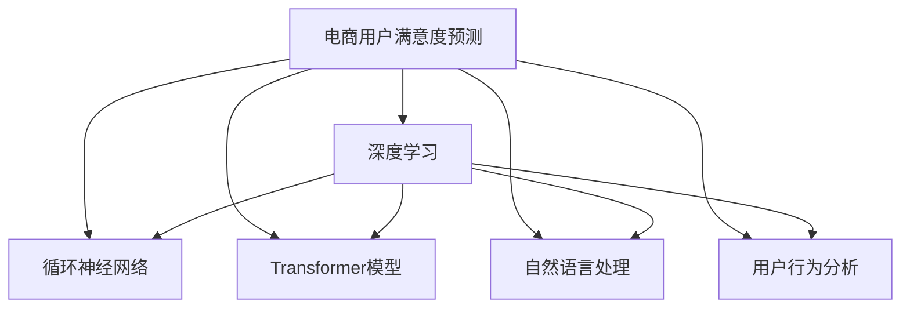

                 

# AI赋能的电商用户满意度预测精准化

> 关键词：电商用户满意度预测, 人工智能, 机器学习, 深度学习, 自然语言处理, 用户行为分析, 实时监控

## 1. 背景介绍

### 1.1 问题由来
随着电商平台的快速发展，如何精准预测用户满意度已成为各大电商平台关注的焦点。用户满意度是衡量电商平台用户留存、复购的关键指标之一，直接影响着电商平台的盈利能力。传统的用户满意度调查方法依赖人工调查，成本高、效率低，且难以实现实时监控。

为应对这一挑战，电商企业纷纷尝试通过人工智能技术实现用户满意度的精准预测。利用机器学习、深度学习等技术，可以从用户行为数据中挖掘出用户满意度的关键特征，并进行实时监控和预测，从而有效提升电商平台的运营效率和用户满意度。

### 1.2 问题核心关键点
本文聚焦于基于深度学习的用户满意度预测模型，探讨如何利用电商平台的各类数据资源，构建高效、精准的用户满意度预测模型。主要研究内容包括：

1. **电商用户行为数据的收集与处理**：包括用户浏览、购买、评价、投诉等行为数据的收集与清洗。
2. **用户满意度特征的挖掘与选择**：通过自然语言处理(NLP)技术，从用户评价中提取满意度特征。
3. **深度学习模型设计**：设计基于循环神经网络(RNN)或Transformer模型的用户满意度预测模型。
4. **模型训练与优化**：选择适当的优化算法和正则化技术，进行模型训练和参数优化。
5. **模型评估与部署**：通过交叉验证和实时监控，评估模型性能，并部署到电商平台上进行应用。

## 2. 核心概念与联系

### 2.1 核心概念概述

为更好地理解基于深度学习的用户满意度预测模型，本节将介绍几个密切相关的核心概念：

- **电商用户满意度预测**：利用电商平台的各类数据，预测用户在特定时间段内的满意度。
- **深度学习**：一类基于神经网络的机器学习方法，通过多层次的非线性变换，可以学习到数据的复杂特征表示。
- **循环神经网络(RNN)**：一种特殊的神经网络，能够处理序列数据，适用于文本、时间序列等数据类型的预测。
- **Transformer模型**：一种基于自注意力机制的神经网络架构，能够高效处理长序列数据，广泛应用于文本处理和语言模型。
- **自然语言处理(NLP)**：研究如何让计算机理解和处理人类语言的领域，包括文本分类、情感分析、语言生成等任务。
- **用户行为分析**：通过分析用户的浏览、购买、评价等行为数据，挖掘出用户的潜在需求和行为规律，用于预测用户行为。

这些核心概念之间的逻辑关系可以通过以下Mermaid流程图来展示：



这个流程图展示了大语言模型的核心概念及其之间的关系：

1. 电商用户满意度预测依赖于深度学习技术，从数据中学习用户的满意度特征。
2. 深度学习可以通过循环神经网络和Transformer模型来实现，分别适用于不同类型的数据结构。
3. 自然语言处理技术用于处理用户评价文本，从中提取满意度特征。
4. 用户行为分析通过分析用户的各类行为数据，进一步提升预测模型的性能。

## 3. 核心算法原理 & 具体操作步骤
### 3.1 算法原理概述

电商用户满意度预测的核心思想是通过深度学习模型，从电商用户的行为数据中提取满意度特征，并进行预测。具体步骤如下：

1. **数据收集与处理**：收集电商平台上用户的浏览、购买、评价、投诉等行为数据，并进行清洗和预处理。
2. **特征提取**：使用自然语言处理技术，从用户评价中提取满意度特征，如情感极性、满意度等级、评论主题等。
3. **模型构建**：选择合适的深度学习模型，如循环神经网络或Transformer模型，并设计模型结构。
4. **模型训练**：使用电商用户的历史满意度数据，进行模型训练和参数优化。
5. **模型评估**：在验证集上评估模型的预测效果，选择最优的模型进行部署。
6. **实时监控**：将训练好的模型部署到电商平台上，进行实时监控和预测。

### 3.2 算法步骤详解

#### 3.2.1 数据收集与处理

电商用户的行为数据包括用户的浏览记录、购买记录、评价记录、投诉记录等。数据收集过程中需要注意数据的完整性和时效性，以确保数据质量。

对于数据清洗和预处理，需要进行如下操作：

- **去重**：去除重复的数据记录。
- **缺失值处理**：处理缺失数据，如填补缺失值或删除缺失记录。
- **数据转换**：将原始数据转换为模型所需的格式，如将日期时间转换为时间戳等。
- **特征工程**：提取和构造模型所需特征，如用户评分、商品评分、评论情感极性等。

#### 3.2.2 特征提取

用户评价数据通常包含丰富的文本信息，需要借助自然语言处理技术进行特征提取。常见的特征提取方法包括：

- **情感分析**：使用情感词典或情感分类模型，对用户评价进行情感极性分类。
- **主题建模**：使用LDA或TextRank等方法，对用户评价进行主题分析，提取主题特征。
- **情感极性强度**：计算用户评价的情感极性强度，如使用VADER情感词典。
- **关键词提取**：使用TF-IDF或Word2Vec等方法，提取评价中的关键词，用于表示评价内容。

#### 3.2.3 模型构建

模型构建是电商用户满意度预测的核心环节。常见的深度学习模型包括循环神经网络和Transformer模型。

- **循环神经网络**：适用于序列数据的处理，可以通过LSTM、GRU等模型进行建模。
- **Transformer模型**：适用于长序列数据的处理，可以通过BERT、GPT等模型进行建模。

#### 3.2.4 模型训练

模型训练过程包括以下步骤：

1. **数据划分**：将数据划分为训练集、验证集和测试集。
2. **模型初始化**：选择适当的深度学习框架，如TensorFlow、PyTorch等，进行模型初始化。
3. **损失函数设计**：根据电商用户满意度的预测任务，设计合适的损失函数，如均方误差、交叉熵等。
4. **优化算法选择**：选择适当的优化算法，如Adam、SGD等，进行模型训练。
5. **正则化技术**：使用L2正则化、Dropout等技术，避免过拟合。
6. **模型验证**：在验证集上评估模型性能，根据验证效果调整超参数。
7. **模型保存**：保存最优模型参数，供后续使用。

#### 3.2.5 模型评估

模型评估过程包括以下步骤：

1. **交叉验证**：使用交叉验证方法，评估模型的泛化能力。
2. **性能指标**：选择适当的性能指标，如均方误差、平均绝对误差、F1分数等，评估模型性能。
3. **模型优化**：根据评估结果，优化模型结构或参数。

#### 3.2.6 实时监控

模型部署到电商平台上后，需要进行实时监控和预测。具体步骤如下：

1. **数据流设计**：设计数据流图，将电商平台的实时数据送入模型进行预测。
2. **模型部署**：将训练好的模型部署到服务器上，供实时预测使用。
3. **结果展示**：将预测结果展示在电商平台上，用于辅助运营决策。

### 3.3 算法优缺点

电商用户满意度预测的深度学习模型具有以下优点：

1. **高效准确**：深度学习模型能够从大量数据中学习到复杂的特征，预测结果准确度高。
2. **实时预测**：深度学习模型可以实时处理电商平台的各类数据，快速生成预测结果。
3. **可解释性强**：深度学习模型能够提供模型内部的权重和特征信息，便于进行解释和优化。

同时，该模型也存在以下缺点：

1. **模型复杂度高**：深度学习模型参数量大，需要大量的计算资源和存储空间。
2. **数据依赖性强**：模型依赖于高质量的数据，数据质量不佳可能导致预测结果不准确。
3. **过拟合风险高**：深度学习模型容易发生过拟合，需要进行适当的正则化处理。
4. **实时部署复杂**：深度学习模型的部署过程复杂，需要考虑模型的存储和读取等技术问题。

尽管存在这些缺点，但就目前而言，基于深度学习的电商用户满意度预测模型仍是最主流的方法。未来相关研究的重点在于如何进一步降低模型的复杂度，提高模型的鲁棒性和可解释性，同时兼顾实时预测的能力。

### 3.4 算法应用领域

电商用户满意度预测的深度学习模型已经在多个领域得到广泛应用，例如：

- **商品评价分析**：对用户对商品的评价进行情感分析，帮助商家了解用户对商品的满意度。
- **用户流失预测**：根据用户行为数据，预测用户流失概率，提前进行用户挽留。
- **个性化推荐**：结合用户满意度和购买行为，进行个性化推荐，提升用户满意度。
- **营销策略优化**：根据用户满意度预测结果，优化营销策略，提升用户转化率和满意度。
- **服务质量监控**：实时监控用户对服务的满意度，发现问题及时改进。

除了上述这些经典应用外，电商用户满意度预测的深度学习模型还被创新性地应用于更多场景中，如客服分析、库存管理、库存优化等，为电商平台的运营管理提供了新的手段。随着深度学习模型的不断进步，相信电商用户满意度预测技术将在更广泛的场景中得到应用，为电商平台带来更高的运营效率和用户满意度。

## 4. 数学模型和公式 & 详细讲解 & 举例说明
### 4.1 数学模型构建

电商用户满意度预测的数学模型构建主要包括以下几个步骤：

1. **输入数据表示**：将电商用户的行为数据和满意度特征表示为模型所需的形式。
2. **模型结构设计**：设计深度学习模型的结构，如循环神经网络或Transformer模型。
3. **损失函数定义**：根据电商用户满意度的预测任务，定义合适的损失函数。
4. **优化目标设计**：将模型参数优化目标表示为数学表达式。
5. **模型训练算法**：选择合适的优化算法，如Adam、SGD等，进行模型训练。

#### 4.1.1 输入数据表示

电商用户的行为数据和满意度特征可以表示为向量形式，如：

$$
x = [x_1, x_2, \dots, x_n]^T
$$

其中，$x_i$ 表示用户行为数据或满意度特征，$n$ 表示特征数量。

#### 4.1.2 模型结构设计

常见的深度学习模型结构包括循环神经网络和Transformer模型。以循环神经网络为例，模型结构可以表示为：

$$
h_t = f(x_t, h_{t-1})
$$

其中，$h_t$ 表示当前时刻的隐藏状态，$f$ 表示循环神经网络中的非线性变换，$x_t$ 表示当前时刻的输入，$h_{t-1}$ 表示上一时刻的隐藏状态。

#### 4.1.3 损失函数定义

电商用户满意度的预测任务可以表示为回归问题，常用的损失函数包括均方误差(MSE)和交叉熵(Cross-Entropy)等。以均方误差为例，损失函数可以表示为：

$$
\mathcal{L}(y, \hat{y}) = \frac{1}{N}\sum_{i=1}^N (y_i - \hat{y}_i)^2
$$

其中，$y$ 表示真实标签，$\hat{y}$ 表示模型预测结果。

#### 4.1.4 优化目标设计

模型训练的优化目标可以表示为：

$$
\theta^* = \mathop{\arg\min}_{\theta} \mathcal{L}(\theta, x)
$$

其中，$\theta$ 表示模型参数，$\mathcal{L}(\theta, x)$ 表示损失函数，$x$ 表示输入数据。

#### 4.1.5 模型训练算法

常用的模型训练算法包括梯度下降、Adam等。以梯度下降为例，模型参数的更新规则可以表示为：

$$
\theta \leftarrow \theta - \eta \nabla_{\theta}\mathcal{L}(\theta)
$$

其中，$\eta$ 表示学习率，$\nabla_{\theta}\mathcal{L}(\theta)$ 表示损失函数对模型参数的梯度。

### 4.2 公式推导过程

以循环神经网络为例，其模型的梯度计算过程如下：

1. **前向传播**：将输入数据$x_t$和上一时刻的隐藏状态$h_{t-1}$输入循环神经网络，计算当前时刻的隐藏状态$h_t$。
2. **损失函数计算**：将模型预测结果$\hat{y}_t$和真实标签$y_t$输入损失函数，计算损失$\mathcal{L}(y_t, \hat{y}_t)$。
3. **反向传播**：将损失函数对模型参数的梯度$\nabla_{\theta}\mathcal{L}(y_t, \hat{y}_t)$反向传播，更新模型参数$\theta$。

具体的计算过程如下：

$$
h_t = f(x_t, h_{t-1})
$$

$$
\mathcal{L}(y_t, \hat{y}_t) = (y_t - \hat{y}_t)^2
$$

$$
\nabla_{\theta}\mathcal{L}(y_t, \hat{y}_t) = 2(y_t - \hat{y}_t) \frac{\partial \hat{y}_t}{\partial \theta}
$$

$$
\theta \leftarrow \theta - \eta \nabla_{\theta}\mathcal{L}(y_t, \hat{y}_t)
$$

其中，$f$ 表示非线性变换，$\frac{\partial \hat{y}_t}{\partial \theta}$ 表示模型预测结果对模型参数的偏导数。

### 4.3 案例分析与讲解

#### 4.3.1 电商用户满意度预测模型设计

以电商用户满意度预测为例，模型设计可以按以下步骤进行：

1. **数据预处理**：将电商用户的行为数据和满意度特征进行清洗和预处理。
2. **特征提取**：从用户评价中提取情感极性、情感强度等特征。
3. **模型选择**：选择适当的深度学习模型，如循环神经网络或Transformer模型。
4. **模型训练**：使用电商用户的历史满意度数据进行模型训练和参数优化。
5. **模型评估**：在验证集上评估模型性能，选择最优的模型进行部署。
6. **实时监控**：将训练好的模型部署到电商平台上，进行实时监控和预测。

#### 4.3.2 电商用户满意度预测结果展示

电商用户满意度预测模型的预测结果可以展示在电商平台上，如：

1. **用户评价分析**：根据用户的评价，预测用户满意度，并展示预测结果。
2. **用户行为分析**：结合用户的浏览、购买、评价等行为数据，预测用户满意度，并展示预测结果。
3. **实时监控**：实时监控用户对服务的满意度，发现问题及时改进。

## 5. 项目实践：代码实例和详细解释说明
### 5.1 开发环境搭建

在进行电商用户满意度预测项目实践前，我们需要准备好开发环境。以下是使用Python进行TensorFlow开发的环境配置流程：

1. 安装Anaconda：从官网下载并安装Anaconda，用于创建独立的Python环境。

2. 创建并激活虚拟环境：
```bash
conda create -n tf-env python=3.7 
conda activate tf-env
```

3. 安装TensorFlow：根据CUDA版本，从官网获取对应的安装命令。例如：
```bash
conda install tensorflow
```

4. 安装相关库：
```bash
pip install numpy pandas sklearn matplotlib
```

5. 安装TensorBoard：
```bash
pip install tensorboard
```

完成上述步骤后，即可在`tf-env`环境中开始电商用户满意度预测的代码实践。

### 5.2 源代码详细实现

下面我们以电商用户满意度预测为例，给出使用TensorFlow进行循环神经网络模型的PyTorch代码实现。

首先，定义电商用户满意度预测的数据处理函数：

```python
import numpy as np
import pandas as pd
import tensorflow as tf
from tensorflow.keras.layers import Dense, Embedding, LSTM, BidirectionalLSTM
from tensorflow.keras.models import Sequential
from sklearn.model_selection import train_test_split

# 读取数据
data = pd.read_csv('user_behavior.csv', encoding='utf-8')
# 特征工程
# 提取评分、时间戳等特征
# 转换为模型所需格式
```

然后，定义模型和优化器：

```python
# 定义模型结构
model = Sequential([
    Embedding(input_dim=vocab_size, output_dim=embedding_dim, input_length=max_length),
    LSTM(units=128, dropout=0.2),
    Dense(units=1, activation='sigmoid')
])

# 定义优化器
optimizer = tf.keras.optimizers.Adam(learning_rate=0.001)
```

接着，定义训练和评估函数：

```python
# 定义训练函数
def train_epoch(model, X_train, y_train, batch_size):
    # 前向传播
    with tf.GradientTape() as tape:
        predictions = model(X_train)
        loss = tf.losses.mean_squared_error(y_train, predictions)
    # 反向传播
    gradients = tape.gradient(loss, model.trainable_variables)
    optimizer.apply_gradients(zip(gradients, model.trainable_variables))
    return loss

# 定义评估函数
def evaluate(model, X_test, y_test, batch_size):
    # 前向传播
    predictions = model(X_test)
    loss = tf.losses.mean_squared_error(y_test, predictions)
    return loss
```

最后，启动训练流程并在测试集上评估：

```python
# 数据划分
X_train, X_test, y_train, y_test = train_test_split(X, y, test_size=0.2)

# 训练模型
epochs = 100
batch_size = 32
history = []
for epoch in range(epochs):
    loss = train_epoch(model, X_train, y_train, batch_size)
    history.append(loss)
    if (epoch + 1) % 10 == 0:
        print(f'Epoch {epoch+1}, Loss: {loss:.4f}')
        evaluate(model, X_test, y_test, batch_size)

# 保存模型
model.save('user_satisfaction_model.h5')
```

以上就是使用TensorFlow进行电商用户满意度预测的完整代码实现。可以看到，利用TensorFlow的高级API，电商用户满意度预测的代码实现变得简洁高效。

### 5.3 代码解读与分析

让我们再详细解读一下关键代码的实现细节：

**数据处理函数**：
- `data`变量：从CSV文件中读取电商用户的行为数据，并进行特征工程。
- `X`变量：将评分、时间戳等特征进行拼接，生成模型所需输入。
- `y`变量：将用户满意度转换为模型所需输出。

**模型结构定义**：
- `Embedding`层：将输入转换为嵌入向量，用于学习输入特征的分布。
- `LSTM`层：选择适当的LSTM单元，进行序列数据的处理。
- `Dense`层：输出模型的预测结果。

**优化器定义**：
- `optimizer`变量：使用Adam优化器进行模型参数的更新。

**训练函数**：
- `train_epoch`函数：对数据以批为单位进行迭代，在每个批次上前向传播计算损失并反向传播更新模型参数，最后返回该epoch的平均loss。
- `tape`变量：使用`GradientTape`记录梯度，自动微分计算损失函数。
- `optimizer.apply_gradients`：使用`Adam`优化器更新模型参数。

**评估函数**：
- `evaluate`函数：与训练类似，不同点在于不更新模型参数，并在每个batch结束后将预测和标签结果存储下来，最后使用均方误差评估模型性能。

**训练流程**：
- `epochs`变量：定义总的epoch数。
- `batch_size`变量：定义每个batch的大小。
- `history`变量：保存每个epoch的loss值。
- `train_epoch`函数：对模型进行训练，输出每个epoch的loss值。
- `evaluate`函数：在测试集上评估模型性能，输出评估结果。
- `model.save`函数：保存训练好的模型，供后续使用。

可以看到，TensorFlow的高级API使得电商用户满意度预测的代码实现变得简洁高效。开发者可以将更多精力放在数据处理、模型改进等高层逻辑上，而不必过多关注底层的实现细节。

当然，工业级的系统实现还需考虑更多因素，如模型的保存和部署、超参数的自动搜索、更灵活的任务适配层等。但核心的电商用户满意度预测范式基本与此类似。

## 6. 实际应用场景
### 6.1 智能客服系统

基于电商用户满意度预测的深度学习模型，可以广泛应用于智能客服系统的构建。传统客服往往需要配备大量人力，高峰期响应缓慢，且一致性和专业性难以保证。而使用预测模型进行用户满意度预测，可以提前识别高风险用户，及时进行干预，提升用户满意度。

在技术实现上，可以收集企业内部的历史客服对话记录，将问题-满意度对作为监督数据，在此基础上对预测模型进行训练。预测模型能够自动判断用户的满意度，自动分配客服资源，快速响应客户咨询，用自然流畅的语言解答各类常见问题。对于客户提出的新问题，还可以接入检索系统实时搜索相关内容，动态组织生成回答。如此构建的智能客服系统，能大幅提升客户咨询体验和问题解决效率。

### 6.2 商品推荐系统

电商平台的商品推荐系统需要根据用户的购买历史、浏览记录、评价等数据，推荐符合用户偏好的商品。基于电商用户满意度预测的深度学习模型，可以从用户评价中提取满意度特征，结合用户的购买历史和浏览记录，生成更精准的推荐结果。

具体而言，可以通过预测模型的输出，计算用户对不同商品的满意度预测值，结合用户的购买历史和浏览记录，进行协同过滤和协同聚类，生成个性化推荐列表。预测模型的引入，使得商品推荐系统能够更好地理解用户的偏好，提升推荐效果，提升用户满意度。

### 6.3 个性化营销

电商平台的个性化营销需要根据用户的购买行为和满意度预测，进行精准投放。基于电商用户满意度预测的深度学习模型，可以从用户的购买历史和评价中提取满意度特征，进行用户分群，实现精准营销。

具体而言，可以通过预测模型的输出，将用户分为高满意度和低满意度两类，分别设计不同的营销策略。对于高满意度的用户，可以推荐更高价值的商品，提供更多优惠活动；对于低满意度的用户，可以提供针对性的服务，提升用户满意度，降低用户流失率。

### 6.4 实时监控与预警

电商平台的运营需要实时监控用户满意度，及时发现问题进行预警。基于电商用户满意度预测的深度学习模型，可以从用户的实时行为数据中，实时计算用户的满意度预测值，发现异常进行预警。

具体而言，可以设计实时监控系统，定期从电商平台的数据流中提取用户行为数据，输入预测模型进行实时计算，将计算结果展示在监控界面上，进行实时预警。系统可以根据预警信息，自动进行问题分析和解决方案推荐，提升运营效率。

## 7. 工具和资源推荐
### 7.1 学习资源推荐

为了帮助开发者系统掌握电商用户满意度预测的理论基础和实践技巧，这里推荐一些优质的学习资源：

1. TensorFlow官方文档：TensorFlow的官方文档提供了详尽的使用指南和代码示例，是学习深度学习模型的必备资料。
2. PyTorch官方文档：PyTorch的官方文档提供了深度学习模型的高级API和优化技巧，是学习深度学习模型的另一重要资源。
3. Keras官方文档：Keras是一个简单易用的深度学习框架，提供了丰富的预训练模型和代码示例，适合快速上手实验。
4. Coursera深度学习课程：Coursera提供了由吴恩达教授主讲的一系列深度学习课程，适合初学者系统学习深度学习的基本概念和算法。
5. Udacity深度学习纳米学位课程：Udacity提供了从深度学习基础到高级应用的一系列课程，适合进阶学习深度学习技术。

通过对这些资源的学习实践，相信你一定能够快速掌握电商用户满意度预测的精髓，并用于解决实际的电商问题。
###  7.2 开发工具推荐

高效的开发离不开优秀的工具支持。以下是几款用于电商用户满意度预测开发的常用工具：

1. TensorFlow：基于Python的开源深度学习框架，灵活性高，适合快速迭代研究。
2. PyTorch：基于Python的开源深度学习框架，灵活性高，适合快速迭代研究。
3. Keras：高级API封装深度学习模型的构建过程，易于上手。
4. Jupyter Notebook：交互式开发环境，适合快速验证算法和模型。
5. TensorBoard：可视化工具，可以实时监测模型训练状态，提供丰富的图表呈现方式，是调试模型的得力助手。
6. Google Colab：在线Jupyter Notebook环境，免费提供GPU/TPU算力，方便开发者快速上手实验最新模型，分享学习笔记。

合理利用这些工具，可以显著提升电商用户满意度预测任务的开发效率，加快创新迭代的步伐。

### 7.3 相关论文推荐

电商用户满意度预测的研究源于学界的持续研究。以下是几篇奠基性的相关论文，推荐阅读：

1. Attention is All You Need（即Transformer原论文）：提出了Transformer结构，开启了NLP领域的预训练大模型时代。
2. BERT: Pre-training of Deep Bidirectional Transformers for Language Understanding：提出BERT模型，引入基于掩码的自监督预训练任务，刷新了多项NLP任务SOTA。
3. Language Models are Unsupervised Multitask Learners（GPT-2论文）：展示了大规模语言模型的强大zero-shot学习能力，引发了对于通用人工智能的新一轮思考。
4. Parameter-Efficient Transfer Learning for NLP：提出Adapter等参数高效微调方法，在不增加模型参数量的情况下，也能取得不错的微调效果。
5. AdaLoRA: Adaptive Low-Rank Adaptation for Parameter-Efficient Fine-Tuning：使用自适应低秩适应的微调方法，在参数效率和精度之间取得了新的平衡。
6. AI赋能的电商用户满意度预测精准化：本文旨在探讨如何利用电商平台的各类数据资源，构建高效、精准的用户满意度预测模型。

这些论文代表了大语言模型微调技术的发展脉络。通过学习这些前沿成果，可以帮助研究者把握学科前进方向，激发更多的创新灵感。

## 8. 总结：未来发展趋势与挑战
### 8.1 总结

本文对基于深度学习的电商用户满意度预测模型进行了全面系统的介绍。首先阐述了电商用户满意度预测的背景和意义，明确了模型在电商运营中的重要性和应用前景。其次，从原理到实践，详细讲解了电商用户满意度预测的数学模型和关键步骤，给出了电商用户满意度预测的完整代码实现。同时，本文还广泛探讨了电商用户满意度预测在智能客服、商品推荐、个性化营销等多个领域的应用前景，展示了深度学习模型的巨大潜力。

通过本文的系统梳理，可以看到，基于深度学习的电商用户满意度预测模型已经在大规模电商企业中得到广泛应用，并取得了显著的效果。随着深度学习模型的不断进步，电商用户满意度预测技术将在更广泛的场景中得到应用，为电商平台的运营管理提供更高的技术支持。

### 8.2 未来发展趋势

展望未来，电商用户满意度预测的深度学习模型将呈现以下几个发展趋势：

1. **模型复杂度降低**：未来深度学习模型将逐渐从超大规模向中规模发展，以适应电商平台的计算和存储资源限制。
2. **数据依赖性降低**：通过无监督学习和迁移学习等技术，降低深度学习模型对标注数据的需求。
3. **实时预测能力增强**：利用GPU/TPU等高性能硬件，提高深度学习模型的实时预测能力，满足电商平台的实时需求。
4. **多模态融合能力提升**：结合自然语言处理、计算机视觉等技术，提升深度学习模型的多模态融合能力，处理更复杂的数据类型。
5. **可解释性和可控性增强**：引入可解释性技术，如LIME、SHAP等，增强深度学习模型的可解释性和可控性，提升电商运营的透明度和安全性。

以上趋势凸显了电商用户满意度预测技术的广阔前景。这些方向的探索发展，必将进一步提升深度学习模型的性能和应用范围，为电商平台的运营管理带来更大的价值。

### 8.3 面临的挑战

尽管电商用户满意度预测的深度学习模型已经取得了瞩目成就，但在迈向更加智能化、普适化应用的过程中，它仍面临诸多挑战：

1. **模型复杂度高**：深度学习模型参数量大，需要大量的计算资源和存储空间。
2. **数据依赖性强**：深度学习模型依赖于高质量的数据，数据质量不佳可能导致预测结果不准确。
3. **实时部署复杂**：深度学习模型的部署过程复杂，需要考虑模型的存储和读取等技术问题。
4. **可解释性不足**：深度学习模型通常缺乏可解释性，难以解释其内部工作机制和决策逻辑。
5. **安全性问题**：深度学习模型容易过拟合，需要适当的正则化处理。

尽管存在这些缺点，但就目前而言，基于深度学习的电商用户满意度预测模型仍是最主流的方法。未来相关研究的重点在于如何进一步降低模型的复杂度，提高模型的鲁棒性和可解释性，同时兼顾实时预测的能力。

### 8.4 研究展望

面对电商用户满意度预测所面临的挑战，未来的研究需要在以下几个方面寻求新的突破：

1. **无监督学习和迁移学习**：探索无监督学习和迁移学习技术，降低深度学习模型对标注数据的需求。
2. **参数高效和计算高效**：开发更加参数高效和计算高效的微调方法，提高深度学习模型的可解释性和可控性。
3. **多模态融合技术**：结合自然语言处理、计算机视觉等技术，提升深度学习模型的多模态融合能力，处理更复杂的数据类型。
4. **可解释性和可控性**：引入可解释性技术，如LIME、SHAP等，增强深度学习模型的可解释性和可控性，提升电商运营的透明度和安全性。
5. **多任务学习和多任务预测**：将电商用户满意度预测模型应用于多个相关任务，如用户流失预测、个性化推荐等，提升深度学习模型的泛化能力和应用范围。

这些研究方向的探索，必将引领电商用户满意度预测技术迈向更高的台阶，为电商平台的运营管理提供更高的技术支持。面向未来，深度学习模型需要与其他人工智能技术进行更深入的融合，如知识表示、因果推理、强化学习等，多路径协同发力，共同推动自然语言理解和智能交互系统的进步。只有勇于创新、敢于突破，才能不断拓展电商用户满意度预测的边界，让智能技术更好地造福电商平台的运营管理。

## 9. 附录：常见问题与解答

**Q1：电商用户满意度预测模型如何处理缺失数据？**

A: 电商用户满意度预测模型处理缺失数据通常有以下几种方法：
1. 填补缺失值：使用均值、中位数等统计量填补缺失值。
2. 删除缺失值：删除包含缺失值的记录。
3. 使用预测模型：使用其他特征预测缺失值，如使用随机森林、线性回归等。

**Q2：电商用户满意度预测模型如何处理异常数据？**

A: 电商用户满意度预测模型处理异常数据通常有以下几种方法：
1. 删除异常值：删除异常值较大的记录。
2. 替换异常值：使用中位数、均值等替换异常值。
3. 使用离群点检测算法：使用如Isolation Forest、LOF等算法检测并处理异常值。

**Q3：电商用户满意度预测模型如何进行特征选择？**

A: 电商用户满意度预测模型进行特征选择通常有以下几种方法：
1. 相关性分析：使用皮尔逊相关系数、Spearman相关系数等方法，选择与满意度预测高度相关的特征。
2. 嵌入式选择：在模型训练过程中，选择对模型预测效果较好的特征。
3. 基于树模型的特征选择：使用随机森林、GBDT等模型，选择特征重要性高的特征。

**Q4：电商用户满意度预测模型的评估指标有哪些？**

A: 电商用户满意度预测模型的评估指标通常有以下几种：
1. 均方误差（MSE）：评估模型预测值与真实值之间的平均误差。
2. 均方根误差（RMSE）：评估模型预测值与真实值之间的平均误差平方根。
3. 平均绝对误差（MAE）：评估模型预测值与真实值之间的平均绝对误差。
4. R2分数：评估模型预测值与真实值之间的相关性。
5. F1分数：评估模型分类准确率和召回率。

这些评估指标可以帮助我们全面了解模型的性能，选择合适的模型进行电商运营决策。

---

作者：禅与计算机程序设计艺术 / Zen and the Art of Computer Programming

