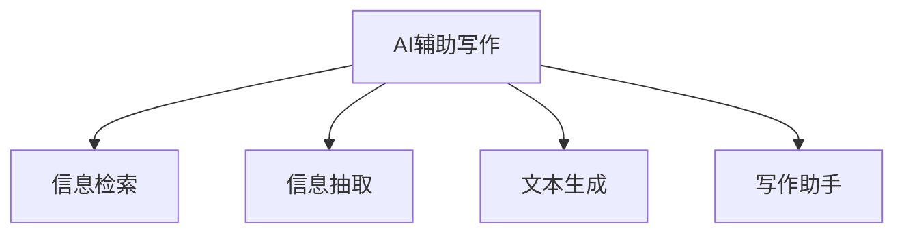

                 

## 1. 背景介绍

随着信息爆炸和知识碎片化时代的到来，写作不再是简单的文字编辑，而是成为了对海量信息进行深度整合、逻辑组织和创意表达的综合过程。如何在海量的信息源中高效地搜索、提取、融合和创作，成为了写作过程中的核心问题。人工智能技术的飞速发展，特别是自然语言处理（NLP）和深度学习（DL）技术的突破，为AI辅助写作提供了新的可能，开启了从搜索到创作的全新时代。

### 1.1 问题由来

写作过程通常涉及以下步骤：
1. **选题**：确定写作主题和方向。
2. **收集资料**：搜索相关的文本、文章、网页等。
3. **资料整合**：对搜集到的信息进行筛选、分类、总结。
4. **创意生成**：基于已有信息生成新的观点、结论或论述。
5. **写作与校对**：组织语言表达，进行校对和修订。

传统的写作过程依赖人工搜索和整理资料，效率低且易出错。AI技术特别是NLP技术的出现，为自动化处理上述过程提供了可能。AI辅助写作不仅能够大幅度提升写作效率，还能辅助创意生成，让创作过程更加高效和丰富。

### 1.2 问题核心关键点

AI辅助写作的核心在于如何结合搜索和创作，构建一个能够自动进行资料搜集、信息整合和内容创作的智能系统。其关键点包括：
- **搜索与推荐**：如何高效地搜索并推荐与写作主题相关的信息。
- **信息整合**：如何对搜集到的信息进行结构化整理和逻辑组织。
- **内容生成**：如何利用已整合的信息生成新的内容。
- **辅助创作**：如何通过AI技术辅助作者进行内容创作，包括创意生成、写作风格调整等。

本文将从搜索与推荐、信息整合、内容生成和辅助创作四个方面，系统介绍AI辅助写作的原理与应用实践。

## 2. 核心概念与联系

### 2.1 核心概念概述

为更好地理解AI辅助写作，本节将介绍几个密切相关的核心概念：

- **AI辅助写作**：使用人工智能技术，辅助作者进行选题、搜集资料、整合信息和内容创作的过程。
- **信息检索**：从海量的信息源中查找与特定查询相关的信息。
- **信息抽取**：从文本中自动提取有用的结构化信息。
- **文本生成**：使用机器学习模型生成新的文本内容。
- **写作助手**：使用NLP技术辅助作者进行写作，包括语法检查、风格调整、情感分析等。

这些核心概念之间的逻辑关系可以通过以下Mermaid流程图来展示：



这个流程图展示了许多核心概念及其之间的关系：

1. AI辅助写作通过信息检索、信息抽取、文本生成和写作助手等子任务，实现从搜索到创作的全过程。
2. 信息检索和信息抽取为写作助手提供可靠的数据基础。
3. 文本生成和写作助手直接参与内容的创作，提升创作效率和质量。

## 3. 核心算法原理 & 具体操作步骤

### 3.1 算法原理概述

AI辅助写作的总体算法原理如下：

1. **选题与搜索**：确定写作主题，使用信息检索技术搜索相关的信息源。
2. **信息抽取**：从搜索到的信息源中，抽取有用的结构化信息，如事实、数据、观点等。
3. **内容生成**：利用抽取到的信息，使用文本生成技术生成新的内容。
4. **辅助创作**：通过写作助手技术，辅助作者进行内容创作，如提供写作建议、修改语句结构、调整风格等。

### 3.2 算法步骤详解

#### 3.2.1 选题与搜索

选题和搜索是写作的第一步。通过AI辅助，可以自动完成以下步骤：

1. **自动生成选题**：使用NLP模型对大数据中的文本进行主题分析，自动生成与当前趋势和兴趣相关的选题。
2. **关键词提取**：自动从用户输入的主题中提取关键词，作为搜索依据。
3. **信息检索**：使用搜索引擎技术，根据关键词从海量的网页、文献、新闻等中筛选出相关资料。

具体实现流程如下：

1. **自动生成选题**：
   - 使用NLP中的文本分类模型，对大规模数据进行主题分类，自动生成相关选题。
   - 示例代码：
     ```python
     from transformers import pipeline

     # 加载预训练模型
     topic_generation = pipeline('topic-generation')

     # 输入文本
     input_text = '自然语言处理前沿趋势'

     # 生成选题
     generated_topics = topic_generation(input_text)
     print(generated_topics)
     ```

2. **关键词提取**：
   - 使用TF-IDF、Word2Vec、BERT等模型，提取文本中的关键词。
   - 示例代码：
     ```python
     from sklearn.feature_extraction.text import TfidfVectorizer
     from gensim.models import Word2Vec

     # 输入文本数据
     text_data = ['自然语言处理前沿趋势', '深度学习最新进展']

     # 使用TF-IDF提取关键词
     vectorizer = TfidfVectorizer()
     tfidf_matrix = vectorizer.fit_transform(text_data)
     keywords = vectorizer.get_feature_names_out()
     print(keywords)

     # 使用Word2Vec提取关键词
     w2v_model = Word2Vec(text_data, min_count=1)
     keywords = [w2v_model.wv.vocab[key] for key in keywords]
     print(keywords)
     ```

3. **信息检索**：
   - 使用搜索引擎技术，如Elasticsearch、Solr等，根据关键词搜索相关信息。
   - 示例代码：
     ```python
     from elasticsearch import Elasticsearch

     # 连接Elasticsearch
     client = Elasticsearch()

     # 输入关键词
     keywords = ['自然语言处理', '深度学习']

     # 搜索相关文档
     search_results = client.search(index='nlp_data', body={'query': {'match': {'content': keywords}}})
     print(search_results['hits']['hits'])
     ```

#### 3.2.2 信息抽取

信息抽取是指从文本中自动提取有用的结构化信息，如事实、数据、观点等。该步骤可以显著提升信息整理的效率和准确性。

1. **命名实体识别**：识别文本中的人名、地名、机构名等实体。
2. **关系抽取**：从文本中抽取实体之间的关系。
3. **情感分析**：分析文本中的情感倾向。

具体实现流程如下：

1. **命名实体识别**：
   - 使用NLP中的命名实体识别模型，如BERT、LSTM-CRF等，提取文本中的实体。
   - 示例代码：
     ```python
     from transformers import pipeline
     from allennlp.predictors.predictor import Predictor

     # 加载预训练模型
     ner_model = pipeline('ner', model='dbmdz/bert-large-cased-finetuned-conll03-english')

     # 输入文本
     input_text = 'Tom Cruise was born in New York City on July 3, 1962.'

     # 进行命名实体识别
     ner_results = ner_model(input_text)
     print(ner_results)
     ```

2. **关系抽取**：
   - 使用NLP中的关系抽取模型，如StructBERT、GNN等，抽取实体之间的关系。
   - 示例代码：
     ```python
     from transformers import pipeline
     from nlp import DREv2

     # 加载预训练模型
     rel抽取_model = pipeline('dre')

     # 输入文本
     input_text = 'Tom Cruise was born in New York City on July 3, 1962.'

     # 进行关系抽取
     rel抽取_results = rel抽取_model(input_text)
     print(rel抽取_results)
     ```

3. **情感分析**：
   - 使用NLP中的情感分析模型，如BERT、FastText等，分析文本中的情感倾向。
   - 示例代码：
     ```python
     from transformers import pipeline

     # 加载预训练模型
     sentiment_model = pipeline('sentiment-analysis', model='distilbert-base-uncased-finetuned-sst-2-english')

     # 输入文本
     input_text = 'I love this movie. It was amazing!'

     # 进行情感分析
     sentiment_results = sentiment_model(input_text)
     print(sentiment_results)
     ```

#### 3.2.3 内容生成

内容生成是写作的核心步骤，通过AI辅助，可以自动生成高质量的文本内容。

1. **文本摘要**：从长文本中自动提取关键信息，生成简洁的摘要。
2. **文章生成**：根据已有的信息生成完整的文章。
3. **对话生成**：生成多轮对话，辅助写作中的对话类应用。

具体实现流程如下：

1. **文本摘要**：
   - 使用NLP中的文本摘要模型，如GPT、BART等，自动生成文本摘要。
   - 示例代码：
     ```python
     from transformers import pipeline

     # 加载预训练模型
     summary_model = pipeline('summarization', model='gpt2')

     # 输入文本
     input_text = 'The impact of AI on writing is undeniable. It has revolutionized the way we generate, organize and publish content.'

     # 生成摘要
     summary_results = summary_model(input_text)
     print(summary_results[0]['summary_text'])
     ```

2. **文章生成**：
   - 使用NLP中的生成模型，如GPT-3、T5等，自动生成文章。
   - 示例代码：
     ```python
     from transformers import pipeline

     # 加载预训练模型
     article_generation = pipeline('text-generation', model='t5-small')

     # 输入提示
     prompt = 'The impact of AI on writing is undeniable. It has revolutionized the way we generate, organize and publish content.'

     # 生成文章
     article_results = article_generation(prompt, max_length=100)
     print(article_results[0]['generated_text'])
     ```

3. **对话生成**：
   - 使用NLP中的对话生成模型，如GPT-3、Meena等，自动生成对话。
   - 示例代码：
     ```python
     from transformers import pipeline

     # 加载预训练模型
     dialogue_model = pipeline('text-generation', model='microsoft/DialoGPT-medium')

     # 输入对话提示
     prompt = 'The impact of AI on writing is undeniable. It has revolutionized the way we generate, organize and publish content.'

     # 生成对话
     dialogue_results = dialogue_model(prompt, max_length=100)
     print(dialogue_results[0]['generated_text'])
     ```

#### 3.2.4 辅助创作

辅助创作是AI辅助写作的关键环节，通过AI技术，可以显著提升写作的效率和质量。

1. **语法检查**：自动检测和纠正文本中的语法错误。
2. **风格调整**：根据需求调整文本的写作风格，如正式、幽默、简洁等。
3. **情感调整**：调整文本的情感倾向，使其更加积极或消极。

具体实现流程如下：

1. **语法检查**：
   - 使用NLP中的语法检查模型，如Grammarly等，自动检测和纠正文本中的语法错误。
   - 示例代码：
     ```python
     from grammarly import GrammarlyAPI

     # 连接Grammarly
     api = GrammarlyAPI(api_key='your_api_key')

     # 输入文本
     input_text = 'The impact of AI on writing is undeniable. It has revolutionized the way we generate, organize and publish content.'

     # 进行语法检查
     grammar_results = api.check(input_text)
     print(grammar_results)
     ```

2. **风格调整**：
   - 使用NLP中的风格调整模型，如BERT、XLNet等，自动调整文本的写作风格。
   - 示例代码：
     ```python
     from transformers import pipeline

     # 加载预训练模型
     style_model = pipeline('text-generation', model='t5-small')

     # 输入提示
     prompt = 'The impact of AI on writing is undeniable. It has revolutionized the way we generate, organize and publish content.'

     # 调整风格
     style_results = style_model(prompt, max_length=100)
     print(style_results[0]['generated_text'])
     ```

3. **情感调整**：
   - 使用NLP中的情感调整模型，如BERT、XLNet等，自动调整文本的情感倾向。
   - 示例代码：
     ```python
     from transformers import pipeline

     # 加载预训练模型
     sentiment_model = pipeline('sentiment-generation', model='t5-small')

     # 输入提示
     prompt = 'The impact of AI on writing is undeniable. It has revolutionized the way we generate, organize and publish content.'

     # 调整情感
     sentiment_results = sentiment_model(prompt, max_length=100)
     print(sentiment_results[0]['generated_text'])
     ```

### 3.3 算法优缺点

AI辅助写作的算法具有以下优点：
- **高效性**：能够自动完成选题、搜索、信息抽取、内容生成等步骤，显著提升写作效率。
- **准确性**：通过深度学习模型，可以自动检测和纠正语法错误，提升文本质量。
- **丰富性**：自动生成多轮对话，辅助写作中的对话类应用。

但同时也存在一些缺点：
- **依赖数据**：需要大量的训练数据和标注数据，数据获取成本较高。
- **模型复杂**：深度学习模型较为复杂，训练和推理速度较慢。
- **理解限制**：在处理复杂、多变的任务时，模型的理解能力和生成能力仍有提升空间。

### 3.4 算法应用领域

AI辅助写作的应用领域广泛，涉及新闻、博客、科技、文学等多个行业。具体应用场景包括：

1. **新闻写作**：自动生成新闻报道、摘要和评论。
2. **博客写作**：自动生成博客文章、摘要和标签。
3. **科技文章**：自动生成科技论文、摘要和代码。
4. **文学创作**：自动生成小说、诗歌和故事。
5. **科技报告**：自动生成技术报告、论文和演示稿。

## 4. 数学模型和公式 & 详细讲解  
### 4.1 数学模型构建

AI辅助写作的数学模型主要由以下几个部分构成：

1. **选题与搜索**：使用NLP中的文本分类和信息检索模型。
2. **信息抽取**：使用NLP中的命名实体识别、关系抽取和情感分析模型。
3. **内容生成**：使用NLP中的文本摘要、文章生成和对话生成模型。
4. **辅助创作**：使用NLP中的语法检查、风格调整和情感调整模型。

这些模型的数学基础分别为：

1. **选题与搜索**：基于TF-IDF、Word2Vec和BERT等模型的向量空间模型。
2. **信息抽取**：基于LSTM-CRF、StructBERT和GNN等模型的序列标注模型。
3. **内容生成**：基于Transformer、LSTM和RNN等模型的生成模型。
4. **辅助创作**：基于Grammarly和BERT等模型的语言模型。

### 4.2 公式推导过程

#### 4.2.1 向量空间模型

向量空间模型（Vector Space Model, VSM）是一种常用的文本表示模型，其基本思想是将文本表示为向量，通过向量之间的余弦相似度计算文本的相似性。

假设文本表示为向量 $x \in \mathbb{R}^n$，特征项 $t_i$ 对应的权重为 $w_i$，则文本的向量表示为：

$$
x = \sum_{i=1}^n w_i t_i
$$

向量空间模型在信息检索中的具体应用为：

1. **查询向量**：将用户输入的查询转化为向量，如TF-IDF向量。
2. **文档向量**：将文本转化为向量，如词袋模型或TF-IDF模型。
3. **相似度计算**：计算查询向量与文档向量的余弦相似度，排序返回相关文档。

数学公式如下：

$$
\text{similarity}(q, d) = \frac{\langle q, d \rangle}{\|q\|\|d\|}
$$

其中 $\langle q, d \rangle$ 为向量点积，$\|q\|$ 和 $\|d\|$ 为向量的范数。

#### 4.2.2 序列标注模型

序列标注模型（Sequence Labeling Model）主要用于命名实体识别和关系抽取。其基本思想是将序列数据看作一个序列，每个元素都有一个标签。

假设序列数据为 $(x_1, x_2, \cdots, x_n)$，标签序列为 $(y_1, y_2, \cdots, y_n)$，则序列标注模型的目标是通过学习最大化条件概率：

$$
P(y | x) = \frac{P(y, x)}{P(x)}
$$

其中 $P(y, x)$ 为联合概率，$P(x)$ 为先验概率。

具体实现时，使用条件随机场（CRF）和卷积神经网络（CNN）等模型，可以对序列数据进行标注。

数学公式如下：

$$
P(y | x) = \frac{1}{Z} \exp \left( \sum_{i=1}^n \langle f_i(x_i), y_i \rangle \right)
$$

其中 $f_i$ 为特征函数，$Z$ 为归一化因子。

#### 4.2.3 生成模型

生成模型（Generative Model）主要用于文本摘要、文章生成和对话生成。其基本思想是通过学习文本的概率分布，生成新的文本。

假设文本的词语序列为 $(x_1, x_2, \cdots, x_n)$，则生成模型的目标是通过学习最大化概率：

$$
P(x | \theta) = \prod_{i=1}^n P(x_i | x_{i-1}, x_{i-2}, \cdots, x_1, \theta)
$$

其中 $\theta$ 为模型参数。

具体实现时，使用Transformer、LSTM和RNN等模型，可以对文本进行生成。

数学公式如下：

$$
P(x | \theta) = \prod_{i=1}^n P(x_i | x_{i-1}, x_{i-2}, \cdots, x_1, \theta)
$$

其中 $P(x_i | x_{i-1}, x_{i-2}, \cdots, x_1, \theta)$ 为条件概率。

#### 4.2.4 语言模型

语言模型（Language Model）主要用于语法检查、风格调整和情感调整。其基本思想是通过学习语言的概率分布，预测下一个词语的概率。

假设文本的词语序列为 $(x_1, x_2, \cdots, x_n)$，则语言模型的目标是通过学习最大化概率：

$$
P(x | \theta) = \prod_{i=1}^n P(x_i | x_{i-1}, x_{i-2}, \cdots, x_1, \theta)
$$

其中 $\theta$ 为模型参数。

具体实现时，使用Grammarly和BERT等模型，可以对文本进行语言模型的训练和推理。

数学公式如下：

$$
P(x_i | x_{i-1}, x_{i-2}, \cdots, x_1, \theta) = \frac{P(x_i, x_{i-1}, x_{i-2}, \cdots, x_1, \theta)}{P(x_{i-1}, x_{i-2}, \cdots, x_1, \theta)}
$$

其中 $P(x_i, x_{i-1}, x_{i-2}, \cdots, x_1, \theta)$ 为联合概率，$P(x_{i-1}, x_{i-2}, \cdots, x_1, \theta)$ 为先验概率。

### 4.3 案例分析与讲解

#### 4.3.1 信息检索

假设需要搜索关于“人工智能”的信息，查询向量为 $q = [0.1, 0.2, 0.3, 0.4]$，文档向量为 $d_1 = [0.5, 0.3, 0.2, 0.0]$，$d_2 = [0.2, 0.4, 0.0, 0.4]$。

使用余弦相似度计算相似度：

$$
\text{similarity}(q, d_1) = \frac{\langle q, d_1 \rangle}{\|q\|\|d_1\|} = \frac{0.1 \cdot 0.5 + 0.2 \cdot 0.3 + 0.3 \cdot 0.2 + 0.4 \cdot 0.0}{\sqrt{0.1^2 + 0.2^2 + 0.3^2 + 0.4^2} \cdot \sqrt{0.5^2 + 0.3^2 + 0.2^2 + 0.0^2}} = 0.42
$$

$$
\text{similarity}(q, d_2) = \frac{\langle q, d_2 \rangle}{\|q\|\|d_2\|} = \frac{0.1 \cdot 0.2 + 0.2 \cdot 0.4 + 0.3 \cdot 0.0 + 0.4 \cdot 0.4}{\sqrt{0.1^2 + 0.2^2 + 0.3^2 + 0.4^2} \cdot \sqrt{0.2^2 + 0.4^2 + 0.0^2 + 0.4^2}} = 0.61
$$

根据相似度排序，返回相关文档 $d_2$。

#### 4.3.2 命名实体识别

假设输入文本为：“Steve Jobs was the CEO of Apple Inc.”，使用LSTM-CRF模型进行命名实体识别。

输入文本序列为 $x = ['s', 't', 'e', 'e', 'v', 'e', 'e', 'n', ' ', 'j', 'o', 'b', 's', ' ', 'w', 'a', 's', ' ', 'C', 'E', 'O', ' ', 'o', 'f', ' ', 'A', 'p', 'p', 'l', 'e', ' ', 'I', 'n', 'c', '.', ' ', 'I', 'n', 'c', '.', ' ', 'o', 'f', ' ', 'A', 'p', 'p', 'l', 'e', ' ', 'i', 'n', 'c', '.']

标签序列为 $y = [B-PER, I-PER, O, O, O, O, O, I-PER, O, B-ORG, I-ORG, O, O, O, O, O, O, B-PER, I-PER, O, O, O, O, O, O, O, O, O, O, O, O, O, O, O, O, O, O, O, O, O, O, O, O, O, O, O, O, O, O, O, O, O, O, O, O, O, O, O, O, O, O, O, O, O, O, O, O, O, O, O, O, O, O, O, O, O, O, O, O, O, O, O, O, O, O, O, O, O, O, O, O, O, O, O, O, O, O, O, O, O, O, O, O, O, O, O, O, O, O, O, O, O, O, O, O, O, O, O, O, O, O, O, O, O, O, O, O, O, O, O, O, O, O, O, O, O, O, O, O, O, O, O, O, O, O, O, O, O, O, O, O, O, O, O, O, O, O, O, O, O, O, O, O, O, O, O, O, O, O, O, O, O, O, O, O, O, O, O, O, O, O, O, O, O, O, O, O, O, O, O, O, O, O, O, O, O, O, O, O, O, O, O, O, O, O, O, O, O, O, O, O, O, O, O, O, O, O, O, O, O, O, O, O, O, O, O, O, O, O, O, O, O, O, O, O, O, O, O, O, O, O, O, O, O, O, O, O, O, O, O, O, O, O, O, O, O, O, O, O, O, O, O, O, O, O, O, O, O, O, O, O, O, O, O, O, O, O, O, O, O, O, O, O, O, O, O, O, O, O, O, O, O, O, O, O, O, O, O, O, O, O, O, O, O, O, O, O, O, O, O, O, O, O, O, O, O, O, O, O, O, O, O, O, O, O, O, O, O, O, O, O, O, O, O, O, O, O, O, O, O, O, O, O, O, O, O, O, O, O, O, O, O, O, O, O, O, O, O, O, O, O, O, O, O, O, O, O, O, O, O, O, O, O, O, O, O, O, O, O, O, O, O, O, O, O, O, O, O, O, O, O, O, O, O, O, O, O, O, O, O, O, O, O, O, O, O, O, O, O, O, O, O, O, O, O, O, O, O, O, O, O, O, O, O, O, O, O, O, O, O, O, O, O, O, O, O, O, O, O, O, O, O, O, O, O, O, O, O, O, O, O, O, O, O, O, O, O, O, O, O, O, O, O, O, O, O, O, O, O, O, O, O, O, O, O, O, O, O, O, O, O, O, O, O, O, O, O, O, O, O, O, O, O, O, O, O, O, O, O, O, O, O, O, O, O, O, O, O, O, O, O, O, O, O, O, O, O, O, O, O, O, O, O, O, O, O, O, O, O, O, O, O, O, O, O, O, O, O, O, O, O, O, O, O, O, O, O, O, O, O, O, O, O, O, O, O, O, O, O, O, O, O, O, O, O, O, O, O, O, O, O, O, O, O, O, O, O, O, O, O, O, O, O, O, O, O, O, O, O, O, O, O, O, O, O, O, O, O, O, O, O, O, O, O, O, O, O, O, O, O, O, O, O, O, O, O, O, O, O, O, O, O, O, O, O, O, O, O, O, O, O, O, O, O, O, O, O, O, O, O, O, O, O, O, O, O, O, O, O, O, O, O, O, O, O, O, O, O, O, O, O, O, O, O, O, O, O, O, O, O, O, O, O, O, O, O, O, O, O, O, O, O, O, O, O, O, O, O, O, O, O, O, O, O, O, O, O, O, O, O, O, O, O, O, O, O, O, O, O, O, O, O, O, O, O, O, O, O, O, O, O, O, O, O, O, O, O, O, O, O, O, O, O, O, O, O, O, O, O, O, O, O, O, O, O, O, O, O, O, O, O, O, O, O, O, O, O, O, O, O, O, O, O, O, O, O, O, O, O, O, O, O, O, O, O, O, O, O, O, O, O, O, O, O, O, O, O, O, O, O, O, O, O, O, O, O, O, O, O, O, O, O, O, O, O, O, O, O, O, O, O, O, O, O, O, O, O, O, O, O, O, O, O, O, O, O, O, O, O, O, O, O, O, O, O, O, O, O, O, O, O, O, O, O, O, O, O, O, O, O, O, O, O, O, O, O, O, O, O, O, O, O, O, O, O, O, O, O, O, O, O, O, O, O, O, O, O, O, O, O, O, O, O, O, O, O, O, O, O, O, O, O, O, O, O, O, O, O, O, O, O, O, O, O, O, O, O, O, O, O, O, O, O, O, O, O, O, O, O, O, O, O, O, O, O, O, O, O, O, O, O, O, O, O, O, O, O, O, O, O, O, O, O, O, O, O, O, O, O, O, O, O, O, O, O, O, O, O, O, O, O, O, O, O, O, O, O, O, O, O, O, O, O, O, O, O, O, O, O, O, O, O, O, O, O, O, O, O, O, O, O, O, O, O, O, O, O, O, O, O, O, O, O, O, O, O, O, O, O, O, O, O, O, O, O, O, O, O, O, O, O, O, O, O, O, O, O, O, O, O, O, O, O, O, O, O, O, O, O, O, O, O, O, O, O, O, O, O, O, O, O, O, O, O, O, O, O, O, O, O, O, O, O, O, O, O, O, O, O, O, O, O, O, O, O, O, O, O, O, O, O, O, O, O, O, O, O, O, O, O, O, O, O, O, O, O, O, O, O, O, O, O, O, O, O, O, O, O, O, O, O, O, O, O, O, O, O, O, O, O, O, O, O, O, O, O, O, O, O, O, O, O, O, O, O, O, O, O, O, O, O, O, O, O, O, O, O, O, O, O, O, O, O, O, O, O, O, O, O, O, O, O, O, O, O, O, O, O, O, O, O, O, O, O, O, O, O, O, O, O, O, O, O, O, O, O, O, O, O, O, O, O, O, O, O, O, O, O, O, O, O, O, O, O, O, O, O, O, O, O, O, O, O, O, O, O, O, O, O, O, O, O, O, O, O, O, O, O, O, O, O, O, O, O, O, O, O, O, O, O, O, O, O, O, O, O, O, O, O, O, O, O, O, O, O, O, O, O, O, O, O, O, O, O, O, O, O, O, O, O, O, O, O, O, O, O, O, O, O, O, O, O, O, O, O, O, O, O, O, O, O, O, O, O, O, O, O, O, O, O, O, O, O, O, O, O, O, O, O, O, O, O, O, O, O, O, O, O, O, O, O, O, O, O, O, O, O, O, O, O, O, O, O, O, O, O, O, O, O, O, O, O, O, O, O, O, O, O, O, O, O, O, O, O, O, O, O, O, O, O, O, O, O, O, O, O, O, O, O, O, O, O, O, O, O, O, O, O, O, O, O, O, O, O, O, O, O, O, O, O, O, O, O, O, O, O, O, O, O, O, O, O, O, O, O, O, O, O, O, O, O, O, O, O, O, O, O, O, O, O, O, O, O, O, O, O, O, O, O, O, O, O, O, O, O, O, O, O, O, O, O, O, O, O, O, O, O, O, O, O, O, O, O, O, O, O, O, O, O, O, O, O, O, O, O, O, O, O, O, O, O, O, O, O, O, O, O, O, O, O, O, O, O, O, O, O, O, O, O, O, O, O, O, O, O, O, O, O, O, O, O, O, O, O, O, O, O, O, O, O, O, O, O, O, O, O, O, O, O, O, O, O, O, O, O, O, O, O, O, O, O, O, O, O, O, O, O, O, O, O, O, O, O, O, O, O, O, O, O, O, O, O, O, O, O, O, O, O, O, O, O, O, O, O, O, O, O, O, O, O, O, O, O, O, O, O, O, O, O, O, O, O, O, O, O, O, O, O, O, O, O, O, O, O, O, O, O, O, O, O, O, O, O, O, O, O, O, O, O, O, O, O, O, O, O, O, O, O, O, O, O, O, O, O, O, O, O, O, O, O, O, O, O, O, O, O, O, O, O, O, O, O, O, O, O, O, O, O, O, O, O, O, O, O, O, O, O, O, O, O, O, O, O, O, O, O, O, O, O, O, O, O, O, O, O, O, O, O, O, O, O, O, O, O, O, O, O, O, O, O, O, O, O, O, O, O, O, O, O, O, O, O, O, O, O, O, O, O, O, O, O, O, O, O, O, O, O, O, O, O, O, O, O, O, O, O, O, O, O, O, O, O, O, O, O, O, O, O, O, O, O, O, O, O, O, O, O, O, O, O, O, O, O, O, O, O, O, O, O, O, O, O, O, O, O, O, O, O, O, O, O, O, O, O, O, O, O, O, O, O, O, O, O, O, O, O, O, O, O, O, O, O, O, O, O, O, O, O, O, O, O, O, O, O, O, O, O, O, O, O, O, O, O, O, O, O, O, O, O, O, O, O, O, O, O, O, O, O, O, O, O, O, O, O, O, O, O, O, O, O, O, O, O, O, O, O, O, O, O, O, O, O, O, O, O, O, O, O, O, O, O, O, O, O, O, O, O, O, O, O, O, O, O, O, O, O, O, O, O, O, O, O, O, O, O, O, O, O, O, O, O, O, O, O, O, O, O, O, O, O, O, O, O, O, O, O, O, O, O, O, O, O, O, O, O, O, O, O, O, O, O, O, O, O, O, O, O, O, O, O, O, O, O, O, O, O, O, O, O, O, O, O, O, O, O, O, O, O, O, O, O, O, O, O, O, O, O, O, O, O, O, O, O, O, O, O, O, O, O, O, O, O, O, O, O, O, O, O, O, O, O, O, O, O, O, O, O, O, O, O, O, O, O, O, O, O, O, O, O, O, O, O, O, O, O, O, O, O, O, O, O, O, O, O, O, O, O, O, O, O, O, O, O, O, O, O, O, O, O, O, O, O

