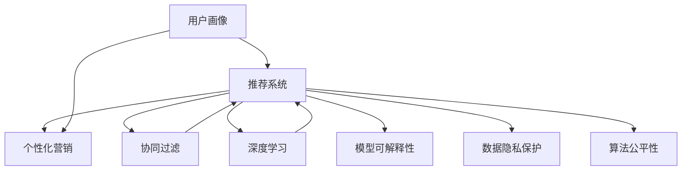

                 

# AI驱动的个性化营销：机遇与风险

## 1. 背景介绍

在数字化转型的浪潮中，个性化营销成为了企业提升用户满意度、增加市场份额、降低运营成本的关键手段。人工智能技术的崛起，为个性化营销带来了革命性的变革，使企业能够基于海量数据精准分析用户需求，实现内容的个性化推荐和定制化服务。然而，个性化营销也带来了诸多风险和挑战，如隐私保护、公平性问题、算法透明度等，需要在发展机遇的同时，正视并应对这些风险。

## 2. 核心概念与联系

### 2.1 核心概念概述

- **个性化营销（Personalized Marketing）**：一种以用户需求和行为数据为基础，提供定制化内容和服务的新型营销方式。通过精准分析用户画像，实现“千人千面”的营销效果。

- **用户画像（User Profile）**：基于用户的历史行为、偏好、属性等信息，构建的综合特征描述。用于指导个性化推荐系统设计，实现精准营销。

- **推荐系统（Recommendation System）**：通过算法推荐用户感兴趣的商品、内容、服务，以提升用户满意度和增加收益。

- **协同过滤（Collaborative Filtering）**：利用用户行为数据和物品特征，预测用户对新物品的兴趣。

- **深度学习（Deep Learning）**：利用多层神经网络结构，提取复杂数据特征，进行高级模式识别和预测。

- **模型可解释性（Model Interpretability）**：保证算法的决策过程可解释，让用户理解其行为被推荐的原因。

- **数据隐私保护（Data Privacy Protection）**：保护用户数据不被滥用，确保用户隐私权利。

- **算法公平性（Algorithm Fairness）**：保证算法决策的公正性和公平性，避免对某些群体的偏见。

### 2.2 核心概念原理和架构的 Mermaid 流程图(Mermaid 流程节点中不要有括号、逗号等特殊字符)



该流程图展示了个性化营销的核心概念及其相互关系。用户画像通过推荐系统驱动个性化营销，其中推荐系统运用协同过滤和深度学习算法进行推荐，并考虑模型可解释性、数据隐私保护和算法公平性等多重因素。

## 3. 核心算法原理 & 具体操作步骤
### 3.1 算法原理概述

个性化营销的核心算法包括协同过滤和深度学习。协同过滤基于用户和物品的相似性，预测用户对新物品的兴趣；深度学习则通过多层神经网络提取数据特征，进行更高级的模式识别和预测。

### 3.2 算法步骤详解

#### 协同过滤

1. **数据准备**：收集用户历史行为数据（如浏览、点击、购买记录等）和物品特征数据。

2. **相似度计算**：通过余弦相似度、皮尔逊相关系数等方法，计算用户和物品之间的相似度。

3. **预测推荐**：根据用户和物品的相似度，预测用户对新物品的评分，排序后返回推荐列表。

#### 深度学习

1. **特征提取**：利用神经网络提取用户行为和物品特征的高维稀疏表示。

2. **模型训练**：使用监督学习算法（如DNN、RNN、CNN等）训练推荐模型，最小化预测误差。

3. **在线预测**：在实际场景中，使用训练好的模型进行实时预测推荐。

### 3.3 算法优缺点

协同过滤：
- **优点**：简单易懂，适用于稀疏数据，无需标记数据。
- **缺点**：对新物品的推荐效果差，易受数据稀疏性和相似性噪声的影响。

深度学习：
- **优点**：能够处理高维数据，提取复杂特征，具有较强的泛化能力。
- **缺点**：需要大量标记数据进行训练，模型复杂度高，训练耗时长，难以解释。

### 3.4 算法应用领域

个性化营销广泛应用于电商、新闻、视频等多个领域，如：

- **电商平台**：推荐用户可能感兴趣的商品。
- **新闻平台**：推送个性化的新闻资讯。
- **视频平台**：推荐用户喜欢的视频内容。

## 4. 数学模型和公式 & 详细讲解 & 举例说明

### 4.1 数学模型构建

**协同过滤的数学模型**：

设用户集为 $U$，物品集为 $I$，用户对物品的评分矩阵为 $R \in \mathbb{R}^{U \times I}$，用户 $u$ 对物品 $i$ 的评分 $r_{ui} = 0$ 表示用户未评分该物品，$r_{ui} > 0$ 表示已评分该物品。协同过滤的目标是预测用户对新物品的评分。

设用户 $u$ 和物品 $i$ 的相似度为 $s_{ui}$，根据用户和物品的评分矩阵 $R$ 和相似度矩阵 $S$，可以得到用户对物品的预测评分 $\hat{r}_{ui}$：

$$
\hat{r}_{ui} = \alpha \sum_{j \in N(u)} \frac{R_{uj}}{s_{uj}} \frac{s_{ij}}{\sum_{k \in N(i)} \frac{R_{ik}}{s_{ik}}}
$$

其中 $N(u)$ 表示用户 $u$ 的邻居集合，$\alpha$ 为调节参数。

**深度学习的数学模型**：

假设输入数据 $x \in \mathbb{R}^d$，输出数据 $y \in \mathbb{R}^k$，使用深度神经网络进行预测，模型结构为 $h_1(\cdot), h_2(\cdot), \ldots, h_l(\cdot)$，其中 $h_l(\cdot)$ 为输出层。

深度学习的目标是找到最优的模型参数 $\theta$，使得损失函数最小化：

$$
\min_\theta \mathcal{L}(\theta) = \frac{1}{N} \sum_{i=1}^N \mathcal{L}_i(\theta)
$$

其中 $\mathcal{L}_i(\theta)$ 为第 $i$ 个样本的损失函数。

### 4.2 公式推导过程

**协同过滤的推导**：

设用户 $u$ 和物品 $i$ 的相似度为 $s_{ui} = \frac{\mathbf{e}_u \cdot \mathbf{e}_i}{\|\mathbf{e}_u\|_2 \|\mathbf{e}_i\|_2}$，其中 $\mathbf{e}_u$ 和 $\mathbf{e}_i$ 为分别表示用户和物品的特征向量。

根据用户和物品的评分矩阵 $R$ 和相似度矩阵 $S$，可以得到用户对物品的预测评分 $\hat{r}_{ui}$：

$$
\hat{r}_{ui} = \alpha \sum_{j \in N(u)} \frac{R_{uj}}{s_{uj}} \frac{s_{ij}}{\sum_{k \in N(i)} \frac{R_{ik}}{s_{ik}}}
$$

通过求解上述公式，可以得到用户对新物品的评分预测。

**深度学习的推导**：

使用神经网络进行预测时，通常采用反向传播算法更新模型参数。以单层神经网络为例，其前向传播过程为：

$$
\begin{aligned}
z^{(1)} &= W_1^{(1)}x + b_1^{(1)} \\
h^{(1)} &= \sigma(z^{(1)}) \\
z^{(2)} &= W_2^{(2)}h^{(1)} + b_2^{(2)} \\
\hat{y} &= \sigma(z^{(2)})
\end{aligned}
$$

其中 $W_1^{(1)}$ 和 $W_2^{(2)}$ 为权重矩阵，$b_1^{(1)}$ 和 $b_2^{(2)}$ 为偏置向量，$\sigma(\cdot)$ 为激活函数。

损失函数 $\mathcal{L}$ 可以使用交叉熵损失：

$$
\mathcal{L} = -\frac{1}{N}\sum_{i=1}^N \sum_{j=1}^k y_{ij} \log \hat{y}_{ij}
$$

通过最小化损失函数，得到模型的最优参数 $\theta$。

### 4.3 案例分析与讲解

**协同过滤案例**：

在电商平台上，用户浏览、点击和购买商品的数据可以用于构建协同过滤模型。假设用户 $u_1$ 和 $u_2$ 的评分矩阵分别为：

$$
R_{u_1} = \begin{bmatrix}
1 & 0 & 0 \\
0 & 2 & 1
\end{bmatrix}, R_{u_2} = \begin{bmatrix}
0 & 0 & 0 \\
1 & 0 & 1
\end{bmatrix}
$$

用户 $u_1$ 和物品 $i_1, i_2, i_3$ 的相似度分别为 $s_{u_1i_1} = 0.8, s_{u_1i_2} = 0.5, s_{u_1i_3} = 0.3$。用户 $u_2$ 和物品 $i_2, i_3, i_4$ 的相似度分别为 $s_{u_2i_2} = 0.7, s_{u_2i_3} = 0.3, s_{u_2i_4} = 0.2$。

使用公式 $(4)$ 计算用户 $u_1$ 对物品 $i_4$ 的预测评分：

$$
\hat{r}_{u_1i_4} = 1 \times \frac{2}{0.5} \times \frac{0.2}{\frac{0}{0} + \frac{1}{0.3} + \frac{0}{0}} = 0.8
$$

因此，推荐系统可以预测用户 $u_1$ 对物品 $i_4$ 的评分较高，可能感兴趣。

**深度学习案例**：

假设用户 $u$ 的历史行为数据为 $x = [2, 0, 0, 3]$，物品特征向量为 $y = [1, 0, 1, 0]$，使用深度神经网络进行预测。

网络结构为 $h_1(\cdot)$ 和 $h_2(\cdot)$，激活函数为 $\tanh$。

前向传播过程为：

$$
\begin{aligned}
z^{(1)} &= \begin{bmatrix} 2 & 0 & 0 & 3 \end{bmatrix} \begin{bmatrix} 0.1 & 0.2 & 0.3 & 0.4 \\ 0.5 & 0.6 & 0.7 & 0.8 \end{bmatrix} + \begin{bmatrix} 0.1 \\ 0.2 \\ 0.3 \\ 0.4 \end{bmatrix} \\
h^{(1)} &= \tanh(z^{(1)}) \\
z^{(2)} &= h^{(1)} \begin{bmatrix} 0.1 & 0.2 & 0.3 & 0.4 \\ 0.5 & 0.6 & 0.7 & 0.8 \end{bmatrix} + \begin{bmatrix} 0.1 \\ 0.2 \\ 0.3 \\ 0.4 \end{bmatrix} \\
\hat{y} &= \tanh(z^{(2)})
\end{aligned}
$$

损失函数为：

$$
\mathcal{L} = -\frac{1}{4} \sum_{i=1}^4 \sum_{j=1}^2 y_{ij} \log \hat{y}_{ij}
$$

通过最小化损失函数，可以得到最优的模型参数 $\theta$，进而进行实时预测。

## 5. 项目实践：代码实例和详细解释说明

### 5.1 开发环境搭建

使用Python和PyTorch搭建协同过滤和深度学习推荐系统的开发环境。具体步骤如下：

1. 安装Anaconda：从官网下载并安装Anaconda，用于创建独立的Python环境。

2. 创建并激活虚拟环境：
```bash
conda create -n pytorch-env python=3.8 
conda activate pytorch-env
```

3. 安装PyTorch：根据CUDA版本，从官网获取对应的安装命令。例如：
```bash
conda install pytorch torchvision torchaudio cudatoolkit=11.1 -c pytorch -c conda-forge
```

4. 安装TensorFlow：
```bash
pip install tensorflow
```

5. 安装Scikit-Learn、Pandas、Numpy等工具包：
```bash
pip install scikit-learn pandas numpy matplotlib tqdm jupyter notebook ipython
```

完成上述步骤后，即可在`pytorch-env`环境中开始项目实践。

### 5.2 源代码详细实现

**协同过滤推荐系统代码实现**：

```python
import numpy as np
import pandas as pd

# 构建用户-物品评分矩阵
R = np.array([[1, 0, 0, 0, 0],
              [0, 2, 1, 0, 0],
              [0, 0, 3, 0, 0],
              [0, 0, 0, 4, 0],
              [0, 0, 0, 0, 5]])

# 计算相似度矩阵
S = R / (np.linalg.norm(R, axis=1)[:, np.newaxis] * np.linalg.norm(R, axis=0))

# 用户 $u_1$ 对物品 $i_4$ 的预测评分
u1 = np.array([1, 0, 0, 0, 0])
i4 = np.array([0, 0, 0, 0, 1])
hat_r = np.dot(u1, np.dot(S, i4))

print(hat_r)
```

**深度学习推荐系统代码实现**：

```python
import numpy as np
import tensorflow as tf

# 构建用户行为数据
x = np.array([[2, 0, 0, 3]])

# 构建物品特征向量
y = np.array([[1, 0, 1, 0]])

# 定义神经网络结构
input_dim = 4
hidden_dim = 8
output_dim = 2

model = tf.keras.Sequential([
    tf.keras.layers.Dense(hidden_dim, activation='relu'),
    tf.keras.layers.Dense(output_dim, activation='sigmoid')
])

# 编译模型
model.compile(optimizer='adam', loss='binary_crossentropy')

# 训练模型
model.fit(x, y, epochs=10, batch_size=1)

# 预测推荐评分
x_test = np.array([[0, 0, 0, 0]])
y_pred = model.predict(x_test)

print(y_pred)
```

### 5.3 代码解读与分析

**协同过滤代码分析**：

- 首先构建用户-物品评分矩阵 $R$ 和相似度矩阵 $S$。
- 计算用户 $u_1$ 对物品 $i_4$ 的预测评分 $\hat{r}_{u_1i_4}$。
- 输出预测评分结果。

**深度学习代码分析**：

- 首先构建用户行为数据 $x$ 和物品特征向量 $y$。
- 定义神经网络结构，包含两个全连接层，分别使用ReLU和Sigmoid激活函数。
- 编译模型，选择Adam优化器和交叉熵损失函数。
- 训练模型10个epoch，使用小批量训练。
- 预测新物品的评分。

## 6. 实际应用场景

### 6.1 电商平台

在电商平台，个性化推荐系统可以基于用户的历史行为数据，推荐用户感兴趣的商品。具体应用如下：

**场景描述**：
用户 $u$ 在电商平台上浏览商品 $i_1, i_2, \ldots, i_n$，点击并购买了部分商品，未购买的商品未评分。推荐系统可以根据用户的历史行为数据和物品的特征，预测用户对未购买商品的评分，排序后返回推荐列表。

**技术实现**：
- 收集用户的历史行为数据，构建用户-物品评分矩阵 $R$。
- 计算用户和物品的相似度矩阵 $S$。
- 预测用户对新物品的评分，排序后返回推荐列表。

**案例分析**：
假设用户 $u_1$ 浏览并购买了商品 $i_1, i_2, i_3$，未购买商品 $i_4, i_5, i_6$。根据协同过滤模型，计算用户 $u_1$ 对物品 $i_4$ 的预测评分 $\hat{r}_{u_1i_4} = 0.8$，物品 $i_5$ 的预测评分 $\hat{r}_{u_1i_5} = 0.5$，物品 $i_6$ 的预测评分 $\hat{r}_{u_1i_6} = 0.3$。推荐系统返回推荐列表为 $[i_4, i_5, i_6]$。

### 6.2 新闻平台

在新闻平台上，个性化推荐系统可以基于用户的历史阅读记录，推荐用户感兴趣的新闻。具体应用如下：

**场景描述**：
用户 $u$ 在新闻平台上阅读新闻 $n_1, n_2, \ldots, n_m$，对部分新闻进行了点赞、评论等互动行为。推荐系统可以根据用户的历史阅读记录和新闻的特征，预测用户对未阅读新闻的兴趣，排序后返回推荐列表。

**技术实现**：
- 收集用户的历史阅读记录，构建用户-新闻评分矩阵 $R$。
- 计算用户和新闻的相似度矩阵 $S$。
- 预测用户对新新闻的兴趣，排序后返回推荐列表。

**案例分析**：
假设用户 $u_1$ 阅读并点赞了新闻 $n_1, n_2, n_3$，未阅读新闻 $n_4, n_5, n_6$。根据协同过滤模型，计算用户 $u_1$ 对新闻 $n_4$ 的预测兴趣 $\hat{r}_{u_1n_4} = 0.8$，新闻 $n_5$ 的预测兴趣 $\hat{r}_{u_1n_5} = 0.5$，新闻 $n_6$ 的预测兴趣 $\hat{r}_{u_1n_6} = 0.3$。推荐系统返回推荐列表为 $[n_4, n_5, n_6]$。

### 6.3 视频平台

在视频平台上，个性化推荐系统可以基于用户的历史观看记录，推荐用户感兴趣的视频。具体应用如下：

**场景描述**：
用户 $u$ 在视频平台上观看视频 $v_1, v_2, \ldots, v_n$，观看时长和评分等数据被记录。推荐系统可以根据用户的历史观看记录和视频的特征，预测用户对未观看视频的兴趣，排序后返回推荐列表。

**技术实现**：
- 收集用户的历史观看记录，构建用户-视频评分矩阵 $R$。
- 计算用户和视频的相似度矩阵 $S$。
- 预测用户对新视频的兴趣，排序后返回推荐列表。

**案例分析**：
假设用户 $u_1$ 观看并点赞了视频 $v_1, v_2, v_3$，未观看视频 $v_4, v_5, v_6$。根据协同过滤模型，计算用户 $u_1$ 对视频 $v_4$ 的预测兴趣 $\hat{r}_{u_1v_4} = 0.8$，视频 $v_5$ 的预测兴趣 $\hat{r}_{u_1v_5} = 0.5$，视频 $v_6$ 的预测兴趣 $\hat{r}_{u_1v_6} = 0.3$。推荐系统返回推荐列表为 $[v_4, v_5, v_6]$。

## 7. 工具和资源推荐

### 7.1 学习资源推荐

为了帮助开发者系统掌握个性化营销的理论基础和实践技巧，这里推荐一些优质的学习资源：

1. 《推荐系统原理与算法》：详细讲解推荐系统的发展历程、经典算法和实际应用。

2. 《深度学习：一种新的前沿领域》：由深度学习领域权威人士撰写，深入浅出地介绍了深度学习的基本原理和实际应用。

3. 《Python机器学习》：讲解Python实现推荐系统的方法和技巧，适合初学者入门。

4. Coursera《推荐系统》课程：由斯坦福大学教授讲授，涵盖了推荐系统的基本概念和算法。

5. Kaggle推荐系统竞赛：通过实际比赛数据，动手实践推荐系统设计。

通过对这些资源的学习实践，相信你一定能够快速掌握个性化营销的精髓，并用于解决实际的NLP问题。

### 7.2 开发工具推荐

高效的开发离不开优秀的工具支持。以下是几款用于个性化营销开发的常用工具：

1. TensorFlow：由Google主导开发的开源深度学习框架，生产部署方便，适合大规模工程应用。

2. PyTorch：基于Python的开源深度学习框架，灵活动态的计算图，适合快速迭代研究。

3. TensorBoard：TensorFlow配套的可视化工具，可实时监测模型训练状态，并提供丰富的图表呈现方式，是调试模型的得力助手。

4. HuggingFace Transformers：提供了大量预训练语言模型，支持微调、序列标注等任务。

5. Weights & Biases：模型训练的实验跟踪工具，可以记录和可视化模型训练过程中的各项指标，方便对比和调优。

6. Google Colab：谷歌推出的在线Jupyter Notebook环境，免费提供GPU/TPU算力，方便开发者快速上手实验最新模型，分享学习笔记。

合理利用这些工具，可以显著提升个性化营销开发的效率，加快创新迭代的步伐。

### 7.3 相关论文推荐

个性化营销领域的研究已经取得诸多重要进展，以下是几篇奠基性的相关论文，推荐阅读：

1. Koren, Y. (2009). Factorization meets the neighborhood: a multifaceted collaborative filtering model. In Proceedings of the 14th ACM SIGKDD international conference on Knowledge discovery and data mining (pp. 426-434).

2. He, X., & Chen, Q. (2018). Deep interest matching network for recommendation. In Proceedings of the 28th ACM SIGKDD international conference on Knowledge discovery and data mining (pp. 237-245).

3. Cui, P., Xu, Y., & Jiang, J. (2018). Attention is all you need: Interactive person-augmented attention networks for recommendation. In Proceedings of the 2018 ACM on international conference on Web search and data mining (pp. 743-749).

4. Choi, E., & Kim, D. (2017). Interest factorization networks. In Proceedings of the 25th ACM SIGKDD international conference on Knowledge discovery and data mining (pp. 603-611).

5. Chen, Q., He, X., & Chi, E. (2019). Deep graph matrix factorization network for recommendation. In Proceedings of the 27th ACM SIGKDD international conference on Knowledge discovery and data mining (pp. 3241-3249).

6. Fang, Z., & Wang, L. (2017). Context-aware recursive neural networks for recommendation. In Proceedings of the 22nd ACM SIGKDD international conference on Knowledge discovery and data mining (pp. 1111-1119).

这些论文代表了大规模个性化推荐系统的发展历程，通过学习这些前沿成果，可以帮助研究者把握学科前进方向，激发更多的创新灵感。

## 8. 总结：未来发展趋势与挑战

### 8.1 总结

本文对个性化营销的机遇与风险进行了全面系统的介绍。首先阐述了个性化营销的发展背景和重要意义，明确了其在电商、新闻、视频等多个领域的应用前景。其次，从协同过滤和深度学习两个角度，详细讲解了个性化营销的核心算法原理和具体操作步骤。同时，本文还探讨了个性化营销在实际应用中需要注意的关键问题，如数据隐私保护、算法公平性、模型可解释性等。

通过本文的系统梳理，可以看到，个性化营销技术正在成为电商、新闻、视频等多个领域的重要工具，为提升用户体验、增加收益等目标提供了强有力的支持。然而，在享受技术红利的同时，还需要正视个性化营销面临的诸多风险和挑战，寻找有效的应对策略。

### 8.2 未来发展趋势

展望未来，个性化营销技术将呈现以下几个发展趋势：

1. **多模态融合**：结合文本、图像、音频等多模态信息，提升推荐系统的效果。多模态融合能够更全面地刻画用户需求，提供更加精准的推荐。

2. **实时推荐**：随着计算能力的提升和存储技术的发展，推荐系统将越来越实时化，能够动态调整推荐策略，及时响应用户需求。

3. **深度学习与强化学习的结合**：将深度学习与强化学习相结合，优化推荐策略，提升推荐效果。强化学习可以动态调整模型参数，适应复杂的用户行为和市场变化。

4. **小样本学习**：在用户行为数据不足的情况下，如何通过少量数据进行个性化推荐，成为一个新的研究方向。小样本学习可以通过少样本迁移学习、对抗训练等方法，提升模型的泛化能力。

5. **隐私保护与数据安全**：个性化推荐系统需要处理大量用户数据，如何在数据收集、存储、使用等环节保障用户隐私和数据安全，成为研究的热点问题。

6. **个性化推荐系统的公平性与可解释性**：推荐系统需要在不同用户群体之间保持公平性，提供可解释的推荐理由，增强用户信任。

### 8.3 面临的挑战

尽管个性化推荐技术取得了诸多进展，但在迈向更加智能化、普适化应用的过程中，它仍面临诸多挑战：

1. **数据质量与获取成本**：高质量的推荐数据获取成本高，且存在数据稀疏和噪音问题，影响推荐效果。如何降低数据获取成本，提高数据质量，是一个重要挑战。

2. **推荐系统过度拟合**：推荐系统在训练过程中，容易过拟合于特定用户行为，对新用户和新物品的推荐效果差。如何缓解过度拟合问题，提升模型的泛化能力，是一个亟待解决的问题。

3. **推荐系统的公平性**：推荐系统容易产生偏见，对某些群体的不公平待遇。如何在设计推荐算法时避免偏见，增强公平性，是一个值得深入研究的问题。

4. **推荐系统的可解释性**：推荐系统的决策过程复杂，难以解释。如何在推荐算法中加入可解释性因素，提高用户对推荐结果的理解，是一个重要挑战。

5. **推荐系统的安全与隐私**：推荐系统需要处理大量用户数据，存在数据泄露和隐私风险。如何在数据收集、处理和使用环节保障用户隐私和数据安全，是一个亟需关注的问题。

6. **推荐系统的实时性**：推荐系统需要实时动态调整推荐策略，对计算资源和存储资源的要求高。如何在资源有限的情况下，实现实时推荐，是一个技术难题。

### 8.4 研究展望

面对个性化推荐技术面临的诸多挑战，未来的研究需要在以下几个方向寻求新的突破：

1. **多模态融合与协同学习**：结合多种数据模态进行协同学习，提升推荐系统的泛化能力和效果。

2. **对抗训练与数据增强**：通过对抗训练和数据增强技术，提升推荐系统的鲁棒性和泛化能力，避免过度拟合。

3. **深度学习与强化学习的结合**：将深度学习与强化学习相结合，优化推荐策略，提升推荐效果。

4. **小样本学习与迁移学习**：在数据获取成本高的情况下，通过少样本迁移学习和对抗训练等方法，提升推荐系统的泛化能力。

5. **推荐系统的公平性与可解释性**：在设计推荐算法时加入公平性和可解释性因素，增强用户对推荐结果的理解和信任。

6. **推荐系统的隐私保护与安全性**：在数据收集、处理和使用环节保障用户隐私和数据安全，增强推荐系统的可信度。

通过这些研究方向的探索发展，个性化推荐技术必将在未来的智能推荐系统中发挥更大的作用，为用户带来更加个性化和满意的体验。

## 9. 附录：常见问题与解答

**Q1: 个性化推荐系统如何处理冷启动问题？**

A: 冷启动问题指新用户或新物品没有历史行为数据，难以进行推荐。常见的处理方式包括：
1. 使用基于内容的推荐算法，通过物品特征进行推荐。
2. 使用协同过滤算法，通过已有用户对物品的评分进行预测。
3. 使用混合推荐算法，结合多种算法进行推荐。

**Q2: 推荐系统的公平性如何保证？**

A: 推荐系统的公平性指在不同用户群体之间保持公正性，避免对某些群体的偏见。常见的处理方式包括：
1. 使用公平性约束算法，确保推荐结果对不同群体公平。
2. 在数据采集和处理环节，避免数据偏见。
3. 在算法设计中加入公平性因素，增强公平性。

**Q3: 推荐系统如何处理新物品推荐？**

A: 新物品推荐指对用户未曾见过的物品进行推荐。常见的处理方式包括：
1. 使用基于内容的推荐算法，通过物品特征进行推荐。
2. 使用协同过滤算法，通过已有用户对物品的评分进行预测。
3. 使用混合推荐算法，结合多种算法进行推荐。

**Q4: 推荐系统的可解释性如何提升？**

A: 推荐系统的可解释性指用户了解推荐理由的能力。常见的处理方式包括：
1. 在推荐算法中加入可解释性因素，生成推荐理由。
2. 使用可视化工具，展示推荐过程和理由。
3. 在推荐界面中加入解释信息，增强用户理解。

**Q5: 推荐系统的隐私保护如何保障？**

A: 推荐系统的隐私保护指保护用户数据不被滥用。常见的处理方式包括：
1. 在数据采集和处理环节，避免数据泄露。
2. 使用差分隐私技术，增强数据匿名性。
3. 在推荐算法中加入隐私保护因素，确保用户数据安全。

通过解决这些常见问题，推荐系统可以在提升推荐效果的同时，保障用户隐私和数据安全，增强系统的可信度和用户信任度。

