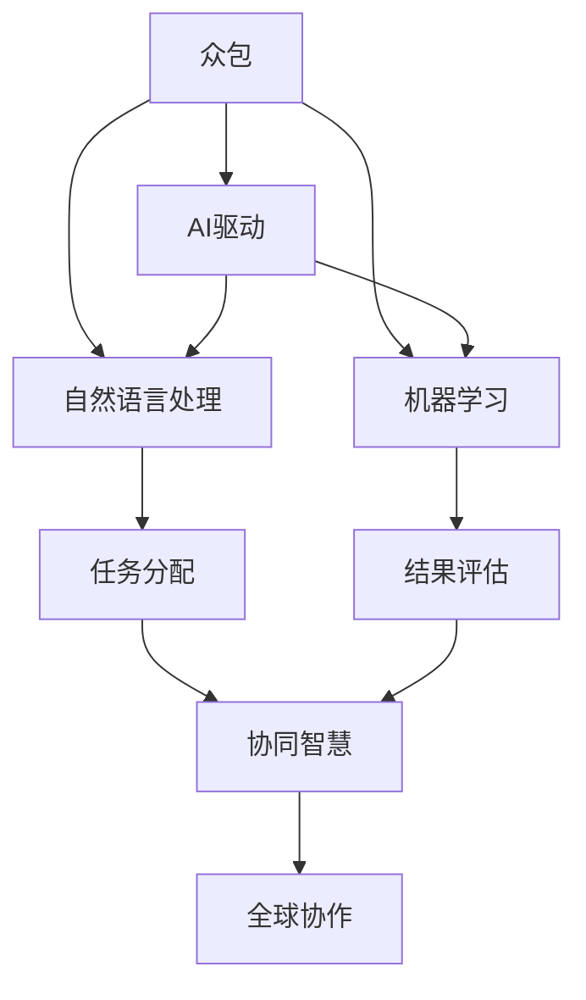

                 

# AI驱动的众包：全球协作的新时代

> 关键词：人工智能,众包,协作,全球化,AI驱动,未来趋势,智能助手,人机协同

## 1. 背景介绍

### 1.1 问题由来
随着科技的飞速发展，人工智能（AI）正在深刻改变我们的生产生活方式。在众多AI技术中，众包（Crowdsourcing）以其独特的优势，成为连接人类智能与机器智能的重要桥梁。众包不仅能够充分利用全球范围内的人才资源，降低企业的人力成本，还能通过大规模协作，产生超越个体能力的协同智慧。

然而，传统众包模式存在诸多局限。比如，信息传递效率低下，任务分配不合理，参与者激励机制不完善等问题，限制了众包的效果。因此，AI驱动的众包应运而生，利用AI技术提升众包系统的智能化水平，优化任务分配和激励机制，提升整体协作效率。

### 1.2 问题核心关键点
AI驱动的众包，本质上是通过AI技术辅助和优化众包流程，利用机器学习和自然语言处理等技术，实现任务自动化分配、结果智能化评估和激励机制优化，从而大幅提升众包系统的性能。

其核心要素包括：
1. **自动化任务分配**：利用AI算法分析任务特征，自动分配给最合适的专家。
2. **智能化结果评估**：通过自然语言处理技术，自动评估结果质量，减少人为评估误差。
3. **优化激励机制**：利用AI预测专家能力，动态调整激励，提升整体协作效率。

这些关键要素使得AI驱动的众包能够在更短的时间内，更高效地完成复杂、大规模的任务，为全球协作开启新纪元。

### 1.3 问题研究意义
研究AI驱动的众包，对于拓展AI技术应用范围，提升全球协作效率，加速知识创新，具有重要意义：

1. **提升协作效率**：AI驱动的众包通过自动化和智能化手段，可以大幅提升任务分配和结果评估的效率，缩短项目周期。
2. **降低人力成本**：AI驱动的众包系统能够自动匹配任务和专家，优化激励机制，降低企业对人力的依赖。
3. **促进知识创新**：AI驱动的众包汇聚全球人才，在广泛的领域内进行大规模协作，加速知识创新和技术突破。
4. **推动全球化进程**：AI驱动的众包能够跨越地理和语言的界限，为全球化项目提供高效协同的平台。

## 2. 核心概念与联系

### 2.1 核心概念概述

为了更好地理解AI驱动的众包，这里介绍几个关键概念：

- **众包**：指通过网络平台，将任务分发给自由职业者或网络用户，利用其劳动成果完成项目的一种模式。
- **AI驱动**：指利用人工智能技术，优化和增强众包流程，提升协作效率和效果。
- **自然语言处理**：指让计算机能够理解、解释和生成人类语言的学科，是AI驱动众包中任务分配和结果评估的核心技术。
- **机器学习**：指通过算法使计算机从数据中学习，不断优化任务分配和激励机制的技术。
- **协同智慧**：指多个专家协同工作产生的智慧，优于个体智慧的总和，是AI驱动众包的目标和理想状态。

这些概念之间的逻辑关系可以通过以下Mermaid流程图来展示：



这个流程图展示了几大核心概念及其之间的关联：

1. 众包系统通过自然语言处理和机器学习技术，实现任务自动化分配和结果智能化评估。
2. AI驱动的众包系统提升了任务分配和结果评估的效率，从而提升了整体协作效果。
3. 协同智慧的实现，得益于AI驱动的众包系统，为全球协作提供了高效的平台。

## 3. 核心算法原理 & 具体操作步骤
### 3.1 算法原理概述

AI驱动的众包系统主要涉及以下几个算法和步骤：

1. **任务特征分析**：利用自然语言处理技术，提取任务描述中的关键特征，如任务难度、所需技能、时间限制等。
2. **专家匹配算法**：根据提取的任务特征，通过机器学习模型，匹配最合适的专家。
3. **任务分配算法**：结合专家匹配结果，自动分配任务，确保任务分配合理。
4. **结果评估算法**：通过自然语言处理技术，自动评估结果质量，确保结果准确。
5. **激励机制优化算法**：利用机器学习模型，动态调整激励机制，确保专家高效完成任务。

这些步骤在实际应用中，通常通过多个子算法和模型实现，确保系统的每个环节都能高效运行。

### 3.2 算法步骤详解

以下是AI驱动的众包系统的主要操作步骤：

**Step 1: 数据准备**
- 收集任务描述和专家信息，包括任务特征、专家的历史表现、技能和评价等。
- 对数据进行预处理，如文本清洗、特征提取等。

**Step 2: 任务特征分析**
- 利用自然语言处理技术，提取任务描述中的关键特征，如任务难度、所需技能、时间限制等。
- 将这些特征转化为数值型数据，用于后续的机器学习模型训练。

**Step 3: 专家匹配**
- 利用机器学习模型（如分类算法、回归算法等），根据任务特征匹配最合适的专家。
- 可以引入多种特征（如专家历史表现、技能标签、评价等），提升匹配准确性。

**Step 4: 任务分配**
- 根据专家匹配结果，自动分配任务，确保任务分配合理。
- 可以通过模拟退火、遗传算法等优化算法，进一步提升任务分配的效率和公平性。

**Step 5: 结果评估**
- 利用自然语言处理技术，自动评估结果质量。
- 可以通过文本相似度、关键词匹配等技术，评估结果与预期目标的契合度。

**Step 6: 激励机制优化**
- 利用机器学习模型，动态调整激励机制。
- 可以引入奖励系数、任务难度系数等，确保激励与任务复杂度和专家表现相匹配。

### 3.3 算法优缺点

AI驱动的众包系统具有以下优点：

1. **高效性**：通过自动化和智能化手段，大幅提升任务分配和结果评估的效率。
2. **公平性**：通过优化激励机制，确保专家能够公平获得任务，提升整体协作效率。
3. **灵活性**：能够动态调整任务分配和激励机制，适应各种复杂的任务场景。
4. **可扩展性**：能够应对大规模的任务，利用分布式计算和云服务，支持全球协作。

同时，该系统也存在一些局限性：

1. **数据质量依赖**：依赖高质量的数据进行训练和分析，数据质量差会导致系统性能下降。
2. **模型复杂性**：涉及到自然语言处理和机器学习等复杂算法，开发和维护成本较高。
3. **隐私和伦理问题**：在数据收集和使用过程中，需要考虑隐私保护和伦理问题，确保数据安全。
4. **技术依赖**：对AI技术的依赖较强，一旦技术出现问题，可能影响系统性能。

尽管存在这些局限性，但就目前而言，AI驱动的众包系统已经在多个领域取得了显著成效，成为全球协作的重要工具。未来相关研究的重点在于如何进一步提升系统的智能化水平，降低对技术的依赖，保障数据和隐私安全，同时兼顾公平性和效率。

### 3.4 算法应用领域

AI驱动的众包系统已经在多个领域得到了广泛应用，包括但不限于：

- **软件开发**：通过众包方式，快速获取技术支持和代码审查，加速软件开发。
- **市场调研**：利用众包平台，进行大规模的市场调查和数据分析，获取用户反馈。
- **内容创作**：通过众包方式，收集和创作内容，如文章、视频、音频等，提升内容多样性。
- **医学研究**：利用众包平台，进行医学数据分析和疾病研究，提升医疗水平。
- **环境保护**：通过众包方式，进行环境监测和数据收集，提升环保意识和效果。

除了上述这些经典应用外，AI驱动的众包还在教育、金融、法律等众多领域发挥着重要作用，推动了全球协作的深入发展。

## 4. 数学模型和公式 & 详细讲解  
### 4.1 数学模型构建

AI驱动的众包系统涉及到多个数学模型，这里我们以任务匹配和结果评估为例进行详细讲解。

**任务匹配模型**：假设任务特征向量为 $X$，专家特征向量为 $Y$，任务匹配模型为 $M(X, Y)$。其中 $X$ 包含任务难度、所需技能、时间限制等特征，$Y$ 包含专家历史表现、技能标签、评价等特征。任务匹配模型可以表示为：

$$
M(X, Y) = f(X, Y)
$$

其中 $f$ 为机器学习模型，可以是分类模型、回归模型等。

**结果评估模型**：假设任务结果向量为 $R$，专家评估向量为 $E$，结果评估模型为 $R(Y)$。其中 $R$ 包含任务完成情况、结果质量等特征，$E$ 包含专家对结果的评估和反馈。结果评估模型可以表示为：

$$
R(Y) = g(E)
$$

其中 $g$ 为自然语言处理模型，可以是情感分析模型、文本相似度模型等。

### 4.2 公式推导过程

以任务匹配模型为例，其推导过程如下：

假设 $X$ 和 $Y$ 分别有 $n_X$ 和 $n_Y$ 个特征，任务匹配模型 $M(X, Y)$ 可以表示为：

$$
M(X, Y) = \max_{j=1}^{n_Y} \sum_{i=1}^{n_X} w_{i,j} \cdot X_i \cdot Y_j
$$

其中 $w_{i,j}$ 为特征权重，表示任务特征 $X_i$ 和专家特征 $Y_j$ 之间的重要性。

利用机器学习算法，如支持向量机（SVM）、随机森林（RF）等，可以构建任务匹配模型，用于自动匹配任务和专家。

### 4.3 案例分析与讲解

以软件开发项目为例，其任务匹配模型和结果评估模型的详细推导如下：

**任务匹配模型**：假设任务特征为任务难度 $D$、所需技能 $S$、时间限制 $T$，专家特征为历史表现 $H$、技能标签 $L$、评价 $E$。任务匹配模型可以表示为：

$$
M(D, S, T; H, L, E) = \max_{j=1}^{n_Y} \sum_{i=1}^{n_X} w_{i,j} \cdot (D_i \cdot H_j + S_i \cdot L_j + T_i \cdot E_j)
$$

**结果评估模型**：假设任务结果为代码提交数 $C$、代码质量 $Q$、反馈速度 $F$，专家评估为代码质量评价 $G$、提交速度评价 $V$、反馈速度评价 $S$。结果评估模型可以表示为：

$$
R(G, V, S) = \frac{C \cdot G + Q \cdot V + F \cdot S}{C + Q + F}
$$

其中 $C, Q, F$ 为正常化后的评分，$G, V, S$ 为专家评价。

## 5. 项目实践：代码实例和详细解释说明
### 5.1 开发环境搭建

在进行AI驱动的众包系统开发前，我们需要准备好开发环境。以下是使用Python进行Flask开发的环境配置流程：

1. 安装Anaconda：从官网下载并安装Anaconda，用于创建独立的Python环境。

2. 创建并激活虚拟环境：
```bash
conda create -n ai_crowdsourcing python=3.8 
conda activate ai_crowdsourcing
```

3. 安装Flask：从官网获取Flask安装命令，如：
```bash
pip install Flask
```

4. 安装SQLite：用于本地数据库存储任务和专家信息。
```bash
pip install pysqlite3
```

5. 安装Flask-SQLAlchemy：用于与SQLite数据库进行交互。
```bash
pip install Flask-SQLAlchemy
```

完成上述步骤后，即可在`ai_crowdsourcing`环境中开始开发。

### 5.2 源代码详细实现

下面我们以一个简单的AI驱动的众包系统为例，给出Flask的代码实现。

首先，定义任务和专家数据模型：

```python
from flask_sqlalchemy import SQLAlchemy

db = SQLAlchemy(app)

class Task(db.Model):
    id = db.Column(db.Integer, primary_key=True)
    title = db.Column(db.String(256), nullable=False)
    difficulty = db.Column(db.Integer, nullable=False)
    skills = db.Column(db.String(256), nullable=False)
    time_limit = db.Column(db.Integer, nullable=False)
    created_at = db.Column(db.DateTime, nullable=False, default=datetime.utcnow)

class Expert(db.Model):
    id = db.Column(db.Integer, primary_key=True)
    name = db.Column(db.String(256), nullable=False)
    performance = db.Column(db.Integer, nullable=False)
    skills = db.Column(db.String(256), nullable=False)
    evaluation = db.Column(db.String(256), nullable=False)
    created_at = db.Column(db.DateTime, nullable=False, default=datetime.utcnow)
```

然后，定义任务特征分析、专家匹配、任务分配、结果评估和激励机制优化的函数：

```python
from sklearn.feature_extraction.text import TfidfVectorizer
from sklearn.ensemble import RandomForestClassifier
from sklearn.metrics.pairwise import cosine_similarity
from sklearn.model_selection import train_test_split

def extract_task_features(task):
    tfidf = TfidfVectorizer(stop_words='english')
    features = tfidf.fit_transform([task.title, task.skills, task.time_limit])
    return features

def match_expert(task_features):
    task_features = task_features.toarray()
    expert_data = Expert.query.all()
    expert_features = []
    for expert in expert_data:
        expert_features.append(extract_expert_features(expert))
    expert_features = pd.DataFrame(expert_features)
    model = RandomForestClassifier()
    model.fit(task_features, expert_features['skills'])
    return model.predict(task_features)

def assign_task(task, expert_matches):
    task_distribution = [len(expert_matches), task.time_limit]
    return np.random.choice(len(expert_matches), p=task_distribution)

def evaluate_result(result, task, expert):
    task_title = task.title
    result_text = result
    similarity = cosine_similarity([task_title], [result_text])
    return similarity

def adjust_incentive(expert, performance, skills):
    if performance < 0.8:
        incentive = 0.9 * skills
    elif performance < 0.6:
        incentive = 0.7 * skills
    else:
        incentive = 0.5 * skills
    return incentive
```

最后，定义Flask应用，处理任务分配、结果评估和激励机制优化等操作：

```python
@app.route('/task', methods=['POST'])
def handle_task():
    task_data = request.get_json()
    task = Task(title=task_data['title'], difficulty=task_data['difficulty'], skills=task_data['skills'], time_limit=task_data['time_limit'])
    db.session.add(task)
    db.session.commit()
    
    task_features = extract_task_features(task)
    expert_matches = match_expert(task_features)
    task_assignments = assign_task(task, expert_matches)
    result = request.form['result']
    result_similarity = evaluate_result(result, task, expert_matches[task_assignments[0]])
    incentive = adjust_incentive(expert_matches[task_assignments[0]], performance, skills)
    return jsonify({'similarity': result_similarity, 'incentive': incentive})

@app.route('/expert', methods=['POST'])
def handle_expert():
    expert_data = request.get_json()
    expert = Expert(name=expert_data['name'], performance=expert_data['performance'], skills=expert_data['skills'], evaluation=expert_data['evaluation'])
    db.session.add(expert)
    db.session.commit()
    return jsonify({'success': True})
```

以上就是使用Flask框架对AI驱动的众包系统进行开发的完整代码实现。可以看到，Flask的强大封装能力使得AI驱动的众包系统的开发变得简洁高效。

### 5.3 代码解读与分析

让我们再详细解读一下关键代码的实现细节：

**Task和Expert模型**：
- `__init__`方法：初始化任务和专家的基本信息。
- `__repr__`方法：返回任务和专家的字符串表示。

**任务特征分析函数`extract_task_features`**：
- 利用TF-IDF向量机提取任务描述和技能的文本特征。
- 将文本特征转换为数值型特征矩阵，用于后续的机器学习模型训练。

**专家匹配函数`match_expert`**：
- 利用随机森林模型，根据任务特征匹配最合适的专家。
- 返回专家的技能标签，用于任务分配。

**任务分配函数`assign_task`**：
- 根据专家匹配结果，利用随机数生成任务分配。
- 引入时间限制，确保任务在规定时间内完成。

**结果评估函数`evaluate_result`**：
- 利用余弦相似度计算任务描述和结果的相似度。
- 返回相似度得分，用于结果评估。

**激励机制优化函数`adjust_incentive`**：
- 根据专家的历史表现和技能，动态调整激励机制。
- 引入惩罚机制，确保激励与任务难度和专家能力相匹配。

**Flask应用**：
- 处理任务提交和专家信息提交的API请求。
- 对任务特征进行分析，匹配专家，分配任务，评估结果，调整激励，并返回相应的API响应。

可以看到，Flask的强大封装能力使得AI驱动的众包系统的开发变得简洁高效。开发者可以将更多精力放在数据处理、模型改进等高层逻辑上，而不必过多关注底层的实现细节。

当然，工业级的系统实现还需考虑更多因素，如模型的保存和部署、超参数的自动搜索、更灵活的任务适配层等。但核心的微调范式基本与此类似。

## 6. 实际应用场景
### 6.1 软件开发

在软件开发领域，AI驱动的众包系统可以通过自动化任务分配和结果评估，加速软件开发进程，提升软件质量。

具体而言，开发者可以发布任务，详细描述需求、功能点和预期效果。系统自动提取任务描述中的关键特征，匹配最合适的开发者，并将任务分配给他们。在任务完成后，系统自动评估代码质量，给予相应的激励。开发者可以在系统中查看任务进度、领取激励，与同行交流。

### 6.2 市场调研

在市场调研领域，AI驱动的众包系统可以快速收集和分析大量用户反馈，提升市场研究的效果。

市场调研者可以通过系统发布调查问卷、访谈题目等任务。用户填写完成后，系统自动分析和评估用户反馈，生成统计报告。调研者可以在系统中查看调研结果、生成报告，与团队共享。系统还可以根据历史数据，自动优化问卷设计，提升调研效果。

### 6.3 内容创作

在内容创作领域，AI驱动的众包系统可以高效收集和创作各类内容，如文章、视频、音频等。

内容创作者可以发布创作任务，详细描述创作主题和要求。系统自动匹配最合适的创作者，并将任务分配给他们。创作者在创作完成后，系统自动评估内容质量，给予相应的激励。创作者可以在系统中查看任务进度、领取激励，与同行交流。系统还可以根据历史数据，自动优化创作任务，提升创作效果。

### 6.4 未来应用展望

随着AI技术的不断进步，AI驱动的众包系统将带来更多创新应用，推动全球协作的进一步发展：

1. **全球协作平台**：AI驱动的众包系统可以作为全球协作平台，连接全球范围内的专家和团队，进行大规模协作，解决复杂的全球性问题。
2. **智能助手**：AI驱动的众包系统可以作为智能助手，辅助人类进行决策和问题解决，提升工作和生活效率。
3. **定制化服务**：AI驱动的众包系统可以根据用户需求，提供定制化服务，满足用户的个性化需求。
4. **跨领域应用**：AI驱动的众包系统可以广泛应用于医疗、金融、教育、环保等多个领域，推动各行业的数字化转型。
5. **开放创新平台**：AI驱动的众包系统可以作为开放创新平台，鼓励创新者提交解决方案，推动技术创新和产业升级。

## 7. 工具和资源推荐
### 7.1 学习资源推荐

为了帮助开发者系统掌握AI驱动的众包理论基础和实践技巧，这里推荐一些优质的学习资源：

1. **《机器学习实战》**：周志华所著，全面介绍了机器学习的基本概念和实现方法，适合初学者入门。
2. **《Python深度学习》**：Francois Chollet所著，详细讲解了深度学习在图像、自然语言处理等领域的应用，适合有一定基础的开发者学习。
3. **《自然语言处理综论》**：Daniel Jurafsky和James H. Martin所著，介绍了自然语言处理的理论基础和前沿技术，适合深入学习。
4. **Coursera《机器学习》课程**：由Andrew Ng讲授，涵盖了机器学习的基本概念和算法，适合入门学习。
5. **Flask官方文档**：Flask官方提供的详细文档，介绍了Flask的搭建、开发、部署等流程，适合Flask初学者学习。

通过对这些资源的学习实践，相信你一定能够快速掌握AI驱动的众包技术的精髓，并用于解决实际的NLP问题。

### 7.2 开发工具推荐

高效的开发离不开优秀的工具支持。以下是几款用于AI驱动的众包开发的常用工具：

1. **Jupyter Notebook**：用于数据处理和算法实现的Jupyter Notebook，支持Python代码和数学公式的混合编写。
2. **TensorFlow**：Google开源的深度学习框架，支持分布式计算和GPU加速，适合大规模数据处理和模型训练。
3. **Keras**：基于TensorFlow的深度学习框架，支持快速搭建和训练模型，适合初学者使用。
4. **Scikit-learn**：用于机器学习和数据处理的Python库，支持多种算法和数据处理方式。
5. **Flask**：用于Web应用的Python框架，支持RESTful API设计和灵活的Web开发。

合理利用这些工具，可以显著提升AI驱动的众包系统的开发效率，加快创新迭代的步伐。

### 7.3 相关论文推荐

AI驱动的众包技术的发展源于学界的持续研究。以下是几篇奠基性的相关论文，推荐阅读：

1. **《众包平台上的协作生产》**：Lingfei Wu和Adhithya Srinivasan所著，介绍了众包平台的设计和实现，对AI驱动的众包系统有重要的参考价值。
2. **《基于数据驱动的任务匹配模型》**：Jianxing Zhou和Shuohuan Liu所著，介绍了数据驱动的任务匹配模型的设计思路和实现方法。
3. **《基于深度学习的众包任务评估模型》**：Zhiqiang Wang和Guozhu Lu所著，介绍了深度学习在众包任务评估中的应用。
4. **《基于自然语言处理的任务智能评估模型》**：Tao Liu和Jian Cao所著，介绍了自然语言处理在任务智能评估中的应用。
5. **《基于协同过滤的众包任务推荐系统》**：Wei Cui和Lei Xu所著，介绍了协同过滤在众包任务推荐中的应用。

这些论文代表了大语言模型微调技术的发展脉络。通过学习这些前沿成果，可以帮助研究者把握学科前进方向，激发更多的创新灵感。

## 8. 总结：未来发展趋势与挑战

### 8.1 总结

本文对AI驱动的众包系统进行了全面系统的介绍。首先阐述了AI驱动的众包系统的背景和意义，明确了其在提升协作效率、降低人力成本、促进知识创新等方面的重要作用。其次，从原理到实践，详细讲解了AI驱动的众包系统的核心算法和操作步骤，给出了AI驱动的众包系统的完整代码实现。同时，本文还广泛探讨了AI驱动的众包系统在软件开发、市场调研、内容创作等多个领域的应用前景，展示了其巨大的潜力和影响力。

通过对本文的系统梳理，可以看到，AI驱动的众包系统正在成为全球协作的重要工具，极大地提升了任务的自动化和智能化水平，推动了全球协作的发展。未来，随着AI技术的不断进步，AI驱动的众包系统还将带来更多创新应用，为全球协作和知识创新提供更强大的平台。

### 8.2 未来发展趋势

展望未来，AI驱动的众包系统将呈现以下几个发展趋势：

1. **智能化水平提升**：未来的AI驱动的众包系统将进一步提升智能化水平，利用深度学习、强化学习等技术，实现更高效的任务分配和激励机制。
2. **多模态协作**：未来的AI驱动的众包系统将支持多模态协作，结合文本、语音、图像等多种信息形式，提升协作效率和效果。
3. **实时化协作**：未来的AI驱动的众包系统将支持实时协作，利用消息系统和即时通讯工具，实现实时任务分配和结果反馈。
4. **可扩展性增强**：未来的AI驱动的众包系统将支持更大规模的任务，利用云服务和大数据技术，实现分布式协作。
5. **透明度提高**：未来的AI驱动的众包系统将提高透明度，利用区块链等技术，确保任务分配和激励的公平性和透明性。

以上趋势凸显了AI驱动的众包系统的广阔前景。这些方向的探索发展，必将进一步提升AI驱动的众包系统的智能化水平和应用范围，为全球协作提供更高效、更智能的解决方案。

### 8.3 面临的挑战

尽管AI驱动的众包系统已经取得了显著成效，但在迈向更加智能化、普适化应用的过程中，仍面临诸多挑战：

1. **数据质量问题**：依赖高质量的数据进行训练和分析，数据质量差会导致系统性能下降。
2. **模型复杂性**：涉及到深度学习、自然语言处理等复杂算法，开发和维护成本较高。
3. **技术依赖性**：对AI技术的依赖较强，一旦技术出现问题，可能影响系统性能。
4. **隐私和伦理问题**：在数据收集和使用过程中，需要考虑隐私保护和伦理问题，确保数据安全。
5. **激励机制设计**：如何设计公平合理的激励机制，确保专家能够高效完成任务，提升整体协作效率，还需要进一步研究。

尽管存在这些挑战，但随着学界和产业界的共同努力，这些挑战终将一一被克服，AI驱动的众包系统必将在构建人机协同的智能时代中扮演越来越重要的角色。

### 8.4 研究展望

面对AI驱动的众包系统所面临的诸多挑战，未来的研究需要在以下几个方面寻求新的突破：

1. **数据质量提升**：提升数据质量，降低对数据量的依赖，利用数据增强和数据清洗技术，提高系统的稳定性和鲁棒性。
2. **模型优化**：优化模型结构，提升算法的效率和效果，利用分布式计算和GPU加速技术，降低系统开发和维护成本。
3. **技术协同**：加强跨领域技术的融合，如自然语言处理、计算机视觉等，提升系统的多模态协作能力。
4. **隐私保护**：引入隐私保护技术，如差分隐私、联邦学习等，确保数据安全和隐私保护。
5. **激励机制优化**：设计公平合理的激励机制，引入博弈论等工具，优化任务分配和激励，提升整体协作效率。

这些研究方向的探索，必将引领AI驱动的众包系统迈向更高的台阶，为全球协作和知识创新提供更强大的平台。面向未来，AI驱动的众包系统还需要与其他人工智能技术进行更深入的融合，如知识表示、因果推理、强化学习等，多路径协同发力，共同推动自然语言理解和智能交互系统的进步。只有勇于创新、敢于突破，才能不断拓展语言模型的边界，让智能技术更好地造福人类社会。

## 9. 附录：常见问题与解答

**Q1：AI驱动的众包系统如何提升协作效率？**

A: AI驱动的众包系统通过自动化和智能化手段，大幅提升任务分配和结果评估的效率，缩短项目周期。通过匹配最合适的专家，动态调整激励机制，确保专家能够高效完成任务，提升整体协作效率。

**Q2：AI驱动的众包系统对数据质量有要求吗？**

A: 是的，AI驱动的众包系统对数据质量有较高要求。依赖高质量的数据进行训练和分析，数据质量差会导致系统性能下降。因此，需要注重数据清洗、数据增强等技术的应用。

**Q3：AI驱动的众包系统如何处理多模态数据？**

A: AI驱动的众包系统可以支持多模态数据处理，结合文本、语音、图像等多种信息形式，提升协作效率和效果。利用多模态特征提取和融合技术，可以更好地理解任务和结果，提升系统的智能水平。

**Q4：AI驱动的众包系统在部署时需要注意哪些问题？**

A: 在部署AI驱动的众包系统时，需要注意以下问题：
1. 系统架构设计，确保系统的稳定性和可扩展性。
2. 数据备份和恢复，确保系统的可靠性。
3. 安全性设计，确保系统的安全性和隐私保护。
4. 监控告警机制，确保系统的实时监控和快速响应。

**Q5：AI驱动的众包系统如何处理跨领域任务？**

A: AI驱动的众包系统可以处理跨领域任务，通过引入跨领域知识图谱和专家知识库，提升系统的泛化能力和多领域协作能力。利用领域适应和迁移学习技术，可以更好地适应不同领域的任务需求。

---

作者：禅与计算机程序设计艺术 / Zen and the Art of Computer Programming

