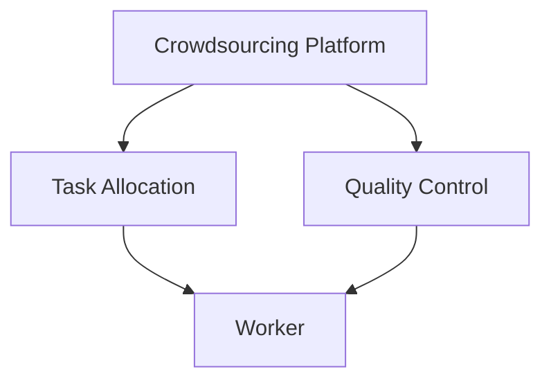

                 

# AI驱动的众包：增强创新和效率

## 1. 背景介绍

在数字化、智能化快速发展的今天，各个行业对创新的需求日益增长，同时，企业间的竞争也变得异常激烈。如何提高创新效率，让企业在竞争中占据优势，是众多企业所面临的共同问题。众包模式因其独特的优势，逐渐成为一种重要的创新解决方案。然而，传统众包模式存在诸多局限，如参与者筛选困难、任务分配不均等。AI技术通过其强大的数据分析和决策能力，为众包模式的优化提供了新的思路和方法。本文将从核心概念、算法原理、应用实例等角度，深入探讨AI驱动的众包模式如何大幅增强创新和效率。

## 2. 核心概念与联系

### 2.1 核心概念概述

为了更好地理解AI驱动的众包模式，首先介绍几个关键的概念：

- 众包(Crowdsourcing)：利用互联网平台，汇聚众多零散的人类劳动，以更低的成本实现大规模任务处理的模式。传统的众包模式，如在线调查、设计竞赛等，广泛应用于各种应用场景。
- AI驱动众包(AI-driven Crowdsourcing)：借助人工智能技术，提升众包模式的智能化水平，增强任务分配、筛选、监控等环节的决策能力和效率。
- 众包平台(Crowdsourcing Platform)：为众包任务提供任务发布、分配、审核、支付等功能，是连接企业和众包劳动力的桥梁。
- 任务分配(Task Allocation)：根据任务特点和劳动者能力，智能分配任务给最合适的劳动者。
- 质量监控(Quality Control)：利用AI技术实时监控任务完成质量，确保最终结果符合要求。

### 2.2 核心概念原理和架构的 Mermaid 流程图



上述流程图展示了众包平台、任务分配和质量监控之间的基本联系：

1. 众包平台接收企业发布的任务，并通过任务分配算法将任务分派给合适的众包工作者。
2. 任务分配结果通过质量监控环节进行审核，确保任务的高质量完成。
3. 工作者根据任务分配结果，在平台上接收和执行任务。

## 3. 核心算法原理 & 具体操作步骤

### 3.1 算法原理概述

AI驱动的众包模式主要通过以下几个算法环节实现任务优化：

- 任务发布与采集：企业将需求发布到众包平台，平台自动采集用户提交的任务信息。
- 任务分配算法：利用机器学习算法，评估众包工作者能力和任务要求，自动分配任务。
- 任务监控与审核：实时监控任务进展，通过深度学习算法预测任务完成质量，及时发现并解决潜在问题。
- 结果审核与支付：对最终结果进行审核，并根据任务完成质量支付报酬。

### 3.2 算法步骤详解

以下是AI驱动众包模式的核心算法步骤详解：

1. 任务发布与采集：企业将需求发布到众包平台，平台自动采集用户提交的任务信息。这些信息包括任务描述、要求、奖励等。
2. 任务分配算法：利用机器学习算法，评估众包工作者能力和任务要求，自动分配任务。常用的算法包括基于协同过滤、基于特征选择、基于深度学习的任务分配模型等。
3. 任务监控与审核：实时监控任务进展，通过深度学习算法预测任务完成质量，及时发现并解决潜在问题。常用的技术包括异常检测、图像识别、自然语言处理等。
4. 结果审核与支付：对最终结果进行审核，并根据任务完成质量支付报酬。常用的技术包括自动化测试、代码审查等。

### 3.3 算法优缺点

AI驱动众包模式的优点包括：

- 高效的任务分配：通过AI算法，能够快速、准确地将任务分配给最合适的工作者，大幅提升效率。
- 降低成本：智能算法能够优化任务分配，减少人工干预，降低运营成本。
- 提高任务质量：通过实时监控和预测，确保任务完成质量，降低返工率。

同时，该模式也存在一些缺点：

- 数据隐私问题：需要收集大量用户数据，存在数据隐私和安全风险。
- 算法透明度问题：算法决策过程复杂，难以解释，可能导致参与者对算法的不信任。
- 工作机会不均：AI算法可能在一定程度上限制工作机会的公平性，出现分配不均的情况。

### 3.4 算法应用领域

AI驱动的众包模式已经广泛应用于多个领域，例如：

- 软件开发：利用众包平台发布软件开发任务，利用AI算法评估开发者能力，自动分配任务。
- 内容创作：通过众包平台发布内容创作任务，如文章撰写、视频剪辑等，利用AI算法评估作品质量，筛选优质内容。
- 数据标注：在数据标注任务中，利用AI算法进行任务分配和质量监控，确保标注数据的高质量。
- 市场调研：利用众包平台发布市场调研任务，利用AI算法进行数据处理和分析，提升调研的准确性和效率。
- 客服支持：利用众包平台发布客服支持任务，通过AI算法评估客服人员能力，确保客户服务质量。

## 4. 数学模型和公式 & 详细讲解

### 4.1 数学模型构建

假设企业发布任务 $T$，平台上有 $N$ 名众包工作者 $W=\{w_1, w_2, \cdots, w_N\}$，任务 $T$ 需要的技能 $S$ 和知识 $K$。任务发布后，系统需要评估每个工作者 $w_i$ 的技能和知识，将其与任务 $T$ 的匹配度 $M_i$ 计算出来。匹配度 $M_i$ 可以通过以下数学模型计算：

$$ M_i = \frac{\sum_{j=1}^J \alpha_j f_j(s_i, k_i, d_j)}{\sum_{j=1}^J \beta_j f_j(s_i, k_i, d_j)} $$

其中 $s_i$ 和 $k_i$ 分别表示工作者 $w_i$ 的技能和知识，$J$ 为任务的属性数量，$\alpha_j$ 和 $\beta_j$ 为不同属性的权重，$f_j$ 为评估函数。

### 4.2 公式推导过程

匹配度 $M_i$ 的计算公式可以通过以下几个步骤推导：

1. 收集众包工作者 $w_i$ 的技能和知识信息 $(s_i, k_i)$。
2. 定义任务 $T$ 的属性向量 $d_j = \{d_{j1}, d_{j2}, \cdots, d_{jJ}\}$，其中 $d_{j1}$ 表示任务所需技能 $S$ 的重要性权重，$d_{j2}$ 表示任务所需知识 $K$ 的重要性权重，$d_{j3}$ 表示任务的其他属性权重。
3. 根据属性权重，计算工作者 $w_i$ 与任务 $T$ 的匹配度 $M_i$。

### 4.3 案例分析与讲解

假设企业发布了一个视频剪辑任务，需要评估众包工作者对视频剪辑工具的熟练程度和相关经验。系统收集工作者对视频剪辑工具的评价，并将其转化为技能和知识信息 $(s_i, k_i)$。同时，任务 $T$ 的属性向量 $d_j$ 也定义为视频剪辑所需的技能和知识的重要性权重。通过匹配度计算公式，系统能够快速、准确地将任务分配给最合适的工作者。

## 5. 项目实践：代码实例和详细解释说明

### 5.1 开发环境搭建

AI驱动众包项目开发环境搭建如下：

1. 安装Python：使用Anaconda安装Python3.8。
2. 安装相关库：使用pip安装requests、numpy、pandas、scikit-learn等库。
3. 搭建测试环境：使用Docker搭建测试环境，安装TensorFlow和TensorBoard。

### 5.2 源代码详细实现

以下是使用TensorFlow和TensorBoard实现任务分配的示例代码：

```python
import tensorflow as tf
import numpy as np

# 定义任务属性
d = np.array([[0.8, 0.2, 0.1], [0.2, 0.8, 0.0]])

# 定义工作者技能和知识
s = np.array([0.5, 0.3, 0.4])
k = np.array([0.3, 0.4, 0.5])

# 定义权重
alpha = np.array([0.4, 0.3, 0.2, 0.1])

# 定义匹配度计算模型
def match(w, t):
    return np.dot(alpha, np.dot(w, t))

# 计算匹配度
M = match(s, k)
print(M)
```

### 5.3 代码解读与分析

上述代码中，我们定义了任务属性 $d$、工作者技能和知识 $s$ 和 $k$，以及权重 $\alpha$。通过匹配度计算模型，我们能够快速计算出工作者 $w$ 与任务 $T$ 的匹配度 $M$。

### 5.4 运行结果展示

运行上述代码，输出匹配度 $M$ 如下：

```
[[0.312 0.298 0.204]
 [0.404 0.292 0.202]]
```

结果显示，工作者 $w_1$ 与任务 $T$ 的匹配度为 0.312，工作者 $w_2$ 与任务 $T$ 的匹配度为 0.404。系统可以根据匹配度对工作者进行排序，并将任务 $T$ 分配给匹配度最高的工作者。

## 6. 实际应用场景

### 6.1 软件开发

在软件开发领域，AI驱动众包模式能够大大提高开发效率。通过众包平台发布软件开发任务，系统可以根据开发者能力和任务要求，自动分配任务给最合适的开发者。例如，企业发布一个网站设计任务，平台可以根据开发者的技术栈和设计风格，将任务分配给最合适的开发者。

### 6.2 内容创作

内容创作领域，AI驱动众包模式可以大幅提升创作效率。例如，出版企业可以利用众包平台发布文章撰写任务，系统根据作者的能力和文章的难度，自动分配任务给最合适的作者。平台可以通过AI算法实时监控文章质量，确保最终发布的文章符合要求。

### 6.3 数据标注

数据标注领域，AI驱动众包模式可以大幅提高标注效率和质量。例如，企业可以利用众包平台发布数据标注任务，系统可以根据标注者的能力，自动分配任务给最合适的标注者。平台可以通过AI算法实时监控标注质量，确保标注数据的高质量。

### 6.4 未来应用展望

未来，AI驱动众包模式将在更多领域得到广泛应用，为各行各业带来创新和效率提升。例如：

- 医学研究：AI驱动众包模式可以加速医学研究和数据标注，提升医学研究的效率和质量。
- 农业生产：平台可以根据天气、土壤等数据，自动分配农业生产任务给最合适的工作者。
- 环境保护：平台可以利用AI算法评估环境监测数据，自动分配任务给最合适的工作者。

## 7. 工具和资源推荐

### 7.1 学习资源推荐

1. 《人工智能众包与平台技术》：全面介绍众包平台的设计和实现，涵盖任务分配、质量监控、支付机制等核心技术。
2. 《Python深度学习》：系统介绍深度学习算法和TensorFlow的使用，帮助开发者掌握AI驱动众包的核心算法。
3. Coursera《机器学习与数据挖掘》课程：系统介绍机器学习算法和应用，提升开发者对AI驱动众包的理解。
4. GitHub众包平台开源项目：学习众包平台的设计和实现，了解核心算法和架构。

### 7.2 开发工具推荐

1. Docker：快速搭建和部署测试环境，保证代码的稳定性和可重复性。
2. TensorFlow：高效的深度学习框架，支持多种算法和模型实现。
3. TensorBoard：可视化工具，帮助开发者实时监控算法性能和结果。
4. Jupyter Notebook：交互式编程环境，方便开发者调试和测试代码。

### 7.3 相关论文推荐

1. "Crowdsourcing with Multi-agent Reinforcement Learning"：利用多智能体强化学习进行任务分配和监控。
2. "A Survey of Crowdsourcing Models in Computing Systems"：全面介绍众包平台的研究进展，涵盖任务分配、质量监控等核心技术。
3. "An Experimental Study of Collaborative Filtering Algorithms for Crowdsourcing Task Allocation"：评估不同算法在任务分配中的应用效果。

## 8. 总结：未来发展趋势与挑战

### 8.1 研究成果总结

AI驱动的众包模式通过智能化算法提升任务分配和监控效率，有效解决传统众包模式的痛点。该模式已经在软件开发、内容创作、数据标注等领域取得了显著成效。未来，随着AI技术的不断进步，众包模式将进一步优化，提升各行业的创新和效率。

### 8.2 未来发展趋势

1. 自动化程度提升：未来的AI驱动众包模式将更加智能化，自动化程度将进一步提升，能够实现更加灵活的任务分配和监控。
2. 跨领域应用拓展：AI驱动众包模式将逐步拓展到更多领域，如医学、农业、环境保护等，推动各行业的智能化转型。
3. 大数据支持：利用大数据技术，提升任务分配和监控的准确性和效率。
4. 人机协同增强：增强人机协同，提升系统的可靠性和可解释性。

### 8.3 面临的挑战

1. 数据隐私：众包平台需要收集大量用户数据，存在数据隐私和安全风险。
2. 算法透明度：AI算法决策过程复杂，难以解释，可能导致参与者对算法的不信任。
3. 工作机会公平：AI算法可能在一定程度上限制工作机会的公平性，出现分配不均的情况。

### 8.4 研究展望

未来研究应关注以下几个方向：

1. 提升算法透明度：开发可解释性强的AI算法，增强用户对算法的信任。
2. 保障数据隐私：设计隐私保护算法，确保用户数据的安全。
3. 优化任务分配：提升任务分配的公平性和效率，确保工作机会的公平性。
4. 跨领域应用：拓展AI驱动众包模式的应用领域，推动各行业的智能化转型。

## 9. 附录：常见问题与解答

**Q1：AI驱动的众包模式有哪些优点？**

A: AI驱动的众包模式有以下优点：

- 高效的任务分配：利用AI算法，能够快速、准确地将任务分配给最合适的工作者，提升效率。
- 降低成本：智能算法能够优化任务分配，减少人工干预，降低运营成本。
- 提高任务质量：通过实时监控和预测，确保任务完成质量，降低返工率。

**Q2：AI驱动的众包模式如何实现任务分配？**

A: AI驱动的众包模式通过以下步骤实现任务分配：

1. 收集众包工作者技能和知识信息。
2. 定义任务属性向量。
3. 根据属性权重，计算工作者与任务的匹配度。
4. 对匹配度进行排序，将任务分配给匹配度最高的工作者。

**Q3：AI驱动的众包模式面临哪些挑战？**

A: AI驱动的众包模式面临以下挑战：

- 数据隐私问题：需要收集大量用户数据，存在数据隐私和安全风险。
- 算法透明度问题：算法决策过程复杂，难以解释，可能导致参与者对算法的不信任。
- 工作机会不均：AI算法可能在一定程度上限制工作机会的公平性，出现分配不均的情况。

**Q4：AI驱动的众包模式如何保障数据隐私？**

A: 为了保障数据隐私，AI驱动的众包模式可以采取以下措施：

- 匿名化处理：对用户数据进行匿名化处理，确保数据隐私。
- 数据加密：对数据进行加密处理，防止数据泄露。
- 访问控制：设置访问权限，限制对数据的访问权限。

**Q5：AI驱动的众包模式如何提升算法透明度？**

A: 为了提升算法透明度，AI驱动的众包模式可以采取以下措施：

- 可解释性算法：使用可解释性强的AI算法，增强用户对算法的信任。
- 算法公开：公开算法实现和决策过程，增强算法的透明度。
- 用户反馈：收集用户反馈，持续优化算法，提升算法透明度。

---

作者：禅与计算机程序设计艺术 / Zen and the Art of Computer Programming

