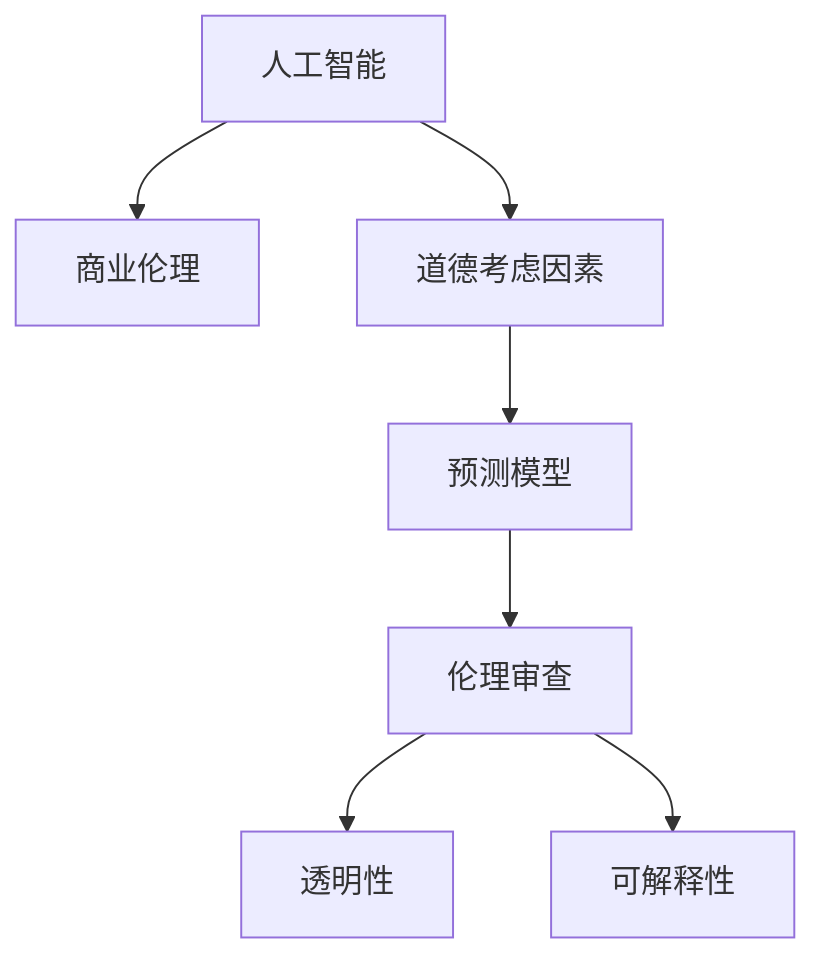

                 

# AI驱动的创新：人类计算在商业中的道德考虑因素预测

> 关键词：人工智能，道德考虑因素，商业应用，数据分析，预测模型，伦理审查，透明性，可解释性

## 1. 背景介绍

### 1.1 问题由来
随着人工智能(AI)技术在商业领域的应用日益广泛，利用AI进行数据驱动决策的趋势正成为新常态。从供应链管理到市场营销，再到客户服务，AI正逐步重塑企业的运营模式。然而，伴随AI技术应用的深入，其潜在的道德风险和伦理问题也逐步显现。

### 1.2 问题核心关键点
AI在商业应用中的道德考虑因素预测，是当前研究的热点问题。预测这些因素，有助于企业更早发现并规避潜在的伦理风险，确保AI技术在商业中的正面应用。这不仅有助于企业构建更加公平、透明和可信赖的AI系统，还能提升公众对AI技术的接受度和信任度。

### 1.3 问题研究意义
研究AI在商业应用中的道德考虑因素预测，对提升AI技术的伦理性应用具有重要意义：

1. **提升企业决策的公平性**：通过预测和规避伦理风险，确保AI决策的公正性和公平性。
2. **增强系统透明性**：使企业AI系统更透明，便于审查和监管。
3. **提升公众信任度**：增强AI技术的可信度和可接受度，减少社会对AI技术的误解和抵触。
4. **促进技术健康发展**：推动AI技术的健康发展和可持续发展。
5. **优化商业策略**：帮助企业制定更加符合伦理规范的商业策略，提升市场竞争力。

## 2. 核心概念与联系

### 2.1 核心概念概述

为更好地理解AI在商业应用中的道德考虑因素预测，本节将介绍几个密切相关的核心概念：

- **人工智能(AI)**：通过算法和计算模型，赋予机器学习、推理和自我校正能力的技术。
- **商业伦理**：企业在商业活动中遵循的道德规范和行为准则。
- **道德考虑因素**：影响AI系统道德性能的各种因素，包括偏见、透明性、可解释性等。
- **预测模型(Predictive Modeling)**：使用历史数据训练机器学习模型，预测未来事件的方法。
- **伦理审查(Ethical Review)**：评估AI系统伦理性能的审查过程。
- **透明性(Transparency)**：AI系统决策过程的可理解和可解释性。
- **可解释性(Explainability)**：AI系统输出的合理性和逻辑性。

这些核心概念之间的逻辑关系可以通过以下Mermaid流程图来展示：



这个流程图展示了一系列核心概念及其之间的相互关系：

1. AI技术通过学习和推理，成为商业决策的工具。
2. 商业伦理要求AI系统决策的公正和合理。
3. 道德考虑因素是预测AI系统伦理性能的关键。
4. 预测模型通过训练数据，对AI系统的伦理风险进行预测。
5. 伦理审查评估预测模型的结果，保证AI系统的道德性能。
6. 透明性和可解释性是伦理审查的重要依据。

这些概念共同构成了AI技术在商业应用中的伦理考量框架，确保AI技术的公正性、透明性和可解释性。

## 3. 核心算法原理 & 具体操作步骤
### 3.1 算法原理概述

AI在商业应用中的道德考虑因素预测，本质上是一个数据驱动的机器学习任务。其核心思想是：通过分析历史数据中的道德相关因素，构建预测模型，预测未来AI系统在特定场景下的道德表现。

形式化地，假设已收集到 $N$ 个历史事件 $E=\{e_i\}_{i=1}^N$，其中每个事件 $e_i$ 包含 $M$ 个特征 $x_{i1},x_{i2},...,x_{iM}$，以及一个道德评分 $y_i \in [0,1]$。预测模型的目标是找到一个函数 $f: \mathbb{R}^M \rightarrow [0,1]$，使得对于任意新的事件 $e$，模型能够准确预测其道德评分 $y$。

### 3.2 算法步骤详解

AI在商业应用中的道德考虑因素预测，一般包括以下几个关键步骤：

**Step 1: 数据收集与预处理**
- 收集企业历史上涉及道德考虑因素的事件数据，如种族歧视、数据泄露、算法偏见等。
- 对数据进行清洗、标注、划分训练集、验证集和测试集。

**Step 2: 特征工程**
- 对数据进行特征提取和工程处理，如特征选择、降维、归一化等。
- 构建用于预测的特征集合，如特征交叉、时间窗口等。

**Step 3: 模型选择与训练**
- 选择合适的预测模型，如线性回归、决策树、随机森林、梯度提升树、神经网络等。
- 使用训练集数据训练模型，并通过交叉验证调整超参数。

**Step 4: 性能评估与调优**
- 在验证集上评估模型性能，如准确率、召回率、F1分数等。
- 根据评估结果进行模型调优，选择最优模型。

**Step 5: 伦理审查与部署**
- 进行伦理审查，确保预测模型的道德表现。
- 将最优模型部署到商业系统中，监控其道德表现。
- 定期更新模型，保持其道德性能。

以上是AI在商业应用中道德考虑因素预测的一般流程。在实际应用中，还需要针对具体问题，对数据处理、特征选择、模型优化等环节进行优化设计，以进一步提升模型的预测精度和伦理表现。

### 3.3 算法优缺点

AI在商业应用中的道德考虑因素预测方法，具有以下优点：

1. **数据驱动**：通过历史数据训练预测模型，能较为准确地预测未来的伦理风险。
2. **可解释性强**：预测模型的特征和参数容易解释，便于伦理审查。
3. **系统透明性高**：模型的决策过程透明，便于监控和审查。
4. **泛化能力强**：模型基于广泛的历史数据训练，具有一定的泛化能力。

同时，该方法也存在一定的局限性：

1. **依赖历史数据**：模型预测性能很大程度上依赖于历史数据的质量和数量，数据不充分或偏差可能会影响预测结果。
2. **模型偏见**：预测模型可能会学习到数据中的偏见，导致预测结果的不公平性。
3. **动态变化**：商业环境快速变化，预测模型的道德表现可能随着时间的推移而失效。
4. **计算资源需求高**：训练和部署预测模型需要大量计算资源，且模型更新和维护成本较高。

尽管存在这些局限性，但就目前而言，数据驱动的预测方法仍是商业AI伦理风险预测的主流范式。未来相关研究的重点在于如何进一步降低对历史数据的依赖，提高模型的少样本学习和跨领域迁移能力，同时兼顾可解释性和伦理安全性等因素。

### 3.4 算法应用领域

AI在商业应用中的道德考虑因素预测，已经在多个领域得到了广泛应用，包括但不限于：

- **金融风控**：预测AI算法可能导致的金融风险，如数据泄露、算法偏见等。
- **医疗健康**：预测AI在诊断和治疗过程中可能涉及的伦理问题，如隐私保护、医疗公平等。
- **人力资源**：预测AI在招聘和人事管理中可能存在的偏见和歧视问题。
- **市场营销**：预测AI在用户行为分析中可能涉及的伦理问题，如隐私侵犯、数据滥用等。
- **智能制造**：预测AI在自动化生产中可能导致的伦理问题，如劳动权益、安全保障等。

除了上述这些经典应用外，AI在商业伦理预测的应用领域还在不断拓展，如公共安全、智慧城市、环境保护等，为商业伦理治理提供了新的技术手段。

## 4. 数学模型和公式 & 详细讲解 & 举例说明

### 4.1 数学模型构建

本节将使用数学语言对AI在商业应用中的道德考虑因素预测过程进行更加严格的刻画。

记已收集到的历史事件 $E=\{e_i\}_{i=1}^N$，其中每个事件 $e_i$ 包含 $M$ 个特征 $x_{i1},x_{i2},...,x_{iM}$，以及一个道德评分 $y_i \in [0,1]$。假设预测模型的数学表达式为：

$$
f(x) = w^T\varphi(x) + b
$$

其中 $w$ 为模型权重向量，$\varphi(x)$ 为特征映射函数，$b$ 为偏置项。

### 4.2 公式推导过程

以下我们以决策树模型为例，推导其预测公式和评估指标。

假设使用决策树模型对道德评分 $y$ 进行预测，构建树结构 $T$。对于任意新事件 $e$，在树结构 $T$ 下，计算其道德评分 $y$ 的预测值为：

$$
\hat{y} = f(x) = \sum_{i=1}^n w_i g_i(x)
$$

其中 $w_i$ 为第 $i$ 个特征的权重，$g_i(x)$ 为第 $i$ 个特征对应的决策树模型，$n$ 为特征总数。

假设预测模型的误差为 $e$，则平均绝对误差(MAE)和均方误差(MSE)分别定义为：

$$
MAE = \frac{1}{N} \sum_{i=1}^N |\hat{y}_i - y_i|
$$

$$
MSE = \frac{1}{N} \sum_{i=1}^N (\hat{y}_i - y_i)^2
$$

在实际应用中，我们需要通过历史数据集 $D$ 来训练预测模型 $f(x)$，并在测试集上评估其预测性能，以保证模型的泛化能力。

### 4.3 案例分析与讲解

假设我们正在分析一家银行的客户服务数据，目标是预测AI在客户服务中可能涉及的道德问题。我们的数据集包含客户类型、服务内容、服务时间等特征。

我们首先使用决策树模型进行训练，并通过交叉验证调整超参数。模型训练完成后，我们将其部署到生产环境中，并在实时客户服务数据上进行测试，计算其预测准确率、召回率和F1分数等指标。同时，我们还需要定期进行伦理审查，确保模型预测的道德评分与真实情况相符。

## 5. 项目实践：代码实例和详细解释说明
### 5.1 开发环境搭建

在进行商业AI伦理预测实践前，我们需要准备好开发环境。以下是使用Python进行Scikit-learn开发的环境配置流程：

1. 安装Anaconda：从官网下载并安装Anaconda，用于创建独立的Python环境。

2. 创建并激活虚拟环境：
```bash
conda create -n ethics-env python=3.8 
conda activate ethics-env
```

3. 安装Scikit-learn：
```bash
conda install scikit-learn
```

4. 安装各类工具包：
```bash
pip install pandas numpy matplotlib scikit-learn seaborn tqdm jupyter notebook ipython
```

完成上述步骤后，即可在`ethics-env`环境中开始伦理预测实践。

### 5.2 源代码详细实现

这里我们以决策树模型为例，给出使用Scikit-learn进行商业AI伦理预测的Python代码实现。

首先，定义数据处理函数：

```python
from sklearn.model_selection import train_test_split
from sklearn.metrics import classification_report, mean_absolute_error, mean_squared_error

def preprocess_data(X, y):
    X_train, X_test, y_train, y_test = train_test_split(X, y, test_size=0.2, random_state=42)
    return X_train, X_test, y_train, y_test

def train_model(X_train, y_train):
    model = DecisionTreeRegressor()
    model.fit(X_train, y_train)
    return model

def evaluate_model(model, X_test, y_test):
    y_pred = model.predict(X_test)
    mae = mean_absolute_error(y_test, y_pred)
    mse = mean_squared_error(y_test, y_pred)
    report = classification_report(y_test, y_pred, output_dict=True)
    return mae, mse, report
```

然后，定义训练和评估函数：

```python
from sklearn.model_selection import GridSearchCV
from sklearn.tree import DecisionTreeRegressor
from sklearn.metrics import mean_absolute_error, mean_squared_error

def train_model(X_train, y_train):
    model = DecisionTreeRegressor()
    param_grid = {'max_depth': [3, 5, 7, 9], 'min_samples_split': [2, 5, 10], 'min_samples_leaf': [1, 2, 4]}
    grid_search = GridSearchCV(model, param_grid, cv=5, scoring='neg_mean_squared_error')
    grid_search.fit(X_train, y_train)
    model = grid_search.best_estimator_
    return model

def evaluate_model(model, X_test, y_test):
    y_pred = model.predict(X_test)
    mae = mean_absolute_error(y_test, y_pred)
    mse = mean_squared_error(y_test, y_pred)
    report = classification_report(y_test, y_pred, output_dict=True)
    return mae, mse, report
```

最后，启动训练流程并在测试集上评估：

```python
X_train, X_test, y_train, y_test = preprocess_data(X, y)
model = train_model(X_train, y_train)
mae, mse, report = evaluate_model(model, X_test, y_test)
print(f"MAE: {mae:.2f}, MSE: {mse:.2f}, Classification Report:\n{report}")
```

以上就是使用Scikit-learn对决策树模型进行商业AI伦理预测的完整代码实现。可以看到，通过Scikit-learn，模型的训练和评估变得相对简单，开发者可以专注于特征工程和超参数调优等关键环节。

### 5.3 代码解读与分析

让我们再详细解读一下关键代码的实现细节：

**preprocess_data函数**：
- 使用Scikit-learn的train_test_split方法，将数据集划分为训练集和测试集。

**train_model函数**：
- 创建决策树模型，并使用GridSearchCV进行超参数调优。

**evaluate_model函数**：
- 使用模型在测试集上预测道德评分，计算MAE和MSE，并使用classification_report函数输出模型预测的分类报告。

**训练流程**：
- 首先定义特征工程函数，将数据集分为训练集和测试集。
- 然后定义训练函数，使用GridSearchCV调整决策树模型的超参数。
- 最后定义评估函数，使用测试集评估模型性能，并输出评估结果。

可以看到，Scikit-learn提供的简单易用的接口，使得商业AI伦理预测的开发变得更加便捷和高效。

## 6. 实际应用场景
### 6.1 智能制造

基于AI在商业应用中的道德考虑因素预测，可以应用于智能制造领域，预测AI在自动化生产中可能涉及的伦理问题。

具体而言，我们可以收集智能制造系统的运行数据，如生产效率、能源消耗、设备状态等。通过分析这些数据，构建预测模型，预测AI在生产过程中的潜在伦理风险，如劳动权益、安全保障等。预测结果可以帮助企业优化生产流程，减少潜在的伦理风险，提升生产的可持续性和社会责任。

### 6.2 智慧城市

在智慧城市治理中，AI伦理预测可以用于预测AI在城市管理中的应用效果和潜在问题。

通过收集智慧城市的数据，如交通流量、公共安全、环境监测等，预测AI在城市运行中的伦理风险。预测结果可以用于优化城市管理策略，提升城市智能化水平，保障公众利益，促进城市可持续发展。

### 6.3 金融风控

金融行业的AI伦理预测可以应用于防范AI算法可能导致的金融风险，如数据泄露、算法偏见等。

收集金融行业的历史数据，构建预测模型，预测AI在金融服务中的应用效果和潜在伦理问题。预测结果可以帮助金融机构识别和规避潜在的风险，确保AI技术的公正性和透明性。

### 6.4 未来应用展望

随着AI技术的不断发展，基于伦理预测的AI应用将逐步深入到更多领域。未来，AI伦理预测将可能被广泛应用于公共安全、环境保护、智慧医疗等领域，为社会治理和可持续发展提供重要支撑。

## 7. 工具和资源推荐
### 7.1 学习资源推荐

为了帮助开发者系统掌握AI伦理预测的理论基础和实践技巧，这里推荐一些优质的学习资源：

1. 《Python数据科学手册》系列博文：由数据科学专家撰写，深入浅出地介绍了Python在数据分析、机器学习等方面的应用。

2. 《机器学习实战》课程：由Coursera提供的入门课程，涵盖机器学习的基本概念和算法，适合初学者学习。

3. 《深度学习入门》书籍：DeepLearning.AI的深度学习入门课程配套教材，全面介绍了深度学习的基本原理和应用。

4. 《人工智能伦理》课程：斯坦福大学的伦理课程，讨论AI技术的伦理和社会影响。

5. 《数据伦理与治理》书籍：全面介绍数据伦理和治理的理论和实践，帮助企业建立数据伦理管理体系。

通过对这些资源的学习实践，相信你一定能够快速掌握AI伦理预测的精髓，并用于解决实际的AI问题。

### 7.2 开发工具推荐

高效的开发离不开优秀的工具支持。以下是几款用于AI伦理预测开发的常用工具：

1. Scikit-learn：开源的Python机器学习库，提供丰富的预测模型和评估指标。

2. TensorFlow：由Google主导的深度学习框架，支持分布式训练和高效的模型部署。

3. PyTorch：开源的深度学习框架，灵活的计算图和易用的API，适合快速迭代研究。

4. Weights & Biases：模型训练的实验跟踪工具，可以记录和可视化模型训练过程中的各项指标，方便对比和调优。

5. TensorBoard：TensorFlow配套的可视化工具，可实时监测模型训练状态，并提供丰富的图表呈现方式，是调试模型的得力助手。

6. Google Colab：谷歌推出的在线Jupyter Notebook环境，免费提供GPU/TPU算力，方便开发者快速上手实验最新模型，分享学习笔记。

合理利用这些工具，可以显著提升AI伦理预测的开发效率，加快创新迭代的步伐。

### 7.3 相关论文推荐

AI伦理预测技术的发展源于学界的持续研究。以下是几篇奠基性的相关论文，推荐阅读：

1. "On the ethics of artificial intelligence and life" by Nick Bostrom：讨论AI伦理和生命价值的关系。

2. "Artificial Intelligence: A Guide for Thinking Humans" by Melanie Mitchell：全面介绍AI技术的伦理和社会影响。

3. "Ethical considerations for the development and deployment of artificial intelligence" by Joan Potter：探讨AI发展的伦理问题。

4. "AI for All" by Raj Reddy：探讨AI技术对人类社会的影响。

5. "Building a fairness-aware deep learning framework" by So-Young Park：提出公平性指导的深度学习框架。

这些论文代表了大语言模型微调技术的发展脉络。通过学习这些前沿成果，可以帮助研究者把握学科前进方向，激发更多的创新灵感。

## 8. 总结：未来发展趋势与挑战

### 8.1 总结

本文对AI在商业应用中的道德考虑因素预测方法进行了全面系统的介绍。首先阐述了AI技术在商业领域的应用前景和伦理挑战，明确了预测这些因素在确保AI系统道德性能方面的重要性。其次，从原理到实践，详细讲解了预测模型的构建和训练过程，给出了商业AI伦理预测的完整代码实例。同时，本文还广泛探讨了伦理预测在多个行业领域的应用前景，展示了其广泛的应用潜力。

通过本文的系统梳理，可以看到，AI在商业应用中的伦理考虑因素预测，正在成为AI技术健康发展的关键环节。在AI技术的持续演进过程中，如何提升伦理预测的精度和可信度，规避潜在的道德风险，将是大规模商业应用中必须面对的重要课题。

### 8.2 未来发展趋势

展望未来，AI在商业应用中的道德考虑因素预测将呈现以下几个发展趋势：

1. **预测精度提升**：随着数据的积累和算法的优化，预测模型的准确性将逐步提升，能够更精准地预测伦理风险。

2. **泛化能力增强**：预测模型将能够更好地处理跨领域、跨行业的伦理问题，提升应用的普适性。

3. **动态适应**：预测模型将具备动态更新和自适应能力，能够实时响应商业环境的变化。

4. **多模态融合**：预测模型将融合文本、图像、语音等多模态数据，提升对复杂伦理问题的理解能力。

5. **透明性和可解释性**：预测模型的决策过程将更加透明和可解释，便于伦理审查和公众监督。

6. **伦理审查自动化**：通过AI技术进行伦理审查，减少人工审查的复杂性和成本。

以上趋势凸显了AI伦理预测技术的发展方向，这些方向的探索发展，必将进一步提升AI系统的道德性能，推动AI技术的健康发展。

### 8.3 面临的挑战

尽管AI伦理预测技术已经取得了一定的进展，但在迈向更加智能化、普适化应用的过程中，它仍面临着诸多挑战：

1. **数据质量**：数据的不充分、偏差或不平衡，可能导致预测结果的不准确。
2. **模型偏见**：模型可能学习到数据中的偏见，导致预测结果的不公正。
3. **隐私保护**：商业数据往往涉及隐私，如何在保护隐私的前提下进行预测，是重要的伦理问题。
4. **计算资源**：预测模型的训练和部署需要大量计算资源，成本较高。
5. **动态变化**：商业环境快速变化，预测模型的伦理表现可能随着时间的推移而失效。
6. **技术复杂性**：伦理预测涉及多学科知识，技术实现复杂。

尽管存在这些挑战，但通过不断的研究和探索，AI伦理预测技术仍然有望在未来得到进一步突破和应用。

### 8.4 研究展望

面对AI伦理预测面临的种种挑战，未来的研究需要在以下几个方面寻求新的突破：

1. **多源数据融合**：将多种数据源融合，提高预测模型的全面性和准确性。
2. **隐私保护技术**：开发隐私保护技术，确保数据安全，保护用户隐私。
3. **公平性算法**：设计公平性算法，消除模型偏见，提升预测模型的公正性。
4. **实时预测系统**：构建实时预测系统，及时响应伦理问题，保障商业运行的稳定性。
5. **伦理审查机制**：建立伦理审查机制，确保预测模型的道德表现。

这些研究方向的探索，将有助于提升AI技术的伦理性应用，确保其在商业领域的安全、公正、透明和可控。未来，随着AI技术的不断发展，基于伦理预测的AI应用将进一步深入到更多领域，为社会治理和可持续发展提供重要支撑。

## 9. 附录：常见问题与解答

**Q1: AI在商业应用中的道德考虑因素预测是否适用于所有NLP任务？**

A: AI在商业应用中的道德考虑因素预测，主要用于预测AI系统在特定任务中的伦理表现，而非NLP任务的本身。因此，该方法适用于大多数需要伦理审查和道德评估的任务，如金融风控、医疗健康、智能制造等。

**Q2: 在商业应用中，如何选择合适的预测模型？**

A: 在选择预测模型时，需要考虑数据特征、任务复杂度、计算资源等因素。常见的预测模型包括线性回归、决策树、随机森林、梯度提升树、神经网络等。同时，还需要注意模型的可解释性和预测精度，选择最适合具体任务的模型。

**Q3: AI伦理预测在实际应用中如何规避风险？**

A: 规避AI伦理预测风险的关键在于：
1. 数据质量：确保训练数据的质量和代表性，避免数据偏见。
2. 模型透明性：构建可解释的预测模型，便于伦理审查。
3. 伦理审查：定期进行伦理审查，确保预测模型的道德表现。
4. 多模态融合：融合多种数据源，提升预测模型的全面性和准确性。

**Q4: 如何确保AI伦理预测的公平性和公正性？**

A: 确保AI伦理预测的公平性和公正性，可以通过以下方法：
1. 数据多样性：确保数据集的多样性和代表性，避免数据偏差。
2. 模型公平性：设计公平性算法，消除模型偏见。
3. 监督机制：引入人工监督机制，对模型输出进行审查和调整。

**Q5: 如何处理AI伦理预测中的隐私保护问题？**

A: 处理AI伦理预测中的隐私保护问题，可以通过以下方法：
1. 数据匿名化：对数据进行匿名化处理，确保数据隐私。
2. 差分隐私：引入差分隐私技术，保护个人隐私。
3. 访问控制：对数据访问进行严格控制，限制数据的使用范围。

**Q6: AI伦理预测在实际应用中如何提高模型泛化能力？**

A: 提高AI伦理预测模型的泛化能力，可以通过以下方法：
1. 数据增强：通过数据增强技术，扩充数据集的多样性。
2. 模型集成：通过模型集成技术，提升预测模型的泛化能力。
3. 超参数调优：通过超参数调优，选择最优模型参数。

这些方法的综合运用，可以有效提升AI伦理预测模型的泛化能力，确保模型在多种场景下的稳定性和可靠性。

---

作者：禅与计算机程序设计艺术 / Zen and the Art of Computer Programming

