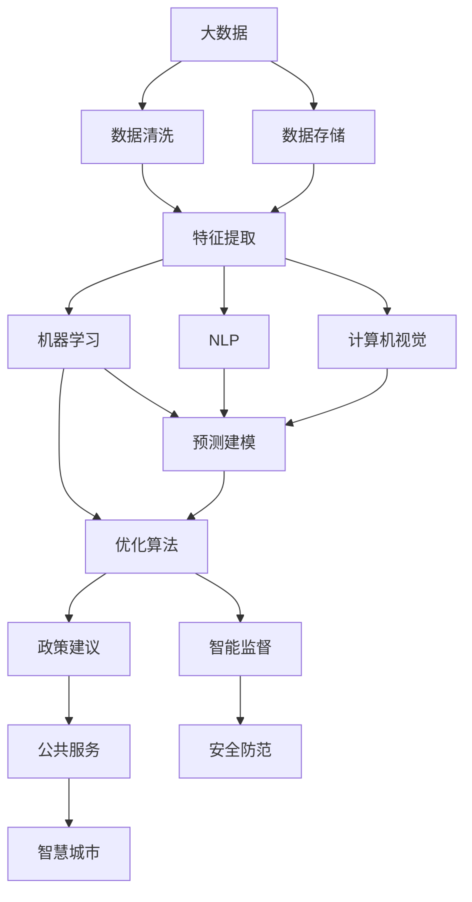

                 

# AI驱动的创新：人类计算在政府中的价值

> 关键词：AI, 政府, 人类计算, 公共政策, 决策支持, 数据驱动, 自动化, 智能治理

## 1. 背景介绍

### 1.1 问题由来
随着人工智能(AI)技术的不断进步，其在各行各业中的应用已经日益深入。然而，尽管AI带来了诸多便利，但在公共政策制定和执行过程中，其应用仍存在一些关键挑战。例如，传统政策制定依赖于数据驱动的决策支持系统，但数据质量和处理效率常常成为瓶颈。在政策执行过程中，如何高效监督和管理庞大的数据集，也是一件不易之事。

此外，政府部门往往面临着诸多复杂多变的问题，如气候变化、公共卫生、经济发展等，这些问题通常需要跨领域的知识与数据整合。如何通过AI提升政府决策和执行的智能化水平，是一个亟待解决的课题。

### 1.2 问题核心关键点
AI在政府中的应用，主要集中在以下几个方面：

- **数据驱动决策**：通过收集和分析大量数据，帮助政府决策者理解政策对社会的影响。
- **自动化与效率提升**：利用AI自动化流程，减少行政负担，提升公共服务的效率。
- **智能监督与执法**：利用AI技术进行犯罪预测、反欺诈、打击网络犯罪等，提升公共安全。
- **公共卫生管理**：通过AI进行疾病预测、资源调配等，应对公共卫生危机。
- **智慧城市建设**：通过AI优化城市交通、能源管理、环境监控等，提升城市治理水平。

这些应用不仅需要AI强大的数据分析和处理能力，还涉及到政府数据治理、政策执行、法律合规等多方面内容。因此，AI在政府中的应用不仅需要技术上的创新，更需要与政府管理的深度融合。

### 1.3 问题研究意义
研究AI在政府中的应用，对于提升政府治理能力、推动公共政策科学化、智能化，具有重要意义：

1. **提高决策质量**：AI通过大数据分析和机器学习，可以提供更加准确、全面的决策支持。
2. **提升执行效率**：AI可以自动化繁琐的行政流程，大幅提升政策执行的速度和效果。
3. **增强公共安全**：利用AI进行犯罪预测和智能监督，可以提升社会安全性和公正性。
4. **改善公共服务**：通过AI优化城市服务和基础设施管理，提升民众的生活质量。
5. **推动政府数字化转型**：AI技术的应用将推动政府从传统管理模式向数字化、智能化模式转变。

## 2. 核心概念与联系

### 2.1 核心概念概述

AI在政府中的应用涉及多个核心概念：

- **大数据**：指大规模、多样化的数据集，包含结构化和非结构化数据，如传感器数据、社交媒体、地理信息等。
- **机器学习**：通过算法让计算机从数据中学习规律，实现预测和决策。
- **自然语言处理(NLP)**：使计算机能够理解、处理和生成人类语言的技术。
- **计算机视觉**：让计算机能够“看”和“理解”图像和视频等视觉信息。
- **预测建模**：使用历史数据预测未来趋势，如疾病爆发、交通流量等。
- **优化算法**：在复杂问题中寻找最优解，如资源分配、路径规划等。

这些概念通过特定算法和框架整合，可以形成完整的AI治理方案。

### 2.2 核心概念原理和架构的 Mermaid 流程图



这个流程图展示了AI在政府应用中的主要步骤：

1. 收集和清洗大数据。
2. 进行特征提取和预处理。
3. 应用机器学习和NLP进行预测建模和优化。
4. 通过预测和优化生成政策建议。
5. 应用智能监督和预测模型提升公共服务。
6. 利用计算机视觉增强城市治理能力。

## 3. 核心算法原理 & 具体操作步骤
### 3.1 算法原理概述

AI在政府中的应用，通常需要从数据预处理、模型训练、结果应用等多个环节进行精心设计和优化。以下是基于机器学习的AI治理流程：

1. **数据收集与清洗**：从多种渠道收集原始数据，并对其进行去重、清洗和预处理。
2. **特征工程**：根据业务需求，选择合适的特征，并提取特征值。
3. **模型训练**：选择适当的算法，使用历史数据训练模型。
4. **模型评估与选择**：使用验证集评估模型效果，选择最优模型。
5. **模型部署与应用**：将模型部署到实际应用中，进行预测和优化。

### 3.2 算法步骤详解

**Step 1: 数据收集与清洗**

数据收集与清洗是AI应用的基础。以下是具体步骤：

1. **数据来源**：
   - 公共数据集，如人口普查、交通流量等。
   - 社会媒体数据，如Twitter、Facebook等。
   - 传感器数据，如空气质量、气象数据等。

2. **数据清洗**：
   - 去除噪声和重复数据。
   - 处理缺失值和异常值。
   - 数据归一化和标准化。

**Step 2: 特征工程**

特征工程是将原始数据转换为机器学习算法可以处理的特征。以下是具体步骤：

1. **特征选择**：
   - 选择与目标变量最相关的特征。
   - 去除冗余和不相关的特征。

2. **特征提取**：
   - 文本特征提取，如TF-IDF、word2vec等。
   - 图像特征提取，如SIFT、CNN等。

3. **特征变换**：
   - 数据降维，如PCA、t-SNE等。
   - 数据增强，如数据扩充、噪声注入等。

**Step 3: 模型训练**

模型训练是AI应用的核心步骤。以下是具体步骤：

1. **选择合适的算法**：
   - 分类算法，如逻辑回归、SVM、随机森林等。
   - 回归算法，如线性回归、岭回归、支持向量回归等。
   - 聚类算法，如K-means、DBSCAN等。

2. **设置训练参数**：
   - 学习率、迭代次数、正则化参数等。

3. **训练模型**：
   - 使用历史数据训练模型。
   - 使用交叉验证评估模型性能。

**Step 4: 模型评估与选择**

模型评估与选择是确保模型有效性的重要步骤。以下是具体步骤：

1. **评估指标**：
   - 准确率、召回率、F1值等。
   - ROC曲线、AUC值等。

2. **选择最优模型**：
   - 根据评估结果选择最优模型。
   - 进行模型融合，提升预测精度。

**Step 5: 模型部署与应用**

模型部署与应用是将模型转化为实际应用的最后一步。以下是具体步骤：

1. **部署环境**：
   - 选择合适的部署平台，如AWS、Google Cloud等。
   - 实现模型API，方便集成调用。

2. **性能监控**：
   - 实时监控模型性能，发现问题及时处理。
   - 进行A/B测试，不断优化模型效果。

### 3.3 算法优缺点

AI在政府中的应用具有以下优点：

1. **高效处理大规模数据**：AI可以快速处理和分析大量数据，提升决策的效率和准确性。
2. **自动化流程**：AI可以自动化许多繁琐的行政流程，减少人力成本。
3. **预测与优化**：AI能够进行复杂的预测和优化，帮助制定科学政策。

但同时，AI在政府中的应用也存在一些缺点：

1. **数据质量问题**：数据不完整、不准确会导致模型预测偏差。
2. **算法透明性不足**：AI模型通常被视为“黑盒”，难以解释其决策过程。
3. **技术依赖度高**：需要高水平的技术和数据资源支持。
4. **法律与伦理挑战**：AI的决策可能会面临法律和伦理问题，需要谨慎使用。

### 3.4 算法应用领域

AI在政府中的应用涵盖了多个领域：

- **公共政策制定**：利用数据驱动，进行政策影响评估、资源分配等。
- **社会治理**：通过智能监督和预测，打击犯罪、应对公共卫生事件等。
- **城市管理**：优化交通、能源管理、环境保护等，提升城市治理能力。
- **教育管理**：通过智能评估和个性化学习，提升教育质量。
- **医疗卫生**：进行疾病预测、资源调配等，提升公共卫生水平。
- **金融监管**：利用AI进行风险预测和欺诈检测，保护金融稳定。

## 4. 数学模型和公式 & 详细讲解  
### 4.1 数学模型构建

本节将使用数学语言对AI在政府中的应用过程进行更加严格的刻画。

假设原始数据集为 $D=\{(x_i,y_i)\}_{i=1}^N$，其中 $x$ 为特征向量，$y$ 为目标变量。使用线性回归模型进行预测，模型的形式为：

$$
y=\theta_0+\sum_{i=1}^{n}\theta_ix_i
$$

其中 $\theta=(\theta_0,\theta_1,...,\theta_n)$ 为模型参数。

线性回归模型的损失函数为：

$$
\mathcal{L}(\theta)=\frac{1}{N}\sum_{i=1}^{N}(y_i-\theta_0-\sum_{j=1}^{n}\theta_jx_{ij})^2
$$

模型的优化目标是最小化损失函数，即：

$$
\hat{\theta}=\mathop{\arg\min}_{\theta}\mathcal{L}(\theta)
$$

通过梯度下降等优化算法，求解上述最优化问题，得到最优模型参数 $\hat{\theta}$。

### 4.2 公式推导过程

以线性回归为例，推导模型的优化过程。

模型预测值为：

$$
\hat{y}=\theta_0+\sum_{i=1}^{n}\theta_ix_i
$$

损失函数为：

$$
\mathcal{L}(\theta)=\frac{1}{N}\sum_{i=1}^{N}(y_i-\hat{y}_i)^2
$$

通过链式法则，计算损失函数对参数 $\theta_j$ 的偏导数为：

$$
\frac{\partial \mathcal{L}(\theta)}{\partial \theta_j}=-\frac{2}{N}\sum_{i=1}^{N}(y_i-\hat{y}_i)x_{ij}
$$

根据梯度下降算法，更新参数 $\theta_j$：

$$
\theta_j \leftarrow \theta_j-\eta\frac{\partial \mathcal{L}(\theta)}{\partial \theta_j}
$$

其中 $\eta$ 为学习率，通常设置为一个较小的常数。

### 4.3 案例分析与讲解

以交通流量预测为例，分析AI模型的应用过程：

1. **数据收集**：
   - 收集历史交通流量数据，包括时间、路段、天气等因素。
   - 使用传感器、摄像头等收集实时交通数据。

2. **数据清洗**：
   - 去除缺失数据，处理异常值。
   - 数据归一化和标准化。

3. **特征工程**：
   - 选择影响交通流量的特征，如时间、路段、天气等。
   - 使用TF-IDF进行文本特征提取。

4. **模型训练**：
   - 使用线性回归模型进行预测。
   - 使用交叉验证评估模型性能。

5. **模型评估**：
   - 使用AUC、R-squared等评估指标。
   - 根据评估结果选择最优模型。

6. **模型部署**：
   - 实现模型API，实时预测交通流量。
   - 进行性能监控和调优。

## 5. 项目实践：代码实例和详细解释说明
### 5.1 开发环境搭建

在进行AI应用开发前，需要准备好开发环境。以下是使用Python进行Scikit-learn开发的Python环境配置流程：

1. 安装Anaconda：从官网下载并安装Anaconda，用于创建独立的Python环境。

2. 创建并激活虚拟环境：
```bash
conda create -n sklearn-env python=3.8 
conda activate sklearn-env
```

3. 安装Scikit-learn：
```bash
conda install scikit-learn
```

4. 安装各类工具包：
```bash
pip install numpy pandas scikit-learn matplotlib tqdm jupyter notebook ipython
```

完成上述步骤后，即可在`sklearn-env`环境中开始AI项目实践。

### 5.2 源代码详细实现

以下是使用Scikit-learn进行线性回归预测的代码实现：

```python
import numpy as np
from sklearn.linear_model import LinearRegression
from sklearn.model_selection import train_test_split
from sklearn.metrics import mean_squared_error

# 生成随机数据
X = np.random.randn(100, 3)
y = 2*X[:,0]+3*X[:,1]+4*X[:,2]+np.random.randn(100)

# 数据拆分
X_train, X_test, y_train, y_test = train_test_split(X, y, test_size=0.2)

# 训练模型
model = LinearRegression()
model.fit(X_train, y_train)

# 预测并评估
y_pred = model.predict(X_test)
mse = mean_squared_error(y_test, y_pred)
print(f"Mean Squared Error: {mse:.3f}")
```

以上代码展示了线性回归模型的实现过程。首先生成随机数据集，然后进行数据拆分，训练线性回归模型，最后进行预测并计算均方误差。

### 5.3 代码解读与分析

**数据生成**：
- 使用NumPy生成100个随机样本，包含3个特征和一个目标变量。

**数据拆分**：
- 使用`train_test_split`方法将数据集拆分为训练集和测试集，测试集占比20%。

**模型训练**：
- 创建线性回归模型对象。
- 使用训练集数据进行模型训练。

**模型评估**：
- 使用测试集数据进行模型预测。
- 计算预测值与真实值之间的均方误差。

## 6. 实际应用场景
### 6.1 智能交通管理

智能交通管理是AI在政府应用中的典型场景。通过AI，可以实现交通流量预测、路径优化、交通信号控制等。具体应用包括：

- **交通流量预测**：利用历史交通数据和实时数据，预测未来交通流量，帮助交通管理部门进行资源调配。
- **路径优化**：根据实时交通数据，优化路线规划，减少交通拥堵。
- **交通信号控制**：实时监测交通信号灯状态，自动调整信号灯周期，提高交通流畅度。

通过AI技术，可以实现交通管理的智能化和自动化，提升城市交通效率，减少环境污染。

### 6.2 公共卫生应急响应

AI在公共卫生应急响应中也有广泛应用。以下是具体应用：

- **疫情预测与预警**：利用历史病例数据，进行疾病预测，提前预警疫情爆发。
- **资源调配**：根据预测结果，进行医疗资源、物资调配，确保疫情防控工作高效进行。
- **舆情监测**：利用NLP技术，分析社交媒体数据，监测舆情变化，及时应对。

通过AI技术，可以提高公共卫生应急响应的精准性和效率，保障公共健康安全。

### 6.3 智慧城市建设

智慧城市建设是AI在政府应用的另一个重要领域。以下是具体应用：

- **环境监测**：利用传感器数据，监测空气质量、水质等，实现环境治理智能化。
- **能源管理**：通过智能电网，优化能源使用，减少浪费。
- **城市安全**：利用AI进行犯罪预测和智能监督，提升城市安全。

通过AI技术，可以实现智慧城市的全方面治理，提升城市居民的生活质量和幸福感。

### 6.4 未来应用展望

随着AI技术的不断发展，未来AI在政府中的应用将更加广泛和深入。以下是一些未来应用方向：

- **智能化决策支持**：通过AI进行大数据分析，提供更加科学、精准的政策决策支持。
- **自动化流程优化**：利用AI自动化行政流程，提升政府工作效率。
- **智能监督与执法**：利用AI进行犯罪预测和智能监督，提升执法效率和公正性。
- **公共服务优化**：利用AI进行智慧城市建设，提升公共服务水平。
- **数据治理与安全**：通过AI进行数据治理和隐私保护，确保数据安全。

未来AI在政府中的应用将更加注重用户体验和数据治理，推动政府治理能力的提升。

## 7. 工具和资源推荐
### 7.1 学习资源推荐

为帮助开发者系统掌握AI在政府中的应用，以下是一些优质的学习资源：

1. **Coursera《AI for Everyone》课程**：由斯坦福大学教授Andrew Ng主讲，介绍了AI的基本概念和应用。

2. **edX《Introduction to Artificial Intelligence》课程**：由麻省理工学院教授Leslie Chilvers主讲，涵盖了AI的基础理论和应用。

3. **Google AI博文**：由Google AI团队发布，介绍了AI的最新研究和应用。

4. **arXiv预印本**：包含大量的AI研究论文，是学习前沿AI技术的重要资源。

5. **书籍《Python数据科学手册》**：介绍了Python在数据科学中的应用，适合入门学习。

通过对这些资源的学习实践，相信你一定能够快速掌握AI在政府中的应用。

### 7.2 开发工具推荐

以下是几款用于AI开发的常用工具：

1. **PyTorch**：基于Python的开源深度学习框架，适合快速迭代研究。

2. **TensorFlow**：由Google主导开发的开源深度学习框架，生产部署方便，适合大规模工程应用。

3. **Scikit-learn**：用于机器学习任务的开源库，包含丰富的模型和算法。

4. **TensorBoard**：TensorFlow配套的可视化工具，可实时监测模型训练状态。

5. **Weights & Biases**：模型训练的实验跟踪工具，可以记录和可视化模型训练过程中的各项指标。

6. **Jupyter Notebook**：免费开源的交互式笔记本，适合快速迭代和分享学习笔记。

合理利用这些工具，可以显著提升AI应用的开发效率，加快创新迭代的步伐。

### 7.3 相关论文推荐

AI在政府中的应用涉及多个研究领域，以下是几篇奠基性的相关论文，推荐阅读：

1. **《AI for Good: Impact of Artificial Intelligence Technologies on Society》**：描述了AI技术在多个领域的应用，探讨了AI对社会的积极影响。

2. **《Predictive Analytics: A Handbook of Practical Tools and Techniques》**：介绍了预测分析的基本方法和应用场景，适合数据分析初学者。

3. **《Human-Centered AI: Bridging the Gap Between Humans and Machines》**：探讨了AI技术在提升用户体验方面的应用，强调了人机交互的重要性。

4. **《Machine Learning in Government: Opportunities and Challenges》**：探讨了AI在政府应用中的机会和挑战，提供了实际应用案例。

5. **《The Future of Governance: How Technology Will Change Public Administration》**：分析了AI在公共管理中的未来应用趋势，展望了技术对政府治理的影响。

这些论文代表了AI在政府应用的前沿研究，通过学习这些成果，可以帮助研究者把握学科前进方向，激发更多的创新灵感。

## 8. 总结：未来发展趋势与挑战
### 8.1 研究成果总结

AI在政府中的应用已经取得了显著成效，但仍然面临诸多挑战。本文从以下几个方面进行了总结：

1. **数据治理**：如何收集、清洗和存储大量高质量数据，是AI应用的基础。
2. **模型优化**：如何选择和优化模型，提升预测准确性。
3. **算法透明性**：如何提高AI模型的透明性，增强信任度。
4. **技术整合**：如何与其他技术（如区块链、云计算等）整合，提升应用效果。
5. **法律与伦理**：如何在AI应用中确保合法性和伦理合规性。

### 8.2 未来发展趋势

未来AI在政府中的应用将呈现以下几个趋势：

1. **数据驱动决策**：AI将广泛应用于大数据分析，提升决策质量和效率。
2. **智能化流程优化**：利用AI自动化流程，提升行政效率和效果。
3. **跨领域融合**：AI与其他技术（如区块链、物联网等）的融合，提升应用价值。
4. **全生命周期治理**：从数据收集、模型训练到模型部署的全生命周期治理，确保数据安全和模型可靠。
5. **智能监督与执法**：利用AI进行智能监督，提升执法公正性和效率。

### 8.3 面临的挑战

尽管AI在政府中的应用已经取得了显著进展，但仍面临诸多挑战：

1. **数据质量问题**：数据不完整、不准确可能导致模型预测偏差。
2. **算法透明性不足**：AI模型的黑盒特性可能带来信任度问题。
3. **技术依赖度高**：需要高水平的技术和数据资源支持。
4. **法律与伦理挑战**：AI的决策可能会面临法律和伦理问题。
5. **隐私保护**：如何在AI应用中保护个人隐私，确保数据安全。

### 8.4 研究展望

未来的研究需要在以下几个方面寻求新的突破：

1. **数据治理技术**：研究如何高效收集、清洗和存储数据，确保数据质量。
2. **模型优化算法**：研究如何优化模型，提升预测精度和鲁棒性。
3. **算法透明性技术**：研究如何提高AI模型的透明性，增强信任度。
4. **跨领域融合技术**：研究如何与其他技术整合，提升应用效果。
5. **法律与伦理框架**：研究如何建立AI应用的法律和伦理框架，确保合规性。

## 9. 附录：常见问题与解答

**Q1：AI在政府应用中面临的主要挑战有哪些？**

A: AI在政府应用中面临的主要挑战包括：

1. **数据质量问题**：数据不完整、不准确可能导致模型预测偏差。
2. **算法透明性不足**：AI模型的黑盒特性可能带来信任度问题。
3. **技术依赖度高**：需要高水平的技术和数据资源支持。
4. **法律与伦理挑战**：AI的决策可能会面临法律和伦理问题。
5. **隐私保护**：如何在AI应用中保护个人隐私，确保数据安全。

**Q2：AI在政府中的应用主要涉及哪些领域？**

A: AI在政府中的应用主要涉及以下领域：

1. **公共政策制定**：利用数据驱动，进行政策影响评估、资源分配等。
2. **社会治理**：通过智能监督和预测，打击犯罪、应对公共卫生事件等。
3. **城市管理**：优化交通、能源管理、环境保护等，提升城市治理能力。
4. **教育管理**：通过智能评估和个性化学习，提升教育质量。
5. **医疗卫生**：进行疾病预测、资源调配等，提升公共卫生水平。
6. **金融监管**：利用AI进行风险预测和欺诈检测，保护金融稳定。

**Q3：AI在政府应用中的技术难点有哪些？**

A: AI在政府应用中的技术难点包括：

1. **数据治理**：如何高效收集、清洗和存储数据，确保数据质量。
2. **模型优化**：如何选择和优化模型，提升预测准确性。
3. **算法透明性**：如何提高AI模型的透明性，增强信任度。
4. **技术整合**：如何与其他技术（如区块链、云计算等）整合，提升应用效果。
5. **法律与伦理框架**：如何建立AI应用的法律和伦理框架，确保合规性。

通过回答这些问题，本文对AI在政府中的应用进行了全面系统的介绍。未来，随着技术的不断进步，AI在政府中的应用将更加广泛和深入，推动政府治理能力的提升。

---

作者：禅与计算机程序设计艺术 / Zen and the Art of Computer Programming

