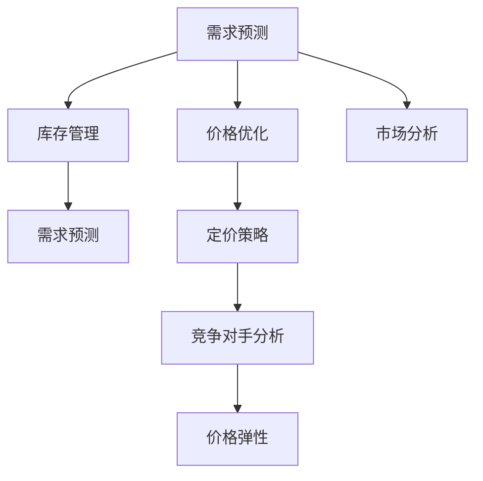

                 

# AI驱动的动态定价策略在电商中的实施

## 1. 背景介绍

### 1.1 电商竞争的加剧

随着电商市场的迅速扩张，各大电商平台之间的竞争日益激烈。为争夺市场份额，各大平台纷纷推出各种价格优惠、满减、红包活动等策略，但同时，这些策略也导致了不同程度的策略滥用和市场无序。如何在保障自身利益的同时，避免恶性价格竞争，提升整体市场效率，成为电商平台亟待解决的问题。

### 1.2 电商定价的复杂性

电商定价策略的制定涉及市场环境、商品特性、消费者行为等多种因素，需要综合考虑库存、需求、竞争对手等多重约束。一方面，电商需确保价格策略的灵活性，实时应对市场变化；另一方面，需避免价格波动带来的不利影响，保障稳定的交易量和利润。

## 2. 核心概念与联系

### 2.1 核心概念概述

为更好地理解动态定价策略，本节将介绍几个核心概念：

- **动态定价策略**：根据市场环境、商品特性、消费者行为等因素，实时调整商品价格以实现最优收益的策略。
- **价格弹性**：指商品价格变动与需求量变动之间的比例关系，即价格变动百分比与需求量变动百分比之比。
- **需求预测**：基于历史数据和市场信息，预测未来需求的变化，指导动态定价策略的制定。
- **库存管理**：根据市场需求和价格策略，动态调整商品库存，优化存货水平，减少积压和缺货。
- **竞争对手分析**：分析竞争对手的定价策略和市场反应，制定差异化竞争策略。

这些核心概念之间的关系可以用以下Mermaid流程图来展示：



这个流程图展示了各个概念之间的联系：需求预测和库存管理互相影响，共同决定价格优化策略；价格优化策略又依赖于竞争对手分析和市场分析；最终，定价策略还需要考虑价格弹性，以指导实际价格调整。

## 3. AI驱动的动态定价策略

### 3.1 算法原理概述

基于人工智能（AI）的动态定价策略，通过构建数学模型和优化算法，实时调整商品价格以最大化收益。其核心思想是将市场需求、商品特性、消费者行为等复杂因素融入模型，利用机器学习算法进行预测和优化。

在定价模型中，通常采用优化算法，如线性规划、非线性规划、遗传算法等，来求解最优价格。模型的输入包括商品信息（如价格、库存、属性等）、历史销售数据、竞争对手数据等，输出为最优价格策略。

### 3.2 算法步骤详解

基于AI的动态定价策略一般包括以下几个关键步骤：

**Step 1: 数据收集与预处理**
- 收集历史销售数据、市场数据、竞争对手数据等，为模型提供输入。
- 对数据进行清洗、归一化、特征提取等预处理操作，确保数据的准确性和有效性。

**Step 2: 构建预测模型**
- 选择适合的机器学习模型（如线性回归、随机森林、神经网络等），构建预测模型。
- 利用历史数据训练模型，预测未来市场需求。

**Step 3: 优化定价模型**
- 将需求预测结果作为定价模型的输入，构建目标函数（如最大化利润、市场份额等）。
- 定义约束条件（如成本限制、库存限制、价格区间等），利用优化算法求解最优价格。

**Step 4: 实时监控与调整**
- 对实时数据进行监控，更新需求预测模型。
- 根据市场需求和价格策略，动态调整库存和价格。

**Step 5: 结果评估与反馈**
- 定期评估定价策略的效果，通过A/B测试、用户反馈等手段优化模型。
- 建立反馈机制，及时调整策略，确保定价策略的有效性。

### 3.3 算法优缺点

AI驱动的动态定价策略具有以下优点：
- **高效准确**：通过机器学习算法，实时预测市场需求，快速调整价格，提高市场响应速度。
- **个性化优化**：根据用户行为和历史数据，实现个性化定价，提升用户体验和转化率。
- **灵活性强**：能够实时应对市场变化，快速调整策略，适应不同商品和市场环境。

同时，该策略也存在一定的局限性：
- **模型依赖数据质量**：预测模型的准确性依赖于数据的质量和全面性，数据不足或错误可能导致策略失效。
- **计算成本高**：构建和优化模型需要大量计算资源，尤其是复杂模型和高维数据。
- **策略透明性不足**：AI定价策略的内部逻辑复杂，难以解释和调试，消费者可能对其产生质疑。

### 3.4 算法应用领域

AI驱动的动态定价策略已广泛应用于多个电商场景，例如：

- **价格优化**：根据市场需求和竞争对手情况，动态调整商品价格，最大化收益。
- **库存管理**：根据需求预测和价格策略，调整库存水平，减少积压和缺货。
- **个性化定价**：根据用户行为和历史数据，实现个性化定价，提升用户体验和转化率。
- **跨地域定价**：分析不同地域的市场特点和需求，制定差异化定价策略。
- **清仓促销**：根据库存情况和市场需求，制定清仓促销策略，快速消化库存。

这些应用场景展示了AI动态定价策略的广泛适用性和强大效果。

## 4. 数学模型和公式 & 详细讲解 & 举例说明

### 4.1 数学模型构建

本文以最大化利润为优化目标，构建动态定价模型。设商品当前价格为 $p$，销售量为 $q$，则利润函数为：

$$
\pi(p) = p \times q - C
$$

其中 $C$ 为固定成本。

目标函数为：

$$
\max_{p} \pi(p)
$$

约束条件包括：

- 需求约束：根据历史数据和市场预测，得到需求函数 $q(p)$。
- 库存约束：商品库存不能超过上限 $Q$。
- 价格约束：价格不能低于最低价格 $p_{min}$，不能高于最高价格 $p_{max}$。

目标函数和约束条件如下：

$$
\begin{aligned}
\max_{p} \quad & p \times q(p) - C \\
\text{s.t.} \quad & q(p) \leq Q \\
        & p_{min} \leq p \leq p_{max}
\end{aligned}
$$

### 4.2 公式推导过程

为了求解上述优化问题，可以采用动态规划、线性规划等方法。这里以线性规划为例进行推导。

将需求函数 $q(p)$ 分解为：

$$
q(p) = q_{max} + \frac{p - p_{min}}{p_{max} - p_{min}} (q_{max} - q_{min})
$$

其中 $q_{min}$ 和 $q_{max}$ 为最低和最高需求量。

利润函数变为：

$$
\pi(p) = p \times q_{max} + \frac{p - p_{min}}{p_{max} - p_{min}} (q_{max} - q_{min}) - C
$$

令 $f(p) = \pi(p) / q_{max}$，则问题转化为：

$$
\max_{p} \quad f(p)
$$

$$
\text{s.t.} \quad 1 \leq p \leq k
$$

其中 $k = \frac{p_{max} - p_{min}}{q_{max} - q_{min}}$。

引入拉格朗日乘子 $\lambda_1, \lambda_2, \lambda_3$，构造拉格朗日函数：

$$
\mathcal{L}(p, \lambda_1, \lambda_2, \lambda_3) = f(p) - \lambda_1 (p - 1) - \lambda_2 (p - k) + \lambda_3 (q_{max} - q(p))
$$

根据拉格朗日乘数法，得到一阶最优条件：

$$
\frac{\partial \mathcal{L}}{\partial p} = 0
$$

$$
\frac{\partial \mathcal{L}}{\partial \lambda_1} = 0
$$

$$
\frac{\partial \mathcal{L}}{\partial \lambda_2} = 0
$$

$$
\frac{\partial \mathcal{L}}{\partial \lambda_3} = 0
$$

求解上述方程组，得到最优价格 $p^*$。

### 4.3 案例分析与讲解

以下是一个简化的动态定价案例：

**案例背景**：一家电商平台的某商品售价为 $p_0$，日均需求量为 $q_0$，库存量为 $Q_0$，固定成本为 $C_0$。已知该商品价格与需求的关系为 $q(p) = q_0 - 0.1(p - p_0)$。

**优化目标**：根据市场需求和库存情况，调整价格以最大化每日利润。

**优化过程**：

1. 需求预测：根据历史数据和市场变化，预测未来需求 $q(p)$。
2. 构建优化模型：目标函数为 $\pi(p) = p \times q(p) - C_0$，约束条件为 $q(p) \leq Q_0$，$p_{min} = 0$，$p_{max} = 100$。
3. 求解最优价格：使用线性规划等方法，求解最优价格 $p^*$。

假设求解得到 $p^* = 50$，则每天的最大利润为 $\pi(50) = 50 \times q(50) - C_0$。

## 5. 项目实践：代码实例和详细解释说明

### 5.1 开发环境搭建

在进行动态定价项目实践前，我们需要准备好开发环境。以下是使用Python进行Pandas和Scikit-learn开发的Python环境配置流程：

1. 安装Anaconda：从官网下载并安装Anaconda，用于创建独立的Python环境。

2. 创建并激活虚拟环境：
```bash
conda create -n dynamic-pricing python=3.8 
conda activate dynamic-pricing
```

3. 安装Pandas和Scikit-learn：
```bash
conda install pandas scikit-learn
```

4. 安装TensorFlow和PyTorch：
```bash
conda install tensorflow pytorch
```

5. 安装相关库：
```bash
pip install matplotlib seaborn
```

完成上述步骤后，即可在`dynamic-pricing`环境中开始动态定价项目实践。

### 5.2 源代码详细实现

下面我们以一个简化的动态定价模型为例，给出使用Pandas和Scikit-learn进行动态定价模型的Python代码实现。

首先，定义需求预测函数：

```python
import pandas as pd
import numpy as np
from sklearn.linear_model import LinearRegression

def demand_predict(data, seasonality, trend):
    X = pd.DataFrame(data['feature'], columns=['feature'])
    y = data['demand']
    
    # 添加季节性特征
    X['seasonality'] = X['feature'].map(seasonality)
    
    # 添加趋势特征
    X['trend'] = X['feature'].map(trend)
    
    # 训练线性回归模型
    model = LinearRegression()
    model.fit(X, y)
    
    # 预测未来需求
    X_new = pd.DataFrame(np.array([seasonality, trend], dtype='float').reshape(1, -1), columns=['seasonality', 'trend'])
    y_new = model.predict(X_new)
    
    return y_new
```

然后，定义优化函数：

```python
from scipy.optimize import linprog

def optimize_price(data, Q, C, p_min, p_max):
    # 定义目标函数
    def objective(p):
        return -(p * data['demand'] - C)
    
    # 定义约束条件
    def constraint(p):
        return [p - p_min, p - p_max, data['demand'] - data['demand'] * p]
    
    # 求解线性规划问题
    result = linprog(objective, A_ub=constraint, bounds=[(0, None)])
    
    return result.x[0]
```

最后，启动定价流程：

```python
# 假设历史数据已读取到data DataFrame中
# 需求函数为demand = -0.1 * (p - p0) + q0
# 库存量为Q，固定成本为C，价格区间为[0, 100]

# 预测未来需求
seasonality = {'winter': 0.9, 'spring': 1.0, 'summer': 1.1, 'autumn': 0.9}
trend = {'low': 0.8, 'high': 1.0, 'very high': 1.2}
data['seasonality'] = data['feature'].map(seasonality)
data['trend'] = data['feature'].map(trend)
future_demand = demand_predict(data, seasonality, trend)

# 优化价格
p_opt = optimize_price(data, Q, C, 0, 100)
```

以上就是使用Pandas和Scikit-learn对动态定价模型进行优化的Python代码实现。可以看到，通过Python的强大计算能力和丰富的库函数，动态定价模型的构建和优化变得简单高效。

### 5.3 代码解读与分析

让我们再详细解读一下关键代码的实现细节：

**demand_predict函数**：
- 对历史数据进行特征工程，添加季节性和趋势特征。
- 使用线性回归模型训练需求预测模型。
- 对未来需求进行预测，返回预测值。

**optimize_price函数**：
- 定义目标函数，求利润最大化。
- 定义约束条件，确保价格在合理范围内，且需求满足。
- 使用SciPy的linprog方法求解线性规划问题，得到最优价格。

**定价流程**：
- 预测未来需求，调用demand_predict函数。
- 优化价格，调用optimize_price函数。

以上代码展示了动态定价模型的基本实现流程。开发者可以根据具体任务和数据特点，进一步优化预测模型和优化算法，以实现更加高效、准确的定价策略。

## 6. 实际应用场景

### 6.1 电商商品定价

动态定价策略在电商商品定价中具有广泛应用。通过实时监控市场需求和库存情况，电商可以动态调整商品价格，确保库存平衡和收益最大化。

**案例**：一家电商平台的某商品在打折期间，需求量大幅提升，库存迅速减少。通过动态定价策略，实时调整价格，可以有效防止断货，同时保持促销效果。

### 6.2 酒店定价

动态定价策略在酒店定价中同样适用。酒店可以根据季节、天气、节假日等市场需求因素，实时调整房间价格，提升房间出租率和收益。

**案例**：一家酒店在节假日期间需求激增，客房供不应求。通过动态定价策略，实时提高房间价格，可以有效控制房间空置率，提高收益。

### 6.3 航空公司定价

航空公司可以根据需求和竞争情况，实时调整机票价格，优化收益。

**案例**：一家航空公司在旅游旺季需求激增，竞争对手降价促销。通过动态定价策略，实时调整机票价格，可以有效提升市场份额，同时确保收益。

## 7. 工具和资源推荐

### 7.1 学习资源推荐

为了帮助开发者系统掌握动态定价技术的理论基础和实践技巧，这里推荐一些优质的学习资源：

1. 《动态定价理论与实践》系列博文：由动态定价领域专家撰写，深入浅出地介绍了动态定价的原理、模型和实际应用案例。

2. Coursera《运营管理》课程：由耶鲁大学开设的运营管理课程，包含动态定价等内容，适合初学者入门。

3. 《动态定价：理论、算法与案例分析》书籍：详细介绍了动态定价的理论基础、算法设计和实际应用案例，是学习动态定价的必备参考书。

4. 动态定价开源项目：GitHub上众多的动态定价开源项目，提供了丰富的代码实现和应用案例，助力快速上手。

通过对这些资源的学习实践，相信你一定能够快速掌握动态定价的精髓，并用于解决实际的电商定价问题。

### 7.2 开发工具推荐

高效的开发离不开优秀的工具支持。以下是几款用于动态定价开发的常用工具：

1. Python：动态定价模型大多基于数学建模和优化算法，Python的强大计算能力和丰富库函数，使其成为动态定价开发的理想选择。

2. Pandas：用于数据处理和分析的Python库，支持高效的数据读写和数据处理操作。

3. Scikit-learn：用于机器学习建模的Python库，支持多种机器学习算法和模型评估。

4. TensorFlow和PyTorch：用于深度学习建模的Python库，支持高效的数据处理和模型优化。

5. Weights & Biases：模型训练的实验跟踪工具，可以记录和可视化模型训练过程中的各项指标，方便对比和调优。

6. Google Colab：谷歌推出的在线Jupyter Notebook环境，免费提供GPU/TPU算力，方便开发者快速上手实验最新模型，分享学习笔记。

合理利用这些工具，可以显著提升动态定价任务的开发效率，加快创新迭代的步伐。

### 7.3 相关论文推荐

动态定价技术的发展源于学界的持续研究。以下是几篇奠基性的相关论文，推荐阅读：

1. Dynamic Pricing: Theory and Applications（原论文）：介绍了动态定价的基本理论和模型。

2. Optimization for dynamic demand management（动态需求管理优化）：探讨了动态定价模型在实际应用中的优化问题。

3. Pricing with Market Dynamics: Theory and Algorithm（市场动态下的定价理论）：研究了市场需求变化情况下的动态定价策略。

4. Dynamic Pricing in E-Commerce: A Review（电商中的动态定价综述）：总结了电商领域中动态定价的研究现状和未来趋势。

5. A Review on Dynamic Pricing Models and Algorithms（动态定价模型与算法综述）：回顾了动态定价领域的研究进展和未来方向。

这些论文代表了大动态定价技术的发展脉络。通过学习这些前沿成果，可以帮助研究者把握学科前进方向，激发更多的创新灵感。

## 8. 总结：未来发展趋势与挑战

### 8.1 总结

本文对基于AI的动态定价策略进行了全面系统的介绍。首先阐述了动态定价在电商中的应用背景和意义，明确了动态定价策略在提升收益和优化库存方面的独特价值。其次，从原理到实践，详细讲解了动态定价的数学模型和优化算法，给出了动态定价任务的完整代码实现。同时，本文还广泛探讨了动态定价在电商、酒店、航空等领域的应用前景，展示了动态定价技术的广泛适用性和强大效果。此外，本文精选了动态定价技术的各类学习资源，力求为读者提供全方位的技术指引。

通过本文的系统梳理，可以看到，基于AI的动态定价策略正在成为电商领域的重要范式，极大地拓展了价格策略的应用边界，催生了更多的落地场景。受益于AI技术和算法的不断进步，动态定价技术必将进一步提升电商系统的性能和应用范围，为电商业务带来新的增长动力。

### 8.2 未来发展趋势

展望未来，动态定价技术将呈现以下几个发展趋势：

1. **智能化和个性化**：结合AI技术，动态定价策略将更加智能化和个性化，根据用户行为和历史数据，实现更精准的价格调整。

2. **实时性和响应性**：动态定价系统将具备更高的实时性和响应性，能够快速应对市场需求变化，实现实时价格调整。

3. **多渠道融合**：结合电商、酒店、航空等多渠道数据，进行统一动态定价，提升整体市场效率。

4. **跨地域优化**：根据不同地域的市场特点，制定差异化定价策略，提升整体收益。

5. **数据驱动和自动化**：动态定价系统将更加依赖数据驱动和自动化决策，减少人工干预，提升系统稳定性和效率。

以上趋势凸显了动态定价技术的广阔前景。这些方向的探索发展，必将进一步提升动态定价系统的性能和应用范围，为电商业务带来新的增长动力。

### 8.3 面临的挑战

尽管动态定价技术已经取得了显著成就，但在迈向更加智能化、普适化应用的过程中，它仍面临着诸多挑战：

1. **数据质量问题**：动态定价策略高度依赖数据质量，数据缺失、错误或不一致将影响定价决策的准确性。

2. **模型复杂性**：动态定价模型通常比较复杂，需要综合考虑多个因素，如市场需求、库存、成本等，构建和优化模型需要较高的技术和计算成本。

3. **策略透明性不足**：动态定价策略的内部逻辑复杂，难以解释和调试，消费者可能对其产生质疑。

4. **政策风险**：部分市场存在反垄断等政策风险，动态定价策略可能被视为市场操纵或价格垄断行为。

5. **市场波动**：市场环境变化大，动态定价策略需要频繁调整，增加了系统维护和运营成本。

### 8.4 研究展望

面对动态定价技术面临的种种挑战，未来的研究需要在以下几个方面寻求新的突破：

1. **数据治理**：建立全面的数据治理机制，确保数据质量和一致性，减少数据质量问题。

2. **模型简化**：研究简化动态定价模型的有效方法，减少模型复杂性和计算成本。

3. **策略透明性**：在保证定价效果的前提下，提升策略透明性，增加用户信任。

4. **政策合规**：研究动态定价策略的合规性问题，避免政策风险。

5. **实时监控和调整**：建立实时监控和调整机制，及时响应市场变化，提升系统稳定性和效率。

这些研究方向的探索，必将引领动态定价技术迈向更高的台阶，为电商业务带来新的增长动力。相信随着技术和政策的不断进步，动态定价技术必将在电商市场发挥更大的作用，推动电商业务的持续创新和升级。

## 9. 附录：常见问题与解答

**Q1：动态定价策略是否适用于所有电商场景？**

A: 动态定价策略在大多数电商场景中都能取得不错的效果，特别是对于需求波动较大的商品。但对于某些特殊商品，如高价商品、特殊节假日商品等，可能并不适用。此外，动态定价策略需要大量的历史数据和复杂的模型构建，对于小规模电商可能存在成本过高的问题。

**Q2：如何选择合适的动态定价模型？**

A: 选择合适的动态定价模型需要考虑商品特性、市场需求、库存管理等因素。一般来说，对于需求波动较大的商品，可以使用线性回归等简单模型；对于需求复杂的商品，可以使用神经网络等复杂模型。此外，需要根据具体场景进行模型选择和参数调优。

**Q3：动态定价策略是否会对市场产生负面影响？**

A: 合理的动态定价策略可以提升市场效率和消费者福利，但如果定价策略不当，如过度竞争、价格歧视等，也可能对市场产生负面影响。因此，需要建立监管机制，确保动态定价策略的公平性和合法性。

**Q4：如何处理多渠道数据融合问题？**

A: 多渠道数据融合是动态定价中的一个重要问题。可以通过统一数据格式、建立数据共享机制等方式，实现不同渠道数据的融合和统一管理。同时，需要根据不同渠道的特点，进行差异化定价策略设计。

**Q5：如何优化动态定价系统的实时性？**

A: 实时性是动态定价系统的关键性能指标之一。可以通过优化数据处理流程、提高计算效率、优化模型结构等方式，提升系统的实时响应能力。同时，需要建立高效的缓存机制，减少重复计算和数据处理。

以上问题及解答展示了动态定价技术的常见问题和优化策略，有助于开发者更好地理解和应用动态定价技术。

