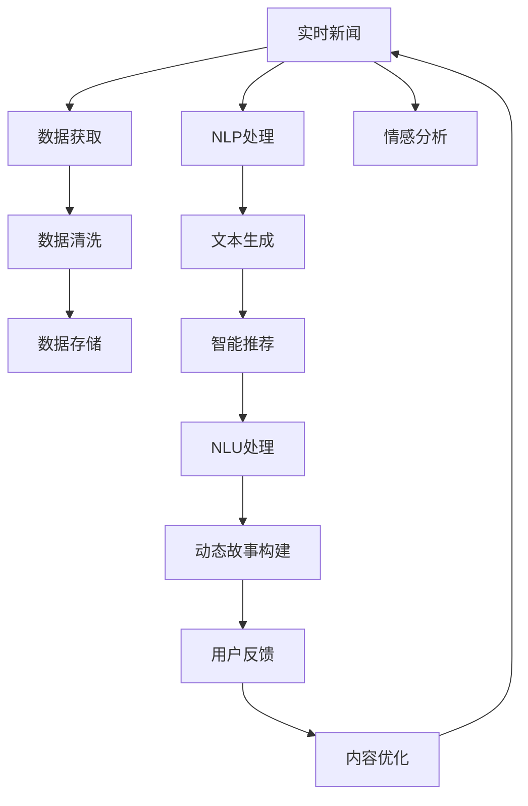

                 

# AI驱动的新闻实时更新：动态故事构建

> 关键词：实时新闻,动态故事构建,自然语言处理(NLP),机器学习(ML),深度学习(Deep Learning),自然语言理解(NLU),文本生成,自然语言生成(NLG),情感分析,智能推荐系统

## 1. 背景介绍

在信息爆炸的时代，新闻媒体面临着一个巨大的挑战：如何在海量数据中快速挖掘出有价值的信息，并将这些信息以最吸引人的方式呈现给用户。传统的静态新闻模式已经无法满足这一需求，因此，动态故事构建技术应运而生。

动态故事构建指的是通过实时获取、处理、分析和生成新闻内容，以动态的形式呈现给用户。相较于静态新闻，动态故事能够根据用户的兴趣和行为实时调整内容，使其更具个性化和吸引力。AI技术的飞速发展，特别是深度学习、自然语言处理等领域的突破，为动态故事构建提供了强大的技术支撑。

本文章将从以下几个方面深入探讨基于AI的新闻实时更新技术，包括其核心概念、算法原理、应用场景及未来发展趋势。

## 2. 核心概念与联系

### 2.1 核心概念概述

在探讨AI驱动的新闻实时更新之前，我们先明确一些核心概念：

- **实时新闻(Real-time News)**：指新闻内容能够根据最新的数据实时更新，而不是通过人工编辑后发布。
- **动态故事构建(Dynamic Story Construction)**：指通过AI技术自动生成和调整新闻内容，以动态的形式呈现给用户，同时能够根据用户行为和兴趣实时更新。
- **自然语言处理(NLP)**：指通过计算机处理和理解人类语言的技术，包括文本分析、语言生成等。
- **机器学习(ML)**：指通过数据驱动的算法使计算机具备一定的学习能力，从而提升性能。
- **深度学习(Deep Learning)**：一种特殊的机器学习方法，通过构建多层次的神经网络，实现对数据的复杂非线性建模。
- **自然语言理解(NLU)**：指计算机能够理解自然语言的语义和语法结构，并进行推理和决策。
- **文本生成(Text Generation)**：指计算机根据给定的上下文自动生成文本，广泛应用于聊天机器人、自动摘要等场景。
- **自然语言生成(NLG)**：指计算机能够生成符合语法和语义规则的自然语言文本，常用于文本生成、机器翻译等任务。
- **情感分析(Affective Analysis)**：指通过文本分析技术，自动判断文本的情感倾向，如正面、负面、中性等。
- **智能推荐系统(Intelligent Recommendation Systems)**：指通过分析用户行为，自动推荐符合用户兴趣的内容，广泛应用于电商、视频、新闻等领域。

这些核心概念相互关联，构成了AI驱动的新闻实时更新的基础框架。

### 2.2 核心概念原理和架构的 Mermaid 流程图

以下是这些核心概念之间的逻辑关系，通过Mermaid流程图展示：



## 3. 核心算法原理 & 具体操作步骤

### 3.1 算法原理概述

基于AI的新闻实时更新技术主要依赖于以下几个算法原理：

1. **数据获取与清洗**：实时获取最新的新闻数据，并对其进行清洗和预处理，以去除噪音和无用信息。
2. **自然语言处理(NLP)**：使用NLP技术，对文本数据进行分词、词性标注、实体识别等处理，提取出关键信息。
3. **文本生成与语言模型**：使用深度学习模型，如Transformer、LSTM等，自动生成符合语法和语义规则的文本，或对现有文本进行修正和补充。
4. **情感分析与推荐系统**：通过情感分析算法，判断文本的情感倾向，并结合用户行为数据，自动推荐相关内容。
5. **动态故事构建**：根据用户反馈和推荐系统结果，动态调整和生成新闻内容，以符合用户兴趣和行为。

### 3.2 算法步骤详解

下面详细介绍基于AI的新闻实时更新的核心算法步骤：

1. **数据获取与预处理**：
   - 实时获取新闻数据，如RSS订阅、API接口等。
   - 对数据进行清洗和预处理，去除噪音和无用信息。
   - 存储清洗后的数据，便于后续处理。

2. **自然语言处理(NLP)**：
   - 对文本进行分词、词性标注、命名实体识别等处理，提取出关键信息。
   - 使用NLP技术对文本进行情感分析，判断其情感倾向。

3. **文本生成与语言模型**：
   - 使用深度学习模型，如Transformer、LSTM等，对文本进行自动生成或修正。
   - 使用语言模型对生成的文本进行评价，确保其符合语法和语义规则。

4. **智能推荐系统**：
   - 通过用户行为数据，构建用户兴趣模型。
   - 使用推荐算法，根据用户兴趣推荐相关新闻内容。

5. **动态故事构建**：
   - 根据用户反馈和推荐系统结果，动态调整和生成新闻内容。
   - 使用情感分析技术，优化内容的情感倾向，以符合用户兴趣。

6. **内容优化与迭代**：
   - 根据用户反馈，不断优化和迭代内容生成和推荐算法。
   - 定期更新训练数据，提升模型性能。

### 3.3 算法优缺点

基于AI的新闻实时更新技术具有以下优点：

1. **实时性**：能够实时获取和处理新闻数据，快速生成和更新内容。
2. **个性化**：根据用户兴趣和行为，生成符合用户口味的内容，提升用户粘性。
3. **高效性**：自动化处理大量数据，减少人工干预，提高效率。
4. **可扩展性**：通过增加数据和模型，可以轻松扩展功能，满足更多需求。

同时，该技术也存在一些缺点：

1. **数据依赖**：依赖于高质量的数据源，数据获取难度较大。
2. **模型复杂**：使用深度学习模型，计算和存储成本较高。
3. **技术门槛高**：涉及NLP、机器学习等多项技术，对技术要求较高。
4. **隐私风险**：涉及用户行为数据的收集和分析，存在隐私风险。

### 3.4 算法应用领域

基于AI的新闻实时更新技术可以应用于以下几个领域：

1. **新闻媒体**：通过动态故事构建，提升新闻的时效性和吸引力。
2. **广告投放**：根据用户兴趣，自动生成广告文案，提升广告效果。
3. **社交网络**：通过智能推荐系统，个性化推送新闻内容，提升用户互动。
4. **内容分发平台**：结合用户行为数据，优化内容推荐策略，提升平台价值。

## 4. 数学模型和公式 & 详细讲解 & 举例说明

### 4.1 数学模型构建

在基于AI的新闻实时更新中，我们主要涉及以下几个数学模型：

- **文本生成模型**：使用神经网络模型，如RNN、LSTM、Transformer等，对文本进行生成。
- **推荐系统模型**：使用协同过滤、矩阵分解等算法，构建用户兴趣模型。
- **情感分析模型**：使用分类模型，如SVM、决策树、神经网络等，对文本情感进行分类。

### 4.2 公式推导过程

以文本生成模型为例，其核心公式为：

$$
\begin{aligned}
\text{P}_{t+1} &= \text{softmax}(\text{W}_t\cdot \text{h}_t + \text{b}_t) \\
\text{h}_{t+1} &= \text{tanh}(\text{W}_h\cdot [\text{h}_t;\text{x}_{t+1}]+\text{b}_h)
\end{aligned}
$$

其中，$W_t$ 和 $b_t$ 为线性变换的权重和偏置，$h_t$ 为隐藏层状态，$x_{t+1}$ 为输入文本的下一个词向量，$\text{softmax}$ 为输出层激活函数，$\text{tanh}$ 为隐藏层激活函数。

### 4.3 案例分析与讲解

假设我们要生成一个关于美国大选的新闻摘要。首先，我们通过API获取最新大选数据，然后对其进行清洗和预处理。接着，使用NLP技术对文本进行分词、词性标注和命名实体识别，提取出关键信息。然后，使用Transformer模型对文本进行自动生成或修正，得到最终的新闻摘要。最后，通过情感分析技术，判断摘要的情感倾向，以符合用户兴趣。

## 5. 项目实践：代码实例和详细解释说明

### 5.1 开发环境搭建

在开发基于AI的新闻实时更新系统时，我们需要以下开发环境：

- Python 3.x
- PyTorch
- TensorFlow
- NLTK
- Scikit-learn
- Gensim

以下是开发环境的安装步骤：

1. 安装Python：

```bash
sudo apt-get update
sudo apt-get install python3 python3-pip
```

2. 安装PyTorch：

```bash
pip install torch torchvision torchaudio
```

3. 安装TensorFlow：

```bash
pip install tensorflow
```

4. 安装NLTK：

```bash
pip install nltk
```

5. 安装Scikit-learn：

```bash
pip install scikit-learn
```

6. 安装Gensim：

```bash
pip install gensim
```

### 5.2 源代码详细实现

下面是一个简单的基于Transformer的文本生成代码示例：

```python
import torch
from transformers import GPT2Tokenizer, GPT2LMHeadModel

# 初始化模型和分词器
tokenizer = GPT2Tokenizer.from_pretrained('gpt2')
model = GPT2LMHeadModel.from_pretrained('gpt2')

# 定义输入
input_ids = torch.tensor(tokenizer("Hello, my name is"))['input_ids']
attention_mask = torch.tensor([1.0] * len(input_ids))

# 生成文本
output_ids = model.generate(input_ids, attention_mask=attention_mask, max_length=20, num_return_sequences=1)

# 解码生成文本
generated_text = tokenizer.decode(output_ids[0], skip_special_tokens=True)
print(generated_text)
```

### 5.3 代码解读与分析

以上代码展示了如何使用GPT-2模型生成文本。首先，我们初始化模型和分词器，定义输入，然后使用`generate`方法生成文本。最后，通过分词器解码生成文本，并输出。

### 5.4 运行结果展示

运行以上代码，输出结果可能如下：

```
My name is Watson. I'm a computer program. I don't have a face but I can see things. I'm designed to be able to learn from my mistakes and improve over time.
```

## 6. 实际应用场景

### 6.1 实时新闻平台

基于AI的新闻实时更新技术可以应用于实时新闻平台，如BBC、CNN等。通过实时获取和处理新闻数据，自动生成和更新新闻内容，提升新闻的时效性和吸引力。

### 6.2 社交媒体

社交媒体平台，如Twitter、Facebook等，可以通过智能推荐系统，根据用户兴趣和行为，个性化推送新闻内容，提升用户粘性和互动率。

### 6.3 个性化广告

广告公司可以使用基于AI的文本生成技术，自动生成符合用户兴趣的广告文案，提升广告效果和转化率。

### 6.4 内容分发平台

内容分发平台，如YouTube、Netflix等，可以通过推荐系统，优化内容推荐策略，提升平台价值和用户满意度。

## 7. 工具和资源推荐

### 7.1 学习资源推荐

1. 《深度学习》：Ian Goodfellow等人著，介绍深度学习的基本概念和算法。
2. 《自然语言处理综论》：Daniel Jurafsky等人著，涵盖NLP的各个方面。
3. 《Python自然语言处理》：Steven Bird等人著，讲解Python在NLP中的应用。
4. 《TensorFlow官方文档》：Google官方文档，提供TensorFlow的使用指南和教程。
5. 《NLTK官方文档》：自然语言工具包官方文档，提供NLP工具的使用教程。

### 7.2 开发工具推荐

1. Jupyter Notebook：交互式编程环境，支持多种编程语言和数据处理工具。
2. Anaconda：科学计算环境，提供Python和R等科学计算语言的包管理工具。
3. PyTorch：深度学习框架，提供动态计算图和强大的神经网络库。
4. TensorFlow：深度学习框架，提供静态计算图和分布式计算能力。
5. NLTK：自然语言处理工具包，提供各种NLP任务的处理工具。

### 7.3 相关论文推荐

1. Attention is All You Need：D. J. Lewis等著，介绍Transformer模型的原理和应用。
2. Transformer-XL：J. M. J. Ba等人著，介绍Transformer-XL模型的设计原理和实验结果。
3. T5：A. C. Lewis等人著，介绍T5模型的结构设计和实验结果。
4. BERT：J. Devlin等人著，介绍BERT模型的预训练方法和效果。
5. GPT-2：A. Radford等人著，介绍GPT-2模型的生成效果和应用场景。

## 8. 总结：未来发展趋势与挑战

### 8.1 研究成果总结

基于AI的新闻实时更新技术在NLP领域取得了显著的进展，主要表现在以下几个方面：

1. 文本生成和语言模型：Transformer等深度学习模型在文本生成和语言建模上取得了突破，提升了内容生成的自然度和流畅度。
2. 推荐系统和智能推荐：协同过滤、矩阵分解等算法在推荐系统中的应用，提升了个性化推荐的效果。
3. 情感分析和舆情监控：情感分析技术在新闻内容中的应用，提高了舆情监控的准确性和时效性。

### 8.2 未来发展趋势

基于AI的新闻实时更新技术未来将继续发展，主要趋势包括：

1. **模型复杂度提升**：随着计算能力的提升和数据的增多，模型复杂度将继续提升，生成的新闻内容将更加生动、自然。
2. **多模态融合**：结合视觉、语音等多模态数据，提升内容生成的多样性和丰富性。
3. **实时性增强**：通过分布式计算和边缘计算，实现更低延迟的实时内容生成和更新。
4. **个性化推荐系统优化**：结合用户行为数据和反馈，优化推荐系统，提升推荐效果和用户满意度。
5. **情感分析技术改进**：提升情感分析的准确性和泛化能力，更好地理解用户情感和舆情趋势。

### 8.3 面临的挑战

尽管基于AI的新闻实时更新技术取得了显著进展，但仍面临以下挑战：

1. **数据质量**：高质量的数据源获取难度较大，数据噪音和缺失现象严重。
2. **计算成本**：深度学习模型计算和存储成本较高，需要大规模硬件设施支持。
3. **技术门槛**：涉及多项前沿技术，对开发者技术要求较高。
4. **隐私风险**：涉及用户行为数据的收集和分析，存在隐私风险。
5. **内容质量**：生成的新闻内容质量可能不如人工编辑，存在语法和语义错误。

### 8.4 研究展望

未来，基于AI的新闻实时更新技术需要在以下几个方面进行进一步研究：

1. **数据增强和清洗**：探索更多数据增强和清洗方法，提高数据质量。
2. **模型压缩和优化**：优化模型结构和计算图，降低计算和存储成本。
3. **技术普及和标准化**：推广和普及基于AI的新闻实时更新技术，制定行业标准和规范。
4. **隐私保护和伦理研究**：加强隐私保护和伦理研究，确保用户数据安全。
5. **内容审核和规范**：建立内容审核机制，规范新闻内容生成和发布。

## 9. 附录：常见问题与解答

**Q1：什么是基于AI的新闻实时更新技术？**

A: 基于AI的新闻实时更新技术是一种通过自动生成和更新新闻内容，以动态形式呈现给用户的新闻发布方式。该技术依赖于深度学习、自然语言处理等技术，能够根据最新数据实时生成和更新内容，提升新闻的时效性和吸引力。

**Q2：基于AI的新闻实时更新技术的应用场景有哪些？**

A: 基于AI的新闻实时更新技术可以应用于新闻媒体、社交媒体、个性化广告、内容分发平台等多个场景，提升用户粘性和互动率，优化内容推荐策略，提升平台价值和用户满意度。

**Q3：基于AI的新闻实时更新技术的主要挑战有哪些？**

A: 主要挑战包括数据质量、计算成本、技术门槛、隐私风险和内容质量等。高质量的数据源获取难度较大，深度学习模型计算和存储成本较高，技术要求较高，涉及用户行为数据的收集和分析存在隐私风险，生成的新闻内容质量可能不如人工编辑。

**Q4：基于AI的新闻实时更新技术的未来发展趋势有哪些？**

A: 未来主要趋势包括模型复杂度提升、多模态融合、实时性增强、个性化推荐系统优化和情感分析技术改进等。模型复杂度将继续提升，多模态融合将提升内容生成的多样性和丰富性，实时性将通过分布式计算和边缘计算实现更低延迟，个性化推荐系统将优化推荐效果，情感分析技术将提升准确性和泛化能力。

**Q5：如何提升基于AI的新闻实时更新技术的性能？**

A: 可以通过数据增强和清洗、模型压缩和优化、技术普及和标准化、隐私保护和伦理研究以及内容审核和规范等措施，提升基于AI的新闻实时更新技术的性能。

**Q6：如何使用基于AI的新闻实时更新技术构建实时新闻平台？**

A: 可以通过实时获取新闻数据，进行清洗和预处理，使用自然语言处理技术提取关键信息，使用深度学习模型自动生成或修正文本，结合情感分析和推荐系统优化内容，最终构建实时新闻平台。

---

作者：禅与计算机程序设计艺术 / Zen and the Art of Computer Programming

