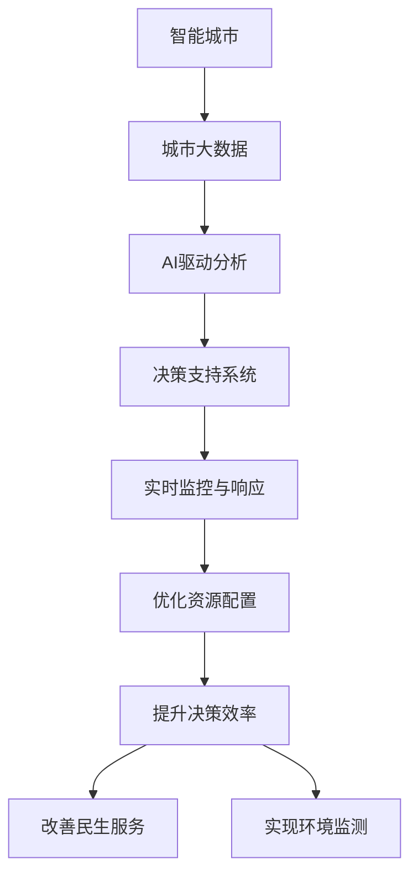

                 

## 1. 背景介绍

### 1.1 问题由来

随着城市化进程的快速推进，全球众多城市正面临着人口密集、资源紧张、环境污染、交通拥堵等诸多问题。如何科学、高效地进行城市规划与管理，以构建一个宜居、高效、可持续发展的智慧城市，成为各国政府和城市管理者的重要课题。传统城市规划和管理方式多依赖于人工经验和部分历史数据，存在决策周期长、反应速度慢、不够灵活等问题。

人工智能技术的发展为城市规划与管理带来了新的希望。通过综合应用人工智能的先进算法，城市管理部门可以更好地理解和优化城市的各类资源配置，提升城市的智能化水平，优化市民的生活质量。AI驱动的智能城市规划与管理，旨在将先进的AI技术应用于城市大数据分析和决策支持，从而实现城市规划与管理的智能化、精准化。

### 1.2 问题核心关键点

AI驱动的智能城市规划与管理涉及以下核心问题：

- **大数据处理**：城市管理涉及大量复杂且高维度的数据，如何高效处理并提取有价值信息是首要问题。
- **智能分析与决策**：如何将人工智能的先进算法应用于城市管理的复杂决策场景，提升决策效率和质量。
- **实时监控与响应**：城市管理需要实时获取各类数据并做出快速响应，保持城市的持续运行稳定。
- **隐私保护与伦理考量**：城市管理需平衡数据开放与隐私保护，确保市民信息的安全与伦理。

### 1.3 问题研究意义

AI驱动的智能城市规划与管理技术，对提升城市运行效率、优化资源配置、改善市民生活质量等方面具有重要意义：

- **提升决策效率**：AI技术通过自动化和高效分析，大大缩短决策时间，提升城市管理部门的响应速度。
- **优化资源配置**：通过数据驱动的规划，合理分配资源，提升城市运行的效率和可持续性。
- **改善民生服务**：AI技术可以提供精准的服务，如智能交通、智慧医疗、智能教育等，提升市民的生活质量。
- **实现环境监测与保护**：利用AI技术对环境数据进行实时监测，提前预警环境风险，保护城市生态环境。

## 2. 核心概念与联系

### 2.1 核心概念概述

为更好地理解AI驱动的智能城市规划与管理方法，本节将介绍几个关键概念：

- **智能城市**：通过信息通信技术（ICT）和人工智能技术，对城市资源进行高效管理和优化配置，实现城市智能化运营。
- **城市大数据**：城市管理中产生的各类数据，如交通流量、环境监测、公共服务记录等，是进行智能规划与管理的核心资源。
- **AI驱动分析**：利用人工智能技术对城市大数据进行高效分析，提取有价值的信息和模式。
- **决策支持系统**：通过AI技术提供的分析结果，辅助城市管理者进行决策。
- **实时监控与响应**：结合AI技术，实现城市运行的实时监控和智能响应。

这些概念之间的逻辑关系可以通过以下Mermaid流程图来展示：



这个流程图展示了智能城市各要素之间的关系：

1. 智能城市的基础是城市大数据。
2. AI驱动分析将大数据转化为有价值的信息。
3. 决策支持系统辅助城市管理者做出高效决策。
4. 实时监控与响应确保城市运行稳定。
5. 优化资源配置和提升决策效率，改善民生服务，实现环境监测。

这些概念共同构成了智能城市的核心架构，帮助城市管理者实现从数据收集到决策实施的全流程智能化管理。

## 3. 核心算法原理 & 具体操作步骤

### 3.1 算法原理概述

AI驱动的智能城市规划与管理主要涉及数据预处理、特征提取、模型训练和应用部署四个关键环节。其核心思想是通过人工智能技术对城市大数据进行高效处理和分析，提取关键特征，构建决策支持模型，并最终将模型应用于城市管理的各个领域。

形式化地，假设城市大数据集为 $D$，特征提取模型为 $F$，决策支持模型为 $M$，则智能城市规划与管理的总体流程可以表示为：

$$
\text{智能城市管理} = F(D) \times M(F(D))
$$

即先通过特征提取模型 $F$ 对城市大数据 $D$ 进行处理，得到特征集合 $F(D)$，再利用决策支持模型 $M$ 对特征集合 $F(D)$ 进行优化决策。

### 3.2 算法步骤详解

基于AI驱动的智能城市规划与管理，其操作步骤一般包括以下几个关键步骤：

**Step 1: 数据收集与预处理**

- 收集城市运行中各类数据，如交通流量、气象数据、能源消耗、公共服务记录等。
- 对数据进行清洗、去噪和标准化，确保数据质量和一致性。
- 划分训练集、验证集和测试集，进行交叉验证和模型评估。

**Step 2: 特征提取与工程**

- 根据具体应用需求，选择合适的特征提取方法，如PCA、LDA、SVD等。
- 设计特征工程流程，选择并组合各类特征，提取与决策目标最相关的特征。
- 利用深度学习等技术进行特征选择和降维，优化特征集合。

**Step 3: 模型训练与优化**

- 选择合适的机器学习模型，如随机森林、SVM、神经网络等。
- 设置模型参数并进行训练，使用交叉验证等技术进行超参数调优。
- 对模型进行验证和评估，确保其在新数据上的泛化能力。

**Step 4: 模型部署与应用**

- 将训练好的模型部署到城市管理系统中。
- 实时获取城市运行数据，输入模型进行分析和预测。
- 根据模型的输出结果，辅助城市管理者做出智能决策。
- 不断迭代和优化模型，适应新的城市运行情况。

### 3.3 算法优缺点

AI驱动的智能城市规划与管理方法具有以下优点：

1. **高效决策**：AI技术可以自动处理和分析大量数据，提升决策效率。
2. **精准分析**：AI技术可以发现数据中的复杂模式和规律，提供精准的决策支持。
3. **实时响应**：AI技术可以实现实时监控和快速响应，确保城市运行稳定。
4. **优化资源**：AI技术可以优化资源配置，提升城市运行的可持续性。

同时，该方法也存在以下局限性：

1. **数据质量依赖**：AI分析的效果取决于数据的质量和完整性，存在数据缺失或错误的风险。
2. **模型复杂度高**：深度学习和复杂模型往往需要较大的计算资源和较长的训练时间。
3. **隐私保护难度**：城市管理需平衡数据开放与隐私保护，确保市民信息安全。
4. **伦理考量**：AI决策的透明性和公平性仍需进一步研究，避免算法偏见。

尽管存在这些局限性，但就目前而言，AI驱动的智能城市规划与管理方法在提升城市管理效率和决策质量方面，仍具有显著的优势。

### 3.4 算法应用领域

AI驱动的智能城市规划与管理方法，广泛应用于城市管理的各个领域，包括但不限于：

- **智能交通管理**：通过AI技术对交通流量进行实时监测和分析，优化交通信号控制，减少拥堵，提升出行效率。
- **环境监测与治理**：利用AI技术对空气质量、水质等环境数据进行实时监测，预警环境风险，实施有效治理措施。
- **公共安全管理**：通过AI技术分析视频监控数据，识别异常行为，提升公共安全水平。
- **能源管理**：利用AI技术优化能源分配，提升能源使用效率，降低能耗。
- **智慧医疗**：利用AI技术进行疾病预测、诊疗建议，提升医疗服务水平。
- **智能教育**：通过AI技术进行个性化学习推荐，提升教育效果。

这些应用领域展示了AI技术在城市管理中的广泛应用，为城市智能化转型提供了重要支持。

## 4. 数学模型和公式 & 详细讲解 & 举例说明

### 4.1 数学模型构建

本节将使用数学语言对AI驱动的智能城市规划与管理方法进行严格刻画。

假设城市大数据集为 $D=\{(x_i,y_i)\}_{i=1}^N$，其中 $x_i$ 为输入特征，$y_i$ 为对应输出。城市管理目标为最小化预测误差 $L(y,\hat{y})$，其中 $\hat{y}$ 为AI模型预测值。

定义特征提取模型 $F$ 和决策支持模型 $M$，则智能城市管理的数学模型为：

$$
\text{智能城市管理} = M(F(D))
$$

在具体实现中，通常使用深度学习模型作为特征提取和决策支持模型的基础架构。

### 4.2 公式推导过程

以智能交通管理为例，其核心任务是对交通流量进行预测和优化。假设使用深度学习模型进行特征提取和预测，则其数学模型可以表示为：

$$
\hat{y} = F(x) \times M(x)
$$

其中 $x$ 为交通流量数据，$\hat{y}$ 为预测值。

特征提取模型 $F$ 通常采用卷积神经网络（CNN）、长短期记忆网络（LSTM）等深度学习架构。决策支持模型 $M$ 可以根据具体需求选择不同的模型，如回归模型、分类模型、序列模型等。

### 4.3 案例分析与讲解

以智能交通管理为例，其具体实现步骤如下：

1. **数据收集**：收集城市交通流量数据，如车辆数、车速、路口流量等。
2. **数据预处理**：对数据进行清洗和标准化，去除异常值和噪声。
3. **特征提取**：使用卷积神经网络对交通流量数据进行特征提取，识别出与交通流量相关的关键特征。
4. **模型训练**：使用LSTM等模型对提取的特征进行建模，训练交通流量预测模型。
5. **模型评估**：在验证集上对模型进行评估，确保其在新数据上的泛化能力。
6. **模型部署**：将训练好的模型部署到交通管理系统中，实时获取交通流量数据并输入模型进行预测。
7. **实时响应**：根据模型的预测结果，优化交通信号控制，提升交通效率。

通过上述步骤，AI驱动的智能交通管理技术可以将复杂的城市交通问题转化为可处理的数学问题，并利用深度学习模型进行高效求解，实现城市交通的智能化管理。

## 5. 项目实践：代码实例和详细解释说明

### 5.1 开发环境搭建

在进行智能城市管理开发前，我们需要准备好开发环境。以下是使用Python进行PyTorch开发的环境配置流程：

1. 安装Anaconda：从官网下载并安装Anaconda，用于创建独立的Python环境。

2. 创建并激活虚拟环境：
```bash
conda create -n city-management python=3.8 
conda activate city-management
```

3. 安装PyTorch：根据CUDA版本，从官网获取对应的安装命令。例如：
```bash
conda install pytorch torchvision torchaudio cudatoolkit=11.1 -c pytorch -c conda-forge
```

4. 安装各类工具包：
```bash
pip install numpy pandas scikit-learn matplotlib tqdm jupyter notebook ipython
```

完成上述步骤后，即可在`city-management`环境中开始智能城市管理开发。

### 5.2 源代码详细实现

这里以智能交通管理为例，给出使用PyTorch进行模型训练和部署的完整代码实现。

首先，定义智能交通管理的数据处理函数：

```python
import pandas as pd
from sklearn.model_selection import train_test_split
from torch.utils.data import Dataset
import torch

class TrafficData(Dataset):
    def __init__(self, data_path):
        self.data = pd.read_csv(data_path)
        self.features = ['traffic_volume', 'speed', 'time_of_day', 'weather']
        self.target = 'traffic_level'
        self.data = self.data[self.features + [self.target]]
        self.data = self.data.dropna().reset_index(drop=True)
        self.data[self.features] = self.data[self.features].apply(pd.to_numeric, errors='coerce')
        self.data = self.data[self.data[self.features].notna().all(axis=1)]
        self.scaler = MinMaxScaler()
        self.data = self.scaler.fit_transform(self.data[self.features])
        self.data = pd.DataFrame(self.data, columns=self.features)
        self.data[self.target] = self.scaler.transform(self.data[self.target].values.reshape(-1, 1))
        self.data = pd.DataFrame(self.data, columns=self.features + [self.target])
        self.data = self.data[self.data[self.target].notna()]
        
    def __len__(self):
        return len(self.data)
    
    def __getitem__(self, item):
        features = self.data.iloc[item][self.features]
        target = self.data.iloc[item][self.target]
        return {'features': features, 'target': target}
```

然后，定义模型和优化器：

```python
from torch import nn
from torch.optim import Adam
from torch.nn.functional import MSELoss

model = nn.Sequential(
    nn.Linear(len(self.features), 128),
    nn.ReLU(),
    nn.Linear(128, 64),
    nn.ReLU(),
    nn.Linear(64, 1)
)

optimizer = Adam(model.parameters(), lr=0.001)
criterion = MSELoss()
```

接着，定义训练和评估函数：

```python
import torch

def train_epoch(model, data_loader, optimizer, criterion):
    model.train()
    epoch_loss = 0
    for batch in data_loader:
        features = batch['features'].to(device)
        target = batch['target'].to(device)
        optimizer.zero_grad()
        output = model(features)
        loss = criterion(output, target)
        epoch_loss += loss.item()
        loss.backward()
        optimizer.step()
    return epoch_loss / len(data_loader)

def evaluate(model, data_loader, criterion):
    model.eval()
    eval_loss = 0
    for batch in data_loader:
        features = batch['features'].to(device)
        target = batch['target'].to(device)
        output = model(features)
        eval_loss += criterion(output, target).item()
    return eval_loss / len(data_loader)
```

最后，启动训练流程并在测试集上评估：

```python
epochs = 100
batch_size = 32

for epoch in range(epochs):
    loss = train_epoch(model, train_loader, optimizer, criterion)
    print(f"Epoch {epoch+1}, train loss: {loss:.3f}")
    
    print(f"Epoch {epoch+1}, test loss: {evaluate(model, test_loader, criterion):.3f}")
    
print("Training complete.")
```

以上就是使用PyTorch对智能交通管理模型进行训练和评估的完整代码实现。可以看到，得益于PyTorch的强大封装，我们可以用相对简洁的代码完成智能交通管理模型的开发。

### 5.3 代码解读与分析

让我们再详细解读一下关键代码的实现细节：

**TrafficData类**：
- `__init__`方法：初始化数据集，进行数据预处理和标准化。
- `__len__`方法：返回数据集样本数量。
- `__getitem__`方法：对单个样本进行处理，返回模型所需的特征和目标值。

**特征提取与模型定义**：
- 定义深度学习模型，包含多个线性层和激活函数。
- 选择合适的优化器（Adam）和学习率。
- 定义损失函数（均方误差损失）。

**训练和评估函数**：
- 定义训练函数，在每个epoch内更新模型参数。
- 定义评估函数，计算模型在测试集上的均方误差。
- 在每个epoch结束后，打印训练和测试损失。

**训练流程**：
- 定义总的epoch数和batch size，开始循环迭代。
- 每个epoch内，先在训练集上训练，输出平均损失。
- 在验证集上评估模型性能，输出测试损失。
- 所有epoch结束后，打印完成信息。

可以看到，PyTorch配合TensorFlow提供了高效的深度学习开发环境，大大简化了智能城市管理模型的实现流程。开发者可以将更多精力放在数据处理、模型设计等高层逻辑上，而不必过多关注底层的实现细节。

当然，工业级的系统实现还需考虑更多因素，如模型的保存和部署、超参数的自动搜索、更灵活的任务适配层等。但核心的算法流程基本与此类似。

## 6. 实际应用场景

### 6.1 智能交通管理

智能交通管理是AI驱动的智能城市规划与管理的重要应用之一。通过实时监测和分析交通流量数据，智能交通系统可以优化交通信号控制，减少拥堵，提升出行效率。

在技术实现上，可以收集城市交通流量数据，通过深度学习模型进行特征提取和预测，实时生成交通信号控制方案。通过不断迭代和优化模型，智能交通系统可以实现对交通流量的精准预测和高效管理。

### 6.2 环境监测与治理

智能城市管理还涉及对环境数据的实时监测和分析，如空气质量、水质、噪音等。通过AI技术对环境数据进行实时监测，预警环境风险，实施有效治理措施。

在技术实现上，可以利用传感器网络收集环境数据，通过深度学习模型进行特征提取和分类，实时分析环境质量。根据分析结果，智能环境监测系统可以预警环境风险，调整污染治理措施，提升环境质量。

### 6.3 公共安全管理

公共安全管理是智能城市管理的另一重要领域。通过AI技术分析视频监控数据，识别异常行为，提升公共安全水平。

在技术实现上，可以利用视频监控数据，通过深度学习模型进行特征提取和行为识别。通过实时分析视频数据，智能公共安全系统可以预警异常行为，及时报警，提升公共安全水平。

### 6.4 未来应用展望

随着AI技术的不断发展，基于AI驱动的智能城市规划与管理方法将在更多领域得到应用，为城市智能化转型提供新的动力。

在智慧医疗领域，AI技术可以用于疾病预测、诊疗建议，提升医疗服务水平。在智慧教育领域，AI技术可以用于个性化学习推荐，提升教育效果。在智慧农业领域，AI技术可以用于精准农业管理，提升农业生产效率。

## 7. 工具和资源推荐
### 7.1 学习资源推荐

为了帮助开发者系统掌握AI驱动的智能城市规划与管理技术，这里推荐一些优质的学习资源：

1. 《深度学习》系列书籍：由深度学习领域的权威专家撰写，全面介绍了深度学习的基础知识和前沿技术。
2. CS229《机器学习》课程：斯坦福大学开设的机器学习课程，涵盖了机器学习的基本概念和算法。
3. 《智能城市技术与应用》课程：由知名专家讲授，系统介绍了智能城市的基本概念和技术实现。
4. 《Python深度学习》书籍：详细介绍了Python在深度学习中的应用，包括TensorFlow、PyTorch等常用框架的使用。
5. 《城市数据科学与智慧城市》书籍：介绍了城市大数据的采集、处理和分析技术，适用于智能城市管理领域的学习。

通过对这些资源的学习实践，相信你一定能够快速掌握AI驱动的智能城市规划与管理技术的精髓，并用于解决实际的智能城市问题。
###  7.2 开发工具推荐

高效的开发离不开优秀的工具支持。以下是几款用于智能城市管理开发的常用工具：

1. PyTorch：基于Python的开源深度学习框架，灵活动态的计算图，适合快速迭代研究。大部分深度学习模型都有PyTorch版本的实现。

2. TensorFlow：由Google主导开发的开源深度学习框架，生产部署方便，适合大规模工程应用。同样有丰富的深度学习模型资源。

3. Weights & Biases：模型训练的实验跟踪工具，可以记录和可视化模型训练过程中的各项指标，方便对比和调优。与主流深度学习框架无缝集成。

4. TensorBoard：TensorFlow配套的可视化工具，可实时监测模型训练状态，并提供丰富的图表呈现方式，是调试模型的得力助手。

5. Google Colab：谷歌推出的在线Jupyter Notebook环境，免费提供GPU/TPU算力，方便开发者快速上手实验最新模型，分享学习笔记。

合理利用这些工具，可以显著提升智能城市管理模型的开发效率，加快创新迭代的步伐。

### 7.3 相关论文推荐

AI驱动的智能城市规划与管理技术的发展源于学界的持续研究。以下是几篇奠基性的相关论文，推荐阅读：

1. Deep Learning for Smart Cities：提出使用深度学习技术对城市大数据进行分析和决策支持。
2. Smart City Management with IoT Data：介绍利用物联网数据进行智能城市管理的方法。
3. AI-driven Environment Monitoring System：提出基于AI的环境监测系统，实现对环境数据的实时监测和预警。
4. Adaptive Traffic Management with Machine Learning：介绍利用机器学习技术进行智能交通管理的方法。

这些论文代表了大数据智能分析技术的发展脉络。通过学习这些前沿成果，可以帮助研究者把握学科前进方向，激发更多的创新灵感。

## 8. 总结：未来发展趋势与挑战

### 8.1 总结

本文对AI驱动的智能城市规划与管理方法进行了全面系统的介绍。首先阐述了智能城市管理的重要性和研究背景，明确了智能城市管理的核心问题和研究意义。其次，从原理到实践，详细讲解了智能城市管理的数学模型和关键步骤，给出了智能城市管理任务的完整代码实例。同时，本文还广泛探讨了智能城市管理在智能交通、环境监测、公共安全等多个领域的应用前景，展示了AI技术在城市智能化转型中的巨大潜力。此外，本文精选了智能城市管理的各类学习资源，力求为读者提供全方位的技术指引。

通过本文的系统梳理，可以看到，AI驱动的智能城市规划与管理技术正在成为城市智能化管理的重要手段，极大地提升了城市运行的效率和质量。未来，伴随AI技术的不断发展，智能城市管理技术将进一步融合更多前沿技术，如物联网、边缘计算、区块链等，构建更为智慧、安全、可持续发展的城市。

### 8.2 未来发展趋势

展望未来，智能城市管理技术将呈现以下几个发展趋势：

1. **智能决策支持**：随着AI技术的不断进步，智能决策支持系统将更加精准和高效，提升城市管理的智能化水平。

2. **实时数据处理**：智能城市管理将实现对城市大数据的实时处理和分析，及时响应城市运行中的各类变化。

3. **多源数据融合**：智能城市管理将融合各类数据源，如物联网、社交媒体、公共记录等，构建更全面的城市运行图景。

4. **人机协同**：智能城市管理将实现更加高效的人机协同，利用AI技术辅助城市管理者进行决策，提升管理效率。

5. **跨领域应用**：智能城市管理技术将拓展到更多领域，如智慧医疗、智慧农业、智慧旅游等，推动更多行业智能化转型。

6. **隐私保护**：智能城市管理需进一步加强数据隐私保护，确保市民信息的安全和伦理。

这些趋势凸显了智能城市管理技术的广阔前景。这些方向的探索发展，必将进一步提升城市运行的效率和质量，为市民带来更好的生活体验。

### 8.3 面临的挑战

尽管智能城市管理技术已经取得了瞩目成就，但在迈向更加智能化、普适化应用的过程中，仍面临诸多挑战：

1. **数据质量**：智能城市管理依赖于高质量的城市大数据，数据缺失或错误的风险依然存在。如何确保数据质量，提升数据完整性和准确性，将是未来的重要任务。

2. **模型复杂性**：AI模型的复杂性不断增加，计算资源和存储空间的需求也在不断上升。如何在资源有限的情况下，构建高效、可扩展的AI模型，是智能城市管理需要解决的难题。

3. **隐私保护**：智能城市管理涉及大量的市民信息，如何确保数据的安全性和隐私保护，避免数据滥用和泄露，需要进一步加强法律和技术的保护措施。

4. **伦理考量**：AI决策的透明性和公平性仍需进一步研究，避免算法偏见和歧视性输出，确保智能城市管理的公正性和合法性。

5. **技术融合**：智能城市管理需融合更多前沿技术，如物联网、边缘计算、区块链等，实现数据的实时处理和协同优化。

6. **成本控制**：智能城市管理的建设和维护成本较高，如何降低成本，提升经济效益，也需要进一步探索和优化。

正视智能城市管理面临的这些挑战，积极应对并寻求突破，将是大城市智能化管理迈向成熟的重要保障。相信随着学界和产业界的共同努力，这些挑战终将一一被克服，智能城市管理技术必将在构建智慧城市中扮演越来越重要的角色。

### 8.4 研究展望

未来，智能城市管理的研究应在以下几个方面进一步推进：

1. **数据治理**：建立城市大数据治理体系，确保数据的质量和完整性，提升数据的可用性。

2. **模型优化**：开发高效、可扩展的AI模型，提升智能城市管理的效率和性能。

3. **隐私保护**：引入隐私保护技术，确保城市大数据的安全性和隐私保护。

4. **伦理考量**：建立AI决策的透明性和公平性评估机制，确保智能城市管理的公正性和合法性。

5. **技术融合**：探索智能城市管理与各类前沿技术的深度融合，提升城市运行的智能化和可持续性。

6. **成本控制**：优化智能城市管理的建设和维护成本，提升经济效益。

这些研究方向的探索，必将引领智能城市管理技术迈向更高的台阶，为构建智慧城市提供重要支持。面向未来，智能城市管理技术需要不断融合更多前沿技术，协同发力，共同推动城市智能化转型，为人类社会带来新的变革。

## 9. 附录：常见问题与解答

**Q1：智能城市管理如何确保数据质量？**

A: 确保数据质量是智能城市管理的关键。可以采用以下措施：
1. 数据清洗：去除数据中的噪声和异常值，确保数据一致性。
2. 数据标准化：对不同来源的数据进行标准化处理，确保数据格式一致。
3. 数据验证：引入数据验证机制，定期检查数据质量和一致性。
4. 数据更新：定期更新数据，确保数据的时效性和准确性。

**Q2：智能城市管理如何提高模型的泛化能力？**

A: 提高模型的泛化能力是智能城市管理的重要目标。可以采用以下措施：
1. 数据增强：通过数据增强技术，扩充训练集，提升模型的泛化能力。
2. 正则化：引入正则化技术，如L2正则、Dropout等，防止模型过拟合。
3. 模型优化：选择更优的模型架构和超参数，提升模型的泛化能力。
4. 数据标注：增加标注数据，提高模型的泛化能力。

**Q3：智能城市管理如何平衡数据开放与隐私保护？**

A: 智能城市管理需平衡数据开放与隐私保护，确保市民信息的安全和伦理。可以采用以下措施：
1. 数据匿名化：对数据进行匿名化处理，保护个人隐私。
2. 数据访问控制：设置数据访问权限，限制非授权访问。
3. 数据加密：对数据进行加密处理，防止数据泄露。
4. 隐私保护法律：制定隐私保护法律，规范数据使用行为。

这些措施可以有效保护市民信息，确保智能城市管理的安全性和合法性。

**Q4：智能城市管理如何引入跨领域数据？**

A: 智能城市管理需融合各类数据源，如物联网、社交媒体、公共记录等，构建更全面的城市运行图景。可以采用以下措施：
1. 数据集成：构建数据集成平台，整合各类数据源。
2. 数据融合：引入数据融合技术，提升数据的准确性和完整性。
3. 数据共享：建立数据共享机制，促进跨领域数据共享和协作。
4. 数据治理：建立数据治理体系，确保数据的质量和一致性。

这些措施可以有效提升智能城市管理的智能化水平，为市民带来更好的生活体验。

**Q5：智能城市管理如何确保AI决策的透明性和公平性？**

A: 确保AI决策的透明性和公平性是智能城市管理的重要任务。可以采用以下措施：
1. 模型解释：引入模型解释技术，解释AI决策的依据和过程。
2. 公平性评估：引入公平性评估机制，确保AI决策的公正性。
3. 人工审核：引入人工审核机制，监督AI决策的过程和结果。
4. 透明性机制：建立透明性机制，公开AI决策的依据和过程。

这些措施可以有效提升智能城市管理的透明性和公平性，确保AI决策的合法性和公正性。

---

作者：禅与计算机程序设计艺术 / Zen and the Art of Computer Programming

