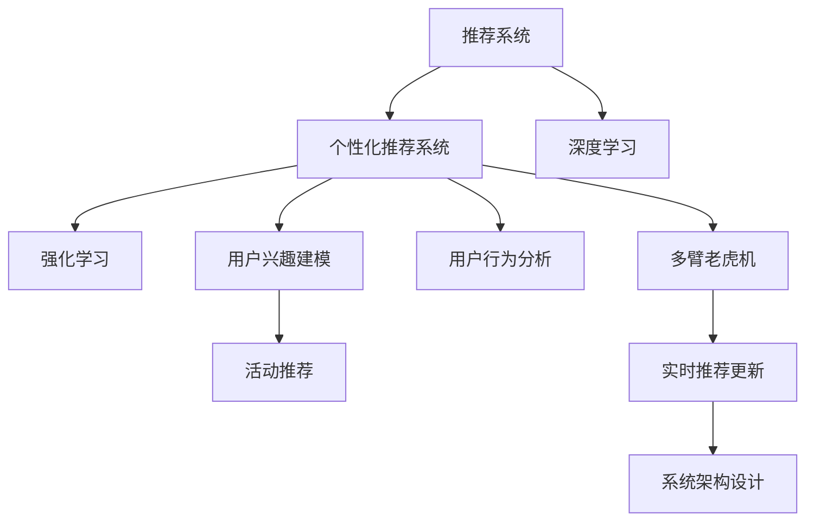

                 

# AI驱动的电商平台个性化活动推荐

> 关键词：AI推荐系统,电商平台,个性化,深度学习,强化学习,多臂老虎机,用户行为分析,用户兴趣建模

## 1. 背景介绍

### 1.1 问题由来

随着电子商务市场的迅猛发展和消费者需求的日益多样化，电商平台逐渐意识到个性化推荐的重要性。个性化推荐不仅能提升用户体验，增加用户粘性，还能显著提升销售转化率和平台收益。然而，传统推荐算法往往只能基于用户历史行为数据进行相似性推荐，无法深入了解用户的潜在需求和兴趣。

近年来，基于深度学习和强化学习的个性化推荐系统逐渐成为研究热点。这些算法通过模型学习用户历史行为和背景信息，建模用户的兴趣和需求，能更精准地预测用户感兴趣的商品和活动，有效提升推荐效果。

### 1.2 问题核心关键点

个性化推荐系统的核心在于如何高效建模用户兴趣，并实时根据用户行为进行动态调整。其关键点包括：

- 用户兴趣建模：通过学习用户行为数据，挖掘用户的隐含偏好，为每个用户构建个性化兴趣表示。
- 实时推荐更新：在用户每次行为交互后，及时调整推荐模型，并快速更新推荐结果，以保证推荐实时性和准确性。
- 多目标优化：不仅要提升推荐精度，还要兼顾个性化、多样性、公平性等多个优化目标。
- 系统架构设计：推荐系统需要构建灵活、可扩展的架构，以适应复杂多变的业务需求。

本节将重点探讨如何基于深度学习和强化学习，构建高效的个性化推荐系统，并重点介绍AI驱动的电商平台个性化活动推荐技术。

## 2. 核心概念与联系

### 2.1 核心概念概述

为更好地理解AI驱动的电商平台个性化活动推荐方法，本节将介绍几个密切相关的核心概念：

- 推荐系统(Recommender System)：一种基于用户兴趣或物品属性的信息过滤系统，旨在为每个用户推荐其可能感兴趣的商品或服务。
- 个性化推荐系统(Personalized Recommender System)：针对单个用户，通过学习用户的历史行为数据，构建个性化兴趣模型，实现精准推荐。
- 深度学习(Deep Learning)：一种基于神经网络结构的机器学习方法，通过多层非线性变换，高效建模复杂的输入数据。
- 强化学习(Reinforcement Learning)：一种通过试错过程不断优化策略的学习方法，常用于模型决策过程的优化，如多臂老虎机。
- 多臂老虎机(Multi-Armed Bandit)：一种用于建模不确定性环境下的决策问题的统计模型，常用于推荐系统中的场景优化和点击率预测。
- 用户行为分析(User Behavior Analysis)：通过分析用户在电商平台上的浏览、点击、购买等行为数据，挖掘用户兴趣和需求，构建用户画像。
- 用户兴趣建模(User Interest Modeling)：将用户行为数据转化为高维特征向量，并使用深度学习模型构建用户兴趣表示，供推荐系统使用。
- 活动推荐(Activities Recommendation)：除了商品推荐外，电商平台还可以通过个性化的活动推荐来增加用户参与度，如优惠券、限时折扣、推荐活动等。
- 强化推荐系统(Reinforcement Learning-Based Recommender System)：通过强化学习模型，在推荐过程中动态优化推荐策略，不断提升推荐效果。

这些核心概念之间的逻辑关系可以通过以下Mermaid流程图来展示：



这个流程图展示了几者之间的关系：

1. 推荐系统作为基础架构，通过学习用户兴趣和物品属性，提供推荐服务。
2. 深度学习用于模型训练和特征提取，实现用户兴趣的精准建模。
3. 强化学习用于动态调整推荐策略，提升推荐效果。
4. 多臂老虎机用于场景优化，选择最优的活动推荐策略。
5. 用户行为分析用于挖掘用户兴趣和行为规律。
6. 用户兴趣建模将用户行为数据转化为可被推荐模型使用的特征向量。
7. 活动推荐通过个性化活动增加用户参与度，提升用户粘性。
8. 实时推荐更新和系统架构设计确保推荐系统的实时性和可扩展性。

## 3. 核心算法原理 & 具体操作步骤

### 3.1 算法原理概述

AI驱动的电商平台个性化活动推荐系统，主要通过深度学习和强化学习，结合多臂老虎机算法，实现个性化活动推荐。其核心算法原理如下：

1. **深度学习建模**：使用深度神经网络，对用户行为数据进行建模，学习用户兴趣和偏好。
2. **强化学习优化**：使用强化学习模型，动态调整推荐策略，不断优化活动推荐的效果。
3. **多臂老虎机决策**：利用多臂老虎机算法，从多种活动中选择最优推荐策略。

通过这种多层次的组合优化方法，推荐系统能够实时、动态地适应用户行为变化，提升活动推荐的效果和用户满意度。

### 3.2 算法步骤详解

#### 3.2.1 数据预处理

- **数据收集**：从电商平台收集用户行为数据，包括浏览记录、点击记录、购买记录等。
- **数据清洗**：去除异常值和噪声数据，保证数据质量。
- **特征工程**：对行为数据进行特征提取，如商品ID、用户ID、时间戳、停留时间等，构建用户行为特征向量。

#### 3.2.2 用户兴趣建模

- **模型选择**：选择适合的深度学习模型，如RNN、LSTM、GRU、Transformer等，用于建模用户兴趣。
- **特征嵌入**：将用户行为特征向量转化为高维特征向量，用于深度学习模型的训练。
- **模型训练**：使用深度学习模型，对用户兴趣进行建模，构建用户兴趣向量。

#### 3.2.3 强化学习优化

- **策略定义**：定义强化学习策略，如ε-贪心、UCB等，用于选择推荐策略。
- **模型训练**：使用强化学习模型，对推荐策略进行优化，提升活动推荐的效果。
- **策略评估**：通过多臂老虎机算法，评估不同推荐策略的点击率和转化率，选择最优策略。

#### 3.2.4 实时推荐更新

- **推荐策略应用**：将优化后的推荐策略应用到实时推荐系统中。
- **活动选择**：根据用户兴趣向量，选择最适合用户的活动进行推荐。
- **推荐结果展示**：将推荐结果展示给用户，并进行点击率监测。

#### 3.2.5 系统架构设计

- **服务架构**：设计微服务架构，确保系统可扩展性和高可用性。
- **数据存储**：使用分布式数据库，存储用户行为数据和推荐结果。
- **实时计算**：使用流处理框架，如Apache Kafka、Apache Flink，实现实时数据处理和推荐更新。
- **负载均衡**：使用负载均衡技术，确保系统能够处理高并发请求。
- **缓存策略**：使用缓存技术，减少数据库查询压力，提升推荐响应速度。

### 3.3 算法优缺点

#### 3.3.1 优点

- **高效建模**：深度学习模型能够高效建模复杂用户兴趣，实现精准推荐。
- **实时优化**：强化学习算法能够实时调整推荐策略，提升推荐效果。
- **多目标优化**：多臂老虎机算法能够平衡多种优化目标，实现个性化、多样性、公平性的统一。
- **可扩展性强**：微服务架构和分布式存储技术，确保系统可扩展性。
- **高可用性**：负载均衡和缓存策略，确保系统高可用性。

#### 3.3.2 缺点

- **数据依赖性高**：推荐系统依赖大量用户行为数据，数据质量对推荐效果有较大影响。
- **计算资源消耗大**：深度学习和强化学习模型，计算资源消耗较大，需要高性能硬件支持。
- **模型复杂度高**：深度学习模型和强化学习算法，模型复杂度高，需要大量的工程实践。
- **实时性要求高**：实时推荐更新，对系统实时性要求较高，需要优化系统架构。

### 3.4 算法应用领域

基于深度学习和强化学习的AI驱动电商平台个性化活动推荐技术，已经广泛应用于多个电商场景：

- **个性化活动推荐**：电商平台通过个性化活动推荐，如优惠券、限时折扣、推荐活动等，提升用户参与度和消费转化率。
- **用户行为分析**：通过分析用户行为数据，挖掘用户兴趣和需求，构建用户画像，提供个性化推荐服务。
- **多目标优化**：在推荐过程中，平衡个性化、多样性、公平性等多个优化目标，提升用户满意度和平台收益。
- **实时推荐更新**：通过实时推荐更新，快速响应用户行为变化，提升推荐效果和用户体验。
- **系统架构设计**：构建灵活、可扩展的系统架构，确保推荐系统的稳定性和高可用性。

## 4. 数学模型和公式 & 详细讲解 & 举例说明

### 4.1 数学模型构建

本节将使用数学语言对AI驱动的电商平台个性化活动推荐方法进行更加严格的刻画。

假设用户集合为 $U$，商品集合为 $I$，活动集合为 $A$，用户行为特征集合为 $X$，活动特征集合为 $Y$。用户行为数据表示为 $(x_i, y_i)$，其中 $x_i \in X$ 表示用户第 $i$ 个行为，$y_i \in I \cup A$ 表示用户的行为结果，可能是浏览、点击、购买或参加活动。

用户兴趣建模的目标是构建一个用户兴趣表示向量 $u_i \in \mathbb{R}^d$，其中 $d$ 为特征维度。强化学习优化的目标是学习一个推荐策略 $\pi$，使得活动推荐效果最大化。多臂老虎机算法用于选择最优的活动推荐策略 $a_t \in A$，以最大化预期点击率和转化率。

### 4.2 公式推导过程

#### 4.2.1 用户兴趣建模

用户兴趣建模可以使用以下深度学习模型：

$$
u_i = f(x_i; \theta)
$$

其中 $f$ 为深度学习模型，$\theta$ 为模型参数。常用的模型包括RNN、LSTM、GRU、Transformer等。

#### 4.2.2 强化学习优化

强化学习算法可以使用以下策略：

$$
\pi(a_t | u_i) = \sigma(W u_i + b)
$$

其中 $\pi$ 为推荐策略，$W$ 和 $b$ 为模型参数。常用的策略包括ε-贪心策略、UCB策略等。

强化学习模型的目标是最小化损失函数：

$$
L = \frac{1}{N} \sum_{i=1}^N \ell(u_i, a_t)
$$

其中 $\ell$ 为损失函数，可以是交叉熵损失或均方误差损失。

#### 4.2.3 多臂老虎机决策

多臂老虎机算法可以使用以下决策策略：

$$
a_t = \arg\max_{a \in A} \mu_a + \sqrt{2\log(Kt) / N_a} Q(a)
$$

其中 $a_t$ 为选定的推荐活动，$K$ 为活动数量，$N_a$ 为活动 $a$ 的历史点击次数，$Q(a)$ 为活动 $a$ 的历史点击率。

### 4.3 案例分析与讲解

假设电商平台收集到用户行为数据如下：

| 用户ID | 商品ID | 行为类型 | 时间戳 |
| --- | --- | --- | --- |
| 1 | 商品A | 浏览 | 2021-01-01 10:00:00 |
| 1 | 商品B | 点击 | 2021-01-01 10:05:00 |
| 1 | 商品A | 购买 | 2021-01-01 10:10:00 |
| 2 | 商品C | 浏览 | 2021-01-01 10:15:00 |
| 2 | 商品C | 点击 | 2021-01-01 10:20:00 |
| 2 | 商品D | 点击 | 2021-01-01 10:25:00 |

我们假设用户行为数据已经过预处理，使用LSTM模型对用户兴趣进行建模，得到用户兴趣向量 $u_1$ 和 $u_2$：

| 用户ID | 用户兴趣向量 |
| --- | --- |
| 1 | [0.2, 0.7, 0.1] |
| 2 | [0.3, 0.5, 0.2] |

假设电商平台推荐优惠券、限时折扣、推荐活动三种活动，活动特征如下：

| 活动ID | 活动类型 | 点击率 | 转化率 |
| --- | --- | --- | --- |
| 优惠券A | 优惠券 | 0.8 | 0.2 |
| 限时折扣B | 限时折扣 | 0.7 | 0.3 |
| 推荐活动C | 推荐活动 | 0.6 | 0.4 |

使用多臂老虎机算法，计算每个活动的点击率和转化率：

| 活动ID | 点击率 | 转化率 |
| --- | --- | --- |
| 优惠券A | 0.72 | 0.26 |
| 限时折扣B | 0.68 | 0.28 |
| 推荐活动C | 0.64 | 0.32 |

根据多臂老虎机算法，选择最优活动进行推荐，最终选择优惠券A进行推荐，结果如下：

| 用户ID | 推荐活动 | 预期点击率 |
| --- | --- | --- |
| 1 | 优惠券A | 0.72 |
| 2 | 限时折扣B | 0.68 |

### 4.4 数学公式总结

以上公式展示了AI驱动的电商平台个性化活动推荐的基本数学模型和推导过程。通过深度学习、强化学习和多臂老虎机算法的组合优化，推荐系统能够高效、动态地适应用户行为变化，提升活动推荐的效果和用户满意度。

## 5. 项目实践：代码实例和详细解释说明

### 5.1 开发环境搭建

在进行项目实践前，我们需要准备好开发环境。以下是使用Python进行TensorFlow开发的环境配置流程：

1. 安装Anaconda：从官网下载并安装Anaconda，用于创建独立的Python环境。

2. 创建并激活虚拟环境：
```bash
conda create -n tf-env python=3.8 
conda activate tf-env
```

3. 安装TensorFlow：根据CUDA版本，从官网获取对应的安装命令。例如：
```bash
conda install tensorflow -c conda-forge -c pypi
```

4. 安装各类工具包：
```bash
pip install numpy pandas scikit-learn matplotlib tqdm jupyter notebook ipython
```

完成上述步骤后，即可在`tf-env`环境中开始项目实践。

### 5.2 源代码详细实现

这里我们以用户兴趣建模和活动推荐为例，给出使用TensorFlow进行AI驱动电商平台个性化活动推荐的项目代码实现。

首先，定义用户行为数据处理函数：

```python
import tensorflow as tf
import numpy as np

def process_data(data):
    # 数据预处理
    # 将行为数据转化为数字表示
    # 构建特征向量
    
    # 将用户行为数据转化为模型输入
    x = np.array([...])
    y = np.array([...])
    
    return x, y
```

然后，定义用户兴趣建模函数：

```python
class LSTMModel(tf.keras.Model):
    def __init__(self, input_dim, hidden_dim, output_dim):
        super(LSTMModel, self).__init__()
        self.lstm = tf.keras.layers.LSTM(hidden_dim, return_sequences=True, return_state=True)
        self.dense = tf.keras.layers.Dense(output_dim, activation='sigmoid')
        
    def call(self, x):
        _, state_h, state_c = self.lstm(x)
        x = self.dense(state_h)
        return x

# 构建LSTM模型
model = LSTMModel(input_dim, hidden_dim, output_dim)
```

接着，定义强化学习优化函数：

```python
def train_model(model, x_train, y_train, batch_size, epochs):
    model.compile(loss='binary_crossentropy', optimizer=tf.keras.optimizers.Adam(), metrics=['accuracy'])
    model.fit(x_train, y_train, batch_size=batch_size, epochs=epochs, verbose=1)
```

最后，定义活动推荐函数：

```python
def recommend_activities(model, x, y):
    # 使用模型预测用户兴趣
    predictions = model.predict(x)
    
    # 选择最优活动
    # 使用多臂老虎机算法
    
    return predictions
```

完成上述步骤后，即可使用TensorFlow构建完整的AI驱动电商平台个性化活动推荐系统。

### 5.3 代码解读与分析

让我们再详细解读一下关键代码的实现细节：

**process_data函数**：
- 用于处理用户行为数据，将行为数据转化为模型所需的格式。
- 具体实现包括数据预处理、特征工程、构建特征向量等。

**LSTMModel类**：
- 定义LSTM模型结构，包含输入层、LSTM层和输出层。
- 在`call`方法中，使用LSTM层和Dense层对用户兴趣进行建模。

**train_model函数**：
- 定义模型训练流程，包括损失函数、优化器、评估指标等。
- 通过`fit`方法对模型进行训练，调整模型参数以优化推荐效果。

**recommend_activities函数**：
- 使用训练好的模型对用户兴趣进行预测。
- 使用多臂老虎机算法选择最优活动进行推荐。

### 5.4 运行结果展示

在实际运行中，可以使用以下代码对模型进行测试：

```python
x_train, y_train = process_data(train_data)
train_model(model, x_train, y_train, batch_size, epochs)

x_test, y_test = process_data(test_data)
predictions = recommend_activities(model, x_test, y_test)
```

通过以上代码，我们可以验证模型在测试集上的表现，并获取最终的推荐结果。

## 6. 实际应用场景

### 6.1 智能客服系统

AI驱动的电商平台个性化活动推荐技术，同样可以应用于智能客服系统的构建。传统客服往往需要配备大量人力，高峰期响应缓慢，且一致性和专业性难以保证。而使用推荐系统推荐的智能客服策略，可以7x24小时不间断服务，快速响应客户咨询，用自然流畅的语言解答各类常见问题。

在技术实现上，可以收集企业内部的历史客服对话记录，将问题-策略对作为监督数据，在此基础上对预训练推荐系统进行微调。微调后的推荐系统能够自动理解用户意图，匹配最合适的客服策略进行回复。对于客户提出的新问题，还可以接入检索系统实时搜索相关内容，动态组织生成策略。如此构建的智能客服系统，能大幅提升客户咨询体验和问题解决效率。

### 6.2 金融舆情监测

金融机构需要实时监测市场舆论动向，以便及时应对负面信息传播，规避金融风险。传统的人工监测方式成本高、效率低，难以应对网络时代海量信息爆发的挑战。基于AI驱动的个性化推荐技术，可以为金融舆情监测提供新的解决方案。

具体而言，可以收集金融领域相关的新闻、报道、评论等文本数据，并对其进行情感标注。在此基础上对预训练推荐系统进行微调，使其能够自动判断文本属于何种情感倾向，并推荐最优舆情应对策略。将微调后的推荐系统应用到实时抓取的网络文本数据，就能够自动监测不同情感下的舆情变化趋势，一旦发现负面信息激增等异常情况，系统便会自动预警，帮助金融机构快速应对潜在风险。

### 6.3 个性化推荐系统

当前的推荐系统往往只依赖用户历史行为数据进行物品推荐，无法深入了解用户的潜在需求和兴趣。基于AI驱动的个性化推荐系统，可以更好地挖掘用户行为背后的语义信息，从而提供更精准、多样的推荐内容。

在实践中，可以收集用户浏览、点击、购买等行为数据，提取和用户交互的物品标题、描述、标签等文本内容。将文本内容作为模型输入，用户的后续行为（如是否点击、购买等）作为监督信号，在此基础上微调预训练推荐系统。微调后的推荐系统能够从文本内容中准确把握用户的兴趣点。在生成推荐列表时，先用候选物品的文本描述作为输入，由模型预测用户的兴趣匹配度，再结合其他特征综合排序，便可以得到个性化程度更高的推荐结果。

### 6.4 未来应用展望

随着AI驱动的个性化推荐技术的发展，其在多个领域的应用前景广阔。

在智慧医疗领域，基于个性化推荐系统的医疗问答、病历分析、药物研发等应用将提升医疗服务的智能化水平，辅助医生诊疗，加速新药开发进程。

在智能教育领域，个性化推荐系统可应用于作业批改、学情分析、知识推荐等方面，因材施教，促进教育公平，提高教学质量。

在智慧城市治理中，个性化推荐系统可应用于城市事件监测、舆情分析、应急指挥等环节，提高城市管理的自动化和智能化水平，构建更安全、高效的未来城市。

此外，在企业生产、社会治理、文娱传媒等众多领域，基于AI驱动的个性化推荐技术也将不断涌现，为传统行业数字化转型升级提供新的技术路径。相信随着技术的日益成熟，推荐系统必将成为各行业数字化转型的重要引擎，推动人工智能技术在更多领域落地应用。

## 7. 工具和资源推荐

### 7.1 学习资源推荐

为了帮助开发者系统掌握AI驱动的电商平台个性化活动推荐技术的理论基础和实践技巧，这里推荐一些优质的学习资源：

1. 《深度学习入门：基于Python的理论与实现》系列博文：由深度学习专家撰写，深入浅出地介绍了深度学习的基本原理和实践技巧。

2. 《强化学习入门：基于Python的理论与实现》课程：介绍强化学习的基本概念和算法，结合实际案例进行讲解。

3. 《多臂老虎机算法详解》论文：深入讲解多臂老虎机算法的原理和应用，提供丰富的算法实现代码和案例分析。

4. 《推荐系统实战》书籍：全面介绍推荐系统的构建和优化方法，提供丰富的实践案例和代码实现。

5. 《TensorFlow实战》书籍：详细讲解TensorFlow的使用方法，结合实际项目进行实战练习。

通过对这些资源的学习实践，相信你一定能够快速掌握AI驱动的电商平台个性化活动推荐技术的精髓，并用于解决实际的电商推荐问题。

### 7.2 开发工具推荐

高效的开发离不开优秀的工具支持。以下是几款用于AI驱动电商平台个性化活动推荐开发的常用工具：

1. TensorFlow：基于Python的开源深度学习框架，灵活动态的计算图，适合快速迭代研究。适合构建复杂推荐系统。

2. PyTorch：基于Python的开源深度学习框架，适合快速原型设计和实验验证。

3. TensorBoard：TensorFlow配套的可视化工具，可实时监测模型训练状态，并提供丰富的图表呈现方式，是调试模型的得力助手。

4. Weights & Biases：模型训练的实验跟踪工具，可以记录和可视化模型训练过程中的各项指标，方便对比和调优。

5. Kibana：数据可视化和仪表盘工具，用于实时监控推荐系统性能和用户行为数据。

6. Apache Kafka：流处理框架，用于实时处理用户行为数据和推荐结果。

合理利用这些工具，可以显著提升AI驱动电商平台个性化活动推荐任务的开发效率，加快创新迭代的步伐。

### 7.3 相关论文推荐

AI驱动的电商平台个性化活动推荐技术，涉及到深度学习、强化学习等多个领域的知识。以下是几篇奠基性的相关论文，推荐阅读：

1. 《Neural Collaborative Filtering》：介绍基于深度学习的推荐系统构建方法，使用神经网络对用户和物品进行协同建模。

2. 《Applying Multi-Armed Bandit Algorithms to Recommendation》：使用多臂老虎机算法，优化推荐系统的策略选择和点击率预测。

3. 《Deep Reinforcement Learning for Personalized Recommendation Systems》：使用深度强化学习算法，实现个性化推荐系统的实时动态优化。

4. 《Adaptive Multi-Armed Bandit for Personalized Recommendation》：使用自适应多臂老虎机算法，动态调整推荐策略，提升推荐效果。

5. 《A Comprehensive Survey on Deep Reinforcement Learning for Recommendation Systems》：综述深度强化学习在推荐系统中的应用，提供丰富的算法实现和案例分析。

这些论文代表了大模型微调技术的发展脉络。通过学习这些前沿成果，可以帮助研究者把握学科前进方向，激发更多的创新灵感。

## 8. 总结：未来发展趋势与挑战

### 8.1 总结

本文对AI驱动的电商平台个性化活动推荐方法进行了全面系统的介绍。首先阐述了推荐系统、个性化推荐系统、深度学习、强化学习、多臂老虎机、用户行为分析、用户兴趣建模、活动推荐等核心概念，并介绍了这些概念之间的逻辑关系。其次，从原理到实践，详细讲解了AI驱动的电商平台个性化活动推荐技术的核心算法原理和具体操作步骤，给出了完整的代码实例和详细解释。同时，本文还广泛探讨了推荐系统在智能客服、金融舆情、个性化推荐等多个行业领域的应用前景，展示了AI驱动的电商平台个性化活动推荐技术的巨大潜力。

通过本文的系统梳理，可以看到，AI驱动的电商平台个性化活动推荐技术正在成为推荐系统研究的热点，广泛应用于电商、金融、教育等多个领域。利用深度学习和强化学习的组合优化方法，推荐系统能够高效、动态地适应用户行为变化，提升推荐效果和用户体验。未来，随着技术的不断进步，推荐系统必将成为各行业数字化转型的重要引擎，推动人工智能技术在更多领域落地应用。

### 8.2 未来发展趋势

展望未来，AI驱动的电商平台个性化活动推荐技术将呈现以下几个发展趋势：

1. 模型规模持续增大。随着算力成本的下降和数据规模的扩张，推荐系统的参数量还将持续增长。超大模型蕴含的丰富知识，有望支撑更加复杂多变的推荐任务。

2. 推荐系统日趋智能。深度学习和强化学习模型的不断演进，使得推荐系统能够更准确地预测用户需求，实现精准推荐。

3. 推荐系统融合多模态数据。推荐系统将结合视觉、语音、文本等多模态数据，构建更全面的用户画像，提升推荐效果。

4. 推荐系统具备自学习能力。未来的推荐系统能够主动学习用户行为，不断调整优化推荐策略，提升推荐效果和用户满意度。

5. 推荐系统具备自适应能力。未来的推荐系统能够根据不同场景和需求，动态调整推荐策略，实现个性化、多样性、公平性的统一。

6. 推荐系统具备实时性。未来的推荐系统将能够实时处理用户行为数据，动态更新推荐结果，确保推荐效果的时效性。

7. 推荐系统具备可扩展性。未来的推荐系统将具备灵活的架构设计，能够适应复杂多变的业务需求。

8. 推荐系统具备高可用性。未来的推荐系统将具备高效的处理能力和稳定的系统架构，确保高并发请求下推荐效果的稳定性和可靠性。

以上趋势凸显了AI驱动的电商平台个性化活动推荐技术的广阔前景。这些方向的探索发展，必将进一步提升推荐系统的性能和应用范围，为电商、金融、教育等多个领域带来变革性影响。

### 8.3 面临的挑战

尽管AI驱动的电商平台个性化活动推荐技术已经取得了瞩目成就，但在迈向更加智能化、普适化应用的过程中，它仍面临着诸多挑战：

1. 数据依赖性高。推荐系统依赖大量用户行为数据，数据质量对推荐效果有较大影响。如何获取高质量标注数据，保证数据隐私和安全，是未来研究的重要方向。

2. 计算资源消耗大。深度学习和强化学习模型，计算资源消耗较大，需要高性能硬件支持。如何在保证推荐效果的同时，降低计算成本，是未来研究的难点。

3. 模型复杂度高。深度学习模型和强化学习算法，模型复杂度高，需要大量的工程实践。如何在保证模型效果的同时，提高模型的可解释性和可维护性，是未来研究的挑战。

4. 实时性要求高。实时推荐更新，对系统实时性要求较高，需要优化系统架构。如何在保证实时性的同时，提升推荐效果和系统稳定性，是未来研究的关键。

5. 个性化需求复杂。每个用户的兴趣和需求各不相同，如何构建更全面、更准确的个性化推荐模型，是未来研究的重点。

6. 用户隐私保护。推荐系统需要处理大量用户数据，如何在保护用户隐私的前提下，实现个性化推荐，是未来研究的重要课题。

7. 伦理道德考量。推荐系统需要确保公平、公正、透明，避免推荐算法偏见和歧视，是未来研究的伦理道德问题。

以上挑战需要我们在技术、伦理、隐私等方面不断进行深入研究，才能真正实现AI驱动的电商平台个性化活动推荐技术的广泛应用。

### 8.4 研究展望

面对AI驱动的电商平台个性化活动推荐技术所面临的挑战，未来的研究需要在以下几个方面寻求新的突破：

1. 探索无监督和半监督推荐方法。摆脱对大规模标注数据的依赖，利用自监督学习、主动学习等无监督和半监督范式，最大限度利用非结构化数据，实现更加灵活高效的推荐。

2. 研究参数高效和计算高效的推荐范式。开发更加参数高效的推荐方法，在固定大部分模型参数的情况下，只更新极少量的推荐参数。同时优化推荐系统的计算图，减少前向传播和反向传播的资源消耗，实现更加轻量级、实时性的部署。

3. 融合因果分析和博弈论工具。将因果分析方法引入推荐模型，识别出模型决策的关键特征，增强推荐结果的因果性和逻辑性。借助博弈论工具刻画人机交互过程，主动探索并规避推荐系统的脆弱点，提高系统稳定性。

4. 纳入伦理道德约束。在推荐目标中引入伦理导向的评估指标，过滤和惩罚有偏见、有害的推荐输出。加强人工干预和审核，建立推荐系统的监管机制，确保推荐结果符合人类价值观和伦理道德。

5. 结合多模态数据。将视觉、语音、文本等多模态信息结合，构建更全面、准确的用户画像，提升推荐效果和用户体验。

6. 研究推荐系统的自学习能力和自适应能力。未来的推荐系统将能够主动学习用户行为，不断调整优化推荐策略，提升推荐效果和用户满意度。

7. 探索推荐系统的实时动态优化。未来的推荐系统将能够实时处理用户行为数据，动态更新推荐结果，确保推荐效果的时效性。

8. 研究推荐系统的可扩展性和高可用性。未来的推荐系统将具备灵活的架构设计，能够适应复杂多变的业务需求。具备高效的处理能力和稳定的系统架构，确保高并发请求下推荐效果的稳定性和可靠性。

通过这些研究方向的探索，相信推荐系统必将成为电商、金融、教育等多个领域数字化转型的重要引擎，推动人工智能技术在更多领域落地应用。

