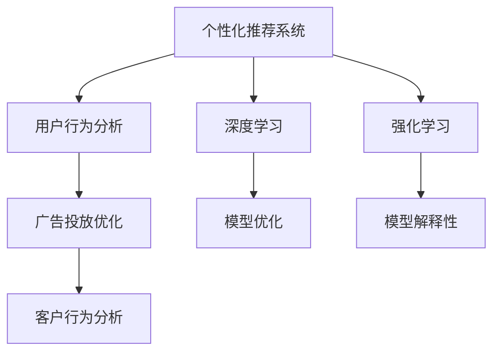

                 

# AI驱动的电商平台个性化营销自动化

> 关键词：电商、个性化推荐、营销自动化、深度学习、强化学习、推荐系统、广告投放、客户行为分析、模型优化、模型解释性

## 1. 背景介绍

### 1.1 问题由来
在电商领域，个性化推荐和自动化营销已成为提高用户留存率、促进用户转化率、提升广告ROI的关键。传统电商推荐和营销方式往往依赖于规则、经验和人工干预，难以满足快速变化的市场需求。

与此同时，深度学习和强化学习等技术在电商行业中的应用，使基于数据驱动的推荐和营销自动化成为可能。通过AI技术，电商平台能够高效分析用户行为数据，实时调整推荐策略，自动化投放广告，实现精准营销，提升用户体验和转化效率。

### 1.2 问题核心关键点
基于AI的个性化推荐和营销自动化主要包含以下关键点：
1. **用户行为分析**：通过数据挖掘技术，识别用户行为特征和购买偏好，构建用户画像。
2. **推荐系统**：利用机器学习算法，实时推荐符合用户兴趣和需求的商品，提升用户转化率。
3. **广告投放优化**：通过广告投放算法，自动选择目标用户并优化投放策略，提升广告ROI。
4. **自动化营销工具**：集成AI驱动的工具，如聊天机器人、动态广告创意生成等，提升用户互动体验。

### 1.3 问题研究意义
通过AI驱动的个性化推荐和营销自动化，电商平台能够实现：
1. 提升用户满意度：个性化推荐和自动化营销能够提供符合用户需求的产品和服务，提升用户体验。
2. 提升转化率：精准的推荐和广告投放能够提高用户购买意愿和转化率，增加销售额。
3. 降低营销成本：自动化营销工具和算法可以大幅减少人力成本，提高广告投放效率。
4. 实时动态调整：通过数据驱动的算法，平台能够实时动态调整推荐和营销策略，应对市场变化。
5. 个性化营销内容：利用深度学习技术，生成符合用户偏好的广告和创意，提升广告效果。

## 2. 核心概念与联系

### 2.1 核心概念概述

为了更好地理解AI驱动的个性化推荐和营销自动化，本节将介绍几个关键概念：

- **个性化推荐系统**：利用用户行为数据，通过机器学习算法实时推荐商品，提升用户满意度。
- **广告投放优化**：通过广告算法选择最优用户和投放策略，最大化广告效果和投资回报率。
- **深度学习**：一种基于神经网络的机器学习技术，能够处理大规模复杂数据，提取高层次特征。
- **强化学习**：通过与环境交互，学习最优决策策略，优化推荐和广告投放效果。
- **客户行为分析**：通过分析用户行为数据，构建用户画像，指导个性化推荐和广告投放。

这些核心概念之间的逻辑关系可以通过以下Mermaid流程图来展示：



这个流程图展示了个性化推荐和营销自动化的核心概念及其之间的关系：

1. 个性化推荐系统利用深度学习和强化学习进行模型优化和解释性分析。
2. 广告投放优化通过用户行为分析，选择最优用户和策略。
3. 客户行为分析通过深度学习提取用户特征，指导个性化推荐和广告投放。

这些概念共同构成了电商平台的AI驱动推荐和营销自动化的基础框架，使其能够高效、精准地服务于用户。

## 3. 核心算法原理 & 具体操作步骤
### 3.1 算法原理概述

AI驱动的个性化推荐和营销自动化，本质上是一种基于机器学习和强化学习的推荐系统。其核心思想是：通过分析用户行为数据，实时调整推荐和广告投放策略，最大化用户满意度和广告效果。

形式化地，假设平台有$N$个用户，每个用户对$M$个商品有不同的兴趣度，记为$u_{i,j}$，其中$i$为用户编号，$j$为商品编号。平台的目标是最大化广告效果和推荐转化率，即最大化目标函数：

$$
\max \sum_{i=1}^N \sum_{j=1}^M u_{i,j} \cdot \text{clicked}_{i,j}
$$

其中$\text{clicked}_{i,j}$为商品$i$推荐给用户$j$的点击率，可以通过深度学习和强化学习等技术进行优化。

### 3.2 算法步骤详解

基于AI的个性化推荐和营销自动化一般包括以下几个关键步骤：

**Step 1: 数据收集与处理**

- 收集用户行为数据，如点击、浏览、购买记录等。
- 使用数据挖掘技术，提取用户行为特征，构建用户画像。

**Step 2: 建立推荐模型**

- 选择合适的机器学习算法，如协同过滤、内容推荐、深度学习等。
- 在训练集上训练推荐模型，优化参数。

**Step 3: 广告投放优化**

- 选择合适的广告投放算法，如A/B测试、强化学习等。
- 在测试集上评估广告投放效果，调整投放策略。

**Step 4: 实时动态调整**

- 通过实时数据流，动态调整推荐和广告策略。
- 利用强化学习算法，实时优化推荐和广告投放效果。

**Step 5: 模型优化与解释**

- 使用正则化、Dropout等技术防止模型过拟合。
- 使用梯度下降等优化算法更新模型参数。
- 引入模型解释性技术，如SHAP、LIME等，解释模型决策过程。

**Step 6: 客户行为分析**

- 使用深度学习模型提取用户行为特征。
- 通过聚类分析、时序分析等方法，构建用户画像。
- 利用聚类结果指导推荐和广告投放。

### 3.3 算法优缺点

基于AI的个性化推荐和营销自动化方法具有以下优点：

1. **效率高**：利用机器学习算法，实时调整推荐和广告策略，提升用户体验和转化率。
2. **个性化强**：通过深度学习技术，根据用户行为数据生成个性化推荐，提升用户满意度。
3. **灵活性高**：利用强化学习算法，动态调整推荐和广告投放策略，适应市场变化。
4. **自动化程度高**：自动化工具和算法可以大幅减少人力成本，提高运营效率。
5. **精确度高**：通过精准的用户画像和行为分析，生成高精度的推荐和广告内容。

同时，该方法也存在一定的局限性：

1. **数据依赖性强**：个性化推荐和广告投放的效果很大程度上依赖于用户行为数据的质量和数量。
2. **模型复杂度高**：深度学习模型的训练和优化需要大量的计算资源和时间。
3. **模型解释性不足**：基于深度学习的推荐系统往往缺乏可解释性，难以调试和优化。
4. **算法偏见**：模型可能会学习到用户行为中的偏见，导致推荐和广告投放的不公平。
5. **鲁棒性不足**：当目标用户的行为变化较大时，模型需要重新训练和调整，效率较低。

尽管存在这些局限性，但基于AI的个性化推荐和营销自动化方法仍是目前电商平台提升用户体验和转化效率的最有效手段。未来相关研究的重点在于如何进一步降低数据依赖，提高模型解释性，增强模型鲁棒性，消除算法偏见等。

### 3.4 算法应用领域

基于AI的个性化推荐和营销自动化，在电商领域已得到广泛应用，覆盖了以下主要领域：

- **商品推荐**：根据用户行为数据，实时推荐符合用户兴趣的商品。
- **广告投放**：自动选择目标用户，优化广告投放策略，提高广告效果。
- **促销活动**：自动生成个性化促销方案，提升用户参与度。
- **客户服务**：使用聊天机器人、动态广告生成等自动化工具，提升客户服务质量。
- **用户画像分析**：通过分析用户行为数据，构建精准的用户画像，指导个性化推荐和广告投放。
- **市场分析**：利用数据分析工具，实时监测市场变化，调整营销策略。

除了电商领域，AI驱动的个性化推荐和营销自动化技术还在零售、旅游、娱乐等行业得到应用，为传统行业数字化转型升级提供了新的技术路径。

## 4. 数学模型和公式 & 详细讲解 & 举例说明

### 4.1 数学模型构建

在实际应用中，可以使用多种数学模型进行个性化推荐和营销自动化的建模，以下以基于协同过滤的推荐系统为例，进行详细讲解。

假设用户$u_i$对商品$v_j$的评分向量为$\mathbf{r}_i \in \mathbb{R}^M$，商品$v_j$的特征向量为$\mathbf{v}_j \in \mathbb{R}^M$。用户$u_i$对商品$v_j$的评分可以表示为：

$$
\hat{r}_{i,j} = \mathbf{r}_i^T \cdot \mathbf{v}_j
$$

其中$\hat{r}_{i,j}$为预测评分，$\cdot$表示向量内积。

### 4.2 公式推导过程

在协同过滤推荐系统中，使用基于用户-商品相似度的评分预测模型。设用户$u_i$和商品$v_j$的相似度为$sim_{i,j}$，则预测评分为：

$$
\hat{r}_{i,j} = \sum_{k=1}^K \alpha_k \cdot \mathbf{r}_i^T \cdot \mathbf{v}_k \cdot \mathbf{v}_j^T \cdot \mathbf{v}_k
$$

其中$K$为相似商品数量，$\alpha_k$为权重系数，$\mathbf{r}_i$和$\mathbf{v}_k$为基于用户-商品相似度矩阵得到的用户和商品的特征表示。

### 4.3 案例分析与讲解

假设某电商平台收集了100万条用户点击数据和10万条用户购买数据，包含50个不同的商品。使用协同过滤模型进行推荐时，首先需要将用户行为数据转换为用户-商品评分矩阵$\mathbf{R} \in \mathbb{R}^{1000000 \times 50000}$，其中每个元素$r_{i,j}$表示用户$i$对商品$j$的评分。然后，通过奇异值分解(SVD)得到用户和商品的特征向量$\mathbf{r}_i$和$\mathbf{v}_j$，计算用户$u_i$和商品$v_j$的相似度$sim_{i,j}$。最后，利用上述评分预测公式，生成个性化推荐列表。

## 5. 项目实践：代码实例和详细解释说明

### 5.1 开发环境搭建

在进行项目实践前，需要准备好开发环境。以下是使用Python进行TensorFlow开发的环境配置流程：

1. 安装Anaconda：从官网下载并安装Anaconda，用于创建独立的Python环境。

2. 创建并激活虚拟环境：
```bash
conda create -n tf-env python=3.8 
conda activate tf-env
```

3. 安装TensorFlow：根据CUDA版本，从官网获取对应的安装命令。例如：
```bash
conda install tensorflow=2.7-cp38-cp38 -c tensorflow -c conda-forge
```

4. 安装各类工具包：
```bash
pip install numpy pandas scikit-learn matplotlib tqdm jupyter notebook ipython
```

完成上述步骤后，即可在`tf-env`环境中开始项目实践。

### 5.2 源代码详细实现

下面我们以基于协同过滤的个性化推荐系统为例，给出使用TensorFlow进行电商推荐模型的PyTorch代码实现。

首先，定义用户行为数据和商品特征数据：

```python
import numpy as np
import pandas as pd
from sklearn.decomposition import TruncatedSVD

# 用户行为数据
user_ratings = pd.read_csv('user_ratings.csv')
user_ratings = user_ratings.pivot_table(index='user_id', columns='item_id', values='rating')

# 商品特征数据
item_features = pd.read_csv('item_features.csv')
item_features = pd.pivot_table(item_features, index='item_id', columns='feature', values='value')

# 对数据进行标准化处理
user_ratings = user_ratings.fillna(0).to_numpy()
item_features = item_features.fillna(0).to_numpy()
```

然后，进行奇异值分解(SVD)和特征提取：

```python
svd = TruncatedSVD(n_components=100)
user_vec = svd.fit_transform(user_ratings)
item_vec = svd.fit_transform(item_features)
```

接着，定义推荐模型并训练：

```python
import tensorflow as tf

# 定义模型
user_vec = tf.constant(user_vec, dtype=tf.float32)
item_vec = tf.constant(item_vec, dtype=tf.float32)

# 计算相似度矩阵
similarity_matrix = tf.matmul(user_vec, item_vec, transpose_b=True)

# 定义评分预测模型
def predict_ratings(user_vec, item_vec, similarity_matrix):
    # 获取用户和商品向量
    user_ids = tf.reshape(user_vec, (user_vec.shape[0], 1))
    item_ids = tf.reshape(item_vec, (item_vec.shape[0], 1))

    # 计算相似度矩阵
    similarity = tf.matmul(user_vec, item_vec, transpose_b=True)

    # 计算预测评分
    predictions = tf.reduce_sum(tf.multiply(similarity, similarity_matrix), axis=1)
    predictions = tf.maximum(predictions, 0.0)

    return predictions

# 训练模型
learning_rate = 0.01
batch_size = 100
num_epochs = 10
train_dataset = tf.data.Dataset.from_tensor_slices((user_vec, item_vec)).batch(batch_size)

with tf.Graph().as_default():
    predictions = predict_ratings(user_vec, item_vec, similarity_matrix)

    # 定义优化器
    optimizer = tf.train.AdamOptimizer(learning_rate)

    # 定义损失函数
    loss = tf.losses.mean_squared_error(labels=user_ratings, predictions=predictions)

    # 定义训练操作
    train_op = optimizer.minimize(loss)

    # 启动训练循环
    with tf.Session() as sess:
        sess.run(tf.global_variables_initializer())
        for epoch in range(num_epochs):
            for i in range(len(train_dataset)):
                _, loss_val = sess.run([train_op, loss], feed_dict={user_vec: train_dataset[i][0], item_vec: train_dataset[i][1]})
            print('Epoch:', epoch, 'Loss:', loss_val)
```

最后，测试模型的推荐效果：

```python
# 测试模型
test_ratings = predict_ratings(test_user_vec, test_item_vec, similarity_matrix)
```

以上就是使用TensorFlow进行基于协同过滤的电商推荐模型的完整代码实现。可以看到，TensorFlow提供了高效易用的工具，使得机器学习模型的开发和训练变得简单快捷。

### 5.3 代码解读与分析

让我们再详细解读一下关键代码的实现细节：

**数据预处理**：
- 使用`pandas`库读取用户行为数据和商品特征数据，并转换为评分矩阵和特征矩阵。
- 使用`TruncatedSVD`进行奇异值分解，提取用户和商品的特征向量。
- 对数据进行标准化处理，防止因数据偏差导致的模型训练问题。

**模型定义与训练**：
- 使用`tensorflow`库定义评分预测模型，通过矩阵乘法计算相似度矩阵。
- 定义优化器和损失函数，使用Adam优化器最小化均方误差损失。
- 在训练循环中，通过`feed_dict`将用户和商品向量传入模型，进行梯度更新。
- 使用`Session`启动训练过程，并记录训练过程中的损失值。

**模型测试**：
- 使用训练好的模型对测试数据进行评分预测，生成推荐列表。

可以看到，TensorFlow通过自动微分技术，使得模型定义和训练变得简单高效，同时提供了丰富的优化器和损失函数，方便开发者进行模型调优。

## 6. 实际应用场景

### 6.1 智能客服系统

基于AI驱动的个性化推荐和营销自动化技术，可以应用于智能客服系统的构建。传统客服往往需要配备大量人力，高峰期响应缓慢，且一致性和专业性难以保证。使用微调后的推荐系统，可以自动推荐解决方案和产品，提升客户满意度。

在技术实现上，可以收集企业内部的历史客服对话记录，将问题和最佳答复构建成监督数据，在此基础上对推荐系统进行微调。微调后的推荐系统能够自动推荐最合适的解决方案，提供符合用户需求的回答。对于用户提出的新问题，还可以接入检索系统实时搜索相关内容，动态组织生成回答。如此构建的智能客服系统，能大幅提升客户咨询体验和问题解决效率。

### 6.2 金融理财平台

金融理财平台利用AI驱动的推荐和营销自动化，为用户提供个性化的金融产品和服务。通过收集用户的交易记录、理财偏好和行为数据，平台可以实时推荐最优的理财产品和投资方案，提升用户粘性和收益。

在技术实现上，可以构建多维度用户画像，使用深度学习模型提取用户行为特征，通过协同过滤、内容推荐等技术生成个性化推荐。同时，使用强化学习算法优化广告投放策略，提升广告点击率和转化率。平台还可以通过动态生成广告创意，提高用户参与度和广告效果。

### 6.3 内容分发平台

内容分发平台利用AI驱动的推荐和营销自动化，为用户提供个性化的内容推荐。通过收集用户的历史浏览记录和行为数据，平台可以实时推荐符合用户兴趣和需求的内容，提升用户满意度和停留时间。

在技术实现上，可以构建用户兴趣图谱，使用深度学习模型提取用户行为特征，通过协同过滤、矩阵分解等技术生成个性化推荐。同时，使用强化学习算法优化广告投放策略，提升广告点击率和转化率。平台还可以通过动态生成广告创意，提高用户参与度和广告效果。

### 6.4 未来应用展望

随着AI驱动的推荐和营销自动化技术的不断发展，将在更多领域得到应用，为传统行业数字化转型升级提供新的技术路径。

在智慧医疗领域，利用AI技术构建个性化的医疗推荐系统，能够提供精准的诊疗建议和健康管理方案，提升患者体验和医疗效果。

在智能教育领域，使用AI推荐系统推荐个性化学习内容和资源，能够根据学生的学习情况和偏好，提供最合适的学习路径和内容，提升教育质量和个性化教育水平。

在智能交通领域，通过AI推荐系统推荐最优的出行方案和交通资源，能够提升用户出行体验和效率。

此外，在智能家居、智能制造、智能物流等领域，AI驱动的推荐和营销自动化技术也将带来深远的影响。相信随着技术的不断演进，AI驱动的推荐和营销自动化将成为各行各业数字化转型的重要引擎。

## 7. 工具和资源推荐
### 7.1 学习资源推荐

为了帮助开发者系统掌握AI驱动的推荐和营销自动化技术，这里推荐一些优质的学习资源：

1. 《深度学习》系列书籍：斯坦福大学开设的深度学习课程，讲解深度学习的基本原理和应用。

2. 《推荐系统》书籍：Recommender Systems: The Textbook，讲解推荐系统的理论基础和实践方法。

3. 《TensorFlow实战》书籍：讲解TensorFlow的基本用法和深度学习模型的实现。

4. Coursera深度学习课程：由深度学习领域的专家授课，涵盖深度学习的基本原理和高级应用。

5. Kaggle推荐系统竞赛：通过实际数据集和竞赛，实战学习推荐系统的构建和优化。

通过对这些资源的学习实践，相信你一定能够快速掌握AI驱动的推荐和营销自动化技术的精髓，并用于解决实际的业务问题。
### 7.2 开发工具推荐

高效的开发离不开优秀的工具支持。以下是几款用于AI驱动推荐和营销自动化开发的常用工具：

1. TensorFlow：由Google主导开发的开源深度学习框架，生产部署方便，适合大规模工程应用。

2. PyTorch：基于Python的开源深度学习框架，灵活动态的计算图，适合快速迭代研究。

3. scikit-learn：Python机器学习库，包含多种经典的推荐算法和优化技术。

4. Jupyter Notebook：交互式编程环境，方便开发和调试。

5. Keras：高层次的深度学习库，简单易用，适合快速原型开发。

6. TensorBoard：TensorFlow配套的可视化工具，可实时监测模型训练状态，提供丰富的图表呈现方式。

合理利用这些工具，可以显著提升AI驱动推荐和营销自动化的开发效率，加快创新迭代的步伐。

### 7.3 相关论文推荐

AI驱动的推荐和营销自动化技术的发展源于学界的持续研究。以下是几篇奠基性的相关论文，推荐阅读：

1. Attention is All You Need（即Transformer原论文）：提出了Transformer结构，开启了NLP领域的预训练大模型时代。

2. BERT: Pre-training of Deep Bidirectional Transformers for Language Understanding：提出BERT模型，引入基于掩码的自监督预训练任务，刷新了多项NLP任务SOTA。

3. Deep Collaborative Filtering via Tensor Decomposition and Matrix Factorization：提出协同过滤推荐算法，是推荐系统领域的经典论文。

4. Advances in Approximate Nearest Neighbors: Toward Trillion-Scale Image Searching：提出基于近似最近邻搜索的推荐算法，适合大规模数据集的应用。

5. Recommendation Systems in Diverse Domains: A Review：总结了推荐系统在多个领域的应用，为推荐系统的研究和应用提供了参考。

这些论文代表了大语言模型微调技术的发展脉络。通过学习这些前沿成果，可以帮助研究者把握学科前进方向，激发更多的创新灵感。

## 8. 总结：未来发展趋势与挑战

### 8.1 总结

本文对基于AI驱动的个性化推荐和营销自动化方法进行了全面系统的介绍。首先阐述了个性化推荐和营销自动化的研究背景和意义，明确了其在提升用户体验和转化效率方面的独特价值。其次，从原理到实践，详细讲解了推荐系统、广告投放优化、深度学习、强化学习等核心技术，给出了推荐系统开发的完整代码实例。同时，本文还广泛探讨了推荐系统在智能客服、金融理财、内容分发等多个领域的应用前景，展示了AI驱动推荐和营销自动化的巨大潜力。此外，本文精选了推荐系统的各类学习资源，力求为读者提供全方位的技术指引。

通过本文的系统梳理，可以看到，基于AI驱动的个性化推荐和营销自动化方法正在成为电商领域的重要范式，极大地提升了推荐和营销的精准度和效率。未来，伴随深度学习和强化学习等技术的不断进步，基于AI的推荐和营销自动化必将在更广泛的领域得到应用，为各行各业数字化转型升级提供新的技术路径。

### 8.2 未来发展趋势

展望未来，AI驱动的个性化推荐和营销自动化技术将呈现以下几个发展趋势：

1. **技术融合**：推荐系统和广告投放优化等技术将进一步融合，实现多模态信息融合和统一优化。
2. **模型轻量化**：模型压缩和优化技术将进一步提升，实现实时推荐和动态调整。
3. **用户行为分析**：通过深度学习和大数据技术，进一步提升用户行为分析和画像构建的准确度。
4. **跨领域应用**：推荐系统将广泛应用于金融、医疗、教育、交通等多个领域，推动各行各业数字化转型。
5. **自动化程度提升**：自动化工具和算法将进一步优化，实现推荐和广告投放的自动化、智能化。
6. **多场景协同**：推荐系统将与智能客服、聊天机器人、智能广告等协同工作，提升用户体验和运营效率。

以上趋势凸显了AI驱动的个性化推荐和营销自动化技术的广阔前景。这些方向的探索发展，必将进一步提升推荐系统的性能和应用范围，为人类生产生活方式带来深远影响。

### 8.3 面临的挑战

尽管AI驱动的个性化推荐和营销自动化技术已经取得了瞩目成就，但在迈向更加智能化、普适化应用的过程中，它仍面临着诸多挑战：

1. **数据质量问题**：推荐系统的性能很大程度上依赖于用户行为数据的质量和数量，如何获取高质量的标注数据，是一个难题。
2. **模型复杂性**：深度学习模型的训练和优化需要大量的计算资源和时间，如何在大规模数据上高效训练和优化模型，是一个挑战。
3. **模型可解释性**：推荐系统的决策过程往往缺乏可解释性，难以进行调试和优化。如何提升模型的可解释性，是一个亟待解决的问题。
4. **算法偏见**：模型可能会学习到用户行为中的偏见，导致推荐和广告投放的不公平。如何消除算法偏见，保障推荐系统的公正性，是一个重要课题。
5. **鲁棒性不足**：当目标用户的行为变化较大时，推荐系统需要重新训练和调整，效率较低。如何提高推荐系统的鲁棒性，是一个研究方向。

尽管存在这些挑战，但AI驱动的个性化推荐和营销自动化方法仍是目前电商领域提升用户体验和转化效率的最有效手段。未来相关研究的重点在于如何进一步降低数据依赖，提高模型解释性，增强模型鲁棒性，消除算法偏见等。

### 8.4 研究展望

面对AI驱动的个性化推荐和营销自动化技术所面临的种种挑战，未来的研究需要在以下几个方面寻求新的突破：

1. **无监督学习**：探索无监督学习范式，摆脱对大规模标注数据的依赖，利用自监督学习、主动学习等无监督范式，最大限度利用非结构化数据，实现更加灵活高效的推荐和营销自动化。

2. **模型压缩和优化**：开发更加参数高效和计算高效的推荐系统，通过模型压缩、剪枝、量化等技术，实现实时推荐和动态调整，提升推荐系统的效率。

3. **融合多模态信息**：引入视觉、语音、时间序列等模态数据，进行多模态融合，提升推荐系统的精准度和鲁棒性。

4. **强化学习优化**：利用强化学习技术，优化推荐和广告投放策略，提升系统性能和用户体验。

5. **跨领域知识融合**：将符号化的先验知识，如知识图谱、逻辑规则等，与神经网络模型进行融合，提升推荐系统的稳定性和鲁棒性。

6. **模型解释性和公平性**：引入模型解释性技术，如SHAP、LIME等，提升推荐系统的可解释性和公正性。

这些研究方向和探索将引领AI驱动的个性化推荐和营销自动化技术迈向更高的台阶，为构建安全、可靠、可解释、可控的智能系统铺平道路。面向未来，AI驱动的推荐和营销自动化技术还需要与其他人工智能技术进行更深入的融合，如知识表示、因果推理、强化学习等，多路径协同发力，共同推动自然语言理解和智能交互系统的进步。只有勇于创新、敢于突破，才能不断拓展语言模型的边界，让智能技术更好地造福人类社会。

## 9. 附录：常见问题与解答

**Q1：AI驱动的个性化推荐和营销自动化方法是否适用于所有电商业务？**

A: AI驱动的个性化推荐和营销自动化方法在大多数电商业务中都能取得不错的效果，但不同业务场景对推荐和营销的需求不同，需要根据具体情况进行调整和优化。例如，在B2B电商中，可能需要更关注销售转化和客户关系管理，而在B2C电商中，则更关注用户满意度和品牌曝光度。因此，需要针对具体业务场景，设计适合的推荐和营销策略。

**Q2：如何降低推荐系统的数据依赖？**

A: 降低推荐系统的数据依赖是一个重要的研究方向。以下是一些可行的方法：
1. 利用生成模型，如GANs、VAEs等，生成高逼真度的假数据，扩充训练数据集。
2. 使用主动学习技术，利用少量标注数据，自动选择最具代表性的样本进行标注，优化模型性能。
3. 利用强化学习，在实际用户行为数据上进行动态调整，减少对历史数据的依赖。

这些方法可以结合使用，提升推荐系统的数据利用效率。

**Q3：推荐系统在实际应用中如何评估性能？**

A: 推荐系统的性能评估通常使用以下几个指标：
1. 准确率（Precision）：推荐系统推荐的商品中，用户实际点击的商品占比。
2. 召回率（Recall）：用户实际点击的商品中，推荐系统推荐的商品占比。
3. F1值（F1 Score）：综合考虑准确率和召回率的指标。
4. 覆盖率（Coverage）：推荐系统中覆盖的商品种类数。
5. DCG和DCG@k：基于用户点击行为的评价指标，DCG表示所有推荐的商品累计收益，DCG@k表示前k个推荐商品的累计收益。

在实际应用中，通常会根据具体业务需求，选择适合的评价指标，对推荐系统进行评估和优化。

**Q4：推荐系统如何实现动态调整？**

A: 推荐系统的动态调整主要依赖于实时数据流和强化学习算法。具体步骤如下：
1. 收集实时用户行为数据，如点击、浏览、购买记录等。
2. 使用深度学习模型提取用户行为特征，实时更新用户画像。
3. 根据用户画像和商品数据，动态生成个性化推荐列表。
4. 使用强化学习算法，实时优化推荐策略和广告投放，提高系统性能和用户体验。

动态调整能够根据市场变化和用户行为，实时调整推荐和广告策略，提升推荐系统的精准度和用户体验。

**Q5：推荐系统如何优化广告投放？**

A: 推荐系统的广告投放优化主要依赖于A/B测试和强化学习算法。具体步骤如下：
1. 选择合适的广告素材和目标用户群体，设计A/B测试方案。
2. 在目标用户群体上进行A/B测试，记录广告点击率和转化率等关键指标。
3. 使用强化学习算法，自动选择最优的广告素材和投放策略，最大化广告效果和ROI。
4. 实时监控广告效果，动态调整投放策略，提高广告点击率和转化率。

优化广告投放能够提高广告的投放效果和投资回报率，提升平台的广告收入。

通过本文的系统梳理，可以看到，AI驱动的个性化推荐和营销自动化方法正在成为电商领域的重要范式，极大地提升了推荐和营销的精准度和效率。未来，伴随深度学习和强化学习等技术的不断进步，基于AI的推荐和营销自动化必将在更广泛的领域得到应用，为各行各业数字化转型升级提供新的技术路径。总之，AI驱动的推荐和营销自动化需要开发者根据具体业务，不断迭代和优化模型、数据和算法，方能得到理想的效果。

