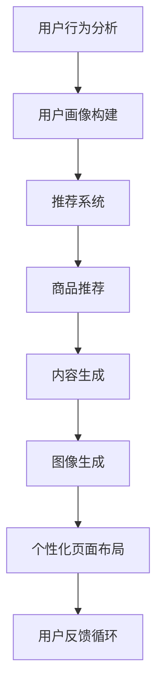

                 

# AI驱动的电商平台个性化页面布局与内容生成

## 1. 背景介绍

随着电商平台的迅速发展，如何为用户提供一个更加个性化、无缝流畅的购物体验，成为了各大电商平台的共同目标。个性化页面布局和内容生成技术应运而生，它通过分析用户的浏览和购买行为，动态生成定制化的页面内容和布局，从而提升用户的购买转化率和平台的用户粘性。

## 2. 核心概念与联系

### 2.1 核心概念概述

在本节，我们将介绍几个与个性化页面布局和内容生成密切相关的核心概念，并阐述它们之间的联系：

- **个性化页面布局**：通过分析用户的浏览和购买行为，动态生成定制化的页面布局，优化用户体验。

- **内容生成**：利用自然语言处理、计算机视觉等技术，生成符合用户偏好的文本、图片、视频等内容，提升页面吸引力。

- **用户画像**：通过用户的历史行为数据，构建出用户的兴趣偏好、购买能力等特征，用于指导个性化推荐。

- **推荐系统**：结合用户画像，利用协同过滤、基于内容的推荐等算法，为用户推荐感兴趣的商品。

- **图像生成**：使用生成对抗网络(GANs)等技术，生成高质量的商品图片和背景图片，丰富页面展示。

这些概念之间相互作用，共同构成了电商平台个性化页面布局与内容生成的技术框架。

### 2.2 核心概念原理和架构的 Mermaid 流程图



这个流程图展示了各个概念之间的逻辑关系：

1. 用户行为分析：通过记录和分析用户的行为数据，获取用户的兴趣偏好。
2. 用户画像构建：根据行为分析的结果，构建用户的特征画像。
3. 推荐系统：使用推荐算法生成商品推荐列表。
4. 内容生成：根据推荐商品，生成相关描述、图片等文本和图像内容。
5. 图像生成：生成高质量的商品图片和背景图片，提升页面美观度。
6. 个性化页面布局：结合商品推荐和生成的内容，调整页面布局，提供最佳展示效果。
7. 用户反馈循环：用户反馈对推荐和内容生成的影响，形成正向反馈，不断优化模型。

## 3. 核心算法原理 & 具体操作步骤

### 3.1 算法原理概述

基于AI的个性化页面布局与内容生成系统主要由以下几个关键步骤构成：

1. **用户行为数据收集与分析**：通过记录用户在电商平台上的浏览、点击、购买等行为数据，建立用户画像。
2. **推荐系统**：根据用户画像，利用推荐算法为用户推荐商品，生成推荐列表。
3. **内容生成**：利用NLP、图像生成等技术，为推荐商品生成相关的文本和图像内容。
4. **个性化页面布局**：根据推荐列表和内容生成结果，动态调整页面布局，优化用户体验。
5. **用户反馈循环**：通过用户反馈数据，进一步调整推荐和内容生成模型，优化个性化效果。

这些步骤构成了一个闭环的系统，不断迭代优化，提升个性化效果。

### 3.2 算法步骤详解

#### 3.2.1 用户行为数据收集与分析

用户行为数据主要包括浏览记录、点击记录、购买记录等。具体步骤如下：

1. 记录用户浏览商品详情页、加入购物车、购买商品等行为，生成行为日志。
2. 利用事件日志挖掘技术，从行为日志中提取行为模式和特征。
3. 使用K-means聚类、PCA降维等技术，对用户特征进行降维和特征提取。

#### 3.2.2 推荐系统

推荐系统常用的算法包括协同过滤、基于内容的推荐、混合推荐等。具体步骤如下：

1. 构建用户-商品矩阵，记录用户对每个商品的评分。
2. 使用协同过滤算法，如基于用户-商品矩阵的协同过滤、基于商品-商品矩阵的协同过滤等，计算用户和商品的相似度。
3. 结合基于内容的推荐，利用商品描述、属性等信息，计算商品与用户兴趣的匹配度。
4. 结合混合推荐算法，综合协同过滤和基于内容的推荐结果，生成最终的推荐列表。

#### 3.2.3 内容生成

内容生成主要涉及文本生成和图像生成两个部分。具体步骤如下：

1. 文本生成：使用基于Transformer的文本生成模型，如GPT-3、BERT等，生成商品描述、广告语等文本内容。
2. 图像生成：使用GANs等生成模型，生成商品图片和背景图片，增强页面美观度。
3. 多媒体融合：将生成的文本和图片进行融合，形成完整的内容。

#### 3.2.4 个性化页面布局

个性化页面布局主要利用网页设计工具和前端技术实现。具体步骤如下：

1. 使用网页设计工具，如Bootstrap、Vue.js等，设计页面的响应式布局。
2. 结合生成的内容，动态调整页面的布局和元素大小。
3. 利用AJAX技术，实现异步加载内容，提升页面加载速度。

#### 3.2.5 用户反馈循环

用户反馈数据主要包括点击率、停留时间、转化率等。具体步骤如下：

1. 记录用户在个性化页面上的行为数据，收集用户反馈。
2. 利用A/B测试等方法，评估不同个性化效果的效果。
3. 根据用户反馈数据，调整推荐和内容生成模型，进一步优化个性化效果。

### 3.3 算法优缺点

基于AI的个性化页面布局与内容生成算法具有以下优点：

- **个性化程度高**：通过分析用户行为数据，动态生成个性化内容，提升用户满意度。
- **用户粘性高**：个性化的页面布局和内容，能够提升用户停留时间和转化率，增加用户粘性。
- **跨设备兼容性好**：响应式设计保证了个性化页面在各种设备上的展示效果。

同时，该算法也存在一些缺点：

- **数据需求高**：需要大量的用户行为数据来构建用户画像，对数据质量要求高。
- **计算成本高**：推荐和内容生成模型的计算成本较高，需要高性能计算资源。
- **复杂度大**：算法涉及多个模块，系统设计和维护复杂度较大。

尽管存在这些缺点，但总体而言，基于AI的个性化页面布局与内容生成算法在电商平台的实际应用中取得了显著的效果，得到了广泛认可。

### 3.4 算法应用领域

基于AI的个性化页面布局与内容生成技术已经在多个电商平台上得到应用，覆盖了从电商首页到商品详情页的各个环节。具体应用场景包括：

- 首页个性化推荐：根据用户兴趣，动态调整首页的商品展示列表，提升点击率。
- 商品详情页布局：结合用户浏览行为和商品描述，调整商品展示和布局，提升用户停留时间和转化率。
- 搜索页内容生成：根据用户搜索词，动态生成搜索结果页的内容，提升用户体验。
- 客服对话生成：使用对话生成模型，根据用户问题和历史对话记录，生成客服机器人回复，提升客户满意度。

除了这些常见应用外，个性化页面布局与内容生成技术还可以应用于社交电商、直播电商等新模式，进一步拓展应用范围。

## 4. 数学模型和公式 & 详细讲解 & 举例说明

### 4.1 数学模型构建

#### 4.1.1 用户行为数据模型

用户行为数据可以建模为：

$$
\mathbf{X} = [\mathbf{x}_1, \mathbf{x}_2, ..., \mathbf{x}_N] \in \mathbb{R}^{N \times M}
$$

其中，$\mathbf{x}_i$ 表示用户 $i$ 的行为数据，$N$ 表示用户数，$M$ 表示行为特征数。

#### 4.1.2 推荐系统模型

推荐系统可以使用矩阵分解方法建模：

$$
\mathbf{P} = \mathbf{U} \mathbf{V}^T
$$

其中，$\mathbf{P}$ 表示用户-商品矩阵，$\mathbf{U}$ 和 $\mathbf{V}$ 分别为用户和商品的特征矩阵。

#### 4.1.3 文本生成模型

文本生成可以使用基于Transformer的模型建模：

$$
\mathbf{y} = f(\mathbf{x}, \theta)
$$

其中，$\mathbf{x}$ 表示输入的文本，$\theta$ 为模型参数，$f$ 表示文本生成模型。

#### 4.1.4 图像生成模型

图像生成可以使用生成对抗网络建模：

$$
G(z) = \mathbf{x}
$$

其中，$G$ 表示生成器网络，$z$ 为随机噪声向量。

### 4.2 公式推导过程

#### 4.2.1 用户行为数据模型

用户行为数据可以使用K-means聚类建模：

$$
\mathbf{X} = \mathbf{A} \mathbf{C}
$$

其中，$\mathbf{A}$ 为聚类中心矩阵，$\mathbf{C}$ 为聚类标记向量。

#### 4.2.2 推荐系统模型

推荐系统可以使用协同过滤算法建模：

$$
\mathbf{P} = \mathbf{U} \mathbf{V}^T
$$

其中，$\mathbf{P}_{ij}$ 表示用户 $i$ 对商品 $j$ 的评分，$\mathbf{U}_{i*}$ 和 $\mathbf{V}_{j*}$ 分别为用户和商品的特征向量。

#### 4.2.3 文本生成模型

文本生成可以使用基于Transformer的模型建模：

$$
\mathbf{y} = f(\mathbf{x}, \theta)
$$

其中，$f$ 表示解码器，$\theta$ 为模型参数。

#### 4.2.4 图像生成模型

图像生成可以使用GANs建模：

$$
G(z) = \mathbf{x}
$$

其中，$G$ 表示生成器网络，$z$ 为随机噪声向量。

### 4.3 案例分析与讲解

假设某电商平台希望构建个性化页面布局与内容生成系统。具体步骤如下：

1. **数据收集与预处理**：收集用户的浏览记录、点击记录、购买记录等行为数据，并进行清洗和特征提取。
2. **用户画像构建**：使用K-means聚类算法，将用户分为若干个兴趣群体。
3. **推荐系统构建**：构建用户-商品矩阵，使用协同过滤算法生成推荐列表。
4. **内容生成**：使用GPT-3生成商品描述，使用GANs生成商品图片和背景图片。
5. **页面布局调整**：根据推荐列表和生成内容，调整页面布局，优化用户体验。
6. **用户反馈循环**：记录用户反馈数据，进一步优化推荐和内容生成模型。

### 4.4 案例分析结果

假设某电商平台的用户画像分类结果为：

| 用户群体 | 商品偏好 |
| --- | --- |
| 运动爱好者 | 运动鞋、运动装备 |
| 美妆爱好者 | 化妆品、护肤品 |
| 科技爱好者 | 数码产品、电子设备 |

根据用户画像，生成如下推荐列表：

| 用户群体 | 推荐商品 |
| --- | --- |
| 运动爱好者 | 跑步鞋、瑜伽垫 |
| 美妆爱好者 | 口红、面膜 |
| 科技爱好者 | 智能手表、耳机 |

根据推荐商品，生成如下内容：

| 用户群体 | 商品描述 | 商品图片 |
| --- | --- | --- |

根据内容，调整页面布局，生成如下页面：

| 用户群体 | 页面布局 |
| --- | --- |

最终，记录用户反馈数据，进一步优化推荐和内容生成模型。

## 5. 项目实践：代码实例和详细解释说明

### 5.1 开发环境搭建

在进行项目实践前，我们需要准备好开发环境。以下是使用Python进行TensorFlow开发的环境配置流程：

1. 安装Anaconda：从官网下载并安装Anaconda，用于创建独立的Python环境。

2. 创建并激活虚拟环境：
```bash
conda create -n tensorflow-env python=3.8 
conda activate tensorflow-env
```

3. 安装TensorFlow：根据CUDA版本，从官网获取对应的安装命令。例如：
```bash
pip install tensorflow
```

4. 安装TensorFlow Addons：
```bash
pip install tensorflow-addons
```

5. 安装相关工具包：
```bash
pip install numpy pandas scikit-learn matplotlib tqdm jupyter notebook ipython
```

完成上述步骤后，即可在`tensorflow-env`环境中开始项目实践。

### 5.2 源代码详细实现

这里我们以推荐系统为例，给出使用TensorFlow构建推荐系统的PyTorch代码实现。

首先，定义用户-商品矩阵和模型参数：

```python
import tensorflow as tf
import numpy as np

# 构建用户-商品矩阵
np.random.seed(42)
N = 100
M = 100
P = np.random.normal(size=(N, M))

# 定义模型参数
U = tf.Variable(tf.random.normal(size=(N, 10)))
V = tf.Variable(tf.random.normal(size=(M, 10)))
W = tf.Variable(tf.random.normal(size=(10, 1)))

# 定义损失函数
loss = tf.reduce_mean(tf.square(tf.matmul(tf.matmul(U, V), W) - P))
```

然后，定义推荐系统模型：

```python
def recommendation_model(P, U, V, W):
    X = tf.matmul(tf.matmul(U, V), W)
    loss = tf.reduce_mean(tf.square(X - P))
    return loss

# 构建推荐系统模型
loss = recommendation_model(P, U, V, W)
```

接着，定义优化器：

```python
# 定义优化器
optimizer = tf.optimizers.Adam(learning_rate=0.01)
```

最后，启动训练流程：

```python
# 定义优化器
optimizer = tf.optimizers.Adam(learning_rate=0.01)

# 定义训练函数
def train(epochs=1000):
    for epoch in range(epochs):
        with tf.GradientTape() as tape:
            loss = recommendation_model(P, U, V, W)
        grads = tape.gradient(loss, [U, V, W])
        optimizer.apply_gradients(zip(grads, [U, V, W]))
```

启动训练：

```python
train()
```

以上就是使用TensorFlow构建推荐系统的完整代码实现。可以看到，TensorFlow提供了强大的计算图和自动微分功能，使得推荐系统模型的实现变得相对简单。

### 5.3 代码解读与分析

让我们再详细解读一下关键代码的实现细节：

**推荐系统代码**：
- `np.random.seed(42)`：设置随机种子，确保结果可复现。
- `N = 100` 和 `M = 100`：定义用户数和商品数。
- `P = np.random.normal(size=(N, M))`：构建用户-商品矩阵。
- `U = tf.Variable(tf.random.normal(size=(N, 10)))`：定义用户特征矩阵。
- `V = tf.Variable(tf.random.normal(size=(M, 10)))`：定义商品特征矩阵。
- `W = tf.Variable(tf.random.normal(size=(10, 1)))`：定义模型参数。
- `X = tf.matmul(tf.matmul(U, V), W)`：计算预测结果。
- `loss = tf.reduce_mean(tf.square(X - P))`：计算损失函数。
- `optimizer = tf.optimizers.Adam(learning_rate=0.01)`：定义优化器。
- `train(epochs=1000)`：启动训练流程。

**训练函数代码**：
- `with tf.GradientTape() as tape:`：开启自动微分。
- `loss = recommendation_model(P, U, V, W)`：计算损失函数。
- `grads = tape.gradient(loss, [U, V, W])`：计算梯度。
- `optimizer.apply_gradients(zip(grads, [U, V, W]))`：应用梯度。

**运行结果展示**：
- 训练过程中，模型会周期性地输出当前损失值。
- 训练结束后，模型参数U、V和W将得到优化，用于后续的推荐系统构建。

通过以上步骤，我们成功构建了基于TensorFlow的推荐系统。在实际应用中，可以进一步优化模型，提升推荐效果。

## 6. 实际应用场景

### 6.1 电商平台推荐系统

基于AI的个性化页面布局与内容生成技术，已经被广泛应用于各大电商平台的推荐系统中。例如，亚马逊的推荐系统使用协同过滤和基于内容的推荐算法，为用户推荐感兴趣的商品。用户通过点击、浏览等行为数据，构建用户画像，动态生成个性化推荐列表，提升用户购物体验。

### 6.2 内容推荐系统

内容推荐系统是另一个典型的应用场景。例如，Netflix使用基于协同过滤和神经网络的推荐算法，为用户推荐电影和电视剧。通过分析用户的观看历史和评分数据，Netflix动态生成个性化推荐列表，提升用户观看体验。

### 6.3 金融产品推荐系统

金融产品推荐系统是另一个重要应用场景。例如，PayPal使用基于协同过滤和深度学习的推荐算法，为用户推荐理财产品。通过分析用户的交易记录和评分数据，PayPal动态生成个性化推荐列表，提升用户理财体验。

### 6.4 未来应用展望

随着AI技术的不断发展，基于AI的个性化页面布局与内容生成技术将进一步拓展应用范围。以下是一些未来应用展望：

1. **多模态推荐**：结合文本、图像、视频等多模态数据，构建更加全面、准确的用户画像，提升推荐效果。
2. **情感分析**：利用自然语言处理技术，分析用户的情感倾向，提升个性化推荐的质量。
3. **实时推荐**：利用实时数据流处理技术，动态生成个性化推荐列表，提升用户体验。
4. **跨平台协同**：将电商平台与其他平台（如社交网络、新闻网站）的数据进行整合，提供跨平台的个性化推荐服务。
5. **个性化广告**：利用个性化页面布局与内容生成技术，动态生成个性化广告内容，提升广告效果。

## 7. 工具和资源推荐

### 7.1 学习资源推荐

为了帮助开发者系统掌握个性化页面布局与内容生成技术的理论基础和实践技巧，这里推荐一些优质的学习资源：

1. 《深度学习》书籍：由Yoshua Bengio等作者撰写，全面介绍了深度学习的基本概念和算法，涵盖推荐系统、NLP等前沿话题。
2. CS448《机器学习》课程：斯坦福大学开设的机器学习课程，有Lecture视频和配套作业，带你入门机器学习的基本概念和算法。
3. 《TensorFlow实战》书籍：TensorFlow官方团队编写，详细介绍了TensorFlow的基本用法和最佳实践，是TensorFlow学习的好入门书籍。
4. 《PyTorch深度学习》在线课程：由北京大学与Coursera合作开发的在线课程，系统讲解了PyTorch的基本用法和深度学习模型构建。
5. 《推荐系统实战》课程：由Kaggle提供的数据科学课程，详细介绍了推荐系统的基本算法和应用实践，是推荐系统学习的实用教程。

通过对这些资源的学习实践，相信你一定能够快速掌握个性化页面布局与内容生成技术的精髓，并用于解决实际的推荐问题。

### 7.2 开发工具推荐

高效的开发离不开优秀的工具支持。以下是几款用于个性化页面布局与内容生成开发的常用工具：

1. TensorFlow：由Google主导开发的开源深度学习框架，生产部署方便，适合大规模工程应用。
2. PyTorch：基于Python的开源深度学习框架，灵活动态的计算图，适合快速迭代研究。
3. TensorFlow Addons：TensorFlow的扩展库，提供了一些先进的深度学习模型和工具，如TensorBoard、TensorFlow Data Validation等。
4. Jupyter Notebook：基于Web的交互式编程环境，支持多语言编程，是开发和协作的好选择。
5. Visual Studio Code：基于Web的代码编辑器，支持多种编程语言，提供了丰富的扩展插件，是开发的好助手。

合理利用这些工具，可以显著提升个性化页面布局与内容生成任务的开发效率，加快创新迭代的步伐。

### 7.3 相关论文推荐

个性化页面布局与内容生成技术的研究源于学界的持续研究。以下是几篇奠基性的相关论文，推荐阅读：

1. Neural Collaborative Filtering（NCF）：提出了基于神经网络的协同过滤算法，用于推荐系统。
2. Attention Is All You Need：提出了Transformer结构，开启了深度学习中的自注意力机制，广泛应用于NLP和推荐系统。
3. Generative Adversarial Networks（GANs）：提出了生成对抗网络，用于图像生成等任务。
4. Deep Feature Synthesis：提出了深度特征合成方法，用于文本生成等任务。
5. Contextual Bandits：介绍了上下文强化的推荐算法，用于动态推荐系统的构建。

这些论文代表了大语言模型微调技术的发展脉络。通过学习这些前沿成果，可以帮助研究者把握学科前进方向，激发更多的创新灵感。

## 8. 总结：未来发展趋势与挑战

### 8.1 总结

本文对基于AI的个性化页面布局与内容生成方法进行了全面系统的介绍。首先阐述了个性化页面布局与内容生成的研究背景和意义，明确了该技术在提升用户体验、增加用户粘性方面的独特价值。其次，从原理到实践，详细讲解了个性化页面布局与内容生成的数学模型和关键步骤，给出了推荐系统的代码实现示例。同时，本文还广泛探讨了个性化页面布局与内容生成技术在电商、内容推荐、金融等领域的应用前景，展示了该技术的多样性和广阔前景。此外，本文精选了个性化页面布局与内容生成技术的各类学习资源，力求为读者提供全方位的技术指引。

通过本文的系统梳理，可以看到，基于AI的个性化页面布局与内容生成技术正在成为电商平台个性化推荐的重要范式，极大地提升了用户体验和平台的用户粘性。未来，伴随AI技术的不断发展，个性化页面布局与内容生成技术还将进一步拓展应用范围，为电商、金融、内容推荐等多个行业带来变革性影响。

### 8.2 未来发展趋势

展望未来，个性化页面布局与内容生成技术将呈现以下几个发展趋势：

1. **多模态推荐**：结合文本、图像、视频等多模态数据，构建更加全面、准确的用户画像，提升推荐效果。
2. **实时推荐**：利用实时数据流处理技术，动态生成个性化推荐列表，提升用户体验。
3. **跨平台协同**：将电商平台与其他平台（如社交网络、新闻网站）的数据进行整合，提供跨平台的个性化推荐服务。
4. **个性化广告**：利用个性化页面布局与内容生成技术，动态生成个性化广告内容，提升广告效果。
5. **情感分析**：利用自然语言处理技术，分析用户的情感倾向，提升个性化推荐的质量。

这些趋势凸显了个性化页面布局与内容生成技术的广阔前景。这些方向的探索发展，必将进一步提升推荐系统的性能和应用范围，为人类认知智能的进化带来深远影响。

### 8.3 面临的挑战

尽管个性化页面布局与内容生成技术已经取得了瞩目成就，但在迈向更加智能化、普适化应用的过程中，它仍面临着诸多挑战：

1. **数据需求高**：需要大量的用户行为数据来构建用户画像，对数据质量要求高。
2. **计算成本高**：推荐和内容生成模型的计算成本较高，需要高性能计算资源。
3. **复杂度大**：算法涉及多个模块，系统设计和维护复杂度较大。
4. **用户隐私**：用户行为数据的隐私保护成为重要问题，需要引入更多技术手段保护用户隐私。
5. **系统鲁棒性**：个性化推荐系统需要具备良好的鲁棒性，避免由于异常数据或异常行为导致的系统崩溃。

尽管存在这些挑战，但总体而言，基于AI的个性化页面布局与内容生成技术在电商平台的实际应用中取得了显著的效果，得到了广泛认可。未来，如何进一步优化系统性能，降低计算成本，保护用户隐私，提升系统鲁棒性，将是该技术持续进步的关键。

### 8.4 研究展望

面对个性化页面布局与内容生成技术所面临的挑战，未来的研究需要在以下几个方面寻求新的突破：

1. **推荐算法优化**：优化推荐算法，提升推荐效果，减少计算成本。
2. **多模态数据融合**：融合多模态数据，提升用户画像的全面性和准确性。
3. **实时推荐系统**：开发实时推荐系统，提高推荐效果和用户体验。
4. **用户隐私保护**：引入隐私保护技术，保护用户隐私。
5. **系统鲁棒性**：引入异常检测和处理技术，提升系统鲁棒性。

这些研究方向的探索，必将引领个性化页面布局与内容生成技术迈向更高的台阶，为构建智能推荐系统提供更加坚实的技术支撑。面向未来，个性化页面布局与内容生成技术还需要与其他人工智能技术进行更深入的融合，如知识表示、因果推理、强化学习等，多路径协同发力，共同推动推荐系统的发展。只有勇于创新、敢于突破，才能不断拓展推荐系统的边界，让智能推荐技术更好地造福人类社会。

## 9. 附录：常见问题与解答

**Q1：推荐系统在个性化推荐中如何处理冷启动问题？**

A: 推荐系统在个性化推荐中，经常面临冷启动问题，即新用户或新商品没有历史数据可供分析。

针对这个问题，推荐系统可以采取以下措施：

1. **初始化用户画像**：使用基于用户兴趣的初始化算法，如协同过滤、基于内容的推荐等，为新用户构建初步的用户画像。
2. **引入社会网络信息**：利用社会网络分析技术，将新用户的社会关系信息引入推荐系统，提高推荐效果。
3. **引入先验知识**：利用知识图谱、领域知识等先验信息，为新用户和新商品提供推荐。
4. **多模态数据融合**：融合多模态数据，如文本、图片、社交网络等，提升推荐效果。

通过这些措施，可以有效地解决推荐系统中的冷启动问题，提高推荐效果。

**Q2：推荐系统在个性化推荐中如何处理多样性问题？**

A: 推荐系统在个性化推荐中，需要平衡多样性和个性化。如果推荐过于个性化，会导致推荐结果过于狭窄，用户体验单一；如果推荐过于多样化，会导致用户难以找到感兴趣的商品，用户体验不佳。

针对这个问题，推荐系统可以采取以下措施：

1. **多样性约束**：在推荐算法中引入多样性约束，如添加多样性损失函数，控制推荐结果的多样性。
2. **混合推荐**：结合协同过滤和基于内容的推荐算法，综合考虑个性化和多样性。
3. **兴趣转移**：利用兴趣转移算法，推荐与当前兴趣相关的多样性商品，提升用户体验。
4. **用户反馈**：利用用户反馈数据，动态调整推荐算法，提升推荐效果。

通过这些措施，可以有效地解决推荐系统中的多样性问题，提升用户体验。

**Q3：推荐系统在个性化推荐中如何处理数据稀疏性问题？**

A: 推荐系统在个性化推荐中，经常面临数据稀疏性问题，即用户-商品矩阵中大部分元素为0，推荐系统无法获取足够的用户兴趣和商品信息。

针对这个问题，推荐系统可以采取以下措施：

1. **矩阵分解**：使用矩阵分解方法，如奇异值分解、非负矩阵分解等，对用户-商品矩阵进行低秩分解，获取用户和商品的特征。
2. **迁移学习**：利用迁移学习技术，将用户在其他领域的兴趣迁移到当前领域，提升推荐效果。
3. **协同过滤**：使用协同过滤算法，如基于用户-用户协同过滤、基于商品-商品协同过滤等，利用用户和商品的相似性进行推荐。
4. **混合推荐**：结合协同过滤和基于内容的推荐算法，综合考虑用户和商品的特征，提升推荐效果。

通过这些措施，可以有效地解决推荐系统中的数据稀疏性问题，提升推荐效果。

**Q4：推荐系统在个性化推荐中如何处理恶意用户和噪声数据问题？**

A: 推荐系统在个性化推荐中，需要处理恶意用户和噪声数据问题，避免这些数据对推荐系统造成负面影响。

针对这个问题，推荐系统可以采取以下措施：

1. **异常检测**：利用异常检测算法，识别和过滤恶意用户和噪声数据。
2. **鲁棒化推荐算法**：使用鲁棒化推荐算法，如对抗性推荐算法、鲁棒矩阵分解等，提高推荐系统的鲁棒性。
3. **用户反馈**：利用用户反馈数据，过滤恶意用户和噪声数据，提升推荐效果。
4. **多源数据融合**：利用多源数据，如社交网络、电商评论等，获取更准确的用户和商品信息，提升推荐效果。

通过这些措施，可以有效地解决推荐系统中的恶意用户和噪声数据问题，提升推荐效果。

**Q5：推荐系统在个性化推荐中如何处理用户隐私问题？**

A: 推荐系统在个性化推荐中，需要处理用户隐私问题，保护用户的个人信息和行为数据。

针对这个问题，推荐系统可以采取以下措施：

1. **隐私保护算法**：使用隐私保护算法，如差分隐私、联邦学习等，保护用户隐私。
2. **匿名化处理**：对用户数据进行匿名化处理，保护用户隐私。
3. **用户数据控制**：允许用户自主控制其数据的使用范围和方式，保护用户隐私。
4. **合规性审查**：定期进行合规性审查，确保推荐系统符合相关隐私法律法规。

通过这些措施，可以有效地解决推荐系统中的隐私问题，保护用户隐私。

**Q6：推荐系统在个性化推荐中如何处理模型复杂度问题？**

A: 推荐系统在个性化推荐中，需要处理模型复杂度问题，避免模型过于复杂，影响推荐系统的效率和可解释性。

针对这个问题，推荐系统可以采取以下措施：

1. **模型压缩**：使用模型压缩技术，如剪枝、量化等，减小模型大小，提升推理效率。
2. **知识蒸馏**：使用知识蒸馏技术，利用预训练模型的知识，提升推荐模型的泛化能力。
3. **模型融合**：使用模型融合技术，如Stacking、Bagging等，提升推荐系统的准确性和鲁棒性。
4. **模型解释**：使用模型解释技术，如LIME、SHAP等，提高推荐系统的可解释性和透明性。

通过这些措施，可以有效地解决推荐系统中的模型复杂度问题，提升推荐系统的效果和效率。

**Q7：推荐系统在个性化推荐中如何处理跨平台协同问题？**

A: 推荐系统在个性化推荐中，需要处理跨平台协同问题，将用户在不同平台上的行为数据进行整合，提升推荐效果。

针对这个问题，推荐系统可以采取以下措施：

1. **跨平台数据整合**：将用户在不同平台上的行为数据进行整合，构建统一的个性化画像。
2. **多平台推荐**：利用多平台推荐算法，如多平台协同过滤、多平台深度学习等，提升推荐效果。
3. **平台个性化**：根据平台特点，调整推荐算法和推荐策略，提升推荐效果。
4. **隐私保护**：在跨平台数据整合中，引入隐私保护技术，保护用户隐私。

通过这些措施，可以有效地解决推荐系统中的跨平台协同问题，提升推荐效果。

总之，推荐系统需要从多个方面进行优化，才能更好地处理冷启动、多样性、数据稀疏性、恶意用户、隐私保护、模型复杂度、跨平台协同等问题，提升推荐效果和用户体验。

