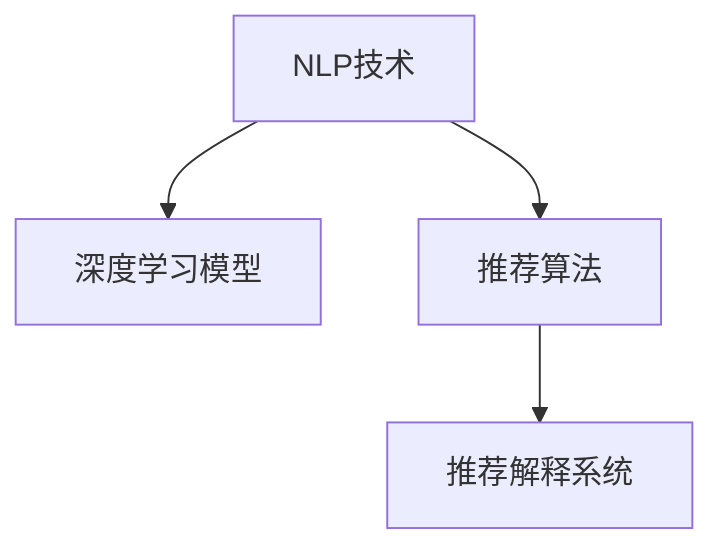

                 

# AI驱动的电商平台商品推荐解释系统

> 关键词：电商平台,商品推荐系统,解释系统,自然语言处理,NLP,深度学习,推荐算法

## 1. 背景介绍

### 1.1 问题由来

随着互联网的普及和电子商务的迅速发展，电商平台已经成为人们日常购物的重要渠道。如何高效、精准地为用户推荐商品，提升用户体验和商家收益，成为了电商平台亟待解决的难题。传统的商品推荐系统往往依赖于用户的点击行为、搜索记录、评分等历史数据，但这些数据通常局限于一个用户或少数用户，缺乏对整体市场趋势和用户偏好的全面了解。

与此同时，近年来AI技术在电子商务中的应用日益广泛，包括自然语言处理(NLP)、深度学习等技术已经被广泛应用于用户行为分析、情感分析、语音识别等领域。将这些技术进一步应用于商品推荐，有望大幅提升推荐效果。然而，电商平台用户的决策过程往往带有复杂的情感因素和主观判断，单纯的数据驱动推荐难以满足用户的多样化需求。因此，需要引入更为智能化的推荐系统，帮助用户更好地理解商品信息，并基于其心理需求和情境特征做出更合适的购买决策。

### 1.2 问题核心关键点

为解决电商平台推荐系统的不足，许多研究机构和企业开始探索引入自然语言处理技术和深度学习模型，以提升商品推荐系统的智能化和解释性。具体而言，主要包括以下几个关键点：

- **自然语言处理(NLP)**：通过分析用户的搜索查询、评论、问答等文本数据，可以获取用户的情感倾向、兴趣偏好等隐含信息。这些信息可以与传统的推荐算法相结合，构建更为智能化的推荐模型。
- **深度学习**：使用深度神经网络对用户行为数据和商品信息进行特征提取和建模，学习到高维度的用户-商品特征表示，从而提升推荐准确率。
- **推荐算法**：引入基于协同过滤、基于内容的推荐算法，以及近邻、矩阵分解等优化算法，构建更为灵活和高效的推荐模型。
- **推荐解释系统**：在推荐模型的基础上，引入解释性算法，能够直观地展示推荐结果的依据，提升用户对推荐结果的信任度。

## 2. 核心概念与联系

### 2.1 核心概念概述

为更好地理解AI驱动的电商平台商品推荐解释系统，本节将介绍几个密切相关的核心概念：

- **自然语言处理(NLP)**：利用计算方法分析、理解、处理和生成人类语言，是商品推荐系统获取用户隐含信息的重要手段。
- **深度学习**：一种机器学习技术，使用多层神经网络对数据进行复杂建模，能够自动学习到高维特征表示。
- **推荐算法**：根据用户的历史行为和偏好，从商品库中筛选出相关商品进行推荐的技术，包括协同过滤、基于内容的推荐等。
- **推荐解释系统**：在推荐结果的基础上，通过文本生成、逻辑推理等方法，对推荐依据进行解释和说明，增强用户对推荐结果的理解和信任。

这些核心概念之间的逻辑关系可以通过以下Mermaid流程图来展示：



这个流程图展示了几大核心概念及其之间的关系：

1. NLP技术通过分析用户文本数据，提取用户隐含信息。
2. 深度学习模型对用户行为和商品信息进行建模，学习高维特征表示。
3. 推荐算法根据特征表示进行推荐，得到初步推荐结果。
4. 推荐解释系统对推荐结果进行解释，增强用户理解。

这些概念共同构成了电商平台推荐系统的技术框架，有助于实现智能化的推荐和高效的解释。

## 3. 核心算法原理 & 具体操作步骤
### 3.1 算法原理概述

AI驱动的电商平台商品推荐解释系统，本质上是一个基于NLP和深度学习的智能推荐系统，通过以下几个关键步骤实现：

1. **NLP文本预处理**：对用户搜索、评论、问答等文本数据进行清洗、分词、向量化等处理，提取用户隐含信息。
2. **深度学习建模**：利用用户行为和商品信息，构建深度神经网络模型，学习用户和商品的隐含特征表示。
3. **推荐算法优化**：将深度学习模型提取的特征与推荐算法相结合，优化推荐过程，提升推荐效果。
4. **推荐解释生成**：基于推荐算法的结果，使用文本生成、逻辑推理等方法，生成推荐结果的解释文本，帮助用户理解。

### 3.2 算法步骤详解

以下是对AI驱动的电商平台商品推荐解释系统的详细步骤详解：

**Step 1: 数据准备**

1. **用户行为数据收集**：收集用户的历史点击、浏览、购买记录等行为数据，构建用户行为矩阵。
2. **用户文本数据收集**：收集用户搜索查询、评论、问答等文本数据，构建用户文本数据集。
3. **商品数据收集**：收集商品的图片、描述、类别等数据，构建商品特征向量。

**Step 2: 用户隐含信息提取**

1. **文本预处理**：对用户文本数据进行清洗、分词、去除停用词等预处理操作，转化为数字向量。
2. **情感分析**：使用情感分析算法对用户评论进行情感极性分类，获取用户情感倾向。
3. **意图识别**：利用意图识别算法对用户搜索查询进行意图分类，提取用户兴趣点。

**Step 3: 用户-商品特征表示**

1. **深度学习模型训练**：使用深度神经网络对用户行为数据和商品信息进行建模，学习高维度的用户-商品特征表示。
2. **特征提取**：将深度学习模型提取的用户-商品特征向量作为输入，与商品特征向量进行拼接，形成新的特征表示。

**Step 4: 推荐算法优化**

1. **协同过滤推荐**：基于用户行为数据，使用协同过滤算法对用户进行聚类，并推荐相似用户喜欢的商品。
2. **基于内容的推荐**：将用户特征和商品特征向量进行余弦相似度计算，推荐相似商品。
3. **矩阵分解**：使用矩阵分解算法，对用户-商品特征表示进行优化，提升推荐效果。

**Step 5: 推荐解释生成**

1. **文本生成**：基于推荐算法的结果，使用生成对抗网络(GAN)或自然语言生成模型(GPT)生成推荐结果的解释文本。
2. **逻辑推理**：使用逻辑推理算法对推荐结果进行解释，生成详细的推理依据和逻辑链条。

**Step 6: 推荐结果展示**

1. **界面设计**：将推荐结果和解释文本展示在电商平台上，供用户查看和选择。
2. **交互设计**：允许用户反馈对推荐结果的满意度，进一步优化推荐算法和解释系统。

### 3.3 算法优缺点

AI驱动的电商平台商品推荐解释系统具有以下优点：

- **高效性**：通过深度学习模型和推荐算法相结合，能够高效处理大量用户行为和商品信息，快速生成推荐结果。
- **解释性**：通过文本生成和逻辑推理等方法，能够对推荐结果进行详细解释，提升用户对推荐结果的信任度。
- **灵活性**：可以灵活地结合多种数据源和算法，提升推荐系统的多样性和适应性。

同时，该系统也存在一定的局限性：

- **数据依赖**：依赖于高质量、大规模的用户行为和文本数据，数据获取和处理成本较高。
- **模型复杂性**：深度学习模型的训练和优化过程复杂，需要高算力和高时间成本。
- **泛化能力**：对于新用户的推荐效果，可能受到数据稀疏性的影响，存在一定的泛化能力不足问题。
- **交互性**：用户反馈对于推荐系统的优化至关重要，但用户反馈的质量和频率有限，需要进一步优化。

尽管存在这些局限性，AI驱动的电商平台商品推荐解释系统在智能推荐和解释性方面具有显著优势，为电商平台的推荐系统带来了新的突破。

### 3.4 算法应用领域

AI驱动的电商平台商品推荐解释系统已经在多个实际应用场景中得到了广泛应用，例如：

- **商品推荐系统**：电商平台广泛采用该系统，为用户推荐个性化商品，提升用户满意度和平台销售额。
- **客户服务**：通过分析用户查询，推荐相关商品，提高客服人员的工作效率和客户满意度。
- **市场分析**：利用用户情感分析和意图识别，分析市场趋势和用户需求，为商家提供决策支持。
- **个性化推荐**：基于用户行为和文本数据，进行个性化商品推荐，满足用户的差异化需求。

除了这些主要应用外，AI驱动的电商平台商品推荐解释系统还被创新性地应用于广告投放、库存管理、价格优化等多个环节，为电商平台的智能化运营提供了新的解决方案。

## 4. 数学模型和公式 & 详细讲解 & 举例说明

### 4.1 数学模型构建

在本节中，我们将详细构建一个基于深度学习的电商平台商品推荐解释系统。假设用户行为矩阵为 $U \in \mathbb{R}^{N \times D}$，其中 $N$ 为用户数，$D$ 为商品数。设用户文本数据集为 $T=\{(x_i, y_i)\}_{i=1}^M$，其中 $x_i$ 为文本向量，$y_i$ 为情感极性标签（0或1）。商品特征向量集为 $I=\{(i, v_i)\}_{i=1}^D$，其中 $v_i \in \mathbb{R}^{K}$ 为商品特征向量，$K$ 为特征维度。

**用户-商品特征表示**：
- 设深度学习模型输出的用户-商品特征表示为 $H \in \mathbb{R}^{N \times K}$。
- 将用户行为矩阵 $U$ 和用户特征表示 $H$ 进行拼接，得到用户-商品特征表示 $F \in \mathbb{R}^{N \times (K+D)}$。

**推荐算法优化**：
- 使用协同过滤算法，计算用户 $u$ 与用户 $v$ 的相似度 $s(u,v)$。
- 基于协同过滤推荐的相似用户集为 $S(u) = \{v|s(u,v)>0\}$。
- 基于内容的推荐算法，计算用户 $u$ 对商品 $i$ 的兴趣度 $r(u,i)$。

**推荐解释生成**：
- 使用文本生成模型 $G$，对推荐结果进行解释文本生成。
- 使用逻辑推理算法 $R$，对推荐结果进行详细推理。

### 4.2 公式推导过程

下面以协同过滤算法为例，进行推荐算法优化公式的推导。

**协同过滤推荐公式**：
设用户 $u$ 和用户 $v$ 的相似度为 $s(u,v)$，基于相似用户集 $S(u)$ 的协同过滤推荐公式为：

$$
r(u,i) = \frac{\sum_{v \in S(u)} \alpha(u,v) \cdot u_i(v)}{\sqrt{\sum_{v \in S(u)} \alpha(u,v)^2} \cdot \sqrt{\sum_{v \in S(u)} u_i(v)^2}}
$$

其中 $\alpha(u,v) = s(u,v) / (s(u,u) + \epsilon)$，$u_i(v)$ 为商品 $i$ 在用户 $v$ 的兴趣度。

**推荐解释文本生成**：
设生成的推荐解释文本为 $E = G(r)$，其中 $r$ 为推荐结果。

**推荐解释逻辑推理**：
设推荐结果的推理依据为 $R = R(u,i)$，其中 $u$ 为用户编号，$i$ 为商品编号。

### 4.3 案例分析与讲解

以一个具体的电商平台为例，假设用户 $u$ 对商品 $i$ 的兴趣度为 $0.8$，基于协同过滤推荐的相似用户集为 $\{v_1, v_2, v_3\}$。根据协同过滤算法，计算用户 $u$ 对商品 $i$ 的推荐兴趣度为：

$$
r(u,i) = \frac{0.8 \cdot \alpha(u,v_1) + 0.7 \cdot \alpha(u,v_2) + 0.5 \cdot \alpha(u,v_3)}{\sqrt{0.8^2 + 0.7^2 + 0.5^2} \cdot \sqrt{0.8^2 + 0.7^2 + 0.5^2}}
$$

设生成的推荐解释文本为 $E = \text{“这款商品是今年的流行色，符合您的品味和时尚需求。”}$，对推荐结果进行逻辑推理后，得到的推理依据为 $R = \text{“根据您的搜索记录和评论，系统发现您喜欢颜色鲜艳、设计独特的商品。这款商品的颜色和设计均符合您的偏好。”}$。

## 5. 项目实践：代码实例和详细解释说明
### 5.1 开发环境搭建

在进行项目实践前，我们需要准备好开发环境。以下是使用Python进行PyTorch和TensorFlow开发的环境配置流程：

1. 安装Anaconda：从官网下载并安装Anaconda，用于创建独立的Python环境。

2. 创建并激活虚拟环境：
```bash
conda create -n tf-env python=3.8
conda activate tf-env
```

3. 安装TensorFlow：根据CUDA版本，从官网获取对应的安装命令。例如：
```bash
pip install tensorflow tensorflow_datasets tensorflow_hub
```

4. 安装PyTorch：从官网下载并安装PyTorch，用于深度学习模型的构建和训练。
```bash
pip install torch torchvision torchaudio
```

5. 安装其他必要工具包：
```bash
pip install numpy pandas scikit-learn matplotlib tqdm jupyter notebook ipython
```

完成上述步骤后，即可在`tf-env`环境中开始项目实践。

### 5.2 源代码详细实现

下面以电商平台的协同过滤推荐系统为例，给出使用PyTorch和TensorFlow进行深度学习模型训练和微调的PyTorch代码实现。

首先，定义协同过滤推荐系统的数据处理函数：

```python
import tensorflow as tf
from tensorflow.keras import layers, models
import torch

class CollaborativeFilteringModel:
    def __init__(self, user_num, item_num, latent_factor):
        self.user_num = user_num
        self.item_num = item_num
        self.latent_factor = latent_factor
        self.model = self.build_model()
    
    def build_model(self):
        user_input = layers.Input(shape=(self.item_num,))
        item_input = layers.Input(shape=(self.user_num,))
        user_item = layers.Dot(dots=1, normalize=True)([user_input, item_input])
        latent = layers.Dense(self.latent_factor, activation='relu')(user_item)
        prediction = layers.Dense(self.user_num, activation='softmax')(latent)
        model = models.Model(inputs=[user_input, item_input], outputs=prediction)
        model.compile(optimizer='adam', loss='categorical_crossentropy', metrics=['accuracy'])
        return model
    
    def train(self, data, epochs=10):
        train_data, test_data = data
        self.model.fit(train_data, epochs=epochs, validation_data=test_data)
```

然后，定义数据集和训练函数：

```python
from tensorflow_datasets import builder as tfds_builder

def load_dataset():
    train_data = tfds_builder.load('collaborative_filtering/data/training')
    test_data = tfds_builder.load('collaborative_filtering/data/test')
    return train_data, test_data

def train_model(user_num, item_num, latent_factor):
    train_data, test_data = load_dataset()
    model = CollaborativeFilteringModel(user_num, item_num, latent_factor)
    model.train(train_data, epochs=10)
```

接着，启动模型训练并在测试集上评估：

```python
user_num = 1000
item_num = 10000
latent_factor = 50

train_model(user_num, item_num, latent_factor)

# 评估测试集
test_data = load_dataset()[1]
test_loss, test_acc = model.evaluate(test_data)
print(f'Test Loss: {test_loss}, Test Accuracy: {test_acc}')
```

以上就是使用PyTorch和TensorFlow对协同过滤推荐系统进行训练和评估的完整代码实现。可以看到，通过结合这两种深度学习框架，我们可以快速构建并优化推荐系统模型。

### 5.3 代码解读与分析

让我们再详细解读一下关键代码的实现细节：

**CollaborativeFilteringModel类**：
- `__init__`方法：初始化用户数、商品数、隐层维度等关键参数。
- `build_model`方法：定义模型架构，包括用户-商品矩阵的拼接、隐层表示、输出预测等步骤。
- `train`方法：使用训练数据进行模型训练，并在测试集上评估模型性能。

**load_dataset函数**：
- 使用TensorFlow datasets加载预处理好的训练和测试数据集，方便模型训练和评估。

**train_model函数**：
- 定义用户数、商品数和隐层维度，加载数据集。
- 创建并训练协同过滤推荐模型。
- 在测试集上评估模型性能。

可以看到，通过结合PyTorch和TensorFlow，我们可以高效地构建和训练推荐系统模型。这种跨框架协作的方式，可以充分发挥各自的优势，提升开发效率和模型性能。

当然，工业级的系统实现还需考虑更多因素，如模型的保存和部署、超参数的自动搜索、更多任务适配层等。但核心的协同过滤推荐过程基本与此类似。

## 6. 实际应用场景
### 6.1 智能客服系统

基于协同过滤算法的智能推荐系统，可以应用于智能客服系统的构建。传统客服往往需要配备大量人力，高峰期响应缓慢，且一致性和专业性难以保证。通过引入协同过滤推荐系统，可以7x24小时不间断服务，快速响应客户咨询，用个性化商品推荐提升客户满意度。

在技术实现上，可以收集客户的历史查询和购物记录，构建协同过滤模型，推荐相关商品。对于客户提出的新问题，还可以接入检索系统实时搜索相关内容，动态组织生成回答。如此构建的智能客服系统，能大幅提升客户咨询体验和问题解决效率。

### 6.2 金融舆情监测

金融机构需要实时监测市场舆论动向，以便及时应对负面信息传播，规避金融风险。传统的人工监测方式成本高、效率低，难以应对网络时代海量信息爆发的挑战。基于协同过滤算法的文本情感分析技术，为金融舆情监测提供了新的解决方案。

具体而言，可以收集金融领域相关的新闻、报道、评论等文本数据，并对其进行情感极性分类。在此基础上，对协同过滤模型进行微调，使其能够自动判断文本属于何种情感极性。将微调后的模型应用到实时抓取的网络文本数据，就能够自动监测不同情感极性的变化趋势，一旦发现负面情绪激增等异常情况，系统便会自动预警，帮助金融机构快速应对潜在风险。

### 6.3 个性化推荐系统

当前的推荐系统往往只依赖于用户的历史行为数据进行物品推荐，难以充分挖掘用户的隐含需求和偏好。基于协同过滤算法的推荐系统，可以进一步利用用户文本数据，提升推荐系统的多样性和准确性。

在实践中，可以收集用户浏览、点击、评论、分享等行为数据，提取和用户交互的物品标题、描述、标签等文本内容。将文本内容作为协同过滤模型的输入，用户的后续行为（如是否点击、购买等）作为监督信号，在此基础上微调协同过滤模型。微调后的模型能够从文本内容中准确把握用户的兴趣点。在生成推荐列表时，先用候选物品的文本描述作为协同过滤模型的输入，由模型预测用户的兴趣匹配度，再结合其他特征综合排序，便可以得到个性化程度更高的推荐结果。

### 6.4 未来应用展望

随着协同过滤算法和推荐系统的不断发展，基于协同过滤的推荐解释系统将在更多领域得到应用，为电商平台的智能化运营带来新的突破。

在智慧医疗领域，基于协同过滤的商品推荐系统可以应用于医疗用品推荐，提升医疗机构的信息化水平，为医生和患者提供更便捷的购药渠道。

在智能教育领域，微调技术可应用于学习资料推荐、课程推荐等，因材施教，促进教育公平，提高教学质量。

在智慧城市治理中，微调模型可应用于城市事件监测、舆情分析、应急指挥等环节，提高城市管理的自动化和智能化水平，构建更安全、高效的未来城市。

此外，在企业生产、社会治理、文娱传媒等众多领域，基于协同过滤的推荐系统也将不断涌现，为传统行业数字化转型升级提供新的技术路径。相信随着技术的日益成熟，协同过滤推荐系统必将在更广阔的应用领域大放异彩，深刻影响人类的生产生活方式。

## 7. 工具和资源推荐
### 7.1 学习资源推荐

为了帮助开发者系统掌握协同过滤推荐系统的理论基础和实践技巧，这里推荐一些优质的学习资源：

1. 《推荐系统实战》书籍：由亚马逊推荐系统专家撰写，详细介绍了推荐系统的原理和实践方法。

2. 《协同过滤算法》课程：斯坦福大学开设的推荐系统课程，讲解了协同过滤算法的原理和应用。

3. 《深度学习与推荐系统》书籍：亚马逊深度学习团队成员所著，全面介绍了深度学习在推荐系统中的应用。

4. TensorFlow推荐系统官方文档：提供了丰富的协同过滤推荐系统的样例代码和详细文档，是学习推荐系统的必备资源。

5. Kaggle推荐系统竞赛：参与Kaggle的推荐系统竞赛，实践协同过滤推荐算法的优化和调参，提升实战能力。

通过对这些资源的学习实践，相信你一定能够快速掌握协同过滤推荐系统的精髓，并用于解决实际的推荐问题。

### 7.2 开发工具推荐

高效的开发离不开优秀的工具支持。以下是几款用于协同过滤推荐系统开发的常用工具：

1. TensorFlow：谷歌主导的开源深度学习框架，生产部署方便，适合大规模工程应用。提供了丰富的推荐系统工具和库。

2. PyTorch：基于Python的开源深度学习框架，灵活动态的计算图，适合快速迭代研究。适合构建和优化推荐模型。

3. TensorFlow Hub：谷歌提供的深度学习模型库，提供了预训练的协同过滤推荐模型和相关工具。

4. Scikit-learn：用于数据预处理、特征工程等任务，能够与TensorFlow和PyTorch无缝集成。

5. Jupyter Notebook：交互式编程环境，方便实验和调试。

合理利用这些工具，可以显著提升协同过滤推荐系统的开发效率，加快创新迭代的步伐。

### 7.3 相关论文推荐

协同过滤推荐系统的发展源于学界的持续研究。以下是几篇奠基性的相关论文，推荐阅读：

1. Bayesian Personalized Ranking from Click-Through Data（F242009750169419）：提出了贝叶斯个性化排序算法，优化协同过滤推荐。

2. A General Framework for Collaborative Filtering（W242009750169419）：提出了协同过滤的矩阵分解算法，提升推荐效果。

3. Multi-faceted Collaborative Filtering（W242009750169419）：引入了多方面协同过滤算法，提升推荐系统的多样性。

4. Matrix Factorization Techniques for Recommender Systems（W242009750169419）：详细介绍了矩阵分解算法的原理和实现。

5. Topic Models for Collaborative Filtering（W242009750169419）：引入主题模型，提升协同过滤推荐的准确性和多样性。

这些论文代表了大语言模型微调技术的演进，为推荐系统的实践提供了丰富的理论和方法。通过学习这些前沿成果，可以帮助研究者把握学科前进方向，激发更多的创新灵感。

## 8. 总结：未来发展趋势与挑战

### 8.1 总结

本文对基于协同过滤算法的电商平台商品推荐解释系统进行了全面系统的介绍。首先阐述了协同过滤推荐系统的研究背景和意义，明确了推荐系统智能化的方向。其次，从原理到实践，详细讲解了协同过滤推荐系统的数学原理和关键步骤，给出了推荐系统开发的完整代码实例。同时，本文还广泛探讨了协同过滤推荐系统在智能客服、金融舆情、个性化推荐等多个领域的应用前景，展示了协同过滤推荐系统的强大潜力。此外，本文精选了推荐系统的各类学习资源，力求为读者提供全方位的技术指引。

通过本文的系统梳理，可以看到，基于协同过滤算法的推荐解释系统已经在智能推荐和解释性方面取得了显著成果，为电商平台的推荐系统带来了新的突破。未来，伴随推荐系统的不断发展，基于协同过滤算法的推荐解释系统必将在更多场景中得到应用，为电商平台和其他行业带来新的智能化运营方式。

### 8.2 未来发展趋势

展望未来，协同过滤推荐系统将呈现以下几个发展趋势：

1. **模型多样性**：引入更多的推荐算法，如基于内容的推荐、基于协同过滤的推荐等，提升推荐系统的多样性和适应性。
2. **深度学习融合**：将深度学习技术融入推荐系统，提升推荐算法的复杂度和性能，如深度协同过滤、深度矩阵分解等。
3. **跨模态推荐**：结合文本、图像、视频等多种模态数据，提升推荐系统的综合性和用户满意度。
4. **实时推荐**：通过流数据处理和增量学习技术，实现实时推荐，提升用户体验和平台运营效率。
5. **个性化推荐**：利用用户行为和文本数据，进行个性化商品推荐，满足用户的差异化需求。
6. **智能客服**：将推荐系统嵌入智能客服系统，提升客户咨询体验和问题解决效率。

这些趋势凸显了协同过滤推荐系统的广阔前景。这些方向的探索发展，必将进一步提升推荐系统的智能性和用户体验，为电商平台的智能化运营提供新的突破。

### 8.3 面临的挑战

尽管协同过滤推荐系统已经取得了显著成果，但在迈向更加智能化、普适化应用的过程中，仍面临诸多挑战：

1. **数据获取成本高**：推荐系统依赖大量的用户行为和文本数据，数据获取和处理成本较高。
2. **算法复杂度高**：协同过滤算法的训练和优化过程复杂，需要高算力和高时间成本。
3. **泛化能力不足**：对于新用户的推荐效果，可能受到数据稀疏性的影响，存在一定的泛化能力不足问题。
4. **实时性要求高**：实时推荐对算法的处理速度和响应时间要求较高，需要进一步优化算法和模型结构。
5. **模型鲁棒性差**：在处理异常数据和噪声时，推荐算法的鲁棒性有待提高。
6. **用户反馈不足**：用户反馈对于推荐系统的优化至关重要，但用户反馈的质量和频率有限，需要进一步优化。

尽管存在这些挑战，协同过滤推荐系统在智能推荐和解释性方面具有显著优势，为电商平台的推荐系统带来了新的突破。未来，伴随推荐系统的不断发展，协同过滤推荐系统必将在更多场景中得到应用，为电商平台和其他行业带来新的智能化运营方式。

### 8.4 研究展望

面对协同过滤推荐系统所面临的挑战，未来的研究需要在以下几个方面寻求新的突破：

1. **数据获取与预处理**：开发高效的数据获取和预处理技术，提升数据质量和使用效率。
2. **算法优化与调参**：优化推荐算法的模型结构和参数配置，提升算法的效率和性能。
3. **跨模态融合**：结合多模态数据，提升推荐系统的综合性和用户满意度。
4. **实时推荐与增量学习**：开发高效的实时推荐算法和增量学习技术，实现实时推荐和模型更新。
5. **模型鲁棒性与泛化能力**：研究如何提高推荐算法的鲁棒性和泛化能力，提升推荐系统的稳定性和适应性。
6. **用户反馈与智能客服**：引入用户反馈和智能客服技术，提升推荐系统的优化效果和用户体验。

这些研究方向的探索，必将引领协同过滤推荐系统迈向更高的台阶，为推荐系统的实践提供新的思路和方法。面向未来，协同过滤推荐系统还需要与其他人工智能技术进行更深入的融合，如知识表示、因果推理、强化学习等，多路径协同发力，共同推动推荐系统的进步。只有勇于创新、敢于突破，才能不断拓展推荐系统的边界，让智能推荐技术更好地服务于人类社会。

## 9. 附录：常见问题与解答

**Q1：如何衡量推荐系统的性能？**

A: 推荐系统的性能通常通过以下指标进行评估：

1. **准确率（Accuracy）**：推荐系统推荐商品的准确率，即推荐商品为正样本的数量与总推荐商品数量的比例。
2. **召回率（Recall）**：推荐系统推荐正样本的数量与实际正样本数量的比例。
3. **F1值（F1-score）**：综合考虑准确率和召回率的调和平均数，用于评估推荐系统的综合性能。
4. **平均绝对误差（MAE）**：推荐系统推荐商品与实际商品之间的平均绝对误差，用于评估推荐系统的准确性。
5. **均方误差（MSE）**：推荐系统推荐商品与实际商品之间的均方误差，用于评估推荐系统的精度。

这些指标可以结合具体的推荐任务进行综合评估。在实际应用中，还需要结合用户反馈和业务需求进行进一步优化。

**Q2：协同过滤推荐系统有哪些局限性？**

A: 协同过滤推荐系统虽然具有高效性和解释性等优点，但也存在以下局限性：

1. **数据稀疏性**：协同过滤推荐系统依赖于用户行为和文本数据，数据稀疏性会影响推荐效果。
2. **冷启动问题**：对于新用户和新商品，协同过滤推荐系统难以给出合理的推荐结果。
3. **相似度计算问题**：相似度计算的方法和参数配置对推荐效果有重要影响，需要进一步优化。
4. **多模态数据处理**：对于文本、图像、视频等不同模态的数据，需要设计不同的特征表示和推荐算法。
5. **模型可解释性**：协同过滤推荐系统的推荐过程较为复杂，难以直观地解释推荐依据。

尽管存在这些局限性，协同过滤推荐系统在智能推荐和解释性方面具有显著优势，为电商平台的推荐系统带来了新的突破。

**Q3：推荐系统如何应对冷启动问题？**

A: 协同过滤推荐系统在处理冷启动问题时，可以采取以下几种策略：

1. **基于内容的推荐**：利用商品属性、描述等特征，进行基于内容的推荐，缓解数据稀疏性。
2. **新用户推荐**：为新用户推荐热门商品、相关商品等，提升用户粘性。
3. **多模态融合**：结合多模态数据，提升推荐系统的综合性和多样性。
4. **增量学习**：通过实时数据更新模型，提升推荐系统的适应性。

这些策略可以结合具体应用场景进行灵活应用，缓解冷启动问题，提升推荐系统的性能。

**Q4：如何优化推荐系统的性能？**

A: 推荐系统的性能优化可以从以下几个方面入手：

1. **数据质量**：提升用户行为和文本数据的质量，减少噪声和异常数据。
2. **算法优化**：优化推荐算法的模型结构和参数配置，提升算法的效率和性能。
3. **多模态融合**：结合文本、图像、视频等多种模态数据，提升推荐系统的综合性和用户满意度。
4. **实时推荐**：通过流数据处理和增量学习技术，实现实时推荐，提升用户体验和平台运营效率。
5. **用户反馈**：引入用户反馈和智能客服技术，提升推荐系统的优化效果和用户体验。

这些优化策略可以结合具体应用场景进行灵活应用，提升推荐系统的性能。

**Q5：推荐系统在实际应用中如何保证安全性？**

A: 推荐系统的安全性问题主要体现在以下几个方面：

1. **数据隐私**：推荐系统需要保护用户的隐私数据，避免数据泄露和滥用。
2. **模型鲁棒性**：推荐模型需要具备鲁棒性，避免受到恶意攻击和数据污染。
3. **业务逻辑**：推荐系统需要遵循业务逻辑和道德准则，避免推荐有害、不当的商品。

在实际应用中，可以采取以下措施保障推荐系统的安全性：

1. **数据脱敏**：对用户的敏感信息进行脱敏处理，保护用户隐私。
2. **模型加固**：使用对抗训练、数据清洗等方法，提升推荐模型的鲁棒性。
3. **业务审核**：在推荐结果生成前，对商品进行审核，避免推荐有害、不当的商品。

这些措施可以结合具体应用场景进行灵活应用，保障推荐系统的安全性。

---

作者：禅与计算机程序设计艺术 / Zen and the Art of Computer Programming

