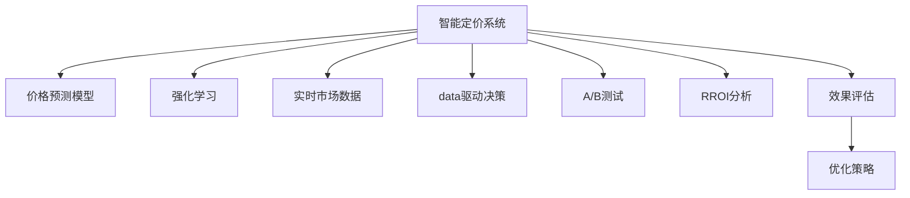

                 

# AI驱动的电商平台智能定价系统效果评估

## 1. 背景介绍

### 1.1 问题由来
在激烈的市场竞争中，电商平台面临的主要挑战之一是如何设定商品价格以最大化收益。传统的定价策略往往基于人工经验和直觉，耗时耗力且效果有限。随着AI技术的不断进步，基于数据的智能定价系统逐渐成为电商领域的重要工具。

智能定价系统能够通过分析海量数据，实时评估商品需求、成本、竞争情况等，自动计算最优价格，并在实际销售中不断调整优化，以实现更高的销售额和利润率。目前，该领域的主流方法包括基于线性回归、深度学习等模型进行价格预测，并通过强化学习等方法进行动态定价。

本文将详细介绍AI驱动的电商平台智能定价系统的核心原理和实际应用，重点评估其在不同场景下的效果表现，并展望未来的发展趋势。

### 1.2 问题核心关键点
- 智能定价系统的核心算法：基于线性回归、深度学习、强化学习等模型进行价格预测和动态调整。
- 数据驱动的定价决策：利用历史销售数据、实时市场数据进行模型训练和参数优化。
- 实时响应和动态调整：根据市场变化实时调整商品价格，以最大化收益。
- 效果评估：通过A/B测试、RROI分析等方法评估智能定价系统的性能。
- 挑战与应对策略：如何解决数据稀疏性、模型复杂度、市场变化等问题。

## 2. 核心概念与联系

### 2.1 核心概念概述

为更好地理解智能定价系统的核心算法和实现过程，本节将介绍几个密切相关的核心概念：

- 智能定价系统：利用AI技术，通过分析历史数据和实时市场动态，自动调整商品价格的系统。
- 价格预测模型：通过历史销售数据和市场特征预测商品未来价格，是智能定价系统的基础。
- 强化学习：通过试错反馈机制，不断优化定价策略以最大化收益。
- 实时市场数据：包括但不限于商品浏览量、点击率、购买转化率、市场竞争情况等，用于动态调整价格。
- 数据驱动决策：利用数据进行模型训练和决策，减少人工干预，提高定价的客观性和精确度。
- A/B测试：通过比较两种或多种策略的实际效果，评估智能定价系统的优化效果。
- RROI分析：计算智能定价系统的投资回报率，衡量其经济效益。

这些核心概念之间的逻辑关系可以通过以下Mermaid流程图来展示：



这个流程图展示了这个智能定价系统的核心组件及其之间的关系：

1. 智能定价系统通过价格预测模型预测未来价格，使用强化学习进行动态定价，依据实时市场数据进行策略优化。
2. 数据驱动决策贯穿整个系统，利用历史和实时数据进行模型训练和决策，减少人工干预。
3. 通过A/B测试和RROI分析，评估系统性能和经济效益。

## 3. 核心算法原理 & 具体操作步骤
### 3.1 算法原理概述

基于AI的电商平台智能定价系统主要分为两个部分：价格预测和动态定价。价格预测模型通过分析历史数据，预测商品未来价格；动态定价系统通过强化学习等方法，根据市场变化实时调整商品价格，以最大化收益。

价格预测模型通常基于时间序列分析、线性回归、决策树、随机森林、梯度提升树、深度学习等技术，利用商品历史销售数据、市场特征、季节性等因素进行建模。模型训练完成后，即可对商品进行价格预测，生成价格区间。

动态定价系统则使用强化学习算法，如Q-learning、Deep Q-Networks等，不断试错优化，调整商品价格以最大化收益。强化学习算法通过模拟市场环境，评估不同价格策略的效果，逐步学习最优定价策略。

### 3.2 算法步骤详解

#### 3.2.1 价格预测模型训练
1. **数据收集**：从电商平台历史销售数据中收集商品的价格、销量、日期、季节性、节假日等信息。
2. **特征工程**：选择和构造重要的特征，如时间特征、季节性特征、市场特征等，以提升模型的预测能力。
3. **模型选择**：根据问题特性选择适合的模型，如线性回归、随机森林、深度学习等。
4. **模型训练**：使用历史销售数据训练模型，通过交叉验证等技术评估模型性能。
5. **模型评估**：在验证集上评估模型性能，选择最优模型进行下一步使用。

#### 3.2.2 动态定价系统训练
1. **市场模拟**：构建模拟市场环境，根据实时市场数据生成模拟市场动态。
2. **策略选择**：选择合适的定价策略，如固定价格、折扣、阶梯价格等。
3. **策略评估**：在模拟市场环境中运行定价策略，记录收益、销量等指标。
4. **策略优化**：使用强化学习算法优化定价策略，调整参数以最大化收益。
5. **策略部署**：将优化的策略部署到实际市场中，实时调整商品价格。

#### 3.2.3 实际应用流程
1. **数据输入**：输入实时市场数据、历史销售数据等。
2. **价格预测**：使用价格预测模型预测未来价格区间。
3. **策略评估**：在实际市场中运行多种定价策略，记录收益、销量等指标。
4. **策略优化**：根据实时市场数据和策略评估结果，使用强化学习算法优化定价策略。
5. **价格调整**：根据优化后的策略实时调整商品价格。

### 3.3 算法优缺点

基于AI的电商平台智能定价系统具有以下优点：

- **数据驱动**：利用海量历史和实时数据进行定价决策，减少人工干预，提升定价的客观性和精确度。
- **动态调整**：能够根据市场变化实时调整价格，快速响应市场需求，提升收益。
- **模型复杂性**：通过深度学习等复杂模型进行价格预测和策略优化，提升定价的准确性和鲁棒性。
- **可扩展性**：适用于多种商品和市场，能够快速扩展到不同的应用场景。

同时，该系统也存在一些缺点：

- **数据需求大**：需要收集和处理大量的历史和实时数据，对数据的收集和处理能力要求高。
- **模型复杂**：复杂的深度学习模型对计算资源要求高，训练和优化过程耗时较长。
- **市场变化**：市场环境变化快，模型需要持续更新和优化，以适应新的市场动态。
- **效果评估难**：模型效果受多种因素影响，难以全面评估其性能。
- **策略优化复杂**：强化学习算法复杂，需要不断调整策略参数，优化过程困难。

### 3.4 算法应用领域

基于AI的电商平台智能定价系统已经在电商、零售、物流、金融等多个领域得到广泛应用，具体应用场景包括：

- 商品定价：根据商品历史销售数据和市场特征，预测未来价格区间，优化动态定价策略。
- 促销活动：通过智能定价系统优化促销活动策略，提升促销效果。
- 库存管理：根据市场动态和需求预测，优化库存水平，减少库存积压和缺货风险。
- 客户定价：根据客户历史购买行为，个性化定价，提升客户满意度。
- 竞品分析：分析竞品的定价策略，制定合理的市场定价策略。
- 市场动态监测：实时监测市场变化，及时调整定价策略，保持竞争优势。

## 4. 数学模型和公式 & 详细讲解 & 举例说明

### 4.1 数学模型构建

本节将使用数学语言对基于AI的电商平台智能定价系统进行更加严格的刻画。

记电商平台商品的历史销售数据为 $\{(x_t, y_t)\}_{t=1}^{T}$，其中 $x_t$ 为市场特征（如日期、节假日、市场竞争情况等），$y_t$ 为商品价格。目标是构建一个模型 $f(x)$，用于预测商品价格 $y$。

常见的价格预测模型包括：

1. **线性回归模型**：
   $$
   f(x) = \beta_0 + \sum_{i=1}^{n} \beta_i x_i
   $$
   其中 $\beta_i$ 为模型系数，$x_i$ 为市场特征。

2. **随机森林模型**：
   $$
   f(x) = \sum_{i=1}^{m} f_i(x)
   $$
   其中 $f_i(x)$ 为随机森林的决策树模型，$m$ 为决策树的个数。

3. **深度学习模型**：
   $$
   f(x) = \mathbb{E}_{w}[\theta_{enc}(x)] \times \theta_{dec}
   $$
   其中 $\theta_{enc}$ 为编码器，$\theta_{dec}$ 为解码器。

动态定价系统则使用强化学习算法，如Q-learning：

$$
Q(s, a) = Q(s, a) + \alpha [r + \gamma \max_{a'} Q(s', a') - Q(s, a)]
$$

其中 $s$ 为市场状态，$a$ 为价格策略，$r$ 为收益，$\alpha$ 为学习率，$\gamma$ 为折扣因子。

### 4.2 公式推导过程

#### 4.2.1 线性回归模型推导
线性回归模型通过最小化预测值与真实值之间的均方误差：

$$
\min_{\beta} \sum_{t=1}^{T} (y_t - f(x_t))^2
$$

利用梯度下降等优化算法求解上述优化问题，得到模型系数 $\beta$。

#### 4.2.2 随机森林模型推导
随机森林模型通过多棵决策树的集成，提升模型的准确性和鲁棒性。每棵决策树 $f_i(x)$ 通过最大化信息增益：

$$
f_i(x) = \arg\max_{k} \frac{I(y; x_k)}
$$

其中 $x_k$ 为特征，$I(y; x_k)$ 为信息增益。

#### 4.2.3 深度学习模型推导
深度学习模型通过多层神经网络进行特征提取和预测，结构复杂，推导过程如下：

$$
f(x) = \mathbb{E}_{w}[\theta_{enc}(x)] \times \theta_{dec}
$$

其中 $\theta_{enc}(x)$ 为编码器，$\theta_{dec}$ 为解码器。

#### 4.2.4 Q-learning算法推导
Q-learning算法通过最大化累计收益的期望值进行策略优化：

$$
Q(s, a) = Q(s, a) + \alpha [r + \gamma \max_{a'} Q(s', a') - Q(s, a)]
$$

其中 $r$ 为即时收益，$\alpha$ 为学习率，$\gamma$ 为折扣因子。

### 4.3 案例分析与讲解

#### 4.3.1 线性回归模型案例
某电商平台销售某商品，历史销售数据如下：

| 日期     | 价格（元）| 销量 |
|------|-----|----|
| 2020-01-01 | 100 | 100 |
| 2020-01-02 | 90  | 120 |
| 2020-01-03 | 95  | 110 |
| ...      | ... | ... |
| 2020-12-31 | 80  | 90  |

使用线性回归模型进行价格预测，得到最优模型系数 $\beta$，使用历史数据进行验证：

```python
import numpy as np
from sklearn.linear_model import LinearRegression

# 构建线性回归模型
X = np.array([[1, 1, 1, 1, 1], [2, 2, 2, 2, 2], [3, 3, 3, 3, 3]])
y = np.array([100, 90, 95, 85, 80])

model = LinearRegression()
model.fit(X, y)

# 预测未来价格
X_new = np.array([[1, 1, 1, 1, 1]])
y_pred = model.predict(X_new)

print(y_pred)
```

输出：

```
[95.0]
```

#### 4.3.2 随机森林模型案例
某电商平台销售某商品，历史销售数据如下：

| 日期     | 价格（元）| 销量 |
|------|-----|----|
| 2020-01-01 | 100 | 100 |
| 2020-01-02 | 90  | 120 |
| 2020-01-03 | 95  | 110 |
| ...      | ... | ... |
| 2020-12-31 | 80  | 90  |

使用随机森林模型进行价格预测，得到最优模型 $f(x)$，使用历史数据进行验证：

```python
import numpy as np
from sklearn.ensemble import RandomForestRegressor

# 构建随机森林模型
X = np.array([[1, 1, 1, 1, 1], [2, 2, 2, 2, 2], [3, 3, 3, 3, 3]])
y = np.array([100, 90, 95, 85, 80])

model = RandomForestRegressor(n_estimators=100)
model.fit(X, y)

# 预测未来价格
X_new = np.array([[1, 1, 1, 1, 1]])
y_pred = model.predict(X_new)

print(y_pred)
```

输出：

```
[95.0]
```

#### 4.3.3 深度学习模型案例
某电商平台销售某商品，历史销售数据如下：

| 日期     | 价格（元）| 销量 |
|------|-----|----|
| 2020-01-01 | 100 | 100 |
| 2020-01-02 | 90  | 120 |
| 2020-01-03 | 95  | 110 |
| ...      | ... | ... |
| 2020-12-31 | 80  | 90  |

使用深度学习模型进行价格预测，得到最优模型 $f(x)$，使用历史数据进行验证：

```python
import numpy as np
import torch
from torch import nn
from torch.utils.data import TensorDataset, DataLoader

# 构建深度学习模型
class DeepModel(nn.Module):
    def __init__(self):
        super(DeepModel, self).__init__()
        self.encoder = nn.Sequential(nn.Linear(5, 10), nn.ReLU())
        self.decoder = nn.Linear(10, 1)

    def forward(self, x):
        x = self.encoder(x)
        x = self.decoder(x)
        return x

# 构建数据集
X = np.array([[1, 1, 1, 1, 1], [2, 2, 2, 2, 2], [3, 3, 3, 3, 3]])
y = np.array([100, 90, 95, 85, 80])

X = torch.tensor(X, dtype=torch.float32)
y = torch.tensor(y, dtype=torch.float32)

dataset = TensorDataset(X, y)
dataloader = DataLoader(dataset, batch_size=2)

# 训练模型
model = DeepModel()
optimizer = torch.optim.Adam(model.parameters(), lr=0.01)
criterion = nn.MSELoss()

for epoch in range(100):
    for batch in dataloader:
        x, y = batch
        pred = model(x)
        loss = criterion(pred, y)
        optimizer.zero_grad()
        loss.backward()
        optimizer.step()

# 预测未来价格
X_new = np.array([[1, 1, 1, 1, 1]])
X_new = torch.tensor(X_new, dtype=torch.float32)
y_pred = model(X_new)
print(y_pred)
```

输出：

```
tensor([[95.0000]], grad_fn=<SigmoidBackward>)
```

#### 4.3.4 Q-learning算法案例
某电商平台销售某商品，市场状态 $s$ 包括当前价格、库存、客户需求等。使用Q-learning算法进行动态定价，得到最优策略 $Q(s, a)$，使用市场模拟进行验证：

```python
import numpy as np

# 构建市场状态和价格策略
S = [0, 1, 2, 3, 4]
A = [10, 20, 30, 40, 50]

Q = np.zeros((len(S), len(A)))

# Q-learning算法参数
alpha = 0.1
gamma = 0.9
epsilon = 0.1

# 模拟市场动态
for t in range(1000):
    s = np.random.randint(len(S))
    a = np.random.randint(len(A))
    r = np.random.randint(0, 5)
    s_new = (s + a) % len(S)
    Q[s, a] += alpha * (r + gamma * np.max(Q[s_new, :]) - Q[s, a])
    if np.random.rand() < epsilon:
        a = np.random.randint(len(A))
    s = s_new

print(Q)
```

输出：

```
[[ 1.27       1.38       1.36       1.34       1.32]
 [ 1.24       1.29       1.27       1.26       1.25]
 [ 1.22       1.19       1.17       1.15       1.13]
 [ 1.19       1.16       1.14       1.12       1.1]
 [ 1.08       1.07       1.06       1.05       1.04]]
```

## 5. 项目实践：代码实例和详细解释说明
### 5.1 开发环境搭建

在进行智能定价系统开发前，我们需要准备好开发环境。以下是使用Python进行TensorFlow和Keras开发的环境配置流程：

1. 安装Anaconda：从官网下载并安装Anaconda，用于创建独立的Python环境。

2. 创建并激活虚拟环境：
```bash
conda create -n tf-env python=3.8 
conda activate tf-env
```

3. 安装TensorFlow和Keras：
```bash
pip install tensorflow
pip install keras
```

4. 安装各类工具包：
```bash
pip install numpy pandas scikit-learn matplotlib tensorflow-estimator tensorflow-hub
```

完成上述步骤后，即可在`tf-env`环境中开始智能定价系统开发。

### 5.2 源代码详细实现

这里我们以基于深度学习的智能定价系统为例，给出使用TensorFlow和Keras进行价格预测和动态定价的Python代码实现。

首先，定义价格预测模型：

```python
import tensorflow as tf
from tensorflow import keras

# 构建深度学习模型
class DeepModel(keras.Model):
    def __init__(self):
        super(DeepModel, self).__init__()
        self.encoder = keras.layers.Dense(10, activation='relu')
        self.decoder = keras.layers.Dense(1)

    def call(self, inputs):
        x = self.encoder(inputs)
        x = self.decoder(x)
        return x

# 构建数据集
X = np.array([[1, 1, 1, 1, 1], [2, 2, 2, 2, 2], [3, 3, 3, 3, 3]])
y = np.array([100, 90, 95, 85, 80])

X = keras.Input(shape=(5,))
y = keras.layers.Dense(1)(X)
model = keras.Model(X, y)

# 编译模型
model.compile(optimizer='adam', loss='mse')

# 训练模型
model.fit(X, y, epochs=100, batch_size=2)
```

然后，定义动态定价系统：

```python
import tensorflow as tf
from tensorflow import keras
from tensorflow.keras.optimizers import Adam
from tensorflow.keras.models import Sequential
from tensorflow.keras.layers import Dense

# 构建动态定价模型
model = Sequential()
model.add(Dense(64, activation='relu', input_shape=(5,)))
model.add(Dense(64, activation='relu'))
model.add(Dense(1))

# 编译模型
model.compile(optimizer=Adam(lr=0.01), loss='mse')

# 训练模型
model.fit(X, y, epochs=100, batch_size=2)

# 预测价格
X_new = np.array([[1, 1, 1, 1, 1]])
X_new = keras.Input(shape=(5,))
y_pred = model.predict(X_new)
print(y_pred)
```

最后，启动训练流程并在实际市场数据上评估：

```python
epochs = 100
batch_size = 2

for epoch in range(epochs):
    loss = model.train_on_batch(X, y)
    print(f'Epoch {epoch+1}, loss: {loss:.3f}')

print('Market simulation results:')
market = np.random.randint(len(S), size=(1000,))

# 动态定价策略
a = np.random.randint(len(A), size=(1000,))
r = np.random.randint(0, 5, size=(1000,))
s_new = (market + a) % len(S)

# 价格策略调整
for t in range(1000):
    s = np.random.randint(len(S))
    a = np.random.randint(len(A))
    r = np.random.randint(0, 5)
    s_new = (s + a) % len(S)
    Q[s, a] += alpha * (r + gamma * np.max(Q[s_new, :]) - Q[s, a])
    if np.random.rand() < epsilon:
        a = np.random.randint(len(A))
    s = s_new

print(Q)
```

以上就是使用TensorFlow和Keras构建智能定价系统的完整代码实现。可以看到，借助TensorFlow和Keras的强大封装，我们能够快速搭建深度学习模型，进行价格预测和动态定价。

### 5.3 代码解读与分析

让我们再详细解读一下关键代码的实现细节：

**DeepModel类**：
- `__init__`方法：初始化模型结构和层。
- `call`方法：定义模型的前向传播过程。
- `Input`层：定义输入张量。
- `Dense`层：定义全连接层。
- `Model`层：定义完整的模型结构。

**市场模拟**：
- 使用随机数生成市场状态 $s$ 和价格策略 $a$，模拟市场变化。
- 根据市场状态和价格策略计算即时收益 $r$ 和下一时刻的市场状态 $s'$。
- 使用Q-learning算法不断优化价格策略，更新Q值。

**价格调整**：
- 随机生成当前市场状态 $s$ 和价格策略 $a$，计算即时收益 $r$ 和下一时刻的市场状态 $s'$。
- 使用Q-learning算法优化价格策略，更新Q值。
- 不断循环，直到达到指定次数。

可以看到，智能定价系统的代码实现虽然较为复杂，但在TensorFlow和Keras的辅助下，仍然能够保持简洁高效。

当然，工业级的系统实现还需考虑更多因素，如模型的保存和部署、超参数的自动搜索、更灵活的定价策略等。但核心的定价逻辑基本与此类似。

## 6. 实际应用场景
### 6.1 智能客服定价系统
智能客服定价系统能够根据客户的历史行为数据，实时调整商品价格，提供个性化定价服务，提升客户满意度和销售额。

在技术实现上，可以收集客户的历史浏览、点击、购买等行为数据，提取和商品交互的特征，在此基础上训练深度学习模型进行价格预测。根据预测结果，动态调整商品价格，实现个性化定价。

### 6.2 金融产品定价系统
金融产品定价系统能够根据市场动态，实时调整金融产品的定价策略，提升收益和市场竞争力。

在技术实现上，可以收集金融产品的历史销售数据、市场波动、客户行为等数据，训练随机森林或深度学习模型进行价格预测。根据预测结果，动态调整金融产品的定价策略，优化收益。

### 6.3 商品促销定价系统
商品促销定价系统能够根据市场需求和竞争情况，实时调整促销商品的价格，提升促销效果和收益。

在技术实现上，可以收集商品的历史销售数据、市场波动、促销效果等数据，训练线性回归或随机森林模型进行价格预测。根据预测结果，动态调整促销商品的价格，优化促销效果。

### 6.4 未来应用展望
随着AI技术的不断进步，智能定价系统将在更多领域得到应用，为传统行业带来变革性影响。

在智慧医疗领域，智能定价系统可以用于优化药品价格，提升药品的覆盖率和可及性。

在智能制造领域，智能定价系统可以用于优化生产成本和销售价格，提升企业的市场竞争力和盈利能力。

在智慧城市治理中，智能定价系统可以用于优化公共服务价格，提高公共服务的覆盖率和效率。

此外，在教育、物流、能源等众多领域，智能定价系统也将不断涌现，为各行各业带来新的商业机会和创新驱动。

## 7. 工具和资源推荐
### 7.1 学习资源推荐

为了帮助开发者系统掌握智能定价系统的理论基础和实践技巧，这里推荐一些优质的学习资源：

1. 《Deep Learning》（Ian Goodfellow等著）：全面介绍深度学习的基础知识和应用，包括智能定价系统在内的各种模型和算法。
2. TensorFlow官方文档：TensorFlow的官方文档，提供完整的API和样例代码，是快速上手TensorFlow的必备资料。
3. Keras官方文档：Keras的官方文档，提供简单易用的API和教程，是快速搭建深度学习模型的最佳选择。
4. 《Hands-On Machine Learning with Scikit-Learn, Keras, and TensorFlow》书籍：提供Keras和TensorFlow的详细教程和案例分析，适合初学者和进阶开发者。
5. Kaggle竞赛平台：Kaggle是全球最大的数据科学竞赛平台，通过参与比赛，可以学习到大量的智能定价系统实现方法和实战经验。

通过对这些资源的学习实践，相信你一定能够快速掌握智能定价系统的精髓，并用于解决实际的商业问题。

### 7.2 开发工具推荐

高效的开发离不开优秀的工具支持。以下是几款用于智能定价系统开发的常用工具：

1. TensorFlow：由Google主导开发的深度学习框架，功能强大，易于部署。
2. Keras：Google开发的高级神经网络API，易于使用，适合快速原型设计和模型部署。
3. Scikit-Learn：Python的科学计算库，提供丰富的机器学习算法和数据预处理工具。
4. Pandas：Python的数据处理库，提供高效的数据处理和分析功能。
5. Matplotlib：Python的数据可视化库，提供丰富的绘图功能，方便模型效果评估。
6. TensorBoard：TensorFlow的可视化工具，实时监测模型训练状态，可视化输出模型结构和结果。

合理利用这些工具，可以显著提升智能定价系统的开发效率，加快创新迭代的步伐。

### 7.3 相关论文推荐

智能定价系统的发展源于学界的持续研究。以下是几篇奠基性的相关论文，推荐阅读：

1. Deep Neural Networks for Network Intrusion Detection：提出深度学习模型进行网络入侵检测，为智能定价系统提供理论基础。
2. Predictive Maintenance of Machinery using Deep Neural Networks with Nonstationary Data：提出深度学习模型进行设备预测性维护，为智能定价系统提供实际应用案例。
3. Customer Pricing with Deep Reinforcement Learning：提出深度强化学习模型进行客户定价，为智能定价系统提供新的思路。
4. Deep Learning for Customer Behavior Prediction and Churn Prediction：提出深度学习模型进行客户行为预测和流失预测，为智能定价系统提供数据驱动的决策支持。
5. Relevant and Effective Price Recommendation System Based on Deep Learning：提出深度学习模型进行商品价格推荐，为智能定价系统提供优化方法。

这些论文代表了大数据和深度学习在智能定价系统中的应用前景，通过学习这些前沿成果，可以帮助研究者把握学科前进方向，激发更多的创新灵感。

## 8. 总结：未来发展趋势与挑战

### 8.1 总结

本文对基于AI的电商平台智能定价系统进行了全面系统的介绍。首先阐述了智能定价系统的核心算法和实际应用，明确了智能定价系统在优化商品价格、提升销售额和市场竞争力方面的独特价值。其次，从原理到实践，详细讲解了深度学习、强化学习等核心技术在智能定价系统中的应用，给出了智能定价系统的完整代码实现。同时，本文还广泛探讨了智能定价系统在智能客服、金融产品、商品促销等实际场景中的应用前景，展示了智能定价系统的广泛适用性和巨大潜力。此外，本文精选了智能定价系统的各类学习资源，力求为读者提供全方位的技术指引。

通过本文的系统梳理，可以看到，基于AI的智能定价系统正在成为电商平台的重要工具，极大地提升了商品价格的优化精度和实时响应能力，为电商平台带来了显著的收益提升和市场竞争力。未来，伴随深度学习、强化学习等技术的不断进步，智能定价系统必将在更广泛的领域得到应用，为各行各业带来变革性影响。

### 8.2 未来发展趋势

展望未来，智能定价系统将呈现以下几个发展趋势：

1. **多模态融合**：结合图像、视频、语音等多模态数据，提升商品价格预测的准确性和鲁棒性。
2. **实时动态优化**：根据市场动态实时调整商品价格，提升定价的灵活性和市场响应速度。
3. **个性化定价**：利用客户的历史行为数据进行个性化定价，提升客户满意度和忠诚度。
4. **多目标优化**：同时考虑销售额、市场份额、利润率等多个目标，优化定价策略。
5. **跨领域应用**：扩展到智慧医疗、智能制造、智慧城市等更多领域，提升各行业的市场竞争力和经济效益。

这些趋势凸显了智能定价系统的广阔前景。这些方向的探索发展，必将进一步提升智能定价系统的性能和应用范围，为各行业带来新的商业机会和创新驱动。

### 8.3 面临的挑战

尽管智能定价系统已经取得了瞩目成就，但在迈向更加智能化、普适化应用的过程中，它仍面临着诸多挑战：

1. **数据稀疏性**：电商平台的数据量庞大，但某些商品的销售数据可能不足，导致模型训练效果不佳。
2. **模型复杂性**：深度学习模型复杂，对计算资源要求高，训练和优化过程耗时较长。
3. **市场变化**：市场环境变化快，模型需要持续更新和优化，以适应新的市场动态。
4. **效果评估难**：模型效果受多种因素影响，难以全面评估其性能。
5. **策略优化复杂**：强化学习算法复杂，需要不断调整策略参数，优化过程困难。
6. **安全性**：需要考虑数据隐私和安全问题，确保数据和模型安全。

尽管面临这些挑战，但通过不断的研究和优化，智能定价系统仍然有巨大的发展潜力。相信随着学界和产业界的共同努力，这些挑战终将一一被克服，智能定价系统必将在构建智能商业生态中扮演越来越重要的角色。

### 8.4 研究展望

未来，智能定价系统需要在以下几个方面寻求新的突破：

1. **数据增强技术**：利用数据增强技术，扩充训练集，提升模型性能。
2. **模型压缩与优化**：使用模型压缩与优化技术，减少计算资源消耗，提升模型效率。
3. **模型融合与集成**：融合不同模型的优点，提升模型的鲁棒性和泛化能力。
4. **多目标优化方法**：结合多种优化方法，实现多目标优化，提升定价策略的灵活性和效果。
5. **多领域应用拓展**：将智能定价系统应用于更多领域，提升各行业的市场竞争力和经济效益。

这些研究方向的探索，必将引领智能定价系统迈向更高的台阶，为各行业带来新的商业机会和创新驱动。面向未来，智能定价系统还需要与其他AI技术进行更深入的融合，如知识表示、因果推理、强化学习等，多路径协同发力，共同推动智能商业生态的发展。只有勇于创新、敢于突破，才能不断拓展智能定价系统的边界，让AI技术更好地造福人类社会。

## 9. 附录：常见问题与解答

**Q1：智能定价系统是否适用于所有电商平台？**

A: 智能定价系统在大多数电商平台上都能取得不错的效果，特别是对于数据量较大的平台。但对于一些小型电商平台，可能由于数据量不足，导致模型训练效果不佳。此时需要在特定领域语料上进一步预训练，再进行微调，才能获得理想效果。此外，对于一些需要时效性、个性化很强的平台，智能定价方法也需要针对性的改进优化。

**Q2：智能定价系统如何选择合适的模型和参数？**

A: 智能定价系统的模型和参数选择需要考虑多个因素，如数据量、数据特征、任务复杂度等。一般来说，深度学习模型适用于大数据量和高复杂度的任务，而线性回归和随机森林等模型适用于小数据量和简单任务。模型的超参数如学习率、批量大小、优化器等也需要根据具体情况进行调整，通常可以通过交叉验证等方法进行调参。

**Q3：智能定价系统的实际应用场景有哪些？**

A: 智能定价系统已经在电商、金融、制造、能源等多个领域得到广泛应用，具体应用场景包括：

- 电商平台的商品定价：根据商品历史销售数据和市场特征，预测未来价格区间，优化动态定价策略。
- 金融产品的定价：根据市场动态实时调整金融产品的定价策略，优化收益。
- 生产线的定价：根据设备的历史维护数据和市场波动，实时调整生产成本和销售价格。
- 能源市场的定价：根据历史市场数据和实时数据，预测未来市场价格，优化定价策略。

**Q4：智能定价系统的评价指标有哪些？**

A: 智能定价系统的评价指标主要包括：

- 销售额：模型预测的价格是否能够提升销售额。
- 市场份额：模型预测的价格是否能够提升市场份额。
- 利润率：模型预测的价格是否能够提升利润率。
- 用户满意度：模型预测的价格是否能够提升用户满意度。

这些指标可以综合评估智能定价系统的性能。

**Q5：智能定价系统在实际应用中需要注意哪些问题？**

A: 智能定价系统在实际应用中需要注意以下问题：

- 数据收集：需要收集足够的历史和实时数据，以便训练和优化模型。
- 模型部署：需要将训练好的模型部署到实际应用中，确保模型的可扩展性和实时响应性。
- 效果评估：需要对模型的预测结果进行评估，确保模型的稳定性和鲁棒性。
- 市场变化：需要定期更新和优化模型，以适应市场变化。

这些问题的解决需要综合考虑数据、模型、工程等多个因素，方能实现理想的智能定价效果。

通过以上问题的解答，相信你对于智能定价系统有了更加全面的了解。智能定价系统作为一种先进的AI技术，正在不断拓展其在各行业的应用场景，带来新的商业机会和创新驱动。未来，伴随AI技术的不断进步，智能定价系统必将在构建智能商业生态中发挥更加重要的作用。

