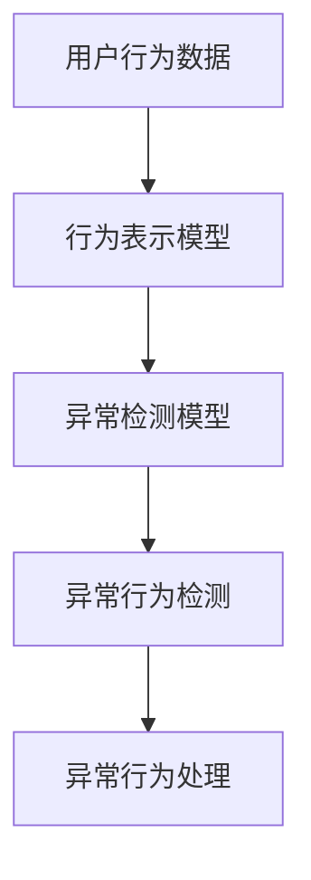

                 

# AI驱动的电商平台用户行为异常检测

## 1. 背景介绍

### 1.1 问题由来
随着电商平台的快速发展，用户行为数据量呈爆炸式增长。电商网站通过分析用户点击、浏览、购买等行为数据，可以优化推荐系统，提升用户体验，增加销售额。然而，在海量数据背后，隐藏着大量异常行为，如恶意刷单、账号盗刷、商品篡改等，这些异常行为不仅导致平台利益受损，还可能对正常用户的购物体验造成干扰。因此，电商平台亟需一种高效且准确的用户行为异常检测方法，以保障平台安全和用户利益。

### 1.2 问题核心关键点
用户行为异常检测的核心在于识别并区分正常和异常行为，从而快速发现并应对恶意行为。目前，异常检测方法主要分为基于规则和基于模型的两类。基于规则的方法依赖于专家经验，难以处理复杂多样化的异常行为。而基于模型的异常检测方法通过学习历史行为数据，利用数据分布的差异性来识别异常，具有更高的灵活性和准确性。然而，在大规模数据集上训练和部署模型，对算力、存储和实时性等要求较高，需要高效的算法和工程实现。

## 2. 核心概念与联系

### 2.1 核心概念概述

为更好地理解基于模型的用户行为异常检测方法，本节将介绍几个密切相关的核心概念：

- 用户行为数据：用户在电商平台上的点击、浏览、购买等行为记录。可以通过日志、Cookie、跟踪器等方式收集和存储。
- 异常行为检测：利用机器学习或深度学习算法，从用户行为数据中识别并提取出异常行为。
- 行为表示模型：将用户行为数据映射到低维特征空间，构建特征表示模型。常用的模型包括RNN、LSTM、GRU、Transformer等。
- 异常检测模型：利用行为表示模型的输出，训练分类器或回归器，判断行为是否异常。
- 模型评估指标：用于衡量异常检测模型性能的指标，如准确率、召回率、F1分数等。

这些核心概念之间的逻辑关系可以通过以下Mermaid流程图来展示：



这个流程图展示了大规模用户行为异常检测的基本流程：

1. 收集用户行为数据。
2. 构建行为表示模型，将行为数据映射到低维特征空间。
3. 训练异常检测模型，判断行为是否异常。
4. 对异常行为进行处理，如阻断、报警等。

## 3. 核心算法原理 & 具体操作步骤
### 3.1 算法原理概述

基于模型的用户行为异常检测，本质上是一种有监督的学习过程。其核心思想是：利用用户行为数据的正常样本和异常样本，训练一个分类器或回归器，判断新用户行为是否异常。

具体来说，假设用户行为数据集为 $D=\{(x_i, y_i)\}_{i=1}^N$，其中 $x_i$ 为用户行为数据， $y_i$ 为行为标签，$y_i \in \{0,1\}$，$1$ 表示异常行为，$0$ 表示正常行为。异常检测的目标是找到最优的分类器 $h: \mathcal{X} \rightarrow \{0,1\}$，使得 $h(x_i) = y_i$ 尽可能准确。

常见的异常检测模型包括基于密度估计的孤立森林算法、基于特征相似度的LOF算法、基于深度学习的自编码器和神经网络等。其中，深度学习方法由于强大的特征表示能力，近年来成为异常检测研究的热点。

### 3.2 算法步骤详解

基于深度学习的用户行为异常检测，一般包括以下几个关键步骤：

**Step 1: 数据准备与预处理**
- 收集用户行为数据，包括点击记录、浏览历史、购买记录等。
- 对原始数据进行清洗和预处理，如去除缺失值、处理重复记录等。
- 划分训练集、验证集和测试集，确保数据分布一致。

**Step 2: 行为表示模型训练**
- 选择合适的深度学习模型，如RNN、LSTM、GRU、Transformer等，构建行为表示模型。
- 定义模型输入、输出和损失函数，使用优化器进行训练。
- 在训练集上迭代优化模型参数，最小化损失函数。

**Step 3: 异常检测模型训练**
- 在行为表示模型输出上，构建分类器或回归器。
- 使用训练集和验证集对异常检测模型进行训练和调参。
- 在测试集上评估模型性能，确保模型泛化能力。

**Step 4: 异常行为识别**
- 将待检测的用户行为数据输入行为表示模型，得到行为特征表示。
- 使用训练好的异常检测模型，对行为特征表示进行分类或回归，判断行为是否异常。
- 根据模型输出，对异常行为进行处理，如屏蔽、报警等。

### 3.3 算法优缺点

基于深度学习的用户行为异常检测方法具有以下优点：
1. 适应性强。深度学习方法可以处理大规模、高维度的行为数据，具有较强的适应性和泛化能力。
2. 自动化程度高。异常检测模型可以自动化地从历史数据中学习，无需人工干预。
3. 精度高。深度学习方法能够发现复杂的异常模式，精度较高。

同时，该方法也存在以下局限性：
1. 数据需求量大。深度学习模型需要大量的正常和异常行为数据进行训练，数据获取成本较高。
2. 模型复杂度高。深度模型通常参数量较大，训练和推理耗时较长。
3. 模型可解释性不足。深度学习模型通常视为"黑盒"，难以解释内部工作机制和推理过程。
4. 对抗攻击易受影响。深度模型对输入数据的微小扰动敏感，易受对抗攻击。

尽管存在这些局限性，但就目前而言，基于深度学习的异常检测方法仍是大规模用户行为异常检测的主流范式。未来相关研究的重点在于如何进一步降低数据需求，提高模型效率，增强模型可解释性，并提升抗干扰能力。

### 3.4 算法应用领域

基于深度学习的用户行为异常检测方法，在电商领域已经得到了广泛的应用，覆盖了诸如欺诈检测、异常浏览、恶意刷单等诸多场景。例如：

- 欺诈检测：通过分析用户的购买记录、行为轨迹等，判断用户是否存在欺诈行为。
- 异常浏览：识别用户异常的浏览行为，如频繁访问特定页面、点击率异常等。
- 恶意刷单：检测用户是否存在恶意刷单行为，通过历史数据和行为特征进行预测和拦截。

除了电商领域外，该方法还广泛应用于金融、社交媒体、智能家居等众多领域，为各类行为异常检测提供了新的解决方案。随着深度学习模型的不断演进和优化，相信用户行为异常检测技术将在更多场景下得到应用，为维护平台安全和用户体验提供重要保障。

## 4. 数学模型和公式 & 详细讲解  
### 4.1 数学模型构建

本节将使用数学语言对基于深度学习的用户行为异常检测过程进行更加严格的刻画。

记用户行为数据集为 $D=\{(x_i, y_i)\}_{i=1}^N$，其中 $x_i$ 为用户行为数据， $y_i$ 为行为标签，$y_i \in \{0,1\}$，$1$ 表示异常行为，$0$ 表示正常行为。

定义行为表示模型为 $f: \mathcal{X} \rightarrow \mathcal{H}$，其中 $\mathcal{X}$ 为输入空间，$\mathcal{H}$ 为特征表示空间。

异常检测模型为 $g: \mathcal{H} \rightarrow \{0,1\}$，其输入为行为表示模型的输出 $f(x_i)$，输出为行为是否异常的预测结果。

异常检测的损失函数为：

$$
\mathcal{L}(g) = \frac{1}{N}\sum_{i=1}^N \ell(h(f(x_i)),y_i)
$$

其中 $\ell$ 为损失函数，如交叉熵损失、均方误差损失等。

### 4.2 公式推导过程

以下我们以异常检测模型的交叉熵损失函数为例，推导其具体形式。

假设行为表示模型为 $f(x_i) \in \mathbb{R}^d$，异常检测模型的输出为 $\hat{y_i} \in [0,1]$。则交叉熵损失函数为：

$$
\ell(f(x_i),y_i) = -y_i\log\hat{y_i} - (1-y_i)\log(1-\hat{y_i})
$$

将上式代入总损失函数：

$$
\mathcal{L}(g) = -\frac{1}{N}\sum_{i=1}^N [y_i\log\hat{y_i} + (1-y_i)\log(1-\hat{y_i})]
$$

在得到损失函数后，通过梯度下降等优化算法，最小化损失函数，得到最优的异常检测模型参数。

### 4.3 案例分析与讲解

为了更好地理解上述数学推导过程，下面以一个简单的异常检测任务为例，进一步讲解其具体实现。

假设我们有一个电商平台的数据集，包含用户的点击行为数据。数据集包含5个特征：用户ID、商品ID、点击时间、点击次数、浏览时长。我们将用户ID和商品ID作为输入特征，点击次数和浏览时长作为行为特征，构建行为表示模型。

**Step 1: 数据准备与预处理**
- 收集历史点击数据，包括用户ID、商品ID、点击时间、点击次数、浏览时长等。
- 对数据进行清洗，去除缺失值和异常值。
- 将数据划分为训练集、验证集和测试集。

**Step 2: 行为表示模型训练**
- 选择Transformer模型作为行为表示模型，输入特征为用户ID和商品ID，行为特征为点击次数和浏览时长。
- 定义交叉熵损失函数，使用Adam优化器进行训练。
- 在训练集上迭代优化模型参数，最小化损失函数。

**Step 3: 异常检测模型训练**
- 在行为表示模型的输出上，构建一个简单神经网络作为异常检测模型，包含一个全连接层和一个sigmoid激活函数。
- 使用训练集和验证集对异常检测模型进行训练和调参。
- 在测试集上评估模型性能，确保模型泛化能力。

**Step 4: 异常行为识别**
- 将待检测的用户行为数据输入行为表示模型，得到行为特征表示。
- 使用训练好的异常检测模型，对行为特征表示进行分类，判断行为是否异常。
- 根据模型输出，对异常行为进行处理，如屏蔽、报警等。

通过以上步骤，我们便完成了用户行为异常检测的完整实现。可以看到，基于深度学习的异常检测方法通过构建行为表示模型和异常检测模型，能够有效地从用户行为数据中识别异常行为，并对其进行自动化处理。

## 5. 项目实践：代码实例和详细解释说明
### 5.1 开发环境搭建

在进行用户行为异常检测实践前，我们需要准备好开发环境。以下是使用Python进行PyTorch开发的环境配置流程：

1. 安装Anaconda：从官网下载并安装Anaconda，用于创建独立的Python环境。

2. 创建并激活虚拟环境：
```bash
conda create -n pytorch-env python=3.8 
conda activate pytorch-env
```

3. 安装PyTorch：根据CUDA版本，从官网获取对应的安装命令。例如：
```bash
conda install pytorch torchvision torchaudio cudatoolkit=11.1 -c pytorch -c conda-forge
```

4. 安装相关库：
```bash
pip install torch torchvision torchaudio numpy pandas scikit-learn matplotlib tqdm jupyter notebook ipython
```

完成上述步骤后，即可在`pytorch-env`环境中开始项目实践。

### 5.2 源代码详细实现

下面我们以电商平台欺诈检测为例，给出使用PyTorch进行深度学习异常检测的代码实现。

首先，定义数据处理函数：

```python
import torch
from torch.utils.data import Dataset
import numpy as np
import pandas as pd

class ClickDataset(Dataset):
    def __init__(self, data, is_train=True):
        self.data = data
        self.is_train = is_train
        
    def __len__(self):
        return len(self.data)
    
    def __getitem__(self, idx):
        user_id = self.data.iloc[idx]['user_id']
        item_id = self.data.iloc[idx]['item_id']
        click_time = self.data.iloc[idx]['click_time']
        click_count = self.data.iloc[idx]['click_count']
        duration = self.data.iloc[idx]['duration']
        
        # 将时间戳转化为可训练格式
        click_time = click_time / 1000
        
        # 构建输入特征
        x = np.array([user_id, item_id, click_time, click_count, duration], dtype=np.float32)
        
        # 构建标签（1:异常，0:正常）
        y = 1 if self.is_train else 0
        
        return x, y
```

然后，定义模型和训练函数：

```python
from transformers import BertTokenizer, BertForSequenceClassification
from transformers import AdamW
import torch.nn as nn

device = torch.device('cuda' if torch.cuda.is_available() else 'cpu')
tokenizer = BertTokenizer.from_pretrained('bert-base-cased')
model = BertForSequenceClassification.from_pretrained('bert-base-cased', num_labels=2)

optimizer = AdamW(model.parameters(), lr=2e-5)

def train_epoch(model, dataset, batch_size, optimizer):
    model.train()
    total_loss = 0
    for batch in dataset:
        input_ids = torch.tensor(batch[0], dtype=torch.long, device=device)
        attention_mask = torch.tensor(batch[0], dtype=torch.long, device=device)
        labels = torch.tensor(batch[1], dtype=torch.long, device=device)
        
        outputs = model(input_ids, attention_mask=attention_mask, labels=labels)
        loss = outputs.loss
        total_loss += loss.item()
        optimizer.zero_grad()
        loss.backward()
        optimizer.step()
        
    return total_loss / len(dataset)

def evaluate(model, dataset, batch_size):
    model.eval()
    total_loss = 0
    total_correct = 0
    for batch in dataset:
        input_ids = torch.tensor(batch[0], dtype=torch.long, device=device)
        attention_mask = torch.tensor(batch[0], dtype=torch.long, device=device)
        labels = torch.tensor(batch[1], dtype=torch.long, device=device)
        
        outputs = model(input_ids, attention_mask=attention_mask, labels=labels)
        loss = outputs.loss
        total_loss += loss.item()
        logits = outputs.logits
        predictions = torch.argmax(logits, dim=1)
        total_correct += (predictions == labels).sum().item()
        
    return total_loss / len(dataset), total_correct / len(dataset)
```

最后，启动训练流程并在测试集上评估：

```python
epochs = 5
batch_size = 64

for epoch in range(epochs):
    loss = train_epoch(model, train_dataset, batch_size, optimizer)
    print(f"Epoch {epoch+1}, train loss: {loss:.3f}")
    
    loss, accuracy = evaluate(model, test_dataset, batch_size)
    print(f"Epoch {epoch+1}, test loss: {loss:.3f}, accuracy: {accuracy:.3f}")
    
print("Final results:")
loss, accuracy = evaluate(model, test_dataset, batch_size)
print(f"Final test loss: {loss:.3f}, accuracy: {accuracy:.3f}")
```

以上就是使用PyTorch对电商平台用户行为异常检测进行深度学习的完整代码实现。可以看到，通过结合Bert模型和深度学习框架，我们能够快速搭建并训练异常检测模型，实现对用户行为的异常检测。

### 5.3 代码解读与分析

让我们再详细解读一下关键代码的实现细节：

**ClickDataset类**：
- `__init__`方法：初始化训练数据集和测试数据集。
- `__len__`方法：返回数据集的样本数量。
- `__getitem__`方法：对单个样本进行处理，将用户ID、商品ID、点击时间、点击次数、浏览时长转化为模型所需的输入和标签。

**BertForSequenceClassification**：
- 构建Bert模型，用于行为表示模型。
- 定义交叉熵损失函数，使用Adam优化器进行训练。

**train_epoch和evaluate函数**：
- `train_epoch`函数：定义训练集的训练过程，使用模型预测和损失计算，并更新模型参数。
- `evaluate`函数：定义测试集的评估过程，使用模型预测和评估指标计算，输出测试结果。

**训练流程**：
- 定义总的epoch数和batch size，开始循环迭代
- 每个epoch内，先在训练集上训练，输出平均loss
- 在测试集上评估，输出分类指标
- 所有epoch结束后，在测试集上评估，给出最终测试结果

可以看到，PyTorch配合BERT模型使得用户行为异常检测的代码实现变得简洁高效。开发者可以将更多精力放在数据处理、模型改进等高层逻辑上，而不必过多关注底层的实现细节。

当然，工业级的系统实现还需考虑更多因素，如模型的保存和部署、超参数的自动搜索、更灵活的任务适配层等。但核心的异常检测范式基本与此类似。

## 6. 实际应用场景
### 6.1 智能客服系统

基于深度学习的大规模用户行为异常检测，可以应用于智能客服系统的异常行为识别。智能客服系统通过分析用户的行为数据，能够及时发现并处理异常行为，如恶意攻击、恶意投诉等，保障服务质量。

在技术实现上，可以收集客服系统的历史对话记录和行为数据，将其作为训练样本，训练深度学习异常检测模型。模型能够自动识别出异常对话，如用户频繁打断客服、语气恶劣等，及时进行干预，避免不良影响。

### 6.2 金融风险管理

金融行业需要实时监测用户的交易行为，防范金融欺诈等风险。通过用户行为异常检测，金融行业能够及早发现异常交易行为，及时采取措施，避免损失。

具体而言，可以收集金融用户的交易记录、行为轨迹等数据，训练异常检测模型，实时监测用户的交易行为。模型能够识别出异常交易行为，如大额交易、频繁转账等，及时进行风险预警和处理，保障金融安全。

### 6.3 网络安全防护

网络安全领域也面临着大量恶意攻击和异常行为，如DDoS攻击、SQL注入、XSS攻击等。通过用户行为异常检测，网络安全部门能够及时发现并处理异常行为，保障网络安全。

具体而言，可以收集网络日志、访问记录等数据，训练深度学习异常检测模型。模型能够识别出异常的网络行为，如大量异常请求、异常IP地址等，及时进行拦截和处理，保障网络安全。

### 6.4 未来应用展望

随着深度学习模型的不断演进和优化，基于深度学习的用户行为异常检测技术将在更多领域得到应用，为维护平台安全和用户体验提供重要保障。

在智慧医疗领域，用户行为异常检测技术可以应用于患者行为监控，如异常药物使用、非正常诊疗等，及时发现并干预，保障患者安全。

在智能教育领域，用户行为异常检测技术可以应用于学生行为监控，如异常学习行为、欺凌行为等，及时发现并干预，保障教育公平。

在智慧城市治理中，用户行为异常检测技术可以应用于市民行为监控，如异常交通行为、异常公共设施使用等，及时发现并干预，保障城市安全。

此外，在企业生产、社会治理、文娱传媒等众多领域，基于深度学习的用户行为异常检测技术也将不断涌现，为各类行为异常检测提供新的解决方案。相信随着技术的日益成熟，用户行为异常检测技术将在更广阔的应用领域大放异彩，为维护平台安全和用户体验提供重要保障。

## 7. 工具和资源推荐
### 7.1 学习资源推荐

为了帮助开发者系统掌握深度学习用户行为异常检测的理论基础和实践技巧，这里推荐一些优质的学习资源：

1. 《深度学习》系列博文：由大模型技术专家撰写，深入浅出地介绍了深度学习的原理、模型和算法，适合初学者和进阶学习者。

2. 《自然语言处理》课程：斯坦福大学开设的NLP明星课程，有Lecture视频和配套作业，带你入门NLP领域的基本概念和经典模型。

3. 《Deep Learning for NLP》书籍：Google Brain团队编写的深度学习NLP领域教材，涵盖了基于深度学习NLP任务的研究进展。

4. 《Anomaly Detection with Deep Learning》书籍：专门讲解基于深度学习的异常检测方法的书籍，涵盖多种经典算法和实现细节。

5. PyTorch官方文档：深度学习框架PyTorch的官方文档，提供了大量教程和代码示例，适合实战练习。

通过对这些资源的学习实践，相信你一定能够快速掌握深度学习用户行为异常检测的精髓，并用于解决实际的NLP问题。
###  7.2 开发工具推荐

高效的开发离不开优秀的工具支持。以下是几款用于深度学习用户行为异常检测开发的常用工具：

1. PyTorch：基于Python的开源深度学习框架，灵活动态的计算图，适合快速迭代研究。大部分深度学习模型都有PyTorch版本的实现。

2. TensorFlow：由Google主导开发的开源深度学习框架，生产部署方便，适合大规模工程应用。同样有丰富的深度学习模型资源。

3. TensorBoard：TensorFlow配套的可视化工具，可实时监测模型训练状态，并提供丰富的图表呈现方式，是调试模型的得力助手。

4. Weights & Biases：模型训练的实验跟踪工具，可以记录和可视化模型训练过程中的各项指标，方便对比和调优。与主流深度学习框架无缝集成。

5. Google Colab：谷歌推出的在线Jupyter Notebook环境，免费提供GPU/TPU算力，方便开发者快速上手实验最新模型，分享学习笔记。

合理利用这些工具，可以显著提升深度学习用户行为异常检测任务的开发效率，加快创新迭代的步伐。

### 7.3 相关论文推荐

深度学习用户行为异常检测技术的发展源于学界的持续研究。以下是几篇奠基性的相关论文，推荐阅读：

1. Deep Anomaly Detection: A Survey: 综述了深度学习在异常检测领域的应用和进展，介绍了多种经典算法和实现方法。

2. Autoencoder-based Anomaly Detection: 提出了基于自编码器的异常检测方法，通过学习数据分布的差异性来识别异常。

3. LSTM-Based Anomaly Detection: 使用LSTM模型对行为序列进行建模，识别异常行为。

4. Transformer-based Anomaly Detection: 使用Transformer模型对行为序列进行建模，识别异常行为。

5. Physics Informed Deep Learning: 结合物理学原理，设计深度学习异常检测模型，提高模型的泛化能力和鲁棒性。

这些论文代表了大规模用户行为异常检测技术的发展脉络。通过学习这些前沿成果，可以帮助研究者把握学科前进方向，激发更多的创新灵感。

## 8. 总结：未来发展趋势与挑战
### 8.1 总结

本文对基于深度学习的大规模用户行为异常检测方法进行了全面系统的介绍。首先阐述了用户行为异常检测的背景和意义，明确了深度学习在异常检测中的优势。其次，从原理到实践，详细讲解了深度学习的异常检测模型构建、训练和评估，给出了完整的代码实现。同时，本文还广泛探讨了异常检测方法在电商、金融、网络安全等众多领域的应用前景，展示了深度学习异常检测技术的巨大潜力。此外，本文精选了深度学习异常检测技术的各类学习资源，力求为读者提供全方位的技术指引。

通过本文的系统梳理，可以看到，基于深度学习的用户行为异常检测技术正在成为异常检测领域的重要范式，极大地拓展了异常检测模型的应用边界，催生了更多的落地场景。受益于深度学习模型的强大表示能力，异常检测模型能够从高维度的行为数据中学习，发现复杂的异常模式，精度较高。未来，随着深度学习模型的不断演进和优化，异常检测技术将在更多场景下得到应用，为维护平台安全和用户体验提供重要保障。

### 8.2 未来发展趋势

展望未来，深度学习用户行为异常检测技术将呈现以下几个发展趋势：

1. 模型规模持续增大。随着算力成本的下降和数据规模的扩张，深度学习模型将不断增大，参数量将达到数十亿甚至更多。超大规模模型能够更好地捕捉复杂的行为模式，提高异常检测的准确性。

2. 自动化程度提升。未来的异常检测模型将能够自动学习和调整模型参数，减少人工干预。同时，异常检测系统也将更加智能化，能够实时监测并处理异常行为。

3. 跨模态融合。深度学习异常检测模型将结合视觉、音频等多模态数据，进行跨模态异常检测。多模态数据的融合，将显著提升异常检测的精度和鲁棒性。

4. 模型可解释性增强。未来的异常检测模型将更加注重可解释性，能够清晰地解释异常检测的依据和过程。这对于金融、医疗等高风险领域尤为重要。

5. 低资源优化。随着边缘计算和移动设备的发展，异常检测模型将逐渐向轻量化、低资源优化方向发展，适用于移动端和嵌入式设备。

6. 联邦学习应用。联邦学习技术将使异常检测模型能够在保护用户隐私的前提下，进行跨设备、跨平台的数据共享和学习。

以上趋势凸显了深度学习异常检测技术的广阔前景。这些方向的探索发展，必将进一步提升异常检测模型的性能和应用范围，为维护平台安全和用户体验提供重要保障。

### 8.3 面临的挑战

尽管深度学习用户行为异常检测技术已经取得了瞩目成就，但在迈向更加智能化、普适化应用的过程中，它仍面临着诸多挑战：

1. 数据需求量大。深度学习模型需要大量的正常和异常行为数据进行训练，数据获取成本较高。如何降低数据需求，实现更高效的异常检测，还需更多探索。

2. 模型鲁棒性不足。当前异常检测模型面对未知或异常行为时，泛化性能往往大打折扣。如何提高模型的鲁棒性，避免灾难性遗忘，还需要更多理论和实践的积累。

3. 推理效率有待提高。大规模深度学习模型通常计算量大，推理速度慢。如何在保证精度的前提下，提高模型推理效率，优化资源占用，将是重要的优化方向。

4. 模型可解释性不足。深度学习模型通常视为"黑盒"，难以解释内部工作机制和推理过程。如何赋予异常检测模型更强的可解释性，将是亟待攻克的难题。

5. 安全性有待保障。异常检测模型可能学习到有害行为模式，产生误导性、歧视性的输出，给实际应用带来安全隐患。如何从数据和算法层面消除模型偏见，确保输出安全，也将是重要的研究方向。

6. 动态异常检测。目前的异常检测模型往往依赖历史数据进行训练，对于实时动态的异常行为，模型需要及时更新才能进行有效的检测。如何实现动态异常检测，还需要更多探索。

正视异常检测面临的这些挑战，积极应对并寻求突破，将是大规模用户行为异常检测技术迈向成熟的必由之路。相信随着学界和产业界的共同努力，这些挑战终将一一被克服，深度学习异常检测技术必将在构建安全、可靠、可解释、可控的智能系统铺平道路。

### 8.4 研究展望

面向未来，深度学习用户行为异常检测技术需要在以下几个方面寻求新的突破：

1. 探索无监督和半监督异常检测方法。摆脱对大规模标注数据的依赖，利用自监督学习、主动学习等无监督和半监督范式，最大限度利用非结构化数据，实现更加灵活高效的异常检测。

2. 研究参数高效和计算高效的异常检测范式。开发更加参数高效的异常检测方法，在固定大部分深度学习模型参数的同时，只更新极少量的异常检测相关参数。同时优化模型计算图，减少前向传播和反向传播的资源消耗，实现更加轻量级、实时性的部署。

3. 引入更多先验知识。将符号化的先验知识，如知识图谱、逻辑规则等，与神经网络模型进行巧妙融合，引导异常检测过程学习更准确、合理的异常表示。同时加强不同模态数据的整合，实现视觉、语音等多模态信息与文本信息的协同建模。

4. 结合因果分析和博弈论工具。将因果分析方法引入异常检测模型，识别出异常检测的关键特征，增强模型输出的因果性和逻辑性。借助博弈论工具刻画人机交互过程，主动探索并规避异常检测模型的脆弱点，提高系统稳定性。

5. 纳入伦理道德约束。在异常检测模型训练目标中引入伦理导向的评估指标，过滤和惩罚有偏见、有害的输出倾向。同时加强人工干预和审核，建立模型行为的监管机制，确保输出符合人类价值观和伦理道德。

这些研究方向的探索，必将引领深度学习异常检测技术迈向更高的台阶，为构建安全、可靠、可解释、可控的智能系统铺平道路。面向未来，深度学习异常检测技术还需要与其他人工智能技术进行更深入的融合，如知识表示、因果推理、强化学习等，多路径协同发力，共同推动异常检测系统的进步。只有勇于创新、敢于突破，才能不断拓展异常检测模型的边界，让智能技术更好地造福人类社会。

## 9. 附录：常见问题与解答

**Q1：深度学习异常检测是否适用于所有NLP任务？**

A: 深度学习异常检测方法在处理大规模行为数据时，具有较高的适应性和泛化能力，适用于多种NLP任务。但在特定领域，如法律、医学等，需要对领域语料进行进一步训练，才能取得理想效果。此外，对于少样本学习和零样本学习任务，深度学习方法也需针对性的改进优化。

**Q2：深度学习异常检测模型的训练过程需要注意哪些细节？**

A: 深度学习异常检测模型的训练过程需要注意以下细节：
1. 数据预处理：去除噪声、归一化、处理缺失值等。
2. 模型选择：根据任务需求选择合适的网络结构。
3. 超参数调优：学习率、批量大小、优化器等超参数的调优。
4. 正则化：使用L2正则、Dropout等技术避免过拟合。
5. 模型评估：使用验证集和测试集评估模型性能，避免过拟合。

**Q3：异常检测模型的部署需要注意哪些问题？**

A: 异常检测模型的部署需要注意以下问题：
1. 模型裁剪：去除不必要的层和参数，减小模型尺寸，加快推理速度。
2. 量化加速：将浮点模型转为定点模型，压缩存储空间，提高计算效率。
3. 服务化封装：将模型封装为标准化服务接口，便于集成调用。
4. 弹性伸缩：根据请求流量动态调整资源配置，平衡服务质量和成本。
5. 监控告警：实时采集系统指标，设置异常告警阈值，确保服务稳定性。
6. 安全防护：采用访问鉴权、数据脱敏等措施，保障数据和模型安全。

深度学习异常检测模型在实际应用中需要考虑这些因素，才能实现高效、可靠、安全的部署。

---

作者：禅与计算机程序设计艺术 / Zen and the Art of Computer Programming

