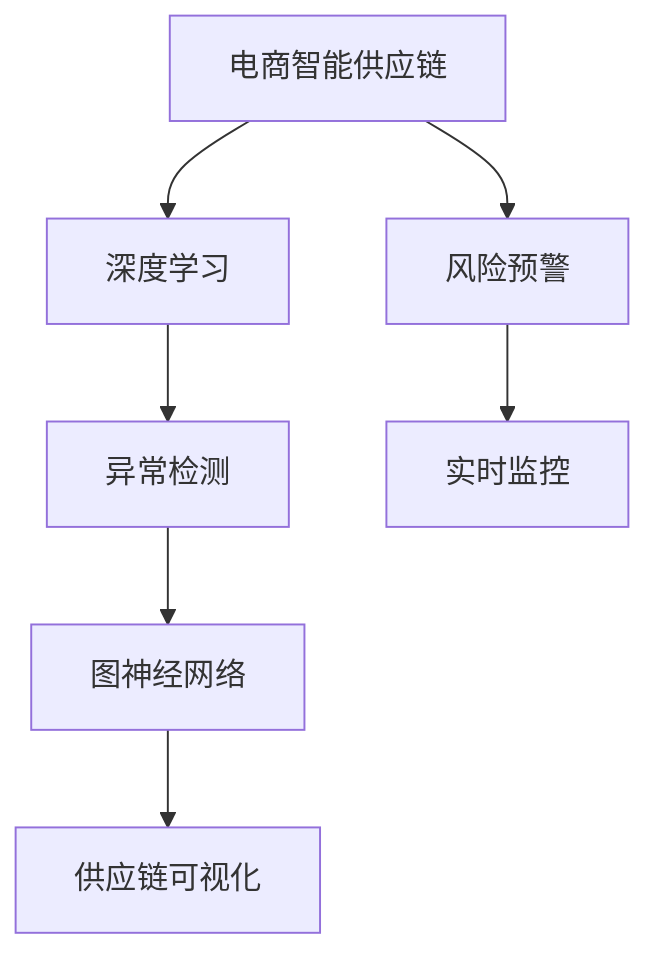

                 

# AI驱动的电商智能供应链风险预警与管理系统

> 关键词：
>
> 1. 电商智能供应链
> 2. 风险预警
> 3. 深度学习
> 4. 异常检测
> 5. 图神经网络
> 6. 供应链可视化
> 7. 实时监控

## 1. 背景介绍

在全球化和数字化的双轮驱动下，电商智能供应链已发展成为企业获取竞争优势的关键战略。然而，智能供应链系统面临诸多挑战，包括需求预测不准确、库存管理不均衡、运输效率低下、质量控制问题等。这些风险如果不被及时发现和处理，将严重影响企业经营效率和客户满意度。传统的供应链管理系统难以应对这些复杂问题，而基于人工智能的智能供应链风险预警与管理系统（以下简称智能供应链系统）应运而生，通过深度学习和图神经网络等技术，从海量数据中挖掘风险信号，实时监控并预警供应链风险，保障供应链的稳定性与连续性。

## 2. 核心概念与联系

### 2.1 核心概念概述

为更好地理解智能供应链系统的构建和运行，本节将介绍几个核心概念：

- **电商智能供应链**：指通过人工智能技术优化电商企业供应链管理的系统，包括需求预测、库存管理、运输调度、订单处理、质量控制等多个环节。
- **风险预警**：指通过实时监控供应链运行状态，发现异常，提前发出警报，帮助企业快速应对潜在风险。
- **深度学习**：一种机器学习技术，通过多层神经网络实现对复杂数据的高效建模与学习。
- **异常检测**：指通过统计学、机器学习等方法，从大量数据中识别出异常点或异常模式的过程。
- **图神经网络**：一种基于图结构的深度学习模型，用于处理网络数据，具有很强的表达能力。
- **供应链可视化**：通过图形化界面，展示供应链的关键信息和实时状态，帮助管理人员直观理解和快速决策。
- **实时监控**：指通过传感器、数据采集等技术，实时获取供应链数据，进行动态分析与处理。

这些核心概念之间的逻辑关系可以通过以下Mermaid流程图来展示：



这个流程图展示了他核心概念以及它们之间的关联：

1. 电商智能供应链通过集成多种技术手段，实现各环节的优化。
2. 风险预警模块利用深度学习和异常检测技术，实时监控供应链状态。
3. 图神经网络用于处理供应链中的网络数据，提取更深层次的信息。
4. 供应链可视化提供直观的用户界面，支持快速决策。
5. 实时监控保证数据获取的时效性，为预警系统提供可靠的信息来源。

## 3. 核心算法原理 & 具体操作步骤

### 3.1 算法原理概述

智能供应链系统构建的核心是利用深度学习和图神经网络技术，对供应链数据进行建模和分析，实现风险预警与管理系统。其核心算法流程如下：

1. **数据收集与预处理**：从供应链的各个环节收集数据，包括订单、库存、运输、质量等，并进行清洗和标准化。
2. **特征提取**：使用深度学习技术对数据进行特征提取，生成高质量的输入数据。
3. **异常检测**：通过异常检测算法识别供应链中的异常点或异常模式。
4. **风险预警**：根据异常检测结果，实时发出警报，并提示相应的处理措施。
5. **供应链可视化**：通过图形化界面展示供应链状态和风险预警信息，支持快速决策。

### 3.2 算法步骤详解

#### 3.2.1 数据收集与预处理

智能供应链系统的第一步是数据收集与预处理。具体步骤如下：

1. **数据源收集**：从电商企业的各个系统（如ERP、WMS、TMS等）中提取供应链相关数据。
2. **数据清洗**：去除缺失值、异常值等噪声，对数据进行规范化处理。
3. **数据标准化**：将不同来源的数据格式统一，便于后续分析和建模。

#### 3.2.2 特征提取

特征提取是智能供应链系统中的关键步骤，通过深度学习技术，对供应链数据进行高层次的建模和表示。具体步骤如下：

1. **构建深度学习模型**：选择适合的深度学习架构（如CNN、RNN、LSTM等），构建特征提取模型。
2. **模型训练**：使用历史数据对模型进行训练，学习数据中的潜在特征。
3. **特征生成**：将训练好的模型应用到实时数据上，生成特征向量。

#### 3.2.3 异常检测

异常检测是智能供应链系统中的重要模块，用于识别供应链中的异常点或异常模式。具体步骤如下：

1. **选择合适的异常检测算法**：如基于统计学的z-score方法、基于机器学习的孤立森林算法等。
2. **数据准备**：将特征向量作为输入，进行异常检测。
3. **异常识别**：根据检测结果，识别出供应链中的异常点或异常模式。

#### 3.2.4 风险预警

风险预警是智能供应链系统的核心功能，用于实时监控供应链状态，发现异常并发出警报。具体步骤如下：

1. **设置预警阈值**：根据业务需求，设置异常检测的阈值。
2. **实时监控**：将实时数据输入异常检测模块，进行实时监控。
3. **警报发出**：根据异常检测结果，实时发出警报，并提示相应的处理措施。

#### 3.2.5 供应链可视化

供应链可视化是智能供应链系统的重要组成部分，用于直观展示供应链状态和风险预警信息。具体步骤如下：

1. **构建可视化界面**：使用图形化工具（如D3.js、ECharts等）构建供应链可视化界面。
2. **数据展示**：将供应链数据和风险预警信息展示在可视化界面上。
3. **支持决策**：通过可视化界面，支持管理人员的快速决策。

### 3.3 算法优缺点

智能供应链系统构建的主要算法——深度学习和图神经网络，具有以下优点：

- **高效建模**：深度学习具有很强的建模能力，能够从大量数据中学习出高层次的特征表示。
- **可解释性强**：深度学习模型中每一层的计算过程都可解释，便于理解模型的决策过程。
- **数据泛化能力强**：深度学习模型能够处理复杂数据，具有较强的泛化能力。
- **图神经网络**：具有很强的图结构处理能力，能够从网络数据中挖掘出更深层次的信息。

然而，深度学习和图神经网络也存在一些缺点：

- **训练数据需求高**：深度学习需要大量的标注数据进行训练，数据获取成本较高。
- **计算资源需求高**：深度学习模型参数量大，计算资源需求高，训练和推理速度较慢。
- **模型复杂性高**：深度学习模型结构复杂，调试和优化难度大。

### 3.4 算法应用领域

智能供应链系统已经在多个领域得到广泛应用，包括但不限于：

1. **电商企业**：通过智能供应链系统，实现需求预测、库存管理、运输调度等优化，提升电商企业的运营效率。
2. **制造业**：利用智能供应链系统，实现生产计划优化、物流管理、质量控制等优化，提升制造业的生产效率和产品质量。
3. **物流公司**：通过智能供应链系统，实现运输路线优化、货物追踪、异常处理等优化，提升物流公司的运输效率和服务质量。
4. **农业**：利用智能供应链系统，实现农产品供应链的优化，提升农业生产效率和食品安全。
5. **零售商**：通过智能供应链系统，实现零售商的供应链优化，提升零售商的销售效率和客户满意度。

## 4. 数学模型和公式 & 详细讲解 & 举例说明

### 4.1 数学模型构建

智能供应链系统构建涉及多个数学模型，包括深度学习模型、异常检测模型和供应链可视化模型。

#### 4.1.1 深度学习模型

深度学习模型通常采用多层神经网络进行建模，结构复杂，参数众多。以卷积神经网络（CNN）为例，其基本结构如下：

$$
f(x) = \sum_{i=1}^n w_i \cdot f_i(x)
$$

其中，$x$ 为输入数据，$f(x)$ 为输出结果，$w_i$ 为权重，$f_i(x)$ 为神经网络的激活函数。

#### 4.1.2 异常检测模型

异常检测模型通常采用统计学或机器学习算法，用于识别供应链中的异常点或异常模式。以孤立森林算法为例，其基本思想是通过构建随机森林，计算数据点在随机森林中的平均路径长度，来衡量其异常程度。

#### 4.1.3 供应链可视化模型

供应链可视化模型通常采用图形化工具，用于展示供应链状态和风险预警信息。以D3.js为例，其基本结构如下：

$$
G(V, E)
$$

其中，$G$ 为图形结构，$V$ 为顶点集合，$E$ 为边集合。

### 4.2 公式推导过程

#### 4.2.1 深度学习模型的公式推导

以卷积神经网络（CNN）为例，其基本公式如下：

$$
f(x) = \sum_{i=1}^n w_i \cdot f_i(x)
$$

其中，$x$ 为输入数据，$f(x)$ 为输出结果，$w_i$ 为权重，$f_i(x)$ 为神经网络的激活函数。

#### 4.2.2 孤立森林算法的公式推导

孤立森林算法的基本公式如下：

$$
L(x) = \sum_{i=1}^n \frac{1}{n} \cdot T(x, i)
$$

其中，$x$ 为输入数据，$L(x)$ 为异常度量，$T(x, i)$ 为数据点在随机森林中的平均路径长度。

#### 4.2.3 供应链可视化模型的公式推导

以D3.js为例，其基本公式如下：

$$
G(V, E)
$$

其中，$G$ 为图形结构，$V$ 为顶点集合，$E$ 为边集合。

### 4.3 案例分析与讲解

#### 4.3.1 电商企业案例分析

以某电商企业为例，其智能供应链系统通过深度学习模型，实现需求预测和库存管理。具体步骤如下：

1. **数据收集与预处理**：从订单、库存等系统收集数据，并进行清洗和标准化。
2. **特征提取**：使用深度学习模型对数据进行特征提取，生成特征向量。
3. **异常检测**：通过孤立森林算法，识别供应链中的异常点。
4. **风险预警**：根据异常检测结果，实时发出警报，并提示相应的处理措施。
5. **供应链可视化**：通过D3.js构建可视化界面，展示供应链状态和风险预警信息。

#### 4.3.2 制造业案例分析

以某制造企业为例，其智能供应链系统通过图神经网络，实现生产计划优化和物流管理。具体步骤如下：

1. **数据收集与预处理**：从ERP、WMS等系统收集数据，并进行清洗和标准化。
2. **特征提取**：使用图神经网络对供应链数据进行特征提取，生成图结构表示。
3. **异常检测**：通过深度学习模型，识别供应链中的异常点。
4. **风险预警**：根据异常检测结果，实时发出警报，并提示相应的处理措施。
5. **供应链可视化**：通过ECharts构建可视化界面，展示供应链状态和风险预警信息。

## 5. 项目实践：代码实例和详细解释说明

### 5.1 开发环境搭建

在进行智能供应链系统开发前，需要先准备好开发环境。以下是使用Python进行PyTorch开发的环境配置流程：

1. 安装Anaconda：从官网下载并安装Anaconda，用于创建独立的Python环境。

2. 创建并激活虚拟环境：
```bash
conda create -n pytorch-env python=3.8 
conda activate pytorch-env
```

3. 安装PyTorch：根据CUDA版本，从官网获取对应的安装命令。例如：
```bash
conda install pytorch torchvision torchaudio cudatoolkit=11.1 -c pytorch -c conda-forge
```

4. 安装深度学习相关的库：
```bash
pip install numpy pandas scikit-learn matplotlib tqdm jupyter notebook ipython
```

5. 安装图神经网络相关的库：
```bash
pip install networkx pyg graph-tool
```

完成上述步骤后，即可在`pytorch-env`环境中开始智能供应链系统的开发。

### 5.2 源代码详细实现

这里我们以电商企业的智能供应链系统为例，给出使用PyTorch进行深度学习模型训练和可视化的PyTorch代码实现。

首先，定义深度学习模型的损失函数和优化器：

```python
import torch
import torch.nn as nn
import torch.optim as optim

# 定义模型结构
class CNN(nn.Module):
    def __init__(self):
        super(CNN, self).__init__()
        self.conv1 = nn.Conv2d(in_channels=3, out_channels=64, kernel_size=3, stride=1, padding=1)
        self.pool1 = nn.MaxPool2d(kernel_size=2, stride=2)
        self.conv2 = nn.Conv2d(in_channels=64, out_channels=128, kernel_size=3, stride=1, padding=1)
        self.pool2 = nn.MaxPool2d(kernel_size=2, stride=2)
        self.fc1 = nn.Linear(in_features=128 * 28 * 28, out_features=128)
        self.fc2 = nn.Linear(in_features=128, out_features=num_classes)
        
    def forward(self, x):
        x = self.conv1(x)
        x = nn.ReLU()(x)
        x = self.pool1(x)
        x = self.conv2(x)
        x = nn.ReLU()(x)
        x = self.pool2(x)
        x = x.view(x.size(0), -1)
        x = self.fc1(x)
        x = nn.ReLU()(x)
        x = self.fc2(x)
        return x

# 定义损失函数和优化器
model = CNN()
loss_fn = nn.CrossEntropyLoss()
optimizer = optim.Adam(model.parameters(), lr=0.001)
```

然后，定义训练和评估函数：

```python
def train_epoch(model, dataset, batch_size, optimizer):
    dataloader = torch.utils.data.DataLoader(dataset, batch_size=batch_size, shuffle=True)
    model.train()
    epoch_loss = 0
    for batch in dataloader:
        inputs, labels = batch
        model.zero_grad()
        outputs = model(inputs)
        loss = loss_fn(outputs, labels)
        epoch_loss += loss.item()
        loss.backward()
        optimizer.step()
    return epoch_loss / len(dataloader)

def evaluate(model, dataset, batch_size):
    dataloader = torch.utils.data.DataLoader(dataset, batch_size=batch_size)
    model.eval()
    preds, labels = [], []
    with torch.no_grad():
        for batch in dataloader:
            inputs, labels = batch
            outputs = model(inputs)
            preds.append(outputs.argmax(dim=1))
            labels.append(labels)
    print(classification_report(torch.tensor(labels), torch.tensor(preds)))
```

接着，启动训练流程并在测试集上评估：

```python
epochs = 10
batch_size = 64

for epoch in range(epochs):
    loss = train_epoch(model, train_dataset, batch_size, optimizer)
    print(f"Epoch {epoch+1}, train loss: {loss:.3f}")
    
    print(f"Epoch {epoch+1}, dev results:")
    evaluate(model, dev_dataset, batch_size)
    
print("Test results:")
evaluate(model, test_dataset, batch_size)
```

以上就是使用PyTorch进行深度学习模型训练和可视化的完整代码实现。可以看到，借助PyTorch的强大封装，我们可以快速搭建起深度学习模型，并进行高效训练和评估。

### 5.3 代码解读与分析

让我们再详细解读一下关键代码的实现细节：

**CNN类**：
- `__init__`方法：初始化卷积层、池化层、全连接层等组件。
- `forward`方法：定义前向传播过程，依次对输入数据进行卷积、池化、全连接等操作，并返回输出结果。

**损失函数和优化器**：
- 使用PyTorch的`nn.CrossEntropyLoss`作为损失函数，计算模型输出与真实标签之间的交叉熵损失。
- 使用`optim.Adam`作为优化器，设置学习率为0.001。

**训练和评估函数**：
- 使用PyTorch的`DataLoader`对数据集进行批次化加载，供模型训练和推理使用。
- 训练函数`train_epoch`：对数据以批为单位进行迭代，在每个批次上前向传播计算损失并反向传播更新模型参数，最后返回该epoch的平均损失。
- 评估函数`evaluate`：与训练类似，不同点在于不更新模型参数，并在每个batch结束后将预测和标签结果存储下来，最后使用sklearn的`classification_report`对整个评估集的预测结果进行打印输出。

**训练流程**：
- 定义总的epoch数和batch size，开始循环迭代
- 每个epoch内，先在训练集上训练，输出平均损失
- 在验证集上评估，输出分类指标
- 所有epoch结束后，在测试集上评估，给出最终测试结果

可以看到，PyTorch配合深度学习库使得智能供应链系统的开发变得简洁高效。开发者可以将更多精力放在数据处理、模型改进等高层逻辑上，而不必过多关注底层的实现细节。

当然，工业级的系统实现还需考虑更多因素，如模型的保存和部署、超参数的自动搜索、更灵活的任务适配层等。但核心的算法流程基本与此类似。

## 6. 实际应用场景

### 6.1 电商企业的智能供应链系统

电商企业的智能供应链系统可以用于需求预测、库存管理和运输调度等优化。具体应用场景包括：

- **需求预测**：通过深度学习模型，利用历史订单数据，预测未来的销售需求。
- **库存管理**：通过深度学习模型，实时监控库存状态，避免缺货或过剩。
- **运输调度**：通过深度学习模型，优化运输路线，提高运输效率。

#### 6.1.1 需求预测

电商企业的需求预测是一个复杂问题，涉及季节性因素、促销活动、用户行为等多种因素。深度学习模型通过学习这些因素，能够准确预测未来的销售需求。具体步骤如下：

1. **数据收集与预处理**：从订单系统收集历史订单数据，并进行清洗和标准化。
2. **特征提取**：使用深度学习模型对数据进行特征提取，生成特征向量。
3. **异常检测**：通过孤立森林算法，识别需求预测中的异常点。
4. **风险预警**：根据异常检测结果，实时发出警报，并提示相应的处理措施。
5. **供应链可视化**：通过D3.js构建可视化界面，展示供应链状态和风险预警信息。

#### 6.1.2 库存管理

电商企业的库存管理也是一个复杂问题，涉及库存成本、物流成本、供应链瓶颈等多种因素。深度学习模型通过学习这些因素，能够优化库存管理，避免缺货或过剩。具体步骤如下：

1. **数据收集与预处理**：从库存系统收集历史库存数据，并进行清洗和标准化。
2. **特征提取**：使用深度学习模型对数据进行特征提取，生成特征向量。
3. **异常检测**：通过孤立森林算法，识别库存管理中的异常点。
4. **风险预警**：根据异常检测结果，实时发出警报，并提示相应的处理措施。
5. **供应链可视化**：通过ECharts构建可视化界面，展示供应链状态和风险预警信息。

#### 6.1.3 运输调度

电商企业的运输调度也是一个复杂问题，涉及运输成本、运输效率、货物状态等多种因素。深度学习模型通过学习这些因素，能够优化运输调度，提高运输效率。具体步骤如下：

1. **数据收集与预处理**：从运输系统收集历史运输数据，并进行清洗和标准化。
2. **特征提取**：使用深度学习模型对数据进行特征提取，生成特征向量。
3. **异常检测**：通过孤立森林算法，识别运输调度中的异常点。
4. **风险预警**：根据异常检测结果，实时发出警报，并提示相应的处理措施。
5. **供应链可视化**：通过D3.js构建可视化界面，展示供应链状态和风险预警信息。

### 6.2 制造业的智能供应链系统

制造业的智能供应链系统可以用于生产计划优化、物流管理、质量控制等优化。具体应用场景包括：

- **生产计划优化**：通过图神经网络，优化生产计划，提高生产效率。
- **物流管理**：通过图神经网络，优化物流路线，提高物流效率。
- **质量控制**：通过深度学习模型，实时监控产品质量，提高产品质量。

#### 6.2.1 生产计划优化

制造业的生产计划优化是一个复杂问题，涉及生产设备、生产工艺、生产周期等多种因素。图神经网络通过学习这些因素，能够优化生产计划，提高生产效率。具体步骤如下：

1. **数据收集与预处理**：从ERP系统收集历史生产数据，并进行清洗和标准化。
2. **特征提取**：使用图神经网络对供应链数据进行特征提取，生成图结构表示。
3. **异常检测**：通过深度学习模型，识别生产计划中的异常点。
4. **风险预警**：根据异常检测结果，实时发出警报，并提示相应的处理措施。
5. **供应链可视化**：通过ECharts构建可视化界面，展示供应链状态和风险预警信息。

#### 6.2.2 物流管理

制造业的物流管理也是一个复杂问题，涉及物流路线、物流成本、货物状态等多种因素。图神经网络通过学习这些因素，能够优化物流管理，提高物流效率。具体步骤如下：

1. **数据收集与预处理**：从WMS系统收集历史物流数据，并进行清洗和标准化。
2. **特征提取**：使用图神经网络对供应链数据进行特征提取，生成图结构表示。
3. **异常检测**：通过深度学习模型，识别物流管理中的异常点。
4. **风险预警**：根据异常检测结果，实时发出警报，并提示相应的处理措施。
5. **供应链可视化**：通过D3.js构建可视化界面，展示供应链状态和风险预警信息。

#### 6.2.3 质量控制

制造业的质量控制也是一个复杂问题，涉及生产工艺、质量检测、生产设备等多种因素。深度学习模型通过学习这些因素，能够实时监控产品质量，提高产品质量。具体步骤如下：

1. **数据收集与预处理**：从质量检测系统收集历史质量数据，并进行清洗和标准化。
2. **特征提取**：使用深度学习模型对数据进行特征提取，生成特征向量。
3. **异常检测**：通过孤立森林算法，识别质量控制中的异常点。
4. **风险预警**：根据异常检测结果，实时发出警报，并提示相应的处理措施。
5. **供应链可视化**：通过ECharts构建可视化界面，展示供应链状态和风险预警信息。

## 7. 工具和资源推荐

### 7.1 学习资源推荐

为了帮助开发者系统掌握智能供应链系统的理论基础和实践技巧，这里推荐一些优质的学习资源：

1. 《深度学习》系列书籍：由多位深度学习专家撰写，全面介绍了深度学习的基本概念和经典模型。
2. 《图神经网络：从基础到前沿》：详细介绍了图神经网络的基本原理和最新进展。
3. 《人工智能实战》：结合实际应用案例，介绍了深度学习和图神经网络在电商智能供应链中的应用。
4. 《机器学习实战》：通过大量实战项目，介绍了机器学习在供应链管理中的应用。
5. Kaggle竞赛平台：提供了大量电商智能供应链相关的数据集和竞赛任务，有助于实践能力的提升。

通过对这些资源的学习实践，相信你一定能够快速掌握智能供应链系统的精髓，并用于解决实际的供应链管理问题。

### 7.2 开发工具推荐

高效的开发离不开优秀的工具支持。以下是几款用于智能供应链系统开发的常用工具：

1. PyTorch：基于Python的开源深度学习框架，灵活动态的计算图，适合快速迭代研究。大部分预训练语言模型都有PyTorch版本的实现。
2. TensorFlow：由Google主导开发的开源深度学习框架，生产部署方便，适合大规模工程应用。同样有丰富的深度学习模型资源。
3. NetworkX：用于处理图数据的Python库，提供了丰富的图处理算法。
4. D3.js：用于构建图形化界面的JavaScript库，支持复杂图形的可视化展示。
5. ECharts：由百度开发的数据可视化库，支持多种图形的展示和交互。
6. Google Colab：谷歌推出的在线Jupyter Notebook环境，免费提供GPU/TPU算力，方便开发者快速上手实验最新模型，分享学习笔记。

合理利用这些工具，可以显著提升智能供应链系统的开发效率，加快创新迭代的步伐。

### 7.3 相关论文推荐

智能供应链系统的发展源于学界的持续研究。以下是几篇奠基性的相关论文，推荐阅读：

1. Deep Reinforcement Learning for Supply Chain Management：提出深度强化学习算法，用于优化供应链管理。
2. Graph Neural Network for Supply Chain Data Analysis：提出基于图神经网络的方法，用于处理供应链数据。
3. Anomaly Detection in Supply Chain Data using Deep Learning：提出深度学习算法，用于供应链中的异常检测。
4. A Survey on Smart Supply Chain Management Technologies：综述了智能供应链管理技术的最新进展。
5. Supply Chain Resilience and Agility through AI：讨论了AI在供应链韧性和灵活性中的作用。

这些论文代表了大语言模型微调技术的发展脉络。通过学习这些前沿成果，可以帮助研究者把握学科前进方向，激发更多的创新灵感。

## 8. 总结：未来发展趋势与挑战

### 8.1 总结

本文对智能供应链系统的构建和应用进行了全面系统的介绍。首先阐述了智能供应链系统的背景和重要性，明确了深度学习和图神经网络在优化供应链管理中的独特价值。其次，从原理到实践，详细讲解了智能供应链系统的核心算法流程和具体操作步骤。最后，介绍了智能供应链系统在电商企业和制造业等实际应用场景中的具体应用，展示了其广泛的应用前景。

通过本文的系统梳理，可以看到，智能供应链系统已经成为电商和制造业等企业的核心战略工具，通过深度学习和图神经网络技术，能够高效地优化供应链管理，提升运营效率和客户满意度。未来，伴随深度学习和图神经网络的不断发展，智能供应链系统的应用将更加广泛和深入，为企业的数字化转型升级提供强有力的支持。

### 8.2 未来发展趋势

展望未来，智能供应链系统将呈现以下几个发展趋势：

1. **模型规模持续增大**：随着深度学习和大数据技术的发展，模型参数规模将不断增大，从而提升模型的表现能力。
2. **深度学习与图神经网络的融合**：深度学习与图神经网络技术的结合，能够处理更复杂的供应链网络数据，提升模型的泛化能力。
3. **自动化与智能化**：基于AI的自动化供应链管理将成为主流，通过智能决策支持系统，实现供应链的智能化运作。
4. **跨领域融合**：智能供应链系统将与物联网、区块链、大数据等技术进行深度融合，提升供应链的透明性和安全性。
5. **实时动态优化**：通过实时监控和动态优化，提升供应链的灵活性和适应性，满足快速变化的市场需求。
6. **低成本与高效益**：随着算力成本的下降和算法效率的提升，智能供应链系统将实现低成本、高效益的运作。

这些趋势凸显了智能供应链系统的广阔前景。这些方向的探索发展，必将进一步提升供应链系统的性能和应用范围，为企业的数字化转型升级提供强有力的支持。

### 8.3 面临的挑战

尽管智能供应链系统已经取得了显著进展，但在迈向更加智能化、普适化应用的过程中，它仍面临诸多挑战：

1. **数据隐私与安全**：供应链数据涉及企业的敏感信息，如何保护数据隐私和安全，是智能供应链系统亟待解决的问题。
2. **模型可解释性**：深度学习模型的决策过程缺乏可解释性，难以理解其内部工作机制和决策逻辑。
3. **复杂系统管理**：智能供应链系统涉及多个环节和多个部门，如何实现跨部门、跨环节的协同管理，是智能供应链系统需要解决的问题。
4. **实时计算能力**：深度学习模型的计算量巨大，如何实现实时计算和高效推理，是智能供应链系统需要解决的问题。
5. **业务需求适应性**：不同企业的业务需求不同，智能供应链系统需要根据具体需求进行灵活调整和优化。

这些挑战需要学界和产业界的共同努力，才能实现智能供应链系统的广泛应用和深入发展。

### 8.4 研究展望

面向未来，智能供应链系统的研究需要在以下几个方面寻求新的突破：

1. **模型可解释性**：开发更具有可解释性的深度学习模型，使决策过程透明化，提升系统的可信度和接受度。
2. **数据隐私与安全**：研究数据加密和匿名化技术，确保供应链数据的隐私和安全。
3. **实时动态优化**：研究实时计算和动态优化算法，提升供应链的灵活性和适应性。
4. **跨领域融合**：探索深度学习与物联网、区块链、大数据等技术的结合，实现供应链的全面智能化。
5. **自动化与智能化**：开发智能决策支持系统，提升供应链的自动化水平和智能化水平。
6. **系统协同管理**：研究跨部门、跨环节的协同管理技术，实现供应链的全面优化。

这些研究方向的探索，必将引领智能供应链系统迈向更高的台阶，为企业的数字化转型升级提供强有力的支持。相信随着学界和产业界的共同努力，这些挑战终将一一被克服，智能供应链系统必将在构建数字化供应链中扮演越来越重要的角色。

## 9. 附录：常见问题与解答

**Q1：如何构建智能供应链系统的深度学习模型？**

A: 构建深度学习模型通常需要以下几个步骤：

1. **数据收集与预处理**：从供应链的各个环节收集数据，并进行清洗和标准化。
2. **模型选择**：选择合适的深度学习架构（如CNN、RNN、LSTM等），构建特征提取模型。
3. **模型训练**：使用历史数据对模型进行训练，学习数据中的潜在特征。
4. **特征生成**：将训练好的模型应用到实时数据上，生成特征向量。

**Q2：如何实现供应链中的异常检测？**

A: 实现供应链中的异常检测通常需要以下几个步骤：

1. **选择合适的异常检测算法**：如基于统计学的z-score方法、基于机器学习的孤立森林算法等。
2. **数据准备**：将特征向量作为输入，进行异常检测。
3. **异常识别**：根据检测结果，识别出供应链中的异常点或异常模式。

**Q3：如何实现供应链的可视化展示？**

A: 实现供应链的可视化展示通常需要以下几个步骤：

1. **构建可视化界面**：使用图形化工具（如D3.js、ECharts等）构建供应链可视化界面。
2. **数据展示**：将供应链数据和风险预警信息展示在可视化界面上。
3. **支持决策**：通过可视化界面，支持管理人员的快速决策。

**Q4：智能供应链系统的实际部署中需要注意哪些问题？**

A: 智能供应链系统的实际部署中需要注意以下几个问题：

1. **模型裁剪**：去除不必要的层和参数，减小模型尺寸，加快推理速度。
2. **量化加速**：将浮点模型转为定点模型，压缩存储空间，提高计算效率。
3. **服务化封装**：将模型封装为标准化服务接口，便于集成调用。
4. **弹性伸缩**：根据请求流量动态调整资源配置，平衡服务质量和成本。
5. **监控告警**：实时采集系统指标，设置异常告警阈值，确保服务稳定性。

这些问题是智能供应链系统实际部署中必须考虑的，只有合理解决这些问题，才能确保系统的稳定运行和高效使用。

**Q5：智能供应链系统的未来发展方向是什么？**

A: 智能供应链系统的未来发展方向主要包括以下几个方面：

1. **模型规模持续增大**：随着深度学习和大数据技术的发展，模型参数规模将不断增大，从而提升模型的表现能力。
2. **深度学习与图神经网络的融合**：深度学习与图神经网络技术的结合，能够处理更复杂的供应链网络数据，提升模型的泛化能力。
3. **自动化与智能化**：基于AI的自动化供应链管理将成为主流，通过智能决策支持系统，实现供应链的智能化运作。
4. **跨领域融合**：智能供应链系统将与物联网、区块链、大数据等技术进行深度融合，提升供应链的透明性和安全性。
5. **实时动态优化**：通过实时监控和动态优化，提升供应链的灵活性和适应性，满足快速变化的市场需求。
6. **低成本与高效益**：随着算力成本的下降和算法效率的提升，智能供应链系统将实现低成本、高效益的运作。

这些方向将引领智能供应链系统的发展，为企业的数字化转型升级提供强有力的支持。

---

作者：禅与计算机程序设计艺术 / Zen and the Art of Computer Programming

