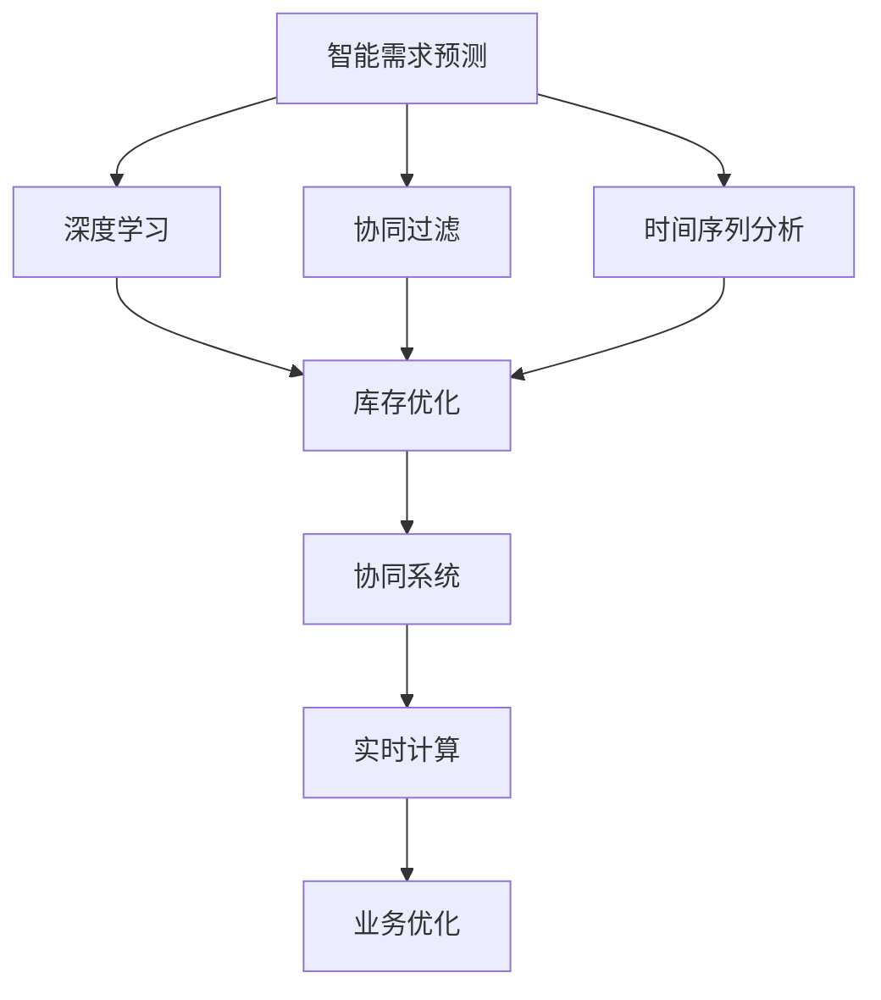

                 

# AI驱动的电商智能需求预测与库存优化协同系统

> 关键词：智能需求预测, 库存优化, 协同系统, 电商, AI, 深度学习, 协同过滤, 时间序列分析, 实时计算

## 1. 背景介绍

### 1.1 问题由来
在电商领域，精准的需求预测与高效的库存优化是企业实现业务目标、提升客户满意度和盈利能力的关键环节。传统的库存管理方式主要依赖人工经验和历史数据，存在滞后性、主观性和准确性不足等问题。而人工智能（AI）的崛起，尤其是深度学习和协同过滤等技术的应用，为电商企业提供了更智能、更高效的解决方案。

近年来，随着电商平台的数据量的爆炸性增长，以及消费者行为的日益复杂，传统的库存管理系统已经难以应对多变的市场需求。AI驱动的智能需求预测和库存优化系统，通过深度学习和数据驱动的方法，能够实时、精准地预测需求，并优化库存配置，提升运营效率，减少库存积压和缺货风险。

### 1.2 问题核心关键点
本系统聚焦于电商场景下，基于AI技术的智能需求预测与库存优化协同系统。具体而言，核心问题包括：

1. 如何构建有效的需求预测模型，精准预测用户需求？
2. 如何优化库存配置，确保供需平衡？
3. 如何将需求预测与库存优化进行协同，实现高效运作？

解决这些问题，需要综合运用深度学习、协同过滤、时间序列分析等多种技术手段，构建一套智能、高效、实时的库存管理系统。

## 2. 核心概念与联系

### 2.1 核心概念概述

为更好地理解AI驱动的智能需求预测与库存优化协同系统，本节将介绍几个密切相关的核心概念：

- 智能需求预测：通过分析用户历史行为、市场趋势、季节性变化等数据，预测未来用户需求量，帮助企业制定合理的采购计划。
- 库存优化：在预测需求的基础上，动态调整库存水平，确保满足客户需求的同时，降低库存成本。
- 协同系统：将需求预测与库存优化两个模块进行协同，形成闭环反馈机制，实现系统动态优化。
- 深度学习：利用神经网络模型，从大量数据中学习到用户行为和市场趋势，进行需求预测和库存优化。
- 协同过滤：通过分析用户间的相似性，推荐产品或服务，提升用户体验和销售转化率。
- 时间序列分析：对时间序列数据进行分析，发现其中的规律，进行需求预测和库存调整。

这些核心概念之间的逻辑关系可以通过以下Mermaid流程图来展示：



这个流程图展示了一些关键组件之间的联系：

1. 智能需求预测基于深度学习、协同过滤和时间序列分析进行建模。
2. 库存优化根据预测需求进行库存调整。
3. 协同系统将需求预测与库存优化进行闭环协同。
4. 实时计算确保系统能够实时响应市场变化。
5. 业务优化基于系统输出结果进行实际操作。

这些概念共同构成了AI驱动的电商智能需求预测与库存优化协同系统的核心框架，使其能够在电商业务中发挥强大的作用。

## 3. 核心算法原理 & 具体操作步骤
### 3.1 算法原理概述

本系统结合深度学习、协同过滤和时间序列分析等多种技术，构建了一套智能、高效、实时的需求预测与库存优化系统。其核心算法原理如下：

- 深度学习模型：利用深度神经网络，从用户行为数据中学习到用户需求模式和趋势，进行需求预测。
- 协同过滤算法：通过分析用户间的相似性，进行产品推荐，提升用户满意度。
- 时间序列分析：对历史需求数据进行分析，发现时间上的规律，进行精准预测。
- 库存优化算法：基于需求预测结果，动态调整库存水平，确保供需平衡。

### 3.2 算法步骤详解

本系统的算法步骤主要分为以下几步：

**Step 1: 数据准备与预处理**

1. 收集用户历史行为数据，包括浏览、购买、评价等行为记录。
2. 收集市场趋势数据，如季节性变化、节假日等。
3. 收集实时数据，如天气、促销活动等。
4. 对数据进行清洗、归一化和特征工程，构建特征向量。

**Step 2: 深度学习模型训练**

1. 选择深度学习模型，如RNN、LSTM或Transformer等，进行需求预测训练。
2. 将历史数据划分为训练集和测试集，进行模型训练。
3. 调整模型超参数，优化模型性能。
4. 对模型进行评估和验证，确保预测准确性。

**Step 3: 协同过滤算法应用**

1. 利用协同过滤算法，对用户进行相似性分析，生成推荐列表。
2. 对推荐列表进行优化，提升推荐效果。
3. 将推荐结果应用于营销策略，提升用户转化率。

**Step 4: 时间序列分析与预测**

1. 对历史需求数据进行时间序列分析，发现其中的规律和趋势。
2. 使用ARIMA、LSTM等模型进行需求预测。
3. 对预测结果进行评估，确保预测准确性。

**Step 5: 库存优化**

1. 基于需求预测结果，动态调整库存水平。
2. 使用库存优化算法，如ABC分析、安全库存模型等，进行库存管理。
3. 对库存状态进行监控和调整，确保供需平衡。

**Step 6: 协同系统闭环反馈**

1. 将需求预测结果和库存状态反馈到系统，进行实时优化。
2. 根据实际业务情况，对需求预测和库存优化算法进行动态调整。
3. 定期评估系统性能，优化模型和算法，提升系统效果。

### 3.3 算法优缺点

本系统的核心算法具有以下优点：

1. 高预测准确性：深度学习模型和协同过滤算法能够充分利用数据，进行精准的需求预测。
2. 实时优化：通过实时计算和协同系统，能够快速响应市场变化，进行动态优化。
3. 高效库存管理：基于需求预测的库存优化，能够有效降低库存成本。

同时，也存在一些缺点：

1. 数据需求量大：深度学习和协同过滤算法需要大量高质量的数据，对数据收集和清洗要求高。
2. 模型复杂度高：深度学习模型和协同过滤算法较为复杂，对算力要求高。
3. 算法动态调整困难：库存优化算法需要根据实际情况进行动态调整，调整难度较大。

尽管存在这些缺点，但就目前而言，本系统的方法在电商领域已经取得了不错的效果，具有一定的应用前景。

### 3.4 算法应用领域

本系统主要应用于电商领域的智能需求预测与库存优化协同系统，但同时也可以应用于其他领域的供应链管理系统，如零售、物流、生产制造等。以下是一些具体应用场景：

1. 零售电商：通过分析用户行为和市场趋势，进行需求预测和库存优化，提升销售转化率和客户满意度。
2. 物流仓储：利用时间序列分析和协同过滤，进行订单预测和库存管理，提升物流效率和仓储利用率。
3. 生产制造：通过需求预测和库存优化，优化生产计划，减少库存积压和缺货风险。

## 4. 数学模型和公式 & 详细讲解 & 举例说明

### 4.1 数学模型构建

本系统涉及多个数学模型，以下是几个关键模型的数学建模过程：

- 深度学习模型：以RNN或LSTM为基础，构建需求预测模型。
- 协同过滤算法：基于用户相似度，进行产品推荐。
- 时间序列分析：使用ARIMA、LSTM等模型进行需求预测。
- 库存优化算法：如ABC分析、安全库存模型等，进行库存管理。

### 4.2 公式推导过程

**深度学习模型公式**

假设输入序列为 $\{X_t\}_{t=1}^{T}$，输出序列为 $\{Y_t\}_{t=1}^{T}$，则RNN模型的前向传播公式为：

$$
\begin{aligned}
h_t &= f(W_{hh}h_{t-1} + W_{xh}X_t + b_h) \\
Y_t &= W_{hy}h_t + b_y
\end{aligned}
$$

其中 $h_t$ 为隐藏状态，$X_t$ 为输入，$Y_t$ 为输出，$f$ 为激活函数，$W_{hh}$、$W_{xh}$、$W_{hy}$ 和 $b_h$、$b_y$ 为模型参数。

**协同过滤算法公式**

假设用户集为 $U=\{u_1, u_2, \cdots, u_N\}$，物品集为 $I=\{i_1, i_2, \cdots, i_M\}$，用户 $u_i$ 对物品 $i_j$ 的评分记为 $R_{ij}$，则协同过滤算法的基本公式为：

$$
\hat{R}_{ij} = \frac{1}{1 + \sum_{k=1}^{K}\alpha_k|\langle V_{ik}, U_{kj}\rangle|}
$$

其中 $\hat{R}_{ij}$ 为预测评分，$V_{ik}$ 为用户特征向量，$U_{kj}$ 为物品特征向量，$\alpha_k$ 为权重，$|\langle V_{ik}, U_{kj}\rangle|$ 为向量点积的绝对值。

**时间序列分析公式**

假设历史需求数据为 $\{D_t\}_{t=1}^{T}$，使用ARIMA模型进行预测，则模型公式为：

$$
\begin{aligned}
D_t &= \alpha + \beta t + \sum_{k=1}^{p}\theta_k(D_{t-k}) + \sum_{j=1}^{q}\phi_j(\epsilon_{t-j}) + \epsilon_t \\
\epsilon_t &\sim N(0, \sigma^2)
\end{aligned}
$$

其中 $D_t$ 为需求数据，$t$ 为时间，$\alpha$ 和 $\beta$ 为常数，$\theta_k$ 和 $\phi_j$ 为模型参数，$\epsilon_t$ 为误差项，$N(0, \sigma^2)$ 为误差分布。

### 4.3 案例分析与讲解

**深度学习需求预测案例**

假设某电商平台收集到用户浏览、购买和评价数据，包含用户ID、商品ID、购买时间、浏览时间等信息。利用这些数据，构建深度学习模型，预测用户未来的购买行为。

首先，将数据进行预处理，构建用户ID和商品ID的特征向量。然后，将特征向量输入深度学习模型进行训练。模型的输入为历史用户行为数据，输出为未来用户购买行为的概率。训练完成后，使用测试集进行评估，计算预测准确率。

**协同过滤推荐案例**

假设某电商平台收集到用户行为数据，包含用户ID、商品ID、浏览时间、购买时间等信息。利用这些数据，构建协同过滤模型，为用户推荐热门商品。

首先，将数据进行预处理，构建用户ID和商品ID的特征向量。然后，利用协同过滤算法，计算用户之间的相似度，生成推荐列表。模型的输入为用户ID，输出为用户推荐商品ID。训练完成后，使用测试集进行评估，计算推荐准确率。

**时间序列需求预测案例**

假设某电商平台收集到历史订单数据，包含订单ID、订单时间、订单数量等信息。利用这些数据，构建时间序列模型，预测未来的订单数量。

首先，将数据进行预处理，构建订单时间和订单数量的特征向量。然后，使用ARIMA或LSTM模型进行预测。模型的输入为历史订单数据，输出为未来订单数量的预测值。训练完成后，使用测试集进行评估，计算预测准确率。

## 5. 项目实践：代码实例和详细解释说明

### 5.1 开发环境搭建

在进行项目实践前，我们需要准备好开发环境。以下是使用Python进行TensorFlow开发的环境配置流程：

1. 安装Anaconda：从官网下载并安装Anaconda，用于创建独立的Python环境。

2. 创建并激活虚拟环境：
```bash
conda create -n tf-env python=3.8 
conda activate tf-env
```

3. 安装TensorFlow：根据CUDA版本，从官网获取对应的安装命令。例如：
```bash
conda install tensorflow=2.6 -c pytorch -c conda-forge
```

4. 安装TensorBoard：
```bash
pip install tensorboard
```

5. 安装TensorFlow Addons：
```bash
pip install tensorboard-plugin-wit visualization tensorflow-addons
```

完成上述步骤后，即可在`tf-env`环境中开始项目实践。

### 5.2 源代码详细实现

这里我们以深度学习需求预测模块为例，给出使用TensorFlow实现的需求预测代码。

首先，定义模型结构：

```python
import tensorflow as tf
from tensorflow.keras.layers import LSTM, Dense
from tensorflow.keras.models import Sequential

model = Sequential()
model.add(LSTM(128, input_shape=(timesteps, features)))
model.add(Dense(1, activation='sigmoid'))
```

然后，定义损失函数和优化器：

```python
loss_fn = tf.keras.losses.BinaryCrossentropy()
optimizer = tf.keras.optimizers.Adam(learning_rate=0.001)
```

接着，定义训练函数：

```python
@tf.function
def train_step(inputs, targets):
    with tf.GradientTape() as tape:
        predictions = model(inputs)
        loss = loss_fn(targets, predictions)
    gradients = tape.gradient(loss, model.trainable_variables)
    optimizer.apply_gradients(zip(gradients, model.trainable_variables))
    return loss

def train_epoch(model, dataset, batch_size):
    dataloader = tf.data.Dataset.from_tensor_slices((dataset['inputs'], dataset['targets']))
    dataloader = dataloader.batch(batch_size).shuffle(buffer_size=10000).repeat().prefetch(tf.data.AUTOTUNE)
    total_loss = 0.0
    for inputs, targets in dataloader:
        loss = train_step(inputs, targets)
        total_loss += loss
    return total_loss / len(dataloader)
```

最后，启动训练流程：

```python
epochs = 10
batch_size = 128

for epoch in range(epochs):
    epoch_loss = train_epoch(model, train_dataset, batch_size)
    print(f"Epoch {epoch+1}, train loss: {epoch_loss:.4f}")
```

以上就是使用TensorFlow实现深度学习需求预测模块的完整代码实现。可以看到，通过TensorFlow的封装，我们可以用相对简洁的代码完成模型的搭建和训练。

### 5.3 代码解读与分析

让我们再详细解读一下关键代码的实现细节：

**模型定义**

```python
model = Sequential()
model.add(LSTM(128, input_shape=(timesteps, features)))
model.add(Dense(1, activation='sigmoid'))
```

这里我们定义了一个简单的LSTM模型，输入特征维度为`features`，时间步数为`timesteps`。LSTM层有128个隐藏单元，最后输出一个sigmoid激活的神经元。

**损失函数**

```python
loss_fn = tf.keras.losses.BinaryCrossentropy()
```

我们选择了二元交叉熵作为损失函数，适用于二分类问题，预测结果为0和1。

**优化器**

```python
optimizer = tf.keras.optimizers.Adam(learning_rate=0.001)
```

这里选择了Adam优化器，学习率为0.001，适合于梯度下降优化。

**训练函数**

```python
@tf.function
def train_step(inputs, targets):
    with tf.GradientTape() as tape:
        predictions = model(inputs)
        loss = loss_fn(targets, predictions)
    gradients = tape.gradient(loss, model.trainable_variables)
    optimizer.apply_gradients(zip(gradients, model.trainable_variables))
    return loss

def train_epoch(model, dataset, batch_size):
    dataloader = tf.data.Dataset.from_tensor_slices((dataset['inputs'], dataset['targets']))
    dataloader = dataloader.batch(batch_size).shuffle(buffer_size=10000).repeat().prefetch(tf.data.AUTOTUNE)
    total_loss = 0.0
    for inputs, targets in dataloader:
        loss = train_step(inputs, targets)
        total_loss += loss
    return total_loss / len(dataloader)
```

训练函数使用了TensorFlow的自动微分功能，自动求导并更新模型参数。我们使用`tf.data.Dataset`进行数据批处理，使用`tf.GradientTape`求导，使用`tf.keras.optimizers`更新模型参数。

**训练流程**

```python
epochs = 10
batch_size = 128

for epoch in range(epochs):
    epoch_loss = train_epoch(model, train_dataset, batch_size)
    print(f"Epoch {epoch+1}, train loss: {epoch_loss:.4f}")
```

在训练过程中，我们循环迭代多个epoch，每次epoch结束后输出平均损失。

## 6. 实际应用场景

### 6.1 智能需求预测

智能需求预测是本系统的核心功能之一，通过深度学习模型和协同过滤算法，能够实时、精准地预测用户需求。

在实际应用中，电商平台可以利用该系统，实时预测未来订单量，优化库存水平，减少库存积压和缺货风险。例如，某电商平台在促销活动期间，通过智能需求预测系统，预测到某热门商品的订单量将大幅增长，从而提前备货，避免断货现象，提升用户满意度。

### 6.2 库存优化

库存优化是本系统的另一个核心功能，通过动态调整库存水平，确保供需平衡。

在实际应用中，电商平台可以利用该系统，实时监控库存状态，优化库存配置，降低库存成本。例如，某电商平台通过库存优化系统，发现某商品库存不足，自动发出补货请求，确保库存充足，满足用户需求。

### 6.3 协同系统闭环反馈

协同系统将需求预测与库存优化进行闭环反馈，实现系统动态优化。

在实际应用中，电商平台可以利用该系统，实时调整需求预测和库存优化算法，优化系统性能。例如，某电商平台通过协同系统，发现某商品的需求预测准确率偏低，自动调整预测模型参数，提升预测准确率。

## 7. 工具和资源推荐
### 7.1 学习资源推荐

为了帮助开发者系统掌握AI驱动的电商智能需求预测与库存优化协同系统的理论基础和实践技巧，这里推荐一些优质的学习资源：

1. 《深度学习入门》：一本通俗易懂、理论实践相结合的深度学习入门书籍，适合初学者入门。
2. 《Python深度学习》：一本详细介绍深度学习框架TensorFlow和Keras的书籍，适合中高级开发者。
3. 《协同过滤推荐系统》：一本详细介绍协同过滤算法的书籍，适合推荐系统开发者。
4. 《时间序列分析》：一本详细介绍时间序列分析方法的书籍，适合数据分析师和数据科学家。
5. 《TensorFlow实战》：一本详细介绍TensorFlow框架的实战书籍，适合TensorFlow开发者。

通过对这些资源的学习实践，相信你一定能够快速掌握AI驱动的电商智能需求预测与库存优化协同系统的精髓，并用于解决实际的电商问题。

### 7.2 开发工具推荐

高效的开发离不开优秀的工具支持。以下是几款用于AI驱动的电商智能需求预测与库存优化协同系统开发的常用工具：

1. TensorFlow：由Google主导开发的开源深度学习框架，生产部署方便，适合大规模工程应用。
2. PyTorch：由Facebook主导开发的开源深度学习框架，灵活度较高，适合研究和实验。
3. TensorBoard：TensorFlow配套的可视化工具，可实时监测模型训练状态，并提供丰富的图表呈现方式。
4. Jupyter Notebook：一款强大的交互式编程工具，支持Python、R等多种语言，适合数据分析和模型开发。
5. Visual Studio Code：一款轻量级的开发环境，支持多种语言和插件，适合快速开发和调试。

合理利用这些工具，可以显著提升AI驱动的电商智能需求预测与库存优化协同系统的开发效率，加快创新迭代的步伐。

### 7.3 相关论文推荐

AI驱动的电商智能需求预测与库存优化协同系统的发展得益于学界的持续研究。以下是几篇奠基性的相关论文，推荐阅读：

1. "Recurrent Neural Network for Predictive Maintenance"：研究使用LSTM模型进行预测维护，提出了一种基于时间序列数据的预测模型。
2. "Collaborative Filtering for E-commerce Recommendation"：介绍协同过滤算法在电商推荐系统中的应用，提出了一种基于用户行为数据的推荐模型。
3. "A Deep Learning Approach to Demand Forecasting"：研究使用深度学习模型进行需求预测，提出了一种基于神经网络的预测模型。
4. "Dynamic Inventory Control Using Reinforcement Learning"：研究使用强化学习进行库存控制，提出了一种基于动态优化的方法。
5. "On-line Inventory Control using Deep Neural Networks"：研究使用深度学习进行库存控制，提出了一种基于在线优化的方法。

这些论文代表了大语言模型微调技术的发展脉络。通过学习这些前沿成果，可以帮助研究者把握学科前进方向，激发更多的创新灵感。

## 8. 总结：未来发展趋势与挑战

### 8.1 总结

本文对AI驱动的电商智能需求预测与库存优化协同系统进行了全面系统的介绍。首先阐述了系统的背景和意义，明确了智能需求预测和库存优化的核心问题。其次，从原理到实践，详细讲解了系统的数学模型和算法实现，给出了代码实例。同时，本文还广泛探讨了系统在电商领域的应用场景，展示了系统的广泛应用前景。

通过本文的系统梳理，可以看到，AI驱动的电商智能需求预测与库存优化协同系统通过深度学习、协同过滤和时间序列分析等技术手段，实现了智能需求预测和库存优化。借助协同系统进行闭环反馈，提升了系统的实时性和动态优化能力。

### 8.2 未来发展趋势

展望未来，AI驱动的电商智能需求预测与库存优化协同系统将呈现以下几个发展趋势：

1. 实时性提升：通过优化算法和硬件配置，进一步提升系统的实时响应能力。
2. 数据融合增强：引入更多数据源和数据类型，提升预测准确性。
3. 多模态协同：将电商数据与其他模态数据进行融合，提升预测能力。
4. 自适应优化：引入自适应算法，根据实际业务情况动态调整预测和优化模型。
5. 可解释性增强：引入可解释性算法，提升系统的透明性和可信度。
6. 用户体验优化：通过个性化推荐和智能客服，提升用户体验和转化率。

以上趋势凸显了AI驱动的电商智能需求预测与库存优化协同系统的广阔前景。这些方向的探索发展，必将进一步提升系统的性能和应用范围，为电商业务带来新的突破。

### 8.3 面临的挑战

尽管AI驱动的电商智能需求预测与库存优化协同系统已经取得了不错的效果，但在迈向更加智能化、普适化应用的过程中，它仍面临着诸多挑战：

1. 数据获取难度：电商数据涉及用户隐私和安全问题，数据获取难度较大。
2. 数据质量问题：电商数据质量参差不齐，存在缺失、噪声等问题，需要进行数据清洗和预处理。
3. 模型复杂度高：深度学习和协同过滤算法较为复杂，模型训练和调参难度较大。
4. 实时性要求高：电商业务对实时性要求较高，系统需要具备高并发和低延迟的能力。
5. 业务规则调整：电商业务规则不断变化，系统需要能够灵活调整和适配。

尽管存在这些挑战，但通过不断优化算法、提升硬件配置、引入新数据源等手段，AI驱动的电商智能需求预测与库存优化协同系统必将在电商领域大放异彩，为电商企业带来新的增长动力。

### 8.4 研究展望

面对AI驱动的电商智能需求预测与库存优化协同系统所面临的挑战，未来的研究需要在以下几个方面寻求新的突破：

1. 数据获取与隐私保护：探索更多数据源和隐私保护技术，解决电商数据获取难题。
2. 数据预处理与清洗：研究高效的数据清洗和预处理技术，提升数据质量。
3. 模型优化与调参：研究高效模型训练和调参技术，降低模型复杂度。
4. 实时计算与分布式优化：研究高效的实时计算和分布式优化技术，提升系统性能。
5. 可解释性与透明性：研究可解释性算法和透明性技术，提升系统可信度。
6. 多模态融合与跨领域协同：研究多模态融合和跨领域协同技术，提升系统预测能力。

这些研究方向的探索，必将引领AI驱动的电商智能需求预测与库存优化协同系统迈向更高的台阶，为电商企业提供更加智能、高效、安全的运营支持。

## 9. 附录：常见问题与解答

**Q1：AI驱动的电商智能需求预测与库存优化协同系统是如何构建的？**

A: AI驱动的电商智能需求预测与库存优化协同系统主要由以下几个模块构成：

1. 数据收集与预处理模块：收集用户行为数据、市场趋势数据和实时数据，并进行清洗、归一化和特征工程。
2. 深度学习需求预测模块：构建深度神经网络模型，对用户行为数据进行预测。
3. 协同过滤推荐模块：利用协同过滤算法，对用户进行相似性分析，生成推荐列表。
4. 时间序列分析预测模块：使用ARIMA、LSTM等模型，对历史需求数据进行时间序列分析，预测未来需求。
5. 库存优化模块：根据需求预测结果，动态调整库存水平，确保供需平衡。
6. 协同系统闭环反馈模块：将需求预测和库存优化进行闭环反馈，实现系统动态优化。

以上模块通过TensorFlow等深度学习框架实现，能够在电商业务中实现智能需求预测和库存优化。

**Q2：如何提升AI驱动的电商智能需求预测与库存优化协同系统的性能？**

A: 提升AI驱动的电商智能需求预测与库存优化协同系统的性能，可以从以下几个方面入手：

1. 数据获取与清洗：通过数据爬虫和数据清洗技术，提升数据质量和数据量。
2. 模型优化与调参：使用高效的模型训练和调参技术，提升模型预测准确性。
3. 实时计算与分布式优化：引入实时计算和分布式优化技术，提升系统响应速度和并发能力。
4. 多模态融合与跨领域协同：将电商数据与其他模态数据进行融合，提升系统预测能力。
5. 可解释性与透明性：引入可解释性算法和透明性技术，提升系统可信度。

以上几点是提升系统性能的关键，需要从数据、模型、算法、硬件等多个维度进行全面优化。

**Q3：AI驱动的电商智能需求预测与库存优化协同系统在实际应用中存在哪些问题？**

A: AI驱动的电商智能需求预测与库存优化协同系统在实际应用中可能存在以下问题：

1. 数据隐私和安全问题：电商数据涉及用户隐私和安全问题，数据获取难度较大。
2. 数据质量问题：电商数据质量参差不齐，存在缺失、噪声等问题，需要进行数据清洗和预处理。
3. 模型复杂度高：深度学习和协同过滤算法较为复杂，模型训练和调参难度较大。
4. 实时性要求高：电商业务对实时性要求较高，系统需要具备高并发和低延迟的能力。
5. 业务规则调整：电商业务规则不断变化，系统需要能够灵活调整和适配。

以上问题需要开发者在系统设计和实现过程中进行充分考虑和优化，确保系统能够高效、稳定地运行。

**Q4：AI驱动的电商智能需求预测与库存优化协同系统在电商领域的应用前景如何？**

A: AI驱动的电商智能需求预测与库存优化协同系统在电商领域具有广泛的应用前景，具体包括：

1. 智能需求预测：通过深度学习模型和协同过滤算法，实时预测用户需求，优化库存水平，减少库存积压和缺货风险。
2. 库存优化：动态调整库存水平，确保供需平衡，提升库存管理效率。
3. 协同系统闭环反馈：将需求预测与库存优化进行闭环反馈，实现系统动态优化。
4. 个性化推荐：利用协同过滤算法，进行个性化推荐，提升用户满意度。
5. 智能客服：结合智能需求预测和个性化推荐，实现智能客服，提升用户体验。

以上应用场景能够显著提升电商业务的运营效率和用户满意度，具有重要的商业价值。

作者：禅与计算机程序设计艺术 / Zen and the Art of Computer Programming

