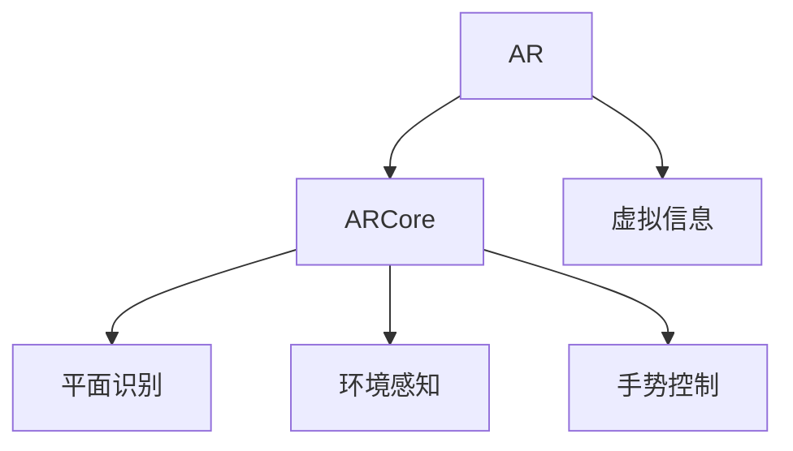

                 

# ARCore 开发工具包：在 Android 上的 AR 应用

## 1. 背景介绍

### 1.1 问题由来

增强现实（Augmented Reality, AR）技术正迅速改变我们的生活方式，通过将数字信息叠加在现实世界中，实现了信息可视化和交互的突破。ARCore是谷歌推出的Android平台增强现实（AR）开发工具包，是构建AR应用的重要基础。本系列博客将从基础到高级，深入剖析ARCore的核心概念和开发技巧，帮助开发者高效实现AR应用，释放AR技术在教育、娱乐、健康等领域的潜力。

### 1.2 问题核心关键点

ARCore作为谷歌开发的AR开发工具包，提供了丰富的功能和API，支持从简单到复杂的AR应用开发。使用ARCore，开发者可以轻松实现基于手势、图像、环境感知的交互效果，快速搭建AR应用，提升用户体验。

## 2. 核心概念与联系

### 2.1 核心概念概述

为更好地理解ARCore，我们首先介绍几个关键概念：

- **增强现实（AR）**：将虚拟信息叠加在现实世界之上，提供更丰富的视觉和交互体验。
- **ARCore**：谷歌开发的Android平台增强现实（AR）开发工具包，提供丰富的AR功能，支持手势、图像、环境感知的交互。
- **平面识别（Plane Recognition）**：识别并追踪平面，支持在平面上进行物品放置、交互。
- **环境感知（Environmental Understanding）**：通过传感器和摄像头，对周围环境进行感知和理解，支持基于环境的交互效果。
- **手势控制（Gesture Control）**：支持基于手势的交互效果，实现手势识别和手势控制。

这些核心概念之间的逻辑关系可以通过以下Mermaid流程图来展示：



这个流程图展示了这个系统框架，ARCore作为基础工具，支持虚拟信息与现实世界的结合，提供了平面识别、环境感知和手势控制等核心功能，实现丰富的AR体验。

## 3. 核心算法原理 & 具体操作步骤
### 3.1 算法原理概述

ARCore的开发原理基于计算机视觉和机器学习的技术，主要包括图像处理、物体检测、环境感知等算法。其核心算法流程如下：

1. **图像采集**：通过摄像头采集现实世界的图像。
2. **预处理**：对采集到的图像进行预处理，包括去噪、归一化、边缘检测等。
3. **特征检测**：使用图像处理算法检测出图像中的特征点或物体。
4. **空间映射**：将虚拟信息映射到现实世界，通过特征点或物体进行空间定位。
5. **手势识别**：使用深度学习算法对用户的手势进行识别和处理。
6. **环境理解**：使用传感器和摄像头对周围环境进行感知，构建环境模型。
7. **交互效果**：根据用户的手势和环境模型，生成虚拟物品和交互效果。

### 3.2 算法步骤详解

以下是ARCore开发的具体步骤：

**Step 1: 搭建开发环境**
- 下载并安装Android Studio
- 在Android Studio中创建新项目，选择ARCore作为支持库
- 配置Google服务项目

**Step 2: 添加ARCore依赖**
- 在项目的build.gradle文件中添加ARCore的依赖，包括ARCore库和ARCore Camera库

**Step 3: 创建AR体验**
- 创建AR体验，包括平面识别、环境感知、手势控制等核心功能
- 在Activity中调用ARCore API，实现AR效果

**Step 4: 运行和调试**
- 运行应用，通过ARCore进行调试和优化
- 在测试环境中进行用户体验测试，发现和解决潜在问题

**Step 5: 发布应用**
- 打包发布应用，提供给用户使用
- 通过市场反馈，持续改进和优化AR体验

### 3.3 算法优缺点

ARCore作为Android平台的主要AR开发工具，具有以下优点：

1. **易于使用**：提供了丰富的API和文档，开发者可以快速上手。
2. **跨平台支持**：支持Android和iOS平台，实现跨平台开发。
3. **性能优化**：通过GPU加速和硬件优化，支持高帧率和低延迟的AR体验。
4. **丰富的功能**：支持平面识别、环境感知、手势控制等多种功能，提供丰富的AR体验。

同时，ARCore也存在一些缺点：

1. **依赖谷歌服务**：需要连接到Google服务，获取地理位置、摄像头等数据，对网络连接要求较高。
2. **硬件限制**：对于低端设备，ARCore的性能表现可能受限。
3. **数据隐私**：处理用户数据时需要注意数据隐私和安全问题。

### 3.4 算法应用领域

ARCore在众多领域都有广泛的应用，以下是几个典型的应用场景：

- **教育**：创建虚拟实验室，增强课堂互动，提升学习体验。
- **医疗**：模拟手术流程，辅助医生进行手术规划和培训。
- **娱乐**：开发AR游戏，提供沉浸式互动体验。
- **营销**：通过AR展示产品效果，提高用户参与度。
- **旅游**：提供虚拟导览，增强游客体验。

## 4. 数学模型和公式 & 详细讲解 & 举例说明

### 4.1 数学模型构建

ARCore的核心算法主要基于计算机视觉和机器学习的技术，以下是一些关键的数学模型：

- **图像预处理**：使用图像处理算法，如高斯滤波、边缘检测等，对图像进行预处理，提高图像质量。
- **特征检测**：使用机器学习算法，如SIFT、SURF等，检测图像中的特征点，提取关键信息。
- **物体检测**：使用深度学习算法，如卷积神经网络（CNN），对图像中的物体进行检测和分类。
- **手势识别**：使用深度学习算法，如卷积神经网络（CNN）和循环神经网络（RNN），对手势进行识别和处理。

### 4.2 公式推导过程

以手势识别为例，使用卷积神经网络（CNN）对手势进行识别，其核心公式如下：

$$
y = \sigma(Wx + b)
$$

其中，$x$表示输入的手势图像，$W$和$b$表示网络的权重和偏置，$\sigma$表示激活函数，$y$表示输出结果，表示手势的类别。

### 4.3 案例分析与讲解

ARCore的手势识别功能是其中最重要的核心功能之一。以下是手势识别的详细讲解：

1. **数据准备**：收集并标注手势样本，使用深度学习算法对手势进行训练。
2. **模型训练**：使用卷积神经网络（CNN）对手势进行训练，生成手势识别模型。
3. **模型部署**：将训练好的手势识别模型部署到AR应用中。
4. **手势识别**：在AR应用中，实时采集用户的手势图像，使用训练好的模型进行识别，输出手势类别。
5. **交互效果**：根据手势类别，生成虚拟物品和交互效果。

## 5. 项目实践：代码实例和详细解释说明
### 5.1 开发环境搭建

以下是ARCore开发的开发环境搭建步骤：

1. **下载Android Studio**：从官网下载并安装Android Studio。
2. **创建新项目**：在Android Studio中创建新项目，选择ARCore作为支持库。
3. **配置Google服务项目**：在项目配置中，设置Google服务项目，获取API密钥和Google服务。

### 5.2 源代码详细实现

以下是一个简单的ARCore应用代码实现：

```java
public class MainActivity extends AppCompatActivity {
    private ARFragment arFragment;
    private PlaneView planeView;
    private GestureDetector gestureDetector;

    @Override
    protected void onCreate(Bundle savedInstanceState) {
        super.onCreate(savedInstanceState);
        setContentView(R.layout.activity_main);
        
        // 初始化ARFragment和GestureDetector
        arFragment = (ARFragment) getSupportFragmentManager().findFragmentById(R.id.fragmentContainer);
        gestureDetector = new GestureDetector(this, new GestureDetector.OnGestureListener() {
            @Override
            public boolean onDown(MotionEvent e) {
                // 处理手势事件
                return false;
            }
        });
    }

    @Override
    protected void onResume() {
        super.onResume();
        // 启动AR体验
        arFragment.start();
    }

    @Override
    protected void onPause() {
        super.onPause();
        // 停止AR体验
        arFragment.stop();
    }
}
```

### 5.3 代码解读与分析

以下是ARCore应用代码的详细解读：

- **ARFragment**：ARCore的核心类，用于创建和管理AR体验，支持平面识别、环境感知、手势控制等功能。
- **PlaneView**：ARCore的视图类，用于显示和渲染AR效果。
- **GestureDetector**：用于处理手势事件，支持手势识别和手势控制。
- **onResume()**和**onPause()**方法：用于启动和停止AR体验。

### 5.4 运行结果展示

运行ARCore应用，可以看到虚拟物品和交互效果。通过手势控制，可以实现虚拟物品的放置和交互，增强用户体验。

## 6. 实际应用场景
### 6.1 智能眼镜
智能眼镜是ARCore的重要应用场景之一，通过ARCore实现虚拟信息的叠加，增强用户的视觉体验。例如，在医学领域，医生可以通过智能眼镜查看病人的虚拟成像，进行手术指导和培训。

### 6.2 教育培训
ARCore在教育领域也有广泛应用，通过虚拟实验和虚拟现实课堂，增强学生的互动体验和学习效果。例如，学生可以通过ARCore进行虚拟实验操作，增强对科学知识的理解和应用。

### 6.3 娱乐游戏
ARCore在娱乐游戏领域也有广泛应用，通过手势控制和虚拟物品的交互，提供沉浸式游戏体验。例如，通过ARCore开发AR游戏，用户可以通过手势控制游戏中的虚拟物品，进行互动和探索。

### 6.4 未来应用展望
随着ARCore技术的不断发展和优化，未来的应用场景将更加多样化。以下是几个未来的应用展望：

- **虚拟家居设计**：通过ARCore，用户可以在虚拟环境中进行家居设计，快速预览家具摆放效果，提升设计效率。
- **智能仓储管理**：通过ARCore，仓库管理人员可以在虚拟环境中进行仓储管理，提高仓储效率和安全性。
- **增强现实导航**：通过ARCore，用户可以通过虚拟信息进行导航，增强出行体验。

## 7. 工具和资源推荐
### 7.1 学习资源推荐

为了帮助开发者系统掌握ARCore的核心概念和开发技巧，以下是一些优质的学习资源：

1. **ARCore官方文档**：谷歌官方提供的ARCore文档，包含丰富的API和示例代码，是学习ARCore的重要资源。
2. **《ARCore实战》书籍**：详细讲解ARCore的核心概念和开发技巧，提供丰富的代码示例和项目案例。
3. **Udacity ARCore课程**：Udacity提供的ARCore课程，涵盖ARCore的核心功能和开发技巧，适合初学者和中级开发者。
4. **Google I/O 2020 ARCore演讲**：谷歌开发者大会上的ARCore演讲，介绍最新的ARCore技术和应用案例，提供丰富的学习资源。

### 7.2 开发工具推荐

以下是几款用于ARCore开发常用的工具：

1. **Android Studio**：谷歌提供的Android开发工具，支持ARCore的开发和调试。
2. **Unity**：跨平台游戏引擎，支持ARCore的开发和集成。
3. **Vuforia**：增强现实开发平台，提供丰富的AR开发工具和示例代码。
4. **Blender**：3D建模软件，支持ARCore的3D模型创建和渲染。

### 7.3 相关论文推荐

ARCore技术的发展离不开学界的持续研究。以下是几篇奠基性的相关论文，推荐阅读：

1. **ARCore: Enhancing Mobile AR**：介绍ARCore的核心功能和开发技巧，详细讲解ARCore的算法和API。
2. **The ARCore Experience: A Vision for Mobile AR**：介绍ARCore的应用场景和未来展望，提供丰富的应用案例和开发技巧。
3. **ARCore for Artists**：介绍ARCore在艺术创作中的应用，提供丰富的示例代码和项目案例。

## 8. 总结：未来发展趋势与挑战
### 8.1 总结

本文对ARCore的核心概念和开发技巧进行了全面系统的介绍。首先阐述了ARCore的背景和重要性，明确了ARCore在AR应用开发中的独特价值。其次，从原理到实践，详细讲解了ARCore的算法和开发流程，给出了ARCore应用开发的完整代码实例。同时，本文还探讨了ARCore在多个领域的实际应用，展示了ARCore技术的广阔前景。此外，本文精选了ARCore技术的各类学习资源，力求为读者提供全方位的技术指引。

通过本文的系统梳理，可以看到，ARCore作为Android平台的主要AR开发工具，正在成为AR应用开发的重要基础。其核心算法基于计算机视觉和机器学习的技术，支持丰富的AR功能，实现高质量的AR体验。ARCore在多个领域都有广泛的应用，展示了其在教育、娱乐、医疗等方面的巨大潜力。未来，伴随ARCore技术的不断演进和优化，必将推动AR技术在更多领域的规模化应用，改变人类的生活方式和工作方式。

### 8.2 未来发展趋势

展望未来，ARCore技术将呈现以下几个发展趋势：

1. **算法性能提升**：通过优化算法和硬件优化，提升ARCore的性能表现，支持更高帧率和更低延迟的AR体验。
2. **功能丰富化**：支持更多的AR功能，如3D模型渲染、动态环境感知等，增强AR体验的多样性。
3. **跨平台支持**：支持更多的平台和设备，实现跨平台开发和应用。
4. **AI技术融合**：融合AI技术，如自然语言处理、情感识别等，增强AR应用的智能化和互动性。
5. **开发工具完善**：提供更完善的开发工具和框架，降低ARCore开发的门槛，提升开发效率。

以上趋势凸显了ARCore技术的广阔前景。这些方向的探索发展，必将进一步提升ARCore的性能和应用范围，为构建人机协同的智能系统铺平道路。面向未来，ARCore技术还需要与其他AR技术进行更深入的融合，如VR、MR等，多路径协同发力，共同推动AR技术的发展和应用。

### 8.3 面临的挑战

尽管ARCore技术已经取得了瞩目成就，但在迈向更加智能化、普适化应用的过程中，它仍面临诸多挑战：

1. **依赖谷歌服务**：需要连接到Google服务，获取地理位置、摄像头等数据，对网络连接要求较高。
2. **硬件限制**：对于低端设备，ARCore的性能表现可能受限。
3. **数据隐私**：处理用户数据时需要注意数据隐私和安全问题。
4. **算法复杂性**：ARCore的核心算法复杂，开发难度较大，需要较高的技术门槛。

### 8.4 研究展望

面对ARCore面临的这些挑战，未来的研究需要在以下几个方面寻求新的突破：

1. **跨平台优化**：优化ARCore的跨平台性能，支持更多的设备和操作系统，提升用户体验。
2. **硬件优化**：优化ARCore的硬件性能，支持更多的设备和平台，降低硬件成本。
3. **数据隐私保护**：加强数据隐私和安全保护，避免数据泄露和滥用。
4. **算法简化**：简化ARCore的核心算法，降低开发门槛，提升开发效率。

这些研究方向将进一步推动ARCore技术的发展和优化，为构建高质量的AR应用提供技术支撑。ARCore作为Android平台的主要AR开发工具，其核心算法和开发技巧具有重要的应用价值和实践意义，相信随着技术的不断发展和优化，ARCore将为AR技术带来新的突破和发展。

## 9. 附录：常见问题与解答

**Q1: 如何在ARCore应用中实现手势控制？**

A: 在ARCore应用中实现手势控制，需要以下步骤：
1. 创建GestureDetector对象，处理手势事件。
2. 在Activity或Fragment中注册GestureDetector。
3. 使用GestureDetector对象的onDown()方法处理手势事件。

**Q2: 如何优化ARCore应用的性能？**

A: 优化ARCore应用的性能，需要以下步骤：
1. 使用GPU加速和硬件优化，提升ARCore的性能表现。
2. 优化图像预处理和特征检测算法，提高ARCore的准确性和鲁棒性。
3. 使用更高效的ARCore函数，减少计算资源消耗。

**Q3: 如何在ARCore应用中实现虚拟物品的放置？**

A: 在ARCore应用中实现虚拟物品的放置，需要以下步骤：
1. 使用ARCore的平面识别功能，识别用户选择的平面。
2. 在识别到的平面上创建虚拟物品对象。
3. 使用ARCore的手势控制功能，让用户放置虚拟物品。

这些问题的解答，将帮助开发者更好地掌握ARCore的核心概念和开发技巧，提升ARCore应用的性能和用户体验。

---

作者：禅与计算机程序设计艺术 / Zen and the Art of Computer Programming

