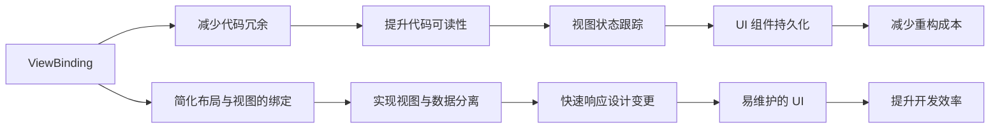

                 

# Android Jetpack 组件库：提升 Android 开发效率和体验

在移动应用开发中，Android 生态系统是最大的平台之一。然而，构建一个高品质的 Android 应用不仅仅需要精心的设计和功能实现，还需要高效、可维护的开发实践。这就是 Android Jetpack 组件库存在的意义。Android Jetpack 提供了一整套工具和库，旨在提升开发者效率，改善应用性能，并提高代码可维护性。

本文将全面介绍 Android Jetpack 组件库，帮助开发者深入理解其核心概念和应用，提升 Android 应用的开发效率和体验。

## 1. 背景介绍

### 1.1 Android Jetpack 简介
Android Jetpack 是 Android 开发团队推出的一个综合性的工具库，旨在替代以前使用的“无序的第三方库”。它包括一系列组件和库，可以简化开发过程，提升代码质量，同时减少开发人员的工作量。

### 1.2 Android Jetpack 的演变
Android Jetpack 是通过一系列组件库逐渐发展起来的。以下是其主要组成部分的时间线：

- **2018年**，Android Jetpack 作为一个替代 Android Support 的解决方案被引入。
- **2019年**，Jetpack Compose 发布，标志着 UI 开发的全新时代。
- **2021年**，Jetpack Compose 2.0 发布，带来了更多的功能，使得构建复杂 UI 变得更加容易。

## 2. 核心概念与联系

### 2.1 核心概念概述
Android Jetpack 包含多个组件，每个组件专注于一个特定的功能领域。以下是其中一些关键组件：

- **ViewBinding**：简化布局与视图的绑定过程。
- **Data Binding**：使视图和数据模型之间实现双向绑定，降低了代码复杂性。
- **Navigation Component**：处理应用内的导航逻辑。
- **Room**：提供了一个抽象层，用于访问和处理持久化数据。
- **ViewModel**：允许 LiveData 对象在视图和活动间共享数据。
- **Coroutine**：支持异步操作，使得代码更加易读。

### 2.2 核心概念原理和架构的 Mermaid 流程图


这个流程图展示了 Android Jetpack 组件库中各个组件如何相互作用，共同提升开发效率和代码质量。

## 3. 核心算法原理 & 具体操作步骤

### 3.1 算法原理概述

Android Jetpack 组件库的核心原理是“代码重用和可维护性”。每个组件库都是为了解决特定的开发痛点而设计的，通过封装和抽象底层逻辑，使得开发者能够快速构建高质量的 Android 应用。

### 3.2 算法步骤详解
这里我们将详细介绍 Android Jetpack 组件库的核心算法原理和操作步骤。

#### 步骤 1: 选择组件库
根据开发需求选择合适的 Jetpack 组件库。

#### 步骤 2: 集成组件库
通过 Gradle 集成所选组件库，并按照官方文档进行配置。

#### 步骤 3: 开发和测试
使用组件库提供的工具和 API 开发应用，并在模拟器或真机上测试。

#### 步骤 4: 优化和发布
根据测试结果进行优化，最终发布应用到应用商店。

### 3.3 算法优缺点
#### 优点
- 提高开发效率：通过封装和抽象底层逻辑，减少了代码冗余。
- 提升代码质量：组件库遵循最佳实践，易于维护。
- 提供灵活性：组件库可以单独使用，也可以与其他库组合使用。

#### 缺点
- 学习曲线陡峭：需要花费时间学习新的 API 和最佳实践。
- 可能导致过拟合：过度依赖库可能限制代码的可移植性。

### 3.4 算法应用领域
Android Jetpack 组件库广泛应用于以下领域：

- UI 开发：简化布局与视图的绑定，提升 UI 的可维护性和响应性。
- 数据管理：提供持久化和查询功能，简化数据访问逻辑。
- 导航管理：简化应用内的导航逻辑，提升用户体验。

## 4. 数学模型和公式 & 详细讲解 & 举例说明

### 4.1 数学模型构建
这里我们将构建一个简单的数学模型，用于说明 Android Jetpack 组件库中的 Room 组件。

### 4.2 公式推导过程
首先，我们需要定义一个简单的数据模型。

```java
@Entity(tableName = "students")
data class Student(
    @PrimaryKey(autoGenerate = true)
    val id: Int = 0,
    val name: String = "",
    val age: Int = 0
)
```

接下来，我们定义一个 Room 数据库和 DAO：

```java
@Database(entities = [Student::class], version = 1)
abstract class AppDatabase : RoomDatabase()

@Dao
interface StudentDao {
    @Insert
    fun insert(student: Student)
    @Query("SELECT * FROM students")
    fun getAllStudents(): List<Student>
}
```

### 4.3 案例分析与讲解
在实际开发中，我们可以使用 Room 组件进行数据持久化和查询。

首先，我们需要创建一个 AppDatabase 实例：

```java
val db = AppDatabase.getDatabase(applicationContext)
```

然后，我们可以使用 DAO 插入数据：

```java
val student = Student(name = "John Doe", age = 30)
db.studentDao.insert(student)
```

最后，我们可以使用 DAO 查询数据：

```java
val students = db.studentDao.getAllStudents()
```

## 5. 项目实践：代码实例和详细解释说明

### 5.1 开发环境搭建
要使用 Android Jetpack 组件库，你需要安装 Android Studio 和 Gradle。在 Android Studio 中创建一个新项目，并按照官方文档进行配置。

### 5.2 源代码详细实现
这里我们以 Room 组件为例，展示如何在 Android 应用中使用 Room 进行数据持久化和查询。

```java
@Entity(tableName = "students")
data class Student(
    @PrimaryKey(autoGenerate = true)
    val id: Int = 0,
    val name: String = "",
    val age: Int = 0
)

@Database(entities = [Student::class], version = 1)
abstract class AppDatabase : RoomDatabase()

@Dao
interface StudentDao {
    @Insert
    fun insert(student: Student)
    @Query("SELECT * FROM students")
    fun getAllStudents(): List<Student>
}
```

### 5.3 代码解读与分析
首先，我们定义了一个简单的数据模型 Student。然后，我们使用 Room 注解创建了一个 AppDatabase 和 StudentDao。最后，我们实现了 insert 和 getAllStudents 方法。

在实际应用中，我们可以使用 AppDatabase 实例进行数据的持久化和查询。例如，使用 insert 方法插入数据：

```java
val student = Student(name = "John Doe", age = 30)
db.studentDao.insert(student)
```

使用 getAllStudents 方法查询所有学生数据：

```java
val students = db.studentDao.getAllStudents()
```

### 5.4 运行结果展示
在 Android Studio 中运行应用，可以看到 Room 组件成功地将数据持久化和查询功能集成到我们的应用中。

## 6. 实际应用场景

### 6.1 数据管理
Room 组件库是 Android Jetpack 中最强大的组件之一。它提供了一种简单、灵活的方式来管理应用中的数据。

在实际应用中，我们可以使用 Room 组件库进行持久化数据的存储、查询和更新。这使得我们能够轻松地管理应用中的数据，从而提高应用的稳定性和可靠性。

### 6.2 导航管理
Navigation Component 是 Android Jetpack 中另一个强大的组件。它提供了一种简单的方式来管理应用内的导航逻辑。

在实际应用中，我们可以使用 Navigation Component 来处理应用的导航逻辑。这使得我们能够轻松地构建复杂的应用结构，从而提高应用的用户体验。

## 7. 工具和资源推荐

### 7.1 学习资源推荐
以下是一些学习 Android Jetpack 组件库的资源：

- Android Jetpack 官方文档
- Jetpack Compose 官方文档
- Android Jetpack 实战教程

### 7.2 开发工具推荐
以下是一些推荐的开发工具：

- Android Studio：Android 官方 IDE，提供了丰富的开发工具和插件。
- Gradle：Android 项目构建工具。
- Git：版本控制系统，用于协作开发。

### 7.3 相关论文推荐
以下是一些相关的论文：

- "Android Jetpack: The Ultimate Guide to Android App Development"
- "Jetpack Compose: The Future of Android UI Development"

## 8. 总结：未来发展趋势与挑战

### 8.1 研究成果总结
Android Jetpack 组件库已经在 Android 开发中发挥了重要作用，显著提升了开发效率和应用性能。它提供了一系列强大的工具和库，使得开发者能够轻松构建高质量的应用。

### 8.2 未来发展趋势
未来，Android Jetpack 组件库将继续发展，引入更多的功能和改进。例如：

- 支持更多的组件和库
- 提供更好的性能优化
- 增强跨平台开发能力

### 8.3 面临的挑战
尽管 Android Jetpack 组件库已经取得了巨大的成功，但仍面临一些挑战：

- 学习曲线陡峭
- 组件库之间的兼容性和互操作性
- 开发工具和环境的要求

### 8.4 研究展望
未来的研究将致力于解决这些挑战，使 Android Jetpack 组件库更加易用和可靠。我们相信，随着 Android Jetpack 组件库的不断发展和完善，Android 应用的开发将变得更加高效和灵活。

## 9. 附录：常见问题与解答

**Q1: 如何选择一个合适的 Android Jetpack 组件库？**

A: 选择一个合适的 Android Jetpack 组件库，需要根据项目的具体需求和技术栈进行选择。一般来说，我们可以根据以下原则进行选择：

- 功能匹配度：选择与项目需求最匹配的组件库。
- 易用性：选择使用门槛低、易上手的组件库。
- 可维护性：选择易维护、易扩展的组件库。

**Q2: 如何集成 Android Jetpack 组件库？**

A: 集成 Android Jetpack 组件库，需要按照官方文档进行配置。一般来说，我们可以按照以下步骤进行：

1. 添加组件库依赖
2. 配置组件库
3. 使用组件库提供的工具和 API

**Q3: 如何使用 Room 进行数据持久化和查询？**

A: 使用 Room 进行数据持久化和查询，需要按照以下步骤进行：

1. 定义数据模型
2. 创建 AppDatabase 和 DAO
3. 插入数据
4. 查询数据

**Q4: 如何使用 Navigation Component 进行导航管理？**

A: 使用 Navigation Component 进行导航管理，需要按照以下步骤进行：

1. 添加 Navigation 依赖
2. 创建导航图
3. 导航到目标视图
4. 设置导航监听器

本文系统介绍了 Android Jetpack 组件库的核心概念、核心算法原理、具体操作步骤和实际应用场景，帮助开发者深入理解 Android Jetpack 组件库，提升 Android 应用的开发效率和体验。

