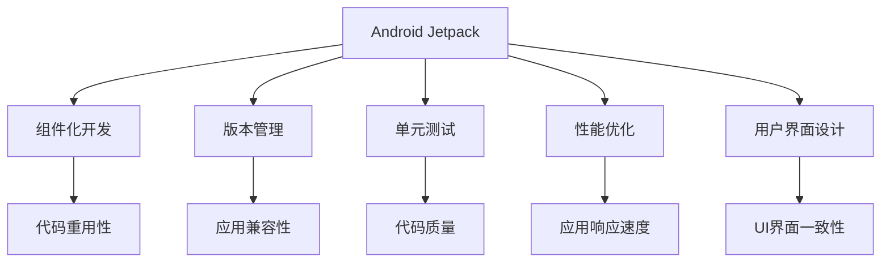

                 

# Android Jetpack：谷歌的 Android 开发套件

> 关键词：Android Jetpack, 谷歌, 移动应用, 开发工具, 组件化开发, 组件复用, 版本管理, 单元测试, 应用性能优化, 用户界面设计

## 1. 背景介绍

在Android生态系统中，Android Jetpack是谷歌官方推出的一整套工具、库和框架，旨在帮助开发者更轻松、更高效地构建高质量的Android应用。Jetpack套件由一系列互补的组件和工具组成，旨在提升开发效率、改善用户体验，并通过可持续的开发实践支持长期维护。本文将详细探讨Android Jetpack的核心概念、工作原理、具体应用以及未来发展趋势。

## 2. 核心概念与联系

### 2.1 核心概念概述

- **Android Jetpack**：谷歌推出的Android应用开发工具集，旨在提高开发效率、改善用户体验，并通过可持续的开发实践支持长期维护。
- **组件化开发**：通过将应用拆分成独立的模块或组件，提高代码重用性和应用的可维护性。
- **版本管理**：通过引入版本管理工具如Versioning API，确保应用兼容性和稳定性。
- **单元测试**：通过单元测试（Unit Testing）确保代码质量和功能正确性。
- **性能优化**：通过性能分析工具和优化技术提高应用响应速度和资源利用效率。
- **用户界面设计**：提供设计工具和组件，帮助开发者实现优雅、一致的UI界面。

### 2.2 核心概念原理和架构的 Mermaid 流程图



## 3. 核心算法原理 & 具体操作步骤

### 3.1 算法原理概述

Android Jetpack的核心思想是组件化开发，通过将应用拆分成多个独立的组件模块，使应用更加模块化、易于维护，同时也便于复用和扩展。其工作原理可以概括为以下几个步骤：

1. **组件模块划分**：将应用划分为多个独立的组件模块，如UI模块、数据模块、业务逻辑模块等。
2. **依赖管理**：通过依赖注入（Dependency Injection）等技术，管理模块之间的依赖关系。
3. **版本管理**：使用版本管理工具，确保不同模块之间的兼容性。
4. **单元测试**：通过单元测试和集成测试，保证代码质量和功能正确性。
5. **性能优化**：利用性能分析工具和优化技术，提高应用性能和稳定性。

### 3.2 算法步骤详解

#### 3.2.1 组件模块划分

应用组件模块划分的目的是将应用拆分为多个独立且可重用的模块。这种模块化开发的方式可以减少代码冗余，提高开发效率，同时也有助于维护和扩展。例如，一个简单的电商应用可以拆分为UI模块、数据模块、业务逻辑模块、用户认证模块等。

#### 3.2.2 依赖管理

依赖管理是组件化开发的重要一环。通过依赖注入（Dependency Injection）等技术，可以清晰地定义模块之间的依赖关系，避免硬编码和逻辑耦合，使模块更加独立和灵活。例如，数据模块可以通过依赖注入的方式，将数据源注入到其他模块中，避免在模块内部重复实现数据获取逻辑。

#### 3.2.3 版本管理

版本管理是确保应用兼容性的一个重要手段。通过版本管理工具，可以跟踪不同模块之间的依赖关系和版本号，确保应用在升级过程中不会破坏现有功能。例如，Android Jetpack提供了Versioning API，可以帮助开发者管理应用的不同版本和组件模块的兼容性。

#### 3.2.4 单元测试

单元测试是保证代码质量和功能正确性的重要手段。通过编写单元测试，可以在开发过程中及时发现代码中的问题，避免问题扩散到后续开发和生产环境中。例如，UI模块的单元测试可以验证按钮点击事件的处理逻辑是否正确，数据模块的单元测试可以验证数据存储和读取是否正常。

#### 3.2.5 性能优化

性能优化是提升应用用户体验的关键。通过性能分析工具和优化技术，可以发现应用中的性能瓶颈，并进行针对性的优化。例如，UI界面的性能优化可以包括减少布局嵌套、使用异步加载等技术，数据模块的性能优化可以包括减少网络请求次数、使用缓存等技术。

### 3.3 算法优缺点

#### 3.3.1 优点

- **代码复用性高**：通过组件化开发，不同模块之间的代码可以被重复使用，减少了开发时间和成本。
- **开发效率高**：组件化开发方式减少了代码耦合，提高了开发效率和代码可维护性。
- **版本管理方便**：通过版本管理工具，可以方便地管理不同模块之间的依赖关系和版本号，确保应用兼容性。
- **性能优化效果显著**：通过性能分析工具和优化技术，可以显著提升应用响应速度和资源利用效率。

#### 3.3.2 缺点

- **学习曲线较陡**：组件化开发需要开发者掌握一定的架构设计和依赖管理知识，学习曲线较陡。
- **开发成本较高**：组件化开发初期的设计工作可能较为耗时，开发成本较高。
- **版本管理复杂**：不同模块之间的版本管理可能较为复杂，需要仔细跟踪和管理。

### 3.4 算法应用领域

Android Jetpack适用于各种类型的Android应用开发，包括但不限于电商应用、社交应用、游戏应用、教育应用、医疗应用等。其组件化开发、版本管理、单元测试、性能优化和用户界面设计等功能，可以在各种应用场景中发挥重要作用。

## 4. 数学模型和公式 & 详细讲解

### 4.1 数学模型构建

Android Jetpack的核心算法可以概括为以下几个数学模型：

- **依赖注入模型**：用于描述模块之间的依赖关系。
- **版本管理模型**：用于管理不同模块之间的版本关系。
- **性能优化模型**：用于描述应用性能的优化策略。
- **用户界面设计模型**：用于描述UI界面的布局和设计。

### 4.2 公式推导过程

#### 4.2.1 依赖注入模型

依赖注入模型可以表示为：

$$
M = f(D, I)
$$

其中，$M$表示模块，$D$表示依赖关系，$I$表示注入的依赖项。依赖注入模型的推导过程可以概括为：

1. 定义模块$M$的依赖关系$D$。
2. 定义模块$M$的注入依赖项$I$。
3. 计算模块$M$的实现$f(D, I)$。

#### 4.2.2 版本管理模型

版本管理模型可以表示为：

$$
V = g(A, M, P)
$$

其中，$V$表示版本信息，$A$表示应用，$M$表示模块，$P$表示版本计划。版本管理模型的推导过程可以概括为：

1. 定义应用$A$的版本计划$P$。
2. 定义模块$M$的版本信息$V$。
3. 计算应用$A$的版本信息$g(A, M, P)$。

#### 4.2.3 性能优化模型

性能优化模型可以表示为：

$$
P = h(M, U, O)
$$

其中，$P$表示性能指标，$M$表示模块，$U$表示单元测试结果，$O$表示优化策略。性能优化模型的推导过程可以概括为：

1. 定义模块$M$的性能指标$P$。
2. 定义模块$M$的单元测试结果$U$。
3. 定义模块$M$的优化策略$O$。
4. 计算模块$M$的性能指标$h(M, U, O)$。

#### 4.2.4 用户界面设计模型

用户界面设计模型可以表示为：

$$
UI = k(W, L, S)
$$

其中，$UI$表示用户界面，$W$表示布局，$L$表示样式，$S$表示交互事件。用户界面设计模型的推导过程可以概括为：

1. 定义用户界面的布局$W$。
2. 定义用户界面的样式$L$。
3. 定义用户界面的交互事件$S$。
4. 计算用户界面$UI$。

### 4.3 案例分析与讲解

假设我们要开发一个电商应用，可以按照以下步骤进行组件化开发和版本管理：

1. 将应用划分为UI模块、数据模块、业务逻辑模块、用户认证模块等。
2. 在UI模块中定义布局、样式和交互事件。
3. 在数据模块中定义数据源和数据操作逻辑。
4. 在业务逻辑模块中定义业务逻辑和数据处理逻辑。
5. 在用户认证模块中定义用户认证逻辑。
6. 使用依赖注入技术将数据模块和业务逻辑模块注入到UI模块和用户认证模块中。
7. 使用版本管理工具管理不同模块之间的依赖关系和版本号。
8. 使用单元测试工具测试各个模块的功能和性能。
9. 使用性能优化工具分析应用性能瓶颈，并进行优化。

## 5. 项目实践：代码实例和详细解释说明

### 5.1 开发环境搭建

要使用Android Jetpack进行项目开发，首先需要搭建一个Android开发环境。具体步骤如下：

1. 安装Android Studio：从Android官网下载并安装Android Studio。
2. 安装Android SDK：打开Android Studio，进入SDK Manager，下载并安装Android SDK和工具链。
3. 安装Emulator或连接物理设备：在Android Studio中安装Android Emulator或连接物理Android设备。
4. 创建新项目或导入现有项目：在Android Studio中创建新的Android项目，或导入现有Android项目。

### 5.2 源代码详细实现

以下是一个使用Android Jetpack进行电商应用开发的示例代码：

#### 5.2.1 UI模块

```java
public class MainActivity extends AppCompatActivity {
    private EditText productNameEditText;
    private EditText priceEditText;
    private Button addButton;

    @Override
    protected void onCreate(Bundle savedInstanceState) {
        super.onCreate(savedInstanceState);
        setContentView(R.layout.activity_main);

        productNameEditText = findViewById(R.id.product_name_edit_text);
        priceEditText = findViewById(R.id.price_edit_text);
        addButton = findViewById(R.id.add_button);

        addButton.setOnClickListener(new View.OnClickListener() {
            @Override
            public void onClick(View v) {
                String productName = productNameEditText.getText().toString();
                double price = Double.parseDouble(priceEditText.getText().toString());

                // 调用数据模块的接口，将产品信息保存到服务器
                Product product = new Product(productName, price);
                DataModule.getService().saveProduct(product);
            }
        });
    }
}
```

#### 5.2.2 数据模块

```java
public class DataModule {
    private static final String BASE_URL = "https://example.com/api";

    public interface Service {
        @POST("product")
        void saveProduct(Product product);
    }

    public static Service getService() {
        Retrofit retrofit = new Retrofit.Builder()
                .baseUrl(BASE_URL)
                .addConverterFactory(GsonConverterFactory.create())
                .build();
        return retrofit.create(Service.class);
    }
}
```

#### 5.2.3 业务逻辑模块

```java
public class Product {
    private String name;
    private double price;

    public Product(String name, double price) {
        this.name = name;
        this.price = price;
    }

    public String getName() {
        return name;
    }

    public double getPrice() {
        return price;
    }
}
```

### 5.3 代码解读与分析

在上述代码中，MainActivity是UI模块，负责用户交互和界面展示；DataModule是数据模块，负责与服务器交互和数据存储；Product是业务逻辑模块，负责数据模型定义。通过依赖注入技术，DataModule中的Service接口被注入到MainActivity中，使得UI模块可以直接调用DataModule的Service接口进行数据操作。

## 6. 实际应用场景

### 6.1 电商应用

Android Jetpack在电商应用中有着广泛的应用。例如，可以通过依赖注入技术将UI模块和数据模块解耦，使得UI模块可以独立更新和维护，数据模块可以独立测试和优化。同时，通过版本管理工具，可以确保不同模块之间的兼容性，避免升级过程中出现兼容性问题。

### 6.2 社交应用

在社交应用中，Android Jetpack可以用于实现用户登录、消息推送、好友列表等功能。通过依赖注入技术，可以将UI模块和业务逻辑模块解耦，使得UI模块可以独立更新和维护，业务逻辑模块可以独立测试和优化。同时，通过版本管理工具，可以确保不同模块之间的兼容性，避免升级过程中出现兼容性问题。

### 6.3 游戏应用

在游戏应用中，Android Jetpack可以用于实现游戏界面、用户操作、游戏逻辑等功能。通过依赖注入技术，可以将UI模块和业务逻辑模块解耦，使得UI模块可以独立更新和维护，业务逻辑模块可以独立测试和优化。同时，通过版本管理工具，可以确保不同模块之间的兼容性，避免升级过程中出现兼容性问题。

### 6.4 教育应用

在教育应用中，Android Jetpack可以用于实现在线课程、学习进度、用户管理等功能。通过依赖注入技术，可以将UI模块和业务逻辑模块解耦，使得UI模块可以独立更新和维护，业务逻辑模块可以独立测试和优化。同时，通过版本管理工具，可以确保不同模块之间的兼容性，避免升级过程中出现兼容性问题。

## 7. 工具和资源推荐

### 7.1 学习资源推荐

为了帮助开发者掌握Android Jetpack的使用，推荐以下学习资源：

1. Android Jetpack官方文档：Android Jetpack的官方文档，详细介绍了Jetpack各组件的使用方法、最佳实践和示例代码。
2. Udacity Android Jetpack课程：Udacity提供的Android Jetpack课程，涵盖Jetpack各组件的使用方法和最佳实践。
3. Google Android Jetpack示例应用：Google提供的Android Jetpack示例应用，包含Jetpack各组件的使用示例和最佳实践。
4. Android Jetpack源码解析：GitHub上的Android Jetpack源码解析文章，深入分析Jetpack各组件的实现原理和设计思路。

### 7.2 开发工具推荐

Android Jetpack的开发需要以下工具支持：

1. Android Studio：Android官方提供的IDE，支持Android开发和测试。
2. Retrofit：谷歌提供的HTTP客户端库，用于简化网络请求和数据处理。
3. GSON：谷歌提供的JSON解析库，用于将JSON数据转换为Java对象。
4. Glide：谷歌提供的图像加载库，用于简化图像加载和缓存管理。

### 7.3 相关论文推荐

Android Jetpack的演进和发展源于学界的持续研究。以下是几篇重要的相关论文，推荐阅读：

1. "Android Jetpack: A toolkit for building mobile applications"：谷歌官方博客文章，介绍了Android Jetpack的开发理念和组件化设计。
2. "Android Jetpack: A toolkit for building robust mobile applications"：谷歌官方博客文章，介绍了Android Jetpack的组件和工具在实际应用中的效果。
3. "Android Jetpack: A toolkit for building scalable mobile applications"：谷歌官方博客文章，介绍了Android Jetpack在大型应用中的使用和优化技巧。

## 8. 总结：未来发展趋势与挑战

### 8.1 总结

Android Jetpack是谷歌推出的Android应用开发套件，旨在提高开发效率、改善用户体验，并通过可持续的开发实践支持长期维护。本文详细介绍了Android Jetpack的核心概念、工作原理、具体应用以及未来发展趋势。通过深入学习和实践Android Jetpack，开发者可以显著提升应用开发效率和应用质量。

### 8.2 未来发展趋势

未来，Android Jetpack将会在以下几个方面继续发展：

1. 组件化开发进一步完善：随着Android Jetpack的广泛应用，组件化开发的方式将被更多开发者接受和使用，组件化开发的实践经验和最佳实践将不断丰富和完善。
2. 版本管理工具持续优化：版本管理工具将继续优化，支持更多新的功能，如多版本管理、自动合并、冲突检测等，帮助开发者更方便地管理应用的不同版本和组件模块。
3. 性能优化工具不断迭代：性能优化工具将继续迭代，引入更多新的优化技术和最佳实践，帮助开发者更快速地发现和解决应用中的性能问题。
4. 用户界面设计工具更加强大：用户界面设计工具将继续优化，引入更多新的设计模式和组件，帮助开发者更快速地构建优雅、一致的用户界面。

### 8.3 面临的挑战

尽管Android Jetpack已经取得了显著的进展，但在实际应用中仍面临一些挑战：

1. 学习曲线较陡：组件化开发和版本管理需要开发者掌握一定的架构设计和依赖管理知识，学习曲线较陡。
2. 开发成本较高：组件化开发初期的设计工作可能较为耗时，开发成本较高。
3. 版本管理复杂：不同模块之间的版本管理可能较为复杂，需要仔细跟踪和管理。

### 8.4 研究展望

为了应对上述挑战，未来的研究需要在以下几个方面寻求新的突破：

1. 提供更多的开发工具和示例：开发更多的开发工具和示例，帮助开发者更好地理解和使用Android Jetpack。
2. 简化依赖注入和版本管理：简化依赖注入和版本管理的流程，降低开发者的学习成本。
3. 引入更多的性能优化技术：引入更多的性能优化技术和最佳实践，帮助开发者更快速地发现和解决应用中的性能问题。
4. 丰富用户界面设计工具：丰富用户界面设计工具，引入更多新的设计模式和组件，帮助开发者更快速地构建优雅、一致的用户界面。

总之，Android Jetpack作为Android开发的重要工具集，将继续在Android应用开发中发挥重要作用。随着组件化开发、版本管理、性能优化、用户界面设计等方面的不断完善和优化，Android Jetpack将为开发者提供更高效、更灵活、更易维护的开发环境。

## 9. 附录：常见问题与解答

### Q1: 什么是Android Jetpack？

A: Android Jetpack是谷歌推出的Android应用开发工具集，旨在提高开发效率、改善用户体验，并通过可持续的开发实践支持长期维护。

### Q2: Android Jetpack的核心思想是什么？

A: Android Jetpack的核心思想是组件化开发，通过将应用拆分成独立的模块或组件，提高代码重用性和应用的可维护性。

### Q3: Android Jetpack的优势是什么？

A: Android Jetpack的优势在于其组件化开发、版本管理、单元测试、性能优化和用户界面设计等功能，可以在各种应用场景中发挥重要作用。

### Q4: 如何使用Android Jetpack进行电商应用开发？

A: 使用Android Jetpack进行电商应用开发，可以按照以下步骤进行组件化开发和版本管理：

1. 将应用划分为UI模块、数据模块、业务逻辑模块、用户认证模块等。
2. 在UI模块中定义布局、样式和交互事件。
3. 在数据模块中定义数据源和数据操作逻辑。
4. 在业务逻辑模块中定义业务逻辑和数据处理逻辑。
5. 在用户认证模块中定义用户认证逻辑。
6. 使用依赖注入技术将数据模块和业务逻辑模块注入到UI模块和用户认证模块中。
7. 使用版本管理工具管理不同模块之间的依赖关系和版本号。
8. 使用单元测试工具测试各个模块的功能和性能。
9. 使用性能优化工具分析应用性能瓶颈，并进行优化。

### Q5: 使用Android Jetpack进行电商应用开发有哪些注意事项？

A: 使用Android Jetpack进行电商应用开发时，需要注意以下几点：

1. 组件模块划分要合理，避免模块过大或过小，影响开发效率和可维护性。
2. 依赖注入技术要使用得当，避免注入过多的依赖，导致代码复杂度增加。
3. 版本管理要严格，确保不同模块之间的兼容性，避免升级过程中出现兼容性问题。
4. 单元测试要全面，覆盖各个模块的功能和性能，确保代码质量和功能正确性。
5. 性能优化要细致，使用合适的优化技术和工具，提升应用响应速度和资源利用效率。

---

作者：禅与计算机程序设计艺术 / Zen and the Art of Computer Programming

