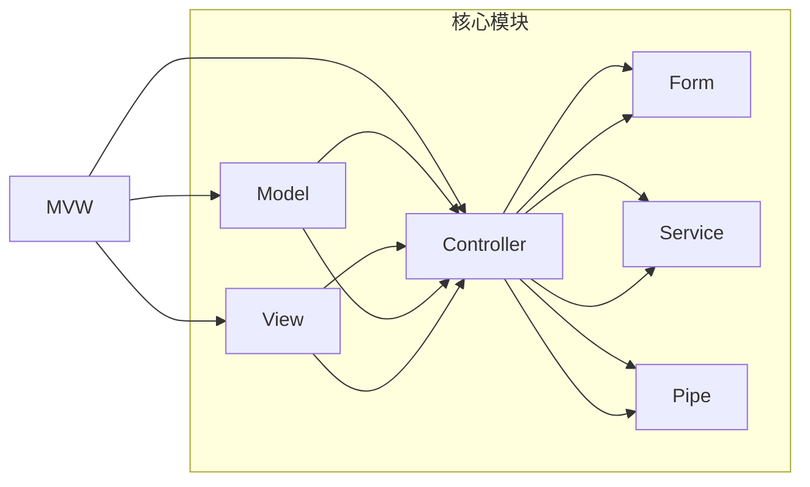

                 

# Angular 入门：Google 的 MVW 框架

> 关键词：Angular, MVW, TypeScript, RxJS, 单向数据流, 组件驱动开发

## 1. 背景介绍

在过去的十年中，JavaScript 和 Web 开发领域发生了翻天覆地的变化。从 2009 年 Angular 的诞生，到如今成熟的框架生态，Angular 成为了构建大型 Web 应用程序的重要工具。

Angular 是 Google 开发的一款 JavaScript 框架，支持单页面应用程序 (SPA) 的开发。它结合了模型-视图-控制器 (MVC) 架构的思想，但通过对视图和模型进行解耦，使得组件驱动开发成为可能。

本文将带你详细了解 Angular 的架构和核心概念，从入门到实践，让你全面掌握 Angular。

## 2. 核心概念与联系

### 2.1 核心概念概述

Angular 的核心概念主要有以下几个：

- **TypeScript**：Angular 使用 TypeScript 作为编译目标语言，TypeScript 是 JavaScript 的超集，提供了强类型和静态检查等功能，提升了代码的可维护性和安全性。
- **MVW 架构**：Angular 将 MVC 架构进行拓展，使用 Model-View-Whole (MVW) 架构，将视图和控制器分离，只负责渲染和响应逻辑，控制逻辑集中在组件层，提高了开发效率和代码可重用性。
- **单向数据流**：Angular 强调单向数据流，即数据只从模型流向视图，视图不能直接修改模型，以确保数据一致性和应用的安全性。
- **组件驱动开发**：Angular 的核心思想是组件驱动开发，即通过构建可复用的组件，将应用拆分成独立的部分，每个组件负责自己的逻辑和数据管理。
- **依赖注入**：Angular 使用依赖注入 (Dependency Injection, DI) 来管理组件之间的依赖关系，提高了代码的灵活性和可测试性。

这些核心概念构成了 Angular 的基石，掌握了它们，便能更深入地理解 Angular 的架构和开发模式。

### 2.2 核心概念原理和架构的 Mermaid 流程图



上图展示了 Angular 的 MVW 架构和核心模块。

- **Model**：模型层，包含应用的数据模型，负责数据存储和获取。
- **View**：视图层，负责数据的渲染和展示，由模板和组件构成。
- **Controller**：控制器层，负责视图和模型的交互，是组件的核心。
- **Form**：表单层，用于处理表单输入和验证。
- **Service**：服务层，封装了应用中的公共逻辑，如网络请求、数据处理等。
- **Pipe**：管道层，用于处理数据格式的转换和操作，如格式化、过滤等。

这些模块通过依赖注入方式进行管理，确保了应用的可维护性和可扩展性。

## 3. 核心算法原理 & 具体操作步骤

### 3.1 算法原理概述

Angular 的核心算法原理主要是基于 MVW 架构和单向数据流的思想，通过依赖注入和组件驱动的开发模式，实现高效的代码管理和应用构建。

- **单向数据流**：数据的流动遵循单向原则，从 Model 到 Controller，再到 View，确保了数据的一致性和应用的稳定性。
- **依赖注入**：通过依赖注入，Angular 管理了组件之间的依赖关系，确保了组件的独立性和可测试性。
- **组件驱动开发**：组件驱动开发将应用拆分为独立的部分，每个组件负责自己的逻辑和数据管理，提高了代码的可重用性和可维护性。

### 3.2 算法步骤详解

**Step 1: 项目初始化**

使用 Angular CLI 初始化项目，安装依赖，并配置构建工具。

```bash
ng new my-app
cd my-app
npm install
ng serve
```

**Step 2: 创建组件**

使用 Angular CLI 创建组件，定义组件的类和模板。

```bash
ng generate component my-component
```

**Step 3: 定义控制器**

定义组件的控制器，负责数据的处理和逻辑管理。

```typescript
import { Component } from '@angular/core';

@Component({
  selector: 'app-my-component',
  template: `
    <h1>{{ title }}</h1>
    <p>{{ message }}</p>
  `,
  templateUrl: './my-component.component.html',
  styleUrls: ['./my-component.component.css']
})
export class MyComponent {
  title: string = 'My Component';
  message: string = 'Hello, Angular!';
}
```

**Step 4: 数据绑定**

在模板中，使用双括号 ({{}}) 进行数据绑定，将控制器中的数据展示到视图中。

```html
<h1>{{ title }}</h1>
<p>{{ message }}</p>
```

**Step 5: 依赖注入**

通过依赖注入，将服务、管道等组件依赖注入到控制器中，实现组件间的通信。

```typescript
import { Component } from '@angular/core';
import { MyService } from './my.service';

@Component({
  selector: 'app-my-component',
  template: `
    <h1>{{ title }}</h1>
    <p>{{ message }}</p>
  `,
  templateUrl: './my-component.component.html',
  styleUrls: ['./my-component.component.css'],
  providers: [MyService]
})
export class MyComponent {
  constructor(private myService: MyService) {}

  title: string = 'My Component';
  message: string = this.myService.getMessage();
}
```

**Step 6: 组件导出**

将组件导出，使其在其他模块中使用。

```typescript
import { NgModule } from '@angular/core';
import { MyComponent } from './my-component.component';

@NgModule({
  declarations: [MyComponent]
})
export class MyModule {}
```

### 3.3 算法优缺点

Angular 的优势在于其强大的功能和良好的可维护性，但也存在一些缺点：

**优点：**

- **强大的功能**：Angular 提供了丰富的功能和工具，如表单验证、路由管理、HTTP 请求等，可以满足大多数 Web 应用程序的需求。
- **良好的可维护性**：通过组件驱动开发和依赖注入，Angular 使得代码的组织和维护更加清晰和方便。
- **活跃的社区**：Angular 社区活跃，文档和工具齐全，可以快速解决问题。

**缺点：**

- **学习曲线陡峭**：Angular 的概念和语法较为复杂，初学者需要一定的学习成本。
- **性能问题**：Angular 的性能在大型项目中可能会有所下降，需要优化才能达到最佳效果。
- **体积较大**：Angular 的代码库体积较大，增加了前端项目的加载时间和网络带宽消耗。

### 3.4 算法应用领域

Angular 广泛应用于构建大型 Web 应用程序，尤其是单页面应用程序 (SPA)。以下是 Angular 的应用场景：

- **企业级应用**：企业内部管理系统、CRM 系统、OA 系统等。
- **电商网站**：电商平台、购物网站、在线支付系统等。
- **博客和内容管理系统**：博客平台、论坛、内容发布系统等。
- **移动应用**：通过 Angular Universal 可以构建服务器端渲染的移动应用。
- **物联网 (IoT)**：通过 Angular 开发物联网设备和应用。

## 4. 数学模型和公式 & 详细讲解

### 4.1 数学模型构建

Angular 的数学模型主要基于 MVW 架构和单向数据流，下面通过一个简单的示例来讲解其基本模型：

**示例：计数器组件**

- **Model**：模型层，包含计数器的数据状态。

```typescript
import { Component } from '@angular/core';

@Component({
  selector: 'app-counter',
  template: `
    <h1>Count: {{ count }}</h1>
    <button (click)="increment()">Increment</button>
    <button (click)="decrement()">Decrement</button>
  `,
  templateUrl: './counter.component.html',
  styleUrls: ['./counter.component.css']
})
export class Counter {
  count: number = 0;

  increment() {
    this.count++;
  }

  decrement() {
    this.count--;
  }
}
```

- **View**：视图层，负责展示计数器的数据状态。

```html
<h1>Count: {{ count }}</h1>
<button (click)="increment()">Increment</button>
<button (click)="decrement()">Decrement</button>
```

- **Controller**：控制器层，负责数据的处理和逻辑管理。

```typescript
import { Component } from '@angular/core';

@Component({
  selector: 'app-counter',
  template: `
    <h1>Count: {{ count }}</h1>
    <button (click)="increment()">Increment</button>
    <button (click)="decrement()">Decrement</button>
  `,
  templateUrl: './counter.component.html',
  styleUrls: ['./counter.component.css']
})
export class Counter {
  count: number = 0;

  increment() {
    this.count++;
  }

  decrement() {
    this.count--;
  }
}
```

### 4.2 公式推导过程

Angular 的公式推导主要围绕 MVW 架构和单向数据流进行，下面以计数器组件为例进行推导：

- **单向数据流**：数据从 Model 层到 View 层单向流动。当 Model 层的 count 变量发生改变时，View 层的 count 变量也会自动更新。

```typescript
import { Component } from '@angular/core';

@Component({
  selector: 'app-counter',
  template: `
    <h1>Count: {{ count }}</h1>
    <button (click)="increment()">Increment</button>
    <button (click)="decrement()">Decrement</button>
  `,
  templateUrl: './counter.component.html',
  styleUrls: ['./counter.component.css']
})
export class Counter {
  count: number = 0;

  increment() {
    this.count++;
  }

  decrement() {
    this.count--;
  }
}
```

- **依赖注入**：控制器层通过依赖注入，将模型层和视图层的依赖关系管理起来。

```typescript
import { Component } from '@angular/core';

@Component({
  selector: 'app-counter',
  template: `
    <h1>Count: {{ count }}</h1>
    <button (click)="increment()">Increment</button>
    <button (click)="decrement()">Decrement</button>
  `,
  templateUrl: './counter.component.html',
  styleUrls: ['./counter.component.css']
})
export class Counter {
  constructor(private countService: CountService) {}

  count: number = this.countService.getCount();

  increment() {
    this.countService.incrementCount();
  }

  decrement() {
    this.countService.decrementCount();
  }
}
```

### 4.3 案例分析与讲解

**案例：登录组件**

- **Model**：模型层，包含用户的登录状态。

```typescript
import { Component } from '@angular/core';

@Component({
  selector: 'app-login',
  template: `
    <h1>Login</h1>
    <form>
      <label for="username">Username:</label>
      <input type="text" id="username" [(ngModel)]="user.username">
      <br>
      <label for="password">Password:</label>
      <input type="password" id="password" [(ngModel)]="user.password">
      <br>
      <button (click)="login()">Login</button>
    </form>
  `,
  templateUrl: './login.component.html',
  styleUrls: ['./login.component.css']
})
export class Login {
  user: any = { username: '', password: '' };

  login() {
    // 模拟登录
    this.user.username = 'testuser';
    this.user.password = 'testpass';
  }
}
```

- **View**：视图层，负责展示登录表单和错误提示。

```html
<h1>Login</h1>
<form>
  <label for="username">Username:</label>
  <input type="text" id="username" [(ngModel)]="user.username">
  <br>
  <label for="password">Password:</label>
  <input type="password" id="password" [(ngModel)]="user.password">
  <br>
  <button (click)="login()">Login</button>
</form>
```

- **Controller**：控制器层，负责处理用户的登录请求和状态管理。

```typescript
import { Component } from '@angular/core';

@Component({
  selector: 'app-login',
  template: `
    <h1>Login</h1>
    <form>
      <label for="username">Username:</label>
      <input type="text" id="username" [(ngModel)]="user.username">
      <br>
      <label for="password">Password:</label>
      <input type="password" id="password" [(ngModel)]="user.password">
      <br>
      <button (click)="login()">Login</button>
    </form>
  `,
  templateUrl: './login.component.html',
  styleUrls: ['./login.component.css']
})
export class Login {
  user: any = { username: '', password: '' };

  login() {
    // 模拟登录
    this.user.username = 'testuser';
    this.user.password = 'testpass';
  }
}
```

通过这个案例，可以看出 Angular 的 MVW 架构和单向数据流的设计理念。

## 5. 项目实践：代码实例和详细解释说明

### 5.1 开发环境搭建

1. **安装 Node.js 和 npm**

   ```bash
   sudo apt-get install nodejs
   sudo apt-get install npm
   ```

2. **安装 Angular CLI**

   ```bash
   npm install -g @angular/cli
   ```

3. **初始化 Angular 项目**

   ```bash
   ng new my-app
   cd my-app
   npm install
   ng serve
   ```

### 5.2 源代码详细实现

**示例：计数器组件**

- **Model**

  ```typescript
  import { Component } from '@angular/core';

  @Component({
    selector: 'app-counter',
    template: `
      <h1>Count: {{ count }}</h1>
      <button (click)="increment()">Increment</button>
      <button (click)="decrement()">Decrement</button>
    `,
    templateUrl: './counter.component.html',
    styleUrls: ['./counter.component.css']
  })
  export class Counter {
    count: number = 0;

    increment() {
      this.count++;
    }

    decrement() {
      this.count--;
    }
  }
  ```

- **View**

  ```html
  <h1>Count: {{ count }}</h1>
  <button (click)="increment()">Increment</button>
  <button (click)="decrement()">Decrement</button>
  ```

- **Controller**

  ```typescript
  import { Component } from '@angular/core';

  @Component({
    selector: 'app-counter',
    template: `
      <h1>Count: {{ count }}</h1>
      <button (click)="increment()">Increment</button>
      <button (click)="decrement()">Decrement</button>
    `,
    templateUrl: './counter.component.html',
    styleUrls: ['./counter.component.css']
  })
  export class Counter {
    count: number = 0;

    increment() {
      this.count++;
    }

    decrement() {
      this.count--;
    }
  }
  ```

### 5.3 代码解读与分析

- **数据绑定**

  使用双括号 ({{}}) 进行数据绑定，将控制器中的数据展示到视图中。

  ```html
  <h1>Count: {{ count }}</h1>
  <button (click)="increment()">Increment</button>
  <button (click)="decrement()">Decrement</button>
  ```

- **控制器**

  控制器层负责数据的处理和逻辑管理。在控制器中定义计数器的数据状态和操作函数，并在模板中使用 ngModel 进行数据绑定。

  ```typescript
  import { Component } from '@angular/core';

  @Component({
    selector: 'app-counter',
    template: `
      <h1>Count: {{ count }}</h1>
      <button (click)="increment()">Increment</button>
      <button (click)="decrement()">Decrement</button>
    `,
    templateUrl: './counter.component.html',
    styleUrls: ['./counter.component.css']
  })
  export class Counter {
    count: number = 0;

    increment() {
      this.count++;
    }

    decrement() {
      this.count--;
    }
  }
  ```

### 5.4 运行结果展示

运行项目，在浏览器中查看计数器组件。


## 6. 实际应用场景

Angular 在实际应用中广泛使用，以下是几个典型的应用场景：

### 6.1 企业级应用

企业内部管理系统、CRM 系统、OA 系统等。

### 6.2 电商网站

电商平台、购物网站、在线支付系统等。

### 6.3 博客和内容管理系统

博客平台、论坛、内容发布系统等。

### 6.4 移动应用

通过 Angular Universal 可以构建服务器端渲染的移动应用。

## 7. 工具和资源推荐

### 7.1 学习资源推荐

- **Angular 官方文档**：[https://angular.io/](https://angular.io/)
- **Angular 官方指南**：[https://angular.io/guide/](https://angular.io/guide/)
- **Angular 实战教程**：[https://www.udemy.com/course/angular-101/](https://www.udemy.com/course/angular-101/)
- **Angular 源码分析**：[https://github.com/angular/angular](https://github.com/angular/angular)

### 7.2 开发工具推荐

- **Visual Studio Code**：[https://code.visualstudio.com/](https://code.visualstudio.com/)
- **IntelliJ IDEA**：[https://www.jetbrains.com/idea/](https://www.jetbrains.com/idea/)
- **WebStorm**：[https://www.jetbrains.com/webstorm/](https://www.jetbrains.com/webstorm/)

### 7.3 相关论文推荐

- **Angular 架构设计**：[https://www.angularchitecture.com/](https://www.angularchitecture.com/)
- **Angular 性能优化**：[https://www.substrate-dotnet.com/blog/optimization](https://www.substrate-dotnet.com/blog/optimization)
- **Angular 路由管理**：[https://www.pluralsight.com/courses/ angular-router](https://www.pluralsight.com/courses/ angular-router)

## 8. 总结：未来发展趋势与挑战

### 8.1 研究成果总结

Angular 是一个强大的 Web 开发框架，通过 MVW 架构和单向数据流的设计理念，实现了高效、可维护的代码管理。它的组件驱动开发和依赖注入，使得开发过程更加灵活和便捷。

### 8.2 未来发展趋势

- **更多的功能和工具**：Angular 社区会不断推出新的功能和工具，提高开发效率和应用性能。
- **更好的性能优化**：通过各种性能优化技巧，Angular 的应用性能将不断提升。
- **更强的生态支持**：Angular 的生态系统将更加完善，开发者可以更方便地使用各种第三方库和组件。

### 8.3 面临的挑战

- **学习曲线陡峭**：Angular 的概念和语法较为复杂，初学者需要一定的学习成本。
- **性能问题**：Angular 的性能在大型项目中可能会有所下降，需要优化才能达到最佳效果。
- **体积较大**：Angular 的代码库体积较大，增加了前端项目的加载时间和网络带宽消耗。

### 8.4 研究展望

未来的 Angular 将更加灵活和高效，开发者可以更加便捷地进行开发和管理。通过不断优化性能和改进生态，Angular 将为 Web 开发带来更多可能。

## 9. 附录：常见问题与解答

**Q1：Angular 的学习曲线陡峭吗？**

A: Angular 的学习曲线相对较陡峭，需要一定的 JavaScript 和 TypeScript 基础。但是，一旦掌握基础，开发效率会大大提升。

**Q2：Angular 的性能如何？**

A: Angular 的性能在大型项目中可能会有所下降，但是通过各种性能优化技巧，可以显著提升应用性能。

**Q3：Angular 的体积大吗？**

A: Angular 的代码库体积较大，增加了前端项目的加载时间和网络带宽消耗，但是通过懒加载和模块化开发，可以减小项目体积。

**Q4：Angular 的生态系统如何？**

A: Angular 的生态系统正在不断完善，社区活跃，文档齐全，开发者可以方便地使用各种第三方库和组件。

---

作者：禅与计算机程序设计艺术 / Zen and the Art of Computer Programming

