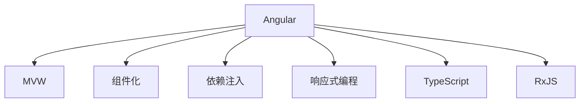

                 

# Angular 框架：Google 的 MVW 框架

> 关键词：Angular, MVW, 前端开发, 组件化, 依赖注入, TypeScript, 响应式编程

## 1. 背景介绍

### 1.1 问题由来

随着 Web 开发技术的不断演进，前端开发领域也面临着越来越多的挑战。传统的基于 DOM 的操作模式，已经越来越难以满足复杂应用场景的需求。同时，随着单页面应用（SPA）的普及，如何构建可维护、可扩展的 Web 应用，成为了前端开发者们亟需解决的问题。

Google 的 Angular 框架，就是在这样的背景下应运而生的。它是一种现代化的前端框架，采用组件化、依赖注入、响应式编程等先进理念，大大提升了 Web 应用的开发效率和维护性。

### 1.2 问题核心关键点

Angular 框架的核心关键点包括：

- 组件化：将复杂的 Web 应用拆分成多个独立的组件，每个组件独立开发、独立维护，从而大大提升了代码的可复用性和可扩展性。
- 依赖注入：通过依赖注入，实现组件之间的松耦合，降低了组件之间的依赖关系，提升了应用的可测试性和可维护性。
- 响应式编程：通过 RxJS 等响应式库，实现了数据流与 UI 界面的实时同步，提升了应用的响应速度和用户体验。
- TypeScript 支持：Angular 框架原生支持 TypeScript，提供了强类型系统和静态类型检查，避免了常见的编程错误，提升了代码的可读性和可维护性。

这些关键点共同构成了 Angular 框架的核心理念，使其在现代前端开发中占据了重要的地位。

## 2. 核心概念与联系

### 2.1 核心概念概述

为更好地理解 Angular 框架，本节将介绍几个密切相关的核心概念：

- Angular：Google 推出的现代化的前端框架，采用了组件化、依赖注入、响应式编程等先进理念。
- MVW（Model-View-ViewModel）：一种常用的前端框架设计模式，适用于大型 Web 应用的开发。
- 组件化：将复杂的 Web 应用拆分成多个独立的组件，每个组件独立开发、独立维护。
- 依赖注入：通过依赖注入，实现组件之间的松耦合，降低了组件之间的依赖关系。
- TypeScript：一种由微软开发的超集于 JavaScript 的编程语言，提供静态类型系统和强类型检查，提升了代码的可读性和可维护性。
- RxJS：一个响应式编程库，用于处理异步数据流，实现了数据流与 UI 界面的实时同步。

这些核心概念之间的逻辑关系可以通过以下 Mermaid 流程图来展示：



这个流程图展示了这个核心概念之间的关系：

1. Angular 框架采用了 MVW 模式，将应用程序拆分为模型、视图和视图模型三个部分。
2. Angular 框架支持组件化，每个组件独立开发、独立维护。
3. Angular 框架支持依赖注入，降低组件之间的依赖关系，提高组件的可复用性。
4. Angular 框架支持响应式编程，使用 RxJS 处理异步数据流，实现数据流与 UI 界面的实时同步。
5. Angular 框架原生支持 TypeScript，提供静态类型系统和强类型检查，提升代码的可读性和可维护性。

## 3. 核心算法原理 & 具体操作步骤
### 3.1 算法原理概述

Angular 框架的算法原理，主要围绕组件化和响应式编程展开。以下分别介绍这两个部分的原理和具体操作步骤。

#### 组件化原理

Angular 框架的组件化，通过将 Web 应用拆分为多个独立的组件，来实现应用的模块化开发。每个组件包含自己的模板、控制器和样式，可以独立开发、独立维护。组件化不仅提升了代码的可复用性，还大大降低了开发和维护的成本。

#### 响应式编程原理

Angular 框架的响应式编程，通过 RxJS 库，实现了数据流与 UI 界面的实时同步。每当数据发生改变，UI 界面会实时响应并更新。这种响应式编程模式，使得开发人员可以更加专注于业务逻辑，而无需关注 DOM 操作。

### 3.2 算法步骤详解

#### 组件化具体操作步骤

1. 设计组件结构：将复杂的 Web 应用拆分为多个独立的组件，每个组件包含自己的模板、控制器和样式。

2. 定义组件类：在 TypeScript 中定义组件类，并使用 `@Component` 装饰器进行装饰。

3. 编写组件模板：使用 HTML 或模板语言编写组件的模板，并定义数据绑定。

4. 编写组件控制器：在组件类中定义组件的控制器，并实现逻辑处理和数据操作。

5. 编写组件样式：使用 CSS 或样式语言编写组件的样式，并进行样式绑定。

6. 注册组件：在应用程序的根模块中注册组件，并使用 `@Component` 装饰器进行装饰。

#### 响应式编程具体操作步骤

1. 安装 RxJS 库：通过 npm 安装 RxJS 库，并引入到应用程序中。

2. 创建数据流：使用 RxJS 库创建异步数据流，如 Observable。

3. 订阅数据流：使用 `.subscribe()` 方法订阅数据流，并定义回调函数。

4. 更新视图：在回调函数中，使用 Angular 的指令（如 `[ngFor]`、`[ngIf]` 等）更新视图。

5. 取消订阅：在不再需要数据流时，使用 `.unsubscribe()` 方法取消订阅，避免内存泄漏。

### 3.3 算法优缺点

Angular 框架的优点包括：

- 组件化：将复杂的 Web 应用拆分为多个独立的组件，每个组件独立开发、独立维护，提升了代码的可复用性和可扩展性。
- 依赖注入：通过依赖注入，实现组件之间的松耦合，降低了组件之间的依赖关系，提高了组件的可测试性和可维护性。
- 响应式编程：通过 RxJS 等响应式库，实现了数据流与 UI 界面的实时同步，提升了应用的响应速度和用户体验。
- TypeScript 支持：Angular 框架原生支持 TypeScript，提供了强类型系统和静态类型检查，避免了常见的编程错误，提升了代码的可读性和可维护性。

Angular 框架的缺点包括：

- 学习曲线陡峭：Angular 框架的组件化、依赖注入等先进理念，对于初学者来说可能难以理解。
- 性能问题：Angular 框架的响应式编程模式，可能对应用的性能造成一定的影响。
- 大小问题：Angular 框架的库文件较大，需要下载和加载的时间较长。

尽管存在这些缺点，但 Angular 框架仍然是一种非常先进和现代化的前端框架，被广泛应用于大型 Web 应用的开发中。

### 3.4 算法应用领域

Angular 框架的应用领域非常广泛，包括但不限于以下方面：

- Web 应用开发：Angular 框架被广泛应用于各种 Web 应用的开发中，如 SPA、Web 门户、Web 服务等。
- 企业级应用开发：Angular 框架也被广泛应用于企业级应用的开发中，如企业门户、CRM、ERP 等。
- 移动应用开发：Angular 框架可以与 Ionic 等框架结合使用，进行移动应用的开发。
- 单页应用开发：Angular 框架是单页应用开发的最佳选择，可以显著提升应用的响应速度和用户体验。

## 4. 数学模型和公式 & 详细讲解  
### 4.1 数学模型构建

Angular 框架的数学模型，主要围绕组件化和响应式编程展开。以下分别介绍这两个部分的数学模型和公式。

#### 组件化数学模型

Angular 框架的组件化模型，主要由以下几个部分组成：

- 组件类：定义组件的控制器和数据模型。
- 组件模板：定义组件的 UI 界面。
- 组件样式：定义组件的样式。

#### 响应式编程数学模型

Angular 框架的响应式编程模型，主要由以下几个部分组成：

- 数据流：定义异步数据流，如 Observable。
- 订阅者：定义数据流的订阅者，实现数据流与 UI 界面的实时同步。
- 指令：定义数据绑定的指令，实现数据的自动更新。

### 4.2 公式推导过程

#### 组件化公式推导

Angular 组件的控制器类如下：

```typescript
@Component({
  selector: 'my-component',
  template: `
    <h1>{{ greeting }}</h1>
    <p>Welcome to my component!</p>
  `,
  style: `
    color: red;
  `
})
export class MyComponent {
  greeting: string;

  constructor() {
    this.greeting = 'Hello, World!';
  }
}
```

组件的控制器类包含了组件的控制器、数据模型和样式。在控制器类中，我们可以定义组件的数据模型和样式，并通过控制器类的方法来操作这些数据模型和样式。

#### 响应式编程公式推导

Angular 框架使用 RxJS 库实现了响应式编程。以下是一个简单的响应式编程示例：

```typescript
import { Component, OnInit } from '@angular/core';
import { Observable } from 'rxjs';

@Component({
  selector: 'app-counter',
  template: `
    <button (click)="increment()">+</button>
    <button (click)="decrement()">-</button>
    <p>{{ count }}</p>
  `
})
export class CounterComponent implements OnInit {
  count: number = 0;

  increment() {
    this.count++;
  }

  decrement() {
    this.count--;
  }

  constructor() {}

  ngOnInit() {
    const observable = new Observable(observer => {
      observer.next(1);
      observer.complete();
    });
    
    observable.subscribe(val => {
      this.count += val;
    });
  }
}
```

在这个示例中，我们使用 RxJS 库创建了一个异步数据流，并在订阅者中更新组件的 UI 界面。通过订阅数据流，实现了数据流与 UI 界面的实时同步。

### 4.3 案例分析与讲解

#### 组件化案例分析

以下是一个简单的组件化案例：

```typescript
@Component({
  selector: 'app-greeting',
  template: `
    <h1>{{ greeting }}</h1>
  `
})
export class GreetingComponent {
  greeting: string;

  constructor() {
    this.greeting = 'Hello, World!';
  }
}
```

在这个案例中，我们定义了一个名为 `app-greeting` 的组件，并将其添加到应用程序的根模块中。通过组件类和模板，我们定义了组件的 UI 界面，并在组件类中定义了数据模型。

#### 响应式编程案例分析

以下是一个简单的响应式编程案例：

```typescript
import { Component, OnInit } from '@angular/core';
import { Observable } from 'rxjs';

@Component({
  selector: 'app-counter',
  template: `
    <button (click)="increment()">+</button>
    <button (click)="decrement()">-</button>
    <p>{{ count }}</p>
  `
})
export class CounterComponent implements OnInit {
  count: number = 0;

  increment() {
    this.count++;
  }

  decrement() {
    this.count--;
  }

  constructor() {}

  ngOnInit() {
    const observable = new Observable(observer => {
      observer.next(1);
      observer.complete();
    });
    
    observable.subscribe(val => {
      this.count += val;
    });
  }
}
```

在这个案例中，我们使用 RxJS 库创建了一个异步数据流，并在订阅者中更新组件的 UI 界面。通过订阅数据流，实现了数据流与 UI 界面的实时同步。

## 5. 项目实践：代码实例和详细解释说明
### 5.1 开发环境搭建

在进行 Angular 框架的开发时，需要先安装 Node.js、npm、Angular CLI 等工具。以下是在 Windows 系统上安装 Node.js、npm、Angular CLI 的详细步骤：

1. 下载 Node.js：从 Node.js 官网下载并安装 Node.js。安装完成后，可以在命令提示符中输入 `node -v` 和 `npm -v` 命令，检查 Node.js 和 npm 是否安装成功。

2. 安装 Angular CLI：在命令行中输入以下命令，安装 Angular CLI：

```bash
npm install -g @angular/cli
```

安装完成后，可以在命令行中输入 `ng -v` 命令，检查 Angular CLI 是否安装成功。

3. 创建 Angular 项目：在命令行中输入以下命令，创建一个新的 Angular 项目：

```bash
ng new my-app
cd my-app
```

安装完成后，可以使用 Angular CLI 工具创建新的 Angular 项目，并在项目中进行开发。

### 5.2 源代码详细实现

以下是一个简单的 Angular 组件的实现示例：

```typescript
import { Component } from '@angular/core';

@Component({
  selector: 'app-greeting',
  template: `
    <h1>{{ greeting }}</h1>
  `
})
export class GreetingComponent {
  greeting: string;

  constructor() {
    this.greeting = 'Hello, World!';
  }
}
```

在这个示例中，我们定义了一个名为 `app-greeting` 的组件，并将其添加到应用程序的根模块中。通过组件类和模板，我们定义了组件的 UI 界面，并在组件类中定义了数据模型。

### 5.3 代码解读与分析

在这个示例中，我们使用 Angular 的 `@Component` 装饰器来定义组件类。组件类包含了组件的控制器和数据模型，通过控制器类的方法来操作这些数据模型。

## 6. 实际应用场景
### 6.1 智能客服系统

Angular 框架可以用于构建智能客服系统的 Web 应用。智能客服系统需要实现客户查询、知识库检索、客户满意度调查等功能。通过组件化和响应式编程，可以实现这些功能的快速开发和维护。

### 6.2 电商平台

Angular 框架可以用于构建电商平台的 Web 应用。电商平台需要实现商品展示、购物车、订单管理等功能。通过组件化和响应式编程，可以实现这些功能的快速开发和维护。

### 6.3 在线教育

Angular 框架可以用于构建在线教育的 Web 应用。在线教育需要实现课程展示、在线答题、在线测评等功能。通过组件化和响应式编程，可以实现这些功能的快速开发和维护。

### 6.4 未来应用展望

随着 Angular 框架的不断演进，其应用场景将越来越广泛。未来，Angular 框架将可能应用于更多领域的 Web 应用开发中，如医疗、金融、政府等。

## 7. 工具和资源推荐
### 7.1 学习资源推荐

为了帮助开发者系统掌握 Angular 框架的理论基础和实践技巧，这里推荐一些优质的学习资源：

1. Angular 官方文档：Angular 官方文档是学习 Angular 框架的最佳资料，涵盖了 Angular 框架的各个方面，包括组件化、响应式编程、依赖注入等。

2. Angular 实战课程：Angular 实战课程是一系列优秀的实战课程，包括 Angular 入门、Angular 组件化、Angular 响应式编程等。

3. Angular 中文社区：Angular 中文社区是一个优秀的 Angular 学习社区，提供了丰富的学习资料和讨论论坛，是学习 Angular 框架的好地方。

4. RxJS 官方文档：RxJS 官方文档是学习响应式编程的最佳资料，涵盖了 RxJS 库的各个方面，包括 Observable、Subject、Operator 等。

5. TypeScript 官方文档：TypeScript 官方文档是学习 TypeScript 的最佳资料，涵盖了 TypeScript 的各个方面，包括语法、类型系统、编译器等。

通过对这些资源的学习实践，相信你一定能够快速掌握 Angular 框架的精髓，并用于解决实际的 Web 应用问题。

### 7.2 开发工具推荐

Angular 框架的开发工具非常多，以下是几款常用的开发工具：

1. Visual Studio Code：一个功能强大的代码编辑器，支持 TypeScript 和 RxJS，是 Angular 框架的最佳开发工具。

2. WebStorm：一个专业的 Web 开发工具，支持 TypeScript 和 RxJS，是 Angular 框架的另一个选择。

3. Angular CLI：Angular CLI 是 Angular 框架的命令行工具，可以方便地创建、构建、测试 Angular 项目。

4. RxJS：RxJS 是一个响应式编程库，用于处理异步数据流，是 Angular 框架的核心库之一。

5. TypeScript：TypeScript 是一种由微软开发的超集于 JavaScript 的编程语言，提供静态类型系统和强类型检查，是 Angular 框架的底层语言。

合理利用这些工具，可以显著提升 Angular 框架的开发效率，加快创新迭代的步伐。

### 7.3 相关论文推荐

Angular 框架的发展离不开学界的持续研究。以下是几篇奠基性的相关论文，推荐阅读：

1. AngularJS: The Language of the Web：这篇论文介绍了 AngularJS 的基本概念和设计理念，是 Angular 框架的奠基之作。

2. Angular 2: Beyond the Linters and Style Guides：这篇论文介绍了 Angular 2 的核心概念和设计理念，是 Angular 框架的重要研究。

3. Angular: Full-Featured Web Applications on Your Own 3：这篇论文介绍了 Angular 框架的详细实现，包括组件化、响应式编程等核心功能。

4. Angular: The New Release for the New Web：这篇论文介绍了 Angular 框架的最新进展和未来方向，是 Angular 框架的最新研究。

这些论文代表了大前端框架的发展脉络。通过学习这些前沿成果，可以帮助研究者把握学科前进方向，激发更多的创新灵感。

## 8. 总结：未来发展趋势与挑战
### 8.1 总结

本文对 Angular 框架的核心概念和具体操作步骤进行了详细讲解，并结合实际案例进行了分析。通过本文的系统梳理，可以看到 Angular 框架的组件化和响应式编程思想，极大地提升了 Web 应用的开发效率和维护性。

通过本文的系统梳理，可以看到 Angular 框架的组件化和响应式编程思想，极大地提升了 Web 应用的开发效率和维护性。

### 8.2 未来发展趋势

Angular 框架的未来发展趋势包括：

1. 组件化进一步提升：随着组件化技术的发展，Angular 框架的组件化将更加灵活和可扩展。

2. 响应式编程进一步优化：随着响应式编程技术的发展，Angular 框架的响应式编程将更加高效和稳定。

3. 前端生态进一步完善：Angular 框架的前端生态将进一步完善，更多组件和库将涌现出来，提升开发效率。

4. 与其他框架融合：Angular 框架将与其他框架进行更多的融合，如 React、Vue 等，提升前端开发的竞争力。

5. 响应式数据流进一步优化：Angular 框架的响应式数据流将进一步优化，提升应用的性能和用户体验。

6. TypeScript 进一步优化：Angular 框架的底层语言 TypeScript 将进一步优化，提升代码的可读性和可维护性。

以上趋势凸显了 Angular 框架在现代前端开发中的重要地位，Angular 框架将继续引领前端开发技术的演进。

### 8.3 面临的挑战

尽管 Angular 框架具有很多优点，但在其发展过程中也面临着诸多挑战：

1. 学习曲线陡峭：Angular 框架的组件化和响应式编程等先进理念，对于初学者来说可能难以理解。

2. 性能问题：Angular 框架的响应式编程模式，可能对应用的性能造成一定的影响。

3. 大小问题：Angular 框架的库文件较大，需要下载和加载的时间较长。

4. 生态问题：Angular 框架的生态系统仍在发展中，有些组件和库可能不够成熟，需要更多的支持和维护。

5. 版本问题：Angular 框架的版本更新较快，开发者需要不断跟进，增加了学习和使用的成本。

尽管存在这些挑战，但 Angular 框架仍然是现代前端开发中不可或缺的一部分，未来的发展方向仍然值得期待。

### 8.4 研究展望

未来，Angular 框架的研究方向包括：

1. 进一步优化组件化和响应式编程：通过技术创新，进一步提升组件化和响应式编程的性能和稳定性。

2. 扩展前端生态系统：进一步扩展 Angular 框架的前端生态系统，引入更多优秀组件和库。

3. 与其他框架融合：与其他前端框架进行更多的融合，提升前端开发的竞争力。

4. 支持新的编程范式：引入新的编程范式，如函数式编程、面向对象编程等，提升代码的可读性和可维护性。

5. 提升性能和响应速度：进一步优化 Angular 框架的性能和响应速度，提升用户体验。

6. 引入新特性：引入新的特性和技术，如 WebAssembly、WebXR 等，提升前端开发的前沿性。

这些研究方向的探索，将推动 Angular 框架的持续演进，为现代前端开发带来更多的可能性。

## 9. 附录：常见问题与解答

**Q1：Angular 框架是否适用于所有 Web 应用？**

A: Angular 框架适用于各种 Web 应用，特别是复杂的单页面应用（SPA）和大型 Web 应用。但对于一些简单应用，使用 Angular 框架可能显得过于复杂，这时可以考虑使用其他前端框架，如 React、Vue 等。

**Q2：Angular 框架和 React 框架、Vue 框架有何不同？**

A: Angular 框架、React 框架和 Vue 框架都是现代前端框架，但它们的设计理念和实现方式有所不同。Angular 框架采用了组件化和响应式编程等先进理念，强调代码的可复用性和可维护性；React 框架采用了组件化和事件驱动等理念，强调代码的灵活性和可扩展性；Vue 框架采用了组件化和响应式数据流等理念，强调代码的可读性和可维护性。

**Q3：学习 Angular 框架需要掌握哪些技术？**

A: 学习 Angular 框架需要掌握以下技术：

- TypeScript：Angular 框架的底层语言，提供了静态类型系统和强类型检查。
- RxJS：Angular 框架的核心库，用于处理异步数据流。
- Angular CLI：Angular 框架的命令行工具，可以方便地创建、构建、测试 Angular 项目。
- Angular 组件化：Angular 框架的核心思想，将复杂的 Web 应用拆分为多个独立的组件。
- Angular 响应式编程：Angular 框架的核心思想，通过 RxJS 库实现了数据流与 UI 界面的实时同步。

掌握这些技术后，就可以更好地使用 Angular 框架进行 Web 应用开发。

**Q4：Angular 框架的性能问题如何解决？**

A: Angular 框架的性能问题可以通过以下方式解决：

- 组件化和懒加载：通过组件化和懒加载，减少应用的初始加载时间。
- 缓存策略：使用缓存策略，减少应用的缓存命中次数，提升性能。
- 响应式编程优化：优化响应式编程的实现，减少数据流的操作，提升性能。
- 代码分割和树懒加载：使用代码分割和树懒加载，减少应用的加载时间和资源消耗，提升性能。

通过以上方式，可以有效地解决 Angular 框架的性能问题，提升应用的性能和用户体验。

**Q5：Angular 框架的生态系统如何？**

A: Angular 框架的生态系统正在不断发展中，已经引入了许多优秀的组件和库，如 Angular Material、NgRx 等。这些组件和库可以大大提升 Angular 框架的开发效率和可维护性。同时，Angular 社区也非常活跃，开发者可以分享自己的经验和代码，共同提升 Angular 框架的生态系统。

总的来说，Angular 框架的生态系统正在不断完善，未来将会有更多的组件和库涌现出来，提升 Angular 框架的开发效率和可维护性。

