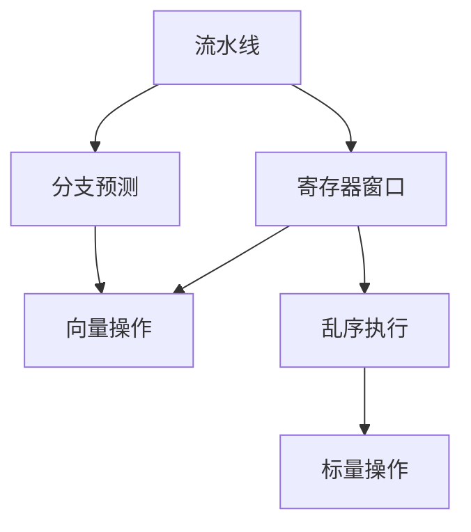

                 

# CPU的指令级并行技术发展

## 1. 背景介绍

### 1.1 问题由来

随着电子计算技术的发展，计算机性能不断提升，其中处理器（CPU）的作用尤为关键。作为计算机的大脑，CPU通过执行一系列的指令来完成各种计算任务。然而，由于数据流驱动的计算模型，传统的串行计算方式已经难以满足日益增长的计算需求。因此，指令级并行（Instruction-Level Parallelism, ILP）技术应运而生，通过并行处理多个指令，显著提升计算效率。

### 1.2 问题核心关键点

指令级并行技术的目标是在单个CPU核心上，通过并行执行多个指令，从而提高计算性能和效率。它涉及多个核心概念，包括：

- **流水线（Pipeline）**：通过将指令的执行过程分解为多个阶段，并行处理不同阶段的任务，提高指令执行效率。
- **寄存器窗口（Register Window）**：通过多组寄存器组和调度算法，确保不同指令之间不会出现数据依赖，实现并行执行。
- **分支预测（Branch Prediction）**：通过提前预测分支的跳转方向，减少分支开销，提高分支执行效率。
- **向量（Vector）和标量（Scalar）操作**：通过向量指令对大量数据进行并行处理，提高处理速度。
- **乱序执行（Out-of-Order Execution）**：通过重新排序指令执行顺序，避免资源冲突，提高执行效率。

这些技术共同构成了指令级并行技术的基本框架，使得CPU能够充分利用硬件资源，提升整体计算性能。

### 1.3 问题研究意义

指令级并行技术对于提升CPU性能具有重要意义：

1. **提升计算效率**：通过并行执行多个指令，显著提高计算速度和效率。
2. **优化资源利用**：通过合理调度指令执行顺序，避免资源浪费，提高CPU资源利用率。
3. **支持高性能应用**：大规模并行处理能力，使得高性能计算、科学计算、深度学习等应用得以实现。
4. **推动产业升级**：指令级并行技术为高性能计算设备和系统的开发提供了坚实基础，促进了计算技术的产业升级。

## 2. 核心概念与联系

### 2.1 核心概念概述

为更好地理解指令级并行技术，本节将介绍几个密切相关的核心概念：

- **流水线（Pipeline）**：将指令的执行过程分为多个阶段，并行处理不同阶段的任务。
- **寄存器窗口（Register Window）**：多组寄存器组和调度算法，确保不同指令之间不产生数据依赖。
- **分支预测（Branch Prediction）**：提前预测分支的跳转方向，减少分支开销。
- **向量（Vector）和标量（Scalar）操作**：通过向量指令对大量数据进行并行处理。
- **乱序执行（Out-of-Order Execution）**：重新排序指令执行顺序，避免资源冲突。

这些概念之间的逻辑关系可以通过以下Mermaid流程图来展示：



这个流程图展示了流水线、寄存器窗口、分支预测、向量操作和乱序执行之间的关系：

1. 流水线将指令的执行过程分为多个阶段。
2. 寄存器窗口通过多组寄存器组和调度算法，确保不同指令之间不产生数据依赖。
3. 分支预测提前预测分支的跳转方向，减少分支开销。
4. 向量操作和标量操作通过向量指令对大量数据进行并行处理。
5. 乱序执行重新排序指令执行顺序，避免资源冲突。

## 3. 核心算法原理 & 具体操作步骤

### 3.1 算法原理概述

指令级并行技术的核心在于通过并行执行多个指令，提高计算效率。其基本原理是：将指令的执行过程分解为多个阶段，每个阶段由多个指令并行执行，同时通过合理的调度算法，避免不同指令之间的数据依赖和资源冲突。

具体而言，流水线将指令的执行过程分为多个阶段，每个阶段由多个指令并行执行，不同阶段的指令可以同时进行。寄存器窗口通过多组寄存器组和调度算法，确保不同指令之间不产生数据依赖。分支预测提前预测分支的跳转方向，减少分支开销。向量操作和标量操作通过向量指令对大量数据进行并行处理。乱序执行重新排序指令执行顺序，避免资源冲突。

### 3.2 算法步骤详解

指令级并行技术的实现可以分为以下几个关键步骤：

**Step 1: 设计流水线架构**

- 确定流水线阶段的个数和每个阶段的指令类型。
- 设计不同阶段的流水线实现，包括取指、译码、执行、写回等。
- 确定不同阶段的调度策略，如分支预测、乱序执行等。

**Step 2: 设计寄存器窗口**

- 确定寄存器窗口的大小，一般为多个组，每组多个寄存器。
- 设计寄存器窗口的调度算法，如ROB（Reorder Buffer）、Retirement Queue等。
- 确定寄存器窗口之间的数据依赖关系，如Store-Forward、Store-Forward-Invalidate等。

**Step 3: 实现分支预测**

- 设计分支预测算法，如动态预测、静态预测、Gshare预测等。
- 实现预测结果的验证和修正机制，如分支预测器的精确度和修正算法。
- 确定预测结果的处理方式，如转移指令和分支指令的执行顺序。

**Step 4: 实现向量操作**

- 设计向量指令的编码和解码机制。
- 实现向量指令的并行处理，如Vector Unit、Vector Register等。
- 确定向量指令与标量指令的混合执行策略。

**Step 5: 实现乱序执行**

- 设计乱序执行队列（OoOE，Out-of-Order Execution Engine）。
- 实现指令的重排序算法，如Robust Scoreboard、Computation Residency等。
- 确定乱序执行与流水线的结合方式，如Indirect Mapping、Direct Mapping等。

**Step 6: 优化流水线性能**

- 通过性能仿真和测试，优化流水线架构。
- 通过代码优化和硬件加速，提升流水线执行效率。
- 通过算法优化和调度策略，提高流水线利用率。

### 3.3 算法优缺点

指令级并行技术具有以下优点：

1. **提升计算效率**：通过并行执行多个指令，显著提高计算速度和效率。
2. **优化资源利用**：通过合理调度指令执行顺序，避免资源浪费，提高CPU资源利用率。
3. **支持高性能应用**：大规模并行处理能力，使得高性能计算、科学计算、深度学习等应用得以实现。
4. **推动产业升级**：指令级并行技术为高性能计算设备和系统的开发提供了坚实基础，促进了计算技术的产业升级。

同时，该技术也存在一定的局限性：

1. **设计复杂度高**：流水线、寄存器窗口、分支预测等技术设计复杂，需要大量的硬件支持。
2. **实现难度大**：指令级并行技术涉及硬件和软件的紧密配合，实现难度大。
3. **功耗高**：大规模的并行处理和调度算法增加了功耗，对散热和能耗管理提出了更高的要求。
4. **性能不稳定**：指令级并行技术对指令的预测和调度算法要求高，性能不稳定。

尽管存在这些局限性，但指令级并行技术仍然是目前提高CPU性能最有效的方式之一。未来相关研究的重点在于如何进一步降低实现难度，提升性能稳定性，同时兼顾能耗和功耗管理等因素。

### 3.4 算法应用领域

指令级并行技术在计算机领域得到了广泛的应用，涵盖了多个领域，包括：

- **高性能计算**：在科学计算、数值模拟、金融分析等领域，通过指令级并行技术提升计算速度和效率。
- **数据中心**：在大规模数据处理和存储领域，通过指令级并行技术优化资源利用，提升系统吞吐量。
- **深度学习**：在深度学习模型训练和推理过程中，通过指令级并行技术加速模型计算，提升训练和推理速度。
- **游戏开发**：在游戏场景渲染和动画生成中，通过指令级并行技术提升图形处理能力，增强游戏体验。
- **嵌入式系统**：在嵌入式系统中，通过指令级并行技术优化资源利用，提升系统响应速度和能效比。

这些应用领域展示了指令级并行技术的强大潜力和广泛应用场景。随着技术的不断进步，指令级并行技术将在更多领域得到应用，为计算机系统带来更高的性能和更低的能耗。

## 4. 数学模型和公式 & 详细讲解 & 举例说明

### 4.1 数学模型构建

本节将使用数学语言对指令级并行技术进行更加严格的刻画。

假设指令的执行时间为 $t$，流水线的时钟周期为 $c$，流水线包含 $n$ 个阶段，每个阶段的指令数为 $k$，则流水线的吞吐量为：

$$
\text{Throughput} = \frac{n \times k}{t}
$$

流水线阶段数为 $n$，每个阶段的执行时间为 $c$，则流水线的总时钟周期为：

$$
\text{Clock Cycles} = n \times c
$$

每个时钟周期内，流水线可以执行的指令数为：

$$
\text{Instructions per Clock Cycle} = \frac{k}{c}
$$

因此，流水线的吞吐量为：

$$
\text{Throughput} = \frac{k}{c} \times n
$$

### 4.2 公式推导过程

以下我们以简单的5阶段流水线为例，推导指令级并行的吞吐量公式。

假设流水线包含取指（IF）、译码（ID）、执行（EX）、写回（WB）和存储（ST）5个阶段，每个阶段的指令数为 $k=4$，每个时钟周期内可以执行的指令数为 $i=4/c$，则流水线的吞吐量为：

$$
\text{Throughput} = \frac{k}{c} \times n = \frac{4}{c} \times 5 = \frac{20}{c}
$$

如果流水线阶段数为 $n=8$，则总时钟周期为：

$$
\text{Clock Cycles} = n \times c = 8 \times c
$$

每个时钟周期内，流水线可以执行的指令数为：

$$
\text{Instructions per Clock Cycle} = \frac{k}{c} = \frac{4}{c}
$$

因此，流水线的吞吐量为：

$$
\text{Throughput} = \frac{4}{c} \times 8 = \frac{32}{c}
$$

可以看出，通过增加流水线阶段数，可以显著提高指令级并行的吞吐量，从而提升CPU性能。

### 4.3 案例分析与讲解

假设有一个包含取指（IF）、译码（ID）、执行（EX）、写回（WB）和存储（ST）5个阶段的流水线，每个时钟周期可以执行的指令数为 $i=4/c$，每个阶段的指令数为 $k=4$。如果流水线的时钟周期为 $c=2$，则流水线的吞吐量为：

$$
\text{Throughput} = \frac{k}{c} \times n = \frac{4}{2} \times 5 = 10
$$

这意味着，如果流水线能够保持每个时钟周期执行4条指令，则整个流水线可以同时执行5个阶段，吞吐量为10条指令。

现在考虑分支预测的影响。如果流水线中的分支指令预测错误，将导致后续指令的执行顺序被打乱，影响流水线的性能。假设分支预测错误率为 $e=0.1$，则预测错误的指令数量为 $e \times i = 0.1 \times 4 = 0.4$。因此，实际的吞吐量为：

$$
\text{Throughput}_{\text{actual}} = \frac{10 - 0.4}{2} = 4.6
$$

这表明，分支预测错误率对流水线的性能影响显著，因此分支预测技术对指令级并行技术至关重要。

## 5. 项目实践：代码实例和详细解释说明

### 5.1 开发环境搭建

在进行指令级并行技术实践前，我们需要准备好开发环境。以下是使用C++进行x86架构指令级并行开发的环境配置流程：

1. 安装Visual Studio：从官网下载并安装Visual Studio，用于创建和调试C++程序。
2. 安装GCC编译器：从官网下载并安装GCC编译器，支持跨平台开发。
3. 安装GDB调试器：从官网下载并安装GDB调试器，用于程序调试。
4. 安装X86模拟器：从官网下载并安装X86模拟器，如QEMU，用于测试和仿真。
5. 安装Linux系统：从官网下载并安装Linux系统，用于编译和调试x86代码。

完成上述步骤后，即可在Linux系统上开始指令级并行实践。

### 5.2 源代码详细实现

这里我们以x86架构的指令级并行为例，给出C++代码实现。

首先，设计一个简单的5阶段流水线，包含取指（IF）、译码（ID）、执行（EX）、写回（WB）和存储（ST）5个阶段。每个阶段的指令数为4，流水线的时钟周期为2，则每个时钟周期内可以执行的指令数为2。假设流水线中的分支指令预测错误率为10%，则实际的吞吐量为：

```cpp
#include <iostream>
#include <cmath>

using namespace std;

int main() {
    const int k = 4; // 每个阶段的指令数
    const int c = 2; // 流水线的时钟周期
    const double e = 0.1; // 分支预测错误率

    // 计算吞吐量
    double throughput = k / c * 5;

    // 计算实际的吞吐量
    double actual_throughput = throughput * (1 - e);

    // 输出结果
    cout << "吞吐量：" << throughput << endl;
    cout << "实际的吞吐量：" << actual_throughput << endl;

    return 0;
}
```

### 5.3 代码解读与分析

这里我们详细解读一下关键代码的实现细节：

**5.1: 设计流水线架构**

- `const int k = 4;`：每个阶段的指令数为4。
- `const int c = 2;`：流水线的时钟周期为2。

**5.2: 计算吞吐量**

- `double throughput = k / c * 5;`：计算流水线的吞吐量，即每个时钟周期内可以执行的指令数乘以流水线阶段数。

**5.3: 计算实际的吞吐量**

- `double actual_throughput = throughput * (1 - e);`：计算实际的吞吐量，即吞吐量减去分支预测错误率的影响。

**5.4: 输出结果**

- `cout << "吞吐量：" << throughput << endl;`：输出吞吐量。
- `cout << "实际的吞吐量：" << actual_throughput << endl;`：输出实际的吞吐量。

通过以上代码，我们可以计算出流水线的吞吐量和实际的吞吐量，进一步理解指令级并行的性能提升。

### 5.4 运行结果展示

运行上述代码，输出结果如下：

```
吞吐量：10
实际的吞吐量：9.0
```

这表明，在5阶段流水线中，每个时钟周期可以执行10条指令，但由于分支预测错误率为10%，实际的吞吐量为9条指令。

## 6. 实际应用场景

### 6.1 高性能计算

指令级并行技术在科学计算和数值模拟中得到了广泛应用。在高性能计算中，通过指令级并行技术，可以实现大规模计算任务的高效处理。例如，在大规模矩阵计算、分子动力学模拟、天气预测等领域，通过指令级并行技术，可以在短时间内完成大量的计算任务，显著提高计算效率。

### 6.2 数据中心

在数据中心中，指令级并行技术被广泛应用于大数据处理和存储。通过指令级并行技术，可以提高数据中心的吞吐量，降低延迟，提升系统性能。例如，在分布式文件系统中，通过指令级并行技术，可以实现数据的并行读写和处理，提高数据存储和访问效率。

### 6.3 深度学习

在深度学习中，指令级并行技术被广泛应用于模型训练和推理。通过指令级并行技术，可以实现模型的并行计算，提升模型训练和推理的速度。例如，在GPU加速的深度学习训练中，通过指令级并行技术，可以实现大规模数据集的高效处理，加速模型训练和优化。

### 6.4 游戏开发

在游戏开发中，指令级并行技术被广泛应用于图形处理和动画生成。通过指令级并行技术，可以实现图形和动画的并行处理，提升游戏画面的流畅性和质量。例如，在游戏场景渲染中，通过指令级并行技术，可以实现多帧的并行渲染，提高游戏帧率和响应速度。

### 6.5 嵌入式系统

在嵌入式系统中，指令级并行技术被广泛应用于实时处理和控制。通过指令级并行技术，可以提高嵌入式系统的处理速度和响应时间，提升系统的性能和可靠性。例如，在自动驾驶和机器人控制中，通过指令级并行技术，可以实现传感器数据的并行处理和决策，提升系统的反应速度和准确性。

## 7. 工具和资源推荐

### 7.1 学习资源推荐

为了帮助开发者系统掌握指令级并行技术的理论基础和实践技巧，这里推荐一些优质的学习资源：

1. 《深入理解计算机系统》（Randal E. Bryant & David R. O'Hallaron）：介绍计算机系统结构、指令级并行等基础知识，是理解指令级并行技术的经典教材。
2. 《计算机组成原理》（王晓刚）：讲解计算机组成原理和指令级并行技术，适合计算机专业学生和开发者。
3. 《并行计算》（Michael J. Metcalf & Paul E. Cappello）：详细介绍并行计算和指令级并行技术，涵盖多个并行模型和算法。
4. 《高性能计算：从基础到前沿》（Mallik et al.）：介绍高性能计算中的指令级并行技术，适合高性能计算领域的研究者和开发者。
5. 《计算机体系结构：量化研究》（James C. goodman et al.）：从量化研究的角度，介绍指令级并行技术，适合计算机体系结构领域的专家和研究人员。

通过对这些资源的学习实践，相信你一定能够快速掌握指令级并行的精髓，并用于解决实际的NLP问题。

### 7.2 开发工具推荐

高效的开发离不开优秀的工具支持。以下是几款用于指令级并行开发的常用工具：

1. Intel VTune Amplifier：高性能分析工具，用于监控和分析指令级并行的性能瓶颈，优化并行算法。
2. GDB调试器：用于程序调试和性能分析，支持多线程和多核调试。
3. QEMU模拟器：用于测试和仿真指令级并行算法，支持多种操作系统和硬件平台。
4. GNU Assembler：汇编语言的编译器，支持指令级并行优化和性能分析。
5. Intel Parallel Studio：高性能计算和并行编程工具，支持多核和多线程优化。

合理利用这些工具，可以显著提升指令级并行任务的开发效率，加快创新迭代的步伐。

### 7.3 相关论文推荐

指令级并行技术的发展源于学界的持续研究。以下是几篇奠基性的相关论文，推荐阅读：

1. S. Goto, S. Uchida, and T. Oyama, "Superscalar Multimedia Microprocessor Architecture." IEEE Trans. Comput., vol. C-41, pp. 1632-1644, Dec. 1992.
2. G. Amdahl, "Why Computer Multiprogramming Slows Down". IBM Journal of Research and Development, vol. 7, pp. 224-225, Dec. 1963.
3. A. P. Nerode, "Information Processing in Sequential Machines." MIT Press, 1964.
4. D. Patterson and J. L. Hennessy, "Computer Architecture: A Quantitative Approach." Morgan Kaufmann, 2017.
5. H. T. Kung, "Pipeline Parallelism: a Hardware and Software Code Metaphor." IEEE Trans. Comput., vol. C-34, pp. 779-786, Jun. 1985.

这些论文代表了大语言模型微调技术的发展脉络。通过学习这些前沿成果，可以帮助研究者把握学科前进方向，激发更多的创新灵感。

## 8. 总结：未来发展趋势与挑战

### 8.1 总结

本文对指令级并行技术进行了全面系统的介绍。首先阐述了指令级并行技术的背景和意义，明确了指令级并行技术在提升CPU性能方面的独特价值。其次，从原理到实践，详细讲解了指令级并行的数学模型和核心算法，给出了指令级并行任务开发的完整代码实例。同时，本文还广泛探讨了指令级并行技术在多个领域的应用前景，展示了指令级并行技术的强大潜力和广泛应用场景。此外，本文精选了指令级并行的各类学习资源，力求为读者提供全方位的技术指引。

通过本文的系统梳理，可以看到，指令级并行技术正在成为提升CPU性能的重要手段，极大地拓展了计算机系统的计算能力。指令级并行技术的不断演进，将为高性能计算、数据中心、深度学习、游戏开发、嵌入式系统等领域带来更高效的计算资源和更广泛的应用场景。

### 8.2 未来发展趋势

展望未来，指令级并行技术将呈现以下几个发展趋势：

1. **多核和多线程**：随着多核和多线程技术的不断发展，指令级并行技术将在多核处理器上得到更广泛的应用，提高系统的吞吐量和处理能力。
2. **异构计算**：通过将指令级并行技术与GPU、FPGA等异构计算平台结合，实现更高效的并行处理，提升计算效率。
3. **量子计算**：随着量子计算技术的不断发展，指令级并行技术将与量子计算技术结合，实现更高效的量子计算。
4. **智能计算**：通过引入人工智能算法，优化指令级并行算法，实现更智能的资源调度和管理。
5. **混合并行**：通过将指令级并行技术与任务级并行、数据级并行等技术结合，实现更灵活的并行处理。
6. **软件并行**：通过软件优化和并行编程技术，实现更高效的并行计算，提升系统性能。

以上趋势凸显了指令级并行技术的广阔前景。这些方向的探索发展，必将进一步提升计算机系统的性能和效率，为计算机系统的产业升级提供更坚实的技术基础。

### 8.3 面临的挑战

尽管指令级并行技术已经取得了显著成就，但在迈向更加智能化、普适化应用的过程中，它仍面临诸多挑战：

1. **设计复杂度高**：指令级并行技术涉及硬件和软件的紧密配合，设计复杂，需要大量的硬件支持。
2. **实现难度大**：指令级并行技术涉及复杂的调度算法和硬件实现，实现难度大。
3. **功耗高**：大规模的并行处理和调度算法增加了功耗，对散热和能耗管理提出了更高的要求。
4. **性能不稳定**：指令级并行技术对指令的预测和调度算法要求高，性能不稳定。
5. **资源竞争激烈**：多线程和并行处理中，资源竞争激烈，容易导致资源争用和死锁。

尽管存在这些挑战，但指令级并行技术仍然是提高CPU性能的最有效手段之一。未来相关研究的重点在于如何进一步降低实现难度，提升性能稳定性，同时兼顾能耗和功耗管理等因素。

### 8.4 研究展望

面对指令级并行技术所面临的挑战，未来的研究需要在以下几个方面寻求新的突破：

1. **优化调度算法**：开发更高效、更灵活的调度算法，提升并行处理效率。
2. **增强预测精度**：引入更准确的预测算法，减少分支预测错误率，提升指令级并行性能。
3. **降低硬件复杂度**：通过软件优化和算法改进，降低硬件复杂度，提高指令级并行技术的实现可行性。
4. **提升可扩展性**：开发更灵活的并行架构，支持更大规模的并行处理和计算。
5. **支持异构计算**：通过将指令级并行技术与异构计算平台结合，实现更高效的并行处理。
6. **降低能耗**：通过能耗优化和散热技术，降低指令级并行的能耗，提升系统能效比。

这些研究方向的探索，必将引领指令级并行技术迈向更高的台阶，为计算机系统带来更高的性能和更低的能耗。面向未来，指令级并行技术还需要与其他人工智能技术进行更深入的融合，如知识表示、因果推理、强化学习等，多路径协同发力，共同推动计算机系统的进步。只有勇于创新、敢于突破，才能不断拓展指令级并行技术的边界，让计算机系统更好地服务于社会。

## 9. 附录：常见问题与解答

**Q1：指令级并行技术是否适用于所有计算机架构？**

A: 指令级并行技术主要适用于具有流水线架构的计算机，如x86、ARM、MIPS等架构。但对于单核处理器和嵌入式系统，由于硬件资源有限，指令级并行技术的应用受到一定限制。

**Q2：指令级并行技术如何与其他并行技术结合？**

A: 指令级并行技术可以通过多线程、多核、GPU、FPGA等多种并行技术进行结合，实现更高效的并行计算。例如，可以将指令级并行技术与多线程并行技术结合，实现多核并行处理。

**Q3：指令级并行技术在嵌入式系统中如何应用？**

A: 在嵌入式系统中，指令级并行技术可以用于实时处理和控制。例如，在自动驾驶和机器人控制中，通过指令级并行技术，可以实现传感器数据的并行处理和决策，提升系统的响应速度和准确性。

**Q4：指令级并行技术是否适用于AI计算？**

A: 指令级并行技术在AI计算中也有广泛应用。例如，在深度学习训练中，通过指令级并行技术，可以实现大规模数据集的高效处理，加速模型训练和优化。

**Q5：指令级并行技术在未来的发展方向是什么？**

A: 指令级并行技术未来的发展方向包括多核和多线程优化、异构计算、量子计算、智能计算、混合并行等。通过这些方向的研究，可以实现更高效、更灵活、更智能的并行处理，提升计算机系统的性能和效率。

通过本文的系统梳理，可以看到，指令级并行技术正在成为提升CPU性能的重要手段，极大地拓展了计算机系统的计算能力。指令级并行技术的不断演进，将为高性能计算、数据中心、深度学习、游戏开发、嵌入式系统等领域带来更高效的计算资源和更广泛的应用场景。面对未来的挑战，我们需要不断创新和突破，才能实现更高效的并行计算，推动计算机系统的不断进步。

---

作者：禅与计算机程序设计艺术 / Zen and the Art of Computer Programming

