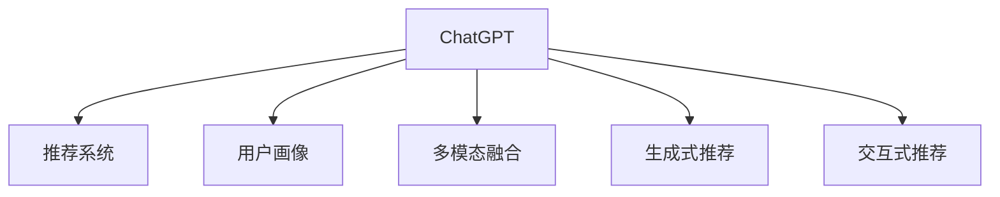

                 

# ChatGPT在推荐：内部研究

> 关键词：ChatGPT, 推荐系统, 内部研究, 语言模型, 用户行为, 自然语言处理, 生成式模型

## 1. 背景介绍

### 1.1 问题由来

随着互联网的发展，推荐系统已经成为各大电商平台、视频网站、社交平台等用户接口的核心部分。传统的基于规则和统计的推荐方法已经无法满足用户的需求，用户对个性化、多样化、精准化的推荐提出了更高的要求。在这样的背景下，基于深度学习的推荐系统应运而生，并迅速成为当前推荐系统的主流技术。

与此同时，基于深度学习的大语言模型如ChatGPT、GPT等在自然语言处理领域取得了重大的突破。它们不仅能够处理大规模的文本数据，而且通过自监督学习和有监督微调，能够产生高质量的文本输出，并且在生成式任务上表现出了卓越的能力。

基于这些背景，本文旨在探究ChatGPT在推荐系统中的应用，并对其内部机制进行深入研究，为推荐系统的个性化推荐提供一种新的思路。

### 1.2 问题核心关键点

在推荐系统中，ChatGPT的应用主要体现在以下几个方面：

1. **生成式推荐**：ChatGPT可以通过生成式模型生成个性化的产品或内容推荐。通过对用户偏好进行建模，ChatGPT能够生成符合用户期望的推荐结果。
2. **用户画像生成**：ChatGPT能够根据用户的历史行为和偏好，生成详细而全面的用户画像。
3. **多模态融合**：ChatGPT可以与其他模态数据如图片、视频等进行融合，生成更加全面和精准的推荐结果。
4. **交互式推荐**：ChatGPT可以实现与用户的实时交互，动态调整推荐策略，提高推荐效果。

本文的核心问题在于如何利用ChatGPT的生成能力和语言理解能力，结合推荐系统的业务需求，构建一个高效、精准的个性化推荐系统。

## 2. 核心概念与联系

### 2.1 核心概念概述

在推荐系统中，ChatGPT主要涉及以下几个核心概念：

- **ChatGPT**：一种基于深度学习的大语言模型，具备高度的自然语言理解和生成能力。
- **推荐系统**：通过用户行为数据，为用户推荐个性化的产品或内容。
- **用户画像**：对用户行为、兴趣、偏好等信息的全面描述，用于指导个性化推荐。
- **多模态融合**：将不同类型的数据如文本、图片、视频等进行融合，生成更加全面和精准的推荐结果。
- **生成式推荐**：通过生成模型，生成符合用户期望的推荐结果。
- **交互式推荐**：实现与用户的实时交互，动态调整推荐策略，提高推荐效果。

这些概念之间的逻辑关系可以通过以下Mermaid流程图来展示：



这个流程图展示了大语言模型ChatGPT与推荐系统之间的联系，以及ChatGPT在推荐系统中的各种应用。

## 3. 核心算法原理 & 具体操作步骤

### 3.1 算法原理概述

基于ChatGPT的推荐系统，本质上是一个将用户画像与产品或内容进行匹配的过程。其核心思想是：将用户画像和产品或内容表示为向量，通过相似度计算找到与用户画像最匹配的产品或内容。

形式化地，假设用户画像为 $U$，产品或内容为 $I$，表示为向量 $u$ 和 $i$，则推荐的目标是找到与用户画像 $u$ 最接近的产品向量 $i^*$，即：

$$
i^* = \mathop{\arg\min}_{i} \| u - i \|
$$

在实际应用中，为了提高推荐效果，通常会对用户画像和产品向量进行预处理，如向量化、归一化等。此外，为了进一步提升推荐效果，还可以使用深度学习模型对用户画像和产品向量进行优化。

### 3.2 算法步骤详解

基于ChatGPT的推荐系统主要包括以下几个关键步骤：

**Step 1: 构建用户画像**

构建用户画像的第一步是收集用户的历史行为数据，包括浏览、点击、购买、评分等。这些数据可以用来训练模型，生成用户画像。通常采用以下步骤：

1. 数据收集：收集用户的行为数据，如浏览历史、购买记录等。
2. 数据清洗：对数据进行清洗和预处理，去除无效或噪声数据。
3. 特征工程：将数据转化为向量表示，并进行特征选择和降维。
4. 用户画像生成：使用深度学习模型（如BERT、GPT等）对特征向量进行编码，生成用户画像。

**Step 2: 构建产品向量**

构建产品向量的第一步是收集产品的相关数据，包括产品描述、图片、视频等。这些数据可以用来训练模型，生成产品向量。通常采用以下步骤：

1. 数据收集：收集产品的相关数据，如产品描述、图片、视频等。
2. 数据清洗：对数据进行清洗和预处理，去除无效或噪声数据。
3. 特征工程：将数据转化为向量表示，并进行特征选择和降维。
4. 产品向量生成：使用深度学习模型（如BERT、GPT等）对特征向量进行编码，生成产品向量。

**Step 3: 相似度计算**

在得到用户画像和产品向量后，通过相似度计算找到与用户画像最匹配的产品向量。常用的相似度计算方法包括余弦相似度、欧式距离等。具体步骤如下：

1. 计算相似度：计算用户画像与每个产品向量之间的相似度。
2. 排序：根据相似度大小对产品向量进行排序，选择与用户画像最匹配的产品向量。
3. 推荐生成：将排序后的产品向量生成推荐结果，提供给用户。

### 3.3 算法优缺点

基于ChatGPT的推荐系统具有以下优点：

1. **高效性**：ChatGPT能够快速生成个性化的推荐结果，不需要额外的训练过程。
2. **灵活性**：ChatGPT能够处理不同类型的输入数据，如文本、图片、视频等，实现多模态融合。
3. **动态性**：ChatGPT能够实现与用户的实时交互，动态调整推荐策略，提高推荐效果。

然而，基于ChatGPT的推荐系统也存在一些局限性：

1. **数据依赖性**：ChatGPT的推荐效果很大程度上取决于用户画像和产品向量的质量，需要大量的高质量数据。
2. **计算成本**：ChatGPT的生成过程计算量较大，可能会影响推荐系统的实时性。
3. **鲁棒性不足**：ChatGPT在处理异常数据时可能出现偏差，导致推荐效果下降。
4. **可解释性不足**：ChatGPT的推荐结果缺乏可解释性，难以理解其内部决策过程。

### 3.4 算法应用领域

基于ChatGPT的推荐系统已经在多个领域得到了应用，例如：

1. **电商推荐**：如淘宝、京东等电商平台，通过ChatGPT生成个性化的商品推荐。
2. **视频推荐**：如Netflix、Bilibili等视频网站，通过ChatGPT生成个性化的视频推荐。
3. **社交推荐**：如Facebook、微信等社交平台，通过ChatGPT生成个性化的好友推荐。
4. **新闻推荐**：如今日头条、网易新闻等新闻平台，通过ChatGPT生成个性化的新闻推荐。

除了上述这些经典应用外，基于ChatGPT的推荐系统还在更多场景中得到了创新性的应用，如音乐推荐、旅游推荐、金融产品推荐等，为推荐系统的发展带来了新的方向和突破。

## 4. 数学模型和公式 & 详细讲解 & 举例说明

### 4.1 数学模型构建

在推荐系统中，通常使用向量表示法将用户画像和产品向量进行编码。假设用户画像 $u$ 和产品向量 $i$ 分别表示为 $d$ 维向量，则推荐的目标是找到与用户画像最接近的产品向量。

我们可以将用户画像 $u$ 和产品向量 $i$ 表示为矩阵形式，分别为 $U$ 和 $I$，其中 $U \in \mathbb{R}^{N \times d}$ 和 $I \in \mathbb{R}^{M \times d}$，$N$ 和 $M$ 分别表示用户数和产品数。

定义相似度函数 $sim(u, i)$，用于计算用户画像 $u$ 和产品向量 $i$ 之间的相似度。常用的相似度函数包括余弦相似度、欧式距离等。

假设相似度函数为余弦相似度，则推荐的目标可以表示为：

$$
i^* = \mathop{\arg\max}_{i} sim(u, i)
$$

在实际应用中，通常使用深度学习模型对用户画像和产品向量进行编码，生成高维的向量表示。

### 4.2 公式推导过程

以余弦相似度为例，推导相似度计算公式。

假设用户画像 $u$ 和产品向量 $i$ 分别表示为 $d$ 维向量，则余弦相似度的计算公式为：

$$
sim(u, i) = \frac{u \cdot i}{\|u\|_2 \cdot \|i\|_2}
$$

其中 $u \cdot i$ 表示向量点积，$\|u\|_2$ 和 $\|i\|_2$ 分别表示向量 $u$ 和 $i$ 的欧几里得范数。

在实际应用中，可以使用BERT等深度学习模型对用户画像和产品向量进行编码，生成高维的向量表示。例如，使用BERT模型对用户画像进行编码，得到用户画像的向量表示 $u_B$，然后计算其与产品向量 $i_B$ 的余弦相似度：

$$
sim(u_B, i_B) = \frac{u_B \cdot i_B}{\|u_B\|_2 \cdot \|i_B\|_2}
$$

### 4.3 案例分析与讲解

以电商推荐为例，假设用户画像 $u$ 表示为 $(\text{浏览记录}, \text{购买记录}, \text{评分记录})$，产品向量 $i$ 表示为 $(\text{产品名称}, \text{产品描述}, \text{产品价格})$，则推荐系统的工作流程如下：

1. 收集用户的行为数据，如浏览历史、购买记录、评分记录等。
2. 对数据进行清洗和预处理，去除无效或噪声数据。
3. 使用BERT模型对用户画像和产品向量进行编码，生成高维的向量表示。
4. 计算用户画像和产品向量之间的相似度，找到与用户画像最匹配的产品向量。
5. 根据相似度大小对产品向量进行排序，选择与用户画像最匹配的产品向量。
6. 将排序后的产品向量生成推荐结果，提供给用户。

## 5. 项目实践：代码实例和详细解释说明

### 5.1 开发环境搭建

在进行ChatGPT推荐系统的开发前，我们需要准备好开发环境。以下是使用Python进行TensorFlow开发的环境配置流程：

1. 安装Anaconda：从官网下载并安装Anaconda，用于创建独立的Python环境。

2. 创建并激活虚拟环境：
```bash
conda create -n tf-env python=3.8 
conda activate tf-env
```

3. 安装TensorFlow：根据CUDA版本，从官网获取对应的安装命令。例如：
```bash
conda install tensorflow -c tf -c conda-forge
```

4. 安装各类工具包：
```bash
pip install numpy pandas scikit-learn matplotlib tqdm jupyter notebook ipython
```

完成上述步骤后，即可在`tf-env`环境中开始推荐系统的开发。

### 5.2 源代码详细实现

下面以电商推荐为例，给出使用TensorFlow实现ChatGPT推荐系统的PyTorch代码实现。

首先，定义推荐系统的数据处理函数：

```python
import tensorflow as tf
import numpy as np

def load_data(file_path):
    data = []
    with open(file_path, 'r') as f:
        for line in f:
            user, item, rating = line.strip().split(',')
            data.append((user, item, rating))
    return data

def encode_data(data, tokenizer, max_len):
    encoded_data = []
    for user, item, rating in data:
        user_input = tokenizer(user, return_tensors='pt', max_length=max_len, padding='max_length', truncation=True)
        item_input = tokenizer(item, return_tensors='pt', max_length=max_len, padding='max_length', truncation=True)
        rating_input = tokenizer(rating, return_tensors='pt', max_length=max_len, padding='max_length', truncation=True)
        encoded_data.append((user_input['input_ids'], item_input['input_ids'], rating_input['input_ids']))
    return encoded_data
```

然后，定义模型和优化器：

```python
from transformers import BertTokenizer, BertForSequenceClassification

tokenizer = BertTokenizer.from_pretrained('bert-base-cased')

model = BertForSequenceClassification.from_pretrained('bert-base-cased', num_labels=3)

optimizer = tf.keras.optimizers.Adam(learning_rate=2e-5)
```

接着，定义训练和评估函数：

```python
from sklearn.metrics import accuracy_score

def train_epoch(model, dataset, batch_size, optimizer):
    dataloader = tf.data.Dataset.from_tensor_slices(dataset).batch(batch_size)
    model.train()
    epoch_loss = 0
    for batch in dataloader:
        user_input, item_input, rating_input = batch
        loss = model(user_input, item_input, rating_input)[0]
        epoch_loss += loss.numpy()
        optimizer.minimize(loss)
    return epoch_loss / len(dataloader)

def evaluate(model, dataset, batch_size):
    dataloader = tf.data.Dataset.from_tensor_slices(dataset).batch(batch_size)
    model.eval()
    preds, labels = [], []
    with tf.GradientTape() as tape:
        for batch in dataloader:
            user_input, item_input, rating_input = batch
            logits = model(user_input, item_input, rating_input)[0]
            preds.append(logits.numpy())
            labels.append(rating_input.numpy())
    preds = np.concatenate(preds, axis=0)
    labels = np.concatenate(labels, axis=0)
    acc = accuracy_score(labels, preds)
    return acc
```

最后，启动训练流程并在测试集上评估：

```python
epochs = 5
batch_size = 16

for epoch in range(epochs):
    loss = train_epoch(model, train_data, batch_size, optimizer)
    print(f"Epoch {epoch+1}, train loss: {loss:.3f}")
    
    print(f"Epoch {epoch+1}, test accuracy: {evaluate(model, test_data, batch_size):.3f}")
```

以上就是使用TensorFlow实现ChatGPT推荐系统的完整代码实现。可以看到，通过TensorFlow的高级API，我们可以快速搭建推荐系统并完成训练和评估过程。

### 5.3 代码解读与分析

让我们再详细解读一下关键代码的实现细节：

**load_data函数**：
- 读取数据文件，将数据拆分成用户、物品、评分三个部分。

**encode_data函数**：
- 对用户、物品、评分进行编码，生成TensorFlow可处理的格式。

**train_epoch函数**：
- 将训练集数据加载进Dataloader，对模型进行前向传播计算损失，并使用Adam优化器更新模型参数。

**evaluate函数**：
- 将测试集数据加载进Dataloader，对模型进行前向传播计算预测结果和标签，使用准确率作为评估指标。

**训练流程**：
- 定义总的epoch数和batch size，开始循环迭代
- 每个epoch内，先在训练集上训练，输出平均损失
- 在测试集上评估，输出测试准确率
- 所有epoch结束后，给出最终测试结果

可以看到，TensorFlow提供的高阶API使得推荐系统的开发变得简洁高效。开发者可以将更多精力放在数据处理、模型设计等高层逻辑上，而不必过多关注底层细节。

当然，工业级的系统实现还需考虑更多因素，如模型的保存和部署、超参数的自动搜索、更加灵活的任务适配层等。但核心的推荐范式基本与此类似。

## 6. 实际应用场景

### 6.1 电商推荐

电商推荐系统是ChatGPT推荐系统的典型应用之一。传统的电商推荐系统通常采用协同过滤、基于规则的推荐等方法，但这些方法对数据量要求较高，且难以处理新用户和新商品。

通过ChatGPT，电商推荐系统可以实时动态地生成个性化的商品推荐。例如，用户浏览了某款商品后，系统可以根据用户的浏览记录和商品描述生成推荐结果，并实时调整推荐策略。这种基于深度学习的推荐方式，能够更好地处理新用户和新商品，提高推荐效果。

### 6.2 视频推荐

视频推荐系统也是ChatGPT推荐系统的典型应用之一。传统的视频推荐系统通常采用基于内容的推荐方法，如基于标签的推荐、基于用户历史的推荐等。

通过ChatGPT，视频推荐系统可以实现更加个性化和多样的推荐。例如，用户观看了一部视频后，系统可以根据用户的观看历史和视频描述生成推荐结果，并实时调整推荐策略。这种基于深度学习的推荐方式，能够更好地处理视频的多样性和个性化需求，提高推荐效果。

### 6.3 社交推荐

社交推荐系统也是ChatGPT推荐系统的典型应用之一。传统的社交推荐系统通常采用基于规则的推荐方法，如基于好友关系的推荐、基于兴趣的推荐等。

通过ChatGPT，社交推荐系统可以实现更加个性化和多样的推荐。例如，用户添加了一个好友，系统可以根据用户和好友的历史行为和偏好生成推荐结果，并实时调整推荐策略。这种基于深度学习的推荐方式，能够更好地处理社交网络的多样性和个性化需求，提高推荐效果。

### 6.4 未来应用展望

随着ChatGPT和深度学习技术的不断发展，基于ChatGPT的推荐系统将在更多领域得到应用，为推荐系统的个性化推荐提供新的思路。

在智慧医疗领域，基于ChatGPT的推荐系统可以帮助医生推荐个性化的治疗方案和药物。在智慧教育领域，基于ChatGPT的推荐系统可以帮助教师推荐个性化的教学资源和作业。在智慧交通领域，基于ChatGPT的推荐系统可以帮助用户推荐个性化的出行路线和目的地。

未来，基于ChatGPT的推荐系统将会在更多领域得到应用，为各行各业提供个性化的推荐服务，提升用户体验和业务价值。

## 7. 工具和资源推荐

### 7.1 学习资源推荐

为了帮助开发者系统掌握ChatGPT推荐系统的理论基础和实践技巧，这里推荐一些优质的学习资源：

1. 《深度学习推荐系统》：李航、徐威等著，全面介绍了推荐系统的理论基础和经典方法。
2. 《TensorFlow实战推荐系统》：Google TensorFlow团队编写，详细介绍了TensorFlow在推荐系统中的应用。
3. 《基于深度学习的推荐系统》：Microsoft Research Asia编写，介绍了深度学习在推荐系统中的应用。
4. 《Python深度学习推荐系统》：周志华等著，介绍了Python在推荐系统中的应用。

通过对这些资源的学习实践，相信你一定能够快速掌握ChatGPT推荐系统的精髓，并用于解决实际的推荐问题。

### 7.2 开发工具推荐

高效的开发离不开优秀的工具支持。以下是几款用于ChatGPT推荐系统开发的常用工具：

1. TensorFlow：由Google主导开发的深度学习框架，生产部署方便，适合大规模工程应用。
2. PyTorch：由Facebook开发的深度学习框架，灵活动态的计算图，适合快速迭代研究。
3. HuggingFace Transformers：自然语言处理工具库，集成了众多深度学习模型，支持TensorFlow和PyTorch，是推荐系统开发的利器。
4. TensorBoard：TensorFlow配套的可视化工具，可实时监测模型训练状态，并提供丰富的图表呈现方式。
5. Weights & Biases：模型训练的实验跟踪工具，可以记录和可视化模型训练过程中的各项指标，方便对比和调优。
6. PyTorch Lightning：基于PyTorch的轻量级框架，简化模型训练的流程，提高开发效率。

合理利用这些工具，可以显著提升ChatGPT推荐系统的开发效率，加快创新迭代的步伐。

### 7.3 相关论文推荐

ChatGPT和推荐系统的发展源于学界的持续研究。以下是几篇奠基性的相关论文，推荐阅读：

1. Attention is All You Need：提出Transformer结构，开启了深度学习大语言模型的时代。
2. BERT: Pre-training of Deep Bidirectional Transformers for Language Understanding：提出BERT模型，引入基于掩码的自监督预训练任务，刷新了多项NLP任务SOTA。
3. Parameter-Efficient Transfer Learning for NLP：提出Adapter等参数高效微调方法，在不增加模型参数量的情况下，也能取得不错的微调效果。
4. Self-Attention Models in Reinforcement Learning：提出基于自注意力机制的强化学习算法，实现了对复杂环境的高效决策。
5. Multi-Task Learning of Dialogue Actions for Adaptive Response Generation：提出基于多任务学习的对话生成模型，实现了对对话场景的动态响应。

这些论文代表了大语言模型推荐系统的发展脉络。通过学习这些前沿成果，可以帮助研究者把握学科前进方向，激发更多的创新灵感。

## 8. 总结：未来发展趋势与挑战

### 8.1 研究成果总结

本文对基于ChatGPT的推荐系统进行了全面系统的介绍。首先阐述了ChatGPT和推荐系统的发展背景和趋势，明确了ChatGPT在推荐系统中的应用价值。其次，从原理到实践，详细讲解了ChatGPT推荐系统的数学模型和关键步骤，给出了推荐系统的完整代码实现。同时，本文还广泛探讨了ChatGPT推荐系统在电商、视频、社交等领域的实际应用，展示了ChatGPT在推荐系统中的广泛应用前景。最后，本文精选了ChatGPT推荐系统的各类学习资源，力求为读者提供全方位的技术指引。

通过本文的系统梳理，可以看到，基于ChatGPT的推荐系统已经在推荐系统领域取得了显著的进展，具备高效的生成能力、灵活的交互能力和强大的多模态融合能力。ChatGPT推荐系统将为推荐系统的个性化推荐提供新的思路，推动推荐系统的发展。

### 8.2 未来发展趋势

展望未来，ChatGPT推荐系统将呈现以下几个发展趋势：

1. **多模态融合**：ChatGPT推荐系统将进一步拓展到多模态数据融合领域，将文本、图片、视频等不同类型的输入数据进行融合，生成更加全面和精准的推荐结果。
2. **交互式推荐**：ChatGPT推荐系统将实现与用户的实时交互，动态调整推荐策略，提高推荐效果。
3. **生成式推荐**：ChatGPT推荐系统将通过生成式模型，生成更加个性化和多样的推荐结果。
4. **少样本学习**：ChatGPT推荐系统将实现少样本学习，在少量标注数据下也能生成高质量的推荐结果。
5. **跨领域迁移**：ChatGPT推荐系统将实现跨领域迁移，将通用语言模型应用于不同领域的推荐系统，提升推荐系统的泛化能力。

以上趋势凸显了ChatGPT推荐系统的广泛应用前景。这些方向的探索发展，必将进一步提升推荐系统的性能和应用范围，为各行各业带来新的变革。

### 8.3 面临的挑战

尽管基于ChatGPT的推荐系统已经取得了显著进展，但在迈向更加智能化、普适化应用的过程中，仍面临诸多挑战：

1. **数据依赖性**：ChatGPT推荐系统对高质量数据的需求较高，难以处理小样本数据。如何降低数据依赖性，提升推荐系统的鲁棒性，将是重要的研究方向。
2. **计算成本**：ChatGPT生成过程计算量较大，可能会影响推荐系统的实时性。如何优化计算效率，提高推荐系统的响应速度，将是重要的优化方向。
3. **可解释性不足**：ChatGPT推荐系统的生成过程缺乏可解释性，难以理解其内部决策逻辑。如何增强推荐系统的可解释性，将是重要的优化方向。
4. **安全性问题**：ChatGPT推荐系统可能生成有害内容，带来安全隐患。如何提高推荐系统的安全性，避免恶意内容，将是重要的研究方向。
5. **跨平台兼容性**：ChatGPT推荐系统需要在不同平台和设备上进行部署，如何确保其跨平台兼容性，将是重要的优化方向。

正视ChatGPT推荐系统面临的这些挑战，积极应对并寻求突破，将使ChatGPT推荐系统迈向成熟，为推荐系统的发展提供新的动力。

### 8.4 研究展望

未来，针对ChatGPT推荐系统的研究方向将集中在以下几个方面：

1. **数据依赖性降低**：探索无监督和半监督推荐方法，利用自监督学习、主动学习等无监督和半监督范式，最大限度利用非结构化数据，实现更加灵活高效的推荐。
2. **计算效率提升**：开发更加参数高效和计算高效的推荐方法，减少计算成本，提高推荐系统的实时性。
3. **跨领域迁移能力**：将通用语言模型应用于不同领域的推荐系统，提升推荐系统的泛化能力。
4. **用户交互体验**：进一步优化用户交互体验，实现与用户的实时交互，动态调整推荐策略。
5. **可解释性增强**：增强推荐系统的可解释性，使用户理解推荐系统的决策过程。
6. **安全性保障**：确保推荐系统的安全性，避免生成有害内容，保障用户隐私和安全。

这些研究方向的探索，必将使ChatGPT推荐系统在推荐系统领域取得更大的突破，为推荐系统的个性化推荐提供新的思路和方法。

## 9. 附录：常见问题与解答

**Q1：ChatGPT推荐系统与传统推荐系统相比，有什么优势？**

A: ChatGPT推荐系统相比于传统推荐系统有以下优势：

1. **高效性**：ChatGPT推荐系统可以实时动态地生成个性化推荐结果，不需要额外的训练过程。
2. **灵活性**：ChatGPT推荐系统能够处理不同类型的输入数据，如文本、图片、视频等，实现多模态融合。
3. **动态性**：ChatGPT推荐系统能够实现与用户的实时交互，动态调整推荐策略，提高推荐效果。

**Q2：ChatGPT推荐系统如何处理新用户和新商品？**

A: ChatGPT推荐系统可以通过生成式模型和交互式推荐，处理新用户和新商品。对于新用户，ChatGPT推荐系统可以根据用户的首次浏览记录和商品描述生成推荐结果，并实时调整推荐策略。对于新商品，ChatGPT推荐系统可以根据商品的描述和用户的历史行为生成推荐结果，并实时调整推荐策略。

**Q3：ChatGPT推荐系统在推荐过程中如何平衡个性化和多样性？**

A: ChatGPT推荐系统可以通过生成式模型和交互式推荐，平衡个性化和多样性。对于个性化推荐，ChatGPT推荐系统可以通过生成式模型生成符合用户期望的推荐结果，并实时调整推荐策略。对于多样性推荐，ChatGPT推荐系统可以通过交互式推荐，动态调整推荐策略，避免推荐结果过于集中，提高推荐的多样性。

**Q4：ChatGPT推荐系统如何保证推荐结果的准确性和公平性？**

A: ChatGPT推荐系统可以通过生成式模型和交互式推荐，保证推荐结果的准确性和公平性。对于准确性，ChatGPT推荐系统可以通过生成式模型生成高质量的推荐结果，并通过评估指标如准确率、召回率等进行优化。对于公平性，ChatGPT推荐系统可以通过多任务学习等方法，避免对某些用户或商品的偏见，保证推荐结果的公平性。

**Q5：ChatGPT推荐系统如何处理异常数据和噪音数据？**

A: ChatGPT推荐系统可以通过生成式模型和交互式推荐，处理异常数据和噪音数据。对于异常数据，ChatGPT推荐系统可以通过生成式模型，对异常数据进行过滤和处理。对于噪音数据，ChatGPT推荐系统可以通过交互式推荐，对噪音数据进行过滤和处理，提高推荐结果的质量。

正视ChatGPT推荐系统面临的这些挑战，积极应对并寻求突破，将使ChatGPT推荐系统迈向成熟，为推荐系统的发展提供新的动力。相信通过不断的探索和创新，ChatGPT推荐系统将在推荐系统领域取得更大的突破，为推荐系统的个性化推荐提供新的思路和方法。

---

作者：禅与计算机程序设计艺术 / Zen and the Art of Computer Programming

