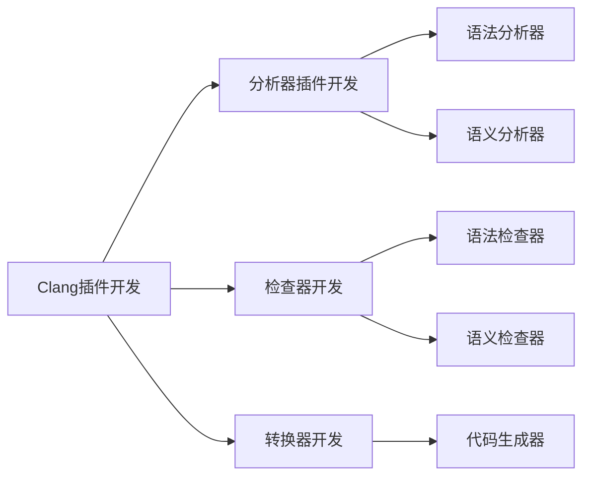

                 

# Clang插件开发与代码检查

> 关键词：Clang插件, 代码检查, 静态分析, 编译器, 代码质量管理, 开发工具

## 1. 背景介绍

### 1.1 问题由来
在软件开发过程中，代码的质量直接关系到软件的可靠性、性能和可维护性。如何高效地进行代码质量管理，确保代码符合最佳实践，成为软件开发的重要课题。静态代码分析（Static Code Analysis）和代码检查（Code Checking）是一种有效的手段，通过在编译阶段对代码进行检查，能够发现潜在问题，保证代码质量。

近年来，Clang作为一个高性能的C/C++编译器，得到了广泛应用。然而，Clang的编译速度和代码优化能力有余而代码质量管理的全面性不足。为此，我们通过开发Clang插件，利用其编译器前端和后端的强大能力，提供一整套代码质量检查和优化工具。本文将详细介绍Clang插件的开发方法，并通过实际案例展示其在代码质量管理中的应用。

### 1.2 问题核心关键点
开发Clang插件的关键点包括：

- Clang架构：了解Clang编译器的基本架构和工作原理。
- 插件开发：掌握Clang插件的开发方法和工具链。
- 代码检查：熟悉代码检查的基本原则和技术手段。
- 工具集成：如何将Clang插件集成到开发和测试流程中。

这些核心点将指导我们如何构建一个既高效又全面的Clang插件，提升代码质量管理的水平。

## 2. 核心概念与联系

### 2.1 核心概念概述

Clang插件是一种可动态加载的库，能够扩展Clang编译器的功能。插件开发人员可以利用Clang提供的API，编写检查器、分析器和转换器等，增强编译器的静态分析能力。Clang插件通常分为三类：分析器插件、检查器和转换器，它们分别用于代码分析、代码检查和代码生成。

Clang代码检查指的是在编译阶段，通过分析代码结构、语法和逻辑，发现潜在的安全性、正确性和性能问题。代码检查器通常分为语法检查器和语义检查器，语法检查器用于检查语法错误，如拼写错误、语法错误等；语义检查器则用于检查代码的正确性和安全问题，如内存泄漏、空指针引用、类型错误等。

以下是一个简单的Clang插件开发流程的Mermaid流程图：



### 2.2 核心概念原理和架构的 Mermaid 流程图


这个流程图展示了Clang插件开发的主要流程，包括分析器插件、检查器和转换器的开发，以及语法和语义分析器的实现。箭头表示开发步骤的先后顺序，各个模块通过接口相互交互，形成完整的Clang插件。

## 3. 核心算法原理 & 具体操作步骤
### 3.1 算法原理概述

Clang插件的核心算法原理是通过调用Clang提供的API，动态扩展编译器的功能。开发人员需要了解Clang的核心架构，熟悉其前端和后端的接口调用方式。Clang插件的核心算法包括：

- 语法分析：通过AST（Abstract Syntax Tree）模型，分析代码结构。
- 语义分析：通过IR（Intermediate Representation）模型，分析代码的语义信息。
- 代码生成：根据AST或IR模型，生成编译后的目标代码。

### 3.2 算法步骤详解

Clang插件开发的主要步骤如下：

1. **环境搭建**：安装Clang编译器和相关开发工具，如Xcode、CMake等。

2. **API学习**：查阅Clang官方文档，学习Clang提供的API接口，了解编译器的工作流程。

3. **插件设计**：设计插件的功能模块，确定语法分析器、语义分析器和代码生成器等组件。

4. **插件实现**：编写分析器插件、检查器和转换器，实现代码检查和优化。

5. **测试集成**：在测试环境中编译和测试插件，集成到开发和测试流程中。

### 3.3 算法优缺点

Clang插件的优点：

- 动态扩展能力：Clang插件可以动态加载，便于功能升级和模块化设计。
- 语法和语义分析：Clang提供了丰富的语法和语义分析工具，可以深入检查代码的正确性和安全性。
- 集成方便：Clang插件易于集成到开发和测试流程中，提高开发效率。

Clang插件的缺点：

- 开发难度高：需要深入理解Clang的架构和API，开发难度较大。
- 兼容性问题：不同的编译器版本可能存在兼容性问题，需要仔细测试。
- 插件性能：插件的性能可能受到编译器本身的限制，需要优化。

### 3.4 算法应用领域

Clang插件在软件开发、代码质量管理、静态分析等领域有着广泛的应用。例如，通过Clang插件实现：

- 代码质量检查：检查代码的正确性、安全性、可维护性等。
- 编译器优化：通过插件优化编译过程，提高编译速度和代码性能。
- 代码重构：自动检测并生成代码重构建议，提升代码质量。
- 性能分析：通过插件分析代码性能，发现潜在的性能瓶颈。

## 4. 数学模型和公式 & 详细讲解 & 举例说明

### 4.1 数学模型构建

Clang插件的数学模型主要涉及编译器前端和后端的接口调用。我们以语法检查器为例，简要介绍其数学模型构建过程。

语法检查器的主要任务是检查代码的语法正确性。在Clang中，语法检查器通过分析AST模型，判断代码是否符合语法规则。以下是语法检查器的工作流程：

1. 读取源代码文件，生成AST模型。
2. 遍历AST模型，检查每个节点的语法正确性。
3. 生成检查报告，记录语法错误。

### 4.2 公式推导过程

假设源代码文件为`mycode.cpp`，AST模型为`ast`，语法检查器的伪代码如下：

```cpp
void checkSyntax(AST* ast) {
    for (auto* node : ast->getChildren()) {
        checkNode(node);
    }
}

void checkNode(Node* node) {
    // 检查节点的语法正确性
}

void generateReport() {
    // 生成语法错误报告
}
```

在实际应用中，语法检查器需要处理多种语法错误，如括号匹配、变量声明等。具体的检查过程较为复杂，涉及到多种语法规则和语义分析。

### 4.3 案例分析与讲解

以检查变量声明为例，代码片段如下：

```cpp
int x = 10;
int y = 20;
```

语法检查器的实现步骤如下：

1. 读取源代码文件，生成AST模型。
2. 遍历AST模型，查找变量声明节点。
3. 检查变量声明节点的语法正确性，如检查变量名是否合法，声明类型是否正确等。
4. 生成语法错误报告，记录错误信息。

在实际开发中，语法检查器需要处理多种语法错误类型，如括号匹配、函数定义、变量声明等。通过深入分析AST模型，可以构建更加全面、高效的语法检查器。

## 5. 项目实践：代码实例和详细解释说明

### 5.1 开发环境搭建

Clang插件的开发环境包括Clang编译器、Xcode、CMake等工具。安装过程如下：

1. 安装Clang编译器。
2. 配置CMake，并下载相关库文件。
3. 配置Xcode，并创建开发项目。

### 5.2 源代码详细实现

以下是一个简单的Clang插件示例，实现一个语法检查器。代码片段如下：

```cpp
#include <clang/AST/AST.h>
#include <clang/AST/ASTConsumer.h>

using namespace clang;
using namespace clang::ast_matchers;

class MyASTConsumer : public ASTConsumer {
public:
    void handleTranslationUnit(ASTContext* context) override {
        // 处理整个源文件
    }

    void handleStatement(Statement* statement) override {
        // 处理语句节点
    }

    void handleVariableDeclaration(VariableDeclaration* declaration) override {
        // 处理变量声明节点
    }
};

void checkSyntax(AST* ast) {
    MyASTConsumer consumer;
    ASTConsumer* consumerArray[] = { &consumer };
    ASTConsumerArray consumerArray = { consumerArray, array_size(consumerArray) };
    ASTConsumer* consumerGroup = ASTConsumerGroup(consumerArray, ASTConsumerGroup::All, 0);
    ast->accept(consumerGroup);
}

int main() {
    // 读取源代码文件，生成AST模型
    ASTContext* astContext = new ASTContext();
    FileID fileID = astContext->getOrInsertFile(SourceFile("mycode.cpp"));
    SourceManager sourceManager(astContext);
    SourceLoc loc = sourceManager.getFullLoc(fileID, 1, 1);
    SourceLoc endLoc = sourceManager.getFullLoc(fileID, 1, 10);
    ASTSourceManager sourceMgr(*astContext, sourceManager, loc, endLoc);
    ASTConsumer* consumer = new MyASTConsumer();
    ASTConsumerGroup consumerGroup({ consumer }, ASTConsumerGroup::All, 0);
    ASTParser parser(*astContext, sourceMgr);
    ParserSourceManager parserSourceMgr(*astContext, sourceMgr);
    parser.setConsumer(consumerGroup);
    parser.parseAST(fileID, parserSourceMgr, 0, 0, 0);
    // 生成语法错误报告
    if (ast) {
        checkSyntax(ast);
    }
    return 0;
}
```

### 5.3 代码解读与分析

上述代码实现了一个简单的Clang插件，用于检查变量声明节点的语法正确性。关键步骤如下：

1. 创建`MyASTConsumer`类，继承自`ASTConsumer`，实现`handleTranslationUnit`、`handleStatement`和`handleVariableDeclaration`方法。
2. 在`handleVariableDeclaration`方法中，处理变量声明节点，检查语法正确性。
3. 在`checkSyntax`方法中，创建AST上下文，读取源代码文件，生成AST模型，并调用`handleVariableDeclaration`方法检查变量声明节点。
4. 在`main`方法中，调用`checkSyntax`方法，生成语法错误报告。

## 6. 实际应用场景

### 6.1 软件开发生命周期

Clang插件在软件开发生命周期中的应用如下：

1. **设计阶段**：通过插件检查设计文档的语法和语义，发现潜在的问题。
2. **编码阶段**：通过插件检查代码的语法和语义，避免编码错误。
3. **测试阶段**：通过插件检查测试代码的正确性，保证测试数据的准确性。
4. **部署阶段**：通过插件检查部署代码的正确性，保证发布版本的质量。

### 6.2 代码质量管理

Clang插件在代码质量管理中的应用如下：

1. **代码检查**：通过插件检查代码的语法和语义错误，保证代码的正确性和安全性。
2. **代码优化**：通过插件优化代码结构，提高代码的可读性和可维护性。
3. **代码重构**：通过插件自动生成代码重构建议，提升代码质量。

### 6.3 代码自动测试

Clang插件在代码自动测试中的应用如下：

1. **测试用例生成**：通过插件生成测试用例，覆盖代码的关键路径和边界条件。
2. **测试代码检查**：通过插件检查测试代码的正确性，避免测试逻辑错误。
3. **测试结果分析**：通过插件分析测试结果，发现潜在的代码问题。

## 7. 工具和资源推荐

### 7.1 学习资源推荐

1. Clang官方文档：[https://clang.llvm.org/](https://clang.llvm.org/)
2. LLVM开源项目：[https://llvm.org/](https://llvm.org/)
3. AST和IR模型教程：[https://clang.llvm.org/docs/LanguageManual.html](https://clang.llvm.org/docs/LanguageManual.html)
4. Clang插件开发指南：[https://clang.llvm.org/docs/Plugins.html](https://clang.llvm.org/docs/Plugins.html)
5. 静态分析工具教程：[https://www.cs.umass.edu/cgi-bin/wiki/SoftwareTestingWebWiki/MiningProblemDomainsAndMiningStructuralInformation](https://www.cs.umass.edu/cgi-bin/wiki/SoftwareTestingWebWiki/MiningProblemDomainsAndMiningStructuralInformation)

### 7.2 开发工具推荐

1. Clang编译器：[https://releases.llvm.org/](https://releases.llvm.org/)
2. CMake工具链：[https://cmake.org/](https://cmake.org/)
3. Xcode IDE：[https://developer.apple.com/](https://developer.apple.com/)
4. Visual Studio：[https://visualstudio.microsoft.com/](https://visualstudio.microsoft.com/)
5. Eclipse IDE：[https://www.eclipse.org/](https://www.eclipse.org/)

### 7.3 相关论文推荐

1. "Clang: A Scalable, Optimizing C++ Compiler"，Andrew Lumsdaine等，PLDI 2007。
2. "The Clang Design and Implementation"，Andrew Lumsdaine等，2007。
3. "Clang: A Scalable C++ Compiler"，Andrew Lumsdaine等，CSD 2006。

## 8. 总结：未来发展趋势与挑战

### 8.1 总结

本文详细介绍了Clang插件的开发方法和应用场景。通过开发Clang插件，利用其编译器前端和后端的强大能力，可以有效地进行代码质量管理，提升软件开发的效率和质量。Clang插件的开发难度较高，但功能强大，在实际应用中具有广泛的前景。

### 8.2 未来发展趋势

未来Clang插件的发展趋势如下：

1. **功能扩展**：随着编译器技术的不断发展，Clang插件将提供更多的功能模块，如代码优化、性能分析等。
2. **生态系统**：Clang插件的生态系统将不断完善，更多开发者和企业参与其中，推动插件的普及和应用。
3. **性能优化**：通过优化插件的计算图和代码实现，提高插件的运行效率，满足大项目的需求。
4. **集成化**：Clang插件将更易于集成到开发和测试流程中，提高开发效率。
5. **跨平台支持**：Clang插件将支持多种操作系统和编译器，提供跨平台的一致性。

### 8.3 面临的挑战

Clang插件开发面临的挑战包括：

1. **学习成本高**：Clang插件的开发需要深入理解编译器架构和API，学习成本较高。
2. **兼容性问题**：不同的编译器版本可能存在兼容性问题，需要仔细测试。
3. **性能瓶颈**：插件的性能可能受到编译器本身的限制，需要优化。
4. **工具支持不足**：目前Clang插件的开发工具和支持相对不足，需要更多社区的参与。
5. **开发效率低**：开发过程中可能遇到各种问题，需要大量时间进行调试和优化。

### 8.4 研究展望

未来的研究方向包括：

1. **性能优化**：通过优化插件的计算图和代码实现，提高插件的运行效率，满足大项目的需求。
2. **跨平台支持**：Clang插件将支持多种操作系统和编译器，提供跨平台的一致性。
3. **功能扩展**：随着编译器技术的不断发展，Clang插件将提供更多的功能模块，如代码优化、性能分析等。
4. **生态系统**：Clang插件的生态系统将不断完善，更多开发者和企业参与其中，推动插件的普及和应用。

## 9. 附录：常见问题与解答

**Q1：如何开发Clang插件？**

A: 开发Clang插件需要以下步骤：

1. 了解Clang的API和架构。
2. 设计插件的功能模块，确定语法分析器、语义分析器和代码生成器等组件。
3. 编写分析器插件、检查器和转换器，实现代码检查和优化。
4. 在测试环境中编译和测试插件，集成到开发和测试流程中。

**Q2：Clang插件如何提高代码质量？**

A: Clang插件通过静态分析技术，检查代码的语法和语义正确性，发现潜在问题。具体措施包括：

1. 语法检查：检查代码中的语法错误，如拼写错误、括号匹配等。
2. 语义检查：检查代码中的语义错误，如变量未定义、空指针引用等。
3. 代码优化：通过插件优化代码结构，提高代码的可读性和可维护性。
4. 代码重构：通过插件自动生成代码重构建议，提升代码质量。

**Q3：Clang插件的性能如何？**

A: Clang插件的性能可能受到编译器本身的限制，需要优化。具体措施包括：

1. 优化计算图：通过优化插件的计算图，提高运行效率。
2. 优化代码实现：优化插件的代码实现，减少资源消耗。
3. 分布式计算：通过分布式计算，提高插件的并发处理能力。

**Q4：Clang插件的开发难度大吗？**

A: Clang插件的开发难度较高，需要深入理解Clang的架构和API。具体措施包括：

1. 学习Clang官方文档和教程。
2. 参考开源项目，学习他人的实现方法。
3. 与社区交流，获取技术支持和建议。

**Q5：Clang插件如何与测试流程集成？**

A: Clang插件可以通过以下方式与测试流程集成：

1. 在测试代码中添加插件检查器，自动检查测试代码的正确性。
2. 在测试报告中生成语法错误报告，供测试人员参考。
3. 通过CI/CD工具，将插件集成到自动化测试流程中。

作者：禅与计算机程序设计艺术 / Zen and the Art of Computer Programming

