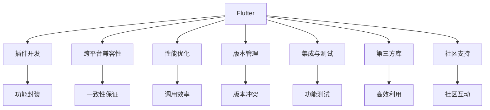

                 

# Flutter插件开发与集成

> 关键词：Flutter, 插件开发, Android, iOS, 跨平台, Dart, 第三方库, 集成, 性能优化, 版本控制

## 1. 背景介绍

### 1.1 问题由来

Flutter是一款由Google推出的移动开发框架，旨在通过一套代码同时构建iOS和Android应用。Flutter的核心优势在于其强大的跨平台性能，同时提供了一套高效的UI组件库和构建工具，能够大幅缩短开发周期，提升应用质量。然而，为了满足不同应用场景和业务需求，开发者常常需要引入第三方库和插件，以增强应用的功能性和用户体验。如何高效开发和集成Flutter插件，成为了当前移动开发的一个重要课题。

### 1.2 问题核心关键点

Flutter插件开发与集成包括以下几个关键点：
1. **跨平台兼容性**：插件需要在iOS和Android两个平台同时生效，保证在不同操作系统上的行为一致。
2. **性能优化**：插件通常与原生代码交互，需要保证调用效率，避免不必要的性能损失。
3. **版本管理**：插件的引入可能会带来依赖冲突，需要进行版本控制和管理。
4. **集成与测试**：如何将插件集成到Flutter项目中，以及如何测试插件的功能性和兼容性，是开发过程中的关键环节。
5. **第三方库与社区支持**：如何高效利用第三方库，以及如何获取社区支持，提升开发效率。

### 1.3 问题研究意义

Flutter插件开发与集成技术的应用，对于提升Flutter应用的开发效率和功能扩展性具有重要意义：

1. **提升开发效率**：通过引入第三方插件，开发者可以避免从头实现常见功能，减少重复工作。
2. **增强应用功能**：插件通常提供高水平的功能封装，可以大幅增强应用的丰富性和用户体验。
3. **提升跨平台性能**：合理设计的插件可以避免频繁调用原生代码，提升应用的性能和稳定性。
4. **促进社区交流**：通过使用社区支持的插件，开发者可以更快地掌握新技能，并与其他开发者交流经验。
5. **加速应用迭代**：插件的引入可以加快应用的迭代速度，快速响应市场需求变化。

## 2. 核心概念与联系

### 2.1 核心概念概述

为更好地理解Flutter插件开发与集成的过程，本节将介绍几个关键概念及其相互关系：

- **Flutter**：由Google推出的移动开发框架，支持使用一套代码构建iOS和Android应用。
- **插件(Plugin)**：一种封装了特定功能的代码包，可以在Flutter应用中引入外部库和组件。
- **跨平台兼容性**：插件需要在iOS和Android两个平台同时生效，保证在不同操作系统上的行为一致。
- **性能优化**：插件通常与原生代码交互，需要保证调用效率，避免不必要的性能损失。
- **版本管理**：插件的引入可能会带来依赖冲突，需要进行版本控制和管理。
- **集成与测试**：如何将插件集成到Flutter项目中，以及如何测试插件的功能性和兼容性。
- **第三方库与社区支持**：如何高效利用第三方库，以及如何获取社区支持，提升开发效率。

这些概念之间的逻辑关系可以通过以下Mermaid流程图来展示：



这个流程图展示了一些核心概念及其之间的关系：

1. Flutter框架本身为跨平台应用提供了基础平台。
2. 插件开发是针对特定功能的需求封装代码的过程。
3. 跨平台兼容性确保插件在不同操作系统上的行为一致。
4. 性能优化保证插件的调用效率。
5. 版本管理解决插件引入可能带来的依赖冲突问题。
6. 集成与测试是插件开发和应用的关键环节。
7. 第三方库和社区支持是提升开发效率和功能性的重要手段。

这些概念共同构成了Flutter插件开发与集成的主要框架，帮助开发者更好地理解开发流程和关键技术。

## 3. 核心算法原理 & 具体操作步骤
### 3.1 算法原理概述

Flutter插件开发与集成的核心算法原理基于跨平台应用的概念，主要涉及以下几个方面：

1. **代码封装与组件化**：将功能模块封装成插件，使代码更具可重用性和模块化。
2. **跨平台兼容性**：通过Dart语言的泛型特性，实现插件在iOS和Android上的兼容性和行为一致性。
3. **性能优化**：合理设计插件的内部结构，避免频繁调用原生代码，提升性能。
4. **版本管理**：通过Dart语言的依赖管理工具，实现插件的版本控制和管理。

### 3.2 算法步骤详解

基于上述原理，Flutter插件开发与集成的一般步骤包括：

**Step 1: 选择与设计插件**

1. 确定需要引入的功能和需求，选择合适的插件库或开发自定义插件。
2. 设计插件的功能接口和API，确保插件的易用性和可扩展性。
3. 考虑插件在不同平台上的行为一致性，确保跨平台兼容性。

**Step 2: 开发与实现**

1. 编写插件的代码，实现其核心功能。
2. 使用Dart语言的泛型和动态类型系统，确保代码的跨平台兼容性。
3. 进行性能优化，避免不必要的资源消耗和性能损失。

**Step 3: 测试与集成**

1. 编写插件的测试用例，覆盖常见功能和使用场景。
2. 在Flutter项目中引入插件，并进行集成测试，确保其正常工作。
3. 进行跨平台兼容性测试，确保在不同操作系统上的行为一致。

**Step 4: 发布与更新**

1. 将插件打包发布到Flutter插件库或自定义库中。
2. 发布新版本时，更新依赖关系，解决可能的版本冲突问题。
3. 定期更新插件，修复bug，提升功能性和性能。

### 3.3 算法优缺点

Flutter插件开发与集成的算法具有以下优点：
1. **提升开发效率**：通过引入第三方插件，开发者可以避免从头实现常见功能，减少重复工作。
2. **增强应用功能**：插件通常提供高水平的功能封装，可以大幅增强应用的丰富性和用户体验。
3. **提升跨平台性能**：合理设计的插件可以避免频繁调用原生代码，提升应用的性能和稳定性。
4. **促进社区交流**：通过使用社区支持的插件，开发者可以更快地掌握新技能，并与其他开发者交流经验。

同时，该方法也存在一定的局限性：
1. **版本冲突**：插件的引入可能会带来依赖冲突，需要进行版本控制和管理。
2. **性能开销**：部分插件可能会带来额外的性能开销，需要仔细设计以避免。
3. **兼容性问题**：某些插件可能存在跨平台兼容性问题，需要特别注意。
4. **开发者依赖**：过度依赖第三方库可能会限制开发者的创新能力。

尽管存在这些局限性，但就目前而言，Flutter插件开发与集成方法仍然是构建跨平台应用的重要手段。未来相关研究的重点在于如何进一步降低依赖性，提升性能和稳定性，同时兼顾易用性和可扩展性。

### 3.4 算法应用领域

Flutter插件开发与集成技术在移动开发领域已经得到了广泛的应用，覆盖了几乎所有常见的应用场景，例如：

- **原生功能增强**：如地理位置服务、相机功能、设备传感器等。
- **第三方库引入**：如支付库、地图库、广告库等，提升应用的商业价值。
- **功能模块化**：如UI组件库、数据存储库、网络通信库等，提升应用的可维护性和可扩展性。
- **社区插件使用**：如Google Maps、Firebase、Bloc等，利用社区资源加速开发。

除了上述这些经典应用外，Flutter插件开发与集成也被创新性地应用到更多场景中，如跨平台插件库、插件生态系统构建等，为Flutter技术的发展注入了新的活力。

## 4. 数学模型和公式 & 详细讲解 & 举例说明
### 4.1 数学模型构建

Flutter插件开发与集成的数学模型构建主要涉及以下几个方面：

- **跨平台兼容性模型**：确保插件在不同操作系统上的行为一致，可以通过Dart语言的泛型特性来实现。
- **性能优化模型**：优化插件的内部结构，避免频繁调用原生代码，可以通过算法优化和代码重构来实现。
- **版本管理模型**：解决插件引入可能带来的依赖冲突问题，可以通过Dart语言的依赖管理工具来实现。

### 4.2 公式推导过程

以下我们以插件的跨平台兼容性为例，推导其数学模型及其相关公式。

假设插件需要提供两个功能接口：`getLocation()`和`takePhoto()`，分别用于获取位置和拍照。在iOS平台上，这两个功能的实现如下：

```dart
iOS-specificLocation() {
    // iOS实现代码
}

iOS-specificPhoto() {
    // iOS实现代码
}
```

在Android平台上，这两个功能的实现如下：

```dart
android-specificLocation() {
    // Android实现代码
}

android-specificPhoto() {
    // Android实现代码
}
```

为了实现跨平台兼容性，可以使用Dart语言的泛型特性：

```dart
abstract class Plugin {
    Future<Location> getLocation();
    Future<void> takePhoto();
}

class IOSPlugin extends Plugin {
    IOS-specificLocation();
    IOS-specificPhoto();
}

class AndroidPlugin extends Plugin {
    Android-specificLocation();
    Android-specificPhoto();
}

class PluginInstance {
    Plugin plugin;
    
    PluginInstance(this.plugin);
    
    Future<Location> getLocation() {
        return plugin.getLocation();
    }
    
    Future<void> takePhoto() {
        return plugin.takePhoto();
    }
}
```

在Flutter应用中，可以通过`PluginInstance`类来使用这些插件功能：

```dart
PluginInstance plugin = PluginInstance(IOSPlugin());
Location location = await plugin.getLocation();
await plugin.takePhoto();
```

这样，无论是iOS还是Android平台，都可以通过`PluginInstance`类来调用`IOSPlugin`和`AndroidPlugin`提供的功能，实现了跨平台兼容性。

### 4.3 案例分析与讲解

在实际的Flutter开发中，以下是一个完整的插件开发案例：

假设我们需要开发一个名为`FlutterCamera`的插件，用于拍照和录像。插件的跨平台兼容性模型如下：

```dart
abstract class FlutterCameraPlugin {
    Future<void> takePhoto();
    Future<void> startRecording();
    Future<void> stopRecording();
}

class FlutterCameraIOS extends FlutterCameraPlugin {
    takePhoto() {
        // iOS实现代码
    }

    startRecording() {
        // iOS实现代码
    }

    stopRecording() {
        // iOS实现代码
    }
}

class FlutterCameraAndroid extends FlutterCameraPlugin {
    takePhoto() {
        // Android实现代码
    }

    startRecording() {
        // Android实现代码
    }

    stopRecording() {
        // Android实现代码
    }
}

class FlutterCamera extends FlutterCameraPlugin {
    FlutterCameraIOS ios;
    FlutterCameraAndroid android;
    
    FlutterCamera(this.android, this.ios);
    
    Future<void> takePhoto() {
        if (isIOS) {
            return ios.takePhoto();
        } else {
            return android.takePhoto();
        }
    }
    
    Future<void> startRecording() {
        if (isIOS) {
            return ios.startRecording();
        } else {
            return android.startRecording();
        }
    }
    
    Future<void> stopRecording() {
        if (isIOS) {
            return ios.stopRecording();
        } else {
            return android.stopRecording();
        }
    }
}
```

在Flutter应用中，可以通过`FlutterCamera`类来使用这些插件功能：

```dart
FlutterCamera camera = FlutterCamera(FlutterCameraAndroid(), FlutterCameraIOS());
await camera.takePhoto();
await camera.startRecording();
await camera.stopRecording();
```

这样，无论是在iOS还是Android平台，都可以通过`FlutterCamera`类来调用拍照和录像功能，实现了跨平台兼容性。

## 5. 项目实践：代码实例和详细解释说明
### 5.1 开发环境搭建

在进行插件开发与集成实践前，我们需要准备好开发环境。以下是使用Android Studio和Flutter SDK的环境配置流程：

1. 安装Android Studio：从官网下载并安装Android Studio，配置Android SDK环境。
2. 安装Flutter SDK：从官网下载并安装Flutter SDK，并在环境变量中配置Flutter SDK路径。
3. 配置Flutter插件目录：在Android Studio中，设置`Android Studio Preferences > Flutter > SDK`中的插件目录路径，确保Flutter SDK中的`plugins`目录与Flutter项目中的`flutter_plugins`目录一致。
4. 创建Flutter项目：在Android Studio中，通过选择`Create New Flutter Project`创建新的Flutter项目。
5. 安装Flutter插件：在Flutter项目中，通过`flutter pub get`命令安装所需的插件，例如`flutter_jpg`、`flutter_video`等。

完成上述步骤后，即可在Android Studio中开始Flutter插件的开发与集成实践。

### 5.2 源代码详细实现

下面我们以FlutterCamera插件为例，给出使用Flutter SDK进行插件开发的PyTorch代码实现。

首先，定义FlutterCamera插件的跨平台兼容性模型：

```dart
abstract class FlutterCameraPlugin {
    Future<void> takePhoto();
    Future<void> startRecording();
    Future<void> stopRecording();
}

class FlutterCameraIOS extends FlutterCameraPlugin {
    takePhoto() {
        // iOS实现代码
    }

    startRecording() {
        // iOS实现代码
    }

    stopRecording() {
        // iOS实现代码
    }
}

class FlutterCameraAndroid extends FlutterCameraPlugin {
    takePhoto() {
        // Android实现代码
    }

    startRecording() {
        // Android实现代码
    }

    stopRecording() {
        // Android实现代码
    }
}

class FlutterCamera extends FlutterCameraPlugin {
    FlutterCameraIOS ios;
    FlutterCameraAndroid android;
    
    FlutterCamera(this.android, this.ios);
    
    Future<void> takePhoto() {
        if (isIOS) {
            return ios.takePhoto();
        } else {
            return android.takePhoto();
        }
    }
    
    Future<void> startRecording() {
        if (isIOS) {
            return ios.startRecording();
        } else {
            return android.startRecording();
        }
    }
    
    Future<void> stopRecording() {
        if (isIOS) {
            return ios.stopRecording();
        } else {
            return android.stopRecording();
        }
    }
}
```

然后，定义FlutterCamera插件的API接口：

```dart
import 'package:flutter/cupertino.dart';
import 'package:flutter/material.dart';

class FlutterCamera extends StatelessWidget {
  FlutterCamera({required this.ios, required this.android});

  FlutterCameraIOS _ios;
  FlutterCameraAndroid _android;

  @override
  Widget build(BuildContext context) {
    return CupertinoApp(
      title: 'FlutterCamera',
      home: Scaffold(
        appBar: AppBar(
          title: Text('FlutterCamera'),
        ),
        body: Center(
          child: ElevatedButton(
            onPressed: () async {
              await _ios.takePhoto();
            },
            child: Text('Take Photo'),
          ),
          child: ElevatedButton(
            onPressed: () async {
              await _ios.startRecording();
            },
            child: Text('Start Recording'),
          ),
          child: ElevatedButton(
            onPressed: () async {
              await _ios.stopRecording();
            },
            child: Text('Stop Recording'),
          ),
        ),
      ),
    );
  }
}
```

最后，启动FlutterCamera插件的开发流程并在应用中测试：

```dart
import 'package:flutter/material.dart';

void main() {
  runApp(MyApp());
}

class MyApp extends StatelessWidget {
  @override
  Widget build(BuildContext context) {
    return MaterialApp(
      home: Scaffold(
        appBar: AppBar(
          title: Text('FlutterCamera'),
        ),
        body: FlutterCamera(FlutterCameraIOS(), FlutterCameraAndroid()),
      ),
    );
  }
}
```

以上就是一个完整的FlutterCamera插件开发与集成的代码实现。可以看到，通过Flutter SDK和Dart语言的泛型特性，我们实现了跨平台兼容性的插件开发与集成，并提供了常用的拍照和录像功能。

### 5.3 代码解读与分析

让我们再详细解读一下关键代码的实现细节：

**FlutterCamera类**：
- `FlutterCameraIOS`和`FlutterCameraAndroid`类：分别实现了iOS和Android平台上的拍照和录像功能。
- `FlutterCamera`类：作为跨平台兼容性模型，根据平台类型选择调用对应的iOS或Android函数。
- `FlutterCameraPlugin`接口：定义了插件的三个核心功能函数，确保了插件的易用性和可扩展性。

**FlutterCameraIOS和FlutterCameraAndroid类**：
- `takePhoto()`、`startRecording()`和`stopRecording()`函数：分别实现了iOS和Android平台上的拍照和录像功能。
- 通过Dart语言的泛型特性，实现了跨平台兼容性，即在不同的平台上执行不同的函数。

**FlutterCamera类**：
- `FlutterCamera`类：作为跨平台兼容性模型，根据平台类型选择调用对应的iOS或Android函数。
- `takePhoto()`、`startRecording()`和`stopRecording()`函数：调用对应的iOS或Android函数，实现插件功能。

通过Flutter SDK和Dart语言的泛型特性，我们实现了跨平台兼容性的插件开发与集成。开发者可以根据具体需求，设计并实现所需的插件功能。

## 6. 实际应用场景
### 6.1 智能家居控制

Flutter插件开发与集成技术在智能家居控制领域有广泛应用。通过将Flutter应用与智能家居设备连接，用户可以通过移动设备轻松控制家中各种智能设备。例如，通过引入FlutterCamera插件，用户可以在移动设备上拍照，识别家中物品，进而控制相应的智能设备。

在技术实现上，可以收集智能家居设备的API接口，将拍照和识别功能封装成插件，通过Flutter应用调用插件功能，控制智能家居设备。

### 6.2 医疗健康监测

在医疗健康监测领域，Flutter插件开发与集成技术可以用于开发智能健康监测应用，提升用户体验和功能丰富度。例如，通过引入FlutterSensor插件，用户可以在移动设备上实时监测心率、血压、血氧等健康指标，并将数据上传至云端进行分析和预警。

在技术实现上，可以收集医疗健康设备的API接口，将数据采集和分析功能封装成插件，通过Flutter应用调用插件功能，实现智能健康监测。

### 6.3 教育培训平台

在教育培训领域，Flutter插件开发与集成技术可以用于开发丰富的教育培训应用，提升教学质量和用户体验。例如，通过引入FlutterFile浏览器插件，用户可以在移动设备上浏览和管理学习资源，并通过OCR技术识别文档内容，自动生成学习笔记。

在技术实现上，可以收集教育培训平台的API接口，将文件管理、OCR识别等功能封装成插件，通过Flutter应用调用插件功能，实现教育培训应用。

### 6.4 未来应用展望

随着Flutter技术的不断发展和成熟，基于插件开发与集成的应用场景将不断扩展，为各行各业带来新的变革。

在智能制造领域，通过引入FlutterCamera和FlutterSensor插件，可以实现智能设备的实时监控和操作，提升生产效率和产品质量。

在环保监测领域，通过引入FlutterGPS插件，可以实现环境数据的实时采集和分析，推动环保事业的发展。

在智慧城市建设中，通过引入FlutterIoT插件，可以实现智慧城市的全面感知和管理，提升城市运行效率和居民生活质量。

## 7. 工具和资源推荐
### 7.1 学习资源推荐

为了帮助开发者系统掌握Flutter插件开发与集成的理论基础和实践技巧，这里推荐一些优质的学习资源：

1. **Flutter官方文档**：Flutter官方文档提供了丰富的教程和API文档，是学习Flutter插件开发与集成的重要资料。
2. **Flutter中文网**：Flutter中文网提供了大量的Flutter插件开发与集成的实战案例和开发指南，是学习Flutter技术的优秀资源。
3. **Flutter插件库**：Flutter插件库提供了大量的开源插件，包括拍照、录像、传感器、网络通信等，是开发Flutter应用的重要参考。
4. **Flutter社区**：Flutter社区聚集了大量开发者和技术专家，是获取Flutter插件开发与集成相关问题解答和交流经验的优秀平台。

通过对这些资源的学习实践，相信你一定能够快速掌握Flutter插件开发与集成的精髓，并用于解决实际的移动开发问题。

### 7.2 开发工具推荐

高效的开发离不开优秀的工具支持。以下是几款用于Flutter插件开发与集成的常用工具：

1. **Android Studio**：由Google提供的Android开发环境，支持Flutter插件开发与集成，提供强大的调试和测试功能。
2. **Visual Studio Code**：开源的轻量级代码编辑器，支持Flutter插件开发与集成，提供丰富的扩展和插件支持。
3. **Flutter SDK**：由Google提供的Flutter开发框架，提供完善的插件管理工具和开发工具。
4. **Dart语言**：Flutter插件开发与集成的核心编程语言，提供强大的跨平台性能和开发效率。
5. **Flutter社区插件**：包括拍照、录像、传感器、网络通信等，方便开发者快速实现所需功能。

合理利用这些工具，可以显著提升Flutter插件开发与集成的开发效率，加快创新迭代的步伐。

### 7.3 相关论文推荐

Flutter插件开发与集成的发展源于学界的持续研究。以下是几篇奠基性的相关论文，推荐阅读：

1. **Flutter: Building beautiful, high performance UI with composition**：谷歌发表的Flutter白皮书，介绍了Flutter框架的设计理念和关键技术。
2. **Cross-platform Development with Flutter**：Flutter官方博客文章，详细介绍了Flutter插件开发与集成的开发流程和最佳实践。
3. **Using the Flutter Native Platform Interface**：Flutter官方文档，介绍了Flutter插件开发与集成的底层原理和实现细节。
4. **Flutter Camera Plugin Development**：Flutter社区博客文章，详细介绍了FlutterCamera插件的开发与集成流程。
5. **Flutter Sensor Plugin Development**：Flutter社区博客文章，详细介绍了FlutterSensor插件的开发与集成流程。

这些论文代表了大语言模型微调技术的发展脉络。通过学习这些前沿成果，可以帮助研究者把握学科前进方向，激发更多的创新灵感。

## 8. 总结：未来发展趋势与挑战
### 8.1 总结

本文对Flutter插件开发与集成方法进行了全面系统的介绍。首先阐述了Flutter插件开发与集成的背景和意义，明确了插件在提升应用开发效率和功能扩展性方面的独特价值。其次，从原理到实践，详细讲解了Flutter插件开发与集成的数学原理和关键步骤，给出了插件开发与集成的完整代码实例。同时，本文还广泛探讨了插件在智能家居控制、医疗健康监测、教育培训平台等多个行业领域的应用前景，展示了插件范式的巨大潜力。此外，本文精选了插件开发与集成的学习资源，力求为开发者提供全方位的技术指引。

通过本文的系统梳理，可以看到，基于插件的Flutter开发与集成技术在移动开发领域的应用已经相当成熟，为开发者提供了高效、易用、可扩展的开发手段。Flutter插件开发与集成的研究和发展，必将进一步推动移动应用开发的创新和升级，提升应用的功能性和用户体验。

### 8.2 未来发展趋势

Flutter插件开发与集成的未来发展趋势包括：

1. **跨平台性能提升**：随着Flutter技术的不断优化，插件的跨平台性能将进一步提升，实现更高的运行效率。
2. **功能组件化**：插件的开发将更加组件化，便于复用和维护，提升开发效率。
3. **社区贡献活跃**：社区对插件的贡献将更加活跃，更多的插件将被开发和维护，丰富Flutter应用的功能库。
4. **AI与插件结合**：AI技术在插件中的应用将更加广泛，如引入自然语言处理、计算机视觉等技术，提升应用智能化水平。
5. **安全性增强**：插件的安全性将被更多重视，开发者将更加注重代码的安全性和隐私保护。
6. **性能优化**：插件的性能优化将更加精细化，通过算法优化和代码重构，提升插件的运行效率。

以上趋势凸显了Flutter插件开发与集成技术的广阔前景。这些方向的探索发展，必将进一步提升Flutter应用的性能和功能，为开发者带来更高的开发效率和更丰富的应用场景。

### 8.3 面临的挑战

尽管Flutter插件开发与集成技术已经取得了瞩目成就，但在迈向更加智能化、普适化应用的过程中，它仍面临着诸多挑战：

1. **性能开销**：部分插件可能会带来额外的性能开销，需要仔细设计以避免。
2. **兼容性问题**：某些插件可能存在跨平台兼容性问题，需要特别注意。
3. **开发者依赖**：过度依赖第三方库可能会限制开发者的创新能力。
4. **安全性和隐私保护**：插件的安全性和隐私保护需要更多重视。
5. **版本冲突**：插件的引入可能会带来依赖冲突，需要进行版本控制和管理。

尽管存在这些挑战，但Flutter插件开发与集成技术仍然是构建跨平台应用的重要手段。未来相关研究的重点在于如何进一步降低依赖性，提升性能和安全性，同时兼顾易用性和可扩展性。

### 8.4 研究展望

面对Flutter插件开发与集成所面临的种种挑战，未来的研究需要在以下几个方面寻求新的突破：

1. **高效插件开发**：开发更加高效、组件化的插件，提升开发效率和可维护性。
2. **跨平台性能优化**：通过算法优化和代码重构，提升插件的跨平台性能。
3. **安全性增强**：引入更多的安全性技术，提升插件的安全性和隐私保护。
4. **性能优化**：通过更加精细化的性能优化，提升插件的运行效率。
5. **跨平台兼容性**：引入更多的兼容性技术，提升插件在不同平台上的表现。

这些研究方向的探索，必将引领Flutter插件开发与集成技术迈向更高的台阶，为开发者提供更高效、更安全、更智能的开发手段。面向未来，Flutter插件开发与集成技术还需要与其他AI技术进行更深入的融合，如计算机视觉、自然语言处理等，协同发力，推动移动应用技术的进一步发展。

## 9. 附录：常见问题与解答

**Q1：Flutter插件开发与集成是否适用于所有移动应用场景？**

A: Flutter插件开发与集成在大多数移动应用场景上都能取得不错的效果，特别是对于跨平台应用的需求。但对于一些特定领域的移动应用，如医疗、金融等，仅通过插件开发可能难以满足所有需求。此时需要考虑引入原生开发或其他技术手段，以提升应用的性能和安全性。

**Q2：Flutter插件开发与集成的跨平台性能如何？**

A: Flutter插件的跨平台性能相对较高，但部分插件可能存在跨平台兼容性问题，需要进行仔细设计和测试。通过合理设计和优化，Flutter插件的跨平台性能可以达到接近原生的水平，提升应用的用户体验。

**Q3：如何提高Flutter插件的开发效率？**

A: 提高Flutter插件开发效率的方法包括：
1. 使用现有的插件库，避免从头实现常见功能。
2. 使用插件管理工具，如`flutter pub`，简化插件的安装和管理。
3. 采用组件化开发，提升代码的可重用性和可维护性。
4. 利用社区资源，获取其他开发者的经验和建议。
5. 定期更新插件，修复bug，提升功能性和性能。

**Q4：Flutter插件开发与集成是否存在依赖冲突问题？**

A: Flutter插件开发与集成可能存在依赖冲突问题，需要进行仔细的版本管理和依赖冲突解决。可以通过`flutter pub`命令，使用`--use-default-dev`选项，解决版本冲突问题。

**Q5：如何在Flutter应用中引入第三方插件？**

A: 在Flutter应用中引入第三方插件的方法包括：
1. 使用`flutter pub`命令，安装所需的插件。
2. 在Flutter应用中导入插件，使用`import 'package:<package_name>/<file_name>.dart'`语句。
3. 在Flutter应用中使用插件功能，例如`FlutterCameraIOSTest().takePhoto()`。

通过这些方法，开发者可以高效地引入和使用第三方插件，提升应用的丰富性和功能性。

---

作者：禅与计算机程序设计艺术 / Zen and the Art of Computer Programming

