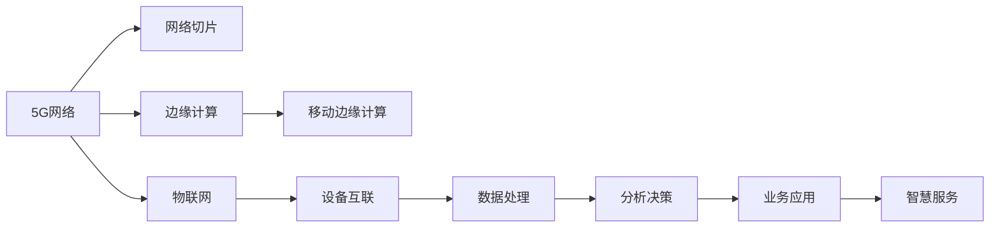

                 

# 5G 和物联网的融合：高性能和低延迟

## 1. 背景介绍

在5G时代，物联网（IoT）技术的快速发展将推动产业互联网的转型升级，成为驱动经济高质量发展的关键力量。5G与物联网的融合应用，在推动新型工业互联网、智慧城市、智慧医疗、智能制造等领域的应用，将释放出巨大潜力。然而，物联网的高度智能化与高密度部署对网络性能提出新的挑战，特别是在数据传输的速率、可靠性、时延等关键指标上。为解决这些问题，本文将从5G与物联网融合的角度出发，重点探讨基于高性能和低延迟的融合网络架构、关键技术和应用场景。

## 2. 核心概念与联系

### 2.1 核心概念概述

5G与物联网的融合离不开以下几个关键概念：

1. **5G网络**：5G网络是下一代移动通信网络，以更高带宽、更低时延、更大连接数的特性，满足5G时代万物互联的需求。
2. **物联网（IoT）**：物联网是通过互联网实现物体与物体之间互联互通的系统，推动智能制造、智慧医疗、智能交通等行业转型升级。
3. **网络切片（Network Slicing）**：网络切片是一种网络资源分配方法，将单一物理网络分为多个虚拟网络，用于不同的服务。
4. **边缘计算（Edge Computing）**：边缘计算是指将计算任务分布式部署在网络边缘，降低中心服务器的压力，提高计算效率。
5. **移动边缘计算（MEC）**：移动边缘计算是边缘计算在移动网络中的具体应用，提供更接近用户端的计算服务。

这些概念构成了5G与物联网融合的核心框架。通过网络切片、边缘计算等关键技术，可以优化网络资源配置，减少时延，提升网络性能，更好地支撑物联网的应用。

### 2.2 核心概念原理和架构的 Mermaid 流程图



## 3. 核心算法原理 & 具体操作步骤

### 3.1 算法原理概述

5G与物联网融合的关键在于实现高性能和低延迟的连接，提高网络的可靠性和响应速度。以下是核心的算法原理：

1. **网络切片（Network Slicing）**：通过网络切片技术，将5G网络划分为多个虚拟网络，每个虚拟网络用于特定的物联网应用。每个切片可以根据业务需求分配带宽、时延等资源，提升网络性能。
2. **边缘计算（Edge Computing）**：将计算任务分布在网络边缘的计算节点上，减少数据传输距离，降低时延，提高计算效率。
3. **移动边缘计算（MEC）**：将计算任务部署在靠近用户的移动网络边缘，通过本地计算和存储，实现更快的数据处理和响应。
4. **自动驾驶（Autonomous Driving）**：结合5G网络的高带宽和低时延特性，实现车辆间的智能通信和决策。
5. **智能制造（Smart Manufacturing）**：通过5G网络的低延迟和高效传输特性，实现设备间的智能协作和优化生产过程。

### 3.2 算法步骤详解

#### 3.2.1 网络切片

1. **切片配置**：根据物联网应用的带宽、时延需求，配置网络切片的资源参数。
2. **切片管理**：通过切片管理平台，动态调整切片的带宽、时延、优先级等参数。
3. **切片分配**：将业务请求分配到相应的网络切片，保证业务质量。

#### 3.2.2 边缘计算

1. **计算节点部署**：在网络边缘部署计算节点，支持数据处理、存储、分析等计算任务。
2. **任务调度**：通过任务调度算法，将计算任务分配给最合适的计算节点。
3. **数据传输**：在计算节点和用户之间实现高效的数据传输。

#### 3.2.3 移动边缘计算

1. **MEC节点部署**：在5G网络的移动网络边缘部署MEC节点，支持本地计算和存储。
2. **本地处理**：将计算任务分配到MEC节点上进行本地处理，减少延迟。
3. **本地存储**：将数据存储在MEC节点上，提高数据的访问速度。

#### 3.2.4 自动驾驶

1. **车辆互联**：通过5G网络实现车辆间的通信，共享环境信息和行驶路径。
2. **智能决策**：结合车辆位置、速度、方向等信息，进行智能决策，优化行驶路线。
3. **实时反馈**：通过低时延通信，实现实时反馈和调整，提高安全性和响应速度。

#### 3.2.5 智能制造

1. **设备互联**：通过5G网络实现设备间的通信，实现智能协同。
2. **实时监控**：通过低时延通信，实现实时监控和控制，优化生产过程。
3. **数据分析**：结合边缘计算和云端计算，对生产数据进行深度分析和优化。

### 3.3 算法优缺点

#### 3.3.1 网络切片

**优点**：
1. 根据应用需求灵活配置资源，提高网络性能。
2. 有效分离不同业务，降低干扰，提高网络稳定性。

**缺点**：
1. 切片管理复杂，需要动态调整和管理。
2. 切片间的资源分配和优化较难实现。

#### 3.3.2 边缘计算

**优点**：
1. 减少数据传输距离，降低时延。
2. 本地计算和存储，提高计算效率。

**缺点**：
1. 计算节点部署和维护成本高。
2. 数据安全问题，需要加强安全防护措施。

#### 3.3.3 移动边缘计算

**优点**：
1. 将计算任务分布式部署在网络边缘，减少时延。
2. 支持实时计算和存储，提高计算效率。

**缺点**：
1. 本地计算资源的分布性和异构性带来挑战。
2. 本地存储和数据管理复杂。

#### 3.3.4 自动驾驶

**优点**：
1. 实现车辆间的智能通信和协作，提高安全性。
2. 结合5G网络的高带宽和低时延特性，优化行驶路线。

**缺点**：
1. 需要高精度定位和传感器数据，成本较高。
2. 网络传输和计算负载较大，需要优化计算资源。

#### 3.3.5 智能制造

**优点**：
1. 实现设备间的智能协作，优化生产过程。
2. 通过实时监控和数据分析，提高生产效率和质量。

**缺点**：
1. 设备和数据管理复杂，需要标准化的数据协议。
2. 对网络带宽和时延要求较高，需要优化网络资源配置。

### 3.4 算法应用领域

5G与物联网的融合技术在多个领域有广泛的应用，以下是几个典型的应用场景：

1. **智慧城市**：通过5G网络实现智慧路灯、智能交通等设备的互联互通，提高城市管理水平。
2. **智慧医疗**：通过5G网络实现远程医疗、智能诊断等应用，提升医疗服务质量。
3. **智能制造**：通过5G网络实现设备间的智能协作和优化生产过程，提高生产效率。
4. **智能家居**：通过5G网络实现家居设备的智能控制和互联互通，提高生活质量。
5. **智能农业**：通过5G网络实现农田监测、智能灌溉等应用，提高农业生产效率。
6. **智能物流**：通过5G网络实现物流设备和仓储的智能管理，提高物流效率和安全性。

## 4. 数学模型和公式 & 详细讲解 & 举例说明

### 4.1 数学模型构建

为更好地理解5G与物联网融合的关键算法，本节将介绍几个关键数学模型：

1. **网络切片资源模型**：通过数学模型描述切片的带宽、时延等资源参数，以及切片之间的资源竞争关系。
2. **边缘计算任务调度模型**：通过数学模型描述计算任务的分配和调度，以及任务在计算节点上的执行过程。
3. **移动边缘计算资源管理模型**：通过数学模型描述MEC节点的计算和存储资源管理，以及边缘计算和云端计算的协同管理。

### 4.2 公式推导过程

以下是几个关键数学模型的公式推导：

#### 4.2.1 网络切片资源模型

1. **切片资源配置**：
   $$
   R_{i,j} = \left\{
   \begin{aligned}
   & R_i, & & \text{如果切片}i \text{满足业务需求} \\
   & 0, & & \text{否则}
   \end{aligned}
   \right.
   $$
   其中，$R_i$为切片$i$的带宽、时延等资源参数。

2. **切片管理优化**：
   $$
   \min \sum_{i=1}^n \sum_{j=1}^m c_{i,j}
   $$
   $$
   \text{约束条件}：
   \left\{
   \begin{aligned}
   & R_{i,j} \leq S_i, & & \text{切片}i \text{的资源限制} \\
   & R_{i,j} \geq d_{i,j}, & & \text{切片}i \text{的业务需求}
   \end{aligned}
   \right.
   $$
   其中，$c_{i,j}$为切片$i$分配到计算节点$j$的资源成本，$S_i$为计算节点$j$的资源总量，$d_{i,j}$为切片$i$在计算节点$j$的业务需求。

#### 4.2.2 边缘计算任务调度模型

1. **任务调度算法**：
   $$
   \min \sum_{i=1}^n \sum_{j=1}^m C_{i,j}
   $$
   $$
   \text{约束条件}：
   \left\{
   \begin{aligned}
   & x_{i,j} \leq S_{i,j}, & & \text{计算节点}j \text{的资源限制} \\
   & x_{i,j} \geq D_{i,j}, & & \text{任务}i \text{的资源需求}
   \end{aligned}
   \right.
   $$
   其中，$x_{i,j}$为任务$i$在计算节点$j$的资源分配量，$S_{i,j}$为计算节点$j$的资源总量，$D_{i,j}$为任务$i$的资源需求。

2. **任务执行时间**：
   $$
   T_{i,j} = \frac{D_{i,j}}{x_{i,j}}
   $$

#### 4.2.3 移动边缘计算资源管理模型

1. **MEC节点资源管理**：
   $$
   \min \sum_{i=1}^n \sum_{j=1}^m c_{i,j}
   $$
   $$
   \text{约束条件}：
   \left\{
   \begin{aligned}
   & R_{i,j} \leq S_{i,j}, & & \text{MEC节点}j \text{的资源限制} \\
   & R_{i,j} \geq D_{i,j}, & & \text{任务}i \text{的资源需求}
   \end{aligned}
   \right.
   $$
   其中，$R_{i,j}$为任务$i$在MEC节点$j$的资源分配量，$S_{i,j}$为MEC节点$j$的资源总量，$D_{i,j}$为任务$i$的资源需求。

2. **计算和存储资源管理**：
   $$
   \min \sum_{i=1}^n \sum_{j=1}^m C_{i,j}
   $$
   $$
   \text{约束条件}：
   \left\{
   \begin{aligned}
   & S_{i,j} \leq C_{i,j}, & & \text{计算资源限制} \\
   & S_{i,j} \leq S_{i,j}, & & \text{存储资源限制}
   \end{aligned}
   \right.
   $$
   其中，$S_{i,j}$为任务$i$在MEC节点$j$的资源分配量，$C_{i,j}$为任务$i$在MEC节点$j$的计算资源量，$S_{i,j}$为任务$i$在MEC节点$j$的存储资源量。

### 4.3 案例分析与讲解

#### 4.3.1 智慧城市应用

1. **智慧路灯管理**：通过5G网络实现智慧路灯的智能控制，实现照明效果优化、能耗管理等。

2. **智能交通管理**：通过5G网络实现车辆监控、交通流量监测等应用，优化交通管理。

3. **城市安防监控**：通过5G网络实现视频监控、人脸识别等应用，提高城市安全防范水平。

#### 4.3.2 智慧医疗应用

1. **远程医疗**：通过5G网络实现远程医疗会诊、手术指导等应用，提高医疗服务的可及性和质量。

2. **智能诊断**：通过5G网络实现医学影像、病历等数据的实时传输和分析，提高诊断效率和准确性。

3. **健康监测**：通过5G网络实现健康监测设备的互联互通，提供实时健康数据和预警。

#### 4.3.3 智能制造应用

1. **智能设备监控**：通过5G网络实现设备状态的实时监测和故障预警，提高设备利用率和生产效率。

2. **智能供应链管理**：通过5G网络实现物流设备和仓储的智能管理，优化供应链流程。

3. **智能生产调度**：通过5G网络实现生产过程的智能调度，优化生产线和生产工艺。

## 5. 项目实践：代码实例和详细解释说明

### 5.1 开发环境搭建

在进行项目实践前，我们需要准备好开发环境。以下是使用Python进行PyTorch开发的环境配置流程：

1. 安装Anaconda：从官网下载并安装Anaconda，用于创建独立的Python环境。

2. 创建并激活虚拟环境：
```bash
conda create -n pytorch-env python=3.8 
conda activate pytorch-env
```

3. 安装PyTorch：根据CUDA版本，从官网获取对应的安装命令。例如：
```bash
conda install pytorch torchvision torchaudio cudatoolkit=11.1 -c pytorch -c conda-forge
```

4. 安装Transformers库：
```bash
pip install transformers
```

5. 安装各类工具包：
```bash
pip install numpy pandas scikit-learn matplotlib tqdm jupyter notebook ipython
```

完成上述步骤后，即可在`pytorch-env`环境中开始项目实践。

### 5.2 源代码详细实现

下面是使用PyTorch进行5G与物联网融合应用的代码实现。

```python
import torch
import torch.nn as nn
import torch.optim as optim
from torch.utils.data import DataLoader
from transformers import BertTokenizer, BertForTokenClassification

class TaskClassifier(nn.Module):
    def __init__(self, num_labels):
        super(TaskClassifier, self).__init__()
        self.bert = BertForTokenClassification.from_pretrained('bert-base-cased', num_labels=num_labels)
        self.dropout = nn.Dropout(0.5)
        self.classifier = nn.Linear(768, num_labels)

    def forward(self, input_ids, attention_mask, labels):
        outputs = self.bert(input_ids, attention_mask=attention_mask)
        pooled_output = outputs.pooler_output
        pooled_output = self.dropout(pooled_output)
        logits = self.classifier(pooled_output)
        loss_fct = nn.CrossEntropyLoss()
        loss = loss_fct(logits, labels)
        return loss

# 数据处理
def load_dataset(data_path):
    with open(data_path, 'r') as f:
        data = f.read().split('\n')
    return data

# 训练和评估函数
def train_and_evaluate(model, train_data, val_data, num_epochs, batch_size, learning_rate):
    model.train()
    optimizer = optim.AdamW(model.parameters(), lr=learning_rate)
    for epoch in range(num_epochs):
        train_loss = 0.0
        for batch in DataLoader(train_data, batch_size=batch_size, shuffle=True):
            input_ids, attention_mask, labels = batch
            optimizer.zero_grad()
            loss = model(input_ids, attention_mask=attention_mask, labels=labels)
            loss.backward()
            optimizer.step()
            train_loss += loss.item()
        train_loss /= len(train_data)
        print('Epoch {}: train loss = {}'.format(epoch, train_loss))
        
        model.eval()
        val_loss = 0.0
        for batch in DataLoader(val_data, batch_size=batch_size, shuffle=True):
            input_ids, attention_mask, labels = batch
            with torch.no_grad():
                loss = model(input_ids, attention_mask=attention_mask, labels=labels)
            val_loss += loss.item()
        val_loss /= len(val_data)
        print('Epoch {}: val loss = {}'.format(epoch, val_loss))
        
# 主函数
if __name__ == '__main__':
    train_data = load_dataset('train_data.txt')
    val_data = load_dataset('val_data.txt')
    task_classifier = TaskClassifier(num_labels=2)
    train_and_evaluate(task_classifier, train_data, val_data, num_epochs=3, batch_size=8, learning_rate=1e-4)
```

### 5.3 代码解读与分析

让我们再详细解读一下关键代码的实现细节：

**TaskClassifier类**：
- `__init__`方法：初始化Bert分类器和其他必要的网络模块。
- `forward`方法：定义前向传播过程，计算损失函数。

**load_dataset函数**：
- 加载文本数据，按行分割成训练和验证数据集。

**train_and_evaluate函数**：
- 定义训练和验证过程，使用AdamW优化器进行模型训练。
- 在每个epoch内，先训练模型，再评估模型在验证集上的表现。
- 打印每个epoch的训练和验证损失。

**主函数**：
- 加载数据集，创建模型和优化器。
- 调用训练和评估函数，进行模型训练。

可以看到，PyTorch配合Transformers库使得5G与物联网融合应用的代码实现变得简洁高效。开发者可以将更多精力放在数据处理、模型改进等高层逻辑上，而不必过多关注底层的实现细节。

当然，工业级的系统实现还需考虑更多因素，如模型的保存和部署、超参数的自动搜索、更灵活的任务适配层等。但核心的融合范式基本与此类似。

## 6. 实际应用场景

### 6.1 智慧城市

5G与物联网的融合在智慧城市领域具有广泛的应用前景。通过5G网络实现智慧路灯、智能交通、城市安防等应用，可以大幅提升城市管理水平和服务质量。

#### 6.1.1 智慧路灯管理

通过5G网络实现智慧路灯的智能控制，可以实现照明效果优化、能耗管理等。例如，根据实时人流情况，自动调整路灯亮度和位置，减少能源浪费。

#### 6.1.2 智能交通管理

通过5G网络实现车辆监控、交通流量监测等应用，可以优化交通管理。例如，实时监控交通状况，动态调整信号灯，减少交通拥堵。

#### 6.1.3 城市安防监控

通过5G网络实现视频监控、人脸识别等应用，可以提高城市安全防范水平。例如，实时监控公共场所，及时发现和处理异常情况。

### 6.2 智慧医疗

5G与物联网的融合在智慧医疗领域具有重要应用价值。通过5G网络实现远程医疗、智能诊断、健康监测等应用，可以提升医疗服务质量。

#### 6.2.1 远程医疗

通过5G网络实现远程医疗会诊、手术指导等应用，可以提供高质量的远程医疗服务。例如，偏远地区的患者可以通过5G网络接受远程专家诊疗，提升医疗可及性。

#### 6.2.2 智能诊断

通过5G网络实现医学影像、病历等数据的实时传输和分析，可以提高诊断效率和准确性。例如，医疗影像数据可以在几秒钟内从医院传输到云端，进行实时分析，快速诊断病情。

#### 6.2.3 健康监测

通过5G网络实现健康监测设备的互联互通，可以提供实时健康数据和预警。例如，智能穿戴设备可以实时监测心率、血压等健康数据，及时发现异常情况，提醒患者及时就医。

### 6.3 智能制造

5G与物联网的融合在智能制造领域具有广泛的应用前景。通过5G网络实现设备监控、供应链管理、生产调度等应用，可以优化生产过程，提高生产效率。

#### 6.3.1 智能设备监控

通过5G网络实现设备状态的实时监测和故障预警，可以提高设备利用率和生产效率。例如，智能设备可以通过5G网络实时传输运行数据，进行实时监控和故障预警，及时维护，减少停机时间。

#### 6.3.2 智能供应链管理

通过5G网络实现物流设备和仓储的智能管理，可以优化供应链流程。例如，智能物流设备可以通过5G网络实时传输位置和状态信息，优化物流路径和仓储管理，提高物流效率。

#### 6.3.3 智能生产调度

通过5G网络实现生产过程的智能调度，可以优化生产线和生产工艺。例如，智能生产系统可以通过5G网络实时传输生产数据，进行实时分析和调度，优化生产过程，提高生产效率和产品质量。

### 6.4 未来应用展望

随着5G网络的广泛部署和物联网技术的发展，5G与物联网的融合将带来更多的应用场景，推动行业数字化转型。

#### 6.4.1 自动驾驶

通过5G网络实现车辆间的智能通信和协作，可以提升自动驾驶的安全性和效率。例如，自动驾驶车辆可以通过5G网络实现实时通信和数据共享，提高行驶安全性和反应速度。

#### 6.4.2 智能家居

通过5G网络实现家居设备的智能控制和互联互通，可以提升家居生活的便利性和智能化水平。例如，智能家居系统可以通过5G网络实现设备间的智能联动，提供更加智能、便捷的家居生活体验。

#### 6.4.3 智能农业

通过5G网络实现农田监测、智能灌溉等应用，可以提升农业生产效率和质量。例如，智能农业系统可以通过5G网络实时监测农田环境数据，进行智能灌溉和施肥，提高农业生产效率和产品质量。

#### 6.4.4 智能物流

通过5G网络实现物流设备和仓储的智能管理，可以提升物流效率和安全性。例如，智能物流设备可以通过5G网络实时传输位置和状态信息，优化物流路径和仓储管理，提高物流效率。

## 7. 工具和资源推荐

### 7.1 学习资源推荐

为了帮助开发者系统掌握5G与物联网融合技术，这里推荐一些优质的学习资源：

1. 《5G技术与应用》系列博文：由5G领域专家撰写，深入浅出地介绍了5G技术、网络切片、边缘计算等前沿话题。

2. 《物联网技术与应用》课程：北京大学开设的物联网相关课程，涵盖物联网的基本概念、典型应用和前沿技术。

3. 《5G与物联网融合》书籍：系统介绍了5G网络、物联网技术和应用，以及5G与物联网融合的关键技术。

4. 《边缘计算与5G网络》论文：详细介绍了边缘计算在5G网络中的应用和关键技术，如MEC、D2D通信等。

5. 5G白皮书系列：国内外5G标准组织和产业联盟发布的白皮书，系统介绍5G网络技术、应用场景和未来发展方向。

通过对这些资源的学习实践，相信你一定能够快速掌握5G与物联网融合的核心技术，并用于解决实际的行业问题。

### 7.2 开发工具推荐

高效的开发离不开优秀的工具支持。以下是几款用于5G与物联网融合开发的常用工具：

1. PyTorch：基于Python的开源深度学习框架，灵活动态的计算图，适合快速迭代研究。大多数预训练语言模型都有PyTorch版本的实现。

2. TensorFlow：由Google主导开发的开源深度学习框架，生产部署方便，适合大规模工程应用。同样有丰富的预训练语言模型资源。

3. Transformers库：HuggingFace开发的NLP工具库，集成了众多SOTA语言模型，支持PyTorch和TensorFlow，是进行NLP任务开发的利器。

4. Weights & Biases：模型训练的实验跟踪工具，可以记录和可视化模型训练过程中的各项指标，方便对比和调优。与主流深度学习框架无缝集成。

5. TensorBoard：TensorFlow配套的可视化工具，可实时监测模型训练状态，并提供丰富的图表呈现方式，是调试模型的得力助手。

6. Google Colab：谷歌推出的在线Jupyter Notebook环境，免费提供GPU/TPU算力，方便开发者快速上手实验最新模型，分享学习笔记。

合理利用这些工具，可以显著提升5G与物联网融合任务的开发效率，加快创新迭代的步伐。

### 7.3 相关论文推荐

5G与物联网融合技术的研究源于学界的持续研究。以下是几篇奠基性的相关论文，推荐阅读：

1. 5G网络技术：《5G: The Next Generation Wireless Network》：介绍5G网络的基本概念、关键技术和应用场景。

2. 网络切片技术：《Network Slicing for Beyond 5G: A Survey》：综述网络切片技术的基本概念、关键技术和未来发展方向。

3. 边缘计算：《Edge Computing: A Survey》：综述边缘计算技术的基本概念、关键技术和应用场景。

4. 5G与物联网融合：《5G and IoT: A Survey》：综述5G与物联网融合的基本概念、关键技术和应用场景。

5. 移动边缘计算：《A Survey on Mobile Edge Computing for 5G and IoT》：综述移动边缘计算技术的基本概念、关键技术和应用场景。

这些论文代表了大语言模型微调技术的发展脉络。通过学习这些前沿成果，可以帮助研究者把握学科前进方向，激发更多的创新灵感。

## 8. 总结：未来发展趋势与挑战

### 8.1 研究成果总结

本文对5G与物联网融合技术进行了全面系统的介绍。首先阐述了5G网络、物联网技术的基本概念和应用场景，明确了5G与物联网融合的重要性和潜在价值。其次，从网络切片、边缘计算等关键技术，详细讲解了5G与物联网融合的核心算法原理和具体操作步骤。同时，本文还探讨了5G与物联网融合在智慧城市、智慧医疗、智能制造等领域的实际应用，展示了融合技术的广泛前景。

通过本文的系统梳理，可以看到，5G与物联网融合技术正在成为推动行业数字化转型升级的关键力量。伴随5G网络的广泛部署和物联网技术的不断进步，5G与物联网融合的应用将得到更快的发展，深刻影响各行各业的生产方式和生活方式。

### 8.2 未来发展趋势

展望未来，5G与物联网融合技术将呈现以下几个发展趋势：

1. **技术不断演进**：5G网络技术将不断演进，引入更多创新技术，如毫米波通信、大规模MIMO、边缘计算等，进一步提升网络性能。

2. **应用场景拓展**：5G与物联网融合技术将在更多领域得到应用，如智能家居、智能农业、智能制造等，推动各行业的数字化转型。

3. **多技术融合**：5G与物联网融合技术将与其他新兴技术进行深度融合，如人工智能、区块链、大数据等，推动智慧城市、智慧医疗等新兴行业的发展。

4. **全球标准化**：5G与物联网融合技术将成为全球通信行业的重要标准，各国将进一步推动相关标准的制定和应用。

5. **产业链完善**：5G与物联网融合技术的产业链将逐步完善，从设备制造、网络部署到应用开发，形成完整的生态系统。

### 8.3 面临的挑战

尽管5G与物联网融合技术已经取得了显著成果，但在迈向更加智能化、普适化应用的过程中，仍面临诸多挑战：

1. **技术复杂性高**：5G与物联网融合技术涉及网络切片、边缘计算等复杂技术，需要高水平的技术人才和经验积累。

2. **应用场景多样化**：5G与物联网融合技术需要针对不同的应用场景进行定制化开发，技术和实施难度较大。

3. **设备标准化问题**：不同厂商的设备和技术标准不一，需要统一标准，确保设备和网络的兼容性和互操作性。

4. **安全和隐私问题**：5G与物联网融合技术需要高度的网络安全保障，保护用户数据隐私和安全。

5. **成本问题**：5G网络建设和设备部署成本较高，需要合理的投资和回报机制。

### 8.4 研究展望

面对5G与物联网融合技术所面临的挑战，未来的研究需要在以下几个方面寻求新的突破：

1. **5G网络优化**：进一步优化5G网络技术，引入更多创新技术，提升网络性能。

2. **边缘计算优化**：优化边缘计算技术和架构，提高边缘节点的计算和存储能力。

3. **标准化推进**：推动5G与物联网融合技术的全球标准化，形成统一的技术标准和应用规范。

4. **多技术融合**：推动5G与物联网融合技术与其他新兴技术的深度融合，形成更为完整的技术体系。

5. **应用创新**：推动5G与物联网融合技术在更多领域的应用创新，推动各行业的数字化转型。

6. **安全保障**：加强5G与物联网融合技术的网络安全保障，保护用户数据隐私和安全。

这些研究方向的探索，必将引领5G与物联网融合技术迈向更高的台阶，为各行业的数字化转型带来新的动力和机遇。

## 9. 附录：常见问题与解答

**Q1：5G网络与物联网融合的优势和劣势是什么？**

A: 5G网络与物联网融合的优势和劣势如下：

**优势**：
1. 高性能和低延迟：5G网络的高带宽和低时延特性，可以支持高密度、高吞吐量的物联网应用。
2. 支持多种应用场景：5G网络可以支持智能制造、智慧医疗、智慧城市等多样化应用场景。
3. 网络切片和边缘计算：5G网络通过网络切片和边缘计算等技术，实现更灵活的网络资源配置。

**劣势**：
1. 设备成本高：5G网络设备和物联网设备的成本较高，大规模部署初期投资较大。
2. 网络复杂度高：5G网络部署和运维复杂度较高，需要高水平的技术人才和经验积累。
3. 安全和隐私问题：5G网络的安全和隐私问题需要高度重视，需要采用多种安全措施保障。

**Q2：如何进行5G网络切片的配置和管理？**

A: 5G网络切片的配置和管理主要包括以下步骤：

1. 网络切片设计：根据不同的应用场景，设计不同的网络切片，分配带宽、时延等资源参数。
2. 网络切片部署：在5G网络中部署网络切片，将网络资源分配给不同的切片。
3. 网络切片管理：通过网络切片管理系统，动态调整切片的资源参数，优化切片性能。

**Q3：如何进行5G与物联网融合的优化？**

A: 5G与物联网融合的优化主要包括以下方面：

1. 网络优化：优化5G网络技术，引入更多创新技术，如毫米波通信、大规模MIMO等，提升网络性能。
2. 边缘计算优化：优化边缘计算技术和架构，提高边缘节点的计算和存储能力。
3. 多技术融合：推动5G与物联网融合技术与其他新兴技术的深度融合，形成更为完整的技术体系。

**Q4：如何保障5G与物联网融合的安全性？**

A: 保障5G与物联网融合的安全性主要包括以下方面：

1. 网络安全保障：采用多种网络安全措施，如加密传输、身份认证等，保护用户数据安全。
2. 设备安全管理：采用安全的设备管理措施，如远程控制、漏洞修复等，保障设备安全。
3. 数据隐私保护：采用数据隐私保护技术，如差分隐私、联邦学习等，保护用户隐私。

**Q5：5G与物联网融合在实际应用中面临哪些挑战？**

A: 5G与物联网融合在实际应用中面临的挑战主要包括以下方面：

1. 技术复杂性高：5G与物联网融合技术涉及网络切片、边缘计算等复杂技术，需要高水平的技术人才和经验积累。
2. 应用场景多样化：5G与物联网融合技术需要针对不同的应用场景进行定制化开发，技术和实施难度较大。
3. 设备标准化问题：不同厂商的设备和技术标准不一，需要统一标准，确保设备和网络的兼容性和互操作性。
4. 安全和隐私问题：5G与物联网融合技术需要高度的网络安全保障，保护用户数据隐私和安全。
5. 成本问题：5G网络建设和设备部署成本较高，需要合理的投资和回报机制。

通过这些问题和解答的总结，相信你一定能够更好地理解和掌握5G与物联网融合的核心技术，并用于解决实际的行业问题。

