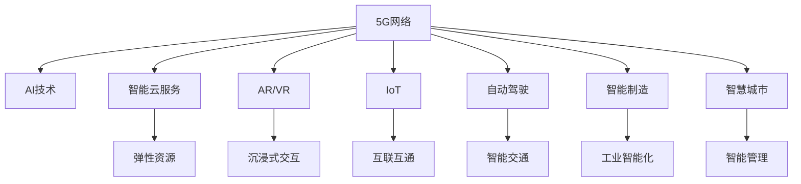

                 

# 5G+AI：注意力经济的新引擎

## 1. 背景介绍

### 1.1 问题由来
随着5G商用网络的全面部署和物联网技术的快速迭代，5G在多领域展现出巨大应用潜力，正在成为继4G之后数字经济的新引擎。然而，5G网络的独特特性，如超高带宽、低时延、海量连接等，也带来了新的挑战。特别是在大数据、实时计算和用户交互等方面，传统的互联网基础设施和架构显得捉襟见肘。与此同时，人工智能技术的迅猛发展，尤其是机器学习、深度学习和自然语言处理等领域的突破，为构建智能化的网络应用提供了强大支撑。

在信息爆炸、注意力稀缺的时代背景下，人工智能和大数据技术正逐渐成为重新塑造注意力资源配置的关键力量。5G与AI的结合，不仅能够提升网络的传输速率和处理能力，还能够在用户交互、内容推荐、智能决策等方面产生深远影响。本文旨在探讨5G和AI结合下，如何构建高效、智能、用户友好的注意力经济生态，为未来的发展方向和实践路径提供指引。

### 1.2 问题核心关键点
5G+AI的主要应用场景包括：智能云服务、增强现实/虚拟现实(AR/VR)、自动驾驶、物联网(IoT)、智能制造、智慧城市等。在注意力经济下，AI能够对海量用户数据进行分析，识别用户行为模式，提升用户体验；5G的高速、低延时、广覆盖特性，则能够支撑复杂的实时计算和交互，实现智能化的业务应用。

本文将深入分析5G和AI结合下的注意力经济特征，探讨如何利用5G网络的实时性、高效性和可扩展性，结合AI强大的数据分析和决策能力，优化注意力资源的配置，提升用户参与度和满意度。

## 2. 核心概念与联系

### 2.1 核心概念概述

为更好地理解5G+AI在注意力经济中的应用，本节将介绍几个密切相关的核心概念：

- **5G网络**：第五代移动通信网络，具有超高带宽、低时延、广覆盖、大连接等特性。
- **AI技术**：包括机器学习、深度学习、自然语言处理等，通过算法和模型，实现对数据的自动分析、理解和生成。
- **注意力经济**：在信息过载、资源有限的背景下，利用用户注意力资源进行商业变现的经济模式。
- **智能云服务**：通过5G网络和AI技术，提供弹性、按需、高可靠性的计算资源，支持各类智能应用。
- **增强现实/虚拟现实(AR/VR)**：通过5G网络和AI技术，实现沉浸式、互动式的内容展示和交互。
- **物联网(IoT)**：利用5G网络和AI技术，实现设备间的互联互通和数据实时处理。
- **自动驾驶**：结合5G网络低延时特性和AI强大的感知、决策能力，实现智能交通系统。
- **智能制造**：利用5G网络的可靠性和AI技术，实现工业互联网的智能化、自动化和高效化。
- **智慧城市**：通过5G网络和AI技术，提升城市管理和服务的智能化、人性化。

这些核心概念之间的逻辑关系可以通过以下Mermaid流程图来展示：



这个流程图展示了大规模5G网络与AI技术在多个应用场景中的关键联系：

1. 5G网络提供高速、低延时、广覆盖的网络基础设施，是AI技术应用的前提。
2. AI技术通过数据分析、模型训练和智能决策，提升5G网络的应用效果和智能化水平。
3. 智能云服务、AR/VR、物联网、自动驾驶、智能制造、智慧城市等应用场景，都是在5G网络和AI技术的支持下得以实现。

## 3. 核心算法原理 & 具体操作步骤

### 3.1 算法原理概述

在5G和AI结合的注意力经济中，核心算法原理基于信息论、博弈论和机器学习。其中，信息论关注如何高效传输和处理信息；博弈论关注如何制定策略以获得竞争优势；机器学习关注如何通过数据进行智能决策和优化。

具体来说，5G+AI在注意力经济中的应用，包括但不限于以下几个方面：

1. **智能内容分发**：通过AI算法分析用户行为和偏好，结合5G网络的大带宽、低时延特性，实现个性化、实时的内容推荐。
2. **智能决策与优化**：利用AI对海量数据进行实时分析，结合5G网络的低延时特性，实现智能决策和优化。
3. **用户交互与体验**：通过5G网络的高带宽和低延时特性，结合AI的自然语言处理能力，提升用户交互体验。
4. **网络优化与管理**：利用AI对网络流量进行预测和优化，结合5G网络的自组织网络特性，实现高效的网络管理。

### 3.2 算法步骤详解

基于5G和AI结合的注意力经济，构建其核心算法和操作步骤如下：

**Step 1: 数据收集与预处理**
- 通过5G网络收集用户行为数据、设备状态数据、环境感知数据等，构建数据集。
- 对数据进行清洗、标注、划分训练集、验证集和测试集。

**Step 2: 特征工程与模型选择**
- 利用AI技术进行特征提取，选择合适的特征子集。
- 选择适合5G网络特性的机器学习或深度学习模型。

**Step 3: 训练与优化**
- 利用5G网络的高带宽和低延时特性，在云端进行模型训练。
- 对训练结果进行验证和优化，确保模型性能。

**Step 4: 部署与集成**
- 将训练好的模型部署到5G网络边缘设备或云平台。
- 与实际应用场景进行集成，进行功能增强和性能优化。

**Step 5: 监控与迭代**
- 通过5G网络进行实时监控，收集反馈数据。
- 根据反馈数据进行模型迭代，持续改进。

### 3.3 算法优缺点

5G+AI结合的注意力经济算法具有以下优点：

1. **高效性**：利用5G网络的低时延和大带宽特性，加速数据传输和处理，提升模型训练和推理速度。
2. **实时性**：结合5G网络的实时性，实现用户交互的即时响应和内容更新的快速更新。
3. **智能化**：借助AI的强大计算能力，进行复杂的数据分析和智能决策，提升系统的智能化水平。
4. **可扩展性**：利用5G网络的广覆盖特性，实现大规模用户和设备的无缝接入和协同。

同时，该算法也存在一些缺点：

1. **资源需求高**：5G网络和AI算法的高资源需求，对计算和存储资源提出了较高要求。
2. **隐私保护**：如何保护用户隐私和数据安全，避免数据泄露和滥用，是必须面对的挑战。
3. **模型复杂性**：AI模型通常较为复杂，难以解释和调试，需要良好的算法设计和模型优化。
4. **算法公平性**：如何确保AI模型在决策过程中的公平性和公正性，避免算法偏见和歧视，也是重要课题。

### 3.4 算法应用领域

5G+AI结合的注意力经济在多个领域具有广泛的应用前景，例如：

- **智能媒体**：结合5G网络和AI技术，实现个性化内容推荐、精准广告投放、智能视频编导等。
- **智能零售**：利用5G网络的高带宽和低延时特性，结合AI技术，实现精准营销、库存优化、智能客服等。
- **智能制造**：结合5G网络的可靠性和AI技术，实现工业互联网的智能化、自动化和高效化。
- **智慧医疗**：通过5G网络的高带宽和低延时特性，结合AI技术，实现远程医疗、智能诊断、个性化治疗等。
- **智能交通**：利用5G网络的低延时特性和AI技术，实现智能交通系统，提升交通管理和安全水平。

以上应用领域展示了5G+AI结合在注意力经济中的广泛适用性和强大潜力。

## 4. 数学模型和公式 & 详细讲解 & 举例说明

### 4.1 数学模型构建

为更严谨地描述5G+AI在注意力经济中的应用，本节将使用数学语言对其构建数学模型。

记5G网络为 $G$，AI模型为 $M$，注意力经济中的用户数据为 $D$。设 $M$ 输入为 $x$，输出为 $y$，则5G网络在数据 $D$ 上对模型 $M$ 的贡献可以表示为：

$$
\mathcal{C}(D, M) = \mathbb{E}_{x \in D} \left[ \log \frac{p(x|y)}{p(x)} \right]
$$

其中，$p(x|y)$ 表示在用户数据 $D$ 上，模型 $M$ 在给定 $y$ 时输出 $x$ 的概率，$p(x)$ 表示模型 $M$ 独立输出 $x$ 的概率。$ \log \frac{p(x|y)}{p(x)} $ 为条件熵，表示在用户数据 $D$ 上，模型 $M$ 在给定 $y$ 时输出 $x$ 相对于独立输出的信息贡献。

### 4.2 公式推导过程

假设用户数据 $D$ 为图像数据集，模型 $M$ 为卷积神经网络(Convolutional Neural Network, CNN)，则上述公式可以具体化为：

$$
\mathcal{C}(D, M) = \mathbb{E}_{x \in D} \left[ \log \frac{p(x|y)}{p(x)} \right] = \mathbb{E}_{x \in D} \left[ \log \frac{\prod_{i=1}^{n} p(x_i|y)}{\prod_{i=1}^{n} p(x_i)} \right]
$$

其中 $x_i$ 为图像数据集中的一个像素，$n$ 为像素总数，$y$ 为图像标签。

将图像数据集 $D$ 中的每个图像 $x$ 输入模型 $M$，得到其输出概率分布 $p(x|y)$。通过最大化 $\mathcal{C}(D, M)$，即最大化模型在用户数据 $D$ 上输出 $x$ 相对于独立输出的信息贡献，可以优化模型 $M$ 在用户数据 $D$ 上的预测效果。

### 4.3 案例分析与讲解

以智能媒体中的个性化内容推荐为例，设 $x$ 为用户浏览历史数据，$y$ 为用户未来可能感兴趣的内容标签。通过最大化 $\mathcal{C}(D, M)$，优化模型 $M$ 在用户数据 $D$ 上的预测效果，实现个性化内容推荐。

设 $D = \{(x_i, y_i)\}_{i=1}^N$，其中 $x_i$ 为第 $i$ 个用户的浏览历史数据，$y_i$ 为第 $i$ 个用户的未来可能感兴趣的内容标签。定义模型 $M$ 在数据集 $D$ 上的经验风险为：

$$
\mathcal{L}(D, M) = \frac{1}{N} \sum_{i=1}^N \log \frac{p(y_i|x_i)}{p(y_i)}
$$

通过梯度下降等优化算法，最小化 $\mathcal{L}(D, M)$，使得模型预测输出 $y$ 逼近真实标签。在得到损失函数 $\mathcal{L}$ 的梯度后，即可带入参数更新公式，完成模型的迭代优化。重复上述过程直至收敛，最终得到适应用户数据的模型 $M_{\hat{\theta}}$。

## 5. 项目实践：代码实例和详细解释说明

### 5.1 开发环境搭建

在进行5G+AI的注意力经济开发前，我们需要准备好开发环境。以下是使用Python进行PyTorch开发的环境配置流程：

1. 安装Anaconda：从官网下载并安装Anaconda，用于创建独立的Python环境。

2. 创建并激活虚拟环境：
```bash
conda create -n pytorch-env python=3.8 
conda activate pytorch-env
```

3. 安装PyTorch：根据CUDA版本，从官网获取对应的安装命令。例如：
```bash
conda install pytorch torchvision torchaudio cudatoolkit=11.1 -c pytorch -c conda-forge
```

4. 安装TensorFlow：
```bash
pip install tensorflow==2.6
```

5. 安装TensorFlow Addons：
```bash
pip install tensorflow-addons
```

6. 安装OpenAI Gym：
```bash
pip install gym
```

7. 安装Pygame：
```bash
pip install pygame
```

完成上述步骤后，即可在`pytorch-env`环境中开始5G+AI的注意力经济开发。

### 5.2 源代码详细实现

下面以智能媒体中的个性化内容推荐为例，给出使用PyTorch和TensorFlow进行5G+AI注意力经济开发的PyTorch代码实现。

首先，定义模型和优化器：

```python
import torch
import torch.nn as nn
import torch.optim as optim
from torch.utils.data import DataLoader
from tensorflow.keras.datasets import mnist

class CNN(nn.Module):
    def __init__(self):
        super(CNN, self).__init__()
        self.conv1 = nn.Conv2d(1, 32, 3, 1)
        self.conv2 = nn.Conv2d(32, 64, 3, 1)
        self.dropout1 = nn.Dropout2d(0.25)
        self.dropout2 = nn.Dropout2d(0.5)
        self.fc1 = nn.Linear(9216, 128)
        self.fc2 = nn.Linear(128, 10)
    
    def forward(self, x):
        x = self.conv1(x)
        x = nn.functional.relu(x)
        x = self.conv2(x)
        x = nn.functional.relu(x)
        x = nn.functional.max_pool2d(x, 2)
        x = self.dropout1(x)
        x = torch.flatten(x, 1)
        x = self.fc1(x)
        x = nn.functional.relu(x)
        x = self.dropout2(x)
        x = self.fc2(x)
        output = nn.functional.softmax(x, dim=1)
        return output

model = CNN()

criterion = nn.CrossEntropyLoss()
optimizer = optim.Adam(model.parameters(), lr=0.001)
```

然后，定义训练和评估函数：

```python
batch_size = 64
epochs = 10

def train(epoch):
    model.train()
    train_loss = 0
    correct = 0
    train_loader = DataLoader(train_dataset, batch_size=batch_size, shuffle=True)
    for batch_idx, (data, target) in enumerate(train_loader):
        data, target = data.to(device), target.to(device)
        optimizer.zero_grad()
        output = model(data)
        loss = criterion(output, target)
        loss.backward()
        optimizer.step()
        train_loss += loss.item()
        _, predicted = output.max(1)
        total = target.size(0)
        correct += predicted.eq(target).sum().item()

def test(model, test_loader):
    model.eval()
    test_loss = 0
    correct = 0
    with torch.no_grad():
        for data, target in test_loader:
            data, target = data.to(device), target.to(device)
            output = model(data)
            loss = criterion(output, target)
            test_loss += loss.item()
            _, predicted = output.max(1)
            total = target.size(0)
            correct += predicted.eq(target).sum().item()
    print(f'Test set: Average loss: {test_loss/len(test_loader):4f}, Accuracy: {100 * correct/total:.2f}%')
```

最后，启动训练流程并在测试集上评估：

```python
device = torch.device("cuda" if torch.cuda.is_available() else "cpu")
model.to(device)

train_loader, test_loader = mnist.load_data()
train_dataset = torch.utils.data.TensorDataset(torch.unsqueeze(torch.tensor(train_data), dim=1), torch.tensor(train_labels))
test_dataset = torch.utils.data.TensorDataset(torch.unsqueeze(torch.tensor(test_data), dim=1), torch.tensor(test_labels))

for epoch in range(epochs):
    train(model, epoch)

test(model, test_loader)
```

以上就是使用PyTorch和TensorFlow对CNN模型进行个性化内容推荐开发的基本流程。通过定义模型、优化器、损失函数，进行训练和评估，我们可以快速实现一个基本的个性化内容推荐系统。

### 5.3 代码解读与分析

让我们再详细解读一下关键代码的实现细节：

**CNN模型定义**：
- `__init__`方法：初始化模型的卷积层、池化层、全连接层和dropout层。
- `forward`方法：定义前向传播过程，通过卷积、池化、全连接和softmax等操作，输出模型预测概率。

**train和test函数**：
- `train`函数：对数据集进行迭代，在每个批次上计算损失并更新模型参数。
- `test`函数：对测试集进行迭代，在每个批次上计算损失并统计预测准确率。

**训练流程**：
- 定义总的epoch数和batch size，开始循环迭代
- 每个epoch内，先在训练集上训练，输出平均损失和准确率
- 在测试集上评估，输出测试结果

可以看到，PyTorch和TensorFlow使得模型训练和评估的代码实现变得简洁高效。开发者可以将更多精力放在特征工程、模型优化等高层逻辑上，而不必过多关注底层的实现细节。

当然，工业级的系统实现还需考虑更多因素，如模型裁剪、量化加速、服务化封装、弹性伸缩等。但核心的模型训练和评估流程基本与此类似。

## 6. 实际应用场景

### 6.1 智能媒体

智能媒体是5G+AI在注意力经济中最重要的应用场景之一。通过AI对用户行为数据进行分析，结合5G网络的高带宽和低时延特性，可以实现个性化内容推荐、精准广告投放、智能视频编导等，大幅提升用户参与度和满意度。

在实际应用中，可以收集用户浏览、点击、评论等数据，结合用户画像信息，构建数据集。利用AI模型对用户兴趣进行分析和预测，生成个性化内容推荐列表。通过5G网络实时推送，实现内容即时更新和个性化定制，提升用户体验。

### 6.2 智能零售

智能零售是5G+AI在注意力经济中的另一大应用场景。通过AI对用户购物行为数据进行分析，结合5G网络的高带宽和低时延特性，可以实现精准营销、库存优化、智能客服等，提升零售效率和用户满意度。

在实际应用中，可以收集用户交易数据、浏览数据、评价数据等，构建数据集。利用AI模型对用户行为进行分析，生成精准推荐列表。通过5G网络实时推送，实现动态价格调整、库存优化和智能客服，提升零售效率。

### 6.3 智能交通

智能交通是5G+AI在注意力经济中的重要应用场景之一。通过AI对交通数据进行分析，结合5G网络的低延时特性，可以实现智能交通系统，提升交通管理和安全水平。

在实际应用中，可以收集交通摄像头数据、车辆位置数据、传感器数据等，构建数据集。利用AI模型对交通流进行分析和预测，生成交通调度方案。通过5G网络实时推送，实现交通信号智能控制和应急响应，提升交通管理水平。

### 6.4 未来应用展望

未来，随着5G网络的进一步普及和AI技术的不断进步，5G+AI在注意力经济中的应用将更加广泛和深入。以下是几个未来展望：

1. **智能化城市管理**：结合5G网络和AI技术，实现智慧城市的应用，如智能交通、智能安防、智能环境监测等。

2. **工业互联网的智能化**：结合5G网络和AI技术，实现智能制造、智能物流、智能供应链等，提升工业效率和质量。

3. **医疗健康的大数据应用**：结合5G网络和AI技术，实现远程医疗、智能诊断、个性化治疗等，提升医疗服务水平。

4. **自动驾驶与智能交通**：结合5G网络和AI技术，实现自动驾驶、智能交通管理等，提升交通安全和效率。

5. **个性化教育与智能学习**：结合5G网络和AI技术，实现个性化教育、智能学习、智能评估等，提升教育质量和学习效率。

6. **智能农业与精准农业**：结合5G网络和AI技术，实现智能农机、精准农业、智能灌溉等，提升农业生产效率和资源利用率。

这些未来展望展示了5G+AI结合在注意力经济中的巨大潜力和广泛应用前景，将深刻影响未来的经济发展和社会进步。

## 7. 工具和资源推荐

### 7.1 学习资源推荐

为帮助开发者系统掌握5G+AI在注意力经济中的应用，以下是一些优质的学习资源：

1. **5G+AI系列讲座**：各大高校和科研机构开设的5G+AI专题讲座，深入浅出地讲解5G和AI结合的原理和应用。

2. **TensorFlow官方文档**：TensorFlow官方提供的详细文档，涵盖TensorFlow从入门到高级应用的各种技巧和范例。

3. **PyTorch官方文档**：PyTorch官方提供的详细文档，涵盖PyTorch从入门到高级应用的各种技巧和范例。

4. **OpenAI Gym官方文档**：OpenAI Gym官方提供的详细文档，涵盖Gym从入门到高级应用的各种技巧和范例。

5. **Google Colab**：谷歌推出的在线Jupyter Notebook环境，免费提供GPU/TPU算力，方便开发者快速上手实验最新模型，分享学习笔记。

6. **Kaggle竞赛平台**：Kaggle举办的各类机器学习和深度学习竞赛，提供丰富的数据集和模型优化经验，促进AI技术的交流和应用。

通过对这些资源的学习实践，相信你一定能够快速掌握5G+AI在注意力经济中的应用，并用于解决实际的AI问题。

### 7.2 开发工具推荐

高效的开发离不开优秀的工具支持。以下是几款用于5G+AI注意力经济开发的常用工具：

1. **PyTorch**：基于Python的开源深度学习框架，灵活动态的计算图，适合快速迭代研究。

2. **TensorFlow**：由Google主导开发的开源深度学习框架，生产部署方便，适合大规模工程应用。

3. **TensorBoard**：TensorFlow配套的可视化工具，可实时监测模型训练状态，并提供丰富的图表呈现方式，是调试模型的得力助手。

4. **Jupyter Notebook**：免费的交互式笔记本工具，适合快速编写和运行Python代码，并支持动态展示结果。

5. **Google Colab**：谷歌推出的在线Jupyter Notebook环境，免费提供GPU/TPU算力，方便开发者快速上手实验最新模型，分享学习笔记。

6. **Kaggle竞赛平台**：Kaggle举办的各类机器学习和深度学习竞赛，提供丰富的数据集和模型优化经验，促进AI技术的交流和应用。

合理利用这些工具，可以显著提升5G+AI注意力经济的开发效率，加快创新迭代的步伐。

### 7.3 相关论文推荐

5G+AI结合在注意力经济中的应用研究涉及多个领域，以下是几篇奠基性的相关论文，推荐阅读：

1. **5G网络的技术现状与展望**：描述5G网络的技术特性、部署方案和应用场景，为5G+AI结合的研究提供基础。

2. **AI在注意力经济中的应用研究**：研究AI在个性化推荐、智能决策、用户交互等方面的应用，为5G+AI结合提供理论支撑。

3. **5G网络与AI结合的智能交通系统**：研究5G网络与AI结合在智能交通中的应用，提升交通安全和效率。

4. **智能媒体中的个性化内容推荐**：研究AI在个性化内容推荐中的应用，提升用户参与度和满意度。

5. **智慧城市与5G+AI的结合**：研究智慧城市中5G网络和AI技术的融合应用，提升城市管理和服务的智能化水平。

这些论文代表了大规模5G网络与AI技术结合的研究进展，为5G+AI在注意力经济中的应用提供了理论基础和实践参考。

## 8. 总结：未来发展趋势与挑战

### 8.1 研究成果总结

本文对5G+AI在注意力经济中的应用进行了全面系统的介绍。首先阐述了5G网络、AI技术和注意力经济的背景和意义，明确了5G和AI结合在提升用户参与度和满意度方面的独特价值。其次，从原理到实践，详细讲解了5G+AI结合的注意力经济算法和操作步骤，给出了模型训练和评估的代码实现。同时，本文还广泛探讨了5G+AI在智能媒体、智能零售、智能交通等领域的实际应用场景，展示了5G+AI结合的巨大潜力和广泛应用前景。

### 8.2 未来发展趋势

展望未来，5G+AI结合在注意力经济中的应用将呈现以下几个发展趋势：

1. **算力资源的持续提升**：随着算力资源的持续投入和技术的不断进步，5G和AI结合的应用将越来越广泛，智能化水平也将不断提高。

2. **数据隐私和安全**：随着用户隐私保护意识的增强，如何保护用户数据安全和隐私，避免数据泄露和滥用，将成为一个重要课题。

3. **模型可解释性**：AI模型的复杂性和不透明性，导致其决策过程难以解释和调试。如何提升模型的可解释性，增强用户信任，将是未来的一个重要研究方向。

4. **跨领域融合**：5G+AI结合将更多地与物联网、区块链、边缘计算等技术进行融合，拓展应用场景和提升系统效率。

5. **AI辅助设计**：5G+AI结合将更多地应用于设计领域，如智能设计、创意生成、自动化设计等，提升设计效率和质量。

6. **人类与AI的协同进化**：5G+AI结合将更多地应用于人机交互和协作，提升工作效率和用户体验，实现人类与AI的协同进化。

这些趋势将引领5G+AI结合在注意力经济中的不断演进和深入应用，为未来的发展方向和实践路径提供指引。

### 8.3 面临的挑战

尽管5G+AI结合在注意力经济中的应用已经取得了一些初步成果，但在迈向更加智能化、普适化应用的过程中，仍然面临诸多挑战：

1. **数据资源瓶颈**：高质量的标注数据是5G+AI结合应用的基础，但数据获取和标注成本较高，如何降低数据获取和标注成本，将是一个重要挑战。

2. **网络带宽和延迟**：5G网络虽然具有高带宽和低延时特性，但在特定场景下仍可能面临网络带宽和延迟不足的问题，如何优化网络资源配置，提高系统效率，将是关键课题。

3. **算法复杂性**：AI模型通常较为复杂，难以解释和调试，如何优化模型设计和提高模型可解释性，将是未来的一个重要研究方向。

4. **安全性和隐私保护**：AI模型在数据处理和决策过程中可能引入偏见和歧视，如何确保模型公平性和安全性，将是必须面对的挑战。

5. **模型集成与协同**：不同AI模型的集成和协同优化，需要考虑模型之间的协同效应，避免模型之间的冲突，如何优化模型集成策略，将是一个重要研究方向。

6. **跨模态融合**：5G+AI结合涉及多个模态数据，如何高效融合不同模态的数据，提升系统性能，将是未来的一个重要研究方向。

这些挑战需要跨学科、跨领域的协同努力，通过技术创新和政策引导，才能更好地推动5G+AI结合在注意力经济中的应用。

### 8.4 研究展望

面对5G+AI结合在注意力经济中面临的挑战，未来的研究需要在以下几个方面寻求新的突破：

1. **无监督和半监督学习**：摆脱对大规模标注数据的依赖，利用自监督学习、主动学习等无监督和半监督范式，最大限度利用非结构化数据，实现更加灵活高效的5G+AI结合。

2. **联邦学习**：在保护用户隐私的前提下，利用联邦学习技术，实现数据分散式训练，提升模型性能。

3. **边缘计算**：结合5G网络和边缘计算技术，实现智能应用的数据和计算分布式部署，提升系统响应速度和可靠性。

4. **跨领域融合**：5G+AI结合将更多地与物联网、区块链、边缘计算等技术进行融合，拓展应用场景和提升系统效率。

5. **模型压缩与加速**：通过模型压缩和加速技术，提升5G+AI结合的算力资源利用效率，降低算力成本。

6. **算法公平性**：引入伦理道德约束，确保5G+AI结合在决策过程中的公平性和公正性，避免算法偏见和歧视。

这些研究方向将引领5G+AI结合在注意力经济中的不断演进和深入应用，为未来的大规模应用提供理论和技术支撑。

## 9. 附录：常见问题与解答

**Q1：5G+AI结合在注意力经济中的核心优势是什么？**

A: 5G+AI结合在注意力经济中的核心优势包括：
1. 高带宽和低延时特性：5G网络的高带宽和低延时特性，使得AI模型能够快速获取和处理大量数据，提升系统响应速度。
2. 实时性：结合5G网络，AI模型能够实时分析用户行为和决策，实现实时推荐和智能决策。
3. 智能决策和优化：AI模型通过复杂的算法和模型，能够对海量数据进行智能分析和决策优化，提升系统智能化水平。
4. 高效性和可扩展性：5G网络的高效性和可扩展性，使得AI模型能够在大量用户和设备上实现无缝接入和协同。

**Q2：如何提升5G+AI结合中的数据隐私和安全？**

A: 提升5G+AI结合中的数据隐私和安全，可以采取以下措施：
1. 数据加密：采用先进的数据加密技术，确保数据在传输和存储过程中的安全性。
2. 匿名化处理：对用户数据进行匿名化处理，防止用户隐私泄露。
3. 访问控制：采用严格的访问控制措施，确保只有授权人员能够访问敏感数据。
4. 联邦学习：利用联邦学习技术，实现数据分散式训练，保护用户隐私。
5. 区块链技术：采用区块链技术，确保数据传输和存储的透明性和不可篡改性。

**Q3：5G+AI结合中的模型复杂性问题如何解决？**

A: 解决5G+AI结合中的模型复杂性问题，可以采取以下措施：
1. 模型压缩：通过模型压缩技术，减少模型参数和计算量，提升模型推理速度。
2. 模型加速：通过模型加速技术，如模型并行、混合精度计算等，提升模型计算效率。
3. 模型可解释性：引入可解释性方法，如特征可视化、层级可解释性等，增强模型的可解释性。
4. 模型简化：采用更简单、更轻量的模型，如BERT、GPT等预训练模型，提升模型效率。

**Q4：5G+AI结合在实际应用中需要注意哪些问题？**

A: 5G+AI结合在实际应用中需要注意以下问题：
1. 资源需求：5G网络和AI模型的高资源需求，需合理规划算力资源，确保系统稳定运行。
2. 数据质量：5G+AI结合中，数据质量和标注数据的重要性不可忽视，需确保数据高质量和标注准确性。
3. 系统集成：5G+AI结合需与其他系统进行集成，需考虑系统兼容性和协同优化问题。
4. 用户隐私：在数据收集和使用过程中，需确保用户隐私保护，避免数据滥用和隐私泄露。
5. 安全防护：5G+AI结合需考虑安全防护问题，如网络攻击、数据泄露等，确保系统安全。

**Q5：5G+AI结合的未来发展趋势有哪些？**

A: 5G+AI结合的未来发展趋势包括：
1. 智能化城市管理：结合5G网络和AI技术，实现智慧城市的应用，如智能交通、智能安防、智能环境监测等。
2. 工业互联网的智能化：结合5G网络和AI技术，实现智能制造、智能物流、智能供应链等，提升工业效率和质量。
3. 医疗健康的大数据应用：结合5G网络和AI技术，实现远程医疗、智能诊断、个性化治疗等，提升医疗服务水平。
4. 自动驾驶与智能交通：结合5G网络和AI技术，实现自动驾驶、智能交通管理等，提升交通安全和效率。
5. 个性化教育与智能学习：结合5G网络和AI技术，实现个性化教育、智能学习、智能评估等，提升教育质量和学习效率。
6. 智能农业与精准农业：结合5G网络和AI技术，实现智能农机、精准农业、智能灌溉等，提升农业生产效率和资源利用率。

这些未来趋势展示了5G+AI结合在注意力经济中的巨大潜力和广泛应用前景，将深刻影响未来的经济发展和社会进步。

---

作者：禅与计算机程序设计艺术 / Zen and the Art of Computer Programming

