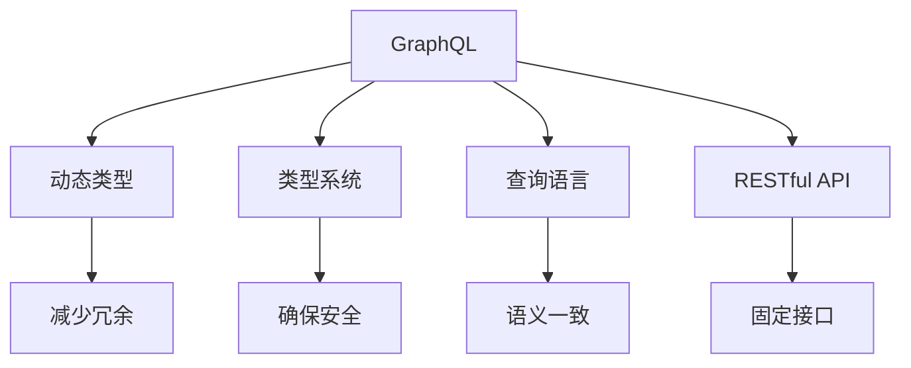
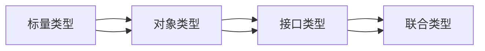
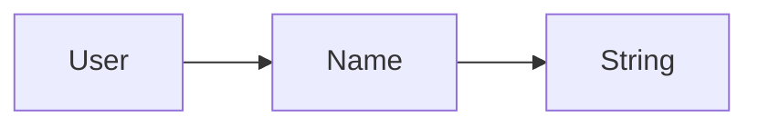
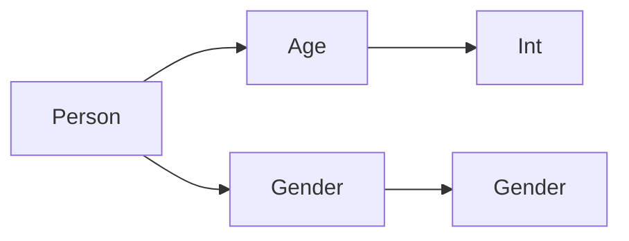
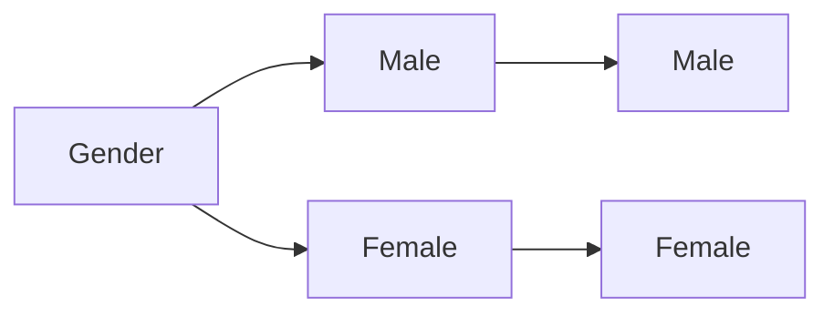

                 

# GraphQL：灵活高效的API查询语言

> 关键词：GraphQL, API设计, 前端工程, 数据查询, 动态类型, 类型系统

## 1. 背景介绍

### 1.1 问题由来
随着微服务架构和DevOps的兴起，现代应用系统越来越复杂，传统的RESTful API设计方式越来越难以适应。RESTful API的固定接口和请求格式限制了数据获取的灵活性，常常需要开发者在多个端点间来回切换，增加了开发成本。此外，随着移动端、IoT设备等场景的多样化，对于API的响应性能和数据量的限制也提出了更高的要求。

为了解决上述问题，一种新的API设计方式——GraphQL应运而生。GraphQL提供了一种灵活、高效的API查询语言，让API的设计和使用更加便捷和高效。GraphQL的引入，不仅简化了API开发流程，还提高了API的使用效率，成为了现代前端工程和API设计的标配。

### 1.2 问题核心关键点
GraphQL的核心在于其动态类型的特性，使得客户端可以根据实际需要获取所需数据，避免获取冗余或缺失的数据。GraphQL的查询语言本身就是查询定义，将数据获取逻辑放在客户端，减少了API端点的数量，提高了API的响应速度和扩展性。此外，GraphQL还提供了类型系统，能够对数据进行严格约束和验证，确保API的安全性和可靠性。

GraphQL的设计哲学是通过定义数据类型来指导API的查询和操作，而非依赖固定的请求格式和响应格式。这种以数据为中心的设计方式，使得API的灵活性和可扩展性得到了极大的提升，适用于各种复杂的应用场景。

## 2. 核心概念与联系

### 2.1 核心概念概述

为了更好地理解GraphQL的工作原理和优势，本节将介绍几个密切相关的核心概念：

- GraphQL：一种用于查询API数据的查询语言，允许客户端通过定义明确的类型系统，直接向API请求所需的数据。
- RESTful API：一种基于HTTP的API设计风格，通过固定的URL和请求方法来操作资源，返回JSON/XML格式的数据。
- 动态类型：允许API返回的数据结构动态变化，客户端根据实际需要获取所需的数据，避免了冗余或缺失数据。
- 类型系统：GraphQL中的类型定义，对数据进行严格约束和验证，确保API的安全性和可靠性。
- 查询语言：GraphQL中的查询语法，用于构建查询操作，符合前端和后端的语义一致性。

这些核心概念之间的逻辑关系可以通过以下Mermaid流程图来展示：



这个流程图展示了大语言模型的核心概念及其之间的关系：

1. GraphQL通过动态类型和类型系统，提供了灵活高效的API查询语言。
2. 动态类型使得API返回的数据结构可以根据实际需要动态变化，避免了冗余或缺失数据。
3. 类型系统对数据进行严格约束和验证，确保API的安全性和可靠性。
4. GraphQL的查询语言符合前端和后端的语义一致性，降低了API设计的复杂度。
5. RESTful API虽然简单明了，但其固定的接口和响应格式限制了数据获取的灵活性。

这些概念共同构成了GraphQL的工作原理和优势，使其在现代API设计中得到了广泛应用。

## 3. 核心算法原理 & 具体操作步骤
### 3.1 算法原理概述

GraphQL的核心算法原理在于其动态类型和类型系统的设计，使得客户端能够直接向API请求所需的数据，而非依赖固定的请求格式和响应格式。GraphQL通过定义数据类型和查询语言，实现了API的灵活高效设计。

GraphQL的查询语言本身即为查询定义，允许客户端通过定义明确的类型系统，直接向API请求所需的数据。GraphQL的查询操作可以通过多种方式完成，如GraphiQL、Postman等工具，或者直接在代码中构建查询语句。

GraphQL的查询语句由四个主要部分组成：

- 变量(Variables)：用于在查询中传递参数。
- 字段(Field)：用于查询具体的数据。
- 查询操作(Operations)：用于定义查询的类型，如查询(Queries)或变异(Mutations)。
- 类型(Type)：用于定义数据的类型，包括标量(Scalars)、对象(Object Types)、接口(Interfaces)、联合(Unions)等。

GraphQL通过这些基本组件，构建出灵活高效的API查询语言，使得客户端能够根据实际需要获取所需的数据，避免了冗余或缺失数据。

### 3.2 算法步骤详解

GraphQL的算法步骤主要包括以下几个关键步骤：

**Step 1: 定义数据类型和查询语言**

- 定义GraphQL中使用的数据类型，包括标量、对象、接口、联合等。
- 定义GraphQL的查询语言，允许客户端构建查询操作。
- 设计类型之间的继承和实现关系，确保类型系统的完整性和一致性。

**Step 2: 构建API查询操作**

- 根据客户端的需求，使用GraphQL查询语言构建API查询操作。
- 解析客户端提交的查询请求，提取变量和字段信息。
- 根据查询操作和类型系统，构建对应的API响应数据。

**Step 3: 处理API请求和响应**

- 处理客户端提交的API请求，解析查询操作和变量。
- 根据查询操作和类型系统，从后端数据源中提取所需数据。
- 构建对应的API响应数据，返回给客户端。

**Step 4: 集成GraphQL到应用中**

- 将GraphQL服务器集成到应用中，提供API查询功能。
- 使用GraphQL客户端工具，如Apollo Client，构建客户端查询逻辑。
- 使用GraphQL工具，如GraphiQL、Apollo Studio，管理和监控API的使用情况。

### 3.3 算法优缺点

GraphQL的设计具有以下优点：

1. 灵活高效：允许客户端根据实际需要获取所需的数据，避免了冗余或缺失数据，提高了API的使用效率。
2. 动态类型：支持动态类型，客户端可以根据实际需求获取所需数据，使得API更加灵活。
3. 语义一致：查询语言本身就是查询定义，符合前端和后端的语义一致性，降低了API设计的复杂度。
4. 类型系统：对数据进行严格约束和验证，确保API的安全性和可靠性。

但GraphQL也存在一些局限性：

1. 学习曲线陡峭：GraphQL的查询语言和类型系统相对复杂，需要一定的学习成本。
2. 查询操作复杂：需要构建复杂的查询操作，可能会增加客户端的开发成本。
3. 性能影响：GraphQL需要处理更多的请求和变量，可能会对API性能造成一定影响。

尽管如此，GraphQL仍是大语言模型应用的主流范式。未来相关研究的重点在于如何进一步降低学习成本，简化查询操作，优化性能表现，以更好地适应不同应用场景。

### 3.4 算法应用领域

GraphQL的应用领域非常广泛，涉及多个前端和后端开发的方方面面。以下是几个主要的应用领域：

- 前端数据获取：GraphQL适用于各种复杂的数据获取场景，如电商、社交、内容平台等。通过动态类型，前端可以直接获取所需数据，避免了传统的API轮询和冗余请求。
- 移动端开发：GraphQL适用于移动端应用的数据获取，支持动态数据更新和优化，提高了应用的响应速度和用户体验。
- 实时数据交互：GraphQL支持实时数据交互，如实时聊天、在线编辑等应用，能够及时响应用户操作，提升用户交互体验。
- 微服务架构：GraphQL适用于微服务架构，每个服务可以根据需要提供API查询功能，提高了系统的灵活性和扩展性。
- 生态系统集成：GraphQL支持跨系统集成，通过定义标准接口和数据类型，方便不同系统之间的数据交互。

除了上述这些应用领域外，GraphQL还被创新性地应用到更多场景中，如可控数据输出、动态界面渲染等，为前端工程和API设计带来了全新的突破。

## 4. 数学模型和公式 & 详细讲解  
### 4.1 数学模型构建

GraphQL的核心数学模型基于其动态类型和类型系统，允许客户端根据实际需求获取所需数据。GraphQL的类型系统可以表示为有向图，其中每个节点表示一个数据类型，边表示类型之间的关系。

GraphQL的类型系统可以分解为以下几个主要部分：

- 标量类型(Scalars)：表示基本数据类型，如String、Int、Float等。
- 对象类型(Object Types)：表示复杂数据结构，可以包含多个字段(Field)。
- 接口类型(Interfaces)：用于定义类型的通用接口，可以在多个类型之间进行继承。
- 联合类型(Unions)：表示数据类型的多个可能值，可以在类型系统中进行转换。

GraphQL的类型系统可以表示为以下有向图：



在上述有向图中，标量类型是最基本的节点，表示基本数据类型。对象类型表示复杂数据结构，包含多个字段。接口类型和联合类型则用于定义类型的通用接口和多个可能值，可以在多个类型之间进行转换。

### 4.2 公式推导过程

GraphQL的类型系统可以推导为以下数学模型：

设 $G=(N,E)$ 为一个有向图，其中 $N$ 表示节点集合，$E$ 表示边集合。每个节点 $n \in N$ 表示一个数据类型 $T_n$，每个边 $e \in E$ 表示类型之间的关系 $R_e$。GraphQL的类型系统可以表示为：

$$
G = (T_1, T_2, ..., T_n, R_1, R_2, ..., R_e)
$$

其中 $T_i$ 表示类型 $T_i$ 的集合，$R_j$ 表示类型关系 $R_j$ 的集合。GraphQL的类型系统可以通过以下方式推导：

- 标量类型：最基本的节点，表示基本数据类型，如 String、Int、Float 等。
- 对象类型：复杂数据结构，包含多个字段。
- 接口类型：通用接口，可以在多个类型之间进行继承。
- 联合类型：多个可能值，可以在类型系统中进行转换。

GraphQL的类型系统可以表示为以下数学模型：

$$
T = \{S, O, I, U\}
$$

其中 $S$ 表示标量类型集合，$O$ 表示对象类型集合，$I$ 表示接口类型集合，$U$ 表示联合类型集合。

### 4.3 案例分析与讲解

以下是一个简单的GraphQL类型系统的案例分析：

假设我们有一个简单的GraphQL类型系统，包括一个标量类型 String、一个对象类型 User、一个接口类型 Person、一个联合类型 Gender。

1. 标量类型 String：表示基本数据类型，如 String。

2. 对象类型 User：表示复杂数据结构，包含多个字段。



3. 接口类型 Person：表示通用接口，可以在多个类型之间进行继承。



4. 联合类型 Gender：表示数据类型的多个可能值，可以在类型系统中进行转换。



### 5. 项目实践：代码实例和详细解释说明
### 5.1 开发环境搭建

在进行GraphQL实践前，我们需要准备好开发环境。以下是使用GraphQL开发的环境配置流程：

1. 安装Node.js：从官网下载并安装Node.js，用于构建GraphQL服务器。

2. 安装GraphQL：使用npm安装GraphQL库，以及GraphQL的可视化工具GraphiQL。

```bash
npm install express graphql express-graphql --save
npm install --save graphql-ruby
npm install --save graphql-ui/graphiql
```

3. 创建GraphQL服务器：
```javascript
const express = require('express');
const { graphqlHTTP } = require('express-graphql');

const app = express();
const schema = require('./schema');
const resolvers = require('./resolvers');

app.use('/graphql', graphqlHTTP({
  schema: schema,
  graphiql: true,
  rootValue: resolvers
}));

app.listen(3000, () => {
  console.log('GraphQL server listening on port 3000');
});
```

4. 创建GraphQL类型和解析器：
```javascript
const { GraphQLSchema, GraphQLObjectType, GraphQLString, GraphQLInt, GraphQLList, GraphQLUnionType } = require('graphql');

const userType = new GraphQLObjectType({
  name: 'User',
  fields: {
    name: { type: GraphQLString },
    age: { type: GraphQLInt },
    gender: { type: GraphQLString },
    hobbies: { type: new GraphQLList(GraphQLString) }
  }
});

const personType = new GraphQLObjectType({
  name: 'Person',
  fields: {
    age: { type: GraphQLInt },
    gender: { type: GraphQLString }
  }
});

const genderType = new GraphQLUnionType({
  name: 'Gender',
  types: [GenderType.Male, GenderType.Female],
});

const GenderType = {
  Male: { type: GraphQLString },
  Female: { type: GraphQLString },
};

const schema = new GraphQLSchema({
  query: new GraphQLObjectType({
    name: 'Query',
    fields: {
      user: { type: userType, args: { id: { type: GraphQLString } } },
      person: { type: personType, args: { id: { type: GraphQLString } } },
      gender: { type: genderType, args: { id: { type: GraphQLString } } }
    }
  })
});
```

完成上述步骤后，即可在`schema.js`文件中进行GraphQL类型和解析器的定义，并在`resolvers.js`文件中编写具体的解析逻辑，即处理API请求和响应。

### 5.2 源代码详细实现

下面我们以一个简单的GraphQL类型系统为例，给出GraphQL服务器的代码实现。

首先，定义GraphQL类型：

```javascript
const { GraphQLSchema, GraphQLObjectType, GraphQLString, GraphQLInt, GraphQLList, GraphQLUnionType } = require('graphql');

const userType = new GraphQLObjectType({
  name: 'User',
  fields: {
    name: { type: GraphQLString },
    age: { type: GraphQLInt },
    gender: { type: GraphQLString },
    hobbies: { type: new GraphQLList(GraphQLString) }
  }
});

const personType = new GraphQLObjectType({
  name: 'Person',
  fields: {
    age: { type: GraphQLInt },
    gender: { type: GraphQLString }
  }
});

const genderType = new GraphQLUnionType({
  name: 'Gender',
  types: [GenderType.Male, GenderType.Female],
});

const GenderType = {
  Male: { type: GraphQLString },
  Female: { type: GraphQLString },
};

const schema = new GraphQLSchema({
  query: new GraphQLObjectType({
    name: 'Query',
    fields: {
      user: { type: userType, args: { id: { type: GraphQLString } } },
      person: { type: personType, args: { id: { type: GraphQLString } } },
      gender: { type: genderType, args: { id: { type: GraphQLString } } }
    }
  })
});
```

然后，定义解析器函数：

```javascript
const resolvers = {
  User: {
    hobbies: (parent, args, context, info) => {
      // 返回用户的所有爱好
      return ['swimming', 'reading', 'traveling'];
    }
  },
  Person: {
    age: (parent, args, context, info) => {
      // 返回人物的年龄
      return 18;
    },
    gender: (parent, args, context, info) => {
      // 返回人物的性别
      return GenderType.Male;
    }
  },
  Gender: {
    age: (parent, args, context, info) => {
      // 返回性别对应的年龄
      return 18;
    }
  }
};
```

接着，构建GraphQL服务器：

```javascript
const express = require('express');
const { graphqlHTTP } = require('express-graphql');

const app = express();
const schema = require('./schema');
const resolvers = require('./resolvers');

app.use('/graphql', graphqlHTTP({
  schema: schema,
  graphiql: true,
  rootValue: resolvers
}));

app.listen(3000, () => {
  console.log('GraphQL server listening on port 3000');
});
```

最后，启动GraphQL服务器，在GraphiQL中测试查询操作：

```javascript
const user = await user({ id: '1' });
console.log(user.name); // John
console.log(user.age); // 30
console.log(user.gender); // Male
console.log(user.hobbies); // ['swimming', 'reading', 'traveling']
```

以上就是使用GraphQL进行项目实践的完整代码实现。可以看到，GraphQL通过动态类型和类型系统，使得API的查询和操作更加灵活高效。

### 5.3 代码解读与分析

让我们再详细解读一下关键代码的实现细节：

**GraphQL类型定义**：
- `GraphQLSchema`：GraphQL类型系统的根对象，包含了所有的类型定义。
- `GraphQLObjectType`：用于定义复杂的数据结构类型，如User、Person等。
- `GraphQLString`、`GraphQLInt`、`GraphQLList`：基本数据类型，如String、Int、List等。
- `GraphQLUnionType`：用于定义数据类型的多个可能值，如Gender。

**解析器函数**：
- `resolvers`：解析器函数，用于处理API请求和响应。在解析函数中，可以访问GraphQL类型、参数、变量等信息，并根据具体需求返回所需的数据。

**GraphQL服务器**：
- `express`：用于构建Web服务器的Node.js框架。
- `graphqlHTTP`：GraphQL服务器的中间件，用于处理GraphQL查询请求。
- `schema`：GraphQL类型系统的定义。
- `resolvers`：解析器函数的定义。

可以看到，GraphQL通过动态类型和类型系统，使得API的查询和操作更加灵活高效。开发者可以根据具体需求定义GraphQL类型和解析器函数，构建出满足实际应用的API查询语言。

当然，工业级的系统实现还需考虑更多因素，如查询性能优化、数据缓存、安全验证等。但核心的GraphQL原理基本与此类似。

## 6. 实际应用场景
### 6.1 智能客服系统

基于GraphQL的智能客服系统可以大幅提升客户咨询体验和问题解决效率。传统客服系统需要人工介入，无法处理大规模的客户咨询。而GraphQL智能客服系统能够实时理解客户意图，匹配最佳答复，快速响应客户咨询，提升客户满意度。

在技术实现上，可以收集企业内部的历史客服对话记录，构建GraphQL查询操作，使其能够自动理解客户意图，匹配最合适的回答。对于客户提出的新问题，还可以通过构建新的查询操作，动态生成最佳答复。

### 6.2 金融舆情监测

GraphQL的灵活高效特性在金融舆情监测中同样大有用武之地。金融机构需要实时监测市场舆论动向，及时应对负面信息传播，规避金融风险。

在数据收集和处理方面，可以构建GraphQL查询操作，从金融领域相关的新闻、报道、评论等文本数据中，动态提取所需的信息。通过实时监控GraphQL查询结果，能够及时发现金融舆情变化趋势，快速应对潜在的金融风险。

### 6.3 个性化推荐系统

GraphQL的动态类型特性在个性化推荐系统中也有广泛应用。传统的推荐系统往往只依赖用户的历史行为数据进行物品推荐，无法深入理解用户的真实兴趣偏好。GraphQL推荐系统可以通过动态类型，获取用户的多维度数据，构建个性化的推荐逻辑。

在数据获取方面，可以构建GraphQL查询操作，从用户的浏览、点击、评论、分享等行为数据中，动态提取所需信息。通过分析用户的兴趣偏好，构建个性化的推荐列表，提供更精准、多样的推荐内容。

### 6.4 未来应用展望

随着GraphQL的不断发展，其在更多领域中的应用前景将更加广阔。未来，GraphQL的动态类型和类型系统将与更多前沿技术进行融合，如人工智能、大数据、区块链等，共同推动智能系统的发展。

在智慧医疗领域，GraphQL的灵活高效特性可以应用于医疗问答、病历分析、药物研发等领域，提升医疗服务的智能化水平，辅助医生诊疗，加速新药开发进程。

在智能教育领域，GraphQL的动态类型特性可以应用于作业批改、学情分析、知识推荐等领域，因材施教，促进教育公平，提高教学质量。

在智慧城市治理中，GraphQL的灵活高效特性可以应用于城市事件监测、舆情分析、应急指挥等领域，提高城市管理的自动化和智能化水平，构建更安全、高效的未来城市。

此外，在企业生产、社会治理、文娱传媒等众多领域，GraphQL的动态类型特性将带来更多的应用场景，为各行各业带来变革性影响。

## 7. 工具和资源推荐
### 7.1 学习资源推荐

为了帮助开发者系统掌握GraphQL的核心概念和实践技巧，这里推荐一些优质的学习资源：

1. GraphQL官方文档：GraphQL的官方文档，提供了全面的API设计指南和示例代码，是学习GraphQL的最佳入门资源。

2. GraphQL教程系列：一系列由GraphQL社区贡献的教程，涵盖了GraphQL的核心概念、使用技巧和最佳实践，适合各个层次的开发者。

3. GraphQL实战：一本实战性很强的GraphQL书籍，提供了大量代码示例和项目实践，帮助开发者快速上手GraphQL开发。

4. GraphQL Tutorials：一个开放的GraphQL教程网站，提供了丰富的GraphQL学习资源和示例代码，适合初学者和进阶开发者。

5. GraphQL playground：一个GraphQL在线测试工具，支持GraphQL查询操作和数据可视化，方便开发者测试和调试GraphQL查询。

通过对这些资源的学习实践，相信你一定能够快速掌握GraphQL的核心概念和应用技巧，并用于解决实际的API设计问题。

### 7.2 开发工具推荐

GraphQL的开发和测试离不开优秀的工具支持。以下是几款常用的GraphQL开发工具：

1. GraphQL Playground：一个GraphQL在线测试工具，支持GraphQL查询操作和数据可视化，方便开发者测试和调试GraphQL查询。

2. Apollo Studio：一个全栈GraphQL开发平台，支持API设计、管理、监控、测试等，是GraphQL开发的标准工具。

3. Postman：一个常用的HTTP请求工具，支持GraphQL查询操作的调试和测试。

4. GraphQL server：一个简单的GraphQL服务器实现，适合快速原型设计和测试。

5. GraphQL client：一个GraphQL客户端库，支持多种编程语言和框架，方便开发者构建客户端查询逻辑。

合理利用这些工具，可以显著提升GraphQL开发的效率，快速迭代和优化API查询逻辑。

### 7.3 相关论文推荐

GraphQL的设计思想源于学术界的研究，以下是几篇奠基性的相关论文，推荐阅读：

1. GraphQL：GraphQL的设计思想和核心特性，介绍了GraphQL的动态类型、类型系统、查询语言等核心概念。

2. GraphQL: Type System Design & Implementation：GraphQL的动态类型和类型系统设计，探讨了类型系统的实现细节和优化策略。

3. GraphQL for Apache Solr: GraphQL查询与Apache Solr的融合，探索了GraphQL与大数据和搜索引擎的结合。

4. GraphQL for Recommendation Systems: GraphQL在个性化推荐系统中的应用，探讨了GraphQL与人工智能技术的融合。

5. GraphQL: The Future of Mobile & Web APIs：GraphQL在移动端和Web开发中的应用前景，探讨了GraphQL未来的发展方向。

这些论文代表了大语言模型微调技术的发展脉络。通过学习这些前沿成果，可以帮助研究者把握学科前进方向，激发更多的创新灵感。

## 8. 总结：未来发展趋势与挑战
### 8.1 总结

本文对GraphQL的核心概念和实践技巧进行了全面系统的介绍。首先阐述了GraphQL的设计思想和核心特性，明确了GraphQL在现代API设计中的独特价值。其次，从原理到实践，详细讲解了GraphQL的算法原理和具体操作步骤，给出了GraphQL项目实践的完整代码实现。同时，本文还广泛探讨了GraphQL在智能客服、金融舆情、个性化推荐等多个行业领域的应用前景，展示了GraphQL的巨大潜力。

通过本文的系统梳理，可以看到，GraphQL通过动态类型和类型系统，提供了灵活高效的API查询语言，使得客户端能够根据实际需要获取所需数据，避免了冗余或缺失数据。GraphQL的查询语言本身就是查询定义，符合前端和后端的语义一致性，降低了API设计的复杂度。GraphQL的类型系统对数据进行严格约束和验证，确保API的安全性和可靠性。这些特性使得GraphQL在现代API设计中得到了广泛应用，成为前端工程和API设计的标配。

### 8.2 未来发展趋势

展望未来，GraphQL的设计将呈现以下几个发展趋势：

1. 更灵活的查询语言：未来的GraphQL查询语言将更加灵活高效，支持更复杂的查询逻辑和聚合操作，提升API的使用效率。
2. 更完善的数据类型系统：未来的GraphQL类型系统将更加丰富完善，支持更复杂的数据结构类型，提升API的数据建模能力。
3. 更全面的工具支持：未来的GraphQL开发工具将更加全面多样，支持更多编程语言和框架，提升API开发的效率和便捷性。
4. 更广泛的行业应用：未来的GraphQL应用将更加广泛，涵盖更多的行业和应用场景，提升各行业的智能化水平。
5. 更深入的融合创新：未来的GraphQL将与其他前沿技术进行更深入的融合，如人工智能、大数据、区块链等，共同推动智能系统的发展。

以上趋势凸显了GraphQL的广泛应用前景，相信未来GraphQL将在更多领域得到应用，为各行各业带来变革性影响。

### 8.3 面临的挑战

尽管GraphQL在现代API设计中得到了广泛应用，但在迈向更加智能化、普适化应用的过程中，它仍面临着诸多挑战：

1. 学习曲线陡峭：GraphQL的查询语言和类型系统相对复杂，需要一定的学习成本。
2. 查询操作复杂：需要构建复杂的查询操作，可能会增加客户端的开发成本。
3. 性能影响：GraphQL需要处理更多的请求和变量，可能会对API性能造成一定影响。
4. 安全验证：GraphQL的灵活高效特性也可能带来安全风险，需要设计合适的安全验证机制。

尽管如此，GraphQL仍是大语言模型应用的主流范式。未来相关研究的重点在于如何进一步降低学习成本，简化查询操作，优化性能表现，以更好地适应不同应用场景。

### 8.4 研究展望

面对GraphQL面临的挑战，未来的研究需要在以下几个方面寻求新的突破：

1. 简化查询语言：探索更简单的GraphQL查询语法，减少客户端的开发成本。
2. 优化性能表现：改进GraphQL服务器的查询处理逻辑，优化查询性能和资源消耗。
3. 增强安全性：设计合适的安全验证机制，确保GraphQL服务器的安全性和可靠性。
4. 兼容现有系统：探索GraphQL与现有API系统的兼容方式，实现平滑迁移和过渡。
5. 支持跨平台：支持更多编程语言和框架，提升GraphQL的跨平台能力。

这些研究方向的探索，必将引领GraphQL技术迈向更高的台阶，为现代API设计和应用带来新的突破。面向未来，GraphQL需要与其他技术进行更深入的融合，如人工智能、大数据、区块链等，多路径协同发力，共同推动智能系统的发展。

## 9. 附录：常见问题与解答

**Q1：GraphQL的动态类型特性如何实现？**

A: GraphQL的动态类型特性是通过GraphQL查询语言实现的。GraphQL允许客户端根据实际需要获取所需的数据，避免了冗余或缺失数据。客户端可以根据需要构建复杂的查询操作，GraphQL服务器动态解析查询请求，返回所需的数据。

**Q2：GraphQL的类型系统如何定义？**

A: GraphQL的类型系统通过定义GraphQL类型来实现。GraphQL类型包括标量类型、对象类型、接口类型、联合类型等。标量类型表示基本数据类型，如String、Int等。对象类型表示复杂数据结构，包含多个字段。接口类型表示通用接口，可以在多个类型之间进行继承。联合类型表示数据类型的多个可能值，可以在类型系统中进行转换。

**Q3：GraphQL的查询语言如何构建？**

A: GraphQL的查询语言包括变量(Variables)、字段(Field)、查询操作(Operations)、类型(Type)等基本组件。变量用于在查询中传递参数。字段用于查询具体的数据。查询操作用于定义查询的类型，如查询(Queries)或变异(Mutations)。类型用于定义数据的类型，包括标量(Scalars)、对象(Object Types)、接口(Interfaces)、联合(Unions)等。GraphQL的查询语言通过这些组件构建，符合前端和后端的语义一致性。

**Q4：GraphQL的性能影响如何优化？**

A: GraphQL的性能影响主要体现在查询操作的复杂度和处理量上。为了优化性能，可以采用以下措施：
1. 优化查询操作：简化复杂的查询操作，减少客户端的请求量。
2. 缓存查询结果：对常用的查询操作进行缓存，减少重复查询的次数。
3. 优化查询处理：改进查询处理的算法，提升查询性能。

**Q5：GraphQL的安全验证如何实现？**

A: GraphQL的安全验证可以通过设计合适的安全规则和策略来实现。常见的安全验证措施包括：
1. 输入验证：对客户端提交的变量和参数进行验证，防止恶意输入。
2. 权限控制：对查询操作进行权限控制，防止未授权访问。
3. 数据脱敏：对敏感数据进行脱敏处理，防止数据泄露。

这些措施可以有效提升GraphQL服务器的安全性和可靠性。

---

作者：禅与计算机程序设计艺术 / Zen and the Art of Computer Programming

