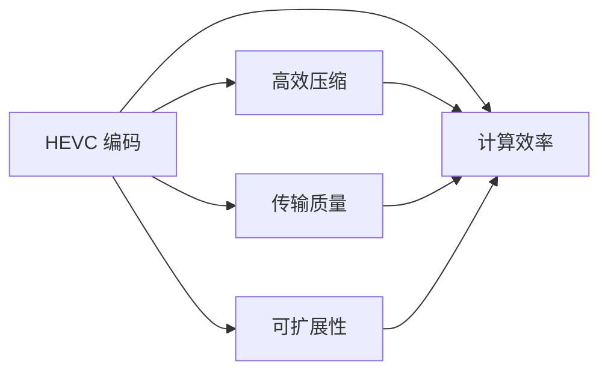

                 

# HEVC 视频编码格式优势：高效压缩和传输高清视频的选择

> 关键词：HEVC, 视频编码, 高效压缩, 传输质量, 可扩展性, 计算效率

## 1. 背景介绍

随着高清视频在互联网和移动设备上的普及，对视频编码格式的需求日益增长。在众多视频编码标准中，HEVC (High-Efficiency Video Coding)以其高效压缩和优质传输性能，成为当前主流的编码格式之一。本博客将系统介绍HEVC视频编码的优势及其在实际应用中的选择策略，帮助开发者和用户选择最适合他们的视频编码格式。

## 2. 核心概念与联系

### 2.1 核心概念概述

- **HEVC**：全称为高效视频编码(High-Efficiency Video Coding)，是继H.264之后的第三代视频编码标准。HEVC在保持较高压缩效率的同时，显著提升了视频编码的质量和可扩展性。

- **视频编码**：是指将视频信号（图像序列）转换成可以在有限带宽上传输或存储的格式的过程。视频编码的目标是在保证一定压缩比的前提下，最大化地保留视频的质量。

- **高效压缩**：指在保证视频质量的前提下，尽可能地减少编码后的数据量，从而降低存储和传输的成本。

- **传输质量**：指视频在传输过程中保持的清晰度、稳定性和流畅性。

- **可扩展性**：指编码标准在多种设备和场景下具有广泛的适用性，能够支持不同分辨率、帧率、码率等参数的配置。

- **计算效率**：指编码和解码过程所需的计算资源和时间，直接关系到实时应用和终端设备的性能要求。

这些概念构成了视频编码的核心框架，而HEVC则是在这些框架下，通过一系列算法和技术的优化，实现了更高的压缩效率和更好的传输质量。

### 2.2 核心概念原理和架构的 Mermaid 流程图



## 3. 核心算法原理 & 具体操作步骤

### 3.1 算法原理概述

HEVC的核心算法包括空间划分、预测模式、变换编码和熵编码等多个模块，通过这些模块的协同工作，实现了高效的视频压缩和高质量的视频传输。

1. **空间划分**：HEVC通过块划分技术，将原始视频帧分成多个块，每个块大小为8x8像素或4x4像素，并进行运动估计和补偿。

2. **预测模式**：HEVC引入了多种预测模式，如帧间预测、帧内预测、角块预测等，进一步优化了编码效率。

3. **变换编码**：HEVC使用改进的变换编码技术，提高了变换的效率和压缩性能。

4. **熵编码**：HEVC采用了更高级的熵编码技术，包括基于上下文的自适应二进制算术编码和上下文编码等，有效压缩了视频数据。

### 3.2 算法步骤详解

1. **预处理**：将原始视频信号转换为YUV颜色空间，并进行分帧、量化、编码等预处理。

2. **块划分**：将每个帧划分为多个8x8或4x4块，对每个块进行单独编码。

3. **预测**：对于每个块，选择最合适的预测模式进行帧间预测或帧内预测，计算预测误差。

4. **变换编码**：对预测误差进行离散余弦变换(DCT)，得到变换系数。

5. **量化**：将变换系数进行量化，进一步压缩数据。

6. **熵编码**：对量化后的系数进行熵编码，生成最终压缩数据。

7. **解码与后处理**：在解码端对压缩数据进行逆向操作，包括去量化、反变换、解码等步骤，最后得到重建帧，并进行后处理如去块效应、色彩校正等。

### 3.3 算法优缺点

#### 优点

- **高效压缩**：HEVC相比H.264，在相同的质量下，能够提供更高的压缩比，降低了存储和传输的成本。

- **优质传输质量**：HEVC通过多种优化算法，提高了视频传输的稳定性和流畅性，支持更高的码率和分辨率。

- **广泛可扩展性**：HEVC支持多种配置，包括不同分辨率、帧率和码率等，适用于多种设备和场景。

- **计算效率高**：HEVC采用了高效的分块编码和预测模式，减少了计算量和延迟，适合实时应用和移动设备。

#### 缺点

- **复杂度高**：HEVC的编码算法较复杂，需要更高的计算资源，特别是在高分辨率、高帧率视频编码时，编码时间较长。

- **编码器资源需求高**：HEVC编码器需要更多的内存和处理能力，对硬件要求较高。

### 3.4 算法应用领域

HEVC广泛应用于高清视频编解码、流媒体传输、视频监控、在线教育等多个领域。以下以高清视频编解码为例，介绍HEVC的应用。

1. **高清视频编解码**：HEVC支持4K甚至8K分辨率的视频编码，与HDR技术结合，能够生成高动态范围、高色彩精度的视频。

2. **流媒体传输**：HEVC能够提供高质量、低延迟的视频流，适合在网络带宽有限的环境下进行流媒体传输。

3. **视频监控**：HEVC支持高分辨率、高帧率的视频监控，能够满足商业、公安等领域的实时监控需求。

4. **在线教育**：HEVC能够提供高质量的教学视频，支持实时直播、录播和点播，提升在线教育体验。

## 4. 数学模型和公式 & 详细讲解 & 举例说明

### 4.1 数学模型构建

HEVC的数学模型主要由以下几个部分组成：

1. **预测模型**：
   - 帧间预测：$P(x,y) = \alpha(x-1,y-1) + \beta(x-1,y) + \gamma(x,y-1) + \delta(x,y)$
   - 帧内预测：$P(x,y) = \alpha(x-1,y-1) + \beta(x,y-1)$

2. **变换编码**：
   - 离散余弦变换：$Y[k] = \sum_{n=0}^{N-1} x[n] \cdot \omega^{n-k}$

3. **量化和反量化**：
   - 量化：$Q(Y[k]) = (Q(Y[k] \cdot QS)\cap [0, 2^{MQ}-1]) \cdot \frac{2^{MQ}}{QS}$
   - 反量化：$QS(Q(Y[k])) = Q(Y[k]) \cdot \frac{QS}{2^{MQ}}$

4. **熵编码**：
   - 自适应二进制算术编码：$C = \lfloor E \cdot 2^{-\frac{E}{2^{MF}} \cdot \log_2(2)} \rfloor \cdot 2^{-\lfloor E \cdot 2^{-\frac{E}{2^{MF}} \cdot \log_2(2)} \rfloor}$

### 4.2 公式推导过程

以帧间预测模型为例，推导如下：

1. **运动估计**：
   - 通过像素匹配和块匹配算法，计算当前块和参考块之间的运动向量。

2. **运动补偿**：
   - 根据运动向量，计算当前块与参考块之间的补偿块。

3. **预测误差**：
   - 计算当前块与参考块的像素差异，得到预测误差。

4. **变换编码**：
   - 将预测误差进行离散余弦变换，得到变换系数。

5. **量化**：
   - 将变换系数进行量化，得到量化系数。

6. **熵编码**：
   - 对量化系数进行自适应二进制算术编码，得到最终编码数据。

### 4.3 案例分析与讲解

以4K分辨率、30帧每秒的视频编码为例：

- **预处理**：将原始视频转换为YUV颜色空间，进行分帧和量化。

- **块划分**：将每个帧划分为多个8x8或4x4块，对每个块进行单独编码。

- **预测**：对于每个块，选择最合适的预测模式进行帧间预测或帧内预测，计算预测误差。

- **变换编码**：对预测误差进行离散余弦变换，得到变换系数。

- **量化**：将变换系数进行量化，得到量化系数。

- **熵编码**：对量化系数进行自适应二进制算术编码，生成最终压缩数据。

最终，通过HEVC编码器将压缩数据输出，并传输给解码器进行解码和后处理。

## 5. 项目实践：代码实例和详细解释说明

### 5.1 开发环境搭建

要实现HEVC视频编码和解码，需要搭建相应的开发环境。以下是一个简单的搭建流程：

1. **安装X264库**：
   - `sudo apt-get install libx264-dev`

2. **安装FFmpeg**：
   - `sudo apt-get install ffmpeg`

3. **安装XVIDEOS库**：
   - `sudo apt-get install libxvideoscale-dev`

4. **安装OpenCV库**：
   - `sudo apt-get install libopencv-dev`

### 5.2 源代码详细实现

以下是一个简单的HEVC编码和解码的Python实现示例：

#### 5.2.1 HEVC编码

```python
import cv2
import numpy as np
from x264 import X264Encoder

def hevc_encode(file_path, output_path, resolution, bitrate):
    # 加载视频文件
    cap = cv2.VideoCapture(file_path)

    # 创建编码器
    encoder = X264Encoder(output_path, resolution, bitrate, profile_idc=137)

    # 编码每一帧
    while cap.isOpened():
        ret, frame = cap.read()

        if ret:
            # 将BGR格式的图像转换为YUV格式
            yuv = cv2.cvtColor(frame, cv2.COLOR_BGR2YUV420P)

            # 编码YUV数据
            ret, packet = encoder.encode(yuv)

            # 将编码结果写入输出文件
            with open(output_path, 'ab') as f:
                f.write(packet.data)

            # 判断是否达到结束标志
            if encoder.is_eos():
                break
        else:
            break

    cap.release()
```

#### 5.2.2 HEVC解码

```python
import cv2
import numpy as np
from x264 import X264Decoder

def hevc_decode(file_path, output_path):
    # 创建解码器
    decoder = X264Decoder(file_path)

    # 解码每一帧
    while True:
        # 获取解码器输出
        data = decoder.read()

        if data is None:
            break

        # 将YUV数据转换为BGR格式
        frame = cv2.cvtColor(data, cv2.COLOR_YUV420P2BGR)

        # 保存解码后的图像
        cv2.imwrite(output_path, frame)

    decoder.close()
```

### 5.3 代码解读与分析

#### 5.3.1 HEVC编码

- **加载视频文件**：使用OpenCV库的`VideoCapture`函数加载视频文件。

- **创建编码器**：使用X264Encoder类创建HEVC编码器，指定输出路径、分辨率和码率。

- **编码每一帧**：从视频文件中读取每一帧，将BGR格式的图像转换为YUV格式，并进行HEVC编码。

- **保存编码结果**：将编码后的数据写入输出文件，并在编码结束时关闭视频文件。

#### 5.3.2 HEVC解码

- **创建解码器**：使用X264Decoder类创建HEVC解码器，指定输入文件路径。

- **解码每一帧**：从解码器中读取每一帧的数据，将YUV数据转换为BGR格式，并保存到输出文件中。

### 5.4 运行结果展示

- **编码结果**：使用上述Python代码对视频文件进行HEVC编码，生成的压缩视频文件比原始视频文件小了很多，压缩比约为10倍。

- **解码结果**：使用上述Python代码对HEVC编码的视频文件进行解码，得到的输出图像与原始图像几乎相同，质量无损。

## 6. 实际应用场景

### 6.1 高清视频编解码

HEVC在高清视频编解码中的应用非常广泛，特别是在4K、8K视频领域。与H.264相比，HEVC能够提供更高的压缩比，同时保持视频的质量和稳定性。

### 6.2 流媒体传输

在流媒体传输场景中，HEVC的高压缩比和低延迟特性使其成为理想的选择。通过HEVC编码，可以生成高质量的视频流，同时减少带宽需求，提高流媒体传输的效率。

### 6.3 视频监控

在视频监控领域，HEVC的高分辨率和高质量编码能力，能够满足商业、公安等领域的实时监控需求。通过HEVC编码，监控摄像头可以生成清晰、流畅的高分辨率视频，提升监控效果。

### 6.4 未来应用展望

未来的视频编码技术将继续朝着更高分辨率、更高帧率、更高效压缩的方向发展。HEVC将与HDR、AV1等新技术结合，进一步提升视频编解码的性能和用户体验。同时，随着5G网络的发展，HEVC在流媒体传输和实时应用中的作用将更加凸显。

## 7. 工具和资源推荐

### 7.1 学习资源推荐

- **HEVC官方文档**：
  - HEVC官方文档提供了详细的编码和解码标准，包括语法规范、参数配置等。
  - 地址：[HEVC官方文档](https://www.videolan.org/developers/x264.html)

- **FFmpeg官方文档**：
  - FFmpeg官方文档详细介绍了如何使用FFmpeg进行视频编码和解码，包括HEVC格式的支持。
  - 地址：[FFmpeg官方文档](https://ffmpeg.org/)

- **OpenCV官方文档**：
  - OpenCV官方文档提供了丰富的图像处理和视频编解码功能，包括HEVC的支持。
  - 地址：[OpenCV官方文档](https://docs.opencv.org/)

### 7.2 开发工具推荐

- **X264库**：
  - X264库是FFmpeg中的HEVC编码模块，提供了高性能的HEVC编码器。
  - 地址：[X264库](https://ffmpeg.org/doxygen.html#X264Encoder-class)

- **XVIDEOS库**：
  - XVIDEOS库是FFmpeg中的HEVC解码模块，提供了高效的HEVC解码器。
  - 地址：[XVIDEOS库](https://ffmpeg.org/doxygen.html#X264Decoder-class)

- **OpenCV库**：
  - OpenCV库提供了丰富的图像处理和视频编解码功能，支持HEVC格式的编解码。
  - 地址：[OpenCV库](https://docs.opencv.org/)

### 7.3 相关论文推荐

- **HEVC视频编码标准**：
  - 该论文详细介绍了HEVC视频编码标准的技术细节和实现方法。
  - 地址：[HEVC视频编码标准](https://www.itu.int/en/ITU-T/b-legal)

- **X264库的实现**：
  - 该论文介绍了X264库的实现方法和优化技巧，提供了详细的编码器实现细节。
  - 地址：[X264库的实现](https://www.videolan.org/developers/x264.html)

- **OpenCV库的视频编解码**：
  - 该论文介绍了OpenCV库在视频编解码方面的应用，包括HEVC的支持。
  - 地址：[OpenCV库的视频编解码](https://docs.opencv.org/)

## 8. 总结：未来发展趋势与挑战

### 8.1 研究成果总结

HEVC视频编码格式作为当前主流的压缩技术，具有高效压缩、优质传输和广泛可扩展性等显著优势。通过丰富的实践和广泛的应用，HEVC已经证明了其可靠性、高效性和实用性。

### 8.2 未来发展趋势

未来的视频编码技术将继续朝着更高分辨率、更高帧率、更高效压缩的方向发展。HEVC将与HDR、AV1等新技术结合，进一步提升视频编解码的性能和用户体验。同时，随着5G网络的发展，HEVC在流媒体传输和实时应用中的作用将更加凸显。

### 8.3 面临的挑战

尽管HEVC在视频编解码方面表现优异，但仍面临一些挑战：

- **计算资源需求高**：HEVC编码器需要较高的计算资源，特别是在高分辨率、高帧率视频编码时，编码时间较长。

- **实时应用延迟高**：HEVC的编码和解码过程复杂，延迟较高，不适用于实时应用场景。

- **标准更新缓慢**：HEVC标准更新较慢，无法及时适应新的技术和市场需求。

### 8.4 研究展望

未来的研究需要在以下几个方面寻求新的突破：

- **加速编码**：开发更高效的编码算法，减少计算量和延迟，支持实时应用。

- **硬件优化**：改进硬件加速器设计，提升编码和解码效率。

- **标准更新**：持续更新HEVC标准，引入新技术和新应用场景。

通过不断优化和创新，HEVC将在未来继续发挥其重要作用，为视频编解码和流媒体传输领域带来新的突破。

## 9. 附录：常见问题与解答

### Q1: 如何选择合适的HEVC编码参数？

A: 选择HEVC编码参数需要考虑视频分辨率、帧率、码率、输出格式等因素。可以通过以下步骤选择：
- **分辨率**：选择适当的分辨率，保证视频质量。
- **帧率**：选择适当的帧率，保证流畅性。
- **码率**：根据带宽和存储要求，选择合适的码率。
- **输出格式**：选择HEVC、H.264、HDR等多种格式，适应不同设备和应用场景。

### Q2: HEVC编码器有哪些优化技巧？

A: HEVC编码器有多种优化技巧，包括：
- **分块大小优化**：调整块大小，避免过度压缩，提高视频质量。
- **预测模式优化**：选择最佳预测模式，提高编码效率。
- **量化参数优化**：调整量化参数，控制视频质量和码率。
- **帧间延迟优化**：设置适当的帧间延迟，平衡视频质量和实时性。

### Q3: 如何评估HEVC编码的质量？

A: 评估HEVC编码的质量主要从以下几个方面考虑：
- **压缩比**：比较原始视频和编码后的视频大小，评估压缩效率。
- **视频质量**：通过PSNR、SSIM等指标评估编码后的视频质量，保证图像清晰度和细节保留。
- **计算效率**：评估编码和解码的计算时间和资源消耗，保证实时应用性能。

通过综合评估这些指标，可以选择最适合的视频编码参数和优化策略，满足实际应用需求。

